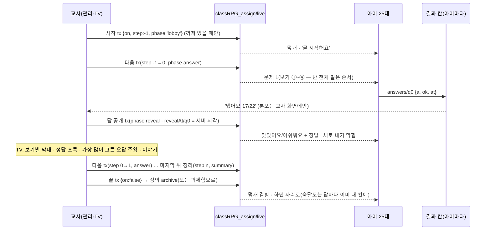

# 과제 · 수업 설계 (CLASS-ASSIGN-1)

> 2026-10-04 설계 · **2026-10-05 핵심 구현(P1 · P3 · P4 · P5) + 반박 검토 19건 반영**(§19) · 갈래 `feat/class-assign`(origin/main `9450d302` 위). 기초 코딩 · 음악실 앱 쪽(P6)은 다음 단계가 `common/assign.js` 계약에 붙인다. PR 은 **draft** — 선생님이 시연을 본 뒤에 넣는다.
> **구현하면서 바뀐 것(이 문서 본문도 고침)**: 교사 기기 연결 · 빠진 아이를 `live` 밖으로(§3) · 갇힘 방지를 서버 시각 빈 틈으로(§5-1) · 숙달도 기록을 problemRecords 대신 아이 칸 `mine/<나>`(§11) · study.js 꺼내기(P2) 대신 실행기 자체 그리기 + 같은 `.st-*` 글꼴(§6-2) · 보기 채점을 보기 번호로(§6-3) · 하위 앱 결과는 부모 학생 화면이 쓴다(§7) · '지금 모두 같이'는 1차에 문제 묶음만(§16 R6).
> 사용자(교사)가 §1 의 구조에 '좋아'(10-04). 이 문서는 그 **무엇 · 어떻게**를 바꾸지 않고, 코드를 읽은 뒤 **속 구조**만 더 낫게 고쳤다(§2 — 바꾼 까닭을 하나씩).
> 읽은 코드: `student.js`(openExternalEmbed · closeExternalEmbed · 모달 · 접속 시간 · 홈 buildMainHTML '오늘' · 생각판 홈 감시) · `student/study.js`(startStudySession · pickStudyQuestions · 문제 그리기 · 채점 · problemRecords · 숙달도) · `student/deco.js`(decoFlush · 애니메이션) · `student/battle.js`(타이머) · `gamedata.js`(DB 층 · STUDENT_KNOWN/COLD · _initStudentNodes · saveProblemRecord) · `admin.html`/`admin.js`(nav) · `admin/study.js` · `admin/settings.js`(백업 루트) · `coding/js`(app · play · store · teacher · stages) · `music/js`(app · rhythm · store · library · song) · `common/*` · `thinkboard`(교실 TV `#/tv/<id>`) · `curriculum.js`(문제 은행 실측) · `scripts/unit/*`(검사들).

---

## 0. 한눈에 (열 줄)

1. 새 루트 **`classRPG_assign`**(classRPG_v3 **밖**)에 과제 정의 · 수업 상태 · 결과를 둔다. 학생 기기는 `live` · `hosts` · `open`(작음)과 **내 칸들**(`results/<과제>/<나>` · `mine/<나>` · `excused/<수업>/<나>`)만 **직접** 듣는다(생각판 홈 [THINKBOARD-HOME-1] 과 같은 길 · 남의 결과 0). **gamedata.js DB 층은 한 줄도 안 바꾼다.**
2. 결과는 아이마다 따로 `results/<과제>/<아이>` **아래 경로만** `update` 한다(통째 set 0 · 남의 칸 쓰기 0).
3. 아이 쪽은 새 파일 `student/assign.js` 하나: 홈 '오늘' 맨 위 과제 카드 · 과제함 실행기(학습 창과 같은 꼴) · 수업 덮개(맨 위 · 밑의 화면은 그대로 멈춤).
4. 문제 화면은 실행기가 **오늘의 학습과 같은 `.st-*` 글꼴**로 그린다(study.js 는 꺼내지 않음 — 오늘의 학습 회귀 0 · §6-2). 받아쓰기 채점 · 소리 · 별 셈 같은 작은 도구만 study.js 것을 부른다.
5. 교사 쪽은 관리 화면 새 쪽 **`📝 과제·수업`**(`admin/assign.js`), TV 는 새 하위 앱 **`assign/index.html`**(새 창 · 교실 컴퓨터에서 따로 열어도 됨).
6. 규칙과 셈은 **`common/assign-core.js`** 한 파일 — 클래식 태그로도, ES 모듈로도 읽힌다. 학생 · 관리 · TV · 하위 앱 · 노드 시험이 **같은 함수**를 쓴다.
7. 기초 코딩 · 음악실 리듬은 **`common/assign.js`**(모듈) 계약으로 `?assign=<과제>` 를 받아 그 판/곡만 열고 자기 칸에 결과를 쓴다.
8. 수업 방은 **선생님만 끝낸다.** 대신 갇힘 방지: 교사 기기(관리 · TV)가 **모두 3분 넘게** 끊기거나(서버 시각으로 센 빈 틈 — 기기 · 새로고침마다 같은 답) 정한 시간(기본 **40분**)이 지나면 아이 화면이 스스로 풀린다. 15분 넘게 빈 수업은 '멈춘 수업' — 교사가 돌아와도 저절로 다시 덮지 않고 [이어 하기]를 눌러야 덮는다.
9. 함께 푼 문제는 **내 숙달도 칸 `classRPG_assign/mine/<나>/<과제>`**(답과 같은 update 한 번)에 남아 숙달도 · 복습 · 단원 성취 · '최근 틀린 문제'에 들어간다. problemRecords(반 전체가 받는 노드)에는 쓰지 않으므로 오늘의 학습 하루 10문제 · 보상 셈과는 저절로 따로다.
10. 보상 없음(정의에 `reward: null` 자리만) · 순위 · 속도 점수 없음 · TV 이름 기본 숨김 · 수업 중 관리 화면도 이름 가리기(TV 에 비출 때).

---

## 1. 사용자가 정한 것 (바꾸지 않는 약속)

| 칸 | 정한 것 |
|---|---|
| 내용 | **문제 묶음**(국어 · 수학 · 사회 · **영어**) — 고르는 법 둘: **직접 고르기**(단원 → 문제 목록 미리 보기 체크) · **자동 뽑기**(과목 · 단원 · 개수 → 보낼 때 한 번 뽑아 반 전체 같은 문제) |
| 내용 | **기초 코딩** 판 1~3개 · **음악실 리듬 게임** 곡 + 빠르기 |
| 넣지 않음 | 명화 탐정(TV 함께 보기가 맞음) · 먹 · 판화 · 수채화 · 데생(결과가 그림/종이) · 생각판(이미 교사가 여는 구조) · 리코더(아이가 스스로 별) · 작곡(나중) · 물감 · 무늬(2단계) |
| 보내는 법 ① | **과제함에 넣기**(끊지 않음): 홈 '오늘' 맨 위 '선생님 과제 N' 카드 · 배지. 여러 과제가 열려 있을 수 있다. 선생님이 닫는다 |
| 보내는 법 ② | **지금 모두 같이**(수업 모드): 로그인한 아이 화면 위에 '선생님과 수업 중' 방이 바로 덮인다. 하던 것은 지우지 않고 밑에 멈춰 둔다(꾸미기 편집 중이면 먼저 저장). 아이는 나갈 수 없다 — **선생님만 끝낸다**. 끝나면 하던 자리로. 늦게 로그인 · 재연결한 아이는 바로 그 방으로 |
| 진행 | **각자 풀기**(같은 문제를 각자 속도 · 다 하면 '다 했어요' 기다림) · **한 문제씩 같이**(선생님이 넘김 · 답 공개 · TV 에 보기별 막대 · 가장 많이 고른 오답 강조 · 이야기) |
| 보상 | 없음(경제는 사용자 결정 — 나중에 켤 수 있게 자리만) · 속도 점수 · 순위 없음(3~4학년) |
| 결과 | 반 **명단 기준** 표(안 한 아이도 보임): 상태(안 함 / 하는 중 / 끝) · 점수 · 시간 · 문제 묶음은 **문제별 보기 분포** · 오답 · TV 는 **이름 숨김**(교사가 켤 수 있음) |
| 숙달도 | 함께 푼 문제도 아이 문제 기록에 들어가 개인 복습에 반영(오늘의 학습 하루 10문제 보상과는 따로) |

---

## 2. 핵심 결정 — 제안의 속 구조에서 바꾼 것과 까닭

| # | 제안 | 이 설계 | 까닭(코드에서 확인한 것) |
|---|---|---|---|
| **D1** | `classRPG_v3/assignments · classLive · assignResults` + 학생 `STUDENT_KNOWN` 에 더하기 | **새 루트 `classRPG_assign`** + 학생 기기는 `live` · `hosts` · `open` · 내 칸들을 **직접** 듣는다 | ① 학생: KNOWN 노드가 바뀔 때마다 `_studentEmit → _onSnap → _ingest`(반 전체 학생 정규화 · 원문 비교) → onDataChange → `renderHUD · renderMain · renderMobile` 이 **25대 모두에서** 돈다(student.js 77~101줄). '다음 문제' 한 번마다 — 덮개 밑이라 헛일. 직접 들으면 덮개만 바뀐다. ② 교사: 관리 화면은 classRPG_v3 **root** 를 `on('value')`(gamedata.js 83줄) — 결과가 그 안이면 아이가 답을 낼 때마다 root 스냅샷 재구성 + `_ingest` + `renderAll`(대시보드 · 학생 표 · 승인 격자 …) — 수업을 이끄는 바로 그 화면이 25번 버벅인다. 밖이면 0번. ③ 학생 구독 = `shallow ∪ KNOWN − COLD`(gamedata.js 220줄) — `assignResults` 가 운영에 생기는 순간 COLD 에 안 넣으면 **모든 아이가 반 전체 결과**를 받는다. ④ 선례: 백업을 root 밖으로 뺀 [ER-4](admin/settings.js 559줄) · 생각판 목록 직접 듣기(student.js 371줄) · 학습 앱마다 `classRPG_<앱>`. ⑤ 하위 앱 원칙 "classRPG_v3 는 읽지도 쓰지도 않는다"(common/rpg-firebase.js 머리)를 지킨다. ⑥ 고위험 DB 층(SYNC-MERGE-2) · student-known-check · STUDENT_COLD 를 **안 건드린다** |
| **D2** | 과제 = 문제 id 목록 | 과제 정의에 **문제 사본**(은행의 문항 객체 그대로 + 보기를 보낼 때 **한 번** 섞은 순서) | 반 전체 · TV 가 **같은 보기 순서**(①②③④ 로 말할 수 있게) · TV 가 curriculum.js(856KB) 없이 그린다 · 선생님이 만든 문제를 나중에 지워도 · 아이 기기 캐시가 달라도 같은 문제. 크기: 문항 한 개 중앙값 214B · 최대 487B → 10문항 ≈ 2~3KB(+지문 한 편 ≤ 1.7KB) |
| **D3** | 학습 창을 '과제 모드'로 | 같은 **실행기 코드**, 그릇 **둘**: 과제함 창 `#m-assign`(학습 창과 같은 모양) · 수업 덮개 `#class-live` | 수업이 덮일 때 밑에 오늘의 학습 창이 **풀던 그대로** 있어야 한다. 학습 창은 전역 `STUDY_SESSION` · `#study-body` · `study-input` id · 연습장 전역 `SCRATCH_CTX` 를 쓴다 — 같은 그릇을 쓰면 밑의 풀이가 지워진다. 실행기는 인스턴스('i' 과제함 · 'l' 수업)마다 id 머리(`asgi-` · `asgl-`)와 상태를 따로 |
| **D4** | (없음) | 진행(다음 · 앞 · 답 공개 · 정리)은 `live` **transaction** — '지금 그 단계일 때만' 바꾼다 | 관리 화면과 TV(또는 교사 기기 둘)가 같은 순간 '다음'을 눌러도 한 칸만 |
| **D5** | 선생님만 끝냄 | + 갇힘 방지 넷: `endsAt`(기본 **40분** · 10~120) · 교사 기기 연결 **`hosts/<연결>`(live 밖)** `{on:true, at}` → onDisconnect `{on:false, left:서버 시각}` · 빈 틈 **3분** 풀림 · **15분** 멈춘 수업 · 어느 교사 기기에서든 끝내기 · 아이 한 명 '빼기'(`excused/<수업>/<아이>` — live 밖) | 교사 노트북이 꺼지면 25명이 갇힌다. 아이는 여전히 스스로 못 나간다. host 를 live 안에 두면 시작 update 가 켜 둔 TV 의 연결 표시를 지운다(반박 #1) |
| **D6** | `status` 칸 | 상태는 **답에서 끌어낸다**: 낸 문항 수 == 문항 수 → 끝 · 답 ≥ 1 또는 `startedAt`(처음 연 때) → 하는 중 · 없음 → 안 함. 걸린 시간 = 처음 연 때 ~ 마지막 답(서버 시각). `doneAt` 은 보조 | 탭 둘 · 느린 와이파이 · 새로고침에도 상태가 거꾸로 가지 않는다(반박 #10) |
| **D7** | (없음) | 숙달도는 **아이 칸 `mine/<아이>/<과제>/q/q<i>` = { p 문항 id, u 단원, c 맞음, d 날짜 }** — 답과 **같은 다중 경로 update** 로. 학생 화면이 내 칸만 듣고 오늘의 학습 기록 꼴로 바꿔(id `prob_<날짜>_<아이>_asg_<과제>`) 숙달도 셈에 더한다 | problemRecords 는 모든 학생 기기가 반 전체를 받는다 — 과제 기록을 거기 쓰면 1년 2.5~3MB(반박 #5). 기록 id 를 기존 키 차례(`prob_<날짜>_…`) 안에 두어 '최근 8건'이 날짜 차례를 지킨다(반박 #4). 답과 한 번에 써서 '기록 보충' 셈이 필요 없다 |
| **D8** | `common/assign.js`(ES 모듈) | `common/assign-core.js`(**IIFE → `globalThis.AssignCore`** · 클래식 · 모듈 겸용) + `common/assign.js`(모듈 · 하위 앱 계약) | 학생 · 관리는 클래식 `<script>`(모듈 전환 금지 — module_architecture §7), TV · 하위 앱은 모듈. 셈 · 경로 · 상태 규칙이 두 벌이 되면 어긋난다 → 한 파일을 두 길로 읽는다 |
| **D10** | (없음) | 시작 = **`live` transaction**(수업 중이 아닐 때만) → 성공하면 정의 `set` · 과제 id 는 **만들기 창을 열 때** 정함 | 두 관리 탭이 동시에 시작해도 하나 · [보내기]를 여러 번 눌러도 같은 자리라 과제 하나(멱등 · 반박 #1 · #11) |
| **D11** | (없음) | 보기 채점 = **고른 보기 번호(`ci`)로 사본 보기 글자를 그대로(===)** · 분포도 번호로 · `normAns` 는 글 · 수 답 묶기에만 | `CurriculumUtils.isCorrect` 는 공백을 지우고 견줘, 보기끼리 공백만 다른 17문항의 오답 43개가 정답으로 셈(반박 #3 · 시험 B1 이 막음). 오늘의 학습 쪽 같은 버그는 범위 밖 — 따로 알림 |
| **D12** | (없음) | 하위 앱(iframe) 결과는 `postMessage('rpg:assign-report')` → **부모 학생 화면이 내 칸에 쓴다**(2초 안에 답이 없으면 앱이 직접) | 쓰는 곳이 하나라 iframe 을 닫아도(about:blank) 결과가 남는다(반박 #14) |
| **D13** | (없음) | 덮개 화면은 **화면 열쇠(view · 문항 · 공개 여부)가 바뀔 때만** 다시 그리고, 그 밖의 수업 상태 변경(TV 이름 · 10분 더 · 교사 연결)은 상태 줄만 | 쓰던 글 · 분수 칸 · 연습장 그림이 지워지지 않게(반박 #7 · 시험 B14) |
| **D9** | (없음) | 덮개 z-index **100000**(작품 라이트박스 99999 위) · 밑의 iframe 에는 `postMessage({type:'rpg:classlive', on})` 멈춤 신호 | student.css · student.html 의 층: 창 100 · 레벨업 999 · 꾸미기/학습 앱 9000 · 친구 마당 9100 · 토스트/업적 9999 · 라이트박스 99999 |

---

## 3. 데이터 모양

### 3-1 루트와 경로

```
classRPG_assign/                                   (새 루트 — classRPG_v3 밖. 학습 앱 루트 classRPG_<앱> 과 같은 자리)
  live                      수업 모드 지금 상태(하나뿐) — 모든 학생 기기 · 관리 · TV 가 듣는다          ~0.3KB
  hosts/<c>                 교사 기기(관리 화면 로그인 · TV) 연결 — { on:true, at } → 끊기면 { on:false, left } (live 밖)   칸당 ~60B
  open/<aid>                열린 과제 정의 — 모든 학생 기기가 듣는다(열린 것만 — 닫으면 archive 로)       과제당 ≤ 6KB
  archive/<aid>             닫은 과제 정의(+ closedAt) — 관리 화면이 펼칠 때만(최근 30, orderByKey)
  results/<aid>/<sid>       아이 한 명의 결과 — 그 아이의 학생 화면만 쓴다(하위 앱 결과도 부모가 대신)     아이당 ≤ 1KB
  mine/<sid>/<aid>          아이의 숙달도 칸 { s 과목, q: { q3: { p, u, c, d } } } — 그 아이만 쓰고 그 아이만 듣는다   과제당 ~0.6KB
  presence/<aid>/<sid>/<c>  수업 방에 들어와 있는 연결(탭 하나 = c 하나) { at, v 보임/숨김, b 전투 중 } — onDisconnect 로 지워짐
  excused/<aid>/<sid>       선생님이 뺀 아이(live 밖 — 수업을 새로 시작하면 저절로 비어 있음)
```

- 과제 id `aid` = `'a' + Date.now().toString(36) + 무작위 3자`(예: `amg9x0k2q7fq`) — 글자 순서 = 만든 순서라 `orderByKey().limitToLast(30)` 이 색인 규칙 없이 된다.
- 문항 열쇠 = **자리 `q0 … q(n-1)`**(숫자 키는 RTDB 가 배열로 돌려줄 수 있어 'q' 를 붙인다). 보낸 뒤 문항은 못 바꾸므로 자리가 곧 문항이다(문항 id 는 정의의 `items[i].id`).
- 연결 id `c` = 학생은 페이지마다 `'c' + 무작위 6자` · 교사 기기는 **이어질 때마다 새 칸**(`ad…-1`, `ad…-2` · TV `tv…`) — 끊긴 칸은 지우지 않고 `left` 만 남겨 빈 틈을 다시 셀 수 있게. 관리 화면이 이틀 지난 끊긴 칸을 정리한다.

### 3-2 과제 정의 `open/<aid>` (교사만 쓴다)

| 칸 | 모양 | 뜻 |
|---|---|---|
| `id` | 문자열 | `aid` |
| `title` | ≤ 40자 | 아이 화면 제목(만들 때 자동: '수학 · 분수 10문제' — 고칠 수 있음) |
| `kind` | `'quiz'` \| `'coding'` \| `'music'` | 내용 종류 |
| `content.quiz` | `{ subject, items:[문항 사본…] (1~30), passages:{<pid>:{id,title,text}}, src:{how:'pick'\|'auto', units:[…], n, cat} }` | 문항 사본 = 은행 문항 객체 그대로(id · unitId · type · cat · level · q · a · alt · choices · hint · fig · audio · lang · passageId) — **choices 만 보낼 때 한 번 섞음**(OX 는 O · X 그대로) |
| `content.coding` | `{ stages:['2-3','2-4'] }` (1~3) | 기초 코딩 판 id(coding/js/stages.js · 66판) |
| `content.music` | `{ song:'lib_nabiya', level:'easy'\|'normal'\|'hard'\|'expert', tempo:1\|0.8, keys:0\|4\|6\|8 }` | 음악실 기본 곡 15곡 중 하나 · 난이도 · 빠르기 · 키 수(0 = 난이도 기본 · 아이 기기 설정 무시 — 반박 #15) |
| `deliver` | `'inbox'` \| `'live'` | 보내는 법 |
| `pacing` | `'self'` \| `'step'` | 진행(과제함 = 늘 self · step 은 문제 묶음 + 수업만) |
| `showAnswer` | bool(기본 true) | 각자 풀기에서 문제마다 정답을 바로 보여 줄지(끄면 끝/정리 때) |
| `targets` | `null` \| `[sid…]` | null = 반 모두 |
| `roster` | `{ <sid>: '이름' }` | 만든 때 받는 아이 이름 — TV · 하위 앱이 classRPG_v3 를 안 읽게 |
| `reward` | `null` | **자리만**(나중: `{exp, gold, mode:'approve'}` → 끝낼 때 `DB.addPendingReward` 로 승인 대기) |
| `createdAt` · `closedAt` | 서버 시각 | |
| `fromLive` | bool | 수업을 끝내며 과제함으로 남긴 것 |

### 3-3 수업 상태 `live` (교사 기기만 쓴다)

| 칸 | 모양 | 뜻 |
|---|---|---|
| `on` | bool | 수업 중 |
| `aid` · `kind` · `pacing` | | 지금 수업의 과제(정의는 `open/<aid>`) |
| `step` | 정수 | 한 문제씩: −1 = 기다림, 0…n−1 = 문항, n = 정리 |
| `phase` | 한 문제씩 `'lobby'·'answer'·'reveal'·'summary'` · 각자 `'run'·'summary'` | |
| `names` | bool | TV 에 이름 보이기(기본 false) |
| `startedAt` · `resumeAt` · `endedAt` | ms(서버 시계) | 시작 · **이어 하기**(멈춘 수업을 다시 켤 때 — 빈 틈은 이 뒤로만 센다) · 끝 |
| `endsAt` | ms(서버 시계) | 안전 끝(기본 40분) — 지나면 아이 화면이 스스로 풀린다. '10분 더' 로 늘림 · 읽을 때 시작 뒤 120분까지만 |
| `revealAt/q<i>` | ms(서버 시계) | 그 문항을 공개한 때 — 이보다 늦게 서버에 닿은 답은 '늦게 냄'(분포 · 정답률에서 뺌) |
| `rev` | 정수 | 바꿀 때마다 +1(순서 · 디버그) |

교사 기기 연결(`hosts`)과 빠진 아이(`excused`)는 **live 밖**에 둔다 — 시작이 live 를 통째로 쓰면 이미 켜 둔 TV 의 연결 표시가 지워졌다(반박 #1).

### 3-4 결과 칸 `results/<aid>/<sid>` (그 아이 기기만 쓴다)

| 칸 | 모양 | 누가 · 언제 |
|---|---|---|
| `startedAt` | 서버 시각 | 처음 연 때 · 첫 답 · 첫 실행(없을 때만) |
| `doneAt` | 서버 시각 | 보조 — 상태는 답에서 끌어낸다(D6). 문제 묶음: 마지막 답과 같이 · 코딩: 모든 판을 풀었을 때 · 리듬: 한 곡을 끝까지(친 음표 ≥ 1) |
| `answers/q<i>` | `{ a: 고른/쓴 답(≤80자), ci: 고른 보기 번호(보기형), ok: bool, at: 서버 시각, skip?: true(소리 없는 기기 건너뛰기) }` | 문제 묶음 — 답 하나마다 |
| `app/score` · `app/total` | 수 | 코딩: 푼 판 수 / 판 수 · 리듬: 가장 좋은 정확도(0~100) / 100 |
| `app/attempts` | 수(`ServerValue.increment(1)`) | 코딩 실행 · 리듬 판 수 |
| `app/detail/<열쇠>` | 작은 객체(≤1KB) + `rank` | 코딩 `<판>`: `{rank, ok, st 별, n 블록, tries, why:{까닭: 수}}` · 리듬 `best`: `{rank, score, acc, grade, maxCombo, perfect, great, good, miss}` — **rank 가 더 클 때만** 써진다 |

### 3-5 연결 표시

- 아이: 수업 방에 들어가면 `presence/<aid>/<sid>/<c> = true` + `onDisconnect().remove()`. 방이 닫히면 지운다. `.info/connected` 가 다시 true 가 되면 다시 쓴다(onDisconnect 는 끊길 때 서버에서 이미 돌았으므로).
- 교사: 관리 화면에 로그인했거나 TV 문을 통과하면(수업이 없어도) `hosts/<새 칸> = { on:true, at:TIMESTAMP, w:'admin'|'tv' }` + `onDisconnect().update({ on:false, left:TIMESTAMP })` · 다시 이어질 때마다 새 칸.
- 탭이 여럿이어도 연결마다 키가 따로라 하나를 닫아도 '접속 중'이 남는다.

### 3-6 classRPG_v3 에는 아무것도 안 쓴다 — 숙달도는 아이 칸 `mine/<나>`

반박 #5 를 받아 problemRecords 에 쓰지 않는다. 답 하나의 update 에 `mine/<나>/<과제>/q/q<i> = { p, u, c, d }` 를 같이 넣고(§6-4),
학생 화면이 `AssignCore.masteryRecords(mine, 나)` 로 오늘의 학습 기록과 같은 꼴을 만든다:

```
{ id: 'prob_<날짜>_<sid>_asg_<aid>', studentId, date, subjectKey, unitId(가장 많이 나온 단원),
  total, correct, wrongIds:[문항 id…], answers:[{ problemId, unitId, correct }…], review: false, assign: '<aid>' }   ← 과제 하나 · 날짜 하나마다 한 건
```

study.js 의 세 곳(masteryMap · getUnitStats · pickStudyQuestions '최근 8건')이 `typeof asgMasteryRecords === 'function'` 가드로 이것을 더한다.
getTodayStudyRecords(하루 10문제 · 보상 셈)는 problemRecords 만 보므로 그대로다.

### 3-7 누가 쓰고 누가 듣나

| 경로 | 쓰는 쪽 | 쓰는 법 | 듣는 쪽 |
|---|---|---|---|
| `live` | 관리 · TV(교사) | 시작 · 끝 · 다음/앞/공개/정리 · 이어 하기 · 10분 더 = **`live` transaction**(그 단계일 때만) · TV 이름 = `live/names` set | 학생 전부 · 관리 · TV |
| `hosts/<c>` | 관리 · TV | set + onDisconnect update(left) | 학생(갇힘 방지) · 관리(멈춘 수업 물음) |
| `open/<aid>` | 관리 | 보내기 = `set`(새 과제 하나 · 교사만 쓰는 정의 · 같은 id 라 여러 번 눌러도 하나) · 닫기 = 다중 경로 `update { open/<aid>: null, archive/<aid>: … }` · 과제함으로 남기기 = 칸 update | 학생 전부(목록 통째 — 열린 것만이라 작다) · 하위 앱(그 aid 하나) · TV |
| `archive/<aid>` | 관리 · TV(끝내기) | 위 닫기 update · 다시 열기 = 반대 | 관리(펼칠 때) · 하위 앱(닫힌 과제를 늦게 열면) · TV(`#/a/<aid>`) |
| `results/<aid>/<sid>` | 그 아이의 학생 화면(하위 앱 결과도 부모가) | **그 칸 아래 경로만 루트 다중 경로 `update`**(+ increment) — 통째 set 0 | 그 아이(자기 칸 하나 — 탭끼리 맞추기) · 관리(열린 과제 · 고른 과제 · 수업 과제) · TV |
| `mine/<sid>/<aid>` | 그 아이 | 답과 같은 update | 그 아이만 |
| `presence/<aid>/<sid>/<c>` | 그 아이 | set + onDisconnect remove | 관리 · TV(들어온 아이 수 · 전투 중 · 다른 화면) |
| `excused/<aid>/<sid>` | 관리 | set / null | 그 아이(자기 칸 하나) · 관리 |

학생 기기가 새로 듣는 것: `classRPG_assign/live` · `hosts` · `open` · 나에게 온 열린 과제마다 `results/<aid>/<내 id>` · `mine/<내 id>` · 수업 중이면 `excused/<수업>/<내 id>` · `.info/connected` · `.info/serverTimeOffset`. **남의 결과는 안 받는다.**

### 3-8 크기 어림 (실측 바탕)

| 무엇 | 크기 |
|---|---|
| 문제 은행(4-1 · curriculum.js + 지문) | 2,516문항 — 수학 750 · 국어 620 + 지문 문항 156(지문 39편) · 사회 600 · 영어 390 / 보기 1,532 · 수 539 · 글 427 · 분수 18 / 그림 119 · 소리 290 |
| 문항 사본 하나 | 중앙값 214B · 95% 335B · 최대 487B |
| 과제 정의(10문항 + 지문 하나 + 명단 25) | ≈ 4~6KB |
| 결과 칸(10문항) | ≈ 0.7KB · 반 25명 ≈ 17KB / 과제 |
| 한 해(주 3번 × 36주 ≈ 108개) | 결과 ≈ 1.9MB · 보관 정의 ≈ 0.6MB |
| 학생 기기가 수업 시작 때 받는 것 | live 0.3KB + 열린 정의(≤ 5개) ≤ 30KB |
| **학생 기기 로그인 1회 다운로드**(반박 #5) | live · hosts(≤ 3KB) + 열린 정의 ≤ 30KB + 내 결과 칸(열린 과제마다 ≤ 1KB) + 내 숙달도 칸(1년 108과제 × 0.64KB ≈ 70KB) ≈ **0.1MB** — problemRecords 에 썼다면 1년 뒤 반 전체 2.5~3MB 를 아이마다 받았을 것 |
| 실측(시험 B1) | 정의(국어 10문항 + 지문 + 명단 25) 3.2KB · 결과 칸(10문항) 0.6KB · 숙달도 칸 0.64KB |

### 3-9 DB 규칙

- 지금 RTDB 규칙은 코드 밖(콘솔)이다(docs/rpg_overhaul_plan_2026_summer.md 28줄 '파일 없음'). 학습 앱 루트가 생길 때마다(`classRPG_print` 10-04 · `classRPG_paint` 등) 규칙을 따로 고치지 않고 바로 동작했다 → 새 루트도 같은 조건으로 본다. **머지 전 운영 리허설(§20)에서 실제로 쓰이는지 확인**.
- 신뢰 수준은 다른 곳과 같다(누구나 쓸 수 있는 DB) — 보안 규칙은 사용자 결정으로 내년. 그래서 받은 정의 · 결과는 모두 **믿지 않는 글**로 다룬다(§13 · §16 R2).

---

## 4. 흐름

### 4-0 만들기 → 보내기 (교사, 모든 경우 공통)

1. 관리 화면 `📝 과제·수업` → [+ 새 과제].
2. **무엇을**: [문제 묶음] [기초 코딩] [음악실 리듬] 중 하나 → 고르기(§8-2).
3. **이름** 자동 채움(고칠 수 있음) · **누구에게** 우리 반 모두 / 골라서.
4. **어떻게**: [📥 과제함에 넣기] 또는 [🔴 지금 모두 같이](1차는 **문제 묶음만** — 코딩 · 리듬은 과제함만, §16 R6) → 같이면 진행 [각자 풀기] / [한 문제씩 같이] · 안전 시간(**40분**) · '문제마다 정답 보여 주기'(각자 풀기 · 기본 켬).
5. [보내기] — 과제 id 는 **만들기 창을 열 때** 정해 둔다(여러 번 눌러도 같은 자리 = 과제 하나) · 단추는 보내는 동안 잠김 · 같은 내용(문항 id 목록 · 판 · 곡)이 이미 열려 있으면 경고. 같이면 확인 한 번("지금 로그인한 아이 화면에 수업 방이 열려요. 하던 것은 그대로 멈춰 둬요.").
   - 과제함: `open/<aid>` set 하나.
   - 같이: **`live` transaction**(수업 중이 아닐 때만 켬) → 성공하면 `open/<aid>` set. 이미 수업 중이면 "지금 수업을 끝내고 새로 시작할까요?" → 앞 수업 끝내기(transaction) · 닫기 → 새 수업.
   - 열린 과제를 그대로 수업으로: 목록 [수업으로] → [한 문제씩 같이] / [각자 풀기] — 같은 결과 칸(이미 낸 답은 건너뜀).

### 4-1 과제함 · 문제 묶음

| 단계 | 교사(관리) | 아이 | TV |
|---|---|---|---|
| 보냄 | 목록에 '열림' · 결과 표(모두 '안 함') | 홈 '오늘' 맨 위 `📝 선생님 과제 1개` 카드 · 레일 배지 '할 일'에 +1 · 하던 것 그대로 | — |
| 엶 | — | 카드 누름 → 과제함 창(학습 창과 같은 크기 · 같은 글씨) · 제목 `📝 선생님 과제 · 분수 복습` · 1/10 | — |
| 풂 | 표가 실시간(하는 중 · 몇 개 · 맞힘) | 문제 → 답 → (정답 보여 주기면) 맞았어요/아쉬워요 + 정답 + 별 변화 → 다음. **답 하나마다 저장**(창을 닫아도 남음 — 오늘의 학습과 다른 점) | — |
| 닫았다 다시 | — | ✕ 는 묻지 않고 닫는다(이미 저장됨) · 다시 열면 **안 푼 첫 문제부터** | — |
| 끝 | 상태 '끝' · 점수 · 걸린 시간 | 결과 화면(점수 · 다시 볼 문제) · 숙달도는 답마다 이미 들어감 · 카드는 `✓ 다 했어요`(선생님이 닫을 때까지) | — |
| 닫기 | [닫기] → archive · 결과는 그대로 | 카드가 사라짐 · 푸는 중이었으면 "선생님이 이 과제를 닫았어요. 낸 답은 그대로 남아요"(창 안 [닫기]) · 낸 답 · 숙달도 그대로 | — |

### 4-2 과제함 · 기초 코딩 / 음악실 리듬

| 단계 | 교사 | 아이 | TV |
|---|---|---|---|
| 엶 | — | 카드 → `openExternalEmbed('coding', '&assign=<aid>')`(지금 학습 앱 창 그대로 — ✕ · Esc · 뒤로로 닫힘). 음악은 `'music'` | — |
| 코딩 | 표: 판마다 ★ / 실행 수 / 막힘(못 풀고 실행 5번 이상 — 막힘 지도와 같은 기준 `tries >= 5`) | 앱 첫 화면 대신 **과제 쪽**: '선생님 과제 · 2판' 판 목록(잠금 없이 열림) → 판 → 이긴 카드 '다음 판'은 **과제의 다음 판** · 과제에서 처음 여는 판은 '새 종이'(전에 푼 코드가 아니라 판의 처음 모양) | — |
| 리듬 | 표: 가장 좋은 등급 · 정확도 · 판 수 | 그 곡 리듬 화면이 바로 · 난이도 · 빠르기 칸 대신 '선생님이 정한 것' 표시 · **우리 반 최고 기록판은 숨김**(순위 없음) · 끝까지 치면 결과가 자기 칸에 | — |

### 4-3 수업 · 각자 풀기 · 문제 묶음

| 단계 | 교사(관리) | 아이 | TV |
|---|---|---|---|
| 시작 | 위에 빨간 **수업 띠**: 들어온 아이 n/N(안 들어온 이름) · 다 한 아이 · [결과 보기] [이름 TV에] [10분 더] [끝내기 ▾] | 무엇을 하든 **바로** 덮개 `👩‍🏫 선생님과 수업 중 · 제목` · 문제 1 — 밑은 그대로 멈춤(§5) | 제목 · '다 한 친구 0 / 24' · 익명 점(○ 아직 · ◐ 하는 중 · ● 다 함) |
| 풂 | 표 실시간 | 과제함과 같은 실행기(정답 보여 주기 설정대로) · 소리 문항은 **자동 읽기 없음**(25대가 한꺼번에 소리) — 🔊 눌러 이어폰으로 | 점이 채워짐(이름 켜면 이름 칩 + ✓ — 점수는 안 보임) |
| 다 함 | — | "다 했어요! 선생님이 수업을 끝낼 때까지 기다려요" + 내 점수(정답 보여 주기면 다시 볼 문제) | — |
| 결과 보기 | [결과 보기] → `phase:'summary'` | 다 한 아이: 내 답과 정답(정답 보여 주기를 껐어도 이때) · 아직인 아이: 계속 풂 | 문제별 맞힌 비율 막대 · 가장 어려웠던 문제 · 문제를 누르면 그 문제의 보기 분포 |
| 끝 | [끝내기] 또는 [끝내고 못 한 아이는 과제함으로] | 덮개가 걷히고 **하던 자리 그대로** · 토스트 "수업이 끝났어요" · 못 한 아이에겐 과제함 카드(이어 하기) | '수업이 끝났어요' + 정리 화면 |

### 4-4 수업 · 한 문제씩 같이 · 문제 묶음



| 단계 | 교사 | 아이 | TV |
|---|---|---|---|
| 기다림 | 들어온 아이 n/N · [첫 문제 ▶] | '곧 시작해요 — 선생님이 첫 문제를 열면 여기에 나와요' | 제목 · '들어온 친구 22 / 24' · 곧 시작 |
| 묻기 | 문제 · **선생님만 보는 분포**(실시간) · 냈어요 17/22 · [답 공개] [앞] | 문제 · 번호 붙은 보기 · 한 번 내면 "답을 냈어요 ✓ 선생님이 정답을 보여 줄 때까지 기다려요"(**못 바꿈** — §17 Q2) | 문제 크게 · 보기 ①~④ · '냈어요 17 / 22'(분포는 아직 안 보임) · 소리 문항은 🔊 |
| 공개 | [다음 ▶] · 오답 낸 아이 이름(교사만) | 맞았어요 🎉 / 아쉬워요 + 정답 + 힌트 + 별 변화 · 안 낸 아이 "이 문제는 못 냈어요 — 정답은 …" | 보기별 막대 · 수 · % · 정답 초록 ✓ · **가장 많이 고른 오답 주황**("③을 고른 친구가 6명 — 왜 그렇게 생각했을까요?") · 글로 쓰는 문제는 정답 + 많이 쓴 다른 답 셋 |
| 앞 문제 | [◀ 앞] → 그 문제 '공개'로(공개한 적 없으면 '묻기') | 그 문제의 공개 화면(새로 못 냄) | 그 문제 막대 |
| 다음 | 이미 공개한 문항으로 가면 **공개 화면으로**(정답을 본 뒤 다시 묻지 않음) | | |
| 정리 | 마지막 '다음' → `summary` | "10문제 중 7개 맞혔어요" + 다시 볼 문제 · `doneAt` | 문제별 맞힌 비율 · 가장 어려웠던 문제 · 문제 누르면 그 막대(교사가 고르면 `step=i, phase=reveal`) |
| 끝 | 4-3 과 같음 | 4-3 과 같음 | 4-3 과 같음 |

### 4-5 수업 · 각자 · 기초 코딩 / 음악실 리듬 — **1차에는 하지 않음**(반박 #6)

> **10-05 [ASSIGN-CODING-1] 기초 코딩은 붙였다**(갈래 `feat/class-assign-coding` · draft) — 덮개 안 iframe `coding/index.html?…&assign=<과제>&live=1`(`student/assign.js` `ASG_LIVE_APPS`) · 관리 만들기에서 기초 코딩도 [🔴 지금 모두 같이](각자 풀기만) · 목록 [수업으로].
> 연결 수 걱정(R6)은 그대로다: 수업 중 아이 한 명 = 학생 화면 1 + 덮개 안 코딩 1(+ 밑에 학습 앱 창이 열려 있었으면 1) → 25명이면 50~75. **요금제(§17 Q10) 확인 전에는 코딩 수업 모드를 큰 반에서 쓰지 말 것** — 막을 곳은 `ASG_LIVE_APPS` 한 줄 · 관리 `_assignLiveOK`.
> 음악실 리듬은 아직 과제함만.

덮개 안 두 번째 iframe 은 아이마다 RTDB 연결을 하나 더 만든다(25명 × 최대 3 = 75 + 교사 · TV). 무료 요금제 동시 연결 100 에 닿을 수 있어
1차는 코딩 · 리듬을 **과제함만** 둔다(관리 화면 '지금 모두 같이' 단추가 막혀 있음). 아래 표는 연결 수를 확인한 뒤의 몫으로 남긴다.

| 단계 | 교사 | 아이 | TV |
|---|---|---|---|
| 시작 | 수업 띠 · 표(판마다 ★ / 실행 수 · 리듬 등급) | 덮개 안에 **두 번째 iframe** `coding/index.html?sid=…&n=…&assign=<aid>&live=1` — 밑의 학습 앱 창(#m-embed)이 같은 앱이어도 그대로 둔다 · 과제 쪽 · 다른 판으로 가는 길 숨김 | 코딩: 판마다 '푼 친구 n' · 많이 한 실수(막힘 지도와 같은 말) · 리듬: '끝까지 친 친구 n' · 정확도 평균 |
| 다 함 | 상태 '끝' | 덮개 맨 위 띠 "다 했어요! ✓ — 더 줄여 보거나 다시 쳐 봐도 돼요" · 기다림 | 수가 오름 |
| 끝 | 같음 | iframe 을 비운다(`about:blank` — 코딩은 pagehide 로 쓰던 코드를 저장) · 하던 자리로 | 정리 |

### 4-6 끝내기 · 닫기 · 과제함으로 남기기

| 단추 | 쓰기(루트 다중 경로 update 한 번) | 결과 |
|---|---|---|
| 수업 [끝내기] | `live` tx `{…, on:false, endedAt}` → `open/<aid>=null · archive/<aid>={…def, closedAt}` | 덮개 걷힘 · 과제 닫힘 |
| 수업 [끝내고 못 한 아이는 과제함으로] | `live` tx → `open/<aid>/deliver='inbox' · pacing='self' · fromLive=true · revealed=live.revealAt` | 못 한 아이 홈에 카드(이어 하기) · 다 한 아이는 ✓ · 수업에서 이미 공개한 문항의 답은 '늦게 냄'으로 셈 |
| 과제함 [닫기] | `open/<aid>=null · archive/<aid>=…` | 카드 사라짐 |
| 닫은 과제 [다시 열기] | `archive/<aid>=null · open/<aid>={…, deliver:'inbox'}` | 같은 결과 칸으로 다시 |
| 정의가 없는 수업(장난 · 실패) | 관리 화면 '과제 정의가 없는 수업' → [끝내기](aid 상관없이 끔) | |

---

## 5. 아이 쪽 수업 덮개 — 밑의 상태 보존

### 5-1 열고 닫는 조건 (한 함수 — `AssignCore.liveState`)

```
보인다 = 로그인함(CUR · enterGame 뒤) && live.on && open/<live.aid> 있음 && isTarget(def, 내 id)
         && !excused/<aid>/<내 id> && 서버 지금 < endsAt(시작 뒤 120분까지만)
         && 멈춘 수업 아님(since 뒤로 교사 기기 빈 틈이 15분 넘은 적 없음)
         && !(지금 교사 기기가 하나도 없고 마지막 떠난 서버 시각 + 3분 < 서버 지금)
since = max(live.startedAt, live.resumeAt)
```
- 서버 지금 = `Date.now() + .info/serverTimeOffset`(아이 기기 시계가 틀려도). 빈 틈은 `hosts` 칸들의 `[at, left]` 서버 시각으로만 센다 — **늦게 로그인 · 새로고침한 아이도 같은 답**(3분을 다시 세지 않는다 · 반박 #2).
- 교사 기기가 모두 끊기면 덮개 안 상태 줄 "선생님 화면이 꺼졌어요 — 조금 기다려 볼게요" → 3분 지나면 덮개를 걷고 토스트 "선생님 화면이 꺼져서 수업 방을 닫았어요". 빈 틈이 15분 안이면 교사 기기가 돌아올 때 **다시 덮는다**(노트북 재시동 등).
- 15분 넘게 빈 수업 = **멈춘 수업**: 다음 시간에 관리 화면을 열어도 저절로 덮지 않는다. 관리 화면이 "지난 수업이 아직 켜져 있어요 — [이어 하기] [끝내기]"를 묻고, 이어 하기 = `resumeAt` 을 지금으로(빈 틈은 이 뒤로만 셈) → 다시 덮음.
- 관리 화면 · TV 는 수업 중 `navigator.wakeLock` 으로 화면이 꺼지지 않게 한다(맥북 잠자기 → 와이파이 끊김 줄이기).
- 내 연결이 끊긴 동안(`.info/connected` false)에는 마지막으로 본 값으로 판정하고 상태 줄 "인터넷이 끊겼어요 — 다시 잇는 중이에요. 낸 답은 이어지면 보내요".

### 5-2 덮개 자체

- `#class-live` — body 끝에 처음 필요할 때 만든다(`_embedEl` 과 같은 방식 · student.html 손대지 않음) · `position:fixed; inset:0; z-index:100000` · 불투명 바탕 · 머리 줄 `👩‍🏫 선생님과 수업 중 · 제목` + 연결 점 · **닫기 단추 없음**.
- **포커스**: 열 때 `document.activeElement` 를 기억(학습 앱 안이면 iframe 요소) → 덮개(tabindex=-1)로 포커스를 옮겨 iframe 안의 키(리듬 A S D F · 마을 키)가 밑으로 안 가게. 닫을 때 되돌림(autoFocus 앱이면 `contentWindow.focus()`).
- **키**: student/assign.js 를 읽을 때 `window` **캡처** keydown 하나를 단다(deco.js 는 늦게 읽혀 그 뒤에 달리고, 지금 처리기들은 모두 document 버블 — student.js 510줄 · deco.js 5곳). 덮개가 열려 있으면 Escape 는 늘 `stopImmediatePropagation` + `preventDefault`(학습 앱 창 Esc 닫기 · 꾸미기 Esc 처리기까지 못 감) · 대상이 덮개 밖이면 다른 키도 막음 · Tab 은 덮개 안에서만.
  포커스 지킴이(0.5초마다) — 포커스가 덮개 밖(밑의 iframe 등)으로 가면 되찾는다. student.js 의 iframe load 처리기는 덮개가 열려 있으면 `contentWindow.focus()` 를 하지 않는다(반박 #18 ③).
- **뒤로**: 열 때 `history.pushState({ ...history.state, embed, asgLive: aid })` — 밑에 학습 앱 창이 열려 있는데 지금 칸에 `embed` 가 없으면 embed 칸을 먼저 하나 쌓는다. **student.js popstate 처리기 첫 줄 = 덮개가 열려 있으면 아무것도 안 함**(반박 #8 — 사용자 동작 없이 쌓은 칸은 크롬 '뒤로'가 건너뛸 수 있어, 연타하면 embed 없는 칸으로 떨어져 밑의 코딩 · 마을 창이 닫혔다). 덮개 쪽 popstate 처리기가 덮개 칸을 다시 쌓는다. 끝날 때 `history.state.asgLive` 면 `history.back()`.
- **새로고침 · 닫기**: 덮개 동안만 `beforeunload`(크롬은 아이가 한 번이라도 누른 뒤에만 묻는다). 그래도 나가면 다시 로그인했을 때 바로 방으로(§12).
- **스크롤**: `document.body.style.overflow` 를 기억했다가 그 값으로 되돌림(학습 앱 창도 'hidden' 을 쓰므로 '' 로 되돌리면 안 됨).
- 화면: 1366×610(크롬북) · 375×812(폰) · 화면 맞춤(SCALE_MODE) 모두 — 덮개는 `#s-game` 밖(body 아래)이라 transform 을 안 받는다. 문제 판은 학습 창과 같은 너비 `min(820px, 96vw)` · 폰은 꽉 채움.

### 5-3 밑에 있을 수 있는 것별

| 밑에 있는 것 | 어디 | 덮을 때 | 덮개 동안 | 끝날 때 |
|---|---|---|---|---|
| 홈 · 레일 · 폰 하단 탭 | `#s-game`(z 10) | 그대로 | onDataChange 가 지금처럼 다시 그림(과제 카드 포함) | 그대로 |
| 보통 창(상점 · 가방 · 농장 · 퀘스트 · 감정 · 주간 다짐 · 보스 …) | `.overlay`(z 100) | **닫지 않음** | 그대로 | 열린 채로 돌아옴 |
| **오늘의 학습 창** | `STUDY_SESSION` · `#study-body` | 그대로 — 실행기는 다른 그릇 · 다른 id(`asgl-*`) · 연습장은 캔버스마다 따로(§6-2 initStudyScratch) | 안 건드림 | 같은 문제에서 이어 풂 · 연습장 그림도 남음 |
| 과제함 실행기 | 인스턴스 'i' · `#m-assign` | 그대로 | 같은 결과 칸을 들으므로 수업에서 낸 답이 반영됨 | 이어 풂(이미 낸 문제는 건너뜀) |
| **전투** | `#m-battle` · `BATTLE_STATE` | 그대로 — 턴제라 아이 차례에서 기다린다. 이미 시작된 연출(setTimeout 사슬)은 끝까지 돌고 저장한다(student/battle.js) · 들어옴 표시에 `b:1` → 교사 수업 띠 "⚔️ 전투 중 n — 새로고침하면 진 걸로 쳐져요" | 아이가 못 누르니 멈춤 | 이어서 싸움(새로고침하면 지금 규칙대로 패배 — 기회를 돌려줄지는 §17 Q9) |
| **꾸미기 전체화면** · 친구 마당 | `#interior-fullscreen`(9000) · `#friend-fullscreen`(9100) | `typeof decoFlush === 'function' && decoFlush('수업')`(0.4초 묶음 저장을 지금) · `typeof _animPauseAll === 'function' && _animPauseAll()`(같은 줄 typeof — deco-lazy-check ② 가드) | 멈춤(CPU 아낌) | `_animResumeAll()` · 화면 그대로 |
| 끌던 장식 | pointer capture | 캡처 중이면 손을 뗄 때 캔버스가 받는다(지금 규칙대로 놓기) | — | — |
| **학습 앱 iframe** | `#m-embed`(9000) · `_embedState` | src 그대로 · `frame.contentWindow.postMessage({type:'rpg:classlive', on:true}, location.origin)` · 포커스를 덮개로 | 앱이 멈춤: 코딩 실행 멈춤 · 음악 소리 · 게임 멈춤(§7-5) | `on:false` · 포커스 되돌림 |
| 영어 앱(다른 도메인) · 우리 마을 | iframe | 메시지는 보내지만 안 듣는다 | 마을 3D 는 밑에서 계속 그린다(§16 R5) | 그대로 |
| 작품 라이트박스 | z 99999 | 덮개가 위 | | 그대로 |
| 레벨업 축하 | `lup-fx`(999) | `triggerLevelUp` 이 학습 앱 창처럼 미룬다(`_lupAfterEmbed`) | | 끝나면 한 번 |
| 업적 카드 | `ach-popup`(9999) | `_fxBusy()` 가 수업도 바쁨으로 본다(카드가 기다림 — 최대 3분 뒤엔 지금처럼 그냥 뜸) | | |
| 토스트 | z 9999 | 덮개 밑에 가려짐 → 덮개 안 상태 줄이 대신 | | |
| 읽어 주기 | speechSynthesis | `cancel()` | | |
| confirm · alert 가 떠 있음 | 브라우저 | 닫힐 때까지 JS 가 멈춘다 → 닫힌 뒤 덮개 | | |
| 쓰던 글(주간 다짐 칸 등) | input 값 | 그대로(저장 안 한 글도 남음) | | 그대로 |
| 접속 시간 끝 | `startAccessTimer` | 수업 동안은 내보내지 않음(30초마다 다시 봄) | | 끝난 뒤 다음 검사 때 |
| 로그인 화면 | `#s-login` | 로그인 안 한 화면에 '👩‍🏫 선생님과 수업 중이에요 — 로그인하면 바로 들어가요' 띠(반박 #18 ①) | | 띠 사라짐 |

### 5-4 끝날 때 되돌리는 순서

1. 실행기 정리(연습장 처리기 떼기). 숙달도는 답마다 이미 썼으므로 끝날 때 쓸 것이 없다.
2. presence 지우기 · beforeunload 떼기 · `history.back()`(우리가 쌓은 한 칸이면).
3. 덮개 숨김 → body overflow 되돌림 → 포커스 되돌림.
4. iframe 에 `on:false` · 꾸미기 `_animResumeAll()`(typeof 가드).
5. 미룬 레벨업 한 번(밑에 학습 앱 창이 아직 열려 있으면 지금 규칙대로 그 창을 닫을 때) · 토스트 "수업이 끝났어요".

---

## 6. 과제 실행기 (아이 쪽 · `student/assign.js`)

### 6-1 구조

- **`asgBoot()`** — 페이지 load 뒤(로그인 전에도 · DB.init 첫 줄이 앱을 만든 뒤) `classRPG_assign/live` · `hosts` · `open` · `.info/*` 를 듣는다(로그인 화면 띠 · 늦게 들어온 아이의 바로 입장). **`asgEnter()`** — `enterGame()` 끝(갈고리 한 줄)에서 내 칸들(`mine/<나>` · 열린 과제마다 `results/<과제>/<나>` · 수업 중 `excused/<수업>/<나>`)을 맞추고 덮개 판정. CUR 이 바뀌면(다른 아이 로그인) 내 칸 구독을 갈아 끼운다.
- **인스턴스 둘**: `'i'`(과제함 · `#m-assign` · `.overlay` 라 접속 시간 끝에 같이 닫힘 · 바깥 누르기로는 안 닫힘) · `'l'`(수업 · `#class-live`). 각자 `{ aid, def, sid, fb(피드백), key(화면 열쇠), note, 지문 펼침 }`. 같은 과제를 둘이 동시에 열어도 내 칸 하나를 같이 들으므로 맞는다.
- 화면 고르기: 과제함 · 각자 = 내 칸에서 **안 푼 첫 문항**(다시 열기 · 탭 둘에도 같은 곳) · 한 문제씩 = `AssignCore.liveScreen(live, def, 내 칸)` → `lobby · ask · sent · reveal · summary`.
- **화면 열쇠**(view · 문항 · 공개 여부 · 낸 수)가 같으면 DOM 을 그대로 두고 상태 줄만 고친다(D13).
- 이름 머리: 학생 `asg` · `_asg` · `classLive`(전역 겹침 검사 1,096개와 안 부딪히게) · 관리 `assign` · `_assign` · `_AS`.

### 6-2 문제 화면 — study.js 는 꺼내지 않는다(설계 P2 를 바꿈)

설계는 study.js 의 문제 그리기를 함수로 꺼내 같이 쓰고 2,516문항 바이트 비교로 지키려 했다. 구현에서는 **실행기가 자기 그리기 함수(`_asgQuestionHTML` 등)로 같은 `.st-*` 글꼴을 쓰는 꼴**로 바꿨다 —
내일부터 실제 학생이 쓰는 오늘의 학습 그리기 코드를 0줄 고치기 위해서다(회귀 위험 0 · B2 바이트 비교가 필요 없어짐 · 반박 #19 의 'B2 기준이 움직이는 main' 문제도 사라짐).

- 같은 모양: student.css 의 오늘의 학습 선택자 70줄을 `:is(#study-body, .asg-body) .st-…` · `:is(#m-study, #m-assign) .modal` 로(선택자만 · `:is()` 의 세기 = id 그대로라 지금 화면 안 바뀜).
- study.js 에서 **부르기만** 하는 작은 도구: `studyUnitInfo` · `problemLang`(= AssignCore.itemLang) · `hasVoiceFor` · `speakWord` · `dictationGrade` · `dictationMarks` · `dictationDiffHtml` · `fractionJosa` · `masteryOf` · `starsText`.
- 연습장은 캔버스마다 따로(id `asgi-scratch` · `asgl-scratch` · 전역 `SCRATCH_CTX` 를 안 씀 — 덮개 연습장이 밑의 오늘의 학습 연습장을 빼앗지 않는다).
- 보기에는 **번호(①②③④)** — TV 와 같은 번호로 말할 수 있게. 보기 차례는 정의에 보낼 때 한 번 섞은 그대로.
- study.js 를 고친 곳은 숙달도 세 줄뿐(§3-6 · `typeof asgMasteryRecords` 가드 · run.mjs 334 그대로 통과).

### 6-3 문항 형식별

| 형식 | 은행 수 | 아이 입력 | 채점 | 교사 · TV(공개) |
|---|---:|---|---|---|
| 보기(choice) | 1,532 | 번호 붙은 큰 단추 — 보낼 때 한 번 섞은 순서 | **고른 보기 번호 → 사본 보기 글자 === 정답**(D11 · 공백만 다른 보기 17문항의 오답 43개가 정답으로 안 셈) | 보기별 막대 · 정답 초록 · 가장 많이 고른 오답 주황 |
| OX(cat ox · 보기 O/X) | 119 | ⭕ 맞아요 / ❌ 틀려요 | 같음 | 두 막대 · "'맞아요'를 고른 친구가 …" |
| 수(number) | 539 | 숫자 칸(키패드) | isCorrect(단위 붙여도) | 정답 + 많이 쓴 다른 답 셋(`normAns` 로 묶음) |
| 글(short) | 427 | 글 칸 | isCorrect(공백 · 대소문자 · alt) | 같음 |
| 분수(fraction) | 18 | 세 칸(자연수 · 분자 · 분모) | fractionMatch(값이 같으면 정답 — FRACTION_REQUIRE_MIXED=false · 피드백에 정답 모양) | 같음 |
| 받아쓰기(short · dictation · 소리) | 200 | 🔊 + 글 칸 | `dictationGrade`(띄어쓰기는 점수 밖 · 글자 색 비교) | 정답 + 많이 쓴 다른 답 |
| 듣기(choice · 소리 · 영어) | 66 | 🔊 + 보기 | 보기 번호 | 🔊(TV 기기에서 읽기 — `itemLang`) |
| **영어 글**(short · 영어 · 소리 24 포함) | 138 | 글 칸 `lang="en" autocapitalize="off" spellcheck="false"` + "⌨️ 영어로 쓸 때는 한/영 키" | **한글 자모가 섞이면 채점하지 않고** "한/영 키를 눌러 영어로 바꿔서 다시 써요"(오답 아님) · 둥근 따옴표(’)는 곧은 따옴표로 | 같음 |
| 그림(fig) | 119 | 문제 위 그림(figures.js) | — | 그림 크게 |
| 지문(passageId) | 156 · 39편 | 지문 카드(첫 문항 펼침 · 다음 문항 접힘 — 오늘의 학습과 같음) | — | 지문 크게 · 그 세트 문항은 연달아 |

소리: 과제함 = 오늘의 학습처럼 화면이 뜨면 한 번 자동 읽기 · **수업 = 자동 읽기 없음**(🔊 눌러 이어폰 · 받아쓰기는 TV 에서 선생님이 🔊). 기기에 그 말(한국어 **또는 영어**) 목소리가 없으면 '이 문제 건너뛰기' → `{ a:'', ok:false, skip:true }` 로 기록(답 수에 들어가 '끝'까지 갈 수 있음 · 분포 · 숙달도에는 안 넣음 · 반박 #10 · #16).

### 6-4 쓰기

- 답 하나 = **루트 다중 경로 update 한 번**: `ref('classRPG_assign').update(AssignCore.answerPatch(…))` →
  `{ 'results/<aid>/<sid>/answers/q3': { a, ci?, ok, at: TIMESTAMP, skip? }, 'results/<aid>/<sid>/startedAt'(없을 때만), 'results/<aid>/<sid>/doneAt'(이번 답으로 다 찼을 때만), 'mine/<sid>/<aid>/s', 'mine/<sid>/<aid>/q/q3': { p, u, c, d } }`.
  `answerPatch` 는 **낼 수 없으면 null**(이미 냄 · 한 문제씩에서 그 문항이 '묻기'가 아님 · 수업이 아님 · 문항 범위 밖) — 실행기는 null 이면 아무것도 안 쓴다.
- 처음 열 때 `startedAt`(내 칸에 없을 때 한 번) — 교사 표 '하는 중' · 걸린 시간의 시작.
- **서버 확인 전 답은 이 기기(localStorage `rpg.asgOut.<sid>`)에 적어 둔다** → then 에서 지움 · 다시 로그인 · 다시 이어질 때 아직 서버에 없는 답만 다시 보낸다(SDK 는 끊긴 동안의 쓰기를 페이지가 살아 있을 때만 다시 보내므로 — 반박 #10).
- **학생 기록(`students/<id>`)은 쓰지 않는다** — `saveStudent` 0번(보상이 없으므로). CUR 을 고치지 않는다.
- 쓰기 실패(`.catch`) → 실행기 안 상태 줄 "⚠️ 저장이 안 됐어요 — 인터넷을 확인해요"(토스트는 덮개 밑이라 안 보임).

### 6-5 홈 '오늘' 과제 카드

- `buildMainHTML()` 의 '오늘' 구역 `hs-head` 바로 아래(알림 · 오늘의 학습보다 위)에 `${typeof buildAssignCardsHTML === 'function' ? buildAssignCardsHTML() : ''}` — 데스크톱(#main-area) · 폰(#mob-main-tab) 두 판 모두. 그릇 `<div class="home-assign" style="display:contents">`(생각판 칸과 같은 꼴).
- '오늘 할 일 N개' · 레일 '할 일 N' 에 **안 끝난 과제 수**를 더한다(`assignTodoCount()`).
- 열린 과제 목록이 바뀌면(드묾) `renderMain(); renderMobile();` 한 번.

```
┌ 📝 선생님 과제 2개 ─────────────────────────────────────┐
│ 분수 복습 · 문제 10개 · 3개 했어요                [이어 하기] │
│ 반복하기 · 기초 코딩 2판 · 아직 안 했어요             [시작] │
│ ✓ 영어 1단원 낱말 · 다 했어요                              │
└──────────────────────────────────────────────────────────┘
```

---

## 7. 하위 앱 계약 — `common/assign-core.js` · `common/assign.js`

### 7-1 `common/assign-core.js` (클래식 · 모듈 겸용 — 순수 함수 · DOM · firebase 없음)

```js
// (function (g) { … g.AssignCore = Object.freeze({ … }); })(globalThis);   — 최상위 선언 0(전역 겹침 검사 영향 0)
AssignCore = {
  ROOT: 'classRPG_assign', HOST_GRACE_MS: 180000, STALE_MS: 900000, MIN_DEFAULT: 40, MIN_MIN: 10, MIN_MAX: 120, ITEMS_MAX: 30, ANS_MAX: 80,
  path: { live, hosts, host(c), open(aid), archive(aid), result(aid, sid), results(aid), mine(sid), presence(aid, sid, c), presenceAll(aid), excused(aid, sid?), full(p) },
  safeKey(s) · safeAid(s) · qkey(i) · newId(now, rand) · isOX · itemLang(= study.js problemLang) · isEnglish · hasHangul · fixQuotes · normAns(글 · 수 묶기) · choiceJosa(①을 · ②를),
  snapItem(problem, rand) → item,          // 은행 문항 → 사본(보기 한 번 섞기 · OX 그대로 · 원본 안 바뀜)
  pickSet(pool, n, rand) → problems[],     // 자동 뽑기: 단원을 고르게 · 지문 세트는 하나만 · 그 문항은 연달아 · n > 풀이면 풀 전부
  normItem · normDef(raw, aid) → def | null,   // 모양 검사 · 넘치는 것 자르기(믿지 않는 글 — 글자는 그대로 두고 화면에서 escape)
  isTarget(def, sid) · contentSig(def),
  grade(item, { ci } | { v }, { isCorrect, dictation }) → { a, ci?, ok } | { blocked:'hangul' } | null,
  answersOf · ansAt · answeredCount · firstOpen · isLate(답, revealed, i),
  hostGaps(hosts, since, now) → { alive, gapNow, maxGap },  endsAtOf(live),
  liveState(live, def, sid, { now, hosts, excused }) → { show, why: 'off'|'noDef'|'notTarget'|'excused'|'expired'|'stale'|'hostAway'|'waitHost'|'ok' },
  liveScreen(live, def, cell) → { view: 'lobby'|'ask'|'sent'|'reveal'|'summary'|'self'|'done'|'app', i },
  canAnswer(mode, live, def, cell, i),
  answerPatch(def, sid, cell, i, res, { TS, date }) → 루트 다중 경로 update | null,   // 결과 칸 · 내 숙달도 칸 아래만
  appPatch(def, sid, cell, patch, { TS, INC }) → 루트 다중 경로 update | null,       // 하위 앱 결과(점수는 늘 때만 · detail 은 rank 가 클 때만)
  ctl: { start(def, { minutes }, now) · end(aid, now) · next(aid, step, phase, n, now) · prev(aid, step, phase) · reveal(aid, step, now)
         · summary(aid, step, phase, n) · goto(aid, step, phase, i) · resume(aid, now) · extend(aid, minutes, now) }   // 모두 transaction 함수(cur ⇒ 다음 | undefined)
  summarize(def, cell, { revealed }) → { status, answered, correct, total, ms, late, skip, items:[{ a, ci, ok, skip, late, at } | null] } (코딩 · 리듬은 app 칸),
  itemStats(def, results, i, sids, { revealed }) → { n, ok, rate(낸 아이 3명 미만이면 null), late, skip, dist:[{ ci, v, c, ok }], other, wrongTop, okText, topWrong(2명 이상) },
  tally(def, results, roster, { revealed, excused }) → { rows, outside(명단 밖), counts:{ none, doing, done, excused }, items, avg, hardest },
  masteryRecords(mine, sid) → 오늘의 학습 기록 꼴[] (id prob_<날짜>_<sid>_asg_<aid>),
}
```

### 7-2 `common/assign.js` (ES 모듈 — 하위 앱 계약)

```js
import './assign-core.js';                                   // 부수 효과로 globalThis.AssignCore
export const AC = globalThis.AssignCore;
export function assignFromUrl(loc = location) → { aid, sid, live } | null   // ?assign=<aid>&sid=…[&live=1] · 손님 · 이상한 id 면 null
export async function loadAssign(db, aid, ms = 4000) → def | null           // open → archive(closed 표시) · 늦으면 null → 앱은 '다시 불러오기'(보통 모드로 가지 않음 · 반박 #14 ②)
export function watchAssign(db, aid, cb) → off               // 닫히면 cb(null)
export function watchMine(db, aid, sid, cb) → off            // 내 칸 — 첫 값이 온 뒤에만(반박 #14 ③)
export function reportAssign(db, aid, sid, patch, opt) → Promise<boolean>
//   RPG 안(iframe)이면 부모 학생 화면에 postMessage({ type:'rpg:assign-report', id, aid, patch }, origin) → 부모가 내 칸에 쓰고 ack
//   2초 안에 ack 가 없으면 앱이 직접 씀 · 부모가 '안 됨'(닫힌 과제 · 대상 아님)이면 쓰지 않음 · 다른 origin 의 ack 는 무시
//   patch = { start } · { attempt } · { score, total }(점수는 늘 때만) · { detail: { <열쇠>: { rank, … } } }(rank 가 클 때만 · 1KB 안) · { done }(리듬은 친 음표 ≥ 1 일 때만)
export function onClassPause(cb, win) → off                  // 부모 RPG 의 {type:'rpg:classlive', on} — 같은 origin 의 부모가 보낸 것만
```

- 부모 쪽(student/assign.js `message` 처리기): origin 같음 · **보낸 창이 학습 앱 창 iframe** 일 때만 · 열린 과제 · 대상인 아이 · 코딩/리듬 종류일 때만 `AssignCore.appPatch` 로 쓴다.
- import map: `coding/index.html` · `music/index.html` 에 `"../common/assign.js"` · `"../common/assign-core.js"` 두 줄(다음 단계 · buster-check ⑤ · ③ — assign-core 값은 student · admin · assign html 과 같게). 지금은 아무 html 도 `common/assign.js` 를 안 불러 buster-check 가 REVIEW 한 줄을 낸다.

### 7-3 기초 코딩에서

| 곳 | 바꿀 것 |
|---|---|
| `coding/js/app.js` | `ASG = assignFromUrl()` · 있으면 `loadAssign` → kind 'coding' 이면 `ctx.assign = { def, stages, live, mine }`(+ `watchMine`) · `isOpen(s)` = 과제 판이면 늘 열림 · `#/` = **과제 쪽**(판 목록 · 상태 · 다른 판 보기는 과제함일 때만) · 처음 들어오면 안 푼 첫 판으로 · `ctx.onRun(stage, {ok, why, n, stars})` → `reportAssign`(attempt · detail(더 좋을 때만 — 내 칸에서 견줌) · 모든 판을 풀었으면 done · score = 푼 판 수) · `ctx.nextOf(stage)` = 과제의 다음 판 · `ctx.freshStart(id)` = 과제에서 처음 여는 판(내 칸 detail 에 없음) |
| `coding/js/play.js` | `finish()` · `fail()` 에서 `ctx.onRun && ctx.onRun(…)` 한 줄씩 · 이긴 카드 '다음 판'은 `ctx.nextOf ? ctx.nextOf(stage) : next` · 시작 코드: `ctx.freshStart && ctx.freshStart(stage.id)` 면 저장 코드 대신 판의 처음 모양 · 윗줄 칩 '📝 선생님 과제 1/3' |
| 멈춤 | `onClassPause(on => on && current && current.pause && current.pause())` — play 의 `stopRun()`(게임이면 `stopGame()`) |
| **아이 저장 코드를 안 덮게**(반박 #13) | 과제에서 연 판의 코드는 다른 열쇠(`code/<sid>/<판>__asg_<과제>`)에 저장 · 과제 실행은 `stats`(막힘 지도) 셈에서 빼거나 따로 — '새 종이'로 연 과제 판을 고쳐도 `code/<sid>/<판>` 은 그대로여야(B5 시험) |

### 7-4 음악실 리듬에서

| 곳 | 바꿀 것 |
|---|---|
| `music/js/app.js` | `ASG` 가 kind 'music' 이면 처음 길을 `#/rhythm/<content.music.song>` 로 · `ctx.assign` · 수업이면 뒤로 단추 숨김(과제함이면 `#/` 허용) |
| `music/js/rhythm.js` | `ctx.assign` 이면 난이도 · **키 수**(`content.music.keys` · 0 이면 난이도 기본 — 아이 기기 localStorage 무시) · 빠르기 고르기 대신 칩('선생님이 정한 난이도 · 쉬움 · 원래 빠르기') · `finish()` 에서 `ctx.onRhythm && ctx.onRhythm({score, acc, grade, maxCombo, perfect, great, good, miss})` → attempt · best(rank) · done(**친 음표 ≥ 1 일 때만**) · **'이 곡 우리 반 최고' 판은 과제일 때 숨김** · 빠르기 0.8 과제 판은 개인 최고 · 반 최고 저장에서 빼거나 키에 `__t08`(반박 #15) |
| 멈춤 | `current.pause` = 리듬 `stop()` · 연습 멈춤 · 작곡 재생 멈춤 · `listenPlayer.stop()` |

### 7-5 멈춤 신호

- 부모 → 학습 앱 창 iframe: `{ type: 'rpg:classlive', on: true|false }` · `postMessage(…, location.origin)`.
- 받는 앱: 코딩 · 음악(위). 나머지(명화 · 먹 · 판화 · 물감 · 무늬 · 생각판 · 수채화 · 영어)는 시간이 흐르는 것이 없어 안 받아도 된다. **우리 마을은 `village/` 가 다른 세션 구역이라 고치지 않는다** — 보스에게 "rpg:classlive 를 들으면 시간 · 그리기를 멈춰 달라" 한 줄 부탁(§16 R5).

---

## 8. 교사 화면 (`admin/assign.js` · 관리 화면 새 쪽)

- admin.html: 왼쪽 메뉴 '대시보드' 아래 새 묶음 `수업` 에 `과제·수업`(선 그림 아이콘 — NAV_ICONS 에 하나 · 이모지 안 씀[DESLOP-3]) · 쪽 `<div class="page" id="p-assign">` · 태그 셋(`common/assign-core.js` · `figures.js`(문제 미리 보기 그림 — student.html 과 같은 ?v=) · `admin/assign.js`).
- admin.js: `pages` · `titles` · `NAV_ICONS` · `nav()` 에 한 줄씩(`if (page === 'assign') renderAssignPage();`).
- **관리 화면에 로그인하면**(쪽을 안 열어도 — `adminLogin()` 성공 뒤 `typeof assignAdminBoot === 'function' && assignAdminBoot()` 한 줄) `live` · `open` · `hosts` 를 듣고 **교사 기기 연결(`hosts/<새 칸>`)** 을 쓴다 — 수업 중이면 윗줄에 빨간 칩 `🔴 수업 중 · 3/10번` (누르면 과제·수업 쪽 · 멈춘 수업 · 시간 지남이면 주황). 쪽은 자기 구독(열린 과제마다 `results` · 고른 과제 · `presence/<수업>` · `excused/<수업>`) — classRPG_v3 의 onDataChange 와 무관.
- 다시 그리기는 수업 띠 · 목록 · 결과만(묶어서 30ms 뒤) — **만들기 창은 안 건드린다**(수업 중에 다음 과제를 만들고 있어도 고르던 칸이 안 지워짐).
- **이름 가리기(TV 비추는 중)**: 수업 중이면 기본 켬 — 결과 표의 이름은 '학생 n'(누르면 그 칸만 보임) · 점수 · 문항 칸 · 수업 띠의 안 들어온 이름 · 오답 낸 이름을 접는다(반박 #12). 끄면 다 보임.
- 멈춘 수업 · 시간 지남 · 정의 없는 수업이면 맨 위 주황 물음([이어 하기] [10분 더] [끝내기]).

### 8-1 목록 · 수업 띠

```
📝 과제·수업                                              [+ 새 과제]  [📺 TV 화면 열기]
┌ 🔴 지금 수업 중 · 분수 복습 · 한 문제씩 · 3 / 10번 · 답 받는 중 · 남은 시간 31분 ─────────────┐
│ 들어온 아이 22 / 24  (안 들어옴: 박민수 · 이지아 — 새로고침하라고 말해 주세요)   냈어요 17 / 22 │
│ 선생님만 보는 분포:  ① 9   ② 3   ③ 4   ④ 1                                               │
│ [◀ 앞]  [답 공개]  [다음 ▶]   □ TV 에 이름   [10분 더]   [끝내기 ▾]  ( · 끝내고 못 한 아이는 과제함으로) │
└──────────────────────────────────────────────────────────────────────────────────────┘
열린 과제 (3)
  📝 분수 복습 10문제 · 수학 · 과제함 · 10-06 · 끝 15 · 하는 중 4 · 안 함 5            [결과]  [닫기]
  🧩 반복하기 2-3~2-5 · 기초 코딩 · 과제함 · 10-06 · 끝 8 · 하는 중 9 · 안 함 7        [결과]  [닫기]
  🎵 나비야 · 리듬 쉬움 · 과제함 · 10-05 · 끝 20 · 안 함 4                            [결과]  [닫기]
닫은 과제 ▸ (최근 30 — 펼치면 archive 를 그때 읽음)
```

### 8-2 만들기 (한 창 · 네 칸)

```
① 무엇을   [문제 묶음] [기초 코딩] [음악실 리듬]
   문제 묶음:  과목 [수학 ▾](국어 · 수학 · 사회 · 영어)   고르는 법 (●) 직접 고르기  ( ) 자동 뽑기
     직접:  단원 목록(펼치면 문제) — 문제 줄 = □ · 형식 칩(보기/수/글/분수/소리/그림/지문) · 물음 앞 60자 · [미리 보기]
            성격 칩(계산 · 문장제 · 개념 …— STUDY_MODES 와 같은 이름) · 찾기 칸 · 지문 문항을 하나 고르면 그 지문 세트가 묶여 보임
            고른 문제 7개(고른 차례 · [섞기])
     자동:  단원 □□□ · 개수 [5][10][15][20] · 성격(골고루) · [미리 뽑아 보기 🎲] — 뽑힌 목록을 보여 주고 [다시 뽑기] · 보낼 때 이 목록 그대로
   기초 코딩:  단원 ▸ 판 칩(1~3개 · 판 이름 · ★ 기준 블록 수)
   음악실 리듬: 곡(기본 15곡 · ★ 난이도) · 난이도 [쉬움 ▾] · 빠르기 (●) 원래  ( ) 조금 느리게
② 이름     [수학 · 분수 10문제        ]
③ 누구에게  (●) 우리 반 모두   ( ) 골라서 → 명단 □
④ 어떻게    [📥 과제함에 넣기]   [🔴 지금 모두 같이]
             같이: 진행 (●) 각자 풀기 ( ) 한 문제씩 같이   안전 시간 [40분 ▾]
             □ 문제마다 정답 바로 보여 주기(각자 풀기)                                   [보내기]
```

- 코딩 판 목록 · 음악 곡 목록 칸은 **자리만**(`#asg-pick-coding` · `#asg-pick-music` · `assignCodingPickerHTML(d)` / `assignMusicPickerHTML(d)` 가 있으면 그것을 부름) — 다음 단계가 그 앱 파일을 그때 불러 채운다(`import('./coding/js/stages.js?v=…')` 등 · ?v= 는 각 앱 import map 값과 같게 · 시험으로 견줄 것). 앱 쪽이 붙기 전에는 [기초 코딩] [음악실 리듬] 단추가 '곧'으로 막혀 있다(`ASSIGN_APP_KINDS_READY`).
- 자동 뽑기 · 보기 섞기는 `AssignCore.pickSet` · `snapItem`(시드 없는 Math.random — 보낼 때 한 번).
- 문제 미리 보기는 학생 화면과 같은 꼴은 아니어도(관리 화면은 study.js 가 없다) 지문 · 그림(figures.js) · 물음 · 보기(정답 ✓) · 정답 · 소리 글 · 힌트를 escHtml 로.
- 지문 문항은 **지문 세트 한 줄**(세트 통째로 고름 · 연달아) · 찾기 칸(물음 · 정답 글자) · 성격 칩 · 고른 문제 목록([섞기] — 지문 세트는 한 덩어리로 · [모두 빼기] · ✕).
- 만들기 칸 아래에 '🔊 소리 문제 n개 — …' · '⌨️ 영어로 쓰는 문제 n개 — …' 안내.

### 8-3 결과

```
분수 복습 10문제 · 수학 · 과제함 · 받는 아이 24명 · 끝 15 · 하는 중 4 · 안 함 5    [TV 로 보기] [닫기]
┌ 이름 ──┬ 상태 ──┬ 점수 ─┬ 걸린 시간 ┬ 1 ─┬ 2 ──┬ 3 ─┬ … ┬ 10 ┐
│ 김하나 │ 끝     │ 8/10 │ 6분 20초  │ ✓  │ ✗③ │ ✓  │   │ ✓  │   ← 칸 = ✓ / ✗(고른 보기·쓴 답) / ·(안 냄)
│ 박민수 │ 안 함  │  -   │    -      │ ·  │ ·   │ ·  │   │ ·  │
│ 이지아 │ 하는 중│ 3/10 │    -      │ ✓  │ ✓   │ ✗2 │   │ ·  │   ← 4개 내고 3개 맞힘(점수 분모는 늘 문항 수)
├────────┴────────┴──────┴───────────┼────┼─────┼────┼───┼────┤
│ 맞힌 비율(낸 아이 중)               │ 92%│ 40% │88% │   │ 75%│   ← 누르면 아래에 그 문제
└────────────────────────────────────┴────┴─────┴────┴───┴────┘
2번  "다음 중 가장 큰 수는?"   ① 59000 ✓ 12명 · ② 58900 3명 · ③ 58990 7명 ← 가장 많이 고른 오답 · ④ 58099 2명
     ③을 고른 아이: 이지아 · 최도윤 … (교사 화면만)
```
- 줄 = 명단(`DB.getStudents()` · targets 면 그 아이만) 이름 차례 — **점수 차례로 줄 세우지 않는다**. 명단에 없는데 결과가 있는 칸(지운 학생 등)은 맨 아래 '명단 밖'.
- 걸린 시간 = `doneAt − startedAt`(서버 시각) · 각자 풀기만(한 문제씩은 선생님이 넘기므로 안 보임) — 교사 화면만.
- 코딩: 칸 = 판마다 `★★☆ (실행 4)` · 막힘(못 풀고 실행 5번 이상) 빨강 · 많이 한 실수 · 리듬: 등급 · 정확도 · 판 수 · 판정 넷.
- 아이 이름을 누르면 그 아이 한 장(문항마다 낸 답 · 정답 · 낸 때).

### 8-4 수업 조작

| 단추 | 쓰기 | 막는 것 |
|---|---|---|
| 시작 | `live` transaction(수업 중이 아닐 때만) `{ on, aid, kind, pacing, step, phase, names:false, startedAt, resumeAt, endsAt, rev }` → 성공하면 `open/<aid>` set | 이미 수업 중이면 확인 → 앞 수업 끝내기 · 두 관리 탭이 동시에 시작해도 하나 |
| 다음 · 앞 · 답 공개 · 결과 보기 · 이어 하기 · 10분 더 · 끝내기 | `live` transaction — `cur.on && cur.aid === aid && cur.step === 본 step && cur.phase === 본 phase` 일 때만 | 두 기기 동시에 눌러도 한 칸 · 이미 바뀌었으면 "이미 바뀌었어요" · 실패(끊김)면 "다시 눌러 주세요" |
| TV 에 이름 | `live/names` set | |
| 빼기 / 다시 넣기 | `excused/<수업>/<아이>` set / null | |
| 과제함 과제를 수업으로 | 목록 [수업으로] → [한 문제씩 같이] / [각자 풀기] | 같은 결과 칸 |
| 끝내기(둘) | §4-6 | 확인 한 번 |
| 수업 화면 아닌 다른 쪽을 보고 있어도 | 윗줄 빨간 칩 · host 연결은 관리 화면 전체에 | |

---

## 9. TV 화면 (`assign/index.html` · 새 하위 앱 폴더)

- 모양: 다른 학습 앱과 같은 틀(compat 9.23 database · import map · `js/tv.js` · `css/tv.css` — 어두운 큰 글씨라 subapp.css 는 안 씀) + `<script src="../figures.js?v=…">`(student.html 과 같은 값 — buster ③).
- 문: sessionStorage `'assign.teacher'` — 관리 화면이 [📺 TV 화면 열기] 전에 세워 새 창이 통과(학습 앱 기록 열기와 같은 방식). **교실 컴퓨터에서 따로** `funclassrpg.kr/assign/` 를 열면 관리자 비밀번호(`adminPwOK` — classRPG_adminPw 한 번 읽기).
- 길: `#/` = 수업을 **따라감**(교실 컴퓨터에 한 번 열어 두면 수업마다 알아서) · `#/a/<aid>` = 과제 하나의 정리(과제함 결과를 반 전체와 볼 때).
- 문을 통과한 TV 는 **수업이 없어도** 교사 기기 연결(`hosts/<새 칸> w:'tv'`)을 쓴다 — TV 를 먼저 켜 두면 관리 화면을 닫아도 수업이 이어진다(시험 C · 반박 #1). 수업 중엔 wakeLock.
- 1920×1080 기준 글씨(물음 48px · 보기 40px · 수 64px) · 1366×768 에서도.

| 화면 | 보이는 것 |
|---|---|
| 기다림(수업 없음) | '📺 수업 TV — 선생님이 수업을 시작하면 여기에 떠요' · 방금 끝난 수업이 있으면 그 정리 |
| 로비 | 제목 · '들어온 친구 22 / 24' · 곧 시작 |
| 묻기 | '3 / 10' · 지문(있으면 · 넘치면 그 안에서 스크롤) · 그림 · 물음 · 보기 ①~④ · '냈어요 17 / 22' 막대 · 소리 문항 🔊 |
| 공개 | 보기별 막대 · 수 · % · 정답 초록 ✓ · 가장 많이 고른 오답 주황 + 한 줄("③을 고른 친구가 6명 — 왜 그렇게 생각했을까요?" · 조사는 번호 읽는 소리대로 ①을 · ②를) · 글 문제는 정답 + 많이 쓴 다른 답 셋 · 힌트 · 공개 뒤에 닿은 답은 셈에서 뺌 |
| 정리 | 문제별 맞힌 비율 막대 · 가장 어려웠던 문제 · 막대를 누르면 그 문제 공개 화면 |
| 각자 풀기 중 | '다 한 친구 9 / 24' · 익명 점 · 이름 켜면 이름 칩 + ✓(점수 · 차례 없음) |
| 코딩 · 리듬 | 판마다 푼 친구 수 · 많이 한 실수 / 끝까지 친 친구 수 · 정확도 평균 |
| 조작(선생님) | 오른쪽 아래 작은 줄(마우스를 올리면) + 키: → 다음 · ← 앞 · Space 답 공개 · N 이름 · F 전체화면 · E 끝내기(확인) — 선생님 노트북 화면을 그대로 비출 때 TV 창만 띄우고 키로 |

- **이름은 기본 숨김.** 켜도 '누가 다 했나'까지만 — 점수 · 오답 낸 이름 · 걸린 시간은 TV 에 안 나온다(교사 화면에만).
- 모든 글은 `h()`(textContent)로 — innerHTML 은 figures.js 그림 하나뿐(그 안에서 글자를 escape 한다 — figures.js 33줄 `esc`).

---

## 10. 결과 셈 (`AssignCore` — 관리 · TV · 시험이 같은 함수)

| 값 | 셈 |
|---|---|
| 상태 | 문제 묶음: **낸 문항 수 == 문항 수** → 끝 · (답 ≥ 1 또는 `startedAt`) → 하는 중 · 아니면 안 함 · 코딩 · 리듬: `doneAt` → 끝 · (attempts ≥ 1 또는 startedAt) → 하는 중 · 빠진 아이(excused)는 '빠짐' |
| 점수(문제 묶음) | 맞힌 수 / 문항 수(분모는 늘 문항 수 — 안 낸 문항은 틀린 셈이 아니라 '·'로 보이고 점수엔 0) |
| 맞힌 비율(문항) | 맞힌 아이 / **낸** 아이(건너뜀 · 공개 뒤에 닿은 답 빼고) · 낸 아이 3명 미만이면 '—' |
| 늦게 냄 | 답의 `at` > 그 문항 공개 시각(`live.revealAt` · 수업 뒤 과제함이면 정의의 `revealed`) → 분포 · 정답률에서 빼고 교사 표에 ⏰ |
| 분포(보기) | **고른 보기 번호(`ci`)** 마다 수 · 정답 보기 표시 · 번호 없는 옛 답은 글자로 찾고 · 없으면 '그 밖' |
| 분포(글 · 수 · 분수) | 틀린 답을 `normAns` 로 묶어 많은 차례 셋 · 분수는 '값 같음'을 정답 쪽으로 |
| 가장 많이 고른 오답 | 틀린 값 중 수가 가장 많고 **2명 이상** · 같으면 보기 차례 앞 |
| 걸린 시간 | 처음 연 때(`startedAt` · 없으면 첫 답) ~ 마지막 답(서버 시각 · ms) · 각자 풀기 · 과제함만 |
| 반 요약 | 끝/하는 중/안 함 수 · 끝낸 아이 평균 점수 · 가장 어려운 문항(낸 아이 ≥ 3 중 비율 가장 낮음) |
| 코딩 | 점수 = 푼 판 수 / 판 수 · 막힘 = 못 풀고 실행 ≥ 5(막힘 지도와 같은 기준) · 판마다 푼 아이 수 · 많이 한 실수(detail.why 합) |
| 리듬 | 점수 = 가장 좋은 정확도(0~100) · 끝 = 한 곡을 끝까지 1번 이상 · 반: 끝낸 아이 수 · 정확도 평균 |

---

## 11. 숙달도 기록과의 관계

- **언제 쓰나**: 답 하나마다 — 결과 칸과 **같은 다중 경로 update** 로 `mine/<나>/<과제>/q/q<i> = { p, u, c, d }`(건너뛰기는 안 씀). 따로 모아 쓸 때가 없어 '기록 보충' · 흩뜨림이 필요 없다(설계 처음 판의 `rec` · 0~15초 흩뜨림은 버림).
  반 전체 기기가 받는 problemRecords 가 아니라 **그 아이만 듣는 칸**이라, 수업 끝 순간 25건이 25대에 퍼지는 일도 없다.
- **들어가는 곳**: `masteryMap`(별 · 다음 복습일) · `getUnitStats`(단원 성취도) · `pickStudyQuestions` 의 '최근 틀린 문제 ×3'(기록 id 차례 = 날짜 차례로 섞은 최근 8건) — study.js 세 줄이 `asgMasteryRecords(나)` 를 더한다. → 함께 틀린 문제가 아이 개인 복습에 나온다.
- **빠지는 곳**: `getTodayStudyRecords`(problemRecords 만 봄) → 홈 '오늘의 학습 N문제 했어요' · 학습 창 '오늘 10문제 중 N' · `grantStudyReward`(하루 10문제 보상)와는 저절로 따로. 업적 셈은 problemRecords 를 안 본다. 관리 '학습 범위'의 학급 정답률에도 안 들어간다(과제 결과는 과제·수업 쪽에서 본다).
- 영어: 오늘의 학습에서 영어는 숨김(`renderStudySubjectPick` · `dueCountsBySubject` 가 english 를 건너뜀)이라 영어 과제 기록은 별 계산엔 들어가도 RPG '복습'에는 안 뜬다(영어는 영어 복습앱) — 지금 규칙 그대로.
- 과제의 '정답 보여 주기'에서 보이는 별 변화(★★☆ → ★★★)는 오늘의 학습과 같은 셈(`masteryOf` 앞뒤).

---

## 12. 가장자리 경우

| 경우 | 어떻게 되나 |
|---|---|
| **늦게 로그인** | `enterGame → asgEnter` 에서 `liveState.show` → 홈이 그려진 바로 뒤 덮개(시험 B10). 한 문제씩이면 **지금 단계**(공개 중이면 공개 화면 — "이 문제는 못 냈어요") · 로그인 화면에 머물면 '수업 중' 띠 |
| **재연결** | SDK 가 구독을 다시 잇고 마지막 값을 준다 → 덮개가 그 단계로. 끊긴 동안 낸 답은 SDK 가 다시 보내고, 그 사이 새로고침했으면 이 기기에 적어 둔 답을 다시 로그인할 때 보낸다(서버에 없는 것만) · 상태 줄 "다시 잇는 중" |
| **공개 직전에 낸 답이 공개 뒤에 닿음** | 답의 서버 시각 > `revealAt/q<i>` → '늦게 냄'(분포 · 정답률에서 뺌 · 교사 표 ⏰) — 학교 와이파이에서 흔한 일(반박 #9) |
| 아이 기기 오프라인으로 시작 | 덮개를 못 연다(받은 값이 없음) — 이어지면 바로 |
| **탭 두 개 · 기기 두 대(같은 아이)** | 둘 다 덮개 · presence 키 둘 · 내 칸을 같이 들어 한쪽에서 낸 답이 다른 쪽에 '냈어요'로 · 같은 문항을 거의 같은 순간 다르게 내면 나중 쓰기가 남음(칸 단위 마지막 승 — sync_merge_design §5 와 같은 성질) · 숙달도 칸도 문항마다 한 칸 |
| **교사 기기 꺼짐** | hosts 칸이 onDisconnect 로 `{on:false, left}` → 아이 화면 "선생님 화면이 꺼졌어요 — 조금 기다려 볼게요" → 마지막 떠난 서버 시각 + 3분 뒤 걷힘(모든 아이 같은 때) · 빈 틈이 15분 안에 교사가 다시 켜면 **다시 덮임**(시험 C5 · C6). TV 만 켜져 있어도 수업은 이어진다 |
| **끝내기를 잊고 노트북을 닫았다가 다음 시간에 관리 화면을 엶** | 빈 틈 > 15분 = 멈춘 수업 → 저절로 안 덮음 · 관리 화면이 "지난 수업이 아직 켜져 있어요 — [이어 하기] [끝내기]" (반박 #2 ②) |
| 교사가 끝내기를 잊음 | `endsAt`(기본 40분) 지나면 아이 화면이 걷힘 · 관리 화면 칩은 '수업 시간 지남' · [10분 더] [끝내기] |
| 각자 풀기 동안 교사가 돌아다님 | 관리 화면 · TV 가 수업 중 wakeLock(화면 꺼짐 · 잠자기 막기) · 그래도 끊기면 3분 뒤 풀림 → 다시 켜면 다시 덮임 |
| **과제 닫기** | 과제함 창이 열려 있으면 안내('선생님이 이 과제를 닫았어요 · 낸 답은 그대로') · 낸 답 · 숙달도 남음 · 하위 앱(iframe)은 `watchAssign` 이 null → "선생님이 과제를 닫았어요" 띠(더 쓰지 않음 · 부모도 닫힌 과제 결과는 안 씀) |
| **targets** | 대상이 아니면 카드 · 덮개 0 · 결과 표 · TV 수 · 로비 'N명'은 대상 기준 |
| 빼기 | 그 아이만 걷힘 "선생님이 잠깐 나가도 된다고 했어요" · 다시 넣으면 다시 덮임 |
| **접속 시간 끝** | 수업 중엔 내보내지 않음 · 끝난 뒤 다음 30초 검사에서 지금처럼. 접속 시간 밖 **로그인**은 지금처럼 막힘(수업도 못 들어옴 — 방과 후 수업이면 선생님이 접속 시간을 바꾼다) |
| 아이가 로그인 화면 · 캐릭터 고르기 중 | 덮개 없음(로그인 뒤) |
| 새로고침 · 탭 닫기 · 뒤로 | 막기(§5-2) · 그래도 나가면 다시 로그인 때 바로 방 |
| **옛 캐시 탭**(배포 전에 연 탭) | 덮개 · 카드 코드가 없어 안 들어옴 → 교사 화면 '안 들어옴'에 이름 → "새로고침하세요". 배포는 수업 없는 때 |
| 수업 중 다른 수업 시작 | 확인 후 앞 수업 끝내기 → 새 수업(아이 화면은 새 과제로 바로) |
| 과제함 과제를 그대로 수업으로 | 같은 aid 면 같은 칸 — 덮개는 안 푼 첫 문제부터 · 밑의 과제함 창은 끝난 뒤 이미 낸 문제를 건너뜀 |
| **[보내기] 두 번 · 관리 탭 둘** | 과제 id 를 만들기 창을 열 때 정해 같은 자리 set(하나) · 단추 잠금 · 같은 내용이 열려 있으면 경고 · 시작은 transaction 이라 동시에 눌러도 수업 하나 |
| deliver 'live' 인데 지금 수업이 아닌 정의 | 과제함 카드로 보인다(시작이 실패했거나 끝내기 뒤 남은 것) |
| 잘못 끝냄 · 닫음 | 닫은 과제 [다시 열기](같은 aid · 같은 결과 칸) |
| 음성이 없는 기기 | 한국어 · **영어** 목소리가 없으면 '이 문제 건너뛰기' → `skip` 답(끝까지 갈 수 있음) |
| **영어 글 답을 한글로 침** | 채점 안 함 + "한/영 키를 눌러 영어로 바꿔서 다시 써요"(오답으로 안 셈) · 둥근 따옴표 고침 |
| **덮개 밑 전투 · 새로고침** | 덮개 동안은 그대로 기다림 · 수업 중 새로고침하면 지금 규칙대로 '꺼져서 진 걸로'(기회 안 돌려줌) — 교사 수업 띠에 '⚔️ 전투 중 n — 새로고침하면 진 걸로 쳐져요' · 돌려줄지는 §17 Q9 |
| Ctrl+T 새 탭 · 다른 창 | 못 막음 — 들어옴 표시의 `v`(보임/숨김) → 교사 화면 '다른 화면 봄 n' |
| **장난 쓰기**(누구나 쓸 수 있는 DB) | 아이가 개발자 도구로 `live` 를 켜면 반이 덮일 수 있다 → 교사 화면 [끝내기]는 정의가 없어도 늘 된다 · `endsAt` 은 최대 120분으로 잘라 읽는다 · 받은 정의는 `normDef` 로 모양 검사 · 화면 글은 escape(§16 R2) |
| 학생 삭제 · 이름 바꿈 | 결과 표는 지금 명단 이름 · TV 는 만든 때 명단(roster) |

---

## 13. 기존 저장 규칙 · 검사와 맞물림

| 규칙 · 검사 | 이 기능에서 |
|---|---|
| **cur-alias**(비동기 뒤 CUR 별칭 금지 · 기준 0) | 실행기는 시작 때 `CUR.id`(글자) 만 잡는다 · CUR 을 고치지 않는다 · classRPG_v3 에 쓰지 않는다(0곳 그대로) |
| **save-order**(기록 쓰기가 saveStudent 앞 · 11곳 기준선) | saveStudent 0번 — 늘지 않음 |
| **whole-set**(모음 통째 set) | `child('<모음>').set(배열)` 0 · 결과는 칸 아래 update · 정의 set 은 과제 하나(교사만) |
| **student-known**(classRPG_v3 최상위 노드는 KNOWN∪COLD) | classRPG_v3 에 새 노드 0 · 새 루트는 `.child('…')` 가 아니라 `ref('classRPG_assign/…')` 전체 경로로 써서 검사 대상이 아님 |
| **verify-safety root write**(`(_fbRef|fbRef).(set|update|remove)(`) | 새 코드에 `fbRef` 이름을 안 쓴다(`asgRef` 등) — REVIEW 1 그대로 |
| **SYNC-MERGE-2**(DB 층) | 안 건드림 · problemRecords 도 안 씀 |
| **STUDENT-COLD-1**(학생 부분 캐시 · root 저장 금지) | 안 건드림 · 학생 기기는 classRPG_v3 root 를 안 씀 |
| **deco-lazy**(deco.js 이름은 지킴이 · 같은 줄 typeof · 불러온 뒤만) | `decoFlush` · `_animPauseAll` · `_animResumeAll` 은 **같은 줄 typeof** |
| **global-dup**(최상위 이름 겹침 · 기준선 4) | 이름 머리 `asg` · `classLive` · `assign` · assign-core 는 IIFE(최상위 선언 0) |
| **esc-parity**(escHtml · escJsAttr · safeUrl 복사본 같음) | 새 복사본 0 — student · admin 은 있는 escHtml · TV · 하위 앱은 `h()` |
| **buster**(고친 js/css 를 부르는 줄 ?v= · 같은 파일 같은 값) | `20261005ca1` — student.html(css · student.js · study.js · assign.js · assign-core) · admin.html(css · admin.js · assign.js · assign-core · figures 는 student 와 같은 `20260915stl`) · assign/index.html(import map). `common/assign.js` 는 아직 부르는 html 이 없어 REVIEW 1(다음 단계가 코딩 · 음악 import map 에) |
| **smoke**(student/ · admin/ 파일이 html 에 다 있나 · 하위 앱) | 태그 더함 — PASS 32 그대로 |
| **gate**(학생 문 · 폰 탭 · 관리 탭 · 키오스크 · 학습 앱 9) | 관리 탭 35 → **36**(nav 자동 수집) · CLEAN · 가짜 프로젝트엔 과제가 없어 학생 문 그대로(TV 는 gate 목록 밖 — 여러 기기 확인이 연다) |
| 경제 수치 | 0 바꿈(보상 없음) |
| `village/` | 0 손댐 |
| 아이 문구 | 쉬운 한국어 · 수 · 성취기준 번호는 교사 화면만 |
| 코드 주석 꼬리표 | `[CLASS-ASSIGN-1]`(과제함 · 결과 · 숙달도) · `[CLASS-LIVE-1]`(덮개) · `[ASSIGN-TV-1]` · `[ASSIGN-SUBAPP-1]` |

---

## 14. 시험 — 실제로 만든 것과 숫자(10-05)

### A. 늘 돌리는 검사(기준 숫자 대비)

| 검사 | 결과 | 기준과 다른 까닭 |
|---|---|---|
| `node --check` 바꾼 JS 전부 | 통과 | |
| `node scripts/verify-safety.mjs` | PASS 41 · REVIEW 1 · FAIL 0 | 기준 39 → +2(새 파일 student/assign.js · admin/assign.js 의 `node --check`) |
| `node scripts/smoke-test.mjs` | PASS 32 · REVIEW 0 · FAIL 0 | 같음 |
| `node scripts/unit/precheck.mjs --no-deco` | PASS 30 · REVIEW 1 · FAIL 0 · SKIP 1 · unit 334 | 이 갈래 시작 때 PASS 28 → +2(새 하위 앱 시험 두 파일) · REVIEW 1 = save-order 11곳 기준선 그대로 |
| `node scripts/unit/buster-check.mjs` | FAIL 0 · REVIEW 1 | `common/assign.js` 를 부르는 html 이 아직 없음(다음 단계) |
| cur-alias · whole-set · save-order · student-known · global-dup · deco-lazy · esc-parity | 0곳 · 14 · 11(기준선) · 29 · 4 · PASS(가드 5 → 11) · 8 | classRPG_v3 · saveStudent 를 안 씀 |

### B. 새 노드 시험(브라우저 없음 · 운영 0 · precheck 가 저절로 모음)

| # | 파일 | 보는 것 | 결과 |
|---|---|---|---|
| B1 | `scripts/unit/common/assign-core.test.mjs` | 정의 모양 · 사본(보기 섞기 · OX 그대로) · 자동 뽑기(씨앗 · 단원 고르게 · 지문 세트 하나 · 연달아 · **반 전체 같은 문제** — 정의 하나를 25명이 읽음) · **채점(은행 보기 1,532문항 정답 보기만 맞음 · 공백만 다른 17문항의 오답 43개가 정답으로 안 셈)** · 받아쓰기 · 분수 · 영어 한글 막기 · 둥근 따옴표 · itemLang = problemLang(2,516) · 빈 틈(2분 기다림 · 4분 풀림 · 돌아오면 다시 · **늦게 로그인해도 같은 답** · **TV 먼저 켜고 관리 닫기 → 유지** · 15분 멈춘 수업 · 이어 하기 · host 기록 없음) · 덮개 화면 · 낼 수 있나 · 쓰기 모양(내 칸만 · startedAt/doneAt 한 번 · 건너뛰기) · transaction(동시 시작 하나 · 같은 단계만 · **공개한 문항으로 다음 → 공개 화면** · 끝내기 · 10분 더 · 이어 하기) · 셈(답에서 상태 · 공개 뒤 답 · 건너뛰기 빼기 · 가장 많은 오답 2명 문턱 · 명단 차례 · 명단 밖) · **숙달도 기록 id 가 날짜 차례에 섞여 '최근 8건'이 최근 학습 오답을 안 잃음** · 크기 | PASS 38 · FAIL 0 |
| B5 | `scripts/unit/common/assign-subapp.test.mjs` | `?assign` 읽기 · loadAssign(열린 것 → 닫힌 것 · 늦으면 null) · watchMine(첫 값 뒤) · **reportAssign → 부모에게 넘김 · ack · 부모가 '안 됨'이면 안 씀 · 2초 무응답이면 직접(내 칸 아래만) · 다른 origin ack 무시** · 닫힌 과제 · 대상 아님 · onClassPause(같은 origin 부모만) · appPatch(점수 늘 때만 · rank · 열쇠 · 크기) | PASS 9 · FAIL 0 |
| B4 | `scripts/unit/student-render/render.test.mjs` +2 | 홈 카드 · 할 일 수 · **실행기가 형식마다**(보기 · OX · 수 · 글 · 분수 · 받아쓰기 · 영어 글 · 영어 듣기 · 그림 · 지문) 그려짐 · 연습장 id · 피드백 · 끝 화면 · 덮개(로비 · 묻기 · 공개 · 레벨업 미룸 · 닫힘 · 밑 학습 세션 그대로) · console.error 0 | PASS 30 · FAIL 0 |
| — | 설계 처음 판의 B2(study.js 바이트 비교) | study.js 그리기를 안 꺼내서 필요 없음(§6-2) | — |
| — | 설계 처음 판의 B3(가짜 RTDB 시뮬 25명) | 같은 시나리오를 **실제 SDK + 공유 가짜 RTDB + 실제 화면**으로 C 에서 확인(transaction · onDisconnect · TIMESTAMP · 실제 전파) | — |

### C. 여러 기기 확인 — `scripts/unit/assign/assign-live-check.mjs`(헤드리스 · 운영 0)

공유 가짜 RTDB(`scripts/unit/fake-rtdb` · PR #1173 — 실제 SDK 9.23 프로토콜 · transaction 해시 · onDisconnect · 서버 시각)에 교사 · 학생 셋 · TV · 늦게 들어온 학생을 **서로 다른 브라우저 문맥**으로.
실행: `PP=8871 DP=9551 node scripts/unit/assign/assign-live-check.mjs`(가짜 서버가 아직 main 에 없으면 `FAKE_RTDB=<…/fake-rtdb/server.mjs>`) — **PASS 64 · FAIL 0**(10-05):
- A 과제함: [+ 새 과제] → 단원을 펼쳐 문제 넷(보기 · 수 · 분수 · 그림)을 **실제로 눌러** 고름 → 보내기(정의 하나 · 명단 5) → 학생 셋 홈 카드 · 할 일 수 → 학생1이 넷 다 실제로 풂(서버 결과 칸 · 숙달도 칸 · problemRecords 0 · 별 1) → 결과 4/4 → 닫으면 '다 했어요' → 학생2 두 문제 → 교사 표(명단 5줄 · 상태 · 점수) · 분포.
- B 수업(한 문제씩): 학생1 오늘의 학습 3번째 · 학생2 전투 · 학생3 꾸미기(저장 대기) + 코딩 창 → 시작(transaction) → 셋 다 바로 덮개 · **밑 상태 그대로**(같은 학습 세션 · 같은 전투 · 꾸미기 저장을 먼저 보냄 · 코딩 창 주소 그대로) → Esc · 뒤로 → 덮개 그대로 · 밑 코딩 창 안 닫힘 · 화면 어디를 눌러도 덮개 → **늦게 로그인한 학생4 바로 덮개** → 같은 보기 차례 → TV 이름 · 10분 더에도 문제 화면을 다시 안 그림 → 답(정답 1 · 같은 오답 2) → 교사 '냈어요 3/4' · 분포 → TV(비밀번호 문) → 답 공개 → 아이 화면 맞았어요 · 아쉬워요 · 못 냈어요 · TV 막대 · 가장 많이 고른 오답 주황 · TV 에 이름 0 → 공개 뒤 새 답 막힘 → **관리와 TV 가 같은 순간 [다음] → 한 칸** → 정리 → 끝내기 → 덮개 걷힘 · **하던 자리 그대로**(학습 3번째 문제 · 전투 내 차례 단추 · 코딩 창 · 뒤로 칸) · 학습 이어 풂 · 오늘의 학습 기록에 과제 0.
- C 갇힘 방지: 각자 풀기 수업 → 관리 · TV 를 닫음 → onDisconnect 가 끊긴 서버 시각 → 덮개 그대로 + '선생님 화면이 꺼졌어요 — 기다려 볼게요' → 끊긴 지 4분 → 두 학생 모두 풀림 → 관리 화면 다시 열면 다시 덮임 → 끝내기.
- 네트워크: 운영 주소 요청 0 · 페이지 오류 · console.error 0.

### D. 넣기 전 확인 장치 · 화면

- `gate.mjs`(PP=8851 DP=9551): **CLEAN** — 예외 0 · console.error 0 · 관리 탭 35 → 36.
- 스크린샷(1366×610 · 390×800 · TV 1920×1080 · 1366×768): 홈 카드 · 과제함 문제 · 피드백 · 결과 · 지문(폰) · 영어 한/영 안내 · 수업 로비 · 분수 연습장(폰) · 공개 · 정리 · TV 묻기 · 공개 · 정리 · 교사 만들기(직접 · 자동) · 수업 띠 · 결과 표 · 로그인 화면 띠.

### E. 선생님 시연 — 공유 가짜 RTDB 로

```
lsof -nP -iTCP:8870 -sTCP:LISTEN               # 비었는지
node scripts/unit/fake-rtdb/server.mjs 8870    # (#1173 머지 전이면 그 갈래 폴더의 server.mjs 를 --repo <이 갈래 폴더> 로)
```
→ 브라우저 `http://127.0.0.1:8870/.fake/` · 관리 `/admin.html?auto` → 📝 과제·수업 · 학생은 시크릿 창마다 `/student.html?as=s1`(s2 · s3 …) · TV 는 관리 화면 [📺 TV 화면 열기](비밀번호 x).
운영 DB 0 · 서버를 끄면 기록이 사라진다.

---

## 15. 구현 상태 (같은 갈래 · ?v= = `20261005ca1`)

| 단계 | 상태 | 파일 |
|---|---|---|
| **P1** 규칙 한 파일 | ✅ | `common/assign-core.js` · `scripts/unit/common/assign-core.test.mjs` |
| **P2** study.js 꺼내기 | ✖ 안 함(§6-2) — 대신 CSS 선택자 `:is()` · study.js 숙달도 세 줄 | `student.css` · `student/study.js` |
| **P3** 아이 과제함 | ✅ | `student/assign.js` · `student.js` 갈고리 일곱 줄(enterGame · 카드 · 할 일 수 · 레벨업 미룸 · 업적 기다림 · 접속 시간 · 뒤로 · iframe 포커스) · `student.html` · `student.css` |
| **P4** 관리 과제·수업 | ✅ (백업 · 내보내기에 `classRPG_assign` 넣기는 안 함 — §17 Q11) | `admin/assign.js` · `admin.html` · `admin.js` · `admin.css` |
| **P5** 수업 모드 + TV | ✅ | `student/assign.js` · `admin/assign.js` · `assign/index.html` · `assign/js/tv.js` · `assign/css/tv.css` · `scripts/unit/assign/assign-live-check.mjs` |
| 하위 앱 계약 | ✅ 계약 · 결과 쓰기(부모) · 시험 | `common/assign.js` · `scripts/unit/common/assign-subapp.test.mjs` |
| **P6a** 기초 코딩 앱 쪽 [ASSIGN-CODING-1] | ✅ 갈래 `feat/class-assign-coding` — `?assign` 과제 쪽(그 판들만 · 잠금 없음 · 처음엔 안 푼 첫 판) · 과제 판 코드 · 셈은 `<판>__asg_<과제>` 열쇠(전에 푼 코드 · 막힘 지도 안 덮음) · 실행마다 `reportAssign`(attempt · 판 기록 rank · 푼 판 수 · 다 하면 done · 마지막 글 코드 300자) · 이긴 카드 '다음 과제 판' · 멈춤 신호 · 수업 덮개 안 iframe · 관리 판 고르기(단원 → 판 칩 1~3) · 결과 칸(판마다 ★/실행/막힘 · 막힌 판 · 많이 한 실수 · 마지막 코드) | `coding/js/{asg,app,play,store}.js` · `coding/index.html` · `admin/assign-coding.js` · `admin/assign.js`(갈고리) · `student/assign.js`(덮개 iframe) · `scripts/unit/coding/assign.test.mjs` |
| **P6** 코딩 · 음악 앱 쪽 | ⏭ 다음 단계(음악) — §7-3 · §7-4 · 관리 만들기의 `assignCodingPickerHTML(d)` · `assignMusicPickerHTML(d)` 를 채우고 `ASSIGN_APP_KINDS_READY = true` · 코딩/음악 import map 에 `common/assign*.js` | |
| **P7** 문서 | 이 문서 · 운영 안내 · 패치 노트는 시연 뒤 | |

- `village/` · 경제 수치 · gamedata.js · gamedata/*.js 는 안 고쳤다.

---

## 16. 위험

| # | 위험 | 줄이는 법 · 남는 것 |
|---|---|---|
| R1 | 아이 25명이 수업 방에 갇힘(교사 기기 꺼짐 · 끝내기 잊음) | 서버 시각 빈 틈 3분 · endsAt 40분(시작 뒤 120분 상한) · 15분 멈춘 수업은 저절로 안 덮음 · 어느 교사 기기에서든 끝내기 · 빼기 · wakeLock — 최악은 '교사 기기가 꺼진 뒤 3분(+ 서버가 끊김을 알아차리는 1~2분)' |
| R2 | 누구나 쓸 수 있는 DB — 장난 `live` 쓰기로 반이 덮임 · 이상한 정의 | 교사 [끝내기]는 정의가 없어도 늘 됨 · endsAt 최대 120분으로 잘라 읽음 · normDef · 과제 id 는 글자 · 숫자 · _ · - 만 · 화면 글 escape · figures.js 는 글자를 escape. **같은 신뢰 수준**(보안 규칙 = 내년) |
| R3 | 크롬 '뒤로' 건너뛰기 | student.js popstate 첫 줄 가드(밑 창 안 닫음) · 덮개 칸 다시 쌓기 · beforeunload · 나가도 다시 로그인하면 바로 방 |
| R4 | 오늘의 학습이 바뀜 | study.js 그리기 0줄 · 숙달도 세 줄만(가드) · run.mjs 334 · render 30 그대로 |
| R5 | 밑에 열어 둔 **우리 마을 3D** 가 덮개 밑에서 계속 그림(크롬북 느려짐) | `rpg:classlive` 신호는 보냄 — village/ 는 다른 세션 구역이라 듣는 쪽은 보스에게 부탁 한 줄 |
| R6 | **동시 연결 수**(무료 요금제 100 · 반박 #6) | 1차는 '지금 모두 같이' = 문제 묶음만(아이 한 명 = 연결 하나 + 밑 학습 앱 창이 열려 있으면 하나 더). 요금제 확인 = §17 Q10 · 코딩 · 리듬 수업 모드는 연결 수를 잰 뒤 |
| R7 | 데이터 크기 | 숙달도는 아이 칸(학생 기기 로그인 1회 ≈ 0.1MB · §3-8) · problemRecords 0 |
| R8 | 배포 순간 옛 캐시 탭은 과제를 모름 | 교사 화면 '안 들어옴' 수 → 새로고침 · 배포는 수업 없는 때 |
| R9 | DB 규칙이 루트 이름을 나열하는 꼴이면 새 루트 쓰기가 막힘 | 학습 앱 루트들이 규칙 손질 없이 동작해 온 것으로 보아 낮음 · **머지 전 운영 리허설 §20 에서 확인** |
| R10 | 교사 진행 transaction 은 끊기면 SDK 가 다시 안 보냄 | 실패 알림 → 다시 누름(CAS 라 두 번 눌러도 한 칸) |
| R11 | 과제 결과가 해마다 쌓임(≈ 2MB/년) | 자동 백업에는 안 넣음(§17 Q11) · 크면 '오래된 결과 정리'(나중 · 교사 확인 뒤) |
| R12 | 가짜 RTDB 와 실제 서버의 차이(반박 #19) | 실제 서버의 onDisconnect 감지 지연 · 규칙 · 연결 한도 · 전파는 가짜로 못 잰다 → §20 리허설(교사 + 시험 학생 계정 두 대 · 5분) |
| R13 | 각자 풀기에서 일찍 끝낸 아이가 정답을 옆 친구에게 | 교실 규칙 · '정답 바로 보여 주기'를 끄면 정리 때까지 안 보임 |
| R14 | 오늘의 학습의 보기 채점 버그(공백만 다른 보기 17문항 · 오답 43개가 정답) | 과제 쪽은 D11 로 막음 · 오늘의 학습 쪽은 **범위 밖 — 보스에게 따로 알림** |

---

## 17. 사용자(선생님)에게 물을 것

1. **각자 풀기에서 정답을 문제마다 바로 보여 줄까요, 다 끝나고 한꺼번에 볼까요?** — 만들 때 고르는 칸(기본: 바로 · 오늘의 학습과 같음).
2. **한 문제씩 같이에서 아이가 답을 낸 뒤 바꿀 수 있게 할까요?** — 지금은 '못 바꿈'(처음 생각이 분포에 그대로 보이게).
3. **수업 방 안전 시간 40분**(교사 기기가 꺼지면 3분 뒤 풀림 · 15분 넘게 빈 수업은 이어 하기를 눌러야 다시 덮음) 괜찮은지 — 블록 수업이면 '90분'을 고르면 된다.
4. **수업을 끝낼 때 못 한 아이에게 과제함으로 남기기**를 끝내기 옆 둘째 단추로 두었다 — 늘 그렇게 할지(기본으로) 고르기만 할지.
5. **기초 코딩 과제는 '새 종이'에서 시작**(전에 푼 판이어도 처음 모양 · 과제 코드는 따로 저장) — 아니면 아이가 저장해 둔 코드로 이어서?
6. **리듬 과제의 결과**: '가장 좋은 판(정확도)'으로 볼까요, '처음 친 판'으로 볼까요? **키 수(4 · 6 · 8)** 는 과제에서 선생님이 정하게 했다(아이 기기 설정 무시) — 괜찮은지.
7. **1~3학년 수학 보충 문제**도 과제에 넣을까요? — 지금은 4학년 교과(+ 선생님이 만든 문제)만.
8. 선생님 노트북 화면을 TV 에 **그대로 비추시나요, 교실 컴퓨터를 따로 쓰시나요?** — 둘 다 된다(그대로 비추면 [이름 가리기]를 켠 채로 · TV 창은 키로).
9. **수업 중 새로고침으로 진 전투의 기회를 돌려줄까요?** — 지금 규칙(꺼지면 진 걸로 · 기회 안 돌려줌)대로 둠 · 교사 수업 띠에 '전투 중 n' 만 보인다. 경제 결정이라 묻는다.
10. **Firebase 요금제가 무료(Spark)인지** — 동시 연결 100 이 한도면, 코딩 · 리듬을 '지금 모두 같이'로 열기 전에 연결 수를 재야 한다(§16 R6).
11. **과제 결과를 자동 백업(로그인마다 14벌)에 넣을까요?** — 지금은 안 넣음(해마다 ≈ 2MB 쌓여 백업이 두 배 가까이 커짐). 넣으면 admin/settings.js 한 줄(`BACKUP_APP_ROOTS` 또는 내보내기만).

---

## 18. 안 하는 것 · 나중

- 명화 탐정 · 먹 · 판화 · 수채화 · 데생 · 생각판 · 리코더 · 작곡(사용자 결정) · 물감 · 무늬(2단계 — 같은 계약 `common/assign.js` 에 앱 쪽만 붙이면 됨).
- 코딩 · 리듬의 '지금 모두 같이'(연결 수를 잰 뒤 · §16 R6).
- 보상(자리 `reward: null` 만 · 켜면 끝날 때 `DB.addPendingReward` → 승인 대기 — 경제 수치는 사용자 결정) · 순위 · 속도 점수.
- 과제 지우기 · 결과 CSV · 학부모용 · 과제 복제(다시 보내기) — 쓰다가 필요하면.
- 오래된 결과 정리 · 보안 규칙(내년) · 오늘의 학습 보기 채점 고치기(R14 · 따로).

---

## 19. 반박 검토 반영(10-05) — 19건

| # | 지적 | 반영 |
|---|---|---|
| 1 | 시작이 live 를 통째로 써 TV 의 host 를 지움 · 동시 시작 | ✅ `hosts/<c>` · `excused/<aid>/<sid>` 를 live 밖으로 · 시작 = live transaction(꺼져 있을 때만) → 정의 set · 시험 B1 'TV 먼저 → 관리 닫기 → 유지' · C3 · C5 · C6 · B24 |
| 2 | 빈 틈을 아이 기기가 본 때부터 셈 · 멈춘 수업이 다시 덮음 · 잠자기 · 45분 | ✅ 서버 시각 `[at, left]` 빈 틈(기기 · 새로고침마다 같은 답) · 15분 멈춘 수업 → 관리 화면 [이어 하기](resumeAt) · wakeLock · 기본 40분 |
| 3 | 공백만 다른 보기 오답이 정답으로 · 분포가 합쳐짐 | ✅ 보기 번호 `ci` 로 글자 그대로(===) 채점 · 분포 · normAns 는 글 · 수만 · B1 '17문항 오답 43개 정답으로 안 셈' · 오늘의 학습 쪽은 R14 로 따로 |
| 4 | 기록 id `<sid>_asg_<aid>` 가 '최근 8건'을 밀어냄 | ✅ id `prob_<날짜>_<sid>_asg_<aid>` · pickStudyQuestions 가 id 차례로 섞어 고름 · B1 시험 |
| 5 | problemRecords 크기(1년 2.5~3MB × 모든 기기) | ✅ problemRecords 에 안 씀 — 아이 칸 `mine/<나>` 만(로그인 1회 ≈ 0.1MB · §3-8) |
| 6 | 동시 연결 수(덮개 안 두 번째 iframe) | ✅ 1차 '지금 모두 같이' = 문제 묶음만 · 요금제 질문 §17 Q10 · 연결 수 재기는 코딩 · 리듬 수업 모드 때 |
| 7 | live 이벤트마다 다시 그려 쓰던 답이 지워짐 | ✅ 화면 열쇠가 같으면 상태 줄만(D13) · 시험 C B14 |
| 8 | 뒤로 연타로 밑의 학습 앱 창이 닫힘 | ✅ student.js popstate 첫 줄 가드 · embed 칸 보장 · 시험 C B7 · B8 · B31 |
| 9 | 공개 뒤 도착한 답 · 공개한 문항 다시 묻기 · 과제함으로 넘긴 뒤 | ✅ `revealAt/q<i>` · '늦게 냄'은 분포 · 정답률에서 뺌(⏰) · 다음 = 공개된 문항이면 공개 화면 · 과제함으로 넘길 때 `revealed` 를 정의에 남김 |
| 10 | doneAt/startedAt 에 기댄 상태 · 건너뛰기 · 새로고침으로 사라지는 답 | ✅ 상태는 답에서 · 시간은 처음 연 때 ~ 마지막 답 · 건너뛰기 = skip 답 · 서버 확인 전 답은 이 기기에 적어 두고 다시 보냄 · 숙달도는 답과 한 번에 써서 '보충' 불필요 |
| 11 | 두 번 보냄 · 잘못 끝냄 | ✅ 과제 id 를 만들기 창에서 · 단추 잠금 · 같은 내용 경고 · 'deliver live 인데 수업 아님 = 과제함 카드' · [다시 열기] |
| 12 | 교사 화면이 TV 에 비침 | ✅ [이름 가리기(TV 비추는 중)] — 수업 중 기본 켬 · 이름 · 점수 · 문항 칸 · 안 들어온 이름 · 오답 낸 이름 접기 |
| 13 | 코딩 '새 종이'가 아이 저장 코드를 덮음 | ⏭ 다음 단계 몫 — §7-3 표에 '다른 열쇠 · B5 시험' 못 박음 |
| 14 | iframe 결과 유실 · 4초 넘으면 보통 모드 · 더 좋을 때만 견주기 | ✅ 부모가 쓴다(postMessage · ack · 2초 무응답이면 직접) · loadAssign 실패 = 다시 불러오기(계약) · rank 로 서버 칸과 견줌(부모가 가진 최신 칸) · 점수는 늘 때만 · B5 |
| 15 | 리듬 키 수 · 빠르기 · 아무것도 안 쳐도 끝 · 소리 | ⏭ 다음 단계 몫 — `content.music.keys` 를 정의에 둠(normDef) · §7-4 에 '친 음표 ≥ 1 · tempo 0.8 따로 · 이어폰 경고' 못 박음 |
| 16 | 영어 입력 · 소리 | ✅ `lang="en"` 등 · 한글 막기(오답 아님) · 둥근 따옴표 · 영어 목소리 없을 때도 건너뛰기 · 만들기 화면 '소리 문제 n · 영어로 쓰는 문제 n' |
| 17 | 덮개 밑 전투 + 새로고침 = 패배 | ✅ 들어옴 표시 `b:1` → 교사 '⚔️ 전투 중 n — 새로고침하면 진 걸로' · 기회 돌려주기는 §17 Q9 |
| 18 | 빠져나갈 길(로그인 화면 · 새 탭 · iframe 포커스) | ✅ 로그인 화면 띠 · 들어옴 표시 `v` → '다른 화면 봄 n' · iframe load 처리기 포커스 가드 · 포커스 지킴이 |
| 19 | 시험 빈틈(가짜끼리 · 실제 서버) | ✅ 실제 SDK + 공유 가짜 RTDB + 실제 화면(C · 64) · B2 는 필요 없어짐 · **§20 운영 리허설**을 머지 조건으로 |

---

## 20. 머지 전 운영 리허설(선생님 · 5분 · 기기 둘)

가짜 DB 로는 실제 서버의 규칙 · onDisconnect 감지 시간 · 연결 한도를 못 잰다. draft 를 넣기 **전**, 수업이 없는 때:

1. 선생님 노트북: 관리 화면 → 📝 과제·수업 → 시험 학생 계정 하나만 골라(누구에게 → 골라서) 문제 2개 · **과제함**으로 보내기.
2. 다른 기기(크롬북)에서 그 시험 학생으로 로그인 → 홈 카드 → 두 문제 풀기 → 관리 화면 결과 표에 '끝 2/2'가 뜨는지(= 새 루트 `classRPG_assign` 쓰기가 규칙에 막히지 않음).
3. 같은 둘로 **지금 모두 같이 · 한 문제씩** → 크롬북 덮개 → 답 → [답 공개] → [끝내기] → 덮개가 걷히고 하던 자리로.
4. 다시 수업을 켜고 **노트북 뚜껑을 닫는다** → 크롬북이 몇 분 뒤 풀리는지 시계로 잰다(기대: 3분 + 서버 감지 1~2분 = 5분 안) → 뚜껑을 열면(15분 안) 다시 덮이는지.
5. [끝내기] · 시험 과제 [닫기]. 결과가 이상하면 draft 를 넣지 않는다.
