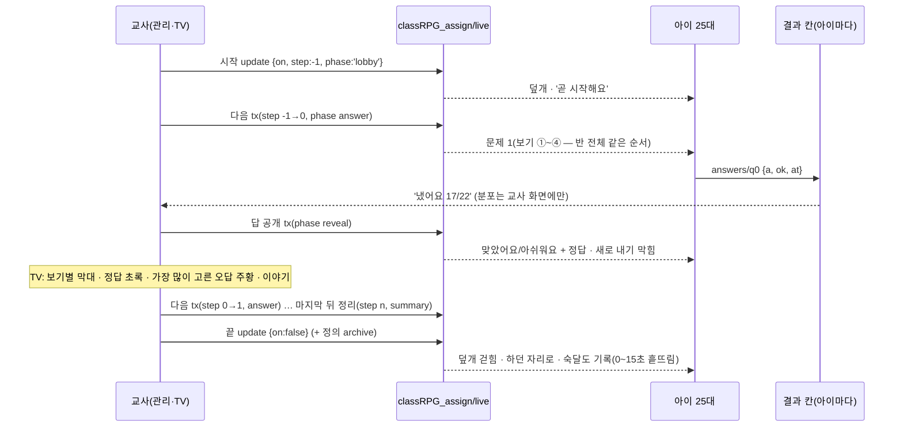

# 과제 · 수업 설계 (CLASS-ASSIGN-1)

> 2026-10-04 · **설계만(코드 0)** · 갈래 `feat/class-assign`(origin/main `9450d302` 위). 핵심 구현이 같은 갈래에 이어 붙고, PR 은 **draft** 로 열어 선생님이 시연을 본 뒤에 넣는다.
> 사용자(교사)가 §1 의 구조에 '좋아'(10-04). 이 문서는 그 **무엇 · 어떻게**를 바꾸지 않고, 코드를 읽은 뒤 **속 구조**만 더 낫게 고쳤다(§2 — 바꾼 까닭을 하나씩).
> 읽은 코드: `student.js`(openExternalEmbed · closeExternalEmbed · 모달 · 접속 시간 · 홈 buildMainHTML '오늘' · 생각판 홈 감시) · `student/study.js`(startStudySession · pickStudyQuestions · 문제 그리기 · 채점 · problemRecords · 숙달도) · `student/deco.js`(decoFlush · 애니메이션) · `student/battle.js`(타이머) · `gamedata.js`(DB 층 · STUDENT_KNOWN/COLD · _initStudentNodes · saveProblemRecord) · `admin.html`/`admin.js`(nav) · `admin/study.js` · `admin/settings.js`(백업 루트) · `coding/js`(app · play · store · teacher · stages) · `music/js`(app · rhythm · store · library · song) · `common/*` · `thinkboard`(교실 TV `#/tv/<id>`) · `curriculum.js`(문제 은행 실측) · `scripts/unit/*`(검사들).

---

## 0. 한눈에 (열 줄)

1. 새 루트 **`classRPG_assign`**(classRPG_v3 **밖**)에 과제 정의 · 수업 상태 · 결과를 둔다. 학생 기기는 `live` 와 `open` 두 곳만 **직접** 듣는다(생각판 홈 [THINKBOARD-HOME-1] 과 같은 길). **gamedata.js DB 층은 한 줄도 안 바꾼다.**
2. 결과는 아이마다 따로 `results/<과제>/<아이>` **아래 경로만** `update` 한다(통째 set 0 · 남의 칸 쓰기 0).
3. 아이 쪽은 새 파일 `student/assign.js` 하나: 홈 '오늘' 맨 위 과제 카드 · 과제함 실행기(학습 창과 같은 꼴) · 수업 덮개(맨 위 · 밑의 화면은 그대로 멈춤).
4. 문제 그리기 · 채점은 `student/study.js` 의 것을 **함수로 꺼내 같이 쓴다**. 오늘의 학습 화면의 글자는 바이트까지 같게(시험으로 지킨다).
5. 교사 쪽은 관리 화면 새 쪽 **`📝 과제·수업`**(`admin/assign.js`), TV 는 새 하위 앱 **`assign/index.html`**(새 창 · 교실 컴퓨터에서 따로 열어도 됨).
6. 규칙과 셈은 **`common/assign-core.js`** 한 파일 — 클래식 태그로도, ES 모듈로도 읽힌다. 학생 · 관리 · TV · 하위 앱 · 노드 시험이 **같은 함수**를 쓴다.
7. 기초 코딩 · 음악실 리듬은 **`common/assign.js`**(모듈) 계약으로 `?assign=<과제>` 를 받아 그 판/곡만 열고 자기 칸에 결과를 쓴다.
8. 수업 방은 **선생님만 끝낸다.** 대신 갇힘 방지: 교사 기기(관리 · TV)가 **모두 3분 넘게** 끊기거나 정한 시간(기본 45분)이 지나면 아이 화면이 스스로 풀린다.
9. 함께 푼 문제는 `problemRecords` 에 **`assign` 표시가 붙은 한 건**으로 남아 숙달도 · 복습에 들어가고, 오늘의 학습 하루 10문제 · 보상 셈에서는 빠진다.
10. 보상 없음(정의에 `reward: null` 자리만) · 순위 · 속도 점수 없음 · TV 이름 기본 숨김.

---

## 1. 사용자가 정한 것 (바꾸지 않는 약속)

| 칸 | 정한 것 |
|---|---|
| 내용 | **문제 묶음**(국어 · 수학 · 사회 · **영어**) — 고르는 법 둘: **직접 고르기**(단원 → 문제 목록 미리 보기 체크) · **자동 뽑기**(과목 · 단원 · 개수 → 보낼 때 한 번 뽑아 반 전체 같은 문제) |
| 내용 | **기초 코딩** 판 1~3개 · **음악실 리듬 게임** 곡 + 빠르기 |
| 넣지 않음 | 명화 탐정(TV 함께 보기가 맞음) · 먹 · 판화 · 수채화 · 데생(결과가 그림/종이) · 생각판(이미 교사가 여는 구조) · 리코더(아이가 스스로 별) · 작곡(나중) · 물감 · 무늬(2단계) |
| 보내는 법 ① | **과제함에 넣기**(끊지 않음): 홈 '오늘' 맨 위 '선생님 과제 N' 카드 · 배지. 여러 과제가 열려 있을 수 있다. 선생님이 닫는다 |
| 보내는 법 ② | **지금 모두 같이**(수업 모드): 로그인한 아이 화면 위에 '선생님과 수업 중' 방이 바로 덮인다. 하던 것은 지우지 않고 밑에 멈춰 둔다(꾸미기 편집 중이면 먼저 저장). 아이는 나갈 수 없다 — **선생님만 끝낸다**. 끝나면 하던 자리로. 늦게 로그인 · 재연결한 아이는 바로 그 방으로 |
| 진행 | **각자 풀기**(같은 문제를 각자 속도 · 다 하면 '다 했어요' 기다림) · **한 문제씩 같이**(선생님이 넘김 · 답 공개 · TV 에 보기별 막대 · 가장 많이 고른 오답 강조 · 이야기) |
| 보상 | 없음(경제는 사용자 결정 — 나중에 켤 수 있게 자리만) · 속도 점수 · 순위 없음(3~4학년) |
| 결과 | 반 **명단 기준** 표(안 한 아이도 보임): 상태(안 함 / 하는 중 / 끝) · 점수 · 시간 · 문제 묶음은 **문제별 보기 분포** · 오답 · TV 는 **이름 숨김**(교사가 켤 수 있음) |
| 숙달도 | 함께 푼 문제도 아이 문제 기록에 들어가 개인 복습에 반영(오늘의 학습 하루 10문제 보상과는 따로) |

---

## 2. 핵심 결정 — 제안의 속 구조에서 바꾼 것과 까닭

| # | 제안 | 이 설계 | 까닭(코드에서 확인한 것) |
|---|---|---|---|
| **D1** | `classRPG_v3/assignments · classLive · assignResults` + 학생 `STUDENT_KNOWN` 에 더하기 | **새 루트 `classRPG_assign`** + 학생 기기는 `live` · `open` 을 **직접** 듣는다 | ① 학생: KNOWN 노드가 바뀔 때마다 `_studentEmit → _onSnap → _ingest`(반 전체 학생 정규화 · 원문 비교) → onDataChange → `renderHUD · renderMain · renderMobile` 이 **25대 모두에서** 돈다(student.js 77~101줄). '다음 문제' 한 번마다 — 덮개 밑이라 헛일. 직접 들으면 덮개만 바뀐다. ② 교사: 관리 화면은 classRPG_v3 **root** 를 `on('value')`(gamedata.js 83줄) — 결과가 그 안이면 아이가 답을 낼 때마다 root 스냅샷 재구성 + `_ingest` + `renderAll`(대시보드 · 학생 표 · 승인 격자 …) — 수업을 이끄는 바로 그 화면이 25번 버벅인다. 밖이면 0번. ③ 학생 구독 = `shallow ∪ KNOWN − COLD`(gamedata.js 220줄) — `assignResults` 가 운영에 생기는 순간 COLD 에 안 넣으면 **모든 아이가 반 전체 결과**를 받는다. ④ 선례: 백업을 root 밖으로 뺀 [ER-4](admin/settings.js 559줄) · 생각판 목록 직접 듣기(student.js 371줄) · 학습 앱마다 `classRPG_<앱>`. ⑤ 하위 앱 원칙 "classRPG_v3 는 읽지도 쓰지도 않는다"(common/rpg-firebase.js 머리)를 지킨다. ⑥ 고위험 DB 층(SYNC-MERGE-2) · student-known-check · STUDENT_COLD 를 **안 건드린다** |
| **D2** | 과제 = 문제 id 목록 | 과제 정의에 **문제 사본**(은행의 문항 객체 그대로 + 보기를 보낼 때 **한 번** 섞은 순서) | 반 전체 · TV 가 **같은 보기 순서**(①②③④ 로 말할 수 있게) · TV 가 curriculum.js(856KB) 없이 그린다 · 선생님이 만든 문제를 나중에 지워도 · 아이 기기 캐시가 달라도 같은 문제. 크기: 문항 한 개 중앙값 214B · 최대 487B → 10문항 ≈ 2~3KB(+지문 한 편 ≤ 1.7KB) |
| **D3** | 학습 창을 '과제 모드'로 | 같은 **실행기 코드**, 그릇 **둘**: 과제함 창 `#m-assign`(학습 창과 같은 모양) · 수업 덮개 `#class-live` | 수업이 덮일 때 밑에 오늘의 학습 창이 **풀던 그대로** 있어야 한다. 학습 창은 전역 `STUDY_SESSION` · `#study-body` · `study-input` id · 연습장 전역 `SCRATCH_CTX` 를 쓴다 — 같은 그릇을 쓰면 밑의 풀이가 지워진다. 실행기는 인스턴스('i' 과제함 · 'l' 수업)마다 id 머리(`asgi-` · `asgl-`)와 상태를 따로 |
| **D4** | (없음) | 진행(다음 · 앞 · 답 공개 · 정리)은 `live` **transaction** — '지금 그 단계일 때만' 바꾼다 | 관리 화면과 TV(또는 교사 기기 둘)가 같은 순간 '다음'을 눌러도 한 칸만 |
| **D5** | 선생님만 끝냄 | + 갇힘 방지 넷: `endsAt`(기본 45분 · 20~120) · 교사 기기 연결 표시(`live/host/<연결>` + onDisconnect) **3분** · 어느 교사 기기에서든 끝내기 · 아이 한 명 '빼기' | 교사 노트북이 꺼지면 25명이 갇힌다. 아이는 여전히 스스로 못 나간다 |
| **D6** | `status` 칸 | 상태는 **시각에서 끌어낸다**: `doneAt` → 끝 · `startedAt` 또는 답 → 하는 중 · 없음 → 안 함 | 탭 둘 · 다시 보내기(오프라인 줄)에도 상태가 거꾸로 가지 않는다(나중 쓰기가 '하는 중'으로 덮어쓰는 일 없음) |
| **D7** | (없음) | 숙달도 기록 id = **`<아이>_asg_<과제>`** 하나(덮어쓰기) · 하루 10문제 셈과 보상에서 `r.assign` 기록 빼기 | 탭 둘 · 다시 열기 · 수업 → 과제함으로 이어 하기에도 기록은 한 건. 아이 id 로 시작하는 키라, 언젠가 problemRecords 를 `STUDENT_MINE`(키 범위 구독)으로 옮길 때 그대로 맞는다(§16 R7) |
| **D8** | `common/assign.js`(ES 모듈) | `common/assign-core.js`(**IIFE → `globalThis.AssignCore`** · 클래식 · 모듈 겸용) + `common/assign.js`(모듈 · 하위 앱 계약) | 학생 · 관리는 클래식 `<script>`(모듈 전환 금지 — module_architecture §7), TV · 하위 앱은 모듈. 셈 · 경로 · 상태 규칙이 두 벌이 되면 어긋난다 → 한 파일을 두 길로 읽는다 |
| **D9** | (없음) | 덮개 z-index **100000**(작품 라이트박스 99999 위) · 밑의 iframe 에는 `postMessage({type:'rpg:classlive', on})` 멈춤 신호 | student.css · student.html 의 층: 창 100 · 레벨업 999 · 꾸미기/학습 앱 9000 · 친구 마당 9100 · 토스트/업적 9999 · 라이트박스 99999 |

---

## 3. 데이터 모양

### 3-1 루트와 경로

```
classRPG_assign/                                   (새 루트 — classRPG_v3 밖. 학습 앱 루트 classRPG_<앱> 과 같은 자리)
  live                      수업 모드 지금 상태(하나뿐) — 모든 학생 기기 · 관리 · TV 가 듣는다          ~0.3KB
  open/<aid>                열린 과제 정의 — 모든 학생 기기가 듣는다(열린 것만 — 닫으면 archive 로)       과제당 ≤ 6KB
  archive/<aid>             닫은 과제 정의(+ closedAt) — 관리 화면이 펼칠 때만(최근 30, orderByKey)
  results/<aid>/<sid>       아이 한 명의 결과 — 그 아이 기기(학생 화면 · 학습 앱 iframe)만 쓴다          아이당 ≤ 1KB
  presence/<aid>/<sid>/<c>  수업 방에 들어와 있는 연결(탭 하나 = c 하나) — onDisconnect 로 지워짐       아주 작음
```

- 과제 id `aid` = `'a' + Date.now().toString(36) + 무작위 3자`(예: `amg9x0k2q7fq`) — 글자 순서 = 만든 순서라 `orderByKey().limitToLast(30)` 이 색인 규칙 없이 된다.
- 문항 열쇠 = **자리 `q0 … q(n-1)`**(숫자 키는 RTDB 가 배열로 돌려줄 수 있어 'q' 를 붙인다). 보낸 뒤 문항은 못 바꾸므로 자리가 곧 문항이다(문항 id 는 정의의 `items[i].id`).
- 연결 id `c` = 페이지마다 `'c' + 무작위 6자`.

### 3-2 과제 정의 `open/<aid>` (교사만 쓴다)

| 칸 | 모양 | 뜻 |
|---|---|---|
| `id` | 문자열 | `aid` |
| `title` | ≤ 40자 | 아이 화면 제목(만들 때 자동: '수학 · 분수 10문제' — 고칠 수 있음) |
| `kind` | `'quiz'` \| `'coding'` \| `'music'` | 내용 종류 |
| `content.quiz` | `{ subject, items:[문항 사본…] (1~30), passages:{<pid>:{id,title,text}}, src:{how:'pick'\|'auto', units:[…], n, cat} }` | 문항 사본 = 은행 문항 객체 그대로(id · unitId · type · cat · level · q · a · alt · choices · hint · fig · audio · lang · passageId) — **choices 만 보낼 때 한 번 섞음**(OX 는 O · X 그대로) |
| `content.coding` | `{ stages:['2-3','2-4'] }` (1~3) | 기초 코딩 판 id(coding/js/stages.js · 66판) |
| `content.music` | `{ song:'lib_nabiya', level:'easy'\|'normal'\|'hard'\|'expert', tempo:1\|0.8 }` | 음악실 기본 곡 15곡 중 하나 · 난이도 · 빠르기 |
| `deliver` | `'inbox'` \| `'live'` | 보내는 법 |
| `pacing` | `'self'` \| `'step'` | 진행(과제함 = 늘 self · step 은 문제 묶음 + 수업만) |
| `showAnswer` | bool(기본 true) | 각자 풀기에서 문제마다 정답을 바로 보여 줄지(끄면 끝/정리 때) |
| `targets` | `null` \| `[sid…]` | null = 반 모두 |
| `roster` | `{ <sid>: '이름' }` | 만든 때 받는 아이 이름 — TV · 하위 앱이 classRPG_v3 를 안 읽게 |
| `reward` | `null` | **자리만**(나중: `{exp, gold, mode:'approve'}` → 끝낼 때 `DB.addPendingReward` 로 승인 대기) |
| `createdAt` · `closedAt` | 서버 시각 | |
| `fromLive` | bool | 수업을 끝내며 과제함으로 남긴 것 |

### 3-3 수업 상태 `live` (교사 기기만 쓴다)

| 칸 | 모양 | 뜻 |
|---|---|---|
| `on` | bool | 수업 중 |
| `aid` · `kind` · `pacing` | | 지금 수업의 과제(정의는 `open/<aid>`) |
| `step` | 정수 | 한 문제씩: −1 = 기다림, 0…n−1 = 문항, n = 정리 |
| `phase` | 한 문제씩 `'lobby'·'answer'·'reveal'·'summary'` · 각자 `'run'·'summary'` | |
| `names` | bool | TV 에 이름 보이기(기본 false) |
| `startedAt` · `endedAt` | 서버 시각 | |
| `endsAt` | ms(서버 시계) | 안전 끝 — 지나면 아이 화면이 스스로 풀린다. '10분 더' 로 늘림 |
| `host/<c>` | true | 교사 기기(관리 화면 · TV) 연결 — onDisconnect 로 지워짐 |
| `excused/<sid>` | true | 선생님이 뺀 아이 |
| `rev` | 정수 | 바꿀 때마다 +1(순서 · 디버그) |

### 3-4 결과 칸 `results/<aid>/<sid>` (그 아이 기기만 쓴다)

| 칸 | 모양 | 누가 · 언제 |
|---|---|---|
| `startedAt` | 서버 시각 | 첫 답 · 첫 실행(없을 때만) |
| `doneAt` | 서버 시각 | 문제 묶음: 모든 문항에 답했을 때 · 한 문제씩: 정리/끝을 봤을 때 · 코딩: 모든 판을 풀었을 때 · 리듬: 한 곡을 끝까지 쳤을 때 |
| `answers/q<i>` | `{ a: 고른/쓴 답(≤80자), ok: bool, at: 서버 시각 }` | 문제 묶음 — 답 하나마다 |
| `app/score` · `app/total` | 수 | 코딩: 푼 판 수 / 판 수 · 리듬: 가장 좋은 정확도(0~100) / 100 |
| `app/attempts` | 수(`ServerValue.increment(1)`) | 코딩 실행 · 리듬 판 수 |
| `app/detail/<열쇠>` | 작은 객체 | 코딩 `<판>`: `{ok, st 별, n 블록, tries, t 처음 푼 때, why:{까닭: 수}}` · 리듬 `best`: `{score, acc, grade, maxCombo, perfect, great, good, miss}` |
| `rec` | 수 | 숙달도 기록에 넣은 답 수(늘었을 때만 다시 쓴다) |

### 3-5 연결 표시

- 아이: 수업 방에 들어가면 `presence/<aid>/<sid>/<c> = true` + `onDisconnect().remove()`. 방이 닫히면 지운다. `.info/connected` 가 다시 true 가 되면 다시 쓴다(onDisconnect 는 끊길 때 서버에서 이미 돌았으므로).
- 교사: 수업 중이고 (관리 화면에 로그인 · TV 문 통과) 이면 `live/host/<c> = true` + `onDisconnect().remove()` · 다시 이어질 때 다시.
- 탭이 여럿이어도 연결마다 키가 따로라 하나를 닫아도 '접속 중'이 남는다.

### 3-6 classRPG_v3 에 남기는 것 — problemRecords 한 건(기존 저장 길 그대로)

`DB.saveProblemRecord(rec)`(gamedata.js 1259줄 · `problemRecords/<id>` 한 칸 set — 기존 함수) · `rec = AssignCore.toProblemRecord(def, 내 칸, sid, Utils.todayStr())`:

```
{ id: '<sid>_asg_<aid>', studentId, date, subjectKey, unitId(가장 많이 나온 단원),
  total: 답한 수, correct, wrongIds:[문항 id…], answers:[{ problemId, unitId, chosen, correct }…],   ← 오늘의 학습 기록과 같은 모양
  review: false, assign: '<aid>' }                                                                      ← 이 표시 하나가 더해짐
```

### 3-7 누가 쓰고 누가 듣나

| 경로 | 쓰는 쪽 | 쓰는 법 | 듣는 쪽 |
|---|---|---|---|
| `live` | 관리 · TV(교사) | 시작 · 끝 = 루트 다중 경로 `update` 한 번 · 다음/앞/공개/정리 = `live` transaction(그 단계일 때만) · 이름 · 빼기 · 10분 더 = `update` | 학생 전부 · 관리 · TV |
| `live/host/<c>` | 관리 · TV | set + onDisconnect remove | 학생(갇힘 방지) |
| `open/<aid>` | 관리 | 보내기 = `set`(새 과제 하나 · 교사만 쓰는 정의) · 닫기 = 다중 경로 `update { open/<aid>: null, archive/<aid>: … }` | 학생 전부(목록 통째 — 열린 것만이라 작다) · 하위 앱(그 aid 하나) · TV |
| `archive/<aid>` | 관리 | 위 닫기 update | 관리(펼칠 때) · 하위 앱(닫힌 과제를 늦게 열면) |
| `results/<aid>/<sid>` | 그 아이의 학생 화면 · 학습 앱 iframe | **그 칸 아래 경로만 `update`**(+ increment) — 통째 set 금지 | 그 아이(자기 칸 하나 — 탭끼리 맞추기) · 관리(고른 과제 하나 · 수업 과제) · TV |
| `presence/<aid>/<sid>/<c>` | 그 아이 | set + onDisconnect remove | 관리 · TV(들어온 아이 수) |
| `classRPG_v3/problemRecords/<sid>_asg_<aid>` | 그 아이 | `DB.saveProblemRecord`(기존) | 지금과 같음(학생 구독 노드) |

학생 기기가 새로 듣는 것: `classRPG_assign/live` · `classRPG_assign/open` · 열린 과제 중 나에게 온 것마다 `results/<aid>/<내 id>` · `.info/connected` · `.info/serverTimeOffset`. **남의 결과는 안 받는다.**

### 3-8 크기 어림 (실측 바탕)

| 무엇 | 크기 |
|---|---|
| 문제 은행(4-1 · curriculum.js + 지문) | 2,516문항 — 수학 750 · 국어 620 + 지문 문항 156(지문 39편) · 사회 600 · 영어 390 / 보기 1,532 · 수 539 · 글 427 · 분수 18 / 그림 119 · 소리 290 |
| 문항 사본 하나 | 중앙값 214B · 95% 335B · 최대 487B |
| 과제 정의(10문항 + 지문 하나 + 명단 25) | ≈ 4~6KB |
| 결과 칸(10문항) | ≈ 0.7KB · 반 25명 ≈ 17KB / 과제 |
| 한 해(주 3번 × 36주 ≈ 108개) | 결과 ≈ 1.9MB · 보관 정의 ≈ 0.6MB |
| 학생 기기가 수업 시작 때 받는 것 | live 0.3KB + 열린 정의(≤ 5개) ≤ 30KB |

### 3-9 DB 규칙

- 지금 RTDB 규칙은 코드 밖(콘솔)이다(docs/rpg_overhaul_plan_2026_summer.md 28줄 '파일 없음'). 학습 앱 루트가 생길 때마다(`classRPG_print` 10-04 · `classRPG_paint` 등) 규칙을 따로 고치지 않고 바로 동작했다 → 새 루트도 같은 조건으로 본다. **첫 시연에서 실제로 쓰이는지 한 번 확인**(§17 Q8).
- 신뢰 수준은 다른 곳과 같다(누구나 쓸 수 있는 DB) — 보안 규칙은 사용자 결정으로 내년. 그래서 받은 정의 · 결과는 모두 **믿지 않는 글**로 다룬다(§13 · §16 R2).

---

## 4. 흐름

### 4-0 만들기 → 보내기 (교사, 모든 경우 공통)

1. 관리 화면 `📝 과제·수업` → [+ 새 과제].
2. **무엇을**: [문제 묶음] [기초 코딩] [음악실 리듬] 중 하나 → 고르기(§8-2).
3. **이름** 자동 채움(고칠 수 있음) · **누구에게** 우리 반 모두 / 골라서.
4. **어떻게**: [📥 과제함에 넣기] 또는 [🔴 지금 모두 같이] → 같이면 진행 [각자 풀기] / [한 문제씩 같이](문제 묶음만) · 안전 시간(45분) · '문제마다 정답 보여 주기'(각자 풀기 · 기본 켬).
5. [보내기] — 같이면 확인 한 번("지금 로그인한 아이 화면에 수업 방이 열려요. 하던 것은 그대로 멈춰 둬요.").
   - 과제함: `open/<aid>` set 하나.
   - 같이: `classRPG_assign` 루트 다중 경로 `update { 'open/<aid>': def, live: {…} }` **한 번**(정의와 수업이 같이 나타난다). 이미 수업 중이면 "지금 수업을 끝내고 새로 시작할까요?".

### 4-1 과제함 · 문제 묶음

| 단계 | 교사(관리) | 아이 | TV |
|---|---|---|---|
| 보냄 | 목록에 '열림' · 결과 표(모두 '안 함') | 홈 '오늘' 맨 위 `📝 선생님 과제 1개` 카드 · 레일 배지 '할 일'에 +1 · 하던 것 그대로 | — |
| 엶 | — | 카드 누름 → 과제함 창(학습 창과 같은 크기 · 같은 글씨) · 제목 `📝 선생님 과제 · 분수 복습` · 1/10 | — |
| 풂 | 표가 실시간(하는 중 · 몇 개 · 맞힘) | 문제 → 답 → (정답 보여 주기면) 맞았어요/아쉬워요 + 정답 + 별 변화 → 다음. **답 하나마다 저장**(창을 닫아도 남음 — 오늘의 학습과 다른 점) | — |
| 닫았다 다시 | — | ✕ 는 묻지 않고 닫는다(이미 저장됨) · 다시 열면 **안 푼 첫 문제부터** | — |
| 끝 | 상태 '끝' · 점수 · 걸린 시간 | 결과 화면(점수 · 다시 볼 문제) · 숙달도 기록 한 건 · 카드는 `✓ 다 했어요`(선생님이 닫을 때까지) | — |
| 닫기 | [닫기] → archive · 결과는 그대로 | 카드가 사라짐 · 푸는 중이었으면 "선생님이 이 과제를 닫았어요. 낸 답은 그대로 남아요" 후 창 닫힘 · 낸 답으로 숙달도 기록 | — |

### 4-2 과제함 · 기초 코딩 / 음악실 리듬

| 단계 | 교사 | 아이 | TV |
|---|---|---|---|
| 엶 | — | 카드 → `openExternalEmbed('coding', '&assign=<aid>')`(지금 학습 앱 창 그대로 — ✕ · Esc · 뒤로로 닫힘). 음악은 `'music'` | — |
| 코딩 | 표: 판마다 ★ / 실행 수 / 막힘(못 풀고 실행 5번 이상 — 막힘 지도와 같은 기준 `tries >= 5`) | 앱 첫 화면 대신 **과제 쪽**: '선생님 과제 · 2판' 판 목록(잠금 없이 열림) → 판 → 이긴 카드 '다음 판'은 **과제의 다음 판** · 과제에서 처음 여는 판은 '새 종이'(전에 푼 코드가 아니라 판의 처음 모양) | — |
| 리듬 | 표: 가장 좋은 등급 · 정확도 · 판 수 | 그 곡 리듬 화면이 바로 · 난이도 · 빠르기 칸 대신 '선생님이 정한 것' 표시 · **우리 반 최고 기록판은 숨김**(순위 없음) · 끝까지 치면 결과가 자기 칸에 | — |

### 4-3 수업 · 각자 풀기 · 문제 묶음

| 단계 | 교사(관리) | 아이 | TV |
|---|---|---|---|
| 시작 | 위에 빨간 **수업 띠**: 들어온 아이 n/N(안 들어온 이름) · 다 한 아이 · [결과 보기] [이름 TV에] [10분 더] [끝내기 ▾] | 무엇을 하든 **바로** 덮개 `👩‍🏫 선생님과 수업 중 · 제목` · 문제 1 — 밑은 그대로 멈춤(§5) | 제목 · '다 한 친구 0 / 24' · 익명 점(○ 아직 · ◐ 하는 중 · ● 다 함) |
| 풂 | 표 실시간 | 과제함과 같은 실행기(정답 보여 주기 설정대로) · 소리 문항은 **자동 읽기 없음**(25대가 한꺼번에 소리) — 🔊 눌러 이어폰으로 | 점이 채워짐(이름 켜면 이름 칩 + ✓ — 점수는 안 보임) |
| 다 함 | — | "다 했어요! 선생님이 수업을 끝낼 때까지 기다려요" + 내 점수(정답 보여 주기면 다시 볼 문제) · 숙달도 기록 | — |
| 결과 보기 | [결과 보기] → `phase:'summary'` | 다 한 아이: 내 답과 정답(정답 보여 주기를 껐어도 이때) · 아직인 아이: 계속 풂 | 문제별 맞힌 비율 막대 · 가장 어려웠던 문제 · 문제를 누르면 그 문제의 보기 분포 |
| 끝 | [끝내기] 또는 [끝내고 못 한 아이는 과제함으로] | 덮개가 걷히고 **하던 자리 그대로** · 토스트 "수업이 끝났어요" · 못 한 아이에겐 과제함 카드(이어 하기) | '수업이 끝났어요' + 정리 화면 |

### 4-4 수업 · 한 문제씩 같이 · 문제 묶음



| 단계 | 교사 | 아이 | TV |
|---|---|---|---|
| 기다림 | 들어온 아이 n/N · [첫 문제 ▶] | '곧 시작해요 — 선생님이 첫 문제를 열면 여기에 나와요' | 제목 · '들어온 친구 22 / 24' · 곧 시작 |
| 묻기 | 문제 · **선생님만 보는 분포**(실시간) · 냈어요 17/22 · [답 공개] [앞] | 문제 · 번호 붙은 보기 · 한 번 내면 "답을 냈어요 ✓ 선생님이 정답을 보여 줄 때까지 기다려요"(**못 바꿈** — §17 Q2) | 문제 크게 · 보기 ①~④ · '냈어요 17 / 22'(분포는 아직 안 보임) · 소리 문항은 🔊 |
| 공개 | [다음 ▶] · 오답 낸 아이 이름(교사만) | 맞았어요 🎉 / 아쉬워요 + 정답 + 힌트 + 별 변화 · 안 낸 아이 "이 문제는 못 냈어요 — 정답은 …" | 보기별 막대 · 수 · % · 정답 초록 ✓ · **가장 많이 고른 오답 주황**("③을 고른 친구가 6명 — 왜 그렇게 생각했을까요?") · 글로 쓰는 문제는 정답 + 많이 쓴 다른 답 셋 |
| 앞 문제 | [◀ 앞] → 그 문제 '공개'로 | 그 문제의 공개 화면(새로 못 냄) | 그 문제 막대 |
| 정리 | 마지막 '다음' → `summary` | "10문제 중 7개 맞혔어요" + 다시 볼 문제 · `doneAt` | 문제별 맞힌 비율 · 가장 어려웠던 문제 · 문제 누르면 그 막대(교사가 고르면 `step=i, phase=reveal`) |
| 끝 | 4-3 과 같음 | 4-3 과 같음 | 4-3 과 같음 |

### 4-5 수업 · 각자 · 기초 코딩 / 음악실 리듬

| 단계 | 교사 | 아이 | TV |
|---|---|---|---|
| 시작 | 수업 띠 · 표(판마다 ★ / 실행 수 · 리듬 등급) | 덮개 안에 **두 번째 iframe** `coding/index.html?sid=…&n=…&assign=<aid>&live=1` — 밑의 학습 앱 창(#m-embed)이 같은 앱이어도 그대로 둔다 · 과제 쪽 · 다른 판으로 가는 길 숨김 | 코딩: 판마다 '푼 친구 n' · 많이 한 실수(막힘 지도와 같은 말) · 리듬: '끝까지 친 친구 n' · 정확도 평균 |
| 다 함 | 상태 '끝' | 덮개 맨 위 띠 "다 했어요! ✓ — 더 줄여 보거나 다시 쳐 봐도 돼요" · 기다림 | 수가 오름 |
| 끝 | 같음 | iframe 을 비운다(`about:blank` — 코딩은 pagehide 로 쓰던 코드를 저장) · 하던 자리로 | 정리 |

### 4-6 끝내기 · 닫기 · 과제함으로 남기기

| 단추 | 쓰기(루트 다중 경로 update 한 번) | 결과 |
|---|---|---|
| 수업 [끝내기] | `live/on=false · live/endedAt · open/<aid>=null · archive/<aid>={…def, closedAt}` | 덮개 걷힘 · 과제 닫힘 |
| 수업 [끝내고 못 한 아이는 과제함으로] | `live/on=false · live/endedAt · open/<aid>/deliver='inbox' · pacing='self' · fromLive=true` | 못 한 아이 홈에 카드(이어 하기) · 다 한 아이는 ✓ |
| 과제함 [닫기] | `open/<aid>=null · archive/<aid>=…` | 카드 사라짐 |
| 수업 중인 과제 [닫기] | 끝내기와 같음 | |

---

## 5. 아이 쪽 수업 덮개 — 밑의 상태 보존

### 5-1 열고 닫는 조건 (한 함수 — `AssignCore.liveState`)

```
보인다 = 로그인함(CUR · enterGame 뒤) && live.on && open/<live.aid> 있음 && isTarget(def, 내 id)
         && !live.excused[내 id] && 서버 지금 < live.endsAt && !(host 가 비어 있은 지 3분 넘음)
```
- 서버 지금 = `Date.now() + .info/serverTimeOffset`(아이 기기 시계가 틀려도).
- host 가 비면 덮개 안에 "선생님 화면이 꺼졌어요. 조금 기다려 볼게요" → 3분 지나면 덮개를 걷고 토스트 "선생님 화면이 꺼져서 수업 방을 닫았어요". host 가 돌아오면 **다시 덮는다**(수업은 DB 에서 아직 켜져 있으므로).
- 내 연결이 끊긴 동안(`.info/connected` false)에는 host 를 못 보므로 걷지 않고 "인터넷이 끊겼어요 — 다시 잇는 중이에요. 낸 답은 이어지면 보내요".

### 5-2 덮개 자체

- `#class-live` — body 끝에 처음 필요할 때 만든다(`_embedEl` 과 같은 방식 · student.html 손대지 않음) · `position:fixed; inset:0; z-index:100000` · 불투명 바탕 · 머리 줄 `👩‍🏫 선생님과 수업 중 · 제목` + 연결 점 · **닫기 단추 없음**.
- **포커스**: 열 때 `document.activeElement` 를 기억(학습 앱 안이면 iframe 요소) → 덮개(tabindex=-1)로 포커스를 옮겨 iframe 안의 키(리듬 A S D F · 마을 키)가 밑으로 안 가게. 닫을 때 되돌림(autoFocus 앱이면 `contentWindow.focus()`).
- **키**: student/assign.js 를 읽을 때 `window` **캡처** keydown 하나를 단다(deco.js 는 늦게 읽혀 그 뒤에 달리고, 지금 처리기들은 모두 document 버블 — student.js 510줄 · deco.js 5곳). 덮개가 열려 있으면 Escape 는 늘 `stopImmediatePropagation` + `preventDefault`(학습 앱 창 Esc 닫기 · 꾸미기 Esc 처리기까지 못 감) · 대상이 덮개 밖이면 다른 키도 막음 · Tab 은 덮개 안에서만.
- **뒤로**: 열 때 `history.pushState({ ...history.state, asgLive: aid }, '', location.href)` — 지금 상태의 `embed` 키를 같이 복사해 student.js 의 popstate 처리기(state.embed 가 없으면 학습 앱 창을 닫음)가 밑의 창을 닫지 않게. popstate 에서 덮개가 열려 있으면 다시 push. 끝날 때 `history.state.asgLive` 면 `history.back()`.
- **새로고침 · 닫기**: 덮개 동안만 `beforeunload`(크롬은 아이가 한 번이라도 누른 뒤에만 묻는다). 그래도 나가면 다시 로그인했을 때 바로 방으로(§12).
- **스크롤**: `document.body.style.overflow` 를 기억했다가 그 값으로 되돌림(학습 앱 창도 'hidden' 을 쓰므로 '' 로 되돌리면 안 됨).
- 화면: 1366×610(크롬북) · 375×812(폰) · 화면 맞춤(SCALE_MODE) 모두 — 덮개는 `#s-game` 밖(body 아래)이라 transform 을 안 받는다. 문제 판은 학습 창과 같은 너비 `min(820px, 96vw)` · 폰은 꽉 채움.

### 5-3 밑에 있을 수 있는 것별

| 밑에 있는 것 | 어디 | 덮을 때 | 덮개 동안 | 끝날 때 |
|---|---|---|---|---|
| 홈 · 레일 · 폰 하단 탭 | `#s-game`(z 10) | 그대로 | onDataChange 가 지금처럼 다시 그림(과제 카드 포함) | 그대로 |
| 보통 창(상점 · 가방 · 농장 · 퀘스트 · 감정 · 주간 다짐 · 보스 …) | `.overlay`(z 100) | **닫지 않음** | 그대로 | 열린 채로 돌아옴 |
| **오늘의 학습 창** | `STUDY_SESSION` · `#study-body` | 그대로 — 실행기는 다른 그릇 · 다른 id(`asgl-*`) · 연습장은 캔버스마다 따로(§6-2 initStudyScratch) | 안 건드림 | 같은 문제에서 이어 풂 · 연습장 그림도 남음 |
| 과제함 실행기 | 인스턴스 'i' · `#m-assign` | 그대로 | 같은 결과 칸을 들으므로 수업에서 낸 답이 반영됨 | 이어 풂(이미 낸 문제는 건너뜀) |
| **전투** | `#m-battle` · `BATTLE_STATE` | 그대로 — 턴제라 아이 차례에서 기다린다. 이미 시작된 연출(setTimeout 사슬)은 끝까지 돌고 저장한다(student/battle.js) | 아이가 못 누르니 멈춤 | 이어서 싸움 |
| **꾸미기 전체화면** · 친구 마당 | `#interior-fullscreen`(9000) · `#friend-fullscreen`(9100) | `typeof decoFlush === 'function' && decoFlush('수업')`(0.4초 묶음 저장을 지금) · `typeof _animPauseAll === 'function' && _animPauseAll()`(같은 줄 typeof — deco-lazy-check ② 가드) | 멈춤(CPU 아낌) | `_animResumeAll()` · 화면 그대로 |
| 끌던 장식 | pointer capture | 캡처 중이면 손을 뗄 때 캔버스가 받는다(지금 규칙대로 놓기) | — | — |
| **학습 앱 iframe** | `#m-embed`(9000) · `_embedState` | src 그대로 · `frame.contentWindow.postMessage({type:'rpg:classlive', on:true}, location.origin)` · 포커스를 덮개로 | 앱이 멈춤: 코딩 실행 멈춤 · 음악 소리 · 게임 멈춤(§7-5) | `on:false` · 포커스 되돌림 |
| 영어 앱(다른 도메인) · 우리 마을 | iframe | 메시지는 보내지만 안 듣는다 | 마을 3D 는 밑에서 계속 그린다(§16 R5) | 그대로 |
| 작품 라이트박스 | z 99999 | 덮개가 위 | | 그대로 |
| 레벨업 축하 | `lup-fx`(999) | `triggerLevelUp` 이 학습 앱 창처럼 미룬다(`_lupAfterEmbed`) | | 끝나면 한 번 |
| 업적 카드 | `ach-popup`(9999) | `_fxBusy()` 가 수업도 바쁨으로 본다(카드가 기다림 — 최대 3분 뒤엔 지금처럼 그냥 뜸) | | |
| 토스트 | z 9999 | 덮개 밑에 가려짐 → 덮개 안 상태 줄이 대신 | | |
| 읽어 주기 | speechSynthesis | `cancel()` | | |
| confirm · alert 가 떠 있음 | 브라우저 | 닫힐 때까지 JS 가 멈춘다 → 닫힌 뒤 덮개 | | |
| 쓰던 글(주간 다짐 칸 등) | input 값 | 그대로(저장 안 한 글도 남음) | | 그대로 |
| 접속 시간 끝 | `startAccessTimer` | 수업 동안은 내보내지 않음(30초마다 다시 봄) | | 끝난 뒤 다음 검사 때 |

### 5-4 끝날 때 되돌리는 순서

1. 실행기 정리(연습장 처리기 떼기) · 남은 숙달도 기록 쓰기(§11 — 흩뜨림).
2. presence 지우기 · beforeunload 떼기 · `history.back()`(우리가 쌓은 한 칸이면).
3. 덮개 숨김 → body overflow 되돌림 → 포커스 되돌림.
4. iframe 에 `on:false` · 꾸미기 `_animResumeAll()`(typeof 가드).
5. 미룬 레벨업 한 번(밑에 학습 앱 창이 아직 열려 있으면 지금 규칙대로 그 창을 닫을 때) · 토스트 "수업이 끝났어요".

---

## 6. 과제 실행기 (아이 쪽 · `student/assign.js`)

### 6-1 구조

- **`watchAssignments()`** — `enterGame()` 에서(생각판 `watchThinkboardHome()` 옆) 한 번. `firebase.database().ref('classRPG_assign/live')` · `…/open` · `.info/*` 를 듣는다(try/catch — firebase 없으면 조용히). CUR 이 바뀌면(다른 아이 로그인) 대상 · 내 칸 구독을 다시 맞춘다.
- **인스턴스 둘**: `'i'`(과제함 · `#m-assign` · `.overlay` 라 접속 시간 끝에 같이 닫힘) · `'l'`(수업 · `#class-live`). 각자 `{ aid, def, sid, mine(내 칸), cursor, ui }`. 같은 과제를 둘이 동시에 열어도 내 칸 하나를 같이 들으므로 맞는다.
- 화면 고르기: 과제함 · 각자 = 내 칸에서 **안 푼 첫 문항**(다시 열기 · 탭 둘에도 같은 곳) · 한 문제씩 = `AssignCore.liveScreen(live, def, mine)` → `lobby · ask · sent · reveal · summary`.
- 이름 머리: 학생 `asg` · `_asg` · `classLive`(전역 겹침 검사 1,096개와 안 부딪히게) · 관리 `assign` · `_assign`.

### 6-2 study.js 에서 꺼내 같이 쓰는 것 [STUDY-SHARE-1]

지금 `renderStudyQuestion` · `showStudyFeedback` · `submitStudyAnswer` · `submitFractionInputs` · `initStudyScratch` 는 `#study-body` · `study-*` id · 전역 `STUDY_SESSION` · `SCRATCH_CTX` 에 묶여 있다. 안쪽을 **인자를 받는 함수**로 꺼내고, 오늘의 학습은 지금 값으로 부른다.

| 새 함수 | 꺼내 오는 곳 | 인자 |
|---|---|---|
| `studyQuestionHTML(p, o)` | renderStudyQuestion 의 진행 막대 아래 전부(그림 · 지문 · 물음 · 소리 · 연습장 · 입력 · 힌트) | `o = { ids:{input,fw,fn,fd,scratch}, submit:'submitStudyAnswer', togglePassage:'togglePassage', pre:'', frac:'submitFractionInputs()', skip:'nextStudyQuestion()', passage, passageOpen, scratch:bool, shuffle:true, numbered:false, autoSpeak:true, meta:'과목 · 단원' }` — onclick 글자는 `${o.submit}(${o.pre}값)` · `${o.togglePassage}(${o.pre}'지문 id')` 로 만든다 |
| `studyFeedbackHTML(p, chosen, ok, o)` | showStudyFeedback 의 두 갈래(받아쓰기 · 보통) | `o = { last, next:'nextStudyQuestion()', starBefore, starAfter }` |
| `studyGrade(p, val)` | submitStudyAnswer 의 채점 두 줄(받아쓰기면 dictationGrade · 아니면 CurriculumUtils.isCorrect) | |
| `readFractionInputs(ids)` | submitFractionInputs 의 읽기 · 검사 | → `{ val }` 또는 `{ err:'분자를 써 주세요' }` |
| `initStudyScratch(id = 'study-scratch')` | 지금 것 | 캔버스마다 ctx · resize 처리기를 따로(전역 `SCRATCH_CTX` 하나라 덮개 연습장이 밑의 연습장을 빼앗던 것) — `SCRATCH_CTX` 는 남겨 지금 읽는 곳 그대로 |
| `getTodayStudyRecords(sid)` | 지금 것 | **`!r.assign`** 한 조건 더함(하루 10문제 · 보상 · '오늘 N문제 했어요' 셈에서 과제 기록 빼기) |

- **같은 글자 보장**: 문제 은행 2,516문항 × 시드 고정 `Math.random` 셋으로 origin/main 의 study.js 와 꺼낸 뒤의 study.js 가 내는 `renderStudyQuestion` · `showStudyFeedback`(맞음 · 틀림 · 받아쓰기 · 분수 '값 같음') HTML 이 **바이트까지 같다** — §14 B2. 전역 이름은 그대로(run.mjs 가 잘라 쓰는 masteryMap 등 안 바뀜).
- 실행기 쪽 값: `ids` = `asgi-*`/`asgl-*` · `submit:'asgPick'` · `togglePassage:'asgPsg'` · `pre:"'l',"`(인스턴스) · `frac:"asgFrac('l')"` · `skip:"asgSkip('l')"` · `shuffle:false`(사본의 보기 순서 그대로) · `numbered:true`(①②③④ — TV 와 같은 번호) · 수업에서는 `autoSpeak:false`.
- CSS: student.css 의 `#study-body .st-…` 61줄 · `#m-study .modal` 9줄의 선택자를 `:is(#study-body, .asg-body) .st-…` · `:is(#m-study, #m-assign) .modal` 로(선택자만 · 새 규칙 아님 · `:is()` 의 세기는 가장 센 인자 = id 그대로라 지금 화면은 안 바뀜).

### 6-3 문항 형식별

| 형식 | 은행 수 | 아이 입력 | 채점 | 교사 · TV(공개) |
|---|---:|---|---|---|
| 보기(choice) | 1,532 | 번호 붙은 큰 단추 — 보낼 때 한 번 섞은 순서 | `CurriculumUtils.isCorrect` | 보기별 막대 · 정답 초록 · 가장 많이 고른 오답 주황 |
| OX(cat ox · 보기 O/X) | 보기 안 | ⭕ 맞아요 / ❌ 틀려요 | 같음 | 두 막대 |
| 수(number) | 539 | 숫자 칸(키패드) | isCorrect(단위 붙여도) | 정답 + 많이 쓴 다른 답 셋(`normAns` 로 묶음) |
| 글(short) | 427 | 글 칸 | isCorrect(공백 · 대소문자 · alt) | 같음 |
| 분수(fraction) | 18 | 세 칸(자연수 · 분자 · 분모) | fractionMatch(값이 같으면 정답 — FRACTION_REQUIRE_MIXED=false) | 같음 |
| 받아쓰기(short · dictation · 소리) | 글 안 | 🔊 + 글 칸 | `dictationGrade`(띄어쓰기는 점수 밖) | 정답 + 많이 쓴 다른 답 |
| 듣기(choice · 소리 · 영어) | 보기 안 | 🔊 + 보기 | isCorrect | 🔊(TV 기기에서 읽기 — `itemLang`) |
| 그림(fig) | 119 | 문제 위 그림(figures.js) | — | 그림 크게 |
| 지문(passageId) | 156 · 39편 | 지문 카드(첫 문항 펼침 · 다음 문항 접힘 — 오늘의 학습과 같음) | — | 지문 크게 · 그 세트 문항은 연달아 |

소리: 과제함 = 오늘의 학습처럼 화면이 뜨면 한 번 자동 읽기 · **수업 = 자동 읽기 없음**(🔊 눌러 이어폰 · 받아쓰기는 TV 에서 선생님이 🔊). 기기에 한국어 목소리가 없으면 지금처럼 '이 문제 건너뛰기'(답 없음으로).

### 6-4 쓰기

- 답 하나: `ref('classRPG_assign/results/<aid>/<sid>').update(AssignCore.answerPatch(…))` →
  `{ 'answers/q3': { a, ok, at: TIMESTAMP }, startedAt: TIMESTAMP(내 칸에 없을 때만) , doneAt: TIMESTAMP(이번 답으로 다 찼을 때만) }`.
  `answerPatch` 는 **낼 수 없으면 null**(이미 냄 · 한 문제씩에서 그 문항이 '묻기'가 아님 · 수업이 아님 · 문항 범위 밖) — 실행기는 null 이면 아무것도 안 쓴다.
- 숙달도 기록: §11.
- **학생 기록(`students/<id>`)은 쓰지 않는다** — `saveStudent` 0번(보상이 없으므로). CUR 을 고치지 않는다.
- 쓰기 실패(`.catch`) → 실행기 안 상태 줄 "저장이 안 됐어요 — 인터넷을 확인해요"(토스트는 덮개 밑이라 안 보임). 끊긴 동안의 update 는 SDK 가 다시 이어질 때 보낸다(transaction 이 아니므로 — sync_merge_design §2-5).

### 6-5 홈 '오늘' 과제 카드

- `buildMainHTML()` 의 '오늘' 구역 `hs-head` 바로 아래(알림 · 오늘의 학습보다 위)에 `${typeof buildAssignCardsHTML === 'function' ? buildAssignCardsHTML() : ''}` — 데스크톱(#main-area) · 폰(#mob-main-tab) 두 판 모두. 그릇 `<div class="home-assign" style="display:contents">`(생각판 칸과 같은 꼴).
- '오늘 할 일 N개' · 레일 '할 일 N' 에 **안 끝난 과제 수**를 더한다(`assignTodoCount()`).
- 열린 과제 목록이 바뀌면(드묾) `renderMain(); renderMobile();` 한 번.

```
┌ 📝 선생님 과제 2개 ─────────────────────────────────────┐
│ 분수 복습 · 문제 10개 · 3개 했어요                [이어 하기] │
│ 반복하기 · 기초 코딩 2판 · 아직 안 했어요             [시작] │
│ ✓ 영어 1단원 낱말 · 다 했어요                              │
└──────────────────────────────────────────────────────────┘
```

---

## 7. 하위 앱 계약 — `common/assign-core.js` · `common/assign.js`

### 7-1 `common/assign-core.js` (클래식 · 모듈 겸용 — 순수 함수 · DOM · firebase 없음)

```js
// (function (g) { … g.AssignCore = Object.freeze({ … }); })(globalThis);   — 최상위 선언 0(전역 겹침 검사 영향 0)
AssignCore = {
  ROOT: 'classRPG_assign',
  path: { live, open(aid), archive(aid), result(aid, sid), presence(aid, sid, c) },
  HOST_GRACE_MS: 180000, MIN_DEFAULT: 45, MIN_MAX: 120, ITEMS_MAX: 30, ANS_MAX: 80,
  newId(now, rand), qkey(i),
  normDef(raw) → def | null,              // 모양 검사 · 넘치는 것 자르기(믿지 않는 글 — 글자는 그대로 두고 화면에서 escape)
  isTarget(def, sid),
  snapItem(problem, rand) → item,          // 은행 문항 → 사본(보기 한 번 섞기 · OX 그대로 · 원본 안 바뀜)
  pickSet(pool, n, rand) → problems[],     // 자동 뽑기: 단원을 고르게 · 지문 세트는 하나만 · 그 문항은 연달아 · n > 풀이면 풀 전부
  normAns(v),                              // CurriculumUtils.isCorrect 의 norm 과 같은 규칙(묶어 세기용)
  itemLang(item),                          // study.js problemLang 과 같은 규칙(TV 소리)
  serverNow(offset),
  liveState(live, def, sid, now, hostEmptySince) → { show, why: 'off'|'noDef'|'notTarget'|'excused'|'expired'|'hostAway'|'ok' },
  liveScreen(live, def, mine) → { view: 'lobby'|'ask'|'sent'|'reveal'|'summary'|'self'|'done'|'app', i },
  canAnswer(live, def, mine, i),
  answerPatch(def, live, mine, i, val, ok) → { 'answers/q3': {…}, startedAt?, doneAt? } | null,   // 결과 칸 아래 상대 경로만
  ctl: {                                   // 교사 쪽 — 쓰기 모양만 돌려준다(쓰는 것은 부르는 쪽)
    start(def, { pacing, minutes }, now) → 루트 update,  end(live, def, { toInbox }) → 루트 update,
    close(def) → 루트 update,  next(aid, step, phase) / prev(…) / reveal(…) / summary(…) → transaction 함수(cur ⇒ 다음 | undefined),
    names(on), excuse(sid, on), extend(minutes, now) → live update },
  summarize(def, cell) → { status: 'none'|'doing'|'done', answered, correct, total, ms, items:[{a, ok}] | stages | music },
  itemStats(def, results, i, sids) → { n, ok, rate, dist:[{ v, c, ok }], topWrong },
  tally(def, results, roster) → { rows:[{ sid, name, …summarize }], items:[…itemStats], counts:{ none, doing, done } },
  toProblemRecord(def, cell, sid, date) → rec | null,
}
```

### 7-2 `common/assign.js` (ES 모듈 — 하위 앱 · TV)

```js
import './assign-core.js';                                   // 부수 효과로 globalThis.AssignCore
export const AC = globalThis.AssignCore;
export function assignFromUrl(loc = location) → { aid, sid, live } | null   // ?assign=<aid>&live=1 · ?sid= 없으면(손님) null
export async function loadAssign(db, aid) → def | null       // open → archive 순 · 4초 넘으면 null(앱은 보통 모드로)
export function watchAssign(db, aid, cb) → off               // 닫히면 cb(null)
export function watchMine(db, aid, sid, cb) → off            // 내 칸(이어 하기 · 별 · 판 수)
export function reportAssign(db, aid, sid, patch) → Promise  // results/<aid>/<sid> 아래만 update
//   patch = { start:true }                → startedAt(없을 때)          { done:true } → doneAt(없을 때)
//           { score, total }              → app/score · app/total       { attempt:true } → app/attempts += 1(increment)
//           { detail: { <열쇠>: 값 } }    → app/detail/<열쇠> 마다 따로(통째 set 금지)
export function onClassPause(cb) → off                       // 부모 RPG 의 {type:'rpg:classlive', on} — origin 이 같을 때만
```

- import map(`coding/index.html` · `music/index.html` · `assign/index.html`)에 `"../common/assign.js"` · `"../common/assign-core.js"` 두 줄 — buster-check ⑤(import 하는 common 파일이 import map 에 없으면 FAIL) · ③(여러 html 이 부르면 같은 값) 그대로 지킨다. student.html · admin.html 의 `<script src="./common/assign-core.js?v=…">` 도 같은 값.

### 7-3 기초 코딩에서

| 곳 | 바꿀 것 |
|---|---|
| `coding/js/app.js` | `ASG = assignFromUrl()` · 있으면 `loadAssign` → kind 'coding' 이면 `ctx.assign = { def, stages, live, mine }`(+ `watchMine`) · `isOpen(s)` = 과제 판이면 늘 열림 · `#/` = **과제 쪽**(판 목록 · 상태 · 다른 판 보기는 과제함일 때만) · 처음 들어오면 안 푼 첫 판으로 · `ctx.onRun(stage, {ok, why, n, stars})` → `reportAssign`(attempt · detail(더 좋을 때만 — 내 칸에서 견줌) · 모든 판을 풀었으면 done · score = 푼 판 수) · `ctx.nextOf(stage)` = 과제의 다음 판 · `ctx.freshStart(id)` = 과제에서 처음 여는 판(내 칸 detail 에 없음) |
| `coding/js/play.js` | `finish()` · `fail()` 에서 `ctx.onRun && ctx.onRun(…)` 한 줄씩 · 이긴 카드 '다음 판'은 `ctx.nextOf ? ctx.nextOf(stage) : next` · 시작 코드: `ctx.freshStart && ctx.freshStart(stage.id)` 면 저장 코드 대신 판의 처음 모양 · 윗줄 칩 '📝 선생님 과제 1/3' |
| 멈춤 | `onClassPause(on => on && current && current.pause && current.pause())` — play 의 `stopRun()`(게임이면 `stopGame()`) |
| 결과에 안 넣는 것 | 막힘 지도 기록(`classRPG_coding/stats` · `progress` · `code`)은 지금처럼 따로 쌓인다 — 과제 결과는 과제 칸에만 |

### 7-4 음악실 리듬에서

| 곳 | 바꿀 것 |
|---|---|
| `music/js/app.js` | `ASG` 가 kind 'music' 이면 처음 길을 `#/rhythm/<content.music.song>` 로 · `ctx.assign` · 수업이면 뒤로 단추 숨김(과제함이면 `#/` 허용) |
| `music/js/rhythm.js` | `ctx.assign` 이면 난이도 · 키 수 · 빠르기 고르기 대신 칩('선생님이 정한 난이도 · 쉬움 · 원래 빠르기') · `finish()` 에서 `ctx.onRhythm && ctx.onRhythm({score, acc, grade, maxCombo, perfect, great, good, miss})` → attempt · best(더 좋을 때만) · done · **'이 곡 우리 반 최고' 판은 과제일 때 숨김**(내 최고 기록 저장은 그대로) |
| 멈춤 | `current.pause` = 리듬 `stop()` · 연습 멈춤 · 작곡 재생 멈춤 · `listenPlayer.stop()` |

### 7-5 멈춤 신호

- 부모 → 학습 앱 창 iframe: `{ type: 'rpg:classlive', on: true|false }` · `postMessage(…, location.origin)`.
- 받는 앱: 코딩 · 음악(위). 나머지(명화 · 먹 · 판화 · 물감 · 무늬 · 생각판 · 수채화 · 영어)는 시간이 흐르는 것이 없어 안 받아도 된다. **우리 마을은 `village/` 가 다른 세션 구역이라 고치지 않는다** — 보스에게 "rpg:classlive 를 들으면 시간 · 그리기를 멈춰 달라" 한 줄 부탁(§16 R5).

---

## 8. 교사 화면 (`admin/assign.js` · 관리 화면 새 쪽)

- admin.html: 왼쪽 메뉴 '대시보드' 아래 새 묶음 `수업` 에 `과제·수업`(선 그림 아이콘 — NAV_ICONS 에 하나 · 이모지 안 씀[DESLOP-3]) · 쪽 `<div class="page" id="p-assign">` · 태그 셋(`common/assign-core.js` · `figures.js`(문제 미리 보기 그림 — student.html 과 같은 ?v=) · `admin/assign.js`).
- admin.js: `pages` · `titles` · `NAV_ICONS` · `nav()` 에 한 줄씩(`if (page === 'assign') renderAssignPage();`).
- **관리 화면에 로그인하면**(쪽을 안 열어도 — `adminLogin()` 성공 뒤 `typeof assignAdminBoot === 'function' && assignAdminBoot()` 한 줄) `live` 를 듣는다 — 수업 중이면 윗줄에 빨간 칩 `🔴 수업 중 · 3/10` (누르면 과제·수업 쪽) + host 연결 표시. 쪽은 자기 구독(`open` · `results/<고른 aid>` · `presence/<수업 aid>`) — classRPG_v3 의 onDataChange 와 무관.

### 8-1 목록 · 수업 띠

```
📝 과제·수업                                              [+ 새 과제]  [📺 TV 화면 열기]
┌ 🔴 지금 수업 중 · 분수 복습 · 한 문제씩 · 3 / 10번 · 답 받는 중 · 남은 시간 31분 ─────────────┐
│ 들어온 아이 22 / 24  (안 들어옴: 박민수 · 이지아 — 새로고침하라고 말해 주세요)   냈어요 17 / 22 │
│ 선생님만 보는 분포:  ① 9   ② 3   ③ 4   ④ 1                                               │
│ [◀ 앞]  [답 공개]  [다음 ▶]   □ TV 에 이름   [10분 더]   [끝내기 ▾]  ( · 끝내고 못 한 아이는 과제함으로) │
└──────────────────────────────────────────────────────────────────────────────────────┘
열린 과제 (3)
  📝 분수 복습 10문제 · 수학 · 과제함 · 10-06 · 끝 15 · 하는 중 4 · 안 함 5            [결과]  [닫기]
  🧩 반복하기 2-3~2-5 · 기초 코딩 · 과제함 · 10-06 · 끝 8 · 하는 중 9 · 안 함 7        [결과]  [닫기]
  🎵 나비야 · 리듬 쉬움 · 과제함 · 10-05 · 끝 20 · 안 함 4                            [결과]  [닫기]
닫은 과제 ▸ (최근 30 — 펼치면 archive 를 그때 읽음)
```

### 8-2 만들기 (한 창 · 네 칸)

```
① 무엇을   [문제 묶음] [기초 코딩] [음악실 리듬]
   문제 묶음:  과목 [수학 ▾](국어 · 수학 · 사회 · 영어)   고르는 법 (●) 직접 고르기  ( ) 자동 뽑기
     직접:  단원 목록(펼치면 문제) — 문제 줄 = □ · 형식 칩(보기/수/글/분수/소리/그림/지문) · 물음 앞 60자 · [미리 보기]
            성격 칩(계산 · 문장제 · 개념 …— STUDY_MODES 와 같은 이름) · 찾기 칸 · 지문 문항을 하나 고르면 그 지문 세트가 묶여 보임
            고른 문제 7개(고른 차례 · [섞기])
     자동:  단원 □□□ · 개수 [5][10][15][20] · 성격(골고루) · [미리 뽑아 보기 🎲] — 뽑힌 목록을 보여 주고 [다시 뽑기] · 보낼 때 이 목록 그대로
   기초 코딩:  단원 ▸ 판 칩(1~3개 · 판 이름 · ★ 기준 블록 수)
   음악실 리듬: 곡(기본 15곡 · ★ 난이도) · 난이도 [쉬움 ▾] · 빠르기 (●) 원래  ( ) 조금 느리게
② 이름     [수학 · 분수 10문제        ]
③ 누구에게  (●) 우리 반 모두   ( ) 골라서 → 명단 □
④ 어떻게    [📥 과제함에 넣기]   [🔴 지금 모두 같이]
             같이: 진행 (●) 각자 풀기 ( ) 한 문제씩 같이   안전 시간 [45분 ▾]
             □ 문제마다 정답 바로 보여 주기(각자 풀기)                                   [보내기]
```

- 코딩 판 목록 · 음악 곡 목록은 그 앱 파일을 **그때** 불러 읽는다: `import('./coding/js/stages.js?v=…')` · `import('./music/js/library.js?v=…')`(클래식 스크립트에서 동적 import — 첫 사례 · ?v= 는 각 앱 import map 값과 같게, §14 B6 이 견준다).
- 자동 뽑기 · 보기 섞기는 `AssignCore.pickSet` · `snapItem`(시드 없는 Math.random — 보낼 때 한 번).
- 문제 미리 보기는 학생 화면과 같은 꼴은 아니어도(관리 화면은 study.js 가 없다) 물음 · 그림 · 보기 · 정답 · 힌트를 escHtml 로.

### 8-3 결과

```
분수 복습 10문제 · 수학 · 과제함 · 받는 아이 24명 · 끝 15 · 하는 중 4 · 안 함 5    [TV 로 보기] [닫기]
┌ 이름 ──┬ 상태 ──┬ 점수 ─┬ 걸린 시간 ┬ 1 ─┬ 2 ──┬ 3 ─┬ … ┬ 10 ┐
│ 김하나 │ 끝     │ 8/10 │ 6분 20초  │ ✓  │ ✗③ │ ✓  │   │ ✓  │   ← 칸 = ✓ / ✗(고른 보기·쓴 답) / ·(안 냄)
│ 박민수 │ 안 함  │  -   │    -      │ ·  │ ·   │ ·  │   │ ·  │
│ 이지아 │ 하는 중│ 3/10 │    -      │ ✓  │ ✓   │ ✗2 │   │ ·  │   ← 4개 내고 3개 맞힘(점수 분모는 늘 문항 수)
├────────┴────────┴──────┴───────────┼────┼─────┼────┼───┼────┤
│ 맞힌 비율(낸 아이 중)               │ 92%│ 40% │88% │   │ 75%│   ← 누르면 아래에 그 문제
└────────────────────────────────────┴────┴─────┴────┴───┴────┘
2번  "다음 중 가장 큰 수는?"   ① 59000 ✓ 12명 · ② 58900 3명 · ③ 58990 7명 ← 가장 많이 고른 오답 · ④ 58099 2명
     ③을 고른 아이: 이지아 · 최도윤 … (교사 화면만)
```
- 줄 = 명단(`DB.getStudents()` · targets 면 그 아이만) 이름 차례 — **점수 차례로 줄 세우지 않는다**. 명단에 없는데 결과가 있는 칸(지운 학생 등)은 맨 아래 '명단 밖'.
- 걸린 시간 = `doneAt − startedAt`(서버 시각) · 각자 풀기만(한 문제씩은 선생님이 넘기므로 안 보임) — 교사 화면만.
- 코딩: 칸 = 판마다 `★★☆ (실행 4)` · 막힘(못 풀고 실행 5번 이상) 빨강 · 많이 한 실수 · 리듬: 등급 · 정확도 · 판 수 · 판정 넷.
- 아이 이름을 누르면 그 아이 한 장(문항마다 낸 답 · 정답 · 낸 때).

### 8-4 수업 조작

| 단추 | 쓰기 | 막는 것 |
|---|---|---|
| 시작 | 루트 update `{ open/<aid>: def, live: { on, aid, kind, pacing, step, phase, names:false, startedAt, endsAt, rev:1 } }` | 이미 수업 중이면 확인 |
| 다음 · 앞 · 답 공개 · 결과 보기 | `live` transaction — `cur.on && cur.aid === aid && cur.step === 본 step && cur.phase === 본 phase` 일 때만 | 두 기기 동시에 눌러도 한 칸 · 실패(끊김 — SDK 는 보낸 transaction 을 다시 안 보냄)면 "다시 눌러 주세요" |
| TV 에 이름 · 10분 더 · 빼기/다시 넣기 | `live` update 한 칸 | |
| 끝내기(둘) | §4-6 | 확인 한 번 |
| 수업 화면 아닌 다른 쪽을 보고 있어도 | 윗줄 빨간 칩 · host 연결은 관리 화면 전체에 | |

---

## 9. TV 화면 (`assign/index.html` · 새 하위 앱 폴더)

- 모양: 다른 학습 앱과 같은 틀(compat 9.23 database · `common/subapp.css` · import map · `js/tv.js` · `css/tv.css`) + `<script src="../figures.js?v=…">`(student.html 과 같은 값 — buster ③).
- 문: `teacherGate`(common/teacher-gate.js · 열쇠 `'assign.teacher'`) — 관리 화면이 [📺 TV 화면 열기] 전에 sessionStorage 에 세워 새 창이 통과(학습 앱 기록 열기와 같은 방식). **교실 컴퓨터에서 따로** `funclassrpg.kr/assign/` 를 열면 관리자 비밀번호 한 번.
- 길: `#/` = 수업을 **따라감**(교실 컴퓨터에 한 번 열어 두면 수업마다 알아서) · `#/a/<aid>` = 과제 하나의 정리(과제함 결과를 반 전체와 볼 때).
- 문을 통과한 TV 는 수업 중이면 host 연결을 쓴다 — 관리 화면을 닫아도 TV 가 켜져 있으면 수업이 이어진다.
- 1920×1080 기준 글씨(물음 48px · 보기 40px · 수 64px) · 1366×768 에서도.

| 화면 | 보이는 것 |
|---|---|
| 기다림(수업 없음) | '📺 수업 TV — 선생님이 수업을 시작하면 여기에 떠요' · 방금 끝난 수업이 있으면 그 정리 |
| 로비 | 제목 · '들어온 친구 22 / 24' · 곧 시작 |
| 묻기 | '3 / 10' · 지문(있으면 · 넘치면 그 안에서 스크롤) · 그림 · 물음 · 보기 ①~④ · '냈어요 17 / 22' 막대 · 소리 문항 🔊 |
| 공개 | 보기별 막대 · 수 · % · 정답 초록 ✓ · 가장 많이 고른 오답 주황 + 한 줄("③을 고른 친구가 6명 — 왜 그렇게 생각했을까요?") · 글 문제는 정답 + 많이 쓴 다른 답 셋 · 힌트 |
| 정리 | 문제별 맞힌 비율 막대 · 가장 어려웠던 문제 · 막대를 누르면 그 문제 공개 화면 |
| 각자 풀기 중 | '다 한 친구 9 / 24' · 익명 점 · 이름 켜면 이름 칩 + ✓(점수 · 차례 없음) |
| 코딩 · 리듬 | 판마다 푼 친구 수 · 많이 한 실수 / 끝까지 친 친구 수 · 정확도 평균 |
| 조작(선생님) | 오른쪽 아래 작은 줄(마우스를 올리면) + 키: → 다음 · ← 앞 · Space 답 공개 · N 이름 · F 전체화면 · E 끝내기(확인) — 선생님 노트북 화면을 그대로 비출 때 TV 창만 띄우고 키로 |

- **이름은 기본 숨김.** 켜도 '누가 다 했나'까지만 — 점수 · 오답 낸 이름 · 걸린 시간은 TV 에 안 나온다(교사 화면에만).
- 모든 글은 `h()`(textContent)로 — innerHTML 은 figures.js 그림 하나뿐(그 안에서 글자를 escape 한다 — figures.js 33줄 `esc`).

---

## 10. 결과 셈 (`AssignCore` — 관리 · TV · 시험이 같은 함수)

| 값 | 셈 |
|---|---|
| 상태 | `doneAt` → 끝 · (`startedAt` 또는 답 ≥ 1 또는 app/attempts ≥ 1) → 하는 중 · 아니면 안 함 · 빠진 아이(excused)는 '빠짐' |
| 점수(문제 묶음) | 맞힌 수 / 문항 수(분모는 늘 문항 수 — 안 낸 문항은 틀린 셈이 아니라 '·'로 보이고 점수엔 0) |
| 맞힌 비율(문항) | 맞힌 아이 / **낸** 아이 · 낸 아이 3명 미만이면 '—' |
| 분포(보기) | 사본 보기마다 `normAns(답)` 이 같은 수 · 정답 보기 표시 · 보기에 없는 답(옛 기기 등)은 '그 밖' |
| 분포(글 · 수 · 분수) | 틀린 답을 `normAns` 로 묶어 많은 차례 셋 · 분수는 '값 같음'을 정답 쪽으로 |
| 가장 많이 고른 오답 | 틀린 값 중 수가 가장 많고 **2명 이상** · 같으면 보기 차례 앞 |
| 걸린 시간 | `doneAt − startedAt`(서버 시각 · ms) · 각자 풀기 · 과제함만 |
| 반 요약 | 끝/하는 중/안 함 수 · 끝낸 아이 평균 점수 · 가장 어려운 문항(낸 아이 ≥ 3 중 비율 가장 낮음) |
| 코딩 | 점수 = 푼 판 수 / 판 수 · 막힘 = 못 풀고 실행 ≥ 5(막힘 지도와 같은 기준) · 판마다 푼 아이 수 · 많이 한 실수(detail.why 합) |
| 리듬 | 점수 = 가장 좋은 정확도(0~100) · 끝 = 한 곡을 끝까지 1번 이상 · 반: 끝낸 아이 수 · 정확도 평균 |

---

## 11. 숙달도 기록과의 관계

- **언제 쓰나**(아이 기기 · `DB.saveProblemRecord` · id `<sid>_asg_<aid>` — 같은 id 라 몇 번 써도 한 건):
  - 과제함 · 각자: 다 했을 때 · 창을 닫을 때 낸 답이 지난 기록보다 늘었으면(`rec` 와 견줌).
  - 한 문제씩: 정리를 봤을 때 · 수업이 끝날 때(덮개가 걷힐 때) — **0~15초 무작위로 흩뜨림**(25명이 한꺼번에 쓰면 학생 기기 25대가 problemRecords 이벤트를 25번씩 받아 홈을 다시 그린다 — §16 R7).
  - 쓴 뒤 `results/…/rec = 답한 수`.
- **들어가는 곳**: `masteryMap`(review 만 빼고 모두 — 별 · 다음 복습일) · `getUnitStats`(단원 성취도) · `pickStudyQuestions` 의 '최근 틀린 문제 ×3'(최근 기록 8건의 wrongIds) · 관리 '학습 범위' 학급 정답률. → 함께 틀린 문제가 아이 개인 복습에 나온다.
- **빠지는 곳**: `getTodayStudyRecords` 가 `r.assign` 을 뺀다 → 홈 '오늘의 학습 N문제 했어요' · 학습 창 '오늘 10문제 중 N' · `grantStudyReward`(하루 10문제 보상) 셈에서 빠진다. 업적 셈은 problemRecords 를 안 본다(gamedata/rules.js — 바꿀 것 없음).
- 영어: 오늘의 학습에서 영어는 숨김(`renderStudySubjectPick` · `dueCountsBySubject` 가 english 를 건너뜀)이라 영어 과제 기록은 별 계산엔 들어가도 RPG '복습'에는 안 뜬다(영어는 영어 복습앱) — 지금 규칙 그대로.
- 과제의 '정답 보여 주기'에서 보이는 별 변화(★★☆ → ★★★)는 오늘의 학습과 같은 셈(`masteryOf` 앞뒤).

---

## 12. 가장자리 경우

| 경우 | 어떻게 되나 |
|---|---|
| **늦게 로그인** | `enterGame → watchAssignments` 의 첫 값에서 `liveState.show` → 홈이 그려진 바로 뒤 덮개. 한 문제씩이면 **지금 단계**(공개 중이면 공개 화면 — "이 문제는 못 냈어요") |
| **재연결** | SDK 가 구독을 다시 잇고 마지막 값을 준다 → 덮개가 그 단계로. 끊긴 동안 낸 답(update)은 다시 이어질 때 SDK 가 보낸다 · 연결 점 회색 + "다시 잇는 중" |
| 아이 기기 오프라인으로 시작 | 덮개를 못 연다(받은 값이 없음) — 이어지면 바로 |
| **탭 두 개 · 기기 두 대(같은 아이)** | 둘 다 덮개 · presence 키 둘 · 내 칸을 같이 들어 한쪽에서 낸 답이 다른 쪽에 '냈어요'로 · 같은 문항을 거의 같은 순간 다르게 내면 나중 쓰기가 남음(칸 단위 마지막 승 — sync_merge_design §5 와 같은 성질) · 숙달도 기록 한 건 |
| **교사 기기 꺼짐** | host 키가 onDisconnect 로 지워짐 → 아이 화면 "선생님 화면이 꺼졌어요" → 3분 뒤 걷힘 · 교사가 다시 켜면(관리 로그인 · TV) host 가 돌아와 **다시 덮임**. TV 만 켜져 있어도 수업은 이어진다 |
| 교사가 끝내기를 잊음 | `endsAt`(기본 45분) 지나면 아이 화면이 걷힘 · 관리 화면 칩은 '시간 지남 — 끝내기' |
| **과제 닫기** | 과제함 창이 열려 있으면 안내 후 닫힘 · 낸 답 · 숙달도 기록 남음 · 하위 앱(iframe)은 `watchAssign` 이 null → "선생님이 과제를 닫았어요" 띠(더 쓰지 않음) |
| **targets** | 대상이 아니면 카드 · 덮개 0 · 결과 표 · TV 수 · 로비 'N명'은 대상 기준 |
| 빼기 | 그 아이만 걷힘 "선생님이 잠깐 나가도 된다고 했어요" · 다시 넣으면 다시 덮임 |
| **접속 시간 끝** | 수업 중엔 내보내지 않음 · 끝난 뒤 다음 30초 검사에서 지금처럼. 접속 시간 밖 **로그인**은 지금처럼 막힘(수업도 못 들어옴 — 방과 후 수업이면 선생님이 접속 시간을 바꾼다) |
| 아이가 로그인 화면 · 캐릭터 고르기 중 | 덮개 없음(로그인 뒤) |
| 새로고침 · 탭 닫기 · 뒤로 | 막기(§5-2) · 그래도 나가면 다시 로그인 때 바로 방 |
| **옛 캐시 탭**(배포 전에 연 탭) | 덮개 · 카드 코드가 없어 안 들어옴 → 교사 화면 '안 들어옴'에 이름 → "새로고침하세요". 배포는 수업 없는 때 |
| 수업 중 다른 수업 시작 | 확인 후 앞 수업 끝내기 → 새 수업(아이 화면은 새 과제로 바로) |
| 과제함 과제를 그대로 수업으로 | 같은 aid 면 같은 칸 — 덮개는 안 푼 첫 문제부터 · 밑의 과제함 창은 끝난 뒤 이미 낸 문제를 건너뜀 |
| 음성이 없는 기기 | 한국어 목소리 없으면 '이 문제 건너뛰기'(지금처럼) — 답 없음 |
| **장난 쓰기**(누구나 쓸 수 있는 DB) | 아이가 개발자 도구로 `live` 를 켜면 반이 덮일 수 있다 → 교사 화면 [끝내기]는 정의가 없어도 늘 된다 · `endsAt` 은 최대 120분으로 잘라 읽는다 · 받은 정의는 `normDef` 로 모양 검사 · 화면 글은 escape(§16 R2) |
| 학생 삭제 · 이름 바꿈 | 결과 표는 지금 명단 이름 · TV 는 만든 때 명단(roster) |

---

## 13. 기존 저장 규칙 · 검사와 맞물림

| 규칙 · 검사 | 이 기능에서 |
|---|---|
| **cur-alias**(비동기 뒤 CUR 별칭 금지 · 기준 0) | 실행기는 시작 때 `const sid = CUR.id`(글자) 만 잡는다 · CUR 을 고치지 않는다 · 기록 쓰기는 `DB.saveProblemRecord` |
| **save-order**(기록 쓰기가 saveStudent 앞 · 11곳 기준선) | saveStudent 0번 — 늘지 않음 |
| **whole-set**(모음 통째 set) | `child('<모음>').set(배열)` 0 · 결과는 칸 아래 update · 정의 set 은 과제 하나(교사만) |
| **student-known**(classRPG_v3 최상위 노드는 KNOWN∪COLD) | classRPG_v3 에 새 노드 0 · 새 루트는 `.child('…')` 가 아니라 `ref('classRPG_assign/…')` 전체 경로로 써서 검사 대상이 아님 |
| **verify-safety root write**(`(_fbRef|fbRef).(set|update|remove)(`) | 새 코드에 `fbRef` 이름을 안 쓴다(`asgRef` 등) — REVIEW 1 그대로 |
| **SYNC-MERGE-2**(DB 층) | 안 건드림 · problemRecords 는 원래 키 단위 set |
| **STUDENT-COLD-1**(학생 부분 캐시 · root 저장 금지) | 안 건드림 · 학생 기기는 classRPG_v3 root 를 안 씀 |
| **deco-lazy**(deco.js 이름은 지킴이 · 같은 줄 typeof · 불러온 뒤만) | `decoFlush` · `_animPauseAll` · `_animResumeAll` 은 **같은 줄 typeof** |
| **global-dup**(최상위 이름 겹침 · 기준선 4) | 이름 머리 `asg` · `classLive` · `assign` · assign-core 는 IIFE(최상위 선언 0) |
| **esc-parity**(escHtml · escJsAttr · safeUrl 복사본 같음) | 새 복사본 0 — student · admin 은 있는 escHtml · TV · 하위 앱은 `h()` |
| **buster**(고친 js/css 를 부르는 줄 ?v= · 같은 파일 같은 값) | 새 태그 · import map 값 · admin/assign.js 안의 동적 import 두 주소(§14 B6) |
| **smoke**(student/ · admin/ 파일이 html 에 다 있나 · 하위 앱) | 태그 더함 · assign/ 을 하위 앱 목록에(필요하면 smoke 한 줄) |
| **gate**(학생 문 54 · 폰 탭 · 관리 탭 35 · 키오스크 · 학습 앱 9) | 관리 탭 35 → **36**(nav 자동 수집) · 학습 앱 목록에 assign 더함 · 가짜 프로젝트엔 과제가 없어 학생 문 54 그대로 |
| 경제 수치 | 0 바꿈(보상 없음) |
| `village/` | 0 손댐 |
| 아이 문구 | 쉬운 한국어 · 수 · 성취기준 번호는 교사 화면만 |
| 코드 주석 꼬리표 | `[CLASS-ASSIGN-1]`(과제함 · 결과) · `[CLASS-LIVE-1]`(덮개) · `[ASSIGN-TV-1]` · `[ASSIGN-SUBAPP-1]` · `[STUDY-SHARE-1]`(study.js 꺼내기) |

---

## 14. 시험 계획

### A. 단계마다(지금 기준 숫자 — 늘어난 몫은 PR 본문에 까닭)

- 바꾼 JS 마다 `node --check` · `node scripts/verify-safety.mjs` → **PASS 41**(새 파일 student/assign.js · admin/assign.js 의 `node --check` 둘) · REVIEW 1 · FAIL 0.
- `node scripts/smoke-test.mjs` → PASS 32(+ assign 하위 앱 검사를 더하면 그만큼) · `node scripts/unit/precheck.mjs --no-deco` → PASS 26 + 새 시험 · REVIEW 1(save-order 11) · FAIL 0 · SKIP 1 · unit 331 + 새 것.
- 하위 앱 시험 전부 FAIL 0 · `node scripts/unit/buster-check.mjs` FAIL 0 · 저장 시뮬 넷(gold-sync · promo-sync · deco-life-sync · settings-field) · esc-parity — **숫자 그대로여야**(학생 기록을 안 고치므로).

### B. 새 노드 시험(브라우저 없음 · 운영 0)

| # | 파일 | 보는 것 |
|---|---|---|
| B1 | `scripts/unit/common/assign-core.test.mjs` | normDef(이상한 값 · 넘침 · 위험 글자는 그대로 · 문항 30 자름) · isTarget · pickSet(시드 · 단원 고르게 · 지문 세트 하나 · 연달아 · n > 풀) · snapItem(보기 섞기 · OX 그대로 · 원본 안 바뀜) · liveState(꺼짐 · 정의 없음 · 대상 아님 · 빠짐 · 시간 지남 · host 비고 2분 → 보임 · 4분 → 걷힘) · liveScreen(로비 · 묻기 · 냈어요 · 공개 · 정리 · 각자 · 끝) · answerPatch(공개 뒤 null · 범위 밖 null · 경로가 결과 칸 아래만 · startedAt/doneAt 한 번) · ctl.next/prev/reveal transaction(같은 단계일 때만 · 아니면 undefined) · summarize · itemStats · tally(분포 · 가장 많은 오답 · 2명 문턱 · 같은 수 · 안 한 아이 포함 명단 차례) · toProblemRecord(id 꼴 · answers 모양 = 오늘의 학습 기록과 같은 키 · assign 표시) · **normAns = CurriculumUtils.isCorrect 의 norm**(2,516문항 정답 · alt) · **itemLang = problemLang**(2,516) · `node --check` |
| B2 | `scripts/unit/assign/study-parity.test.mjs` | origin/main 의 study.js 와 지금 study.js — renderStudyQuestion · showStudyFeedback HTML 이 2,516문항 × 시드 셋 × (맞음 · 틀림 · 받아쓰기 · 분수 값 같음 · 지문 펼침/접힘)에서 **바이트까지 같다** · 기록 모양 같음 · getTodayStudyRecords 가 assign 만 뺌 · initStudyScratch 두 캔버스가 서로 ctx 를 안 빼앗음 |
| B3 | `scripts/unit/assign/assign-sim.mjs` | 가짜 RTDB(gold-sync-sim 의 가짜 세계를 바탕으로 새 파일에 — 가상 시계 · 기기마다 지연 · 낙관적 로컬 반영 · 서버에서 다시 셈하는 transaction · + TIMESTAMP · onDisconnect · `.info/connected` · serverTimeOffset · 끊김/다시 이음 · 실패 넣기) 위에 교사(관리 · TV) · 아이 25명을 **AssignCore 로** 움직인다. 시나리오와 기대값: S1 과제함 10문항 · 무작위 시각 → 결과 25칸 · 통째 set 0 · 남의 칸 쓰기 0 / S2 수업 각자 · 5분 늦은 3명 → 바로 방 · 같은 문제 / S3 한 문제씩 10번 → 공개 뒤 들어간 새 답 0 · TV 분포 = 낸 답 셈 / S4 관리와 TV 가 같은 순간 '다음' → 한 칸 / S5 교사 기기 모두 끊김 → 3분 뒤 걷힘 · 돌아오면 다시 덮임 / S6 endsAt 지남 → 걷힘 · 10분 더 → 다시 / S7 아이 30초 끊김(그 사이 답 3) → 이어지면 3개 다 · startedAt 하나 / S8 같은 아이 탭 둘 → 기록 한 건 · presence 둘 → 하나 닫아도 접속 중 / S9 과제함 푸는 중 닫기 → 낸 답 남음 · 기록 한 건 / S10 targets 3명 → 나머지 화면 0 · 표 3줄 / S11 빼기 · 다시 넣기 / S12 끝내고 과제함으로 → 못 한 아이만 카드 / S13 끝 순간 25명 → 기록 25건이 0~15초에 흩어짐 · 하루 10문제 셈 변화 0 / S14 아이 기기가 live 를 씀(장난) → 교사 끝내기로 바로 걷힘 |
| B4 | `scripts/unit/student-render/render.test.mjs` 넓히기 | 과제 카드(두 판) · 실행기 형식별(예외 0 · 기대 조각) · 덮개 열기/닫기 전후: `STUDY_SESSION` 같은 객체 · cur · answers 길이 · `#m-embed` iframe src · `BATTLE_STATE` · `_ifMode` · decoFlush 1번 · body overflow 되돌림 · history 한 칸 · 레벨업 미룸 1번 |
| B5 | `scripts/unit/coding/assign.test.mjs` · `scripts/unit/music/assign.test.mjs` | 가짜 firebase(common.test 꼴)로 reportAssign 이 `classRPG_assign/results/<aid>/<sid>/…` 만 · increment · 더 좋을 때만 · 과제 판 잠금 풀림 · 다음 판 = 과제의 다음 · 새 종이 · 리듬 설정 고정 · 반 최고 기록판 숨김 · 멈춤 신호 |
| B6 | `scripts/unit/assign/assign-wiring.test.mjs` | admin/assign.js 의 동적 import 주소 ?v=(coding stages.js · music library.js) = 각 앱 import map 값(buster-check 는 JS 안 동적 import 를 못 본다) · common/assign*.js ?v= 가 다섯 html(student · admin · coding · music · assign) 같음 · `#class-live` z-index > 라이트박스 |

### C. 헤드리스(DB 막은 하네스만 · 가짜 프로젝트 · 1366×610 + 375×812 + TV 1920×1080 · 창 띄우지 않음)

- 서버 = scratchpad `audit/serve.mjs`(student.html · admin.html 에 play-boot) + 하위 앱(coding · music · assign index.html)에도 가짜 프로젝트를 끼우는 부팅 한 줄을 더한다. CDP 마다 `Network.setBlockedURLs` 로 `*firebasedatabase.app*` · `*firebaseio.com*` · `*firestore.googleapis.com*` 막기.
- 교사 역할은 **같은 페이지 안에서** 로컬 쓰기(오프라인 SDK 는 로컬 쓰기에도 듣는 쪽 이벤트가 뜬다): `firebase.database().ref('classRPG_assign/open/…').set(…)` · `…/live` update.
- 학생: 카드 → 실행기(형식마다 한 문항을 실제로 누름: 보기 · OX · 수 · 글 · 분수 · 받아쓰기 · 그림 · 지문) → 결과 칸 로컬 값 확인. 덮개: (a) 학습 창 3번 문제 푸는 중 (b) 전투 중 (c) 꾸미기 전체화면 (d) 코딩 학습 앱 창 (e) 폰 하단 탭 → 덮개 → Esc · 뒤로 · 밑 클릭(`elementFromPoint` 로 덮개가 받는지) · 단추는 **실제로 눌러 본다** → 끝 → 밑 상태가 같은지 + 스크린샷.
- 관리(비번 'x'): 과제·수업 — 직접 고르기 · 자동 뽑기 · 보내기 → 로컬 쓰기 모양 · 가짜 결과를 써서 표 · 분포 · 수업 조작 단추.
- TV: 문 표시를 sessionStorage 에 · 로비 · 묻기 · 공개 · 정리 스크린샷 · 이름 끔/켬.
- 코딩 · 음악 `?sid=…&assign=…`: 부팅 스크립트로 가짜 정의를 로컬에 써 두고 → 그 판/곡만 · 결과 로컬 쓰기.
- 넣기 전 확인 장치 `gate.mjs`(REPO · OUT · PP · DP) — 관리 탭 36.
- 포트: 맡은 묶음 번호 N 으로 서버 87N0 · 디버그 94N0 — **쓰기 전 `lsof -nP -iTCP:<포트> -sTCP:LISTEN`** · 끝나면 chrome · 서버 종료(`pgrep -fl chrome-headless-shell`).

### D. 선생님 시연(draft PR 을 넣기 전)

- **수업 놀이판**: 한 페이지에 관리 · TV · 아이 셋을 iframe 으로 띄우고 **같은 가짜 RTDB**(B3 의 가짜를 브라우저용으로 — 맨 위 창의 `__FAKE_RTDB` 를 iframe 들이 같이 씀 · firebase compat 의 쓰는 부분만 흉내)로 실제로 보내고 · 풀고 · 넘기고 · 끝내 본다. 운영 DB 0 · 로컬 서버(serve.mjs)에서. 이것이 어려우면 헤드리스 스크린샷 · 짧은 화면 녹화로 대신.

---

## 15. 구현 순서와 파일 (같은 갈래 · 단계마다 커밋 · ?v= 값 = 작업 날짜 + `ca` + 번호, 예 `20261005ca1`)

| 단계 | 하는 일 | 새 파일 | 고치는 파일 | 끝 확인 |
|---|---|---|---|---|
| **P1** 규칙 한 파일 | AssignCore 전부(§7-1) | `common/assign-core.js` · `scripts/unit/common/assign-core.test.mjs` | — | B1 · A |
| **P2** study.js 꺼내기 | §6-2 함수 여섯 · CSS 선택자 `:is()` | `scripts/unit/assign/study-parity.test.mjs` | `student/study.js` · `student.css` · `student.html`(두 ?v=) | B2 · A · render 시험 |
| **P3** 아이 과제함 | 감시 · 카드 · 실행기 'i' · 쓰기 · 숙달도 기록 | `student/assign.js` | `student.js`(갈고리: enterGame · buildMainHTML 카드+할 일 수 · triggerLevelUp 미룸 · startAccessTimer · _fxBusy — 다섯 곳) · `student.html`(태그 둘: assign-core · student/assign.js · ?v=) · `student.css` | B4 · A · 헤드리스 학생 |
| **P4** 관리 과제·수업(문제 묶음 · 과제함) | 쪽 · 만들기(직접 · 자동) · 목록 · 결과 표 · 닫기 · 백업 | `admin/assign.js` | `admin.html`(메뉴 · 쪽 · 태그 셋) · `admin.js`(pages · titles · NAV_ICONS · nav · adminLogin 한 줄) · `admin.css` · `admin/settings.js`(`BACKUP_APP_ROOTS` 에 `'classRPG_assign'` — 백업 · 내보내기에 담김 · 되돌리기는 안 함) | A · 헤드리스 관리 · gate |
| **P5** 수업 모드 + TV | 덮개 'l'(§5) · host/presence · 진행 transaction · 갇힘 방지 · TV | `assign/index.html` · `assign/js/tv.js` · `assign/css/tv.css` · `common/assign.js` · `scripts/unit/assign/assign-sim.mjs` | `student/assign.js` · `admin/assign.js` · `student.css` · `admin.css` | B3 · B4 · 헤드리스 덮개 다섯 · TV |
| **P6** 코딩 · 음악 | §7-3 · §7-4 · 멈춤 · 관리 내용 고르기 둘 · TV 앱 화면 | `scripts/unit/coding/assign.test.mjs` · `scripts/unit/music/assign.test.mjs` · `scripts/unit/assign/assign-wiring.test.mjs` | `coding/index.html` · `coding/js/app.js` · `coding/js/play.js` · `coding/css/coding.css` · `music/index.html` · `music/js/app.js` · `music/js/rhythm.js`(+ practice · compose 의 pause) · `admin/assign.js` · `assign/js/tv.js` · `scripts/unit/common/common.test.mjs`(앱 목록) · `scripts/smoke-test.mjs`(assign 하위 앱 한 줄) | B5 · B6 · 하위 앱 시험 · 헤드리스 |
| **P7** 확인 · 시연 · 문서 | 헤드리스 전부 · gate · 수업 놀이판 · 문서 | (놀이판 파일 — scripts/unit/assign/demo/) | `docs/module_architecture.md` §20 · `README.md`(루트 · 노드 목록에 classRPG_assign) · `CLAUDE.md` 한 줄 · `docs/rpg_teacher_operation_guide.md` 한 절 · `docs/rpg_patchnotes.md` · `docs/worklog/` · 이 문서(실측 숫자) | 전부 · **draft PR**(`~/bin/gh pr create --draft`) |

- student.js 를 고치는 단계(P3)는 PR 전에 main 을 다시 받아 충돌부터(CLAUDE.md §4.1 — 여러 세션이 같이 고침).
- `village/` · 경제 수치 · gamedata.js · gamedata/*.js 는 어느 단계에서도 안 고친다.

---

## 16. 위험

| # | 위험 | 줄이는 법 · 남는 것 |
|---|---|---|
| R1 | 아이 25명이 수업 방에 갇힘(교사 기기 꺼짐 · 끝내기 잊음) | host 3분 · endsAt 45분 · 어느 교사 기기에서든 끝내기 · 빼기 — 최악은 '교사 기기가 꺼진 뒤 3분' |
| R2 | 누구나 쓸 수 있는 DB — 장난 `live` 쓰기로 반이 덮임 · 이상한 정의 | 교사 [끝내기]는 늘 됨 · endsAt 최대 120분으로 잘라 읽음 · normDef · 화면 글 escape · figures.js 는 글자를 escape. **같은 신뢰 수준**(보안 규칙 = 내년). 관리되는 크롬북은 개발자 도구가 대개 막혀 있음 |
| R3 | 크롬 '뒤로' 건너뛰기(사용자 동작 없이 쌓은 기록 칸은 뒤로가 건너뛸 수 있음) | beforeunload 한 겹 · 나가도 다시 로그인하면 바로 방 |
| R4 | study.js 꺼내기로 오늘의 학습이 바뀜 | B2 바이트 비교(2,516문항) · run.mjs 가 쓰는 이름 그대로 |
| R5 | 밑에 열어 둔 **우리 마을 3D** 가 덮개 밑에서 계속 그림(크롬북 느려짐) | village/ 는 다른 세션 구역 — 보스에게 'rpg:classlive 를 들으면 멈추기' 부탁 한 줄. 그 전까지는 남는 위험 |
| R6 | 수업 덮개 안 코딩 iframe + 밑 학습 앱 창 코딩 iframe = Blockly 두 벌(메모리) | 크롬북 4GB 에서 헤드리스로 메모리 재기(P6) · 너무 크면 밑 창이 같은 앱일 때만 덮개 iframe 대신 밑 창을 과제 판으로 바꾸는 길(대신 밑 상태가 바뀜 — 사용자 확인 필요) |
| R7 | `problemRecords` 는 학생 기기 **모두가 반 전체를** 구독(STUDENT_KNOWN · 지금 운영 214KB/176건) — 과제 기록이 늘림(과제당 25건 · 건당 ≈ 0.9KB) · 끝 순간 25건 → 기기마다 25번 다시 그리기 | 흩뜨림 0~15초 · 기록 키가 아이 id 로 시작 → 나중에 problemRecords 를 STUDENT_MINE(키 범위)로 옮기면 그대로(이미 있는 성장 문제 — 따로 판단) |
| R8 | 배포 순간 옛 캐시 탭은 과제를 모름 | 교사 화면 '안 들어옴' 이름 → 새로고침 · 배포는 수업 없는 때 |
| R9 | DB 규칙이 루트 이름을 나열하는 꼴이면 새 루트 쓰기가 막힘 | 학습 앱 루트들이 규칙 손질 없이 동작해 온 것으로 보아 낮음 · 첫 시연에서 확인(§17 Q8) |
| R10 | 교사 진행 transaction 은 끊기면 SDK 가 다시 안 보냄 | 실패 알림 → 다시 누름(CAS 라 두 번 눌러도 한 칸) |
| R11 | 과제 결과가 해마다 쌓임(≈ 2.5MB/년) · 백업에 담김 | 백업 1회 +수 % · 크면 '오래된 결과 정리'(나중 · 교사 확인 뒤) |
| R12 | 클래식 스크립트에서 동적 import(관리 화면 코딩 · 음악 목록) — 첫 사례 · 안쪽 import 는 ?v= 없이 받음(배포 뒤 최대 10분 옛 판) | 목록만 읽으므로 영향 작음 · B6 이 바깥 ?v= 를 견줌 |
| R13 | 각자 풀기에서 일찍 끝낸 아이가 정답을 옆 친구에게 | 교실 규칙 · '정답 바로 보여 주기'를 끄면 정리 때까지 안 보임 |

---

## 17. 사용자(선생님)에게 물을 것

1. **각자 풀기에서 정답을 문제마다 바로 보여 줄까요, 다 끝나고 한꺼번에 볼까요?** — 설계는 만들 때 고르는 칸(기본: 바로 · 오늘의 학습과 같음).
2. **한 문제씩 같이에서 아이가 답을 낸 뒤 바꿀 수 있게 할까요?** — 설계는 '못 바꿈'(처음 생각이 분포에 그대로 보이게 · 잘못 누름은 드묾).
3. **수업 방 안전 시간 45분**(교사 기기가 꺼지면 3분 뒤 풀림) 괜찮은지 — 블록 수업이면 '90분'을 고르면 된다.
4. **수업을 끝낼 때 못 한 아이에게 과제함으로 남기기**를 끝내기 단추 옆 둘째 단추로 두었다 — 늘 그렇게 할지(기본으로) 고르기만 할지.
5. **기초 코딩 과제는 '새 종이'에서 시작**(전에 푼 판이어도 처음 모양) — 아니면 아이가 저장해 둔 코드로 이어서?
6. **리듬 과제의 결과**: '가장 좋은 판(정확도)'으로 볼까요, '처음 친 판'으로 볼까요? 난이도 · 빠르기 말고 **키 수(4 · 6 · 8)**도 선생님이 정할까요?
7. **1~3학년 수학 보충 문제**도 과제에 넣을까요? — 설계는 4학년 교과(+ 선생님이 만든 문제)만.
8. 첫 시연 때 한 번: 선생님 노트북 화면을 TV 에 **그대로 비추시나요, 교실 컴퓨터를 따로 쓰시나요?** (둘 다 되게 했다 — 그대로 비추면 TV 창만 띄우고 키로 넘기기) · 새 저장 자리(`classRPG_assign`)가 실제로 써지는지 확인.

---

## 18. 안 하는 것 · 나중

- 명화 탐정 · 먹 · 판화 · 수채화 · 데생 · 생각판 · 리코더 · 작곡(사용자 결정) · 물감 · 무늬(2단계 — 같은 계약 `common/assign.js` 에 앱 쪽만 붙이면 됨).
- 보상(자리 `reward: null` 만 · 켜면 끝날 때 `DB.addPendingReward` → 승인 대기 — 경제 수치는 사용자 결정) · 순위 · 속도 점수.
- 과제 지우기 · 결과 CSV · 학부모용 · 과제 복제(다시 보내기) — 쓰다가 필요하면.
- 오래된 결과 정리 · problemRecords 를 아이별 구독으로 옮기기(R7) · 보안 규칙(내년).
- 로그인 화면에 '선생님과 수업 중이에요 — 로그인하면 바로 들어가요' 띠(작은 덤 — P5 에 시간이 남으면).
