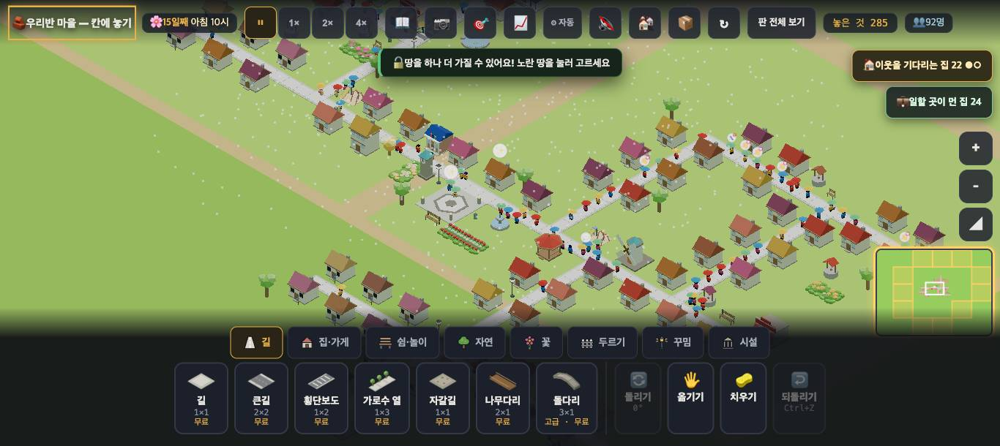
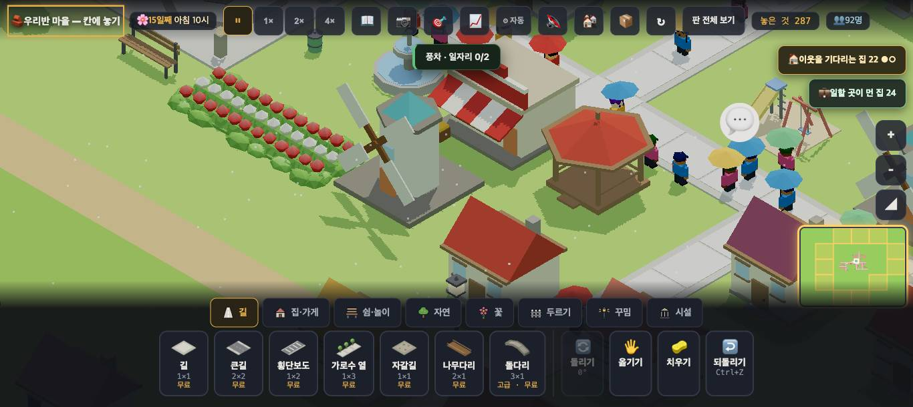
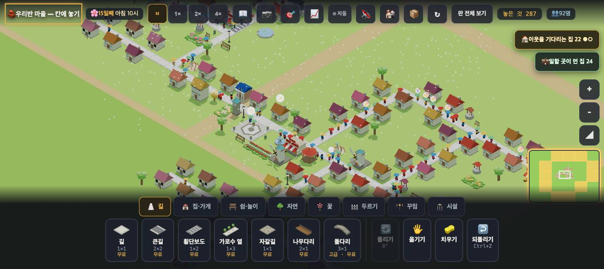

# 창조자의 눈 — 관찰 기록 7회: 일자리가 풀린 다음 (2026-09-20)

> 첫 질문은 그대로: **"커지면 무엇이 막히고 무엇이 필요해지나."** 분위기 연기 제안은 뺐다.
> 본 판: `origin/feat/village-45` **78d61a9**(#672/#676 일자리 집 단위 · #670 붐빔 집 단위 · #671 · #674 · #673 버스 제안서). `?sid=guest&dev=1` 로만 · 코드 수정 0.
> 판: `village/stages/boards/pop88.json`(주로) · `pop167.json`. 화면은 앱 안 브라우저와 Playwright(그림 저장). 숫자는 새 도구 `node scripts/village-sim/run.mjs`(3D 없이 · 같은 시드끼리 비교).
> 체험판 주소(8790)와 같은 판을 가려진 칸에서도 시간이 흐르게 하는 틀(scratchpad)로 띄워 봤다 — 앱 코드는 그대로.
> 표: 🔴 막힘 · 🟡 필요해짐 · 🟢 씨앗. 항목마다 **👀 아이 눈에 보인 것** 한 줄.

## 한 줄
**💼 는 아이에게 읽힌다. 그런데 가게 말고는 잘 안 풀리고, 일자리를 풀어 주는 순간 다음 벽 — 집 앞 길의 붐빔 — 이 더 커지는데, 이미 지은 골목은 넓힐 방법이 없다.**

---

## ① 💼 가 뜬 순간 — 까닭을 읽고 한 수로 푸는가

- 👀 pop88 판을 열고 하루 뒤 오른쪽 위에 **"💼 일할 곳이 먼 집 24"** 와 **"🏠 이웃을 기다리는 집 22 ●○"** 두 칩. 💼 를 누르니 카메라가 그 동네로 가고 **"💼 이 동네 24채 · 어른들 일할 곳이 닿지 않아요 — 가까이 가게·온실·풍차를 지어 봐요"**.
- 👀 (그림 1) 다시 열어 누른 때엔 같은 순간 **"🔓 땅을 하나 더 가질 수 있어요!"가 💼 설명을 덮었다.** 칩을 누른 대답이 다른 소식에 밀린다.
- 👀 **어느 24채인지는 화면에 표시가 없다** — 동네 가운데로 날아갈 뿐.

**몇 번 만에 풀리나 (화면 · 아이가 권유대로 한 수씩)**

| 한 수 | 칩 | 👀 |
|---|---|---|
| 동네 가운데 **가게** 하나 | 24 → **20** (약 9초 = 시뮬 1시간 뒤) | 놓는 순간 ✓ 같은 반응 없음. 조금 뒤 숫자만 줄었다 |
| 그 곁 **풍차** 하나(풀밭) | 20 → **20** | 풍차를 누르면 **"풍차 · 일자리 0/2"** — 왜 0인지 말이 없다 |
| 길에 닿는 자리에 **풍차** 하나 더 | 19 → **20** | 이번엔 **"일자리 2/2"** 가 찼는데 칩은 안 줄었다 |

→ 세 수를 두고도 24 → 20. **아이는 "가게·온실·풍차"를 같은 값으로 믿는데, 실제로 칩을 줄인 건 가게뿐이었다.**

### 🔴 1. 풍차·온실은 길에 안 닿아도 놓이고, 그러면 일꾼이 못 온다

- 👀 (그림 2) 가게 뒤 풀밭에 풍차가 섰다. 누르면 "풍차 · 일자리 0/2". 바로 곁에 일 없는 집이 스무 채다.
- 코드: `shop` 은 `needRoad:true` 인데 `windmill`·`green`(온실)은 없다. 가게는 "가게는 길에 붙어야 해요"로 막아 주지만 풍차·온실은 **말없이 놓이고 말없이 비어 있다.**
- 짝: 💼 안내가 "가게·온실·풍차"를 나란히 권하니, 풍차부터 놓는 아이가 이 구멍에 먼저 빠진다.

### 🔴 2. 길에 닿은 풍차도 '일 먼 집'을 줄이지 않는다
- 👀 길에 닿게 놓은 풍차는 "일자리 2/2"로 찼는데 💼 칩은 19 → 20.
- 도구(pop88 · 2일 · 시드 5): **풍차 길에 닿은 자리(172,141) → 일먼집 0 · 찬자리 0 / 5시드**, 풀밭 자리(168,155)도 0/5. 가게는 같은 동네에서 **−4 · 5/5시드**.
- 짐작: 풍차 두 자리가 이미 일하던 집의 어른으로 채워지고, **아무도 일 안 하던 집**(칩이 세는 집)에는 안 간다 — 프로그램 담당 확인 몫. 아이 눈엔 "권한 대로 했는데 안 된다".

### 🟡 3. 풀린 걸 알려 주는 반응이 없다
- 우물엔 🪣✓(#516)가 있는데 가게를 놓아 네 집이 풀린 순간엔 아무 반응이 없다. 숫자는 시뮬 1시간(실제 9초) 뒤에 조용히 바뀐다(셈이 판을 90조각으로 나눠 돈다). **💼✓** 가 그 네 채 위에 한 번 뜨면 '가게 → 일자리'가 이어진다.

## ② 가게가 한눈에 가게로 읽히나 (기본 확대 · 한 칸 33px)

- 👀 (그림 3) **빨강·흰 줄무늬 차양**이 가게 표시다 — 알아볼 수는 있다. 다만 빨간 지붕 집들 사이에선 차양이 작아 묻힌다(가운데 새 가게). 집 사이에서 가게를 찾으려면 줄무늬를 찾아야 한다 — **🟡 멀리서는 색보다 모양**(키가 다르거나 앞에 좌판 하나)이 더 빨리 읽힐 것.

## ③ 일자리 다음에 부딪히는 멈춤 — **집 앞 길의 붐빔**

**pop88 에서 사는 집 47채가 😊 가 못 되는 까닭(집을 누른 말로 셈)**

| | 처음 | 도서관 하나 더(167,148) | 큰길 둘(가장 붐빈 곳) + 넷(붐빈 집 곁) |
|---|---|---|---|
| 배울 곳이 멀어요 | 38 | **22** | 22 |
| **길이 붐벼요** | 33 | **36** | **36** |
| 일할 곳 | 21 | 19 | — |
| 놀 곳 | 15 | 15 | — |
| 😊 집 | 0 | 1 | 1 |

- 배움은 이제 풀린다(도서관이 여럿 — 카드에 "📚 이 동네에 도서관을 하나 더 지어 봐요"). 도서관 하나로 16채.
- **붐빔은 늘기만 한다.** 가게·도서관을 놓을수록 그리로 가는 길이 붐빈다 — 도구로도 가게 셋이면 붐빔집 **24 → 31**(3/3시드).

### 🔴 4. 이미 지은 골목은 넓힐 수 없다 — 붐빔(집 단위)의 한 수가 없다
- 규칙(#670): 집의 붐빔 = **그 집 문 앞 길 칸**의 교통량 ÷ 품(한 칸 길 4 · 큰길 8).
- 👀 붐비는 집의 문 앞 길에 큰길을 덮으려 하면 **"여기엔 이미 길이 있어요"**. 길 옆은 집이 붙어 있어 2×2 큰길이 들어갈 자리가 없다.
- 👀 큰길을 **가장 붐빈 길 옆에 둘**, **붐빈 집 곁에 넷** 놓았다 — 붐빈 집 **36 그대로**, 붐비는 길 칸 114 → 117. 도구도 같다: 큰길 셋(`@crowd`) → 붐빔집 −1(27 → 26).
- 👀 붐비는 집을 누르면 **"😟 … · 길이 붐벼요"** 뿐 — 배움처럼 "무엇을 해 봐요"가 없다.
- → 지금 아이가 할 수 있는 건 **길을 치우고(집도 치우고) 큰길로 다시 까는 것**뿐. 그걸 알아낼 아이는 드물고, 해도 동네가 한동안 끊긴다.

### 🟢 5. 도시 씨앗 — 버스 제안서를 '붐빔'에도 잇자
- 제안서(docs/village_bus_proposal.md)는 **하나뿐인 특별 건물**(학교·박물관·역)의 '멀어요'를 푼다. 그런데 7회 판에서 일자리 다음 벽은 '멀어요'가 아니라 **붐빔**이다(배움은 도서관 여럿으로 이미 풀림 — 6회 🔴2 는 학교·박물관·역만 남았다).
- 버스는 원래 **길을 덜 붐비게 하는 물건**이다. 규칙 한 줄 덧붙이기: **"정류장에서 걸어서 N칸 안의 집은, 나들이의 절반을 버스로 간다 — 그 집이 지나는 길 칸에 더하는 교통량을 절반으로."** 판정은 #670 의 길 BFS 에 곱셈 하나. 아이가 놓는 것은 여전히 **정류장 하나**(집을 안 치워도 된다).
- 그러면 한 물건이 두 문제를 푼다: 먼 특별 건물(제안서 본래) + 이미 지은 골목의 붐빔(🔴4). 부르는 다음: 정류장이 여럿 → 버스 한 대로 모자람 → 노선(겨울 '교통') · 버스가 다니는 길 → 횡단보도에 이유.
- 제안서 ⓑ 의 해금 '인구 200' 은 붐빔이 88명에서 이미 36채라 **늦다** — 붐빔이 문턱(예: 붐비는 집 10채)을 넘는 때로.
- 🟡 버스 전의 작은 한 걸음: 붐비는 집 카드에 **"🛣️ 문 앞 길을 큰길로 — 길을 치우고 다시 깔아 봐요"** 같은 한 수 말. 지금은 해법이 화면 어디에도 없다.

## ④ 도구로 확인한 것 (`village-sim` · pop88 · 같은 시드끼리)

| 한 수 | 무엇이 | 좋아진 시드 | 인과 지연 |
|---|---|---|---|
| 가게 1(`@jobs`) | 일먼집 24 → 20 | 5/5 | 2시간 |
| 가게 3(`@jobs`) | 일먼집 24 → 12 · 찬자리 +12 · 2층이상 +0.8 · 인구 +1.2 | 5/5 · 5/5 · 4/5 · 4/5 | 2 · 2 · 22 · 62시간 |
| 가게 3 | **붐빔집 24 → 31** | (나빠짐 3/3) | — |
| 풍차 1(`@jobs`) · 풍차(길 닿음 172,141) · 풍차(풀밭 168,155) | 일먼집 0 · 찬자리 0 | 0/5 · 0/5 · 0/5 | 안 풀림 |
| 큰길 3(`@crowd`) | 붐빔집 27 → 26 | 3/3 | 64시간 |
| 셋 다(가게3·큰길3) | 😊 집 | 0/3 | 안 풀림 |

- 화면에서 본 **"가게는 풀고 풍차는 안 푼다"**(①)와 **"큰길로는 붐빔이 안 풀린다"**(③)를 도구가 같은 숫자로 확인했다.
- 도구의 `put library @need:배움 2` 는 "그런 집이 없음"으로 0개가 놓여 — 배움 쪽은 화면에서만 쟀다(`@need` 키가 '배움'을 못 찾는 듯 — 도구 담당 확인 몫).

---

## 보스에게 따로
1. 🔴1(풍차·온실 `needRoad` 없음)은 한 줄 규칙 구멍이다 — 💼 안내가 이 셋을 나란히 권하는 한 먼저 막을 것.
2. 🔴2(길에 닿은 풍차가 일 먼 집을 안 줄임)는 배정 순서 문제로 보인다 — 도구로 재현됨(0/5).
3. 🔴4 가 다음 멈춤이다. 버스 제안서를 붐빔에도 잇는 것(🟢5)이 창조자의 눈 추천 — 아이의 한 수가 '정류장 하나'로 남는다.
