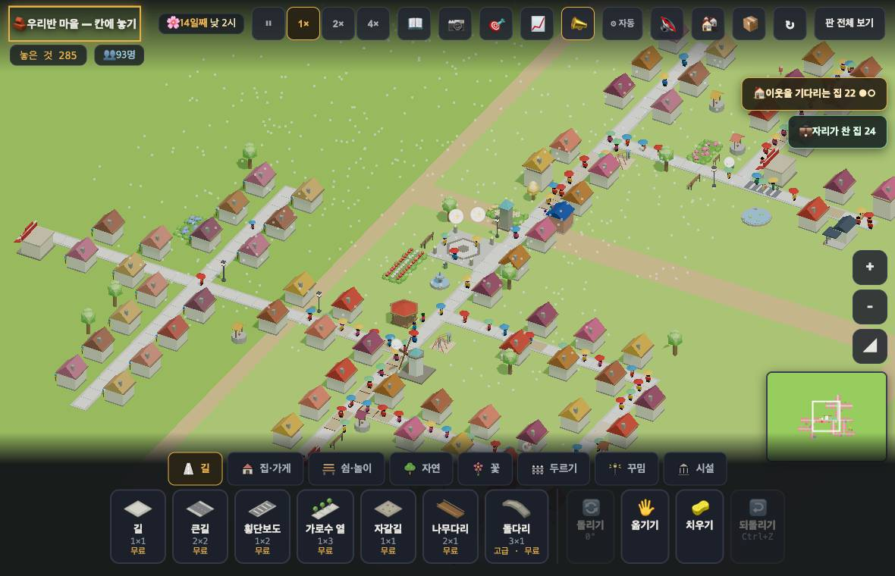
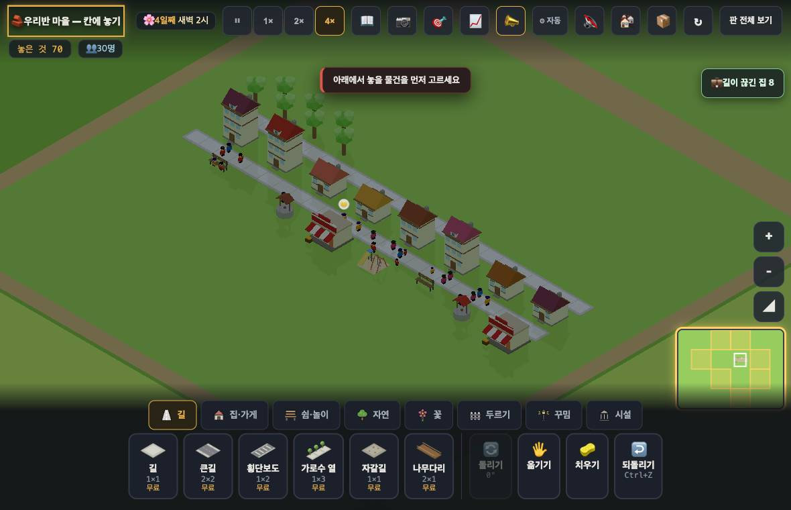
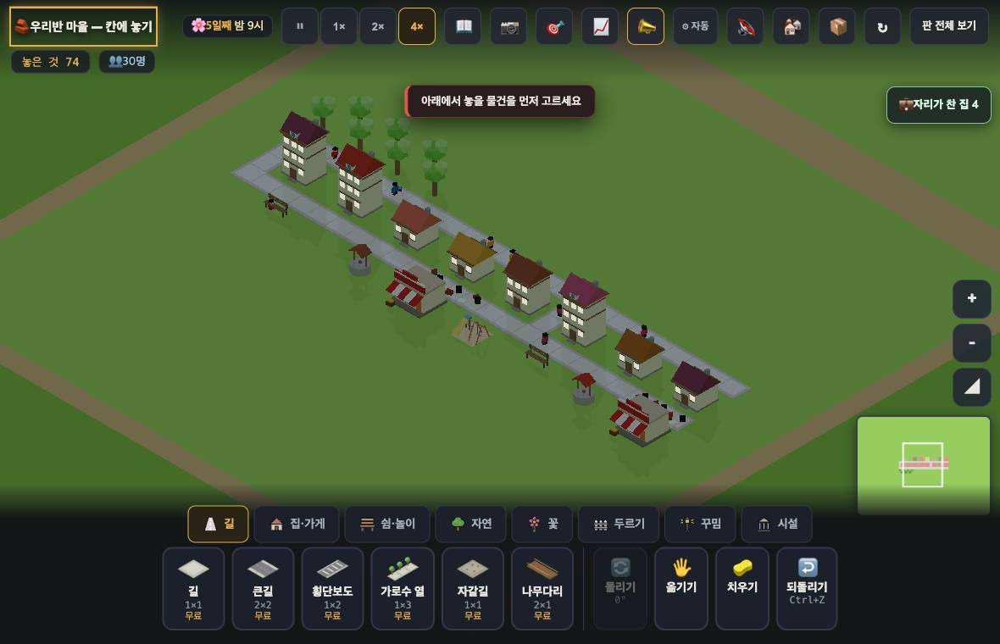

# 창조자의 눈 — 관찰 기록 10회: 경고는 맞아졌다 · 그런데 시킨 대로 하면 아직 길을 잃는다 (2026-09-21)

> 이번 초점(보스): 9회에 찾은 둘(#728 필요가 깨지던 것 · #732 붐빔이 집 4채에서 시작하던 것)이 고쳐졌다 — **거짓 경고가 걷힌 것인가, 필요한 경고까지 사라졌는가.** 그리고 새 안내 둘·끊김 말(#729)이 실제로 듣는가.
> 본 판: `origin/main` **42510c6**(#732 까지). `?sid=guest&dev=1` 로만 · **코드 수정 0**.
> 판: `village/stages/boards/pop88.json` · `docs/creator_notes/boards/young4.json` · 이번에 만든 `young8.json`(같은 마을 집 8채).
> 이번 회부터 보스 요청대로 둘로 나눈다: **【A】아이가 틀린 것을 배운다**(즉시) · **【B】그냥 아쉽다**(쌓아 둘 것).

## 한 줄
**경고는 이제 거의 다 진짜다(새 경고 12채 중 9채). 그런데 그 경고가 시키는 "집 뒤쪽에 길을 한 줄 더"를 아이가 그리는 대로 그리면 — 끝을 잇지 않으면 — 여덟 집 전부가 "길이 끊겨 일터에 못 가요"가 되고, 붐빔 경고는 0 이 되어 **성공한 것처럼 보인다.** 끝 네 칸만 이으면 실제로 듣는다(붐비는 집 3~4 → 1).**

---

## ✅ 고쳐진 것 — 같은 자리에서 확인

| 9회 지적 | 지금 | 잰 값 |
|---|---|---|
| 🔴1 뒤쪽에 길을 내면 필요(물·장·놀·배움)가 한꺼번에 멀어졌다 | **풀림**(#728) | 길을 낸 뒤에도 여덟 집 전부 "**다 있어요**" 그대로 |
| 🔴2 집 4채·16명인데 "길이 붐벼요" | **풀림**(#732) | young4 붐비는집 **3 → 0** · pop88 **27 → 12** |
| 9회 덧1 길을 끊었는데 "일할 곳이 없어요"로 떴다 | **풀림**(#729) | 길 두 칸을 지우니 **6초** 만에 "**길이 끊겨 일터에 못 가요**" · 칩도 "💼 길이 끊긴 집 8" |
| 9회 덧2 집이 2층에서 영영 멈췄다 | **풀림(덤)** | young4 네 집이 **모두 3층**까지 자랐다(인구 16 → 24) — 9회엔 6일을 돌려도 3층 0이었다 |

- 👀 **이번 회의 가장 큰 변화는 성장이 다시 돈다는 것이다.** 9회에 "멈춤의 진짜 이름은 붐빔"이라고 적었는데, 그 붐빔이 걷히자 같은 판에서 네 집이 하루 남짓에 3층이 됐다.

---

## ① 거짓 경고가 걷힌 것인가, 필요한 경고까지 사라졌는가 (pop88 · 낮 1시 · 식구 있는 집 46채)

세 가지를 같은 판·같은 시각에 나란히 셌다.

| 무엇 | 채수 |
|---|---|
| **새 경고**(제 몫 뺀 셈 · 지금 화면) | **12** |
| 옛 경고(제 몫 포함 · 9회 화면) | 27 |
| **걸음이 실제로 막히는 집**(`crowdHomes.on=false` 로 되돌린 옛 걷기 셈 — 주민이 붐빈 틱 30% 이상) | **33** |

| 갈라 보면 | 채수 |
|---|---|
| 새 경고인데 **걸음은 안 막힘**(거짓 경고) | **3** |
| 새 경고이고 **진짜 막힘** | **9** |
| 경고가 **사라진** 집(27 − 12) | 15 |
| 그중 **진짜 막히는 집** | **8** |
| **진짜 막히는데 아무 말도 안 하는 집** | **24** |

- **답: 거짓 경고가 걷힌 것이 맞다**(말하는 집 12채 중 9채는 진짜) — 아이가 화면 말을 믿을 수 있게 됐다.
- **그런데 필요한 경고도 8채 사라졌고**, 마을 전체로는 실제로 막히는 33채 중 **24채가 조용하다.**
- ⚖ 다만 '걸음이 막힘'도 후한 잣대다 — 한 칸에 둘이면 붐빔으로 센다(낮 1시에 93명 중 64명이 여기 걸린다). 그러니 "24채 전부에 경고를 달라"가 아니라 **"33 ↔ 12 사이 어디인지"** 를 사람이 한 번 정할 값이다.
- 👀 같은 길 같은 줄에 나란히 선 두 집 중 **(141,145)은 말이 없고 (144,145)는 "길이 붐벼요"** 다(합 1.2 vs 1.6). 아이 눈에 두 집 앞 길은 똑같아 보인다.

## ② young4 를 키우면 다시 붐비는가 — 그렇다

| | 집 4채 | 집 4채(3층까지 자란 뒤) | **집 8채** |
|---|---|---|---|
| 인구 | 16 | 24 | 26 → 30 |
| 붐비는 집 | **0** | **2** | **3 → 4** |
| 집붐빔 최대 | 0.75 | 1.13 | 1.5 → 2.06 |

- 👀 아이가 겪는 차례가 자연스럽다: 집 4채로 시작 → 아무 말 없음 → 자라고 이웃이 늘자 **"길이 붐벼요"** 가 하나씩 켜진다. **'커지니 길이 좁아졌다'로 읽힌다.**
- 🟡 다만 같은 순간에 "가까운 일터가 꽉 찼어요"도 네 집에 켜진다(집 8채·29명에서 붐빔 4 · 일터 4). 아이는 **두 가지 숙제를 한꺼번에** 받는다 — 어느 것부터인지 화면이 말해 주지 않는다.

## ③ 새 안내 둘은 실제로 듣는가

### ③-가 "🛣️ 집 뒤쪽에 길을 한 줄 더 내 봐요" — **이으면 듣고, 안 이으면 마을이 멎는다**

- **이었을 때**: 뒤쪽 한 줄 + **끝 네 칸**(양끝에서 본길로 내려오는 칸)을 깔았더니 붐비는 집 **3~4 → 1**, 네 집이 😊 로 돌아왔다. **실제로 듣는다.**
- **안 이었을 때**(아이가 그릴 법한 그대로 — 집 뒤로 한 줄만 쭉): **여덟 집 전부** "길이 끊겨 일터에 못 가요" · 칩 "💼 길이 끊긴 집 8" · 붐빔 경고는 **0** 이 됐다(→ 아래 【A】1).

### ③-나 "우물이 붙어 있어요 — 🖐 로 한 칸 옮기면 자리가 나요" — **듣는다**

- 막힌 까닭을 **이름으로** 짚어 준다: "**우물**이 붙어 있어요" · "**긴의자**가 붙어 있어요" · "**가게**가 붙어 있어요". 7회·9회에 "무엇이 막았는지 화면에 없다"고 적은 것이 풀렸다.
- 시킨 대로 🖐 로 우물을 **한 칸** 옮겼더니 막혔던 큰길이 **바로 놓였고**, 네 집 모두 "다 있어요"가 그대로였다. 👀 아이의 한 수(옮기기 한 번)로 끝난다.
- 큰길이 막힌 집은 말이 저절로 "**집 뒤쪽에 길을 한 줄 더**"로 바뀐다 — 두 안내가 이어져 있다.

## ④ 길 끊김 말 — **cut 으로 뜬다**(#729)

- pop88 에서 일하던 집과 가게 사이 길 두 칸을 지웠다 → **6초 뒤** "길이 끊겨 일터에 못 가요". 9회엔 같은 자리에서 "일할 곳이 없어요"였다.
- 훅 `__jobWhy()` 도 cut 12 로 센다(9회 0).

---

# 【A】아이가 틀린 것을 배운다

## A1. 🔴 "집 뒤쪽에 길을 한 줄 더" 를 그린 대로 따르면 마을이 멎고, 화면은 성공처럼 보인다

- 화면이 시킨 그대로 집 뒤에 한 줄(24칸)을 깔았다. 본길은 **한 칸도 안 건드렸다.**

| | 한 줄 긋기 전 | **그은 뒤(안 이음)** | 끝 네 칸을 이은 뒤 |
|---|---|---|---|
| 붐비는 집 | 3~4 | **0** | **1** |
| "길이 끊겨 일터에 못 가요" | 0채 | **8채(전부)** | 0채 |
| 집 얼굴 | 😊 4 · 😐 4 | 😐 8 | 😊 4 · 😐 4 |

- 까닭: 집의 '문 앞 길 칸'이 **새로 깐 뒤쪽 길**로 바뀌는데, 그 길이 본길과 안 이어져 있으면 일터로 가는 길 찾기가 실패한다. 필요(물·장·놀·배움)는 #728 덕에 살아 있어서 "**다 있어요**"라고 말하므로 **더 헷갈린다.**
- 👀 아이가 보는 것: 시킨 대로 했다 → **붐벼요가 싹 사라졌다**(성공!) → 그런데 모든 집이 "일터에 못 간대" → **"길을 내면 안 되는구나"**. 9회와 정반대 방향으로 똑같이 틀린 것을 배운다.
- 🟢 고칠 거리는 작아 보인다: 안내문에 **"끝을 본길과 이어 줘요"** 한마디, 또는 끊긴 새 길을 깔았을 때 "🛣️ 이 길은 아직 본길과 안 이어졌어요 — 끝을 이어 봐요" 한 줄.

## A2. 🔴 진짜 막히는 길의 3분의 2가 아무 말도 안 한다

- ①의 표대로 **33채가 실제로 막히는데 24채가 조용하다**(경고는 12채). 아이는 "우리 마을은 이제 안 붐빈다"로 읽고, **길을 넓힐 까닭을 못 배운다.**
- 이건 버그가 아니라 **문턱을 어디에 둘지**의 문제다(지금 문턱 = 남이 지나는 몫이 품 4를 넘을 때). 값 하나만 사람이 정하면 된다 — 예를 들어 품을 3으로 낮추면 몇 채가 되는지 다음 회에 재 줄 수 있다.
- ⚖ 반대쪽도 적어 둔다: 새 경고 12채 중 **9채는 진짜**다. 9회의 "거짓 경고" 문제는 확실히 좋아졌다.

# 【B】그냥 아쉬운 것 (쌓아 둘 것)

- **B1.** 같은 길에 나란한 두 집 중 하나만 "붐벼요"라고 한다(141,145 조용 · 144,145 경고). 까닭은 식구 수와 문 앞 칸 차이인데 **아이 눈엔 두 길이 똑같다.**
- **B2.** 🖐 로 우물을 **두 칸** 옮기면 "물 뜰 곳이 멀어요"가 새로 생긴다(한 칸은 안 생긴다 — 안내문은 맞다). 옮긴 뒤 필요가 깨지면 그 자리에서 한마디 해 주면 좋겠다.
- **B3.** 집 8채·29명에서 "길이 붐벼요" 4채와 "가까운 일터가 꽉 찼어요" 4채가 **동시에** 뜬다. 무엇부터 할지 고르는 도움이 없다.
- **B4.** 집 경고와 길 경고가 서로 다른 말을 한다 — pop88 에서 **붐비는 길 칸은 122칸 중 57~64칸**(거의 절반)인데 붐비는 집은 12채다. 지도를 색으로 보면 붐비는데 집들은 조용하다.

---

## 다음 회에 볼 잣대
1. `young8.json` 을 열고 **뒤쪽 한 줄(안 이음)** → 여덟 집이 "길이 끊겨"가 되는지(고쳐졌다면 새 안내가 뭐라 하는지).
2. 같은 판에서 **끝 네 칸을 이었을 때** 붐비는 집 3~4 → 1 이 그대로인지.
3. pop88 에서 **새 경고 · 옛 경고 · 걸음 막힘** 세 숫자를 같은 시각(낮 1시)에 다시(이번 12 / 27 / 33 과 나란히).
4. 문턱을 바꾼다면 바꾼 뒤 **거짓 경고 수**(지금 3채)가 얼마나 느는지.

## 보스에게 따로
1. **A1 하나만 고치면 이번 회 몫은 거의 다 한다.** 안내대로 따라 한 아이가 가장 크게 다치는 자리다.
2. A2 는 값 하나(품)의 문제로 보인다 — 원하면 다음 회에 품 3·2 로 바꿔 가며 **거짓 경고 ↔ 놓친 경고** 표를 만들어 올리겠다.
3. 재현용 판 `docs/creator_notes/boards/young8.json`(집 8채 · 인구 26)을 넣어 뒀다. `?sid=guest&dev=1` 에서 `__importText(글)` 후 새로고침.
4. ①의 '걸음 막힘' 숫자는 `VRULES.crowdHomes.on=false` 로 옛 셈을 되살려 잰 것이다(내 브라우저에서만 · 판 파일은 안 건드렸다).
