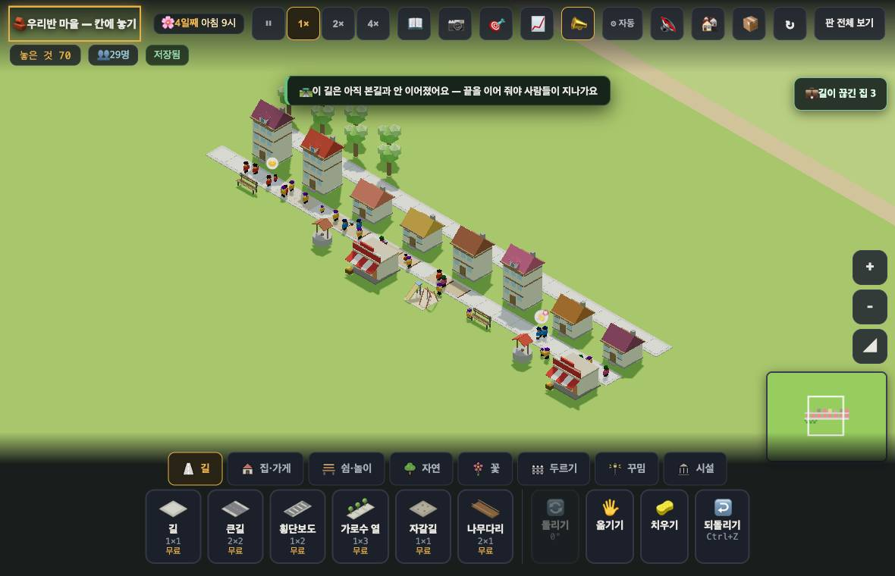
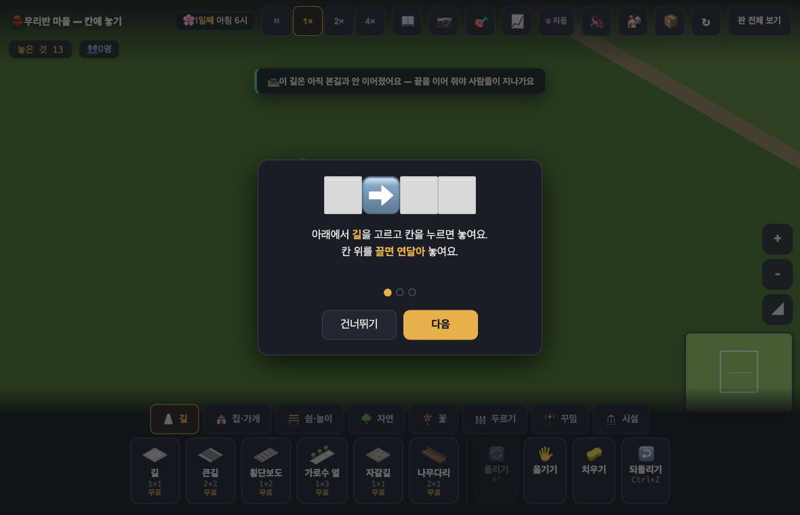

# 창조자의 눈 — 관찰 기록 11회: 품 표 · 그리고 새 한마디가 첫 마을에서 틀린다 (2026-09-21)

> 이번 과제(보스): ① 품 4·3·2 로 **거짓 경고 ↔ 놓친 경고** 표를 만들고 추천 한 줄 · ② 10회 A1 고침(#737)이 실제로 듣는지 재확인.
> 본 판: `origin/main` **920e254**(#737 까지). `?sid=guest&dev=1` 로만 · **코드 수정 0**.
> 판: `pop88` · `pop167` · `young8`(집 8채) · `young4`(집 4채).
> 보고는 10회처럼 **【A】아이가 틀린 것을 배운다** / **【B】그냥 아쉽다** 로 가른다.

## 한 줄
**품은 3 을 추천한다 — 놓친 경고가 40% 줄고, 첫 마을(집 4채)은 여전히 조용하다(품 2 는 그게 깨진다). 그리고 새로 들어온 "이 길은 아직 본길과 안 이어졌어요"는 정작 **새 마을의 첫 수**에서 틀리게 뜬다 — 첫 목표가 "길을 6칸 더 잇기"인데, 그 길을 놓는 순간 뜬다.**

---

## ① 품 표 (같은 판 · 같은 시각 낮 1시 · 같은 잣대)

**잣대**: '걸음이 실제로 막히는 집' = `VRULES.crowdHomes.on=false` 로 되돌린 **옛 걷기 셈**(주민이 붐빈 틱 30% 이상). 내 브라우저에서만 껐다 켰고 판 파일은 안 건드렸다.

> ⚠ **이 잣대는 후하다.** 한 칸에 둘만 서도 '붐빔'으로 센다 — pop88 은 46채 중 **36채(78%)**, pop167 은 81채 중 **52채(64%)**, young8 은 8채 중 **8채(100%)** 가 여기 걸린다.
> 그래서 표의 **'놓침'은 위로 부풀고, '거짓'은 아주 분명한 것만** 잡힌다. 두 칸을 같은 저울로 보면 안 된다.

| 판 (식구 있는 집) | 걸음 막힘 | 품 | **경고** | **거짓**(경고인데 안 막힘) | **놓침**(막히는데 말 없음) | 거짓 비율 |
|---|---|---|---|---|---|---|
| **pop88** (46채 · 93명) | 36 | **4**(지금) | 12 | **2** | **26** | 17% |
| | | **3** | 25 | **5** | **16** | 20% |
| | | **2** | 30 | **7** | **13** | 23% |
| **pop167** (81채 · 184명) | 52 | **4**(지금) | 38 | **7** | **21** | 18% |
| | | **3** | 56 | **16** | **12** | 29% |
| | | **2** | 60 | **18** | **10** | 30% |
| **young8** (8채 · 30명) | 8 | **4**(지금) | 4 | **0** | 4 | 0% |
| | | **3** | 4 | **0** | 4 | 0% |
| | | **2** | 6 | **0** | 2 | 0% |

**첫 마을이 다시 붐빈다고 하는가** — #732 가 고친 자리(9회 🔴2)가 품을 낮춰도 안 돌아오는지 따로 봤다.

| 판 | 품 4 | 품 3 | 품 2 |
|---|---|---|---|
| **young4** 갓 시작(집 4채 · 16~17명) | 경고 **0** | 경고 **0** ✅ | 경고 **2** ❌ |
| young4 3층까지 자란 뒤(20명) | 0 | 1 | 2 |

### 추천: **품 3**

- **까닭 한 줄**: 놓친 경고가 pop88 26 → 16 · pop167 21 → 12 로 **약 40% 줄어드는데, 첫 마을(집 4채·16명)은 품 3 에서도 여전히 조용하다** — 품 2 는 그 마을이 다시 경고 2채가 되어 #732 로 고친 것이 되돌아간다.
- 덧붙일 값: 품 3 에서도 **말하는 집 다섯 중 넷은 진짜**다(pop88 20/25 · pop167 40/56). 큰 판(pop167)에서 거짓이 7 → 16 으로 느는 것이 유일한 값이고, 그 16채도 '걷기 잣대가 안 잡았을 뿐'이지 문 앞을 지나는 사람이 품을 넘긴 집들이다.
- 품 2 는 권하지 않는다: 얻는 것(놓침 16 → 13)이 작고, **잃는 것(첫 마을이 다시 붐빔)이 크다.**

---

## ② 10회 A1 고침(#737) 재확인 — young8 에서 같은 수

### ⓐ 그 한마디가 뜨는가 — **뜬다**

- 뒤쪽 한 줄(24칸)을 깔자마자 **"🛣️ 이 길은 아직 본길과 안 이어졌어요 — 끝을 이어 줘야 사람들이 지나가요"**. 훅 `__roadJoin()` 도 `봄 1 · 말함 1 · 이어짐 0`.
- 권하는 말 자체도 바뀌었다: "집 뒤쪽에 길을 한 줄 더 내 봐요 — **끝은 본길과 이어 줘요**".

### ⓑ 아이가 끝을 잇게 되는가 — **말은 정확하다 · 이은 뒤 아무 말이 없다**

- 말대로 양끝 **네 칸**을 이었더니 곧바로 **"길이 끊겨" 여덟 집 → 0채 · 붐비는 집 4 → 1 · 네 집 😊**(10회와 같은 값).
- 🟡 그런데 **이은 순간 화면은 조용하다**(`이어짐` 만 소리 없이 1 늘어난다). 아이가 "고쳤다"를 알 방법은 **한마디가 다시 안 뜬다**는 것뿐이다.

### ⓒ '성공처럼 보이는' 착각은 사라졌는가 — **절반만**

| | 10회(고침 전) | 지금(#737) |
|---|---|---|
| 깔자마자 | 아무 말 없음 | **한마디 뜸** ✅ |
| 붐비는 집 | 3~4 → **0** | 3~4 → **0** (그대로) |
| 집 카드 | "길이 끊겨 일터에 못 가요" 8채 | 그대로 8채 |
| 칩 | "💼 길이 끊긴 집 8" | 그대로 |

- **붐빔이 0 이 되는 것 자체는 그대로**다. 한마디를 놓치면(다른 소식에 덮이거나 딴 데를 보고 있으면) 화면에 남는 것은 10회와 똑같다.
- 한마디는 **20초에 한 번만** 한다. 아이가 길을 여러 번 나눠 그으면 **처음 한 번**만 듣는다.

---

# 【A】아이가 틀린 것을 배운다

## A1. 🔴 새 마을의 **첫 수**에서 그 한마디가 틀리게 뜬다

- 새 마을(`#fresh`)의 **첫 목표는 "길을 6칸 더 잇기"** 다. 시작 길에 붙여 길 한 칸을 놓았다 → 바로 **"🛣️ 이 길은 아직 본길과 안 이어졌어요"**.
- 👀 그림처럼 **"아래에서 길을 고르고 칸을 누르면 놓여요" 라는 첫 안내 창이 떠 있는 그 위에** 겹쳐 뜬다. 아이가 게임에서 보는 **두 번째 문장**이 "네가 방금 한 것이 잘못됐다"이다.
- 까닭(코드): 이어짐 판정이 "그 길에서 길을 따라 **시설**(필요·일자리를 주는 건물)에 닿나"다. 새 마을엔 **시설이 아직 하나도 없다** — 그래서 무엇을 어떻게 놓아도 '안 이어짐'이다. 우물을 하나 놓자마자 말이 멎었다(`이어짐 1`).
- 아이가 배우는 것: **"길을 놓으면 혼난다."** 10회 A1 과 정확히 같은 오해를, 이번엔 **시작하자마자** 배운다.
- 🟢 고칠 거리: 판정을 "시설에 닿나" 대신 **"내가 깔기 전부터 있던 길에 닿나"**(= 새 길이 기존 길그물에 붙었나)로 보면 첫 마을에서도 맞다. 또는 **시설이 0개인 마을에서는 말하지 않기** 한 줄.

## A2. 🔴 (이어짐) 진짜 막히는 집의 절반 이상이 아직 조용하다

- ①의 표대로 지금(품 4) pop88 은 **36채가 막히는데 12채만** 말한다. 품 3 으로 올리면 25채가 말한다.
- 이건 값 하나의 문제이므로 위 표로 갈음한다 — **보스가 고르면 끝난다.**

# 【B】그냥 아쉬운 것

- **B5.** 끝을 이은 순간 **아무 말이 없다**(ⓑ). "🛣️ 이제 이어졌어요" 한마디면 아이가 자기 수를 확인한다.
- **B6.** 그 한마디는 20초에 한 번뿐이라, 길을 여러 번 나눠 긋는 아이는 **처음 한 번만** 듣는다. 끊긴 채로 남아 있는 동안엔 화면 어디에도 '어느 길이 문제인지' 표시가 없다(칩은 "💼 길이 끊긴 집 8"이라고만 한다 — 집 쪽만 가리킨다).
- **B7.** 품을 바꿔도 **붐비는 길 칸**은 따로 논다(pop88 122칸 중 57~64칸). 집 경고와 길 색이 계속 다른 말을 한다(10회 B4 와 같은 자리).

---

## 다음 회에 볼 잣대
1. 품을 바꾸면 pop88·pop167·young4 에서 **경고 / 거짓 / 놓침**을 이 표와 나란히 다시.
2. `#fresh` 새 마을에서 **첫 길 한 칸**을 놓았을 때 그 한마디가 뜨는지(A1 이 고쳐졌다면 안 떠야 한다).
3. 끝을 이었을 때 **'이제 이어졌어요'** 가 생겼는지.

## 보스에게 따로
1. **품 3 추천**(까닭은 위 한 줄). 표의 '거짓/놓침'은 **저울이 다르다**는 것만 같이 봐 주시라 — 잣대가 후해서 놓침은 부풀고 거짓은 엄하다.
2. **A1 은 #737 의 판정 한 줄만 바꾸면 된다**(시설 대신 '원래 있던 길'). 지금 상태로 두면 **모든 아이가 게임을 시작한 지 10초 만에** 이 말을 본다 — 10회 A1 보다 더 자주 만나는 자리다.
3. ②는 ⓐ ✅ · ⓑ 말은 정확 · ⓒ 절반. 붐빔이 0 이 되는 것 자체는 그대로라, '길이 끊긴 집' 칩이 **어느 길 때문인지** 짚어 주면 나머지 절반이 닫힌다.
