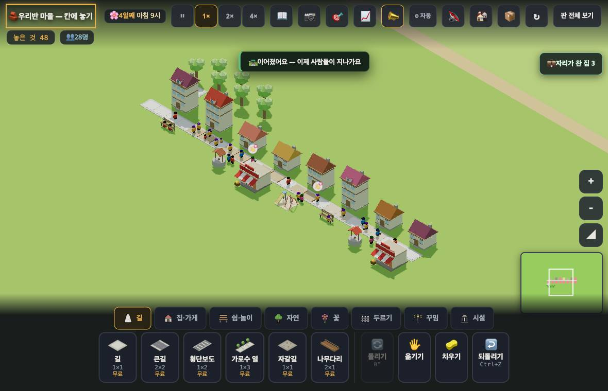

# 창조자의 눈 — 관찰 기록 12회: #741 재확인 · 품 3 의 거짓 경고 · 그리고 "이어졌어요"가 안 이어졌는데 뜬다 (2026-09-21)

> 이번 과제(보스): ① #741 재확인(첫 수 조용한가 · 이으면 한마디 뜨는가 · young8 은 여전히 말하는가) ② **품 3 에서 거짓 경고 수** ③ 보고를 **ⓐ 멈추고 고칠 것 / ⓑ 이번 묶음 안에서 / ⓒ 적어 두고 아이 사용에서 확인할 것** 으로 가르기.
> 본 판: `origin/main` **38f2e98**(#741·#742 까지). `?sid=guest&dev=1` 로만 · **코드 수정 0**.

## 먼저 — 지난 회 표의 한계를 바로잡는다 (보스·외부 조언자 지적, 그대로 받는다)

1. **'걸음이 실제로 막히는 집'은 마을 전체의 정답이 아니다.** 걷는 사람 수에 뚜껑이 있다(`FOLK_CAP` 120명). 이번에 훅으로 직접 셌다 — **pop88 은 사람 93명 중 100명분이 다 걷지만**(전원), **pop167 은 인구 184명인데 걷는 사람이 120명**(65%)뿐이다. 즉 pop167 의 걷기 숫자는 **표본**이다.
2. **같은 판을 다시 재면 값이 꽤 흔들린다.** 11회 → 12회, 같은 판·같은 규칙인데 pop88 걸음막힘 36 → 38 · 거짓 5 → 2, pop167 걸음막힘 52 → 65 · 거짓 16 → 4.
3. 그래서 11회 품 표는 **'두 판정이 서로 어긋난다'를 보여 준 자료**이지, **문턱 3 이 교육적으로 옳다는 증명이 아니다.** 앞으로 그 표를 인용할 때 이 문장을 같이 쓴다.
4. 11회에 쓴 **"다섯 중 넷은 진짜"는 잘못된 요약**이었다(큰 판은 40/56 = 71%). 숫자와 요약이 어긋나지 않게 쓴다.
5. 앞으로 **현상과 해석을 나눠** 적는다. "아이는 …라고 배운다"는 해석이므로 ⓒ 로 내리고, 본문에는 **무엇이 화면에 떴는지**만 적는다.

---

## ① #741 재확인

| 보스가 물은 것 | 결과 | 잰 값 |
|---|---|---|
| `#fresh` 첫 수에서 조용한가 | **조용하다** ✅ | 첫 목표 "길을 6칸 더 잇기" 그대로 길 한 칸 → 말 없음(`__roadJoin`: 말함 **0** · 이어짐 1). 품도 3 으로 들어가 있다 |
| 끝을 이으면 "이어졌어요"가 뜨는가 | **뜬다** ✅ | young8 에서 끊긴 줄을 깐 뒤 양끝 네 칸을 이으니 "🛣️ 이어졌어요 — 이제 사람들이 지나가요"(`이음말 1`) |
| young8 은 여전히 말하는가 | **말한다** ✅ | 뒤쪽 한 줄을 **한 번에** 깔면 "🛣️ 이 길은 아직 본길과 안 이어졌어요"(`말함 1`) · 붐비는 집 4 |

- 곁가지로 본 것: 시설이 하나도 없는 새 마을에서는 **정말로 동떨어진 길**(시작 길에서 멀리 떨어진 칸)을 놓아도 조용하다(`조용 1`). 이을 데가 없으니 해로울 것은 없다.

## ② 품 3 에서 거짓 경고 · 놓친 경고 (같은 시각 낮 1시)

> 잣대는 11회와 같은 '걸음이 실제로 막히는 집'이고, **위 1·2 의 한계가 그대로 붙는다** — pop167 은 120명 표본이고, 같은 판도 잴 때마다 흔들린다.

| 판 | 식구 있는 집 | 인구 / 걷는 사람 | **경고(품 3)** | **거짓** | 놓침 | 걸음막힘 |
|---|---|---|---|---|---|---|
| **pop88** | 46 | 93 / **전원** | 21 | **2** | 19 | 38 |
| **pop167** | 81 | 184 / **120(표본)** | 56 | **4** | 13 | 65 |
| **young8** | 8 | 30 / 전원 | 4 | **0** | 3 | 7 |
| **young4**(첫 마을) | 4 | 16 / 전원 | **0** | 0 | — | — |

- **품 3 의 거짓 경고는 pop88 2채 · pop167 4채 · young8 0채**다(경고 대비 pop88 10% · pop167 7%).
- 11회에 내가 적은 거짓(5·16)보다 작다 — **규칙이 바뀌어서가 아니라 잴 때마다 흔들리기 때문**이다(위 2).
- 첫 마을(young4 · 집 4채·16명)은 품 3 에서 **여전히 경고 0**이다.

---

# ⓐ 하던 일을 멈추고 고칠 것

## ⓐ1. 길을 **한 칸씩** 놓으면, 두 번째 칸에서 "🛣️ 이어졌어요"가 뜬다 — 길은 그대로 끊겨 있다

**현상**(young8 · 1× · 2초 간격으로 톡톡):

| 아이가 한 것 | 화면이 한 말 | 게임 자신의 판정 |
|---|---|---|
| 집 뒤 빈 칸에 길 **한 칸** | "🛣️ 이 길은 아직 본길과 안 이어졌어요 — 끝을 이어 줘야 사람들이 지나가요" | 안 이어짐(맞다) |
| 그 옆에 길 **한 칸 더** | **"🛣️ 이어졌어요 — 이제 사람들이 지나가요"** | `__roadJoin(133,141).시설에닿음` = **false** (그대로 끊김) |

- 아홉 칸을 2초 간격으로 놓아 봤다: `봄 9 · 말함 1 · 이어짐 8 · 이음말 1`. **첫 칸에만 경고가 뜨고, 그 뒤로는 전부 '이어졌다'로 센다.** 그 사이 집들은 "길이 끊겨 일터에 못 가요"(8채), 붐비는 집은 0.
- 까닭(코드): 이어짐 판정이 **"이번 묶음에서 깐 칸을 뺀 길에 붙었나"**인데, 묶음은 손을 뗀 뒤 1.2초에 닫힌다. 그래서 **띄엄띄엄 놓으면 바로 앞에 놓은 내 칸이 '원래 있던 길'로 세어진다.**
- 이것은 **게임이 자기 판정과 반대되는 말을 하는 경우**다(집 카드는 "끊겼다", 소식은 "이어졌다").
- 🟢 고칠 거리: 이음 판정을 묶음 대신 **길그물에 실제로 닿는지**로 보면 된다 — 새 길에서 길을 따라가 **깔기 전부터 있던 길 칸**에 닿나(BFS 한 번). 지금 규칙은 곁 네 칸만 본다.

# ⓑ 이번 묶음 안에서 고칠 것

- **ⓑ1.** 끊긴 새 길이 문 앞이 되면 **붐빔 경고가 0 으로 사라진다**(10회부터 그대로 · young8 4 → 0). 끊김과 붐빔이 같은 자리를 놓고 서로 덮는다 — 끊긴 집은 붐빔을 **'셀 수 없음'** 으로 두는 편이 맞아 보인다.
- **ⓑ2.** "💼 길이 끊긴 집 8" 칩은 **집만 가리킨다.** 어느 길이 문제인지 화면에 표시가 없다(방금 깐 길을 되짚어 주면 한 번에 닫힌다).
- **ⓑ3.** 경고는 20초에 한 번만 한다 — 길을 여러 번 나눠 그으면 처음 한 번뿐이다(ⓐ1 을 고치면 같이 정리될 자리).

# ⓒ 적어 두고 **실제 아이 사용에서** 확인할 것

- **ⓒ1.** 아이가 길을 **끌어서** 긋는지, **한 칸씩 톡톡** 누르는지. ⓐ1 이 얼마나 자주 벌어지는지가 여기 달렸다(내 시험은 2초 간격 · 실제 아이 손은 못 봤다).
- **ⓒ2.** **품 3 이 교육적으로 맞는 값인지**는 도구로 못 정한다(위 1·2). 교실에서 "이 길이 붐벼 보이니?"를 몇 번 물어봐야 정해진다.
- **ⓒ3.** 소식(토스트)을 아이가 실제로 읽는지. "놓치면 10회와 같아진다"는 내 **추정**이다.
- **ⓒ4.** 10회 B3(붐빔 숙제와 일터 숙제가 동시에 뜸)이 실제로 아이를 멈추게 하는지.
- **ⓒ5.** "아이가 길을 놓으면 안 된다고 배운다" 같은 지난 회 문장들은 전부 ⓒ다 — 현상은 '첫 수에 틀린 경고가 떴다'까지였다.

---

## 다음 묶음 준비 — 밭에서 난 것이 가게로 가는 현상
보스가 알려 준 다음 잣대("빈 가게를 보고 **밭이 모자란지 길이 끊겼는지** 아이가 구분할 수 있는가")는 이렇게 재겠다.
1. 빈 가게 하나를 만들어 두고 **두 가지 원인**을 따로 만든다 — ⓐ 밭이 모자란 경우 ⓑ 밭은 넉넉한데 길이 끊긴 경우.
2. 두 경우에서 **가게를 눌렀을 때 뜨는 말**과 **칩**이 서로 다른지(9회 '자리 vs 거리'와 같은 잣대).
3. 아이가 둘 수 있는 한 수(밭 하나 더 / 길 잇기)를 각각 두고 **실제로 듣는지**(도구로 같은 시드끼리).
4. 위 ⓐ1 처럼 **말과 게임 판정이 어긋나는 자리**가 새로 생기는지.

## 보스에게 따로
1. **ⓐ1 은 #741 의 곁 네 칸 검사만 BFS 로 바꾸면 된다**(새 길 → 깔기 전부터 있던 길에 닿나). 지금은 "이어졌어요"가 **틀리게** 뜨므로 10회 A1 보다 나쁜 쪽이다 — 아이에게 '다 됐다'고 말해 버린다.
2. ②의 거짓 경고는 **품 3 에서 2~4채**로 작다. 다만 그 숫자도 흔들리니 **문턱의 근거로는 쓰지 마시라** — 11회 표는 '두 판정이 어긋난다'까지만 말한다.
3. 지금까지 A 로 올린 것 중 **해석에 해당하는 문장들은 이번 회 ⓒ 로 옮겨 적었다.**
