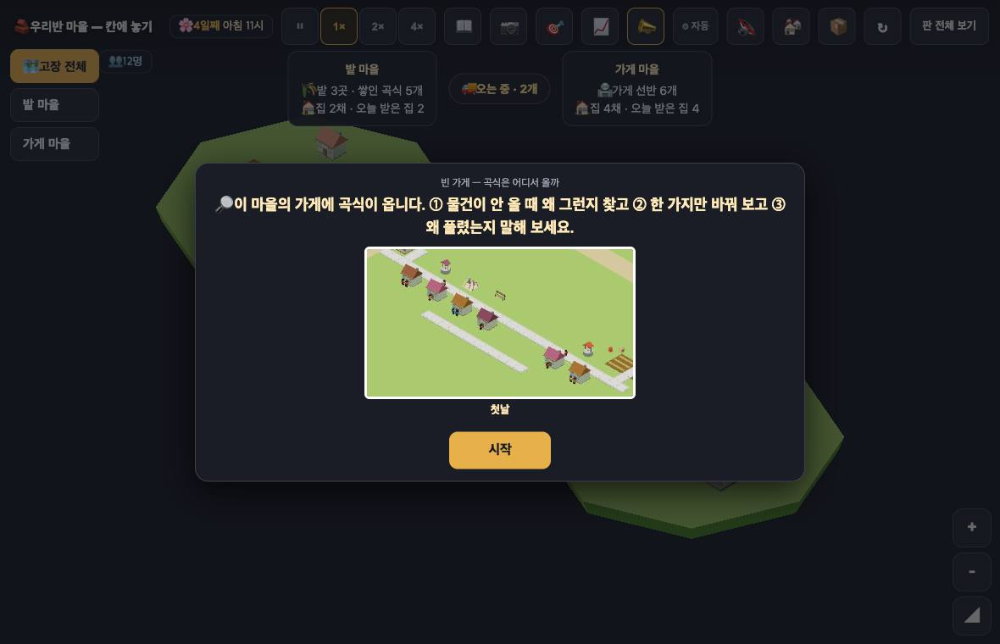
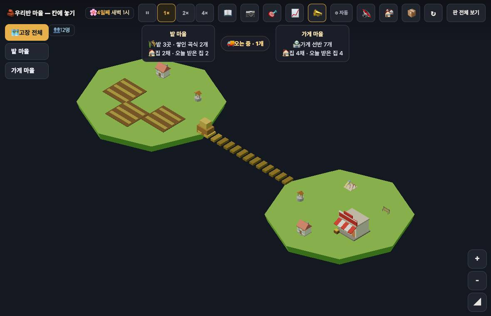
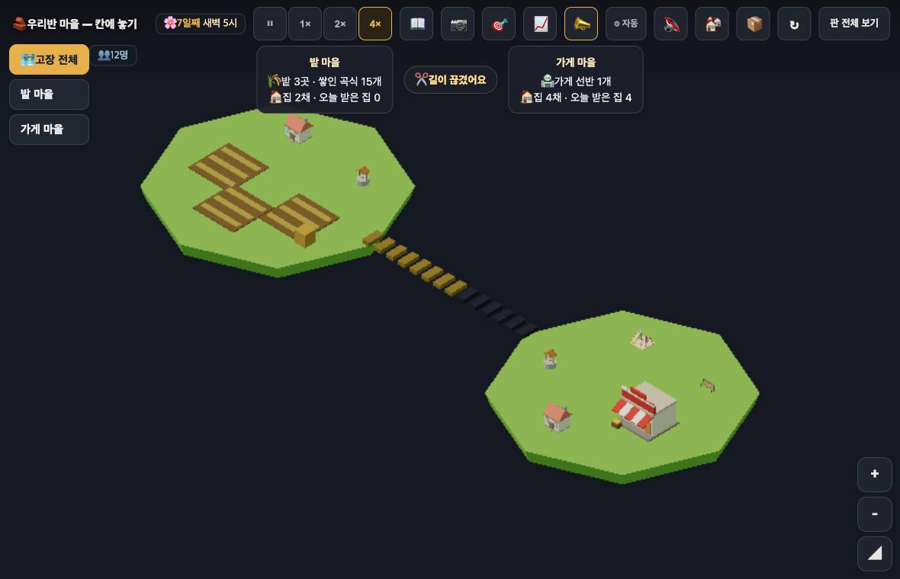
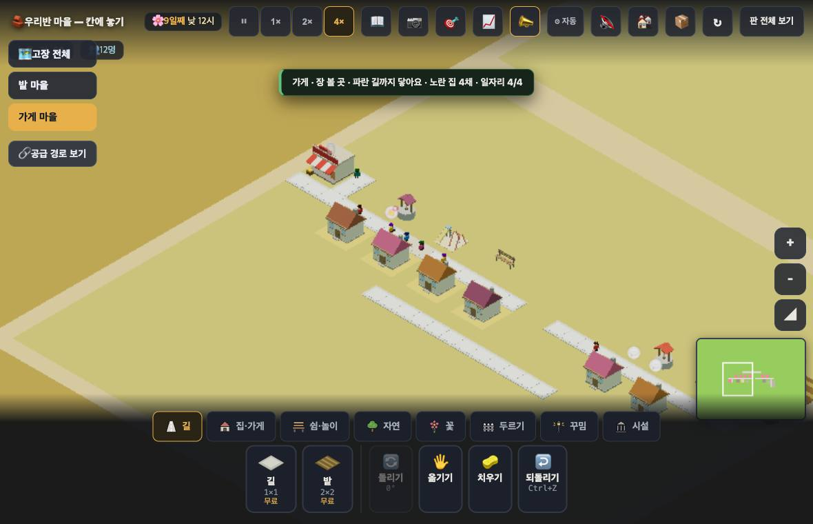

# 창조자의 눈 — 관찰 기록 13회: 고장 프로토타입 (2026-09-21)

> 답할 질문 하나: **"마을을 작게 묶어 보여 줘도, 아이가 물건이 어디서 와서 어디에 쓰이는지 따라가 문제를 고칠 수 있는가."**
> 관찰 계획: `docs/creator_notes/2026-09-21_proto_watch_plan.md`(#755) 그대로. 설계: `docs/village_proto_flow_design.md`.
> 발견마다 **사실 / 해석 / 가설**을 나눈다. 고칠 것은 **ⓐ 멈추고 / ⓑ 이번 묶음 / ⓒ 아이에게 확인**.

## 0. 이 기록이 **증명하지 못하는 것** (먼저)

- 내가 과제 셋을 해냈다는 것은 **"조작과 설명 경로를 통과했다"** 까지다. **초등학생이 단위 전환(마을 ↔ 마을 묶음)을 이해한다는 결론은 실제 학생에게 확인할 일**이다.
- **내 사전 지식 편향**: 나는 정본을 읽어 원인 셋을 알고 들어갔다. 그래서 **① 첫 화면에서 아무것도 누르지 않고 30초**를 먼저 하고, **② 누르기 전에 짐작을 먼저 적는** 방식으로 아는 것을 쓰는 순간을 표시했다. 아래 1절의 짐작은 **화면만 보고 적은 것**이다.
- 설계 문서 5절(저장 키·훅·값)은 **첫인상 단계가 끝난 뒤에** 읽었다. 보스가 "먼저 읽어라"고 했지만, 그 장은 **대조용 도구**이지 여는 데 필요한 것이 아니어서 순서를 바꿨다 — 첫인상을 오염시키지 않으려고. 바꾼 사실을 여기 밝힌다.
- 안전: `?sid=guest&stage=proto-flow` 로만 열었고 `__stage()` 로 확인했다 — **저장키 `rpg.village.guest.proto-flow` · 원격 `false`**. 본편 저장본·운영 데이터에 닿지 않았다.

---

## 1. 실행 경로와 첫 30초

**사실** — `http://localhost:8790/village/index.html?sid=guest&stage=proto-flow`.
열면 과제 카드가 뜬다: "빈 가게 — 곡식은 어디서 올까 / 🔎 이 마을의 가게에 곡식이 옵니다. ① 물건이 안 올 때 왜 그런지 찾고 ② 한 가지만 바꿔 보고 ③ 왜 풀렸는지 말해 보세요." + [시작].

**사실** — 카드를 띄운 채 30초를 그냥 두었다. **세계는 그동안에도 돈다**: 4일째 아침 11시 → **밤 6시**, 쌓인 곡식 5 → 1, 선반 7 → 2 → 5, 오는 중 2 → 4 → 1.
**사실** — [시작] 뒤 30초(계획의 0단계): 밤 9시 → 새벽 1시, 선반 6 → 7, 오는 중 2 → 1, 쌓인 곡식 2 그대로.

**사실** — 화면 왼쪽 위에 [🗺️ 고장 전체] [밭 마을] [가게 마을], 위쪽에 두 마을 요약 카드와 가운데 칩(🚚 오는 중 · n개).
**해석** — 고장 화면은 **한눈에 읽힌다.** 밭 세 개와 집이 있는 왼쪽 덩이, 가게가 있는 오른쪽 덩이, 둘을 잇는 판자 선. "어디서 와서 어디로 가는지"의 **뼈대는 화면에 있다.**

**내가 누르기 전에 적은 짐작(화면만 보고)**
1. "시작을 누르면 카드가 닫히고 지도가 보이겠다" → **맞음**.
2. "지금 선반이 7개니까 아직 **빈 가게가 아니다** — 고장은 아직 안 났거나 내가 만들어야 한다" → **맞음**. 들어간 순간의 세계는 정상이고, 과제가 말하는 '빈 가게'는 **아직 없다.**

**사실** — 과제 카드를 닫은 뒤 📖·🎯·📣 를 눌러 봤지만 **과제 글이 다시 나오는 곳은 없었다**(세 단추 모두 과제 문장 없음).

---

## 2. 원인 셋을 구분해서 보이는가 (정본 2-3 · 계획 1-3)

| 상태 | 고장 화면 가운데 칩 | 밭 쪽(카드) | **가게 쪽 — 화면 카드** | 가게 쪽 — 훅이 가진 글 |
|---|---|---|---|---|
| 정상(운송 중) | 🚚 오는 중 · n개 | "밭 · 곡식 3/5 · 거둘 것이 있어요" | **"가게 · 장 볼 곳 · 파란 길까지 닿아요 · 노란 집 4채 · 일자리 4/4"** | " · 곡식 8/8 · 물건이 있어요" |
| 가게가 가득 | ⏳ 기다리는 중 | " · 곡식 5/5 · 가득 찼어요 — 가져갈 곳이 없어요" | 〃 (같음) | 〃 |
| **연결 단절** | **✂️ 길이 끊겼어요** | " · 길이 끊겨 못 가요" | 〃 (같음) | " · 곡식 0/8 · **빈 선반이에요 — 밭에 쌓여 있는데 길이 끊겼어요**" |
| 다시 이은 직후 | 🚚 오는 중 · n개 | — | 〃 (같음) | " · 곡식 0/8 · 빈 선반이에요 — **곧 와요 — 오는 중이에요**" |

**사실** — 세 상태에서 **고장 화면의 칩과 밭 쪽 말은 서로 다르다.** 연결을 끊자 모형의 선이 **절반부터 어둡게** 바뀌고 칩이 "✂️ 길이 끊겼어요"가 됐다(그림).
**사실** — 그런데 **가게를 누르면 네 상태에서 모두 똑같은 말**이 뜬다 — 곡식·선반·까닭이 **한 글자도 없다.** 선반이 **0개**일 때도 같았다.

**사실** — 훅(`__flowAt(129,138)`)은 같은 순간에 `{상태:"empty", 말:"빈 선반이에요", 까닭:"밭에 쌓여 있는데 길이 끊겼어요", 카드:" · 곡식 0/8 · 빈 선반이에요 — 밭에 쌓여 있는데 길이 끊겼어요"}` 를 갖고 있었다.
**사실** — 같은 종류의 대조에서 **밭은 글자까지 일치했다**(화면 "밭 · 곡식 3/5 · 거둘 것이 있어요" = 훅 카드). 어긋나는 것은 **가게 하나**다.
**해석** — 설명은 **이미 만들어져 있는데 가게 카드에만 붙지 않는다.** 이 프로토타입이 답해야 할 질문의 **도착점**이 가게인데, 그 자리에서 아이가 받는 말은 일자리 이야기다.
**가설** — 아이가 "빈 가게"를 누르면 곡식 이야기를 기대할 것이다. 그것이 없으면 **가게에서 실마리 찾기를 포기하고 다른 데를 뒤질 것**이다(확인은 실제 아이에게).

---

## 3. 과제 셋을 실제로 해 봤다

### ① 까닭 찾기 — 찾았다(가게가 아니라 **고장 화면과 밭**에서)

**사실** — 내가 길 두 칸(144,140 · 145,140)을 치워 연결을 끊었다. 12초 뒤 고장 화면 칩이 "✂️ 길이 끊겼어요", 밭 마을 카드가 "길이 끊겨 못 가요", 밭 쌓인 곡식 5 → 15로 늘었다. 가게 선반은 5 → 1 → **0**.
**해석** — "물건은 만들어지는데 못 간다"가 **두 곳(칩·밭 카드)에서 읽힌다.** 다만 **가게 쪽에서는 못 읽는다**(위 2절).

### ② 한 가지 바꾸기 — 길을 다시 이었다

**사실** — 치운 두 칸을 다시 놓았다(길 1×1). **7초 만에** 짐 4개가 출발, **13초**에 선반 3개, **37초**에 선반 6개(4× 배속 기준). 고장 화면 칩은 "✂️ 길이 끊겼어요" → "🚚 오는 중 · 2개".
**해석** — **한 수로 풀린다.** 되돌아오는 시간도 화면에서 보인다(운반 중 표시).
⚠ 내가 **두 칸**을 치웠으므로 **두 칸**을 놓아야 했다. 한 칸만 끊었다면 한 수로 끝났을 것이다 — 내 실험 설계의 한계다.

### ③ 왜 풀렸는지 — **화면에 있는 말만으로 설명된다(가게만 빼고)**

화면 말만 모으면 이렇게 된다: "밭에 곡식이 **쌓여 있고**(🌾 15개) **길이 끊겨**(✂️) 가게로 못 갔다. 길을 이으니 **오는 중**(🚚)이 되고 선반이 찼다."
**해석** — 설명 경로는 **선다.** 빠진 고리는 "그래서 **가게가 비었다**"를 가게 자신이 말해 주지 않는다는 것뿐이다.

### 물건이 설명 없이 생기거나 사라지는가 (계획 1-5)

**사실** — 60초 간격 두 시점의 변화량: Δ만듦 **+3** = Δ(밭 +1 · 짐 −1 · 가게 +3 · 씀 0) = **+3**. 끊긴 동안 운반 중이던 3개는 `되돌림 3`으로 돌아왔다.
**사실** — 다만 **절댓값 검산은 안 맞는다**: `만듦 9` vs `밭4+짐4+가게2+씀12 = 22`. 차이 13은 **시작 저장본에 이미 있던 재고**(밭 5 + 선반 7 + 오는 중 2)다.
**해석** — **물건이 새거나 사라지지는 않는다**(변화량이 맞는다). 설계 1-나의 검산식 `만듦 == 밭+짐+가게+씀` 은 **시작 재고를 빼먹었다** — 식에 `+ 처음재고` 가 필요하다(또는 `만듦`이 시작 재고를 포함해야 한다).

---

## 4. 길을 잃은 화면 · 잘못 짚은 것

| 무엇 | 사실 | 해석 |
|---|---|---|
| **고장 화면에서 연결을 못 건드린다** | 선 위 네 지점을 눌러도 아무 반응 없음. 이 화면엔 트레이(치우기)가 **없다** | 정본 2-2 는 고장 화면에서 "연결을 놓고·끊고·다시 잇기"를 요구한다. 지금은 **마을 안으로 들어가 길을 치워야** 한다 — 아이가 그 길을 스스로 찾기는 어려워 보인다 |
| **끊을 길이 어디인지 화면에 없다** | 나는 훅(`__snapshot`)으로 길이 y=140 줄인 것을 알아내 끊었다. 화면만 보고는 두 마을을 잇는 길이 **판 위 어디**인지 못 찾았다 | 고장 화면의 선은 **모형**이고 실제 길은 마을 화면 밖에 있다 — 둘을 잇는 표시가 없다 |
| **[⏸ 생산 멈춤]이 고장 화면에 안 보인다** | 멈춘 뒤 고장 화면 칩은 "⏳ 기다리는 중", 밭 마을 카드는 "🌾 밭 3곳 · 쌓인 곡식 13개" — **멈췄다는 말이 없다**(훅은 `생산멈춤:true`) | 아이가 멈춰 놓고 잊으면, 고장 화면에서는 **가게가 왜 마르는지 알 수 없다** |
| **치우기 모드가 켜진 채 남는다** | 길을 치운 뒤 그대로 가게를 눌렀더니 **"✋ 가게 — 한 번 더 누르면 치워요"**. 한 번 더 눌렀으면 가게가 지워졌다 | 과제가 "눌러서 알아보라"인데, 조사하려는 손짓이 **지우기**가 된다 |
| **과제를 다시 볼 곳이 없다** | 📖·🎯·📣 어디에도 과제 문장 없음 | 세 가지를 외워야 한다 |

---

# ⓐ 하던 일을 멈추고 고칠 것

## ⓐ1. 가게를 눌러도 곡식 이야기가 **한 글자도** 안 나온다 — 준비된 설명이 화면에 안 붙는다

- **사실**: 선반 0개·길 끊김 상태에서 화면 카드 = "가게 · 장 볼 곳 · 파란 길까지 닿아요 · 노란 집 4채 · 일자리 4/4". 같은 순간 훅 = " · 곡식 0/8 · 빈 선반이에요 — 밭에 쌓여 있는데 길이 끊겼어요". 밭은 같은 대조에서 글자까지 일치한다.
- **해석**: 이 프로토타입의 질문("아이가 물건이 어디서 와서 어디에 쓰이는지 따라갈 수 있는가")에서 **도착점 한 칸이 비어 있다.** 고칠 것은 말이 아니라 **붙이는 자리**로 보인다(밭에는 붙는다).
- **가설**: 이것만 붙으면 아이는 **가게 → 까닭 → 밭/길** 순서로 스스로 따라갈 수 있다. 지금은 고장 화면을 먼저 봐야만 풀린다.

# ⓑ 이번 묶음 안에서 고칠 것

- **ⓑ1.** 고장 화면에서 **연결을 끊고·잇는 수단이 없다**(정본 2-2). 지금은 마을 안에서 길 칸을 치워야 하고, 그 길이 어디인지 화면에 표시가 없다.
- **ⓑ2.** **[⏸ 생산 멈춤] 상태가 고장 화면에 안 보인다.** 칩이 "⏳ 기다리는 중"이라 '가게가 가득'과 구별되지 않는다(실제로 두 경우 모두 같은 칩이었다).
- **ⓑ3.** **과제 카드를 다시 볼 곳이 없다**(📖·🎯·📣 모두 없음).
- **ⓑ4.** 치우기 모드가 화면을 바꿔도 **켜진 채 남는다** — 조사하려고 누른 것이 지우기가 된다.
- **ⓑ5.** 검산식에 **시작 재고**가 빠져 있다(`만듦 == 밭+짐+가게+씀` → 절댓값 13 차이). 변화량은 맞으므로 **식을 고치면 된다.**

# ⓒ 적어 두고 실제 아이에게 확인할 것

- **ⓒ1.** 아이가 "빈 가게"를 볼 때 **가게를 먼저 누를지, 고장 화면을 먼저 볼지.** ⓐ1 의 심각도가 여기 달렸다.
- **ⓒ2.** 과제 카드가 떠 있는 동안 **세계가 계속 돈다**(30초에 게임 7시간). 아이가 카드를 읽는 사이 상황이 달라지는 것이 혼란이 되는지.
- **ⓒ3.** 두 마을 모형(육각 덩이 둘 + 판자 선)이 아이에게 **'우리 마을을 멀리서 본 것'** 으로 읽히는지, 아니면 **다른 그림**으로 읽히는지. 이것이 정본이 말한 '단위 전환' 가설의 핵심인데 **나로서는 확인할 방법이 없다.**
- **ⓒ4.** 아이가 길을 끊는 수(치우기)를 **스스로 떠올리는지.** 나는 훅으로 길 위치를 찾았다 — 아이에겐 그 도구가 없다.
- **ⓒ5.** 회복까지의 기다림(1× 기준 28칸 = 36초)이 답답한지.

---

## 5. 본편 반영 판단 (정본 7⑥)

- **가져갈 것**: 고장 화면의 **칩 세 가지**(🚚 오는 중 · ⏳ 기다리는 중 · ✂️ 길이 끊겼어요)와 **모형 선이 끊기면 어둡게 바뀌는 표시**. 이 둘만으로 원인이 구별됐다.
- **가져갈 것**: 밭 카드의 말(거둘 것이 있어요 / 가득 찼어요 — 가져갈 곳이 없어요 / 길이 끊겨 못 가요). 화면과 상태가 글자까지 맞았다.
- **결정이 필요한 것**: 가게 카드에 흐름 글을 붙이는 자리(ⓐ1) · 고장 화면에서 연결을 직접 만지게 할 것인가(ⓑ1).
- **버릴 것**: 아직 없다 — 이 프로토는 **질문에 답할 만큼 돌아간다.**

## 6. 한 줄 답 (이번 회 기준)

**사실**: 나는 까닭을 찾고 한 수로 고치고 화면 말로 설명했다. 다만 그 경로는 **고장 화면 → 밭**이었고, **가게에서는 아무 실마리도 얻지 못했다.**
**해석**: "작게 묶어 보여 줘도 따라갈 수 있는가"의 답은 **조건부 예**다 — 도착점(가게)의 한 칸이 비어 있다.
**가설**: ⓐ1 을 고치면 아이가 **가게에서 출발해** 거슬러 올라갈 수 있다. 이 가설의 확인은 실제 아이 사용에서.
