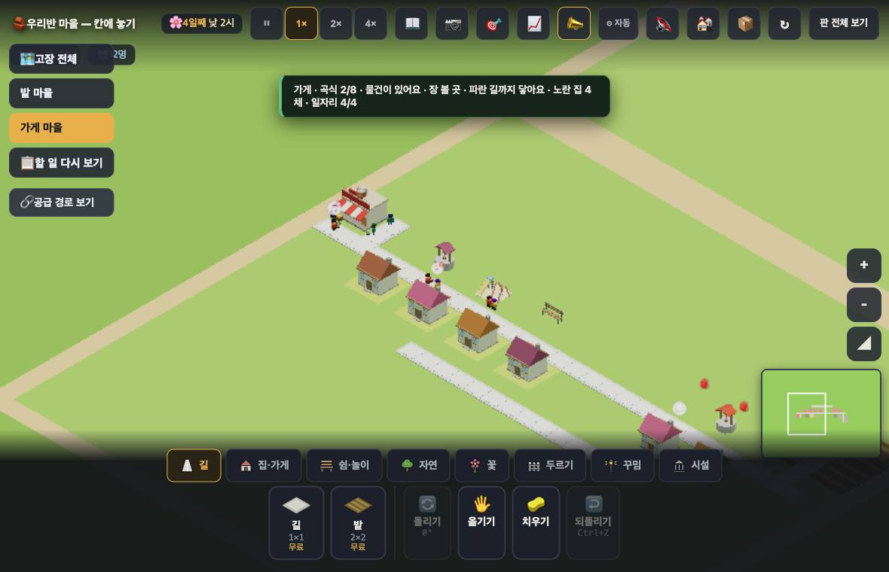
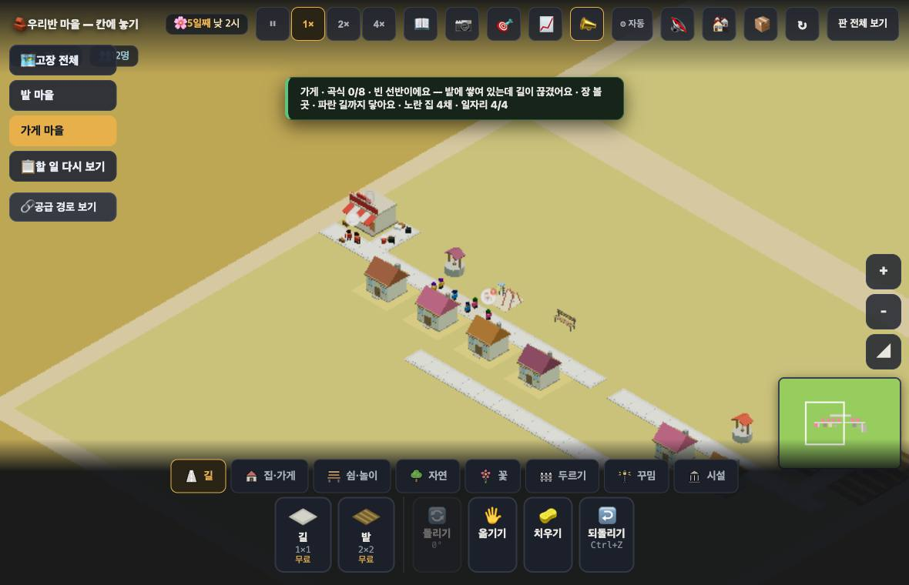
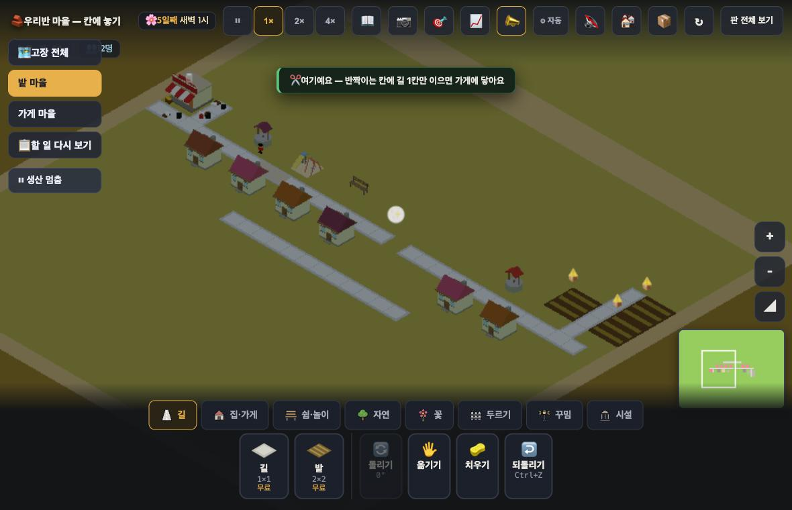

# 창조자의 눈 — 관찰 기록 14회: 고장 프로토타입 재확인 (2026-09-21)

> 같은 질문: **"마을을 작게 묶어 보여 줘도, 아이가 물건이 어디서 와서 어디에 쓰이는지 따라가 문제를 고칠 수 있는가."**
> 13회에서 올린 여섯 가지(#771)가 고쳐졌다기에 **같은 잣대로 다시** 댔다. 본 판: 체험판 8790(최신 main) · `?sid=guest&stage=proto-flow` · **코드 수정 0**.
> 발견마다 **사실 / 해석 / 가설**. 고칠 것은 **ⓐ 멈추고 / ⓑ 이번 묶음 / ⓒ 아이에게 확인**.

## 한 줄
**된다.** 이번엔 **가게에서 출발해 거슬러 올라가 고칠 수 있었다** — 가게 카드가 까닭과 장소를 말하고, [🔗 공급 경로 보기]가 이어야 할 칸을 화면 가운데로 데려다 놓고, 길 한 칸으로 8초 만에 짐이 다시 움직였다. **이번 회 ⓐ는 없다.**

---

## 0. 먼저 — 13회 기록 한 줄 정정

**사실**: 13회에 "치우기 모드를 Escape 로 풀었다"고 적었는데, 그때 같은 호출에서 `__mode()` 를 함께 불렀다. 담당이 알려 준 대로 **`__mode()` 는 인자 없이 부르면 모드를 끄는 쓰기 훅**이다.
**해석**: "치우기 모드가 남아 '한 번 더 누르면 치워요'가 떴다"는 **본 그대로 사실**이지만, **무엇이 그것을 풀었는지에 대한 내 기술은 무효**다. 앞으로 `__mode()` 는 부르지 않는다. (읽기용으로 쓴 훅은 `__flow` · `__flowAt` · `__protoMap` · `__stage` · `__cellScreen` · `__snapshot` 이다.)

---

## 1. 고쳐졌다고 한 여섯 — 하나씩 다시 댔다

| 13회 지적 | 결과 | 잰 것(사실) |
|---|---|---|
| **ⓐ1** 가게 카드에 흐름 글이 안 붙는다 | **풀림** | 정상: "가게 · **곡식 2/8 · 물건이 있어요** · 장 볼 곳 · 파란 길까지 닿아요 · 노란 집 4채 · 일자리 4/4" · 빈 선반: "가게 · **곡식 0/8 · 빈 선반이에요 — 밭에 쌓여 있는데 길이 끊겼어요** · …" — 훅 `__flowAt(129,138).카드` 와 **글자까지 일치** |
| **ⓑ1** 고장 화면에서 이을 곳을 못 찾는다 | **풀림** | [🔗 공급 경로 보기] → "✂️ **여기예요 — 반짝이는 칸에 길 1칸만 이으면 가게에 닿아요**" + 화면이 그 칸을 가운데로(아래 3절) |
| **ⓑ2** 생산 멈춤 ↔ 가게 가득이 같은 말 | **풀림** | 가득: "📦 **가게가 가득 · 밭도 가득**" / 멈춤: "⏸ **생산을 멈췄어요**" |
| **ⓑ3** 과제를 다시 볼 곳이 없다 | **풀림** | 왼쪽에 [📋 할 일 다시 보기] · 누르니 과제 카드가 그대로 다시 떴다 |
| **ⓑ4** 치우기 모드가 남는다 | **풀림** | 길 한 칸을 지운 **직후** 밭을 눌렀더니 "밭 · 곡식 2/5 · 길이 끊겨 못 가요 — 길 1칸만 이으면 가게에 닿아요" — 지우기 경고가 아니라 **카드**가 떴다 |
| **ⓑ5** 검산식에 시작 재고가 빠졌다 | **풀림** | `만듦 21 + 시작재고 13 = 34` = `밭 12 + 짐 0 + 가게 8 + 씀 14` — **정확히 맞는다** |

---

## 2. ① 이번엔 **가게에서 출발해** 거슬러 올라갈 수 있는가 — **된다**

**사실** — 길을 **한 칸**(145,140) 지워 끊고, 가게가 빌 때까지 두었다. 그 뒤 가게를 눌러 시작했다.

| 아이가 한 것 | 화면이 준 것 |
|---|---|
| 가게를 누름 | "가게 · 곡식 0/8 · **빈 선반이에요 — 밭에 쌓여 있는데 길이 끊겼어요** · …" |
| [🔗 공급 경로 보기] | 화면이 밭 마을로 넘어가고 "✂️ **여기예요 — 반짝이는 칸에 길 1칸만 이으면 가게에 닿아요**" |
| 그 자리에 길 1칸 | **8초** 뒤 " · 곡식 0/8 · 빈 선반이에요 — **곧 와요 — 오는 중이에요**" · **15초** 선반 4 · **36초** 선반 7 |

**해석** — 13회에 비어 있던 **도착점 한 칸이 메워졌다.** 13회엔 가게에서 아무 실마리가 없어 고장 화면부터 봐야 했는데, 이번엔 **가게 → 까닭 → 그 자리 → 한 수** 가 끊기지 않는다.
**가설** — 아이가 "빈 가게"에서 시작하는 것이 가장 자연스러운 출발점이라면, 이 경로 하나로 과제 셋이 다 선다. **확인은 실제 아이에게.**

---

## 3. ③ ✨로 짚은 칸이 **실제로 이어야 할 칸인가** — 그렇다(따라온다)

**사실** — 끊은 칸을 바꿔 가며 두 번 쟀다. [🔗 공급 경로 보기]를 누른 뒤 **그 빈칸의 화면 좌표**:

| 끊은 칸 | 누른 뒤 그 칸의 화면 자리 | 화면 가운데(590,380)와의 거리 |
|---|---|---|
| (145,140) | [570, 365] | **24px** |
| (137,140) | [570, 365] | **24px** (그때 옛 빈칸 (145,140)은 [750,465]로 밀려남) |

**해석** — 끊긴 칸이 바뀌면 **화면도 그 칸을 같은 자리(가운데)로 데려온다.** 짚는 대상이 고정된 자리가 아니라 **실제 빈칸을 따라간다.**
⚠ **내가 확인하지 못한 것**: 정지 화면(사진)에서는 **반짝임 자체를 눈으로 확인하지 못했다.** 움직이는 표시로 보이며, 내가 확인한 것은 **카메라가 그 칸을 가운데로 가져온다**는 것까지다. 반짝임이 아이 눈에 띄는지는 ⓒ.

---

## 4. ② 가게 카드가 길어졌다 — **읽기 부담이 되는가**

**사실** — 글자 수와 줄 수(1180px 너비 기준).

| 언제 | 카드 | 글자 | 줄 |
|---|---|---|---|
| 13회(흐름 글 없음) | "가게 · 장 볼 곳 · 파란 길까지 닿아요 · 노란 집 4채 · 일자리 4/4" | 41 | 1 |
| 지금 · 물건 있음 | "가게 · **곡식 2/8 · 물건이 있어요** · 장 볼 곳 · …" | **62** | 1 |
| 지금 · 빈 선반 + 까닭 | "가게 · **곡식 0/8 · 빈 선반이에요 — 밭에 쌓여 있는데 길이 끊겼어요** · 장 볼 곳 · …" | **82** | **2** |
| (견줌) 밭 카드 | "밭 · 곡식 2/5 · 길이 끊겨 못 가요 — 길 1칸만 이으면 가게에 닿아요" | 41 | 1 |

**사실** — 두 줄이 될 때 **첫 줄에 흐름 글이 모두 들어간다.** 첫 줄 끝에 "· 장 볼"까지 밀려 들어가고, 둘째 줄은 "곳 · 파란 길까지 닿아요 · 노란 집 4채 · 일자리 4/4" — **전부 본편 정보**다.
**해석** — **자르지 않아도 된다.** 아이가 과제에 필요한 것은 첫 줄에 다 있고, 일자리 정보도 살아 있다. 다만 줄이 **"장 볼 / 곳"** 에서 끊겨 한 낱말이 갈라진다.
**제안(정보를 안 잃는 쪽)** — 흐름 글과 본편 정보 **사이에서 줄을 바꾸면** 된다(두 줄로 보이되 낱말이 안 갈라진다). 자르는 것보다 이쪽이 낫다고 본다. → ⓑ
**가설** — 82자 두 줄을 아이가 끝까지 읽지는 않을 것이다. 하지만 **읽어야 할 것이 앞에 있으므로 문제가 되지 않을 것**이다. 확인은 실제 아이에게(ⓒ).

---

# ⓐ 하던 일을 멈추고 고칠 것

**이번 회에는 없다.** 13회에 올린 ⓐ1 이 풀렸고, 같은 잣대로 새로 걸린 것이 없다.

# ⓑ 이번 묶음 안에서 고칠 것

- **ⓑ6.** `#fresh` 로 다시 시작하면 **시작판이 안 실린다.** 사실: `?stage=proto-flow#fresh` → `__stage().시작판 = false` · 밭·선반·짐 모두 0 · **과제 카드도 안 뜸** · "30일째"로 시작. `localStorage.clear()` 뒤 새로고침은 제대로 된다(시작판 true · 과제 카드 뜸). 설계 문서(270줄)는 **둘 다 된다**고 적어 두었다.
- **ⓑ7.** 가게 카드 줄바꿈 자리(위 4절) — 흐름 글과 본편 정보 사이에서 줄을 바꾸면 낱말이 안 갈라진다. **자르는 것은 권하지 않는다**(일자리 정보를 잃는다).

# ⓒ 적어 두고 실제 아이에게 확인할 것

- **ⓒ6.** 아이가 **반짝임을 알아보는지.** 나는 정지 화면에서 확인하지 못했고 카메라 이동으로만 확인했다.
- **ⓒ7.** 82자 두 줄 카드를 아이가 어디까지 읽는지(첫 줄만으로 충분한지).
- **ⓒ8.** [🔗 공급 경로 보기]를 누르면 **밭 마을로 넘어가는데 그 화면엔 그 단추가 없다**(다시 누르려면 가게 마을로 돌아가야 한다). 아이가 돌아가는 길을 찾는지.
- **ⓒ9.** 생산을 멈춘 뒤에도 **남은 재고를 나르는 동안엔 칩이 "🚚 오는 중"으로 바뀐다**(틀린 말은 아니다). 아이가 "멈춘 게 맞나?"를 헷갈리는지.
- **ⓒ10.** (13회에서 이어짐) 두 마을 모형이 **'멀리서 본 우리 마을'** 로 읽히는지 — 단위 전환 가설. **나로서는 확인할 방법이 없다.**

---

## 5. 본편 반영 판단 (정본 7⑥)

- **가져갈 것(추가)**: **"까닭 + 그 자리로 데려가기"** 한 쌍. 가게 카드가 까닭을 말하고, 단추 하나가 고칠 칸을 화면 가운데로 데려오는 흐름은 본편의 💼·🛣️ 안내에도 그대로 쓸 수 있어 보인다(10~12회에서 "말은 맞는데 어느 길인지 모르겠다"가 되풀이됐다).
- **가져갈 것(추가)**: 칩 네 가지(🚚 오는 중 · ⏳ 기다리는 중 · ✂️ 길이 끊겼어요 · 📦 가게가 가득 · ⏸ 생산을 멈췄어요) — 상태마다 말이 갈린다.
- **결정이 필요한 것**: 카드 줄바꿈(ⓑ7).
- **버릴 것**: 아직 없다.

## 6. 미검증 (정본 7⑤)

내가 통과한 것은 **조작과 설명 경로**까지다. **초등학생이 단위 전환을 이해한다는 결론은 실제 학생에게 확인할 일**이다. 나는 원인 셋을 미리 알고 들어간 편향이 있고, 이번 회는 **재확인**이라 13회의 '처음 보는 눈'을 재현할 수 없다 — 그 점은 14회 기록의 한계다.
