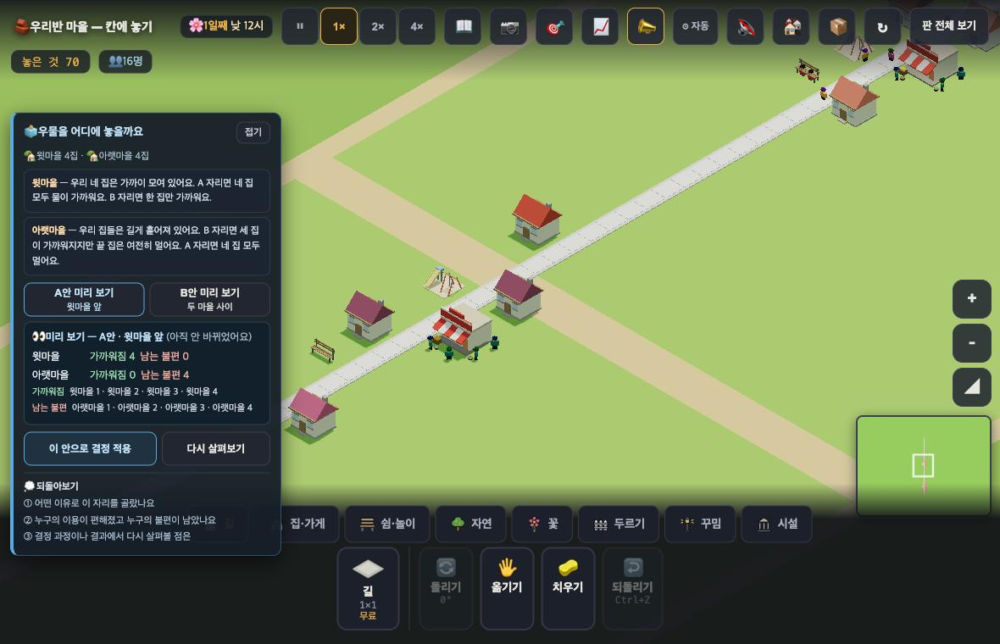
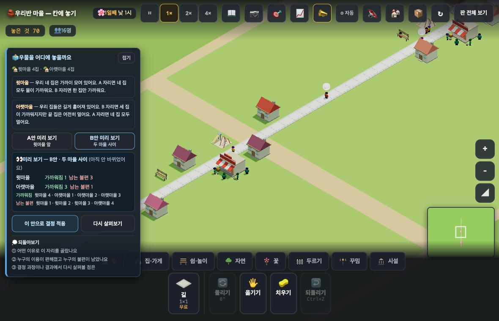
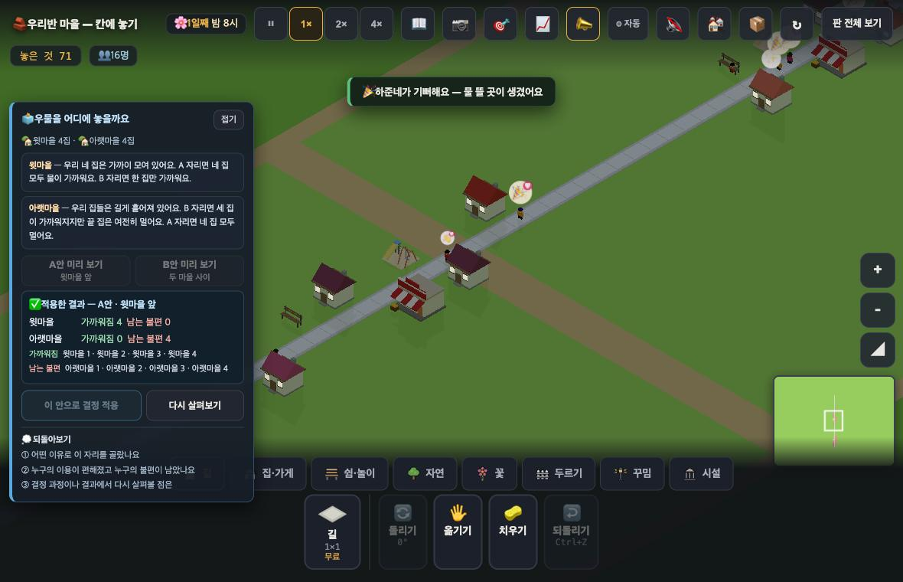

# 창조자의 눈 — 관찰 기록 15회 (이어서): 정치 프로토 — 화면이 붙었다 (2026-09-21)

> 앞 절반은 `2026-09-21_round15.md`(#780) — 그때는 **판만 있고 화면이 없었다**(머지 순서 때문에 블록이 main 에 안 들어와 있었다). 지금은 들어왔다.
> 볼 것(보스): "같은 결정이 사람마다 다른 결과를 낳는 것이 **비교되어 보이는가**" · "**남은 불편이 감춰지지 않는가**".
> 본 판: 체험판 8790(최신 main) · `?sid=guest&stage=proto-vote` · 저장키 `rpg.village.guest.proto-vote` · 원격 `false` · **코드 수정 0**.
> 잣대는 앞 절반에서 내가 **미리 계산해 둔 표**(A = 윗 4 / B = 윗 1 + 아랫 3 · 끝 집은 어느 안에서도 멀다)다.

## 한 줄
**둘 다 통과한다 — 두 군데만 빼고.** 미리 보기는 세계를 안 바꾸고, 미리 본 값이 적용 결과와 **숫자도 이름도 그대로** 맞고, 되돌리면 **지문까지 처음으로** 돌아온다. 남은 불편은 패널에서 같은 무게로 보인다. 다만 **두 안을 나란히 볼 수 없고**, **지도 위 소식은 기뻐하는 쪽만 말한다(1 대 0).**

---

## 1. 다섯 단계를 그대로 밟았다 (사실)

| 단계 | 패널이 한 말 | 세계(훅으로 확인) |
|---|---|---|
| **A 미리 보기** | "👀 미리 보기 — A안 · 윗마을 앞 **(아직 안 바뀌었어요)**" · 윗마을 가까워짐 4 / 남는 불편 0 · 아랫마을 0 / 4 | 우물 **0개** · 여덟 집 모두 '물 멀다' · 지문 `493:ho7cby` **그대로** |
| **B 미리 보기** | "👀 … B안 · 두 마을 사이" · 윗 1 / 3 · 아랫 3 / 1 · 남는 불편에 **아랫마을 4** | 〃 그대로 (지문 안 바뀜) |
| **B 적용** | "✅ **적용한 결과** — B안 · 두 마을 사이" (숫자 동일) | 우물 `well@140,121` · 지문 `507:sbfbm3` |
| 적용 18초 뒤 실제 | — | 물이 가까운 집 = (140,110) · (137,124) · (140,128) · (137,133) = **윗 1 + 아랫 3** · 끝 집 (140,139) **멀다** → **패널 숫자와 정확히 일치** |
| **다시 살펴보기** | 확인창 "처음 상태로 되돌릴까요? 이번에 한 것은 남지 않아요." | 우물 **0** · 놓은 것 71 → **70** · 지문 **`493:ho7cby`(처음과 같음)** · 결과 줄 사라짐 |
| **A 적용** | "✅ 적용한 결과 — A안 · 윗마을 앞" 윗 4 / 0 · 아랫 0 / 4 | 우물 `well@137,102` · 실제 = 윗 4채 가깝다 · 아랫 4채 멀다 → **일치** |

**해석** — 앞 절반에서 **화면 없이 계산해 둔 표와 화면이 완전히 같다.** 판정과 보여 주는 값이 어긋나는 자리는 없었다.

---

## 2. ㉠ 같은 결정이 사람마다 다른 결과를 낳는 것이 **비교되어** 보이는가

| 볼 것 | 결과 | 근거 |
|---|---|---|
| 두 동네가 **각각** 보이나 | **○** | 윗마을/아랫마을 두 줄로, 가까워짐·남는 불편이 각각. 그 아래 **이름 목록**까지 |
| 미리 본 값 == 적용 값 | **○** | A·B 둘 다 숫자도 이름 목록도 같았다 |
| 의견 카드가 자리 차이와 이어지나 | **○** | "B 자리면 세 집이 가까워지지만 **끝 집은 여전히 멀어요**" — 실제 결과와 글자 그대로 |
| **두 안을 나란히 볼 수 있나** | **✗** | B를 누르면 A 값이 사라진다(화면에 "가까워짐 4"가 더는 없음). 아이는 **기억으로** 비교해야 한다 |
| 적용 뒤 다른 안을 미리 볼 수 있나 | **✗** | 적용하면 A·B 미리 보기 단추가 **흐려진다** — [다시 살펴보기]로 되돌려야 다시 본다 |

**해석** — 이 판은 **4 대 4로 수가 같게** 만들어 놓았다. 그래서 나란히 못 보는 것이 특히 아프다: 총계만 기억하면 "둘이 같네"로 끝나고, 실제로 갈리는 것은 **누가**인데 그건 두 목록을 견줘야 보인다.
**가설** — 두 안을 한 화면에 위아래로 놓으면(각 두 줄) 아이가 "수는 같은데 사람이 다르다"를 스스로 발견할 것이다. 지금은 A→B→다시 A를 눌러야 한다. **확인은 실제 아이에게.**

---

## 3. ㉡ 남은 불편이 감춰지지 않는가

| 볼 것 | 결과 | 근거 |
|---|---|---|
| 같은 크기·같은 자리인가 | **○** | '가까워짐'과 '남는 불편'이 한 줄에 나란히(색만 파랑/주황) · 목록도 두 줄 대칭 |
| 멀어진 쪽이 **이름으로** 남나 | **○** | "남는 불편 — 윗마을 1 · 윗마을 2 · 윗마을 3 · **아랫마을 4**" |
| 어느 안에서도 먼 **끝 집** | **○** | B 결과의 '남는 불편'에 그대로 뜬다 |
| 총점·정답·축하 연출 | **없음** | "✅ 적용한 결과"뿐. 이긴 쪽·점수 표시 없음 |
| **지도 위 소식** | **1 대 0** | 적용 뒤 하루(실시간 32초) 동안 새로 뜬 소식은 **"🎉 ○○네가 기뻐해요 — 물 뜰 곳이 생겼어요" 하나뿐**. 남은 불편 쪽 소식은 **없었다** |
| 패널을 **접으면** | 결과가 **전부 사라진다** | 접은 뒤 남는 글은 "🗳️ 우물을 어디에 놓을까요" 한 줄(가까워짐·남는 불편 모두 없음) |

**해석** — **패널 안에서는 감춰지지 않는다.** 감춰질 수 있는 곳은 **패널 밖**이다 — 접었거나 지도를 보고 있는 아이에게 남는 것은 **축하 한 줄**뿐이다.
**가설** — 아이는 큰 화면(지도)을 본다. "…네는 아직 물이 멀어요" 같은 소식이 **한 번 같이** 뜨면 균형이 맞을 것 같다. '승패로 처리하지 않는다'의 마지막 한 칸으로 보인다. 확인은 아이에게.

---

## 4. 되돌아보기 세 질문 — **화면 값만으로** 답할 수 있나

| 질문 | 판정 | 까닭 |
|---|---|---|
| ① 어떤 이유로 이 자리를 골랐나요 | **△** | 고른 까닭은 아이 머릿속이다. 다만 의견 카드 두 장이 **근거**를 준다 |
| ② 누구의 이용이 편해졌고 누구의 불편이 남았나요 | **○** | 이름 목록까지 화면에 있다 |
| ③ 결정 과정이나 결과에서 다시 살펴볼 점은 | **✗** | 화면 값으로 답할 수 없는 판단 질문 — **그래야 맞다고 본다** |

---

## 5. 보스가 따로 물은 것 — 우물을 트레이로 못 놓는 것이 아이 눈에 어떻게 읽히나

**사실** — 트레이의 **시설·자연 탭은 비어 있다**(도구 단추만 남는다). 집·가게 탭엔 집·가게만. **우물 타일은 어디에도 없다.**
**사실** — 화면에 "우물은 함께 정한 자리에만 놓여요" 같은 **문장은 없다**.
**해석** — 패널 제목("🗳️ 우물을 어디에 놓을까요")과 후보 두 단추로 **암시는 된다.** 아이가 우물을 찾으러 트레이를 뒤지면 **빈 탭**을 만난다 — 그건 '못 놓는다'보다 '고장 났나?'로 읽힐 수 있다.
**가설** — 아이는 패널에서 먼저 알아챌 것이다. 다만 한 줄이 있으면 확실해지고, **정치 판에서 그 한 줄은 뜻이 있다** — '함께 정한 자리에만'이 이 판의 요점이니까. 확인은 아이에게.

---

# ⓐ 하던 일을 멈추고 고칠 것
없음.

# ⓑ 이번 묶음 안에서 고칠 것
- **ⓑ11.** **두 안을 나란히 볼 수 없다**(㉠). 수가 4 대 4로 같게 만든 판이라, 나란히 보이지 않으면 "둘이 같다"로 읽힐 위험이 있다.
- **ⓑ12.** 적용 직후 **지도 위 소식이 기뻐하는 쪽만** 말한다(1 대 0). 패널을 접으면 남는 것은 축하뿐이다.
- **ⓑ13.** 빈 탭(시설·자연 등)이 그대로 보인다 · "우물은 함께 정한 자리에만 놓여요" 한 줄이 없다.

# ⓒ 적어 두고 실제 아이에게 확인할 것
- **ⓒ16.** 아이가 두 안을 **기억으로** 견주는 것을 답답해하는지, 아니면 번갈아 누르며 잘 비교하는지.
- **ⓒ17.** 패널을 **접은 채로** 두는지(접으면 결과가 다 사라진다).
- **ⓒ18.** 🎉 소식만 보고 "잘됐다"로 끝내는지, 남은 불편을 찾아보는지.
- **ⓒ19.** [다시 살펴보기]의 확인창이 **브라우저 기본 창**이다("처음 상태로 되돌릴까요?") — 태블릿에서 어떻게 보이는지.
- **ⓒ20.** 아이가 **어느 쪽을 고르고 왜 고르는지** — 교실에서만 알 수 있다.

## 미검증
내가 확인한 것은 **조작과 표시 경로, 그리고 화면 숫자가 실제 판정과 맞는다는 것**까지다. **아이가 이 화면으로 '같은 결정이 사람마다 다르게 닿는다'를 이해하는지는 실제 학생에게 확인할 일이다.**
