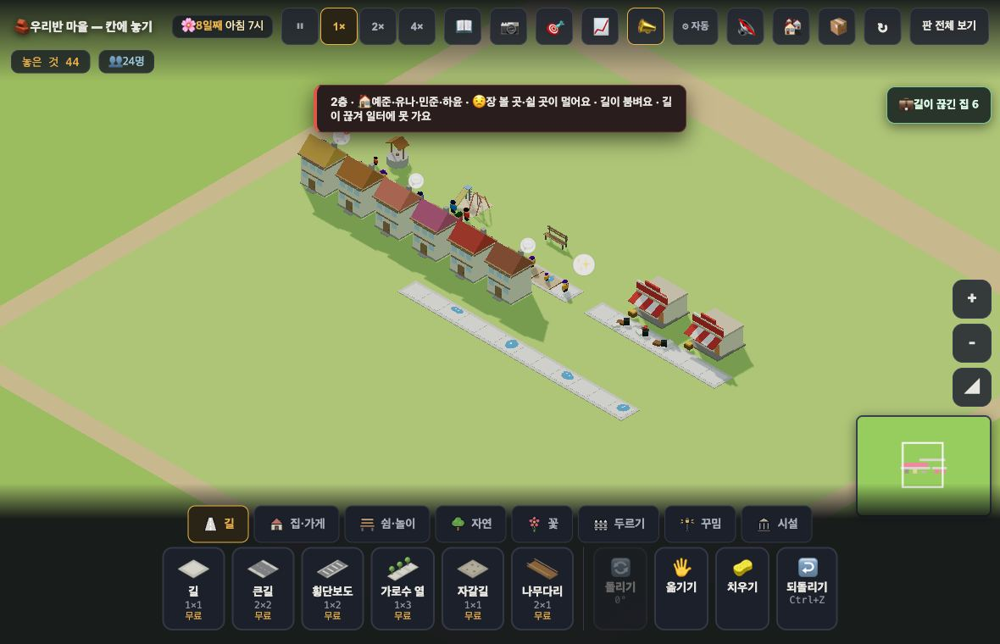

# 창조자의 눈 — 관찰 기록 16회: "말은 맞는데 어느 길인지 모르겠다"가 닫혔는가 (2026-09-21)

> 볼 것(보스): 10·11·12회에서 **세 번 되풀이해 적은 불만**이 실제로 닫혔는지. 프로토에서 나온 "까닭 + 그 자리로 데려가기"가 본편에 붙었다(#778).
> 본 판: 체험판 8790(최신 main) · 재현 판 `docs/creator_notes/boards/jobcut.json`(인구 24 · 칩 "💼 길이 끊긴 집 6") · **코드 수정 0**.
> **사실 / 해석 / 가설**을 나누고, 고칠 것은 **ⓐ / ⓑ / ⓒ**.

## 한 줄
**일자리 끊김 한 갈래에서는 닫혔다.** 집을 누르면 까닭과 함께 **채워야 할 빈 칸에 ✨가 그 수만큼** 뜬다(두 칸이면 둘, 한 칸 남으면 하나). 두 칸을 채우니 **8초 만에** 끊긴 집 6 → 0. **아직 안 붙은 곳은 붐빔과 💼 칩**이다.

---

## 1. 잰 것 (사실)

**판** — 길은 한 줄이고 **빈틈은 (142,140)·(143,140) 두 칸**이다(길 32칸을 훑어 찾음). 끊긴 집은 (130·132·134·136·138·140, 141) **여섯 채**.

| 아이가 한 것 | 화면 | 훅 `__where()` |
|---|---|---|
| 끊긴 집을 누름 | "2층 · 🏠 … · 😟 장 볼 곳·쉴 곳이 멀어요 · **길이 끊겨 일터에 못 가요** · …" | 짚음 +1 · **칸 +2** · 카메라 0(집이 이미 화면 안) |
| **한 칸만** 놓음 (142,140) | 아무 변화 없음 — 끊긴 집 **6 그대로** · 칩 "💼 길이 끊긴 집 6" 그대로 | — |
| 그 집을 다시 누름 | 같은 카드 | **칸 +1** — 남은 한 칸만 짚는다 |
| 나머지 한 칸 놓음 (143,140) | **8초** 뒤 끊긴 집 **0** · 칩이 "💼 길이 끊긴 집 6" → **"💼 자리가 찬 집 2"** | — |

**사실 — ✨를 눈으로 확인했다.** 14회에는 정지 화면에서 확인하지 못했는데, 이번에는 집을 누른 직후 사진에 **길이 끊긴 그 자리 위에 밝은 표시**가 찍혔다.

**사실 — 옛 저장본이 안 깨진다.** 같은 빌드에서 `pop88`(인구 89)을 불러오니 칩 "💼 자리가 찬 집 24" 그대로, 집 카드도 그대로였고 **집을 눌러도 짚음 0**(`없음 1`). ✨가 함부로 뜨지 않는다.

**해석** — 10회(“칩이 어느 길인지 안 짚는다”)·11회(“어느 길이 문제인지 표시가 없다”)·12회(“끊긴 동안 어느 길인지 모른다”)로 세 번 적은 불만이 **일자리 끊김에서는 닫혔다.** 아이가 "어디?"를 따로 묻지 않아도 된다.
**가설** — 아이가 ✨를 보고 그 칸을 누를 것이다. **확인은 실제 아이에게**(내가 확인한 것은 표시가 뜨고 그 칸이 맞다는 것까지다).

---

## 2. 담당이 물은 것 ① — 카드가 **칸 수**를 말하지 않아도 되는가

**사실** — 집 카드에는 숫자가 없다("길이 끊겨 일터에 못 가요"). 대신 **✨ 개수가 곧 놓아야 할 칸 수**였다: 빈틈 2칸 → 짚은 칸 2 · 한 칸 채운 뒤 → 짚은 칸 1.
**사실** — 그런데 **한 칸을 놓은 직후 화면은 아무 말도 하지 않는다.** 끊긴 집 수도 칩도 그대로라, "덜 됐다"는 것을 알려면 **집을 다시 눌러** 남은 ✨를 봐야 한다.
**해석** — **숫자를 카드에 넣을 필요는 크지 않다**(✨가 이미 수를 보여 준다). 그보다 **한 칸을 놓은 뒤에도 남은 ✨가 그대로 떠 있는 쪽**이 값져 보인다 — 아이가 "두 칸이구나"를 미리 세지 않아도, 놓을수록 하나씩 줄어드는 것이 보인다.
**가설** — 칸이 셋 이상으로 늘면 ✨를 세기 어려워질 수 있다. 그때는 숫자가 필요해진다. 이번 판(2칸)에서는 아니었다.

## 3. 담당이 물은 것 ② — "여기도 짚어 줬으면"이 **어디서** 나오나

**사실** — 같은 판에서 세 자리를 눌러 봤다.

| 누른 것 | 화면이 한 말 | 짚었나 |
|---|---|---|
| 끊긴 집 | "길이 끊겨 일터에 못 가요" | **✨ 2칸** ✅ |
| **붐비는 집**(134,141) | "😟 쉴 곳이 멀어요 · **길이 붐벼요**" | **0** (`없음 1`) |
| **필요만 있는 집**(130,141) | "😐 **쉴 곳이 멀어요** · 거리가 좀 삭막해요" | **0** (`없음 2`) |
| **💼 칩** | "이 동네 2채 · 가까운 가게가 꽉 찼어요 — **일할 곳을 하나 더**" | **0** (동네로 카메라만) |

**내가 "여기도"라고 느낀 순서**

1. **붐빔 — 1순위.** 10·12회에 적은 불만이 **그대로 남아 있는 유일한 자리**다. 다만 보스가 알려 준 대로 곧 붐빔이 '집 25채가 각각' → '이어진 길 토막 둘'로 바뀐다면, **그 뒤에 붙이는 것이 맞다**(짚을 대상이 칸에서 토막으로 바뀐다). 17회에 같이 보겠다.
   · 덧: 이번 판에서는 붐비는 집 카드에 **큰길 권유 문구조차 뜨지 않았다**("쉴 곳이 멀어요 · 길이 붐벼요"가 전부). 권유가 없으니 짚을 것도 없는 상태다.
2. **💼 칩 — 2순위, 다만 ✨는 아니다.** "일할 곳을 하나 더"인데 **어디에**가 없다. 그런데 *지을 자리*는 아이가 고를 몫이라 한 칸을 콕 찍는 것은 과해 보인다 — **그 동네를 테두리로 감싸는** 정도가 맞다고 본다(해석).
3. **필요(장 볼 곳·쉴 곳이 멀어요) — 붙이지 않는 쪽.** 짚을 **한 칸이 없다**(어디든 가까이 놓으면 된다). 여기는 지금 문구("이 동네에 ○○를 지어 봐요")가 맞다.

**해석** — ✨는 **"고칠 칸이 하나로 정해지는 까닭"** 에만 어울린다. 끊김은 그렇고, 붐빔은 (토막으로 바뀐 뒤에) 그럴 수 있고, 필요는 아니다.

---

# ⓐ 하던 일을 멈추고 고칠 것

없음.

# ⓑ 이번 묶음 안에서 고칠 것

- **ⓑ9.** 한 칸을 놓은 뒤 **남은 ✨가 화면에서 사라진다**(집을 다시 눌러야 보인다). 놓은 직후 남은 칸을 계속 짚어 주면 "덜 됐다"가 보인다. 숫자를 카드에 넣는 것보다 이쪽을 권한다(2절).
- **ⓑ10.** 붐비는 집 카드에 **큰길 권유 문구가 안 뜨는 판이 있다**(이번 jobcut 판 · "쉴 곳이 멀어요 · 길이 붐벼요"가 전부). 권유가 없으면 아이가 둘 수 있는 수가 화면에 없다. (17회 붐빔 개편과 같이 볼 값.)

# ⓒ 적어 두고 실제 아이에게 확인할 것

- **ⓒ13.** 아이가 **✨를 알아보고 그 칸을 누르는지.** 내가 확인한 것은 표시가 뜨고 그 칸이 맞다는 것까지다.
- **ⓒ14.** ✨가 셋 이상일 때 아이가 **수를 세는지**(이번 판은 2칸이었다).
- **ⓒ15.** 카드에 불만이 셋 나란히 있을 때(“장 볼 곳·쉴 곳이 멀어요 · 길이 붐벼요 · 길이 끊겨…”) **✨가 그중 어느 것 때문인지** 아이가 잇는지.

---

## 4. 본편 반영 판단

- **닫힌 것**: 10·11·12회의 "어느 길인지 모르겠다" — **일자리 끊김**에서 닫혔다. 같은 방식이 프로토에서 본편으로 그대로 옮겨졌고, 옛 저장본도 안 깨졌다.
- **남은 것**: 붐빔(17회) · 💼 칩의 '어디에'(테두리 쪽 제안).
- **버릴 것**: 없다.

## 5. 미검증

✨가 **아이 눈에 띄는지**, 그리고 세 불만 중 어느 것에 대한 표시인지 **아이가 잇는지**는 실제 사용에서만 확인된다. 이번 회에 내가 확인한 것은 **조작과 표시 경로**까지다.
