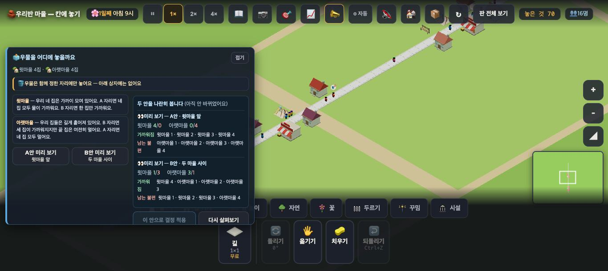

# 창조자의 눈 — 관찰 기록 17회: 정치 프로토 되보기 (2026-09-21)

> 보스 메시지의 '16회'는 제 기록으로 **17회**입니다(16회는 ✨ 회차로 이미 나갔습니다).
> 본 판: 체험판 8790(최신 main · #785) · `?sid=guest&stage=proto-vote` · **크롬북 크기 1366×610** · **코드 수정 0**.
> 보스가 짚어 준 셋만 봤습니다. **사실 / 해석 / 가설**을 나누고 고칠 것은 **ⓐ / ⓑ / ⓒ**.

## 한 줄
**① 나란히 보입니다(그리고 게임이 "수는 같은데 누가 편해지는지가 다릅니다"라고 직접 말해 줍니다). ② 🎉·🙍 는 적용이 실제로 된 두 번 모두 둘 다 떴습니다. ③ 안내는 패널 위에 있고 아래 상자에는 없습니다.**
**다만 이 크기에서 적용한 뒤 [다시 살펴보기]가 아래 물건 상자에 가려 눌리지 않습니다 — 그래서 다른 안을 볼 수가 없습니다(ⓐ).**

---

## 1. 두 안이 한 화면에 나란히 보이는가 — **보입니다**

**사실** — 열자마자 두 안이 **둘 다 재어져** 있습니다. 오른쪽 칸에 위아래로:
`👀 미리 보기 — A안 · 윗마을 앞` 윗마을 4/0 · 아랫마을 0/4 · 가까워짐/남는 불편 이름 목록
`👀 미리 보기 — B안 · 두 마을 사이` 윗마을 1/3 · 아랫마을 3/1 · 이름 목록
**사실** — 그 위에 게임이 **"수는 같은데 누가 편해지는지가 다릅니다 — 두 안을 견주어 보세요"** 라고 적어 둡니다.
**사실** — 적용한 뒤에는 고른 쪽이 `✅ 적용한 결과 — B안`, 안 고른 쪽이 `👀 적용 전에 미리 본 값 — A안` 으로 **둘 다 남습니다.**

**해석** — 15회 ⓑ11("기억으로 견줘야 한다")은 **닫혔습니다.** 게다가 제가 걱정한 "합이 4로 같다는 걸 아이가 더해야 안다"는 부분을 **문장 한 줄이 대신** 말해 줍니다.
**가설** — 아이는 이제 두 목록을 번갈아 보며 "윗마을 넷 ↔ 윗마을 하나와 아랫마을 셋"을 견줄 것입니다. **확인은 실제 아이에게.**

**ⓑ 로 걸리는 것** — 오른쪽 칸이 좁아 **낱말이 갈라집니다**: "가까워 / 짐", "남는 불 / 편", "아랫마 / 을 4". 한 낱말이 두 줄로 잘리면 읽는 속도가 떨어집니다.

## 2. 적용 뒤 소식에 기쁜 쪽과 남는 쪽이 둘 다 뜨는가 — **뜹니다(적용이 된 두 번 모두)**

**사실** — 적용이 **실제로 일어난** 실행 두 번:

| 실행 | 🎉 | 🙍 |
|---|---|---|
| B안 첫 적용 | "🎉 하준네가 기뻐해요 — 물 뜰 곳이 생겼어요" | "🙍 윗마을 3집 · 아랫마을 1집은 아직 물 뜰 곳이 멀어요" |
| A안 첫 적용(깨끗한 판) | "🎉 지아네가 기뻐해요 — 물 뜰 곳이 생겼어요" | "🙍 아랫마을 4집은 아직 물 뜰 곳이 멀어요" |

**사실 — 그리고 정정** — 저는 그 사이 "🎉·🙍 가 둘 다 안 떴다"는 실행을 **세 번** 보았습니다. 세 번 다 **적용 자체가 안 된 것**이었습니다(`__vote().적용횟수` 가 안 늘고 지문도 그대로). 까닭은 아래 ⓐ1(단추 가림)입니다. **소식이 밀린 것이 아닙니다.**
**해석** — 보스가 걱정한 '밀림'은 이번 판에서 **관찰되지 않았습니다.** 다만 제가 본 범위는 적용 뒤 하루(실시간 45초)까지입니다.

## 3. 빈 탭 — 안내는 **패널 위**에 있고 상자 안에는 없습니다

**사실** — 패널 맨 위에 **"🪣 우물은 함께 정한 자리에만 놓여요 — 아래 상자에는 없어요"** 가 늘 떠 있습니다.
**사실** — 아래 물건 상자의 `시설`·`자연`·`꽃` 탭을 열면 **도구 단추(돌리기·옮기기·치우기·되돌리기)만** 있고 그 문장은 **없습니다.**
**해석** — 아이가 **패널을 보고 있으면** '이 판의 규칙'으로 읽힙니다. 그런데 우물을 찾으러 **상자를 뒤지는 아이**는 빈 탭을 먼저 만납니다 — 그 자리에는 아무 말이 없습니다.
**가설** — 빈 탭에서 한 번 더 말해 주면(같은 문장을 상자 안에도) '고장'이 아니라 '규칙'으로 읽힐 것입니다. **확인은 실제 아이에게.**

---

# ⓐ 하던 일을 멈추고 고칠 것

## ⓐ1. 1366×610 에서 **적용한 뒤 [다시 살펴보기]가 눌리지 않습니다** — 다른 안을 볼 수 없습니다

**사실** — 화면 높이 610에서 두 단추의 자리와 그 점에 실제로 있는 것:

| 단추 | 화면 y | 그 점에 있는 것 |
|---|---|---|
| 이 안으로 결정 적용 | 501 ~ 541 | **`trayIn`**(아래 물건 상자) |
| 다시 살펴보기 | 501 ~ 541 | **가려짐**(다른 요소) |

**사실** — 적용한 뒤 [다시 살펴보기]를 **세 번 눌렀지만** `되돌린횟수 0` · 우물 그대로 · 지문 그대로였습니다. 그 뒤 다른 안을 적용하려 해도 `적용횟수` 가 안 늘었습니다.
**사실** — 1180×760(높은 화면)에서는 15회에 같은 단추가 정상으로 눌렸습니다.
**해석** — **크롬북 높이에서만** 생깁니다. 패널에 결과 블록이 붙으면 아래로 길어져 단추가 상자 밑으로 들어갑니다.
**가설** — 교실에서 아이는 **한 번 적용하면 거기서 끝**입니다 — '되돌려서 다른 안도 해 보기'가 이 판의 요점인데 그걸 못 합니다.

---

# ⓑ 이번 묶음 안에서 고칠 것
- **ⓑ14.** 오른쪽 칸이 좁아 **낱말이 갈라집니다**("가까워/짐" · "남는 불/편" · "아랫마/을 4").
- **ⓑ15.** 빈 탭(시설·자연·꽃)에 **같은 안내 한 줄**이 없습니다(패널에만 있습니다).

# ⓒ 적어 두고 실제 아이에게 확인할 것
- **ⓒ21.** "수는 같은데 누가 편해지는지가 다릅니다" 한 줄을 아이가 **읽는지**, 그리고 그 뒤 두 목록을 실제로 견주는지.
- **ⓒ22.** 🙍 소식을 아이가 **불평으로 받아들이는지, 남은 숙제로 받아들이는지.**
- **ⓒ23.** 빈 탭을 먼저 만나는 아이가 '고장'으로 읽는지.

## 미검증
제가 본 것은 **조작과 표시 경로**까지입니다. 이 화면으로 아이가 '같은 결정이 사람마다 다르게 닿는다'를 이해하는지는 **실제 학생에게 확인할 일**입니다.
