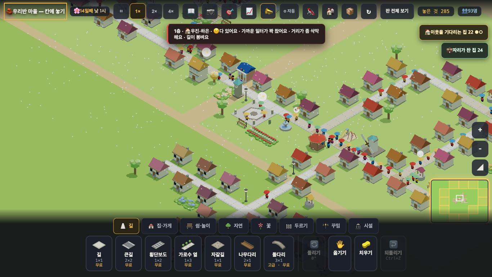

# 창조자의 눈 — 관찰 기록 18회: 붐빔이 '길 토막'이 된 뒤 (2026-09-21)

> 보스가 '17회'라 한 본 일입니다(제 기록으로는 18회 — 번호만 다릅니다).
> 본 판: 체험판 8790(최신 main · #779) · `?sid=guest&dev=1` · 판은 `village/stages/boards/pop88.json`(인구 91) · 창 1366×768 · **코드 수정 0**.
> 볼 것(보스): 말이 **어느 길**을 가리키는가 · 아이가 **둘 수 있는 한 수**가 떠오르는가 · 말이 **겹쳐 들리지** 않는가 · 길을 깔았을 때 **뜻밖에 나빠지는 자리**.
> **사실 / 해석 / 가설**을 나누고 고칠 것은 **ⓐ / ⓑ / ⓒ**.

## 한 줄
**제가 10회에 적은 B1("같은 길에 나란한 두 집 중 하나만 붐벼요")은 닫혔습니다 — 같은 토막이면 같은 말이고, 누르면 그 토막의 가장 붐빈 칸을 짚습니다. 그런데 자리를 잡고 나면 토막 하나가 길 163칸 중 76칸 · 집 25채를 삼켜서, 25채가 모두 같은 한 칸을 가리킵니다. 그리고 '붐벼요'라고 말하는 33채 가운데 한 수를 권하는 집은 0채입니다.**

---

## 1. 말이 어느 길을 가리키는가 — **가리킵니다**

**사실** — 붐비는 집을 누르니 `__where().칸` 이 +1, `__crowdSeg().짚음` 이 +1 이 되었습니다. 그 토막의 **가장 붐빈 칸**을 하나 짚습니다.
**사실** — 집마다 토막을 물어보니(전체 68채):

| 토막 | 길 칸 | 닿은 집 | 그중 "길이 붐벼요"라 말한 집 | 짚는 칸 |
|---|---|---|---|---|
| 0 | 26 | 7 | **7 (전부)** | (150,144) m 3.53 |
| 1 | 14 | 8 | **8 (전부)** | (178,139) m 2.67 |
| 2 | 35 | 12 | **12 (전부)** | (172,152) m 2.67 |
| 3 | 7 | 4 | **4 (전부)** | (155,152) m 1.93 |
| **토막 밖** | — | — | **0** | — |

**해석** — **10회 B1 이 닫혔습니다.** 나란한 두 집이 갈리지 않고, 토막 밖에서 혼자 말하는 집도 없습니다. 말과 짚는 곳이 한 몸입니다.

## 2. 그런데 자리를 잡으면 **토막 하나가 너무 커집니다**

**사실** — 위 표는 판을 불러온 직후입니다. 그대로 두자 **아무것도 안 했는데** 토막이 합쳐졌습니다. 72초(4배속) 동안 여섯 번 재어 값이 고정된 상태:

| | 불러온 직후 | 자리 잡은 뒤 |
|---|---|---|
| 토막 수 | 4 | **2** |
| 가장 큰 토막 | 35칸 | **76칸** |
| 그 토막에 닿은 집 | 12채 | **25채** |
| "붐벼요"라 말하는 집 | 31 | **33** |
| 판 전체 길 칸 | 163 | 163 |

**사실** — 자리 잡은 뒤 토막은 둘뿐입니다: **76칸·25채(짚는 칸 150,144)** 와 14칸·8채(178,139).
**해석** — 읽을 것이 2개로 줄어든 것은 보스 말씀대로입니다. 다만 **76칸은 판 전체 길의 절반**입니다. 25채 중 어느 집을 눌러도 **같은 한 칸**을 짚으니, 마을 반대쪽 집에게 그 칸은 "우리 길"이 아닙니다.
**가설** — 아이가 자기 집을 눌렀는데 화면이 멀리 있는 칸으로 데려가면 "여기가 왜?"가 될 수 있습니다. **확인은 실제 아이에게.**
**가설** — 토막이 클수록 **큰길 한 장(2×2)으로 풀릴 가능성은 낮아집니다.** 76칸을 2칸 넓혀서 무엇이 달라지는지는 다음 회에 직접 깔아 재겠습니다(이번 회는 카메라가 그 칸까지 안 가서 못 했습니다 — 못 한 것을 그대로 적습니다).

## 3. 아이가 둘 수 있는 한 수 — **화면에 없습니다**

**사실** — 자리 잡은 뒤 **"길이 붐벼요"라고 말하는 집 33채 가운데 🛣️ 권유가 붙은 집은 0채**였습니다.
본 카드 그대로: "😟 배울 곳이 멀어요 · **길이 붐벼요** · 📚 이 동네에 도서관을 하나 더 지어 봐요" / "1층 · 🏠 … · 😐 다 있어요 · 가까운 일터가 꽉 찼어요 · 거리가 좀 삭막해요 · **길이 붐벼요**"
**해석** — **16회 ⓑ10 이 pop88 에서도 그대로입니다.** 배움에는 "도서관을 하나 더"가 붙는데 붐빔에는 아무것도 없습니다. 짚어 주는 칸은 생겼지만 **그 칸에서 무엇을 하라는 말이 없습니다.**
**가설** — 아이는 "붐빈대" 로 끝낼 것입니다. 짚어 준 칸과 "🛣️ 여기를 큰길로 덮어 봐요" 한 줄이 **짝**이 되어야 한 수가 됩니다. **확인은 실제 아이에게.**

## 4. 말이 겹쳐 들리는가 — **겹치지는 않습니다(같은 말이 여러 집에서 날 뿐)**

**사실** — 33채가 각자 "길이 붐벼요"라고 하지만, 가리키는 곳은 **2곳**뿐입니다. 집을 여럿 눌러도 같은 칸으로 갑니다.
**사실** — 붐빔을 모아 주는 **칩은 없습니다**(💼·🏠 칩은 있는데 붐빔 칩은 못 봤습니다).
**해석** — '겹쳐 들린다'기보다 **"같은 말을 25번 듣는다"** 에 가깝습니다. 읽을 것이 2개라는 것은 **훅에서 보는 수**이고, 아이 화면에서는 여전히 **집을 눌러야** 알 수 있습니다.
**가설** — 붐빔 칩("🚶 붐비는 길 2곳")이 있으면 아이가 집을 뒤지지 않고 두 곳으로 바로 갈 것입니다. 지금은 우연히 그 집을 눌러야 압니다.

## 5. 말과 그림이 같은 곳인가 — **수는 거의 같습니다(칸 대조는 못 했습니다)**

**사실** — 새벽 스냅샷 뒤 `__wear().닳은칸 = 82`, 같은 시각 `__crowdSeg().칸 = 82`(자리 잡은 뒤 90).
**사실** — 칸 하나하나 대조는 **하지 못했습니다** — `__crowdSeg(x,y)` 는 **집 칸용**이라(길 칸을 넣으면 늘 `토막 -1`) 길 칸이 토막 안인지 물어볼 창구가 없습니다.
**해석** — 두 수가 거의 같으니 **같은 것을 칠하는 쪽으로 간 것**으로 보입니다. 다만 제가 **확인한 것은 수뿐**입니다.
**ⓑ** — 길 칸으로도 물어볼 수 있으면(또는 `__crowdSeg()` 가 토막마다 칸 목록을 주면) 다음 회에 칸 단위로 대 볼 수 있습니다.

---

# ⓐ 하던 일을 멈추고 고칠 것
없음.

# ⓑ 이번 묶음 안에서 고칠 것
- **ⓑ16.** **붐빔에 한 수가 없습니다** — 33채 중 권유 0채. 짚어 주는 칸이 생겼으니 "🛣️ 여기를 큰길로 덮어 봐요" 한 줄이 그 칸과 짝이 되면 바로 한 수가 됩니다(16회 ⓑ10 과 같은 자리).
- **ⓑ17.** **토막 하나가 길의 절반(76칸·25채)** 을 삼킵니다. 25채가 같은 한 칸을 가리킵니다 — 길이가 어느 선을 넘으면 **쪼개거나**, 집마다 **그 집에서 가장 가까운 토막 칸**을 짚는 편이 맞아 보입니다.
- **ⓑ18.** 붐빔을 모아 주는 **칩이 없습니다**(읽을 것이 2곳이라는 걸 아이는 알 길이 없습니다).
- **ⓑ19.** `__crowdSeg(x,y)` 가 **길 칸을 못 받습니다** — 말과 그림을 칸 단위로 대조할 창구가 없습니다.

# ⓒ 적어 두고 실제 아이에게 확인할 것
- **ⓒ24.** 자기 집을 눌렀는데 **멀리 있는 칸**으로 데려갈 때 아이가 잇는지("여기가 왜?").
- **ⓒ25.** 같은 말을 여러 집에서 듣는 것이 **되풀이로 느껴지는지.**
- **ⓒ26.** 흙빛 길을 아이가 **'붐비는 길'로 읽는지**(색이 곧 뜻인지).

## 다음 회에 마저 할 것 (이번에 못 한 것)
1. 짚어 준 칸에 **큰길을 실제로 깔아** 토막·말하는 집이 어떻게 바뀌는지(뜻밖에 나빠지는 자리 포함). 이번엔 그 칸이 화면 밖이라 못 했습니다.
2. 보스가 말한 **가운데 크기 판에서 3→5 로 늘어난 말들**이 실제로 고칠 칸을 가리키는지 — pop88(큰 판)에서만 재었습니다.
3. 칸 단위 말↔그림 대조(ⓑ19 가 풀리면).

## 미검증
제가 본 것은 **조작과 표시 경로 · 훅 값**까지입니다. 아이가 이 말과 표시로 붐빔을 고칠 수 있는지는 **실제 학생에게 확인할 일**입니다.
