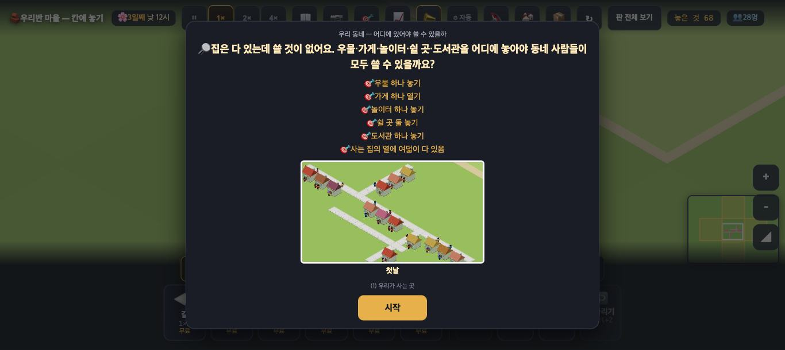
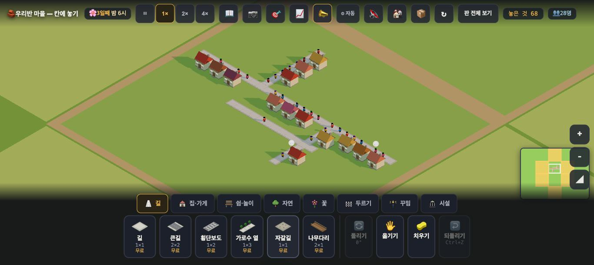

# 창조자의 눈 — 관찰 기록 19회: 새 판 `town3` — 조용한 마을 (2026-09-21)

> 아직 아무도 안 본 판입니다. **판 파일을 먼저 읽지 않고** 첫 화면부터 봤습니다(첫인상을 지키려고). 뒤에 `__stage()` 로만 확인했습니다.
> 본 판: 체험판 8790(최신 main) · `?sid=guest&stage=town3` · **크롬북 1366×610** · **코드 수정 0**. 저장키 `rpg.village.guest.town3` · 원격 `false`.
> 보스가 가장 걱정한 것: **조용한 것이 '조용하다'로 읽히는가, '고장 났다'로 읽히는가.**
> **사실 / 해석 / 가설**을 나누고 고칠 것은 **ⓐ / ⓑ / ⓒ**.

## 한 줄
**조용한 것은 '고장'으로 안 읽힙니다 — 집을 누르면 "물 뜰 곳·장 볼 곳·놀 곳·쉴 곳이 멀어요"라고 할 일을 정확히 말해 주기 때문입니다. 그리고 '가까우면 쓸 수 있다'는 아주 또렷하게 보입니다(길가 우물 하나가 14채 중 9채를 살립니다). 다만 우물을 길에서 떨어뜨려 놓아도 아무 말이 없고 목표는 '이룬 것'이 됩니다 — 이 판의 제목이 "어디에 있어야 쓸 수 있을까"인데 틀린 자리에 놓고도 칭찬만 받습니다.**

---

## 1. 시설 0 에서 시작하는 첫 30초 — 무엇을 하라는 것인지 알겠는가

**사실** — 첫 카드: "우리 동네 — 어디에 있어야 쓸 수 있을까 / 🔎 **집은 다 있는데 쓸 것이 없어요.** 우물·가게·놀이터·쉴 곳·도서관을 어디에 놓아야 동네 사람들이 모두 쓸 수 있을까요?" + 목표 여섯 + 작은 지도 그림 + [시작].

**사실** — [시작] 뒤 **30초 동안 아무것도 누르지 않았습니다.** 그동안 마을이 한 말은 **"🔓 땅이 넓어졌어요! 흙 테두리 안이 내 땅이에요" 하나뿐**이었습니다(낮 12시 → 밤 6시).
**사실** — 화면에는 집 14채와 길 세 갈래, 사람 28명이 보이고 **시설은 하나도 없습니다.** 오른쪽 위 칩 자리는 **비어 있습니다**(💼·붐빔 칩 없음 — `__stage().끈묶음 = ["일자리","붐빔"]`).

**사실** — 집을 누르면: **"1층 · 🏠 … · 😟 물 뜰 곳·장 볼 곳·놀 곳·쉴 곳이 멀어요 · 거리가 좀 삭막해요"** — 14채가 모두 같은 말입니다.

**해석 — 보스 물음에 대한 답: '고장'으로 읽히지 않습니다.** 침묵이 빈 화면이 아니라, **집 카드가 남은 일 목록을 들고 있기** 때문입니다. 아이가 집 하나만 눌러도 "네 가지가 없구나"가 나옵니다. 정치 판 빈 탭과는 다릅니다 — 거기서는 **찾는 물건이 없어서** 막혔고, 여기서는 **해야 할 일이 화면에 있습니다.**
**가설** — 다만 **집을 한 번도 안 누르는 아이**에게는 30초가 그냥 조용합니다. 첫 카드를 닫고 나면 목표는 🎯 단추 안에 있고, 아래 상자는 '길' 탭이 열려 있습니다. **확인은 실제 아이에게.**

**ⓑ 로 걸리는 것** — 놓아야 할 다섯이 **세 탭에 흩어져** 있습니다: 우물·가게는 `집·가게`, 긴의자·놀이터는 `쉼·놀이`, 도서관은 `시설`. 그리고 **`두르기`·`꾸밈` 두 탭은 비어 있는데 아무 말이 없습니다**(도구 단추만) — 17회 ⓑ15 와 같은 자리입니다.

## 2. 시설 하나를 놓았을 때 — **'가까워서'가 또렷하게 보입니다**

**사실** — 길(y=140 줄)에 닿게 우물 하나를 놓았더니, 20초 뒤 **14채 중 9채**의 카드에서 "물 뜰 곳"이 빠졌습니다. 오른쪽 끝 다섯 채(149,142 · 149,146 · 151,141 · 153,141 · 155,141)는 **그대로 "물 뜰 곳이 멀어요"** 입니다.
**사실** — 다섯 가지를 다 놓은 뒤 채워진 집 수:

| 놓은 것 | 어디에 | 채워진 집 |
|---|---|---|
| 긴의자 2개 | 길가 | **14 / 14** |
| 가게 1개 | 길가 | **11 / 14** |
| 우물 1개(길가) | 길가 | **9 / 14** |
| 놀이터 1개 | 길에서 떨어진 쪽 | **2 / 14** |

**해석** — 같은 '하나'인데 **자리에 따라 2채도 되고 14채도 됩니다.** 이 판이 가르치려는 것이 **집 카드의 변화로 그대로 보입니다.** 아이가 두 번만 놓아 보면 "가까워야 쓴다"를 스스로 만들 수 있습니다.
**가설** — 아이는 "왜 이 집은 아직도 멀대?"를 물을 것이고, 그때 지도에서 **거리**를 보게 될 것입니다. 이 판의 핵심 장면입니다. **확인은 실제 아이에게.**

---

# ⓐ 하던 일을 멈추고 고칠 것

## ⓐ2. 길에 안 닿은 자리에 놓아도 **아무 말이 없고, 목표는 '이룬 것'이 됩니다**

**사실** — 제가 맨 처음 놓은 우물은 (131,143)이었습니다. 그 둘레 네 방향 여섯 칸을 훑어보니 **전부 빈칸** — 길과 닿지 않습니다.
**사실** — 그 뒤 16초를 흘려도 **14채 중 한 채도 바뀌지 않았습니다**(바로 옆 두 칸짜리 집 포함).
**사실** — 그런데 목표는 곧바로 **"🎯 지금 목표 □ 가게 하나 열기 … 이룬 것 1개"** 로 넘어갔습니다(`__goals().이룬것 = ["stage:town3:0"]`).
**사실** — 화면 어디에도 "이 우물은 아무도 못 써요" 같은 말이 없습니다.

**해석** — 이 판의 제목이 **"어디에 있어야 쓸 수 있을까"** 입니다. 그런데 **틀린 자리에 놓아도 칭찬(목표 달성)만 받고, 틀렸다는 신호가 없습니다.** 7회 🔴1(풍차·온실이 길에 안 닿아도 말없이 놓이던 것)과 같은 종류인데, **이 판에서는 그것이 배울 내용 그 자체**라 더 아픕니다.
**가설** — 아이는 "우물 놓기 ✅"를 보고 다음으로 넘어갈 것입니다. 그리고 나중에 "왜 아무도 물을 못 쓰지?"에서 막힐 텐데, 그때 **처음 우물이 원인이라는 걸 잇기는 어렵습니다.** 확인은 실제 아이에게 — 다만 **신호가 아예 없다는 것은 지금 확인된 사실**입니다.
**🟢 고칠 거리** — 둘 중 하나로 보입니다: ① 가게처럼 **"길에 붙어야 해요"로 막기** ② 놓는 것은 두되 **"길에 안 닿아서 아직 아무도 못 써요"** 한 줄(그리고 그 우물 위에 표시). ②가 이 판에는 더 어울려 보입니다 — 틀려 보고 고치는 것이 배움이니까요.

---

# ⓑ 이번 묶음 안에서 고칠 것

- **ⓑ20.** 마지막 목표 **"사는 집의 열에 여덟이 다 있음"이 그냥 네모 한 줄**입니다. 진도(지금 몇 집인지)도, **어느 집이 모자란지**도 없습니다. 제가 다섯 가지를 다 놓은 뒤 실제로는 **다 있는 집 0 / 14** 였는데, 화면만 봐서는 알 수 없습니다.
  · 먼 집을 눌러도 **✨ 가 안 붙습니다**(`__where()` 짚은 칸 0 · 없음 +1) — 16회에 제가 "필요에는 붙이지 않는 쪽"이라고 적었는데, **이 판에서는 필요가 전부**입니다. 여기서는 붙이는 쪽이 맞아 보입니다.
  · 🟢 "지금 9/14" 같은 진도 + 누르면 **모자란 집들로 데려가기**(💼 칩과 같은 손짓).
- **ⓑ21.** 놓을 것 다섯이 **세 탭에 흩어져** 있습니다(우물·가게 / 긴의자·놀이터 / 도서관). 목표는 다섯을 한 줄로 부르는데 상자는 세 군데입니다.
- **ⓑ22.** **빈 탭 두 개**(두르기·꾸밈)에 아무 말이 없습니다 — 17회 ⓑ15 와 같은 자리(그쪽은 #789 로 고쳐졌습니다).

# ⓒ 적어 두고 실제 아이에게 확인할 것

- **ⓒ27.** 첫 30초에 **집을 누르는 아이가 몇이나 되는지.** 집을 누르면 할 일이 다 나오지만, 안 누르면 조용합니다.
- **ⓒ28.** 사람 28명이 길 위에 **빽빽이 서 있는 모습**을 아이가 '붐빈다'로 읽는지(이 판은 붐빔을 껐습니다 — 말은 없는데 그림은 그렇게 보일 수 있습니다).
- **ⓒ29.** "열에 여덟"이라는 말을 3학년이 **비율로 읽는지, 그냥 목표 이름으로 읽는지.**
- **ⓒ30.** 길에서 떨어뜨려 놓은 시설을 아이가 **스스로 알아채는지**(ⓐ2 가 고쳐지기 전까지).

---

## 5. 말과 그림이 어긋나는 자리 · 뜻밖에 나빠지는 자리
- **어긋남**: ⓐ2 하나입니다(목표는 달성인데 실제로는 아무도 못 씀).
- **뜻밖에 나빠지는 자리**: 이번 회에는 **못 찾았습니다.** 길은 더해 보지 않았습니다(시설 놓기만으로 30분이 찼습니다) — 다음 회에 길을 더해 보겠습니다.

## 미검증
제가 본 것은 **조작과 표시 경로 · 훅 값**까지입니다. 3학년이 이 판으로 '가까우면 쓸 수 있다'를 배우는지는 **실제 학생에게 확인할 일**입니다.
