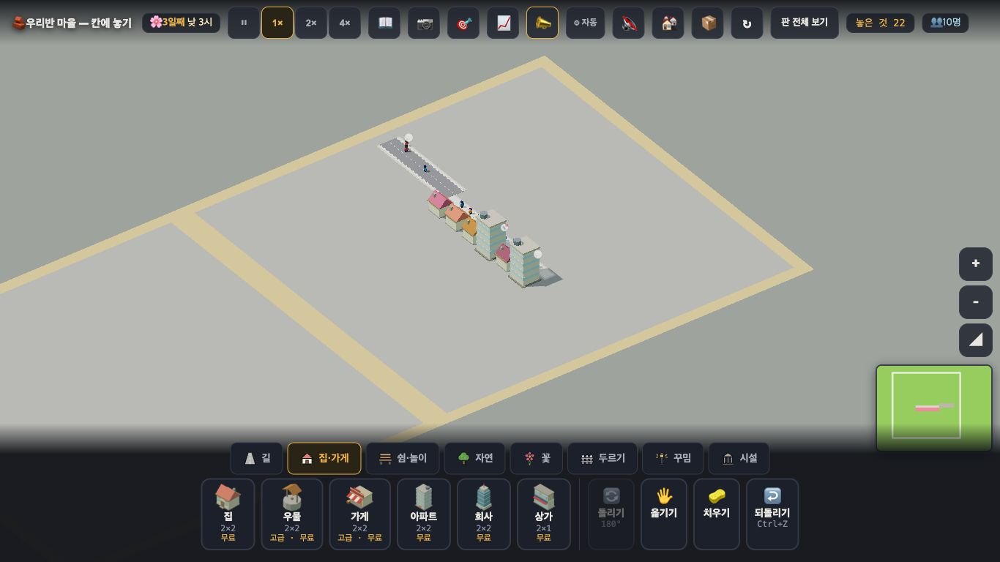

# 창조자의 눈 — 관찰 기록 20회: 한 칸이 여러 세대 (`city` 판) (2026-09-21)

> 보스가 **자기 손으로 확인 못 한 자리**(개발 훅이 되돌리기 스택을 안 타서)를 대신 봐 달라고 했습니다. **전부 진짜 마우스·키보드로** 했습니다.
> 본 판: 체험판 8790(최신 main · #800) · `?sid=guest&stage=city` · 1366×768 · **코드 수정 0**. 저장키 `rpg.village.guest.city` · 원격 `false`.
> **사실 / 해석 / 가설**을 나누고 고칠 것은 **ⓐ / ⓑ / ⓒ**.

## 한 줄
**되돌리기는 멀쩡합니다 — 아파트는 "4세대 · 정원 8" 그대로 돌아오고 보통 집은 정원 2 그대로입니다. 그런데 셋째 문이 있었습니다: 🖐 옮기기로 아파트를 집으려고 누르는 순간 정원이 8 → 2 가 되고, 옮겨지지도 않은 채 보통 집이 되어 그 자리에 남습니다.**

---

## 1. 되돌리기 — 부탁하신 것 (사실)

| 한 것 | 결과 |
|---|---|
| 아파트 놓기 | `house@140,142` · **정원 8** · 카드 "1층 · 🏠 … · **😟 4세대** · 물 뜰 곳·장 볼 곳·놀 곳·쉴 곳이 멀어요" |
| 치우기(오른쪽 단추) 한 번 | **"✋ 3명이 살아요 — 한 번 더 누르면 치워요"** (안 지워짐) |
| 한 번 더 | 지워짐(인구 0) |
| **Ctrl+Z** | **되돌아옴 · 정원 8 · 주민 2 · 카드 "😟 4세대 · …" 그대로** ✅ |
| 보통 집으로 같은 일 | 놓기 정원 2 → 치우기 → Ctrl+Z → **정원 2 그대로** ✅ (세대 말 안 붙음) |

**해석** — **두 자리 다 통과입니다.** 빈 아파트를 저장했다가 보통 집이 되던 문과 치우기·되돌리기 문은 막혔습니다.

**⚠ 제 실수 하나 정정** — 처음에 "되돌리기가 아무것도 안 되돌린다"고 보였습니다. **제가 되돌리기 단추를 잘못 집었습니다**(화면 밖에 있는 같은 글자 요소를 눌렀습니다). 트레이 안의 단추로 누르거나 Ctrl+Z 를 쓰면 정상입니다. **되돌리기 자체는 문제없습니다.**

**ⓒ 로 남길 것** — 치우기에 "**N명이 살아요 — 한 번 더 누르면 치워요**"라는 확인 규칙이 있습니다. 좋은 규칙인데, **한 번만 누르고 지워진 줄 아는 아이**가 있을 수 있습니다(제가 그랬습니다 — 두 번째 누름이 목표판에 가려 안 먹은 동안 "안 지워진다"고 헷갈렸습니다).

---

# ⓐ 하던 일을 멈추고 고칠 것

## ⓐ3. 🖐 옮기기로 **집으려고 누르는 순간** 아파트가 보통 집이 됩니다 — **세대가 사라지는 셋째 문**

**사실** — 깨끗한 3단계로 두 번 재현했습니다(진짜 마우스).

| 단계 | (146,142) | (140,142) |
|---|---|---|
| 아파트 놓은 직후 | **정원 8** | **정원 8** · 주민 2 |
| 🖐 를 고르고 **그 칸을 한 번 누름** | **정원 2** | **정원 2** · 주민 2 |
| 다른 빈 칸에 놓으려 함 | 새 자리 **집 없음** · 옛 자리에 **정원 2 짜리 집**이 그대로 | 〃 |

**사실** — 카드에서 **"4세대"가 사라집니다.** 건물은 그 자리에 그대로 있고, 오류 메시지는 **없습니다.**
**해석** — 보스가 걱정한 **"셋째 문"이 실제로 있습니다.** 게다가 옮기기가 **성공하지도 않은 채** 값만 깎입니다 — 들었다 놨다도 아니고, **집는 순간** 바뀝니다.
**가설** — 아이는 아파트를 옮겨 보려다 실패하고, 그 자리에 남은 건물이 **보통 집이 된 것을 모릅니다.** 나중에 "왜 사람이 안 차지?"에서 막힐 텐데 잇기 어렵습니다. 확인은 실제 아이에게 — 다만 **값이 깎이는 것은 지금 확인된 사실**입니다.

---

## 2. 아이 눈에 '여러 세대'가 보이는가 — **보입니다(말도 그림도)**

**사실** — 집 카드가 **"😟 4세대 · …"** 로 **먼저** 말합니다.
**사실** — 그림으로도 다릅니다: 아파트는 **층이 줄무늬로 갈린 키 큰 블록**이고, 보통 집은 낮은 삼각지붕입니다. 한 줄에 섞어 놓으면 **한눈에 갈립니다.**

**해석** — "높은 건물이 여러 집"이라는 것은 **높이로 읽힙니다.** 말이 없어도 다르게 보입니다.
**가설** — 다만 **문 앞에 나오는 사람이 한 명**이라(다음 PR 예정) '네 집이 산다'는 **양**은 아직 안 보입니다. 아이가 높이를 '여러 세대'로 읽을지 '그냥 큰 건물'로 읽을지는 실제 아이에게.

## 3. "가게 하나로는 아파트 넷을 못 먹인다" — **화면에서 따라갈 수 없습니다**

**사실** — 가게를 하나 놓고 카드를 눌렀습니다: **"가게 · 장 볼 곳 · 파란 길까지 닿아요 · 노란 집 6채 · 일자리 4/4"**.
그때 그 가게에 닿는 6채 중 **둘이 아파트**입니다 — 실제로는 **6채가 아니라 12세대**가 씁니다. 가게 카드는 **'채' 수로만** 말하고 세대는 안 들어갑니다.
**사실** — 이 판은 **흐름이 꺼져 있습니다**(`__flow().켜짐 = false` · 세대 {받음 0, 못받음 0}). '못 받은 세대'를 볼 창구가 화면에도 훅에도 없습니다.
**해석** — 시뮬에서 갈린 그 인과(하나면 50% 못 받음 → 둘이면 0%)를 **아이가 이 판에서 따라갈 방법이 지금은 없습니다.** 가게는 "집 6채"라고 하고, 못 받는 일은 아무 데서도 안 보입니다.
**🟢 고칠 거리** — 가게 카드를 **"노란 집 6채 (12세대)"** 처럼 세대까지 말하게 하면, 아파트를 하나 더 놓을 때 숫자가 **4씩** 뛰는 것이 보입니다. 그 자체가 이 판의 배움입니다.

## 4. 늘 보는 것

- **길을 더했을 때 — 이번엔 나빠지는 자리가 없었습니다.** 집 뒤쪽(y=140)에 길 한 줄을 깔았더니 **"🛣️ 이 길은 아직 본길과 안 이어졌어요 — 끝을 이어 줘야 사람들이 지나가요"** 가 뜨고, **집 카드는 하나도 안 나빠졌습니다**(before/after 동일). 9회 🔴1 이 도시 판에서도 닫혀 있습니다. ✅
- **기본 마을은 그대로입니다.** `pop88`(인구 89 · 집 68)에서 **세대 말이 붙은 집 0채** · 정원 분포는 2가 66채 · 4가 2채(2층으로 자란 집) · 칩 "💼 자리가 찬 집 24" 정상. ✅

---

# ⓑ 이번 묶음 안에서 고칠 것

- **ⓑ23.** **가게 카드가 '세대'를 말하지 않습니다**(위 3절). "노란 집 6채"만으로는 아파트가 네 몫을 쓴다는 것이 안 보입니다.
- **ⓑ24.** **목표 진도 표시가 늦습니다.** 큰길을 **하나** 놓은 뒤에도 "큰길 4개 · **지금 0 / 4개**" 였습니다(넷을 채우자 달성은 제대로 됐습니다). 아파트도 둘을 놓은 뒤 "0 / 4개" 였습니다.

# ⓒ 적어 두고 실제 아이에게 확인할 것

- **ⓒ31.** 아이가 아파트 높이를 **'여러 세대'로 읽는지, 그냥 '큰 건물'로 읽는지.**
- **ⓒ32.** 치우기의 "N명이 살아요 — 한 번 더 누르면 치워요"를 아이가 **두 번 누름으로 잇는지**(한 번 누르고 지워진 줄 알지는 않는지).
- **ⓒ33.** 문 앞 사람이 세대 수만큼 나오면(다음 PR) **그때 '네 집이 산다'가 읽히는지.**
- **ⓒ34.** "아파트 4채" 목표를 채우는 동안 아이가 **진도 0**을 보고 헷갈리는지.

## 미검증
제가 본 것은 **조작과 표시 경로 · 훅 값**까지입니다. 아이가 '한 칸에 여러 세대'를 이해하는지는 **실제 학생에게 확인할 일**입니다.
