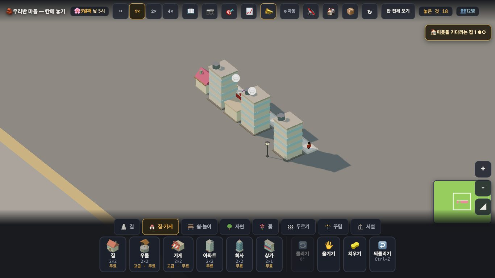

# 창조자의 눈 — 관찰 기록 21회: 넷째 문을 찾아서 · (n세대)가 읽히는가 (2026-09-21)

> 보스 요청: ① **셋째 문이 정말 닫혔는지를 아이가 할 법한 엉뚱한 순서로** ② **(n세대)가 읽히는지** ③ **아파트 높이가 '여러 세대'로 읽히는지**.
> 본 판: 체험판 8790(최신 main · #802) · `?sid=guest&stage=city` · 1366×768 · **코드 수정 0**. 저장키 `rpg.village.guest.city` · 원격 `false`.
> **사실 / 해석 / 가설**을 나누고 고칠 것은 **ⓐ / ⓑ / ⓒ**.

## 한 줄
**넷째 문은 못 찾았습니다 — 아홉 가지 엉뚱한 순서를 전부 통과합니다. `(n세대)`도 정확히 4씩 뜁니다(9 → 13). 대신 다른 것이 걸렸습니다: 🖐 옮기기는 클릭으로는 아무것도 안 들고, 아무 말도 하지 않습니다 — 느리게 끌어야만 듣습니다.**

---

## 1. 넷째 문 사냥 — **아홉 가지 다 통과** (사실)

아파트를 놓고(정원 8) 아이가 할 법한 엉뚱한 순서로 괴롭혔습니다. **전부 진짜 마우스·키보드.**

| # | 한 것 | 뒤 |
|---|---|---|
| A | 🖐 로 집고 → **다른 도구(치우기)를 고름** | 정원 **8** |
| B | 🖐 로 집고 → **Ctrl+Z** | 정원 **8** |
| C | 🖐 로 집고 → **Escape** | 정원 **8** |
| D | 🖐 로 집고 → **다른 아파트 위에 놓기** | 둘 다 정원 **8** |
| E | 🖐 로 집고 → **원래 자리에 도로** | 정원 **8** |
| F | **진짜로 옮김**(끌기) | 새 자리 **정원 8 · 주민 5** · 카드 "**😟 4세대**" · 옛 자리 없음 |
| H | 옮긴 **직후 Ctrl+Z** | 원래 자리에 **8 · 주민 5** 복귀 |
| I | **드는 중에(누른 채) Ctrl+Z** | **8 · 주민 5** 그대로 |
| J | **저장 → 새로고침** | **8·6 / 8·5 / 2·1** 그대로 |
| K | 치우고 **Ctrl+Z 두 번** | **8 · 주민 5** 복귀(두 번째는 변화 없음) |

**해석** — **ⓐ3 이 닫혔습니다.** 그리고 보스가 찾아낸 "문은 원래 하나였다"가 맞는 것으로 보입니다 — 제가 아홉 갈래로 두들겼는데 **세대가 새는 곳이 한 군데도 없었습니다.**
**가설** — 제가 못 떠올린 순서가 더 있을 수 있습니다(예: 두 손가락 터치, 판 밖으로 끌기). 다만 **지금 열어 둘 만한 의심은 없습니다.**

## 2. 그런데 ⓑ — **🖐 는 클릭으로는 아무것도 안 듭니다. 그리고 말이 없습니다**

**사실** — 🖐 을 고른 뒤(단추 class `card tool on` 으로 켜진 것 확인) 물건을 **클릭**하면 **아무 일도 안 일어납니다.** 물건은 그대로 있고, 토스트도 없습니다.

| 방식 | 결과 |
|---|---|
| 클릭 → 목적지 클릭 | **안 들림**(아파트·보통 집·가로등 모두) |
| 빠르게 끌기(0.3초) | 안 들림 |
| **느리게 끌기**(누르고 0.7초 뒤 천천히 이동, 떼기) | **들리고 옮겨짐** ✅ |

**해석** — 🖐 는 **끌기 전용**입니다. 그런데 클릭했을 때 **"끌어서 옮겨요" 같은 말이 없어서**, 아이는 "눌렀는데 왜 안 되지"에서 멈춥니다.
**해석(20회 정정)** — 20회에 제가 "🖐 로 집으려 누르니 정원이 8→2 가 됐다"고 적었는데, 지금 보니 그때도 **들린 적이 없었습니다** — 들지도 못한 채 값만 깎였던 것입니다. 지금은 **값은 지켜지고, 여전히 안 들립니다**(클릭으로는).
**가설** — 태블릿에서는 손가락으로 끌기가 더 자연스러울 수 있습니다. 마우스를 쓰는 크롬북에서 클릭만 하는 아이가 막힐 자리입니다. **확인은 실제 아이에게.**

---

## 3. `(n세대)` 가 읽히는가 — **숫자는 정확히 4 뜁니다**

**사실** — 같은 가게를 두 번 눌렀습니다.

| 언제 | 가게 카드 |
|---|---|
| 아파트 2 + 보통 집 1 | "가게 · 장 볼 곳 · 파란 길까지 닿아요 · **노란 집 3채 (9세대)** · 일자리 4/4" |
| **아파트 하나 더 놓고** | "가게 · 장 볼 곳 · 파란 길까지 닿아요 · **노란 집 4채 (13세대)** · 일자리 4/4" |

4+4+1 = **9** · 4+4+4+1 = **13** — 셈이 맞고 **4 뜁니다** ✅

**해석 — 아이가 알아챌 만한가: 조건부입니다.**
- 🟢 숫자가 **한 줄에 같이** 있어 "채"와 "세대"를 견줄 수 있습니다.
- 🟡 **앞 값이 안 남습니다.** 카드를 두 번 눌러야 하고, 두 값을 **나란히 볼 수 없습니다**(15회 ⓑ11 과 같은 종류). 9와 13을 **기억으로** 견줘야 합니다.
- 🟡 '채'와 '세대'가 **동시에** 움직입니다(3→4 와 9→13). 아이가 **+1 쪽만** 볼 수도 있습니다.
- 🔴 **결과가 여전히 안 보입니다.** 이 판은 흐름이 꺼져 있어(`__flow().켜짐 false`) **'못 받은 세대'를 볼 창구가 없습니다.** `(13세대)`는 **원인 쪽 숫자**일 뿐이고, "그래서 가게 하나로는 모자라다"는 화면 어디에도 안 나옵니다.
**가설** — 아이가 "13세대인데 가게가 하나네"까지 가려면 **모자란다는 신호**가 한 번은 떠야 합니다. 지금은 숫자만 커집니다. **확인은 실제 아이에게** — 다만 **결과 쪽 창구가 없다는 것은 지금 확인된 사실**입니다.

## 4. 높이가 '여러 세대'로 읽히는가 — **모양은 확실히 다릅니다**

**사실** — 아파트는 **가로줄이 네 개 그어진 키 큰 청록 블록**이고, 보통 집은 낮은 분홍 삼각지붕입니다. 한 줄에 섞어 놓으면 **한눈에 갈립니다.**
**사실** — 줄무늬가 **네 개**라 세대 수(4)와 같습니다.
**해석** — 카드 글을 안 읽는 아이도 **"저건 다른 집"** 까지는 읽습니다. **"네 집이 산다"** 까지 가려면 줄을 세어야 하는데, 그건 알려 주는 사람이 있어야 할 것 같습니다.
**가설** — 문 앞에 장바구니 든 사람이 **네 명** 나오면(다음 PR) 그때 '양'이 보일 것입니다. 그게 들어오면 다시 보겠습니다.

---

# ⓐ 하던 일을 멈추고 고칠 것
없음. (ⓐ3 은 닫혔고, 새로 연 문도 못 찾았습니다.)

# ⓑ 이번 묶음 안에서 고칠 것
- **ⓑ25.** **🖐 을 클릭했을 때 아무 말이 없습니다.** "끌어서 옮겨요" 한 줄이면 됩니다(위 2절). 지금은 아이가 눌러 보고 멈춥니다.
- **ⓑ26.** 가게 카드의 **앞 값이 안 남습니다.** 아파트를 하나 더 놓았을 때 "(9세대 → **13세대**)" 처럼 잠깐 보여 주면, 4 뛰는 것이 **기억 없이** 보입니다.
- **ⓑ27.** `(n세대)` 는 **원인만** 말합니다. 이 판에 '못 받은 세대'를 볼 창구가 없어, "가게 하나로는 모자라다"가 여전히 화면에 없습니다.

# ⓒ 적어 두고 실제 아이에게 확인할 것
- **ⓒ35.** 아이가 🖐 을 **클릭으로 쓰는지 끌기로 쓰는지**(마우스 크롬북 / 태블릿 손가락).
- **ⓒ36.** 가게 카드에서 아이가 **'채'를 보는지 '세대'를 보는지.**
- **ⓒ37.** 아파트 줄무늬 **네 개를 세는지.**
- **ⓒ38.** (다음 PR 뒤) 문 앞 사람 넷이 나오면 그때 '네 집'이 읽히는지.

## 미검증
제가 본 것은 **조작과 표시 경로 · 훅 값**까지입니다. 아이가 '한 칸에 여러 세대'와 '그래서 가게가 모자라다'를 잇는지는 **실제 학생에게 확인할 일**입니다.
