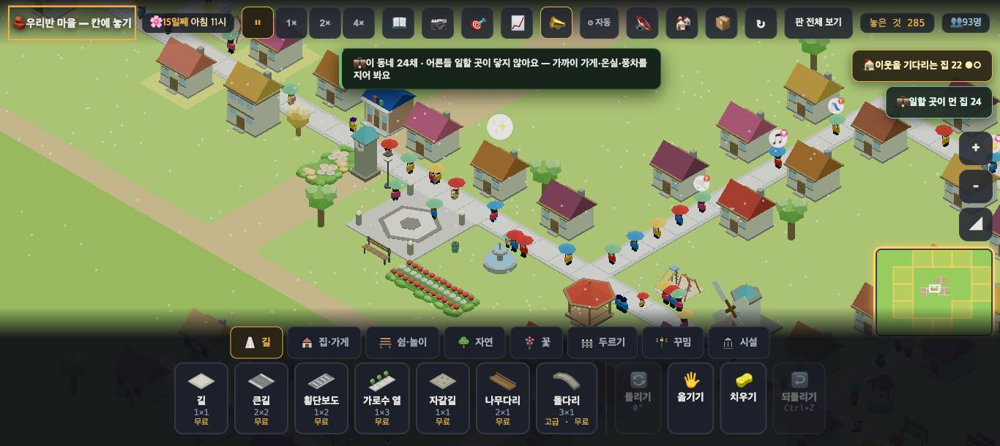
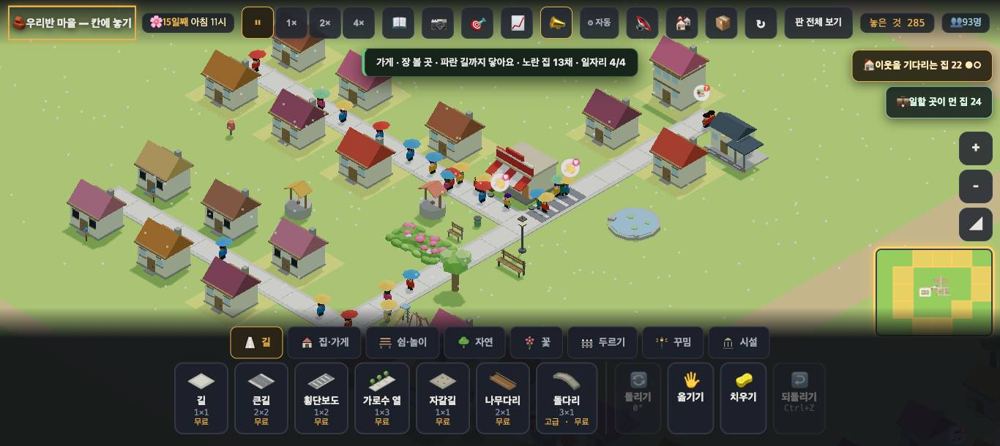
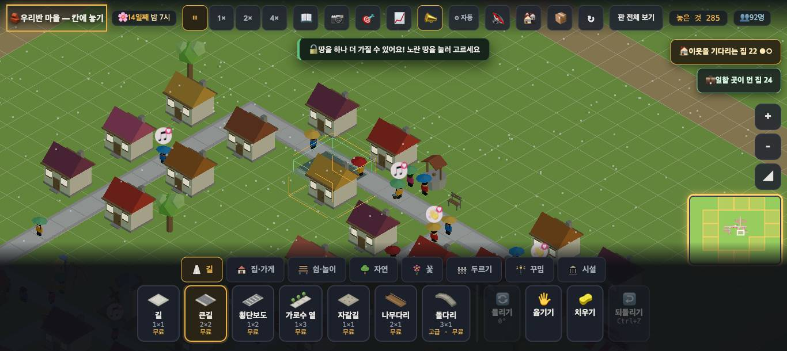
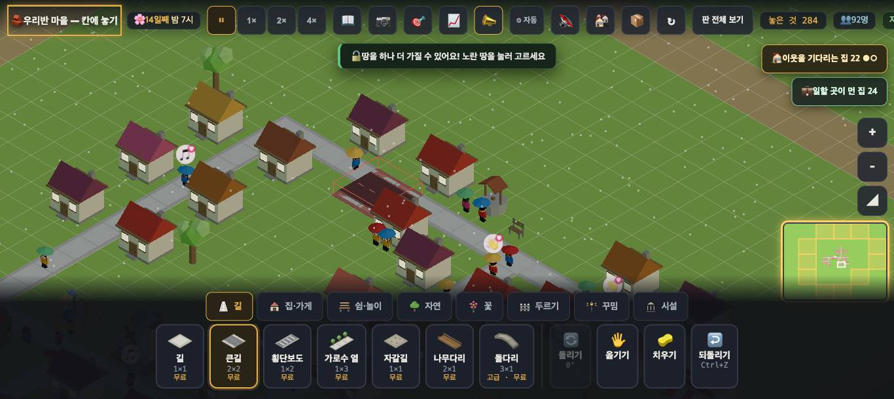

# 창조자의 눈 — 관찰 기록 8회: 말과 실제가 어긋나는 곳 (2026-09-21)

> 이번 초점(보스): **"가까운 일터에 자리가 없는 집"과 "일터가 먼 집"을 아이가 다른 이유로 읽고 다른 수로 푸는가.** 지금은 둘 다 같은 말이다.
> 본 판: `origin/feat/village-45` **d6c3e11**(#710 까지 · 체험판과 같은 판). `?sid=guest&dev=1` 로만 · 코드 수정 0.
> 판: `village/stages/boards/pop88.json`. 화면은 앱 안 브라우저 + Playwright(진짜 마우스 누름 · 그림 저장). 숫자는 `node scripts/village-sim/run.mjs`(3일 · 시드 1~5 · 같은 시드끼리).
> 표: 🔴 막힘 · 🟡 필요해짐 · ✅ 지난 회 지적이 풀린 것.

## 한 줄
**"일할 곳이 없어요"라고 말하는 집 바로 곁(직선 6~8칸)에 일터가 있다 — 자리가 찼을 뿐이다. 아이는 '멀다'로 읽고 길을 질러 놓는다(효과 0/5시드). 실제로 푸는 건 자리를 늘리는 수다(가게 +4 · 풍차 +2 · 5/5시드).**

---

## ① 아이가 틀린 원인을 배우는 장면 (실제로 만들어 봄)

### 잰 것 — "일할 곳이 없어요" 집들의 가장 가까운 일터 (pop88 · 15일째)

| 집 | 식구 | 가장 가까운 일터 | 그 일터 |
|---|---|---|---|
| (138,145) | 2 | 가게 13칸 | **일자리 4/4** |
| (141,145) | 2 | 가게 10칸 | **4/4** |
| (144,145) | 2 | 가게 **7칸** | **4/4** |
| (170,146) | 2 | 풍차 8칸 | **2/2** |
| (177,147) | 2 | 풍차 **6칸** | **2/2** |
| (180,147) | 2 | 가게 8칸 | **4/4** |

- 마을 전체: **일자리 31개 · 찬 자리 31개(100%) · 일 없는 어른 21명.** 빈자리가 하나도 없다 — 즉 **모든 '일할 곳이 없어요'의 진짜 까닭은 자리(정원)다.**

### 아이가 보는 말 — 넷 중 셋이 '거리'로 말한다

| 어디 | 말 |
|---|---|
| 오른쪽 위 칩 | **"💼 일할 곳이 **먼** 집 24"** |
| 칩을 누르면 | **"💼 이 동네 24채 · 어른들 일할 곳이 **닿지 않아요** — 가까이 가게·온실·풍차를 지어 봐요"** (그림 1) |
| 집을 누르면 | "… · **일할 곳이 없어요**" |
| 새 이웃이 돌아설 때 | "💼 일할 곳이 **닿지 않아요** — 가까이 가게·온실·풍차를 지어 봐요" |
| (기기당 딱 한 번, 첫 소식) | "💼 마을이 커져서 어른들 일할 곳이 **모자라요** — 가게·온실·풍차를 더 지어 봐요" ← **이 말만 맞다** |

가게를 누르면 자리 정보는 **가게 쪽에** 있다 — "가게 · 장 볼 곳 · 파란 길까지 닿아요 · 노란 집 13채 · **일자리 4/4**"(그림 2). 집에서 가게로 옮겨 가 눌러 봐야 알 수 있다.

### 아이가 말대로 두는 수 — 그리고 결과

| 아이의 수 | 화면 | 도구(3일 · 시드 5) |
|---|---|---|
| **"멀다니까 길을 질러 놓자"** — 집과 풍차 사이에 길 7칸 | 두 집 말 **그대로** ("… 일할 곳이 없어요") | **일먼집 0/5시드 · 찬자리 0/5** — 아무것도 안 바뀜 |
| 말이 권하는 대로 **가게 하나** | 두 집에서 "일할 곳이 없어요"가 사라짐 · 칩 24 → 20 | **일먼집 +4 · 5/5시드 · 2시간 뒤** |
| **풍차 하나**(길에 닿게) | 칩 20 → 18 | **일먼집 +2 · 5/5시드** |

- 아이가 "가까이 지어 봐요"를 글자 그대로 따르면 결과는 맞다. **그러나 배우는 규칙이 틀린다** — "우리 동네엔 일터가 멀구나"로 읽고, 거리를 줄이는 수(길·옮기기)를 먼저 시도하면 **아무 일도 일어나지 않는다.** 그 수가 왜 헛수고인지도 화면에 안 나온다.
- 🔴 **칩 이름이 '먼 집'이다.** 24채 중 몇 채가 정말 먼지/몇 채가 자리 때문인지 구분이 없다.
- 🟡 자리가 늘어 풀린 순간에도 그 집들 위에 아무 표시가 없다(우물의 🪣✓ 같은 것). 숫자만 조용히 줄어든다(시뮬 1시간 늦게).
- 🟢 말만 갈라도 아이는 다른 수를 배운다: **자리 때문이면** "💼 가까운 가게가 꽉 찼어요 — 일할 곳을 하나 더 지어요", **정말 멀면** "💼 일터가 멀어요 — 이 동네에 가게·온실·풍차를" (구분은 이미 있는 값으로 된다: 그 집의 길 BFS 안에 일터가 있나 · 그 일터에 빈 자리가 있나).

---

## ② 그 밖에 말과 실제가 어긋나는 곳

### 🟡 1. 다른 소식이 방금 누른 것의 대답을 덮는다
- 👀 가게를 눌렀는데 뜬 것은 "🟨 노란 땅이 화면 밖에 있어요 — 미니맵의 노란 칸을 눌러 봐요"였다. 7회에도 💼 칩을 누른 순간 "🔓 땅을 하나 더 가질 수 있어요"가 덮었다.
- **아이가 손으로 누른 것의 대답**은 저절로 뜨는 소식보다 먼저·오래 떠야 한다(또는 소식은 칩처럼 옆에).

### 🟡 2. "길을 한 줄 더 내 봐요" — 그 말이 나오는 자리엔 한 줄 더 낼 자리도 없다
- 이 한마디는 **곁에 큰길 놓을 빈 자리가 없을 때** 나온다(코드). 그런데 그런 동네는 집이 촘촘해서 **나란한 길 한 줄도 안 들어간다** — 붐비는 집 곁에 한 줄을 내 보려 했더니 **여덟 칸 중 한 칸만** 깔렸다.
- 확인 못 함: 자리가 넉넉한 곳에서 '한 줄 더'가 붐빔을 실제로 나누는지는 다음 회에.

### 🟡 3. (시험 틀 이야기 · 아이 화면 아님) '두 번 눌러'는 진짜 마우스에서만
- 큰길을 집 곁에 놓을 때 "🏠 이 집이 한 칸 물러나요 — **두 번 눌러** 큰길을 깔아요"가 뜬다. **진짜 마우스로 두 번 누르면 깔린다**(그림 3·4). 내가 쓰는 시험 훅(`__act`·`__click`)은 누르는 경로가 달라 영영 안 깔렸다 — 다른 세션이 같은 방식으로 시험할 때 헷갈릴 수 있어 적어 둔다.

---

## ✅ 지난 회 지적이 풀린 것 (같은 자리에서 다시 봄)

| 회 | 지적 | 지금 |
|---|---|---|
| 7회 🔴1 | 풍차·온실이 길에 안 닿아도 놓임 → 일자리 0/2 | **풀림** — 판 전체를 훑어도 풀밭 풍차 자리 0곳("온실은 길에 붙어야 해요") |
| 7회 🔴2 | 길에 닿은 풍차도 '일 먼 집'을 안 줄임(0/5) | **풀림** — 화면 20 → 18 · 도구 +2 · **5/5시드** |
| 7회 🔴4 | 문 앞 길을 큰길로 못 넓힘 | **풀림** — 길 위에 큰길이 놓이고, 그 집이 😟 "길이 붐벼요" → 😐 (하루 뒤) |
| 4회 🟡A4 | "노란 땅을 눌러 고르세요"인데 노란 땅이 화면 밖 | **풀림** — "🟨 노란 땅이 화면 밖에 있어요 — 미니맵의 노란 칸을 눌러 봐요" |

---

## ③ 수정본이 올라오면 볼 잣대 (같은 자리 · 같은 방법)
1. pop88 을 15일째까지 돌린 뒤 **"일할 곳이 없어요" 집들의 가장 가까운 일터 거리와 자리**를 다시 표로(이번 표와 나란히).
2. 그 집을 눌렀을 때 · 칩에 **자리/거리가 갈라져 보이는지**, 칩 이름이 아직 '먼 집'인지.
3. 도구로 같은 세 수(길 질러 놓기 · 가게 1 · 풍차 1)를 **시드 1~5**로: 길은 여전히 0/5여야 하고, 자리를 늘리는 수만 듣는지.
4. 자리가 늘어 풀린 순간에 **집 위 표시**가 생겼는지.

## 보스에게 따로
- ①의 '길 질러 놓기'는 도구로도 화면으로도 0이었다 — 아이가 이 수를 두면 **되돌릴 것도 없이 그냥 헛수고**다(길이 늘어 붐빔만 조금 는다).
- 이번 회에 **성장 관련 셋**(꾸밈 속도·바람·성장 시계)은 건드리지 않았다(고치는 중이라 했으므로).
