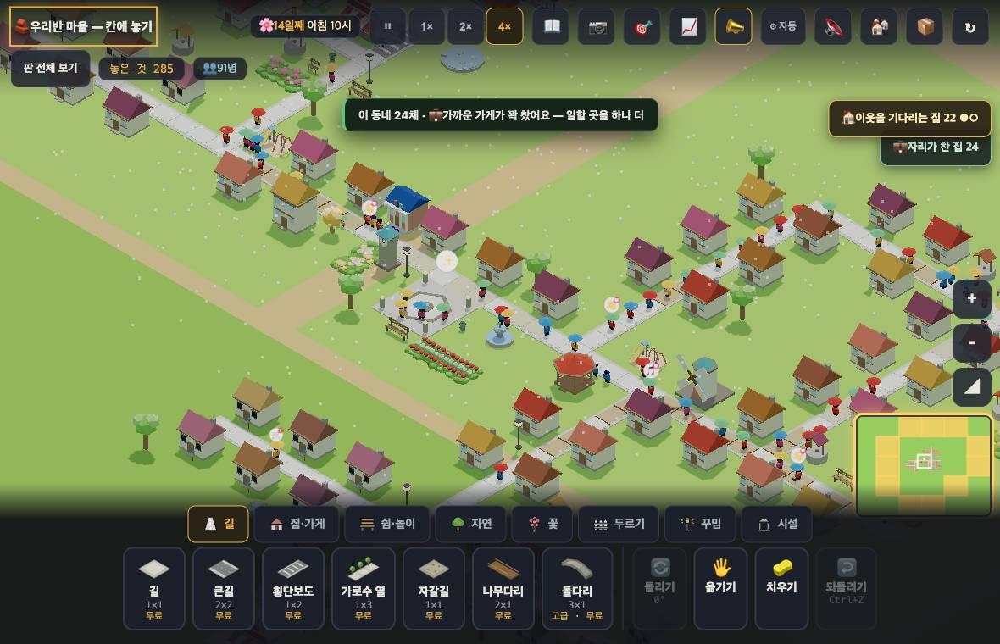
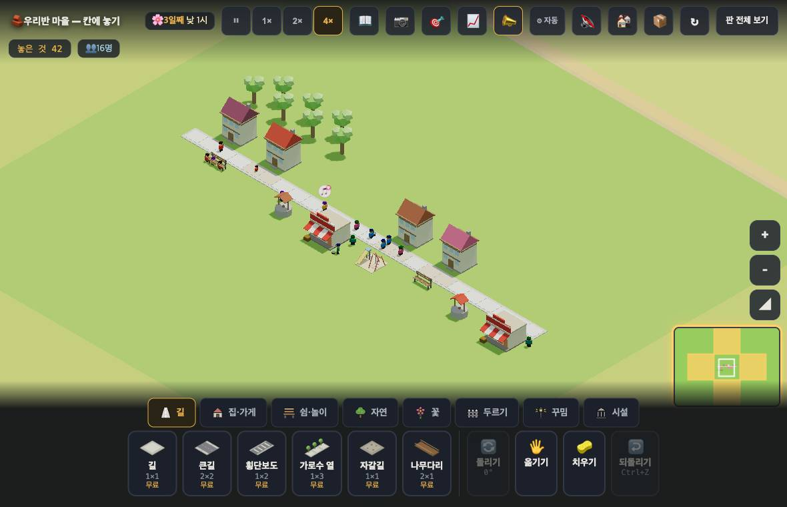

# 창조자의 눈 — 관찰 기록 9회: 자리와 거리는 갈라졌다 · 다음 벽은 다시 붐빔 (2026-09-21)

> 이번 초점(보스): **8회에서 쓴 잣대를 main 에서 그대로 다시 대 본다** — 말이 자리(정원)와 거리를 가르는가 · 아이가 두는 수는 달라지는가.
> 본 판: `origin/main` **0d93cd9**(#725 까지). `?sid=guest&dev=1` 로만 · **코드 수정 0**.
> 판: `village/stages/boards/pop88.json` · `pop167.json` · 이번에 새로 만든 작은 판 `docs/creator_notes/boards/young4.json`(집 4채).
> 화면은 앱 안 브라우저 + Playwright(진짜 마우스 누름 · 그림 저장). 숫자는 `node scripts/village-sim/run.mjs`(같은 시드끼리).
> 표: 🔴 막힘 · 🟡 필요해짐 · ✅ 지난 회 지적이 풀린 것.

## 한 줄
**8회에 지적한 것은 **넷 다 풀렸다** — 이제 아이는 "자리가 찼다"를 읽고 가게를 짓는다. 그런데 그 다음 칸에서 바로 막힌다: 집 4채·16명짜리 갓 만든 마을도 "길이 붐벼요"가 되고, 화면이 시키는 "길을 한 줄 더 내 봐요"를 그대로 따르면 **네 집이 한꺼번에 나빠진다.**

---

## ① 8회 표를 같은 자리에서 다시 (pop88 · 14일째)

| 집 | 8회 — 그때 말 | 9회 — 지금 말 | 가장 가까운 일터 |
|---|---|---|---|
| (138,145) | 일할 곳이 없어요 | **가까운 일터가 꽉 찼어요** | 가게 13칸 |
| (141,145) | 일할 곳이 없어요 | **가까운 일터가 꽉 찼어요** | 가게 10칸 |
| (144,145) | 일할 곳이 없어요 | **가까운 일터가 꽉 찼어요** | 가게 **7칸** |
| (153,150) | — | **가까운 일터가 꽉 찼어요** | 도서관 5칸 |
| (156,150) | — | **가까운 일터가 꽉 찼어요** | 도서관 **2칸** |
| (160,150) | — | **가까운 일터가 꽉 찼어요** | 도서관 **2칸** |

- 24채 **전부** '자리'로 말한다. 거리는 2칸부터 16칸까지 제각각인데 **까닭은 하나** — 자리다. 8회에 "모든 '일할 곳이 없어요'의 진짜 까닭은 자리"라고 적은 것과 정확히 같다.
- 훅 `__jobWhy()`: **full 240 · none 0 · cut 0 · far 0**(잰 집 240회분).

## ② 칩·카드가 자리와 거리를 가르는가 — ✅ 갈라졌다

| 어디 | 8회 | 지금 |
|---|---|---|
| 오른쪽 위 칩 | "💼 일할 곳이 **먼** 집 24" | **"💼 자리가 찬 집 24"** |
| 칩을 누르면 | "일할 곳이 **닿지 않아요** — 가까이 가게·온실·풍차를 지어 봐요" | **"이 동네 24채 · 💼 가까운 가게가 꽉 찼어요 — 일할 곳을 하나 더"** |
| 집을 누르면 | "일할 곳이 없어요" | **"… · 가까운 일터가 꽉 찼어요 · …"**(카드 원문: "1층 · 🏠 ○○ · 😟 장 볼 곳이 멀어요 · 가까운 일터가 꽉 찼어요 · 나무가 많아 좋아요" — ○○ 는 주민 이름을 가린 것) |

- 8회 🟢 에 적은 말("자리 때문이면 '가까운 가게가 꽉 찼어요 — 일할 곳을 하나 더'")이 **거의 그대로** 들어갔다.
- 👀 아이가 이제 "멀다 → 길"로 새지 않는다. 칩·소식·집 카드 세 곳이 **같은 말**을 한다.

## ③ 아이가 두는 세 수 — 그대로인가 (pop88 · 3일 · 시드 1~5)

| 아이의 수 | 8회 | 9회 |
|---|---|---|
| 길 7칸 질러 놓기 | 0/5 · 아무 변화 없음 | **0/5 · 그대로**(까닭:full 24 → 24) |
| 가게 하나 | +4 · 5/5 | **+4 · 5/5 · 2시간 뒤** |
| 풍차 하나 | +2 · 5/5 | **+2 · 5/5 · 2시간 뒤** |

- 숫자는 하나도 안 달라졌다. **달라진 건 아이가 고를 수 있는 근거다** — 8회엔 화면이 '멀다'고 해서 길을 골랐고, 지금은 '자리가 찼다'고 해서 가게를 고른다. 헛수고(길 0/5)를 **고르지 않게** 되었다.

## ④ 풀린 순간의 표시(💼✓) — 생겼다

- 가게를 놓아 자리가 생긴 순간, 그 집들 위에 **💼✓** 가 뜬다(시간이 흐르기 시작하고 **0.5초 안**에 4채). 8회 🟡("숫자만 조용히 줄어든다")가 풀렸다.
- 👀 우물의 🪣✓ 와 같은 결이라 아이가 "내가 놓은 것 → 이 집"을 잇는다.

## ⑤ 도구의 새 눈금 `--show 까닭`

| 판 | none(일터 없음) | cut(길 끊김) | far(멀다) | **full(자리 참)** |
|---|---|---|---|---|
| pop88 | 0 | 0 | 0 | **24** |
| pop167 | 0 | 0 | 0 | **56** |

- 아이가 만든 두 판 모두 **까닭이 100% '자리'** 다. 'far'(정말 먼 집)는 **한 채도 없다.**
- 🟡 그러면 아이에게 보여 줄 칩 이름은 지금(자리가 찬 집)으로 맞다. 다만 **'먼 집'이라는 말이 실제로 쓰일 일이 거의 없다** — 수업 판에서 far 가 뜨는 판이 있는지 한 번 확인해 둘 값어치는 있다(안 뜨면 그 말은 죽은 말이다).

---

## 덧 1 (보스 물음) — 길을 끊으면 얼마나 기다려야 말이 바뀌나

- pop88 에서 일하던 집(145,142)과 그 가게 사이의 길 두 칸을 지웠다. **1× 속도로 7초 만에** 집 카드가 바뀌었다 — 한 바퀴(9~12초) 안이다. **기다림은 답답하지 않다.**
- 🔴 **그런데 바뀐 말이 틀렸다.** 뜬 말은 "**일할 곳이 없어요**"(none)다 — 정작 가게는 8칸 옆에 그대로 서 있다. 'cut'(길이 끊겨 일터에 못 가요)은 **"빈 자리가 있는 일터"에 닿을 때만** 나오는데, 다 자란 마을은 모든 일터가 꽉 차 있어서 **영영 안 나온다.**
  - 아이가 실수로 길을 지웠을 때 화면은 "길을 다시 이어라"가 아니라 "일할 곳을 지어라"라고 말한다. 짓기는 실제로 듣는다(가게 +4) — 그래서 **틀린 줄도 모른 채** 길이 끊긴 마을을 계속 키운다.
  - 'cut' 이 실제로 뜨는 걸 한 번 봤다(아래 🔴 1 의 새 동네 — 거기엔 빈 자리가 있는 일터가 있었다) — 규칙이 안 도는 건 아니고, **다 자란 마을에서만 안 나온다.**

## 덧 2 (보스 물음) — 숨은 규칙 셋을 뺀 뒤 '성장이 느려진 체감'이 답답한가

**무엇이 빠졌는지(코드로 확인)**

| 빠진 규칙 | 옛 값 | 지금 | 한 층에 드는 시간(1× · 한 층 = 하루 = 3분) |
|---|---|---|---|
| 꾸밈 배율([MAC-NOGROWMUL]) | 나무 많은 집 ×0.7 · 삭막한 집 ×1.15 | ×1 고정 | 나무 많은 집 **2분 6초 → 3분**(+54초) · 삭막한 집 3분 27초 → 3분(**27초 빨라짐**) |
| 바람 당김([MAC-WISHNOGROW]) | 들어주면 반나절 당김 | 없음 | 한 번에 최대 −1분 30초가 사라짐 |
| (대신 들어온 것) 멈춤·이어서([MAC-GROWPAUSE]) | 😐 가 되면 **처음부터 다시** | 멈췄다가 **이어서** | 옛 판은 하루 중 한 번만 삐끗해도 3분이 날아갔다 |

**실제로 재 본 것 — 같은 판을 지금 판과 8회 판(d6c3e11)에서 6일씩(시드 1~3)**

| 판 | 2층이상 (지금 / 8회) | 3층 | 웃는집 |
|---|---|---|---|
| 작은 마을(집 4채·16명) | 시작 3 → 1일 뒤 **4** / 시작부터 **4** | **0 / 0** | 4 → 0 (양쪽) |
| pop88(88명) | **3 → 3** / **3 → 3** | 0 / 0 | 1 → 0 (양쪽) |

- 차이는 **첫 한 층에서 하루 남짓**이다. 그 다음부터는 **양쪽 다 한 층도 더 안 자란다.**
- 👀 그러니까 아이가 느끼는 답답함은 "14% 느려졌다"가 아니다. **집이 2층에서 멈추고, 왜 멈췄는지 고칠 방법이 없다**는 것이다(아래 🔴 1·2). 이 멈춤은 옛 판에도 똑같이 있었다.
- 🟢 빠진 규칙을 되돌릴 까닭은 안 보인다. 되돌려도 첫 층이 하루 빨라질 뿐, 벽은 같은 자리다.

---

## 🔴 1. 화면이 시키는 "길을 한 줄 더 내 봐요"를 따르면 **네 집이 한꺼번에 나빠진다**

- pop88 판의 빈 땅에 **다 갖춘 동네**(길 한 줄 · 집 4채 · 우물·가게·놀이터·긴의자·도서관이 모두 닿음)를 새로 지었다. 네 집이 😊/😐 로 자리를 잡은 뒤, 세 집이 "😐 … 길이 붐벼요 · 🛣️ **길을 한 줄 더 내 봐요** — 사람들이 나눠 걸어요"라고 말했다.
- 시키는 대로 집들 **반대쪽에 길 한 줄**(12칸)을 깔았다. 결과:

| 집 | 한 줄 내기 전 | 낸 뒤 |
|---|---|---|
| A | 😊 다 있어요 | 😐 **배울 곳이 멀어요** |
| B | 😐 다 있어요 · 길이 붐벼요 | 😐 **놀 곳·배울 곳이 멀어요** |
| C | 😐 다 있어요 · 길이 붐벼요 | 😟 **장 볼 곳·놀 곳·배울 곳이 멀어요** |
| D | 😐 다 있어요 · 길이 붐벼요 | 😟 **물 뜰 곳·장 볼 곳·놀 곳·배울 곳이 멀어요 · 길이 끊겨 일터에 못 가요** |

- 새 길을 **다시 지우자 네 집 모두 원래대로** 돌아왔다(😊/다 있어요). 우연이 아니다.
- 까닭(코드): 필요는 **그 집의 '문 앞 길 칸' 하나**에서 길을 따라 14칸을 세어 채운다(`roadBeside` → `roadBFS`). 집 뒤에 길을 깔면 **문 앞 칸이 새 길로 바뀌고**, 우물·가게·놀이터가 있는 원래 거리까지 **빙 돌아가야 해서** 한꺼번에 '멀어요'가 된다.
- 👀 아이 눈에는 "시키는 대로 했더니 마을이 망가졌다"로 보인다. **되돌리는 법(그 길을 다시 지우기)도 화면에 없다.**
- 🟡 한 줄 더 내기를 권하려면 **어느 쪽에 내야 하는지**(문 앞 길과 나란히 · 시설 쪽)를 같이 말해 주거나, 문 앞 칸을 고를 때 **필요가 더 많이 채워지는 칸**을 고르게 하는 편이 낫다.

## 🔴 2. 붐빔은 **집 4채·16명**에서 시작한다 — 그리고 풀 수가 없다

- 새로 시작한 판에 길 한 줄, 집 4채, 우물·가게·놀이터·긴의자만 놓았다. 하루 만에 네 집이 다 😊 가 됐고 **2층까지 자랐다.** 그런데 이웃이 차서 **16명**이 되자 네 집 중 **셋이 "길이 붐벼요"** 가 되고 성장이 멈췄다(`__crowdHomes()`: 붐비는집 3/4 · 집붐빔 **1.75**(품 4)).
- 👀 **그림을 보면 길 위에 사람이 열도 안 된다.** 같은 훅이 "붐빈 사람 0 · 느린 사람 0"이라고 말한다 — 아무도 실제로 막히지 않는데 집만 붐빈다고 한다.
- 화면이 권하는 한 수는 "🛣️ 문 앞 길을 큰길로 넓혀 봐요". 큰길을 놓아 봤다 — **한 곳만 되고(그 집은 바로 😊) 나머지 일곱 곳은 전부** "큰길은 두 칸 폭이에요 — 곁에 물러날 자리가 없어요"로 막혔다. 막은 것은 **길 건너편에 놓인 우물·가게·놀이터·긴의자**, 즉 **필요를 채우려고 아이가 놓은 바로 그 물건들**이다.
- → 7회 🔴4("이미 지은 골목은 넓힐 수 없다")는 **큰 마을만의 문제가 아니었다.** 집 4채짜리 첫 마을에서 이미 같은 벽이다.
- 🟡 (7회 🟢5 과 같은 결) 붐빔을 푸는 수가 **큰길 하나뿐**인 한, 길가에 시설을 놓은 마을은 전부 막힌다. 집을 안 치우고 놓을 수 있는 한 수(정류장 같은 것)가 필요하다.

---

## 다음 회에 볼 잣대 (같은 자리 · 같은 방법)
1. `young4.json`(집 4채)을 열고 하루 뒤 **붐비는집 3/4 · 집붐빔 1.75** 가 그대로인지.
2. 같은 판에서 "길을 한 줄 더" 를 따랐을 때 네 집이 나빠지는지(이번 표와 나란히).
3. pop88 에서 길 두 칸을 끊고 **7초 뒤에 뜨는 말이 'none' 인지 'cut' 인지.**
4. 수업 판 어딘가에서 **까닭:far 가 한 채라도 뜨는지.**

## 보스에게 따로
1. 8회 지적(①~④)은 **넷 다 반영됐다.** 말·칩·소식·표시가 한 몸이 됐고, 아이가 헛수고(길 질러 놓기)를 고를 까닭이 사라졌다.
2. 지금 가장 아픈 건 **🔴 1** 이다 — 화면이 직접 시킨 수가 마을을 나쁘게 만든다. 고치는 값은 작아 보인다(권하는 말에 '어느 쪽'을 넣거나, 문 앞 칸 고르기).
3. **성장 14% 는 되돌릴 값어치가 없어 보인다**(덧 2). 되돌려도 첫 층이 하루 빨라질 뿐, 2층에서 멈추는 건 옛 판도 같다. 멈춤의 진짜 이름은 **붐빔**이다.
4. 재현용 작은 판을 `docs/creator_notes/boards/young4.json` 에 넣어 뒀다(집 4채 · 16명 · 놀이터까지 다 있음). `?sid=guest&dev=1` 에서 `__importText(글)` 후 새로고침.
