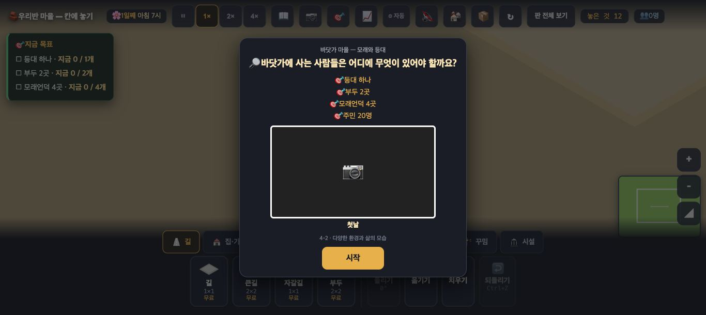
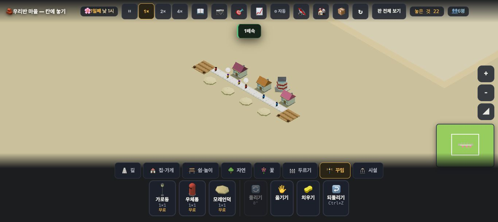
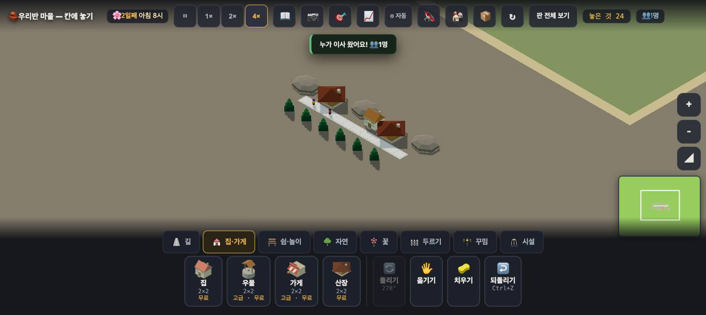
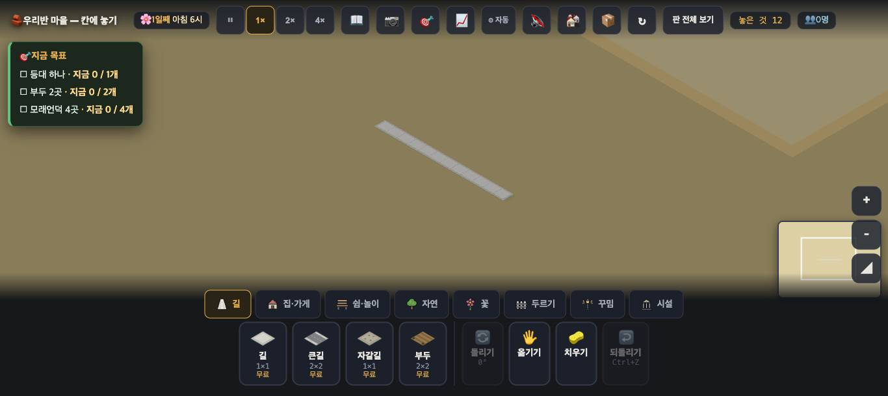
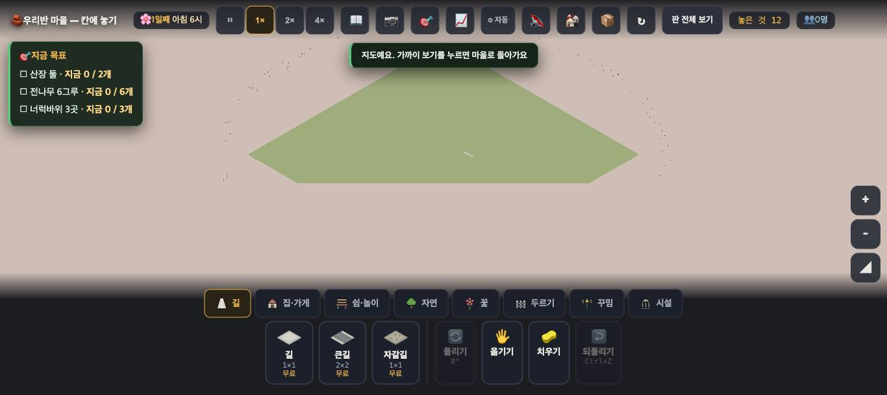
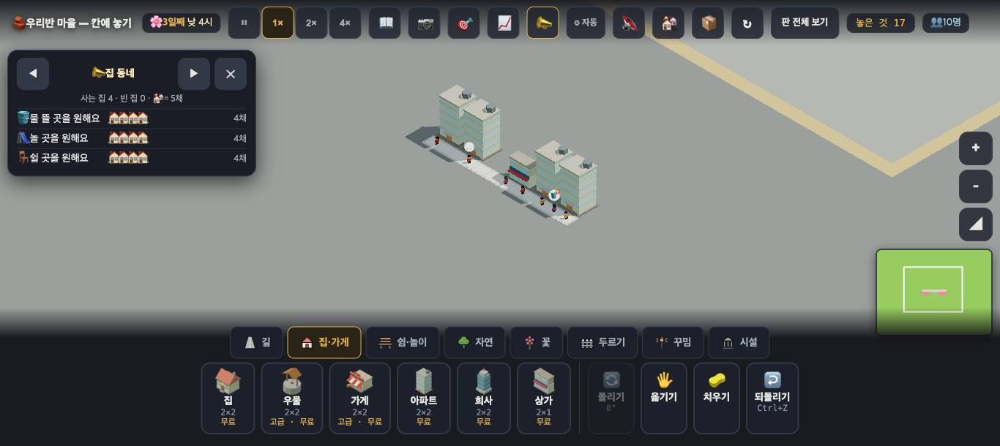

# 창조자의 눈 — 관찰 기록 22회: 바닷가·산지의 첫인상 · 도시 판 '모자라다' 기준선 (2026-09-23)

> 보스 요청: ① **새 테마 둘(`sea` · `mountain`)의 첫인상** — 바닷가가 **어촌**으로, 산지가 **산지촌**으로 읽히는가, 아니면 그냥 **"색이 다른 마을"** 인가(교과 4-2 '다양한 환경과 삶의 모습'). ② **시설 수용량이 들어오기 전 `city` 기준선** — 상가 하나 + 아파트 넷에서 **"모자라다"를 아이가 어디서든 알 수 있는가.**
> 본 판: 체험판(main `5751399`) · `?sid=guest&stage=sea|mountain|city` · 1366×610 · **코드 수정 0**. 저장키 `rpg.village.guest.<판>` · 원격 `false`.
> 판 파일은 **먼저 읽지 않았습니다**(19회처럼 첫 화면부터). 뒤에 `__stage()`·`__try()` 로만 확인했습니다.
> 보는 사이 main 에 **#809(미니맵 바탕)** 가 들어와, 미니맵·판 전체 보기만 **새 main `64f1c00`** 에서 한 번 더 봤습니다(3절).
> **사실 / 해석 / 가설**을 나누고 고칠 것은 **ⓐ / ⓑ / ⓒ**.

## 한 줄
**둘 다 지금은 "색이 다른 마을"입니다. 바닷가 판에는 바다가 한 칸도 없고(부두가 모래 위에 놓이고, 판 한가운데에도 놓입니다), 산지 판에는 산이 없습니다(땅이 평평합니다). 고기잡이·산일 같은 '삶의 모습'은 화면에 없습니다. 도시 판에서는 "모자라다"가 어디에도 없다는 것을 확인했습니다 — 오히려 아파트 네 채 카드가 모두 "장 볼 곳"을 **괜찮다고** 말합니다.**

---

## 1. 바닷가 판 `sea` — 어촌으로 읽히는가

**사실 — 첫 카드**: "바닷가 마을 — 모래와 등대 / 🔎 바닷가에 사는 사람들은 어디에 무엇이 있어야 할까요? / 🎯 등대 하나 · 부두 2곳 · 모래언덕 4곳 · 주민 20명 / 4-2 · 다양한 환경과 삶의 모습". 카드 가운데 가장 큰 칸은 **빈 사진틀(📷)** 입니다.

**사실 — 첫 30초**: [시작] 뒤 아무것도 안 누르고 30초 — **새 말 0개.** 화면에는 모래빛 땅과 길 12칸뿐입니다.
**사실 — 물이 없습니다**: 판 어디에도 **바다·물 칸이 없습니다.** 가까이 보기에서도, 판 전체 보기에서도 땅은 한 가지 모래빛입니다.
**사실 — 바다 물건은 셋**, 세 탭에 흩어져 있습니다: `부두`(길 탭 · 2×2) · `등대`(자연 탭) · `모래언덕`(꾸밈 탭). `두르기`·`시설` 탭은 비어 있습니다.
**사실 — 놓아 봤습니다**(진짜 마우스): 부두 둘은 길 양 끝에, 등대 하나, 모래언덕 넷, 집 셋.

| 물건 | 그림 | 눌렀을 때 | 놓을 자리 규칙(`__try` · 길에서 먼 빈칸) |
|---|---|---|---|
| 부두 | 나무 널빤지 바닥 — **모래 위에** 놓임 | "아래에서 놓을 물건을 먼저 고르세요"(카드 없음) | **아무 데나 됨** |
| 등대 | 빨강·하양 줄무늬 탑 — **등대로 읽힘** | 카드 없음 | 아무 데나 됨 |
| 모래언덕 | 납작한 모래 덩이 | 카드 없음 | 아무 데나 됨 |
| 집 | 보통 집 | "😟 물 뜰 곳·장 볼 곳·놀 곳·쉴 곳이 멀어요 …"(다른 판과 같은 말) | — |

**사실 — 목표**: 등대·부두·모래언덕 세 목표는 **놓는 순간 다 '이룬 것'** 이 됩니다(`__stage().목표` 셋 true). 어디에 놓았는지는 따지지 않습니다.
**사실 — 등대에 사는 사람은 없고**(`__house` "집 없음"), 부두·등대가 마을 사람들에게 무엇을 해 주는지 보여 주는 말은 **못 찾았습니다.**

**해석 — 보스 물음에 대한 답: "색이 다른 마을"입니다.**
- 🟢 등대 하나만은 **그 자체로 '바닷가'** 라고 말합니다.
- 🔴 **바다가 없으니** 부두가 **길 끝의 나무 바닥**으로 보입니다. 부두는 '물과 땅이 만나는 곳'이어야 뜻이 있는데, 판 한가운데에도 놓입니다.
- 🔴 4-2 는 **환경 + 삶의 모습**인데, 이 판에는 **환경(모래빛)만** 있습니다. 배·그물·고기 말리기·수산물 가게 같은 **'바닷가 사람은 무엇을 하며 사나'** 가 화면에 없습니다.
- 🟡 카드 물음 "어디에 무엇이 있어야 할까요?" 의 **'어디에'** 를 판이 따지지 않습니다(19회 ⓐ2 와 같은 종류 — 틀린 자리에도 목표 달성).

**가설** — 아이는 등대를 보고 "바닷가구나"까지는 갈 것입니다. 그러나 "바닷가 마을은 이렇게 산다"로는 못 갑니다. 바다가 없는 바닷가를 **이상하다고 말하는 아이**도 있을 것입니다. **확인은 실제 아이에게.**

## 2. 산지 판 `mountain` — 산지촌으로 읽히는가

**사실 — 첫 카드**: "산지 마을 — 너럭바위와 전나무 / 🔎 산이 많은 곳에 사는 사람들은 어디에 무엇이 있어야 할까요? / 🎯 산장 둘 · 전나무 6그루 · 너럭바위 3곳 · 주민 20명 / 4-2". 가운데는 역시 **빈 사진틀(📷)** 입니다.
**사실 — 첫 30초**: 새 말 **0개.** 회갈색 땅과 길 12칸.
**사실 — 산이 없습니다**: 땅은 **평평합니다.** 높낮이·비탈·골짜기가 없습니다.
**사실 — 산 물건**: `산장`(집·가게 탭 · 2×2) · `전나무`·`바위`·`큰나무`(자연 탭) · `너럭바위`(꾸밈 탭 · 2×2). `두르기`·`시설` 탭은 비어 있습니다.
**사실 — 놓아 봤습니다**: 산장 둘(139,142 · 146,142) · 전나무 여섯(길 아래 한 줄) · 너럭바위 셋 · 집 하나.

| 물건 | 그림 | 눌렀을 때 | 놓을 자리 규칙 |
|---|---|---|---|
| 산장 | 짙은 빨간 지붕의 나무집 | **카드 없음** · `__house` "집 없음"(**아무도 안 삶**) | **길에 붙어야 함**("산장은 길에 붙어야 해요") |
| 전나무 | 짙은 초록 뾰족 나무 — **전나무로 읽힘** | 카드 없음 | 아무 데나 됨 |
| 너럭바위 | 넓적한 회색 바위 | 카드 없음 | 아무 데나 됨 |

**사실 — 목표**: 산장·전나무·너럭바위 세 목표가 **놓는 순간 다 '이룬 것'.** 바닷가와 같습니다.

**해석 — 답: 이것도 "색이 다른 마을"에 가깝습니다.**
- 🟢 전나무 여섯 줄은 **"추운 높은 곳"** 느낌을 줍니다. 바닷가 판보다 그림으로는 조금 더 읽힙니다.
- 🔴 **산이 없는 산지**입니다. "산이 많은 곳"이라는 물음이 화면과 맞지 않습니다.
- 🔴 **산장에 아무도 안 삽니다.** 산지'촌'의 집이 아니라 **구경 온 사람이 묵는 집**처럼 보입니다 — 4-2 의 산지촌(밭농사·나무 하기·약초 같은 삶)과는 다른 그림입니다.
- 🟡 산장만 '길에 붙어야' 하고 나머지는 아무 데나 — **'어디에'를 따지는 것은 산장 하나**입니다.

**가설** — 아이가 "산에 사는 사람들은 산장에 산다"로 **잘못 잇는** 일이 생길 수 있습니다(산장은 비어 있는데도). **확인은 실제 아이에게.**

## 3. 말↔그림 어긋남 — 미니맵과 판 전체 보기 (#809 앞뒤)

**사실 — 옛 main(`5751399`)** : 두 판 다 **미니맵이 풀빛**, 판 전체 보기도 **판이 풀빛**이었습니다(가까이 보기의 모래빛·회갈색과 다름).
**사실 — 새 main(`64f1c00` · #809 뒤)** :

| | 바닷가 | 산지 |
|---|---|---|
| 미니맵 | **모래빛** ✅ | **올리브빛**(누런 초록) |
| 판 전체 보기 | **모래빛** ✅ | **올리브빛** |
| 가까이 보기(내 땅 밖) | 모래빛 | **올리브빛** |

**해석** — 바닷가는 **닫혔습니다.** 산지는 #809 제목이 "돌빛"인데 **제 눈에는 풀빛 쪽으로 보입니다.** 내 땅 안(회갈색)과 밖(올리브)의 빛도 다릅니다. **뜻한 색인지**는 보스가 판단할 일이라 사실만 남깁니다.

---

## 4. 도시 판 `city` 기준선 — "모자라다"가 어디에 있는가 → **어디에도 없습니다**

### 4-1. 놓은 순서 (다음 회에 그대로 되밟기용)

1. 브라우저 저장소에서 `rpg.village.guest.city` 를 지우고 `?sid=guest&stage=city` 를 엶(첫 카드는 이미 본 판이라 안 뜸). 시작 상태: 길 12칸(`road@138~149,144`) · 인구 0 · `__flow().켜짐 false`.
2. `집·가게` 탭 → **상가** 카드 → **(144,143)** 클릭 → "상가는 길에 붙여 놓아요 — 사람이 드나들거든요"
3. **아파트** 카드 → **(138,142) → (140,142) → (146,142) → (148,142)** 순서로 클릭 → 첫 번째 때 "아파트는 길에 붙여 놓아요 …", 넷째 때 "🎯 목표 달성! 아파트 4채"
4. Escape → **4배속 30초** → 4배속 60초 더 → 1배속으로 되돌림(3일째 낮)

결과: `store@144,143` · `house@138,142 / 140,142 / 146,142 / 148,142`(모두 **정원 8**) · 인구 **10**.

### 4-2. 흘려보내는 동안 뜬 말 (4배속 90초 · 0.5초마다 화면 글 전부 기록)
"누가 이사 왔어요!"(두 번) · "🔓 분수·정자 이 열렸어요! (인구 10명)" · "🔓 땅을 하나 더 가질 수 있어요!" · "🔓 땅이 넓어졌어요!" — **이것이 전부**입니다.
**"모자라"·"돌아"·"장 볼"이 들어간 말: 0개.** 가게에서 사람이 돌아서는 장면(돌아섬)도 **이 판에서는 흐름이 꺼져 있어** 없습니다(`__flow()` 세대 {받음 0, 못받음 0}).

### 4-3. 눌러 본 순서와 나온 말

| # | 누른 곳 | 나온 말 |
|---|---|---|
| 1 | 상가 (144,143) | "상가 · 장 볼 곳 · 파란 길까지 닿아요 · 노란 집 4채 **(16세대)** · 일자리 2/2" |
| 2 | 아파트 (138,142) | "1층 · 🏠 ○○·○○·○○ · 😟 4세대 · 물 뜰 곳·놀 곳·쉴 곳이 멀어요 · 거리가 좀 삭막해요" |
| 3 | 아파트 (140,142) | 같은 말(주민 2) |
| 4 | 아파트 (146,142) | 같은 말(주민 3) |
| 5 | 아파트 (148,142) | 같은 말(주민 2) |
| 6 | 상가 오른칸 (145,143) | 1과 같음 |
| 7 | 길 (142,144) | "아래에서 놓을 물건을 먼저 고르세요" |
| 8 | 📈 마을 흐름 | 인구 10 에서 **평평** · 😊 집 비율 0 · 일자리 채움 100% |
| 9 | 📣 동네 바람 | "사는 집 4 · 빈 집 0" · 물 뜰 곳 4채 · 놀 곳 4채 · 쉴 곳 4채 — **장 볼 곳 줄 없음** |

**사실** — 아파트 네 채의 카드 **모두에서 "장 볼 곳"이 빠졌습니다.** 16세대가 상가 하나(일자리 2)를 쓰는데, 집 쪽 말은 **"장 볼 곳은 괜찮다"** 입니다. 📣 도 같습니다.
**사실** — 상가 카드는 **"16세대"라는 원인 숫자만** 말하고, "모자라요"·"붐벼요"·"줄 서요" 같은 **결과 말은 없습니다.**
**사실** — 인구는 **정원 32(8×4) 중 10에서 이틀 넘게 멈췄습니다.** 📈 에 평평한 선으로 보입니다. 다만 화면이 그 까닭으로 가리키는 것은 **물 뜰 곳·놀 곳·쉴 곳**이지 상가가 아닙니다.

**해석** — 보스가 예상한 대로 **"모자라다"는 없습니다.** 여기에 하나를 더합니다: **없는 것에서 그치지 않고, 화면은 반대로 말합니다** — 집 카드 넷과 📣 가 모두 "장은 볼 수 있다"고 합니다. 시설 수용량이 들어오면 **이 네 카드와 📣 의 '장 볼 곳' 줄이 바뀌는지**가 가장 쉬운 비교 자리입니다.
**가설** — 아이는 지금 판에서 "상가 하나면 아파트 넷도 된다"고 **배워 버릴 수 있습니다.** 인구가 10에서 멈춘 것을 보고도 물·놀이·쉴 곳 쪽으로 갈 것입니다. **확인은 실제 아이에게** — 다만 **'모자라다'가 화면 어디에도 없다는 것은 지금 확인된 사실**입니다.

---

# ⓐ 하던 일을 멈추고 고칠 것
없음. (두 테마는 **내용이 비어 있는 것**이지 값이 깨지는 것이 아닙니다.)

# ⓑ 이번 묶음 안에서 고칠 것
- **ⓑ28.** **바닷가 판에 바다가 없습니다.** 부두가 모래 위, 판 한가운데에도 놓입니다. 물 칸 한 줄(판 가장자리)과 "부두는 물가에" 규칙이 있어야 부두가 부두로 읽힙니다.
- **ⓑ29.** **산지 판에 산이 없습니다**(평평한 땅). 높은 칸이나 비탈이 한 군데라도 있어야 물음 "산이 많은 곳"과 화면이 맞습니다.
- **ⓑ30.** 두 판 다 **'삶의 모습'(생업)이 없습니다** — 4-2 가 묻는 것은 환경과 **그곳 사람이 무엇을 하며 사는가**인데, 지금은 환경만 있습니다(배·그물·수산물 가게 / 밭·나무 하기 등).
- **ⓑ31.** **새 물건(부두·등대·모래언덕·산장·전나무·너럭바위)을 눌러도 카드가 없습니다.** 무엇에 쓰는지 한 줄이 없어, 아이는 그냥 장식으로 읽습니다. 산장은 **아무도 안 산다**는 것도 알 길이 없습니다.
- **ⓑ32.** **목표 셋이 '놓으면 끝'** 입니다. 물음은 "**어디에** 무엇이"인데 자리를 따지는 것은 산장(길에 붙기) 하나뿐입니다(19회 ⓐ2 와 같은 종류).
- **ⓑ33.** 첫 카드 가운데 가장 큰 칸이 **빈 사진틀(📷)** 입니다(두 판 다). 19회 town3 는 작은 지도 그림이 있었습니다.
- **ⓑ34.** 산지 판의 **미니맵·판 전체 보기가 올리브빛**(#809 뒤) — 풀빛으로 읽힐 수 있습니다. 뜻한 색인지 확인만 부탁드립니다.
- **ⓑ35.** (city) **상가 하나에 16세대인데 집 카드 넷과 📣 가 "장 볼 곳은 괜찮다"고 말합니다** — 모자람이 없을 뿐 아니라 반대로 말합니다. 시설 수용량 PR 의 비교 기준으로 4절 순서를 그대로 쓰시면 됩니다.

# ⓒ 적어 두고 실제 아이에게 확인할 것
- **ⓒ39.** 바다 없는 바닷가를 아이가 **바닷가로 받아들이는지**, 이상하다고 말하는지.
- **ⓒ40.** 아이가 **산장을 '산에 사는 사람의 집'으로 읽는지**(실제로는 아무도 안 삽니다).
- **ⓒ41.** 등대·전나무 **하나의 그림**만으로 "바닷가/산"이 읽히는지 — 가장 싸게 테마를 전하는 물건이 무엇인지.
- **ⓒ42.** 📣 의 "🏘️ = 5채" 표시를 아이가 어떻게 읽는지(4채인데 집 그림도 넷이라 헷갈릴 수 있음 — 저도 한 번에 못 읽었습니다).
- **ⓒ43.** (city) 인구가 10에서 멈춘 것을 아이가 **알아채는지**, 알아챈다면 무엇 때문이라고 생각하는지.

## 미검증
제가 본 것은 **조작과 표시 경로 · 훅 값**까지입니다. 아이가 이 두 판을 어촌·산지촌으로 읽는지, 도시 판에서 '모자라다'를 느끼는지는 **실제 학생에게 확인할 일**입니다.
- 두 테마 판은 **옛 main(`5751399`)** 에서 봤고, 미니맵·판 전체 보기만 새 main(`64f1c00`)에서 다시 봤습니다. #809 가 테마 판의 다른 곳을 바꿨는지는 안 봤습니다.
- `__try` 로 본 '아무 데나 됨'은 **길에서 먼 빈칸 한 곳(131,150)** 에서 잰 것입니다.
- city 인구가 10에서 멈춘 **까닭은 재지 않았습니다**(행복·땅 넓히기 등 무엇 때문인지 모릅니다).
