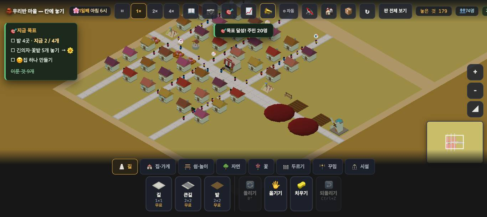
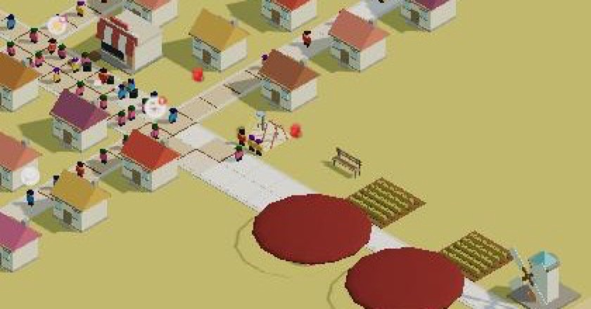
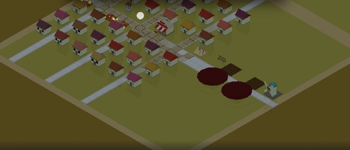

# 창조자의 눈 — 관찰 기록 23회: `mid36` — 붐빔 말 · 짐 나르는 사람 (2026-09-23)

> 보스 요청: ① **18회 ②를 마저** — 붐빔 말이 **어느 길을 짚는지 · 한 수가 떠오르는지 · 겹쳐 들리지 않는지**. ② **짐 나르는 사람이 사흘 동안 짐을 못 내려놓는 모습**이 아이 눈에 "고장 났나"로 보이는지, "길이 좁구나"로 보이는지.
> 본 판: 체험판(main `98bfb47`) · `?sid=guest&stage=farm` 에 `village/stages/boards/mid36.json` 을 가져옴(`__importText` → 다시 열기) · 1366×610 · **코드 수정 0**. 저장키 `rpg.village.guest.farm` · 원격 `false`.
> 판: 물건 179 · 집 36(아파트 3, 그중 하나는 빈 채) · 인구 74 · 밭 2 · 헛간 2 · 가게 1.
> **사실 / 해석 / 가설**을 나누고 고칠 것은 **ⓐ / ⓑ / ⓒ**.
> ⚠ 이 판은 무거워서 창이 **두 번 저절로 닫혔습니다**(about:blank). 그때마다 다시 열었습니다 — 저장은 남아 있었습니다. 그래서 짐 나르기 수는 **두 토막(가, 나)** 으로 나눠 적습니다.

## 한 줄
**가게는 날마다 차는데, 짐을 지고 가게까지 간 사람은 5일 반 동안 한 명도 없었습니다. 곡식은 빨간 공으로 저절로 날아갑니다. 그래서 아이 눈에는 "고장"도 "길이 좁구나"도 아닌 "아무 일도 없다"에 가깝습니다. 붐빔 말은 26채가 모두 같은 한 칸을 짚고, 18채는 "큰길로 넓혀 봐요"라는 한 수까지 말합니다. 그런데 짚어 준 그 칸은 큰길이 안 놓이는 칸입니다.**

---

## 1. 짐 나르는 사람 — 아이 눈에 어떻게 보이는가

### 1-1. 수 (사실)

| 토막 | 본 동안(판 속 시간) | 짐 지고 나섬 | **내려놓음** | 도중에 그만둠 | 같은 동안 곡식(흐름) |
|---|---|---|---|---|---|
| 가 | 1일째 6시 → 4일째 밤(약 3일 반) | 3 | **1** | 밤 5 · 막힘 2 | 만듦 20 · 보냄 20 · **닿음 20** |
| 나 | 4일째 8시 → 9일째 밤 7시(약 5일 반) | 3 | **0** | 밤 6 · 막힘 5 | 만듦 30 · 보냄 30 · **닿음 30** |

(수는 `__flowAct()`·`__flow()`. 창이 닫혔다 열리면 0부터 다시 셉니다.)

- **사실** — 토막 나에서 짐을 진 사람은 **오후 3시 반쯤** 나섰습니다. 저녁 8시 반과 밤 10시에도 **아직 지고 있었고**, 결국 **밤에 그만두었습니다**(`중단.밤` +1). 두 번 따라가 봤는데 두 번 다 그랬습니다.
- **사실** — 밭으로 짐을 가지러 가던 사람은 여러 번 **싣기도 전에 `막힘`으로 그만두었습니다**(나섬 수는 그대로).
- **사실** — 그 사이 **가게는 날마다 찼습니다**. 흐름은 **보낸 것 30 중 30을** 가게에 닿게 했습니다. 가게 상태는 하루에 두 번쯤 empty → stocked 로 바뀝니다.

### 1-2. 그림 (사실)

- 밭이 거둘 때(`moving`)가 되면 **빨간 공 두 개**가 밭에서 가게 쪽으로 **저절로 떠 갑니다**(`__flowLook().그린것.짐 = 2`). 공 곁에 사람은 없습니다. 제가 본 두 장면에서는 공이 **길이 아닌 풀밭 위에도** 있었습니다(비스듬한 시점 때문일 수 있어 단정하지는 않습니다).

- **짐 진 사람을 저는 화면에서 가려내지 못했습니다.** 판에 74명이 있고, 가게 앞 골목은 늘 빽빽합니다. `+` 로 세 번 당겨 1366×610 화면에서 5초마다 찍었는데도, 자루를 진 사람과 그냥 걷는 사람이 **제 눈에는 같아 보였습니다**. 사람을 가려내 보여 주는 훅이 없어 위치로 확인하지는 못했습니다.
- 짐을 내려놓을 때 가게 앞에 반짝임이 뜨게 되어 있는데, 토막 나에서는 **한 번도 뜨지 않았습니다**(내려놓음 0).

### 1-3. 해석 — 보스 물음에 대한 답
- **"고장 났나"로는 안 보일 것 같습니다.** 가게는 차고, 사람들은 장을 봅니다(받아감 25).
- **"길이 좁구나"로도 안 보일 것 같습니다.** 짐 진 사람이 **보이지 않고**, 그만두는 순간(밤에 조용히 손을 놓음)에도 **말도 표시도 없습니다.**
- 아이가 볼 수 있는 것은 **빨간 공이 저절로 가는 것**입니다. 그러니 "곡식은 혼자 날아간다"가 이 판의 그림입니다. 짐 나르는 사람이 못 가는 것은 **값(훅)에만 있고 화면에는 없습니다.**
- 그래서 좁은 골목 탓에 못 간다는 인과는 **지금 아이가 볼 수 없습니다.** 나르는 사람이 없어도 결과(가게 참)가 같기 때문입니다.

**가설** — 짐 진 사람이 **모자·자루 색처럼 한눈에 다르게** 보이고, 막혀서 그만둘 때 **그 자리에서 멈칫하는 모습 + 한 줄 말**("골목이 좁아 못 지나가요")이 있으면 "길이 좁구나"로 읽힐 것입니다. 다만 **빨간 공이 그대로 가게를 채우는 한** 사람이 막혀도 결과는 같아서, 아이가 "그래서 뭐?"로 넘길 수 있습니다. **확인은 실제 아이에게.**

---

## 2. 붐빔 말 (18회 ② 마저)

### 2-1. 어느 길을 짚는가 — **26채가 모두 같은 한 칸**

- **사실** — 붐빔 토막은 **하나**입니다(61칸 · 짚는 칸 **(137,143)**). 집 36채 중 **26채**가 "길이 붐벼요"라고 말하고, **26채 모두 그 한 토막**에 속합니다(`__crowdSeg(x,y).토막 = 0`).
- **사실** — 서로 멀리 떨어진 집 다섯((129,136) · (138,145) · (144,148) · (141,151) · (135,133))을 **진짜로 눌렀더니**, 다섯 번 다 `가장붐빈칸 (137,143)` 을 짚었습니다. 화면에는 그 칸에 **작은 흰 점**이 뜹니다. 카메라는 움직이지 않습니다(`__where().카메라 0`).

- **사실** — `__crowdSay().가장붐빔` 은 **다른 다섯 칸**((136,140) · (139,140) · (137,136) · (131,139) · (137,139))을 가리킵니다. 그중 (139,140)은 **집 칸**입니다(`__try` "여기엔 이미 집이 있어요"). 집 카드가 짚는 칸과 이 목록이 **같은 것을 가리키는지는 모르겠습니다.**
- **해석** — 18회 ⓑ17("토막 하나가 판의 절반을 먹어 모두 한 칸을 짚는다")이 **이 판에서는 더 뚜렷합니다.** 토막이 하나뿐이라 **판 끝의 집도 가게 곁 골목**을 짚습니다.

### 2-2. 한 수가 떠오르는가 — **말은 한 수를 주는데, 짚은 칸에서는 막힙니다**

- **사실** — 붐빔을 말하는 26채 가운데 **18채**가 한 수까지 말합니다: "🛣️ 곁이 빈 길을 큰길로 넓혀 봐요 — 길 위에 큰길을 놓으면 돼요". 18회(pop88)에서는 **0채**였습니다. ✅
- **사실** — 나머지 **8채**에는 🛣️ 가 없습니다. 이 8채는 "길이 붐벼요"가 **다른 걱정(물·놀 곳·쉴 곳) 뒤에** 오거나, 줄 **맨 끝**에 붙어 있습니다.
- **사실 — 아이처럼 따라 해 봤습니다**(진짜 클릭):
  1. 흰 점이 짚은 **(137,143)** 에 큰길 → **안 놓임**: "큰길은 두 칸 폭이에요 — 곁에 물러날 자리가 없어요 · 🖐 로 집을 옮기거나 집 뒤쪽에 길을 한 줄 더 내 봐요"
  2. 바로 옆 **(136,143)** 에 큰길 → **놓임**(말 없음)
  3. 2배속으로 1.5일쯤 흘림 → 붐빔을 말하는 집 **26 → 26** · 🛣️ 권유 **18 → 18**. 토막은 61칸 → **65칸**, 짚는 칸은 **(135,143)** 으로 한 칸 옮겨 갔습니다. 붐빈 정도(`m`)는 9.83 → 6.83 으로 내려갔지만 **화면의 말은 같습니다.**
  4. 새로 짚은 (135,143)도 **큰길이 안 놓이는 칸**입니다("… 꽃밭이 붙어 있어요 — 🖐 로 한 칸 옮기면 자리").
- **사실 — 판 전체 길 130칸에 큰길을 놓아 보면(`__try`)**: **바로 되는 칸 43** · "집이 한 칸 물러나요 — 두 번 눌러"로 되는 칸 **61** · **안 되는 칸 25** · 내 땅이 아닌 칸 1. **흰 점이 짚은 두 칸은 모두 '안 되는 25칸'** 에 들어 있었습니다.

**해석** — 18회에서 없던 **한 수는 이제 말에 있습니다.** 그런데 **"어디에"를 짚는 점**이 한 수가 **안 되는 자리**를 가리킵니다 — 가장 붐빈 칸이 곧 가장 빽빽한(곁이 막힌) 칸이기 때문일 것입니다. 거절 말이 대안("🖐 로 집을 옮기거나 한 줄 더")을 주는 것은 좋습니다. 다만 아이는 **짚어 준 곳에 놓았다가 거절당하는 것**부터 겪습니다.
**해석** — 한 칸 옆에 놓는 데 성공해도 **말이 하나도 안 바뀌어**, "내 한 수가 먹혔다"를 볼 길이 없습니다(훅의 `m` 만 내려갑니다).
**가설** — 흰 점이 **"곁이 빈" 가장 붐빈 칸**을 짚으면 말과 점이 한 몸이 될 것입니다. 그리고 넓힌 뒤 그 토막의 집 몇 채라도 말이 바뀌어야 한 수의 값이 보일 것입니다. **확인은 실제 아이에게.**

### 2-3. 뜻밖에 바뀐 자리 — **큰길 하나로 네 집에 '쉴 곳'이 생겼습니다**

- **사실** — (136,143)에 큰길을 놓은 날 "🎉 ○○네가 기뻐해요 — **쉴 곳이 생겼어요**"가 떴습니다. 그 전까지 "물 뜰 곳·**쉴 곳이** 멀어요"라던 네 집((141,133) · (144,133) · (141,151) · (144,151))이 "물 뜰 곳이 멀어요"로 바뀌었습니다.
- **사실** — **Ctrl+Z 로 큰길을 되돌리니** 네 집 모두 다시 "물 뜰 곳·**쉴 곳이** 멀어요"가 되었습니다(물건 수 179로 돌아감). **큰길이 원인인 것은 확인됐습니다.**
- **해석** — 큰길 안에 쉴 자리(의자·가로수)가 들어 있게 만든 것이라면 뜻한 것입니다. 그렇지 않다면 **길을 넓혔는데 '쉴 곳이 생겼다'는 말**이 아이에게는 엉뚱하게 들립니다. **뜻한 것인지만 확인 부탁드립니다.** 까닭은 코드에서 찾지 않았습니다.

### 2-4. 겹쳐 들리는가 — **겹치지는 않고, 같은 말이 26번입니다**

- **사실** — 26채가 **같은 한 칸**을 짚고 **거의 같은 말**을 합니다. 서로 다른 칸을 짚어 헷갈리게 하는 일은 **없습니다.**
- **사실** — 오른쪽 위 칩은 "🏠 이웃을 기다리는 집 5" · "💼 자리가 찬 집 22" 둘입니다. **붐빔 칩은 없습니다**(18회 ⓑ18 그대로).
- **해석** — 겹침은 문제가 아닙니다. 다만 **한 곳을 26번 듣는 것**이라, 아이는 아무 집이나 하나만 눌러도 됩니다. 그렇다면 그 한 곳을 **칩 하나로** 모아 주는 편이 낫겠습니다.

## 3. 그 밖에 본 것
- **사실** — **헛간 둘**이 **커다란 검붉은 원판**(납작한 타원)으로 보입니다. 밭·풍차는 알아보겠는데, 헛간은 제 눈에 **헛간으로 안 읽혔습니다**(물웅덩이나 깔개처럼 보였습니다). `__stage().모르는건물` 은 비어 있습니다.
- **사실** — 빈 아파트 (132,148) 카드가 "**😊 4세대 · 다 있어요** · 나무가 많아 좋아요"라고 말합니다(주민 0). 아무도 안 사는 집이 웃고 있습니다.
- **사실** — 이 판을 여는 데 **창이 두 번 닫혔습니다**(두 번 다 4배속·2배속으로 오래 돌리던 중). 제 스크린샷이 겹친 탓일 수 있어 **판의 무게 때문이라고 단정하지는 않습니다.**

---

# ⓐ 하던 일을 멈추고 고칠 것
없음.

# ⓑ 이번 묶음 안에서 고칠 것
- **ⓑ36.** **짐 나르는 사람이 없어도 가게가 찹니다**(보냄 30 = 닿음 30 · 내려놓음 0). 그래서 좁은 골목 때문에 못 간다는 것이 **결과에 안 나타납니다.** 사람이 막히는 것을 보여 주려면, 적어도 **그날 그 몫은 못 닿게** 해야 할 것 같습니다. 판단은 보스께.
- **ⓑ37.** **짐 진 사람이 화면에서 가려지지 않습니다**(제 눈 · 1366×610 · `+` 세 번). 그리고 밤에 그만둘 때 **말도 모습도 없습니다.**
- **ⓑ38.** **흰 점이 한 수가 안 되는 칸을 짚습니다**((137,143), 넓힌 뒤 (135,143) — 둘 다 "곁에 물러날 자리가 없어요"). 말은 "**곁이 빈** 길을 큰길로"라고 하는데 점은 곁이 막힌 칸에 있습니다.
- **ⓑ39.** **한 수를 둬도 말이 안 바뀝니다**(26 → 26 · 18 → 18). 훅의 `m` 만 9.83 → 6.83 으로 내려갑니다.
- **ⓑ40.** 토막이 **하나**라 판 끝의 집도 가게 곁 골목을 짚습니다(18회 ⓑ17 이 더 뚜렷해짐). 붐빔 칩도 여전히 없습니다(ⓑ18).
- **ⓑ41.** **큰길 하나가 네 집에 '쉴 곳'을 줍니다**(되돌리면 사라짐). 뜻한 것인지 확인 부탁드립니다.
- **ⓑ42.** **헛간이 헛간으로 안 보입니다**(검붉은 원판).
- **ⓑ43.** 빈 아파트가 "😊 다 있어요"라고 합니다(주민 0).

# ⓒ 적어 두고 실제 아이에게 확인할 것
- **ⓒ44.** 빨간 공이 저절로 가는 것을 아이가 **"누가 나르지?"라고 묻는지, 그냥 받아들이는지.**
- **ⓒ45.** 흰 점을 보고 아이가 **바로 그 칸에 큰길을 놓으려 하는지**, 그리고 거절 말의 대안(🖐 옮기기 · 한 줄 더)을 따라가는지.
- **ⓒ46.** 같은 붐빔 말을 여러 집에서 듣는 것이 **"아, 한 곳 문제구나"로 모이는지.**
- **ⓒ47.** 🛣️ 권유가 있는 집(18)과 없는 집(8)을 아이가 **다르게 읽는지.**

## 미검증
제가 본 것은 **조작과 표시 경로 · 훅 값**까지입니다. 아이가 '길이 좁아서 못 나른다', '큰길로 넓히면 풀린다'를 잇는지는 **실제 학생에게 확인할 일**입니다.
- 짐 진 사람의 **위치를 훅으로 확인하지 못했습니다** — "가려지지 않는다"는 **제 눈으로 본 것**입니다.
- 짐 나르기 수는 창이 닫혀 **두 토막**으로 잰 것이고, 시드는 하나(이 브라우저)입니다. 시뮬(`run.mjs --stage farm --save mid36 --days 3 --seeds 1-5`)은 붐빔집 26 · 인구 74 로 브라우저와 같았습니다(짐 나르기 수는 그 표에 없습니다).
- 큰길은 **한 곳(136,143)에만** 놓아 봤습니다. '집이 물러나는' 61칸 쪽은 해 보지 않았습니다.
- 지금 브라우저 판에는 큰길을 되돌려 놓은 상태가 남아 있습니다(물건 179 · 가져온 판과 같은 수).
