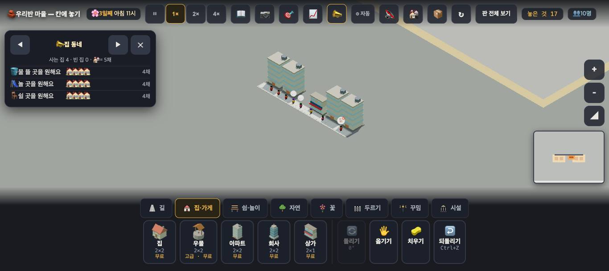
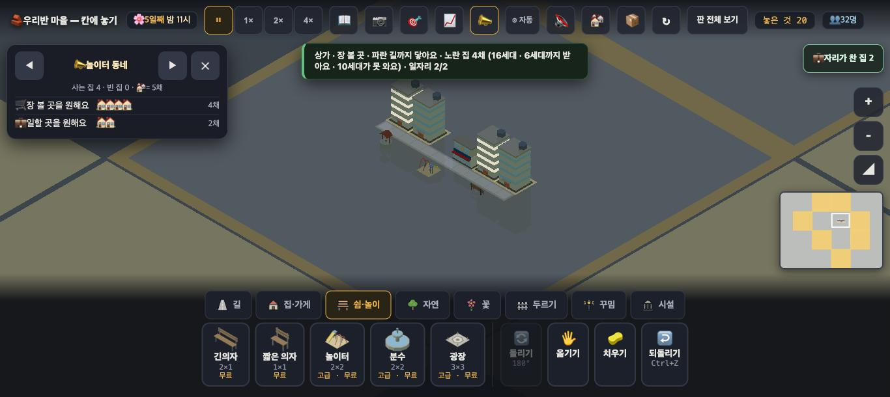
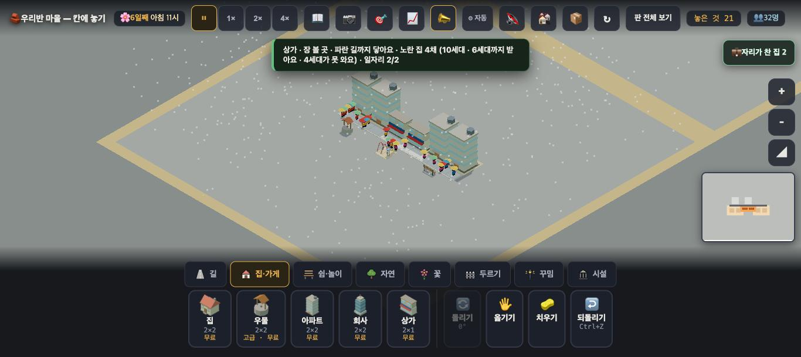
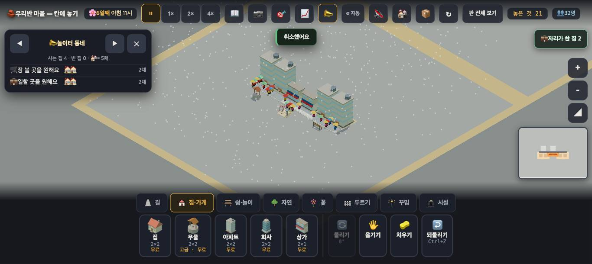

# 창조자의 눈 — 관찰 기록 24회: 수용량 뒤 도시 판 되밟기 · 상가 하나 더 (2026-09-23)

> 보스 요청: **22회 4절 순서를 그대로 되밟아** 수용량(#815 ⑴ · #826 ⑵ · #822 사는 세대) 전·후를 견준다. 그리고 **한 수** — 꽉 찬 아파트 바로 옆에 상가를 하나 더 놓아 **그 옆 아파트가 풀리는지**를 아이 손으로 확인한다.
> 본 판: 체험판(main `2018a24`) · 제 서버 **8795** · `?sid=guest&stage=city` · 1366×610 · **코드 수정 0**. 저장키 `rpg.village.guest.city` · 원격 `false`.
> 창 규칙: 누르기 전마다 `location.href` 를 확인했습니다. 제 것만 쓰려고 **Playwright 안에 새 컨텍스트**를 따로 열었고, 끝난 뒤 about:blank 로 비우고 닫았습니다. 한 번은 공용 창이 중간에 about:blank 로 바뀌어, 새 컨텍스트에서 **처음부터 다시** 했습니다.
> **사실 / 해석 / 가설**을 나누고 고칠 것은 **ⓐ / ⓑ / ⓒ**.

## 한 줄
**22회 순서를 그대로 밟으면 이번에도 "모자라다"는 뜨지 않습니다. 가게가 넘치지 않기 때문입니다 — 인구가 10(사는 세대 6)에서 멈추고, 상가 정원이 마침 6입니다. 대신 상가 카드는 정직해졌습니다(16세대 → "6세대 · 6세대까지 받아요"). 아이처럼 카드가 말하는 우물·놀이터·긴의자를 놓자 인구가 32로 찼고, 그때부터는 상가 카드 · 아파트 카드 넷 · 📣 가 모두 모자람을 말했습니다. 꽉 찬 아파트 옆에 상가를 하나 더 놓자, 바로 옆 아파트 둘이 곧바로 풀렸습니다. ✅**

---

## 1. 22회 순서 그대로 (전·후 비교)

**놓은 순서(22회와 같음)** — 저장 지움 → `?sid=guest&stage=city` → `집·가게` 탭 → 상가 **(144,143)** → 아파트 **(138,142) → (140,142) → (146,142) → (148,142)** → Escape → **4배속 90초**(1일째 아침 6시 → 3일째 아침 6시) → 1배속.
**다른 점 둘** — ① 새 포트라 첫 카드("도시 — 높은 건물과 큰길 …")와 첫 안내가 떴습니다(22회는 이미 본 판이라 안 떴음). [시작]과 [건너뛰기]를 눌렀습니다. ② `집·가게` 탭에 **가게가 없습니다**(#826 에서 city 기본 가게를 뺌). 상가는 그대로 있습니다.

| 본 곳 | 22회 (main `5751399`) | 24회 (main `2018a24`) |
|---|---|---|
| 흘린 90초 동안 뜬 말 | 이사 · 🔓 셋 · 모자람 0 | **같음**(이사 · 🔓 셋 · 모자람 0 · "가게가 꽉 차서" 0) |
| 인구 | 10 | **10** |
| 상가 카드 | "노란 집 4채 **(16세대)** · 일자리 2/2" | "노란 집 4채 **(6세대 · 6세대까지 받아요)** · 일자리 2/2" |
| 아파트 카드 넷 | "😟 4세대 · 물 뜰 곳·놀 곳·쉴 곳이 멀어요 · 거리가 좀 삭막해요" | **같음** — '장 볼 곳' 말 없음 |
| 📣 동네 바람 | 물 4 · 놀 곳 4 · 쉴 곳 4 · **장 볼 곳 줄 없음** | **같음** |
| `__shopCap()` | (없었음) | 사는세대 **6** · 정원 **6** · 앉음 6 · 꽉찬세대 **0** |

그 뒤 **4배속으로 45초 더**(4일째 낮 3시까지) 흘려도 인구 **10** · 새 말 0 이었습니다.

**사실** — 이 순서에서는 **가게가 넘치지 않습니다.** 사는 세대가 6이고 상가 정원이 6이라, 못 앉은 세대가 0입니다. 그래서 '장 볼 곳'은 **정말로 괜찮은 상태**이고, 카드와 📣 가 그렇게 말하는 것은 **이번에는 맞는 말**입니다.
**해석** — 22회에 제가 "16세대가 상가 하나를 쓰는데 장 볼 곳이 괜찮다고 한다"고 적은 것은, 이제 보니 **빈 방까지 센 16**이었던 것으로 보입니다. 그때도 인구가 10으로 같았으니 사는 세대는 6쯤이었을 것입니다(그때는 잴 훅이 없어 확인은 못 합니다). #822 뒤 카드는 **사는 세대(6)** 를 셉니다.
**해석** — 22회 ⓑ35("반대로 말한다")는 **반만 맞았습니다.** 숫자(16)는 부풀었고, 장 볼 곳 말은 맞았습니다. 이번 상가 카드는 **숫자가 사실과 맞게** 바뀌었습니다. ✅
**해석** — 이 순서만으로는 **"모자라다"를 볼 수 없습니다.** 인구가 10에서 멈추는 까닭이 가게가 아니라 **물·놀 곳·쉴 곳**이기 때문입니다(카드가 그렇게 말합니다).

## 2. 아이처럼 한 수 ① — 카드가 말하는 것 채우기

카드가 "물 뜰 곳·놀 곳·쉴 곳이 멀어요"라고 하니, 그대로 놓았습니다(진짜 클릭 · 4일째 낮 5시).
- `집·가게` → 우물 **(139,145)** · `쉼·놀이` → 놀이터 **(143,145)** · 긴의자 **(147,145)** (길 건너 남쪽)
- 4배속 40초 → **5일째 밤 · 인구 32**(아파트 넷 모두 8/8)

**사실 — 이때부터 셋 모두 모자람을 말합니다.**

| 본 곳 | 말 |
|---|---|
| 상가 카드 | "노란 집 4채 **(16세대 · 6세대까지 받아요 · 10세대가 못 와요)** · 일자리 2/2" |
| 아파트 (138,142) | "😐 4세대 · **🛒 가게가 꽉 찼어요 (2세대)** · 거리가 좀 삭막해요" |
| 아파트 (140,142) | "😟 4세대 · **🛒 가게가 꽉 찼어요 (2세대)** · 가까운 일터가 꽉 찼어요 · …" |
| 아파트 (146,142) | "😐 4세대 · **🛒 가게가 꽉 찼어요 (3세대)**" |
| 아파트 (148,142) | "😟 4세대 · **🛒 가게가 꽉 찼어요 (3세대)** · 가까운 일터가 꽉 찼어요" |
| 📣 놀이터 동네 | "**🛒 장 볼 곳을 원해요** 🏠🏠🏠🏠 **4채**" · 💼 일할 곳을 원해요 2채 |
| `__shopCap()` | 사는세대 16 · 정원 6 · 꽉찬세대 **10** · 꽉찬% 62.5 |

**사실** — 아파트 넷의 (2)+(2)+(3)+(3) = **10**, 상가 카드의 "10세대가 못 와요"와 **맞습니다.**
**사실** — 이 사이 **"가게가 꽉 차서 새 이웃이 돌아갔어요"는 한 번도 안 떴습니다.** 아파트가 8/8로 다 차서, 새로 올 자리가 없었기 때문으로 보입니다(`돌아섬판정 0`).
**해석** — 22회 ⓑ27·ⓑ35 가 바라던 **"원인과 결과가 한 카드에"** 가 섰습니다. 아파트 카드는 **몇 세대가 못 받는지**까지 말하고, 📣 에는 줄이 새로 생겼습니다. 아이가 **어디를 눌러도** 모자람을 만납니다. ✅

## 3. 한 수 ② — 꽉 찬 아파트 바로 옆에 상가 하나 더 (본론)

- 5일째 밤 11시 · `집·가게` → 상가 → **(142,143)**: 아파트 (140,142) 바로 오른쪽이고, 그 오른쪽은 첫 상가(144,143)입니다. 길에 붙습니다(`__try` true).
- 놓은 뒤 2배속으로 흘리며 1.5초마다 쟀습니다.

| | 놓기 전 | 놓은 직후(1.5초 안) | 6일째 아침 11시 |
|---|---|---|---|
| (138,142) 새 상가에서 두 칸 | 🛒 꽉 찼어요 **(2세대)** | **"😊 다 있어요"** | 같음 |
| **(140,142) 새 상가 바로 옆** | 🛒 꽉 찼어요 **(2세대)** | **"😐 다 있어요"** | 같음 |
| (146,142) | 🛒 꽉 찼어요 (3세대) | 🛒 꽉 찼어요 **(1세대)** | 같음 |
| (148,142) 가장 멂 | 🛒 꽉 찼어요 (3세대) | 🛒 꽉 찼어요 **(3세대)** | 같음 |
| 상가 둘 앉음 | 6/6 · (새) 0 | 6/6 · 6/6 | 6/6 · 6/6 |
| 꽉찬세대 | 10 | **4** | 4 |
| 📣 장 볼 곳 | 4채 | — | **2채** |

**사실** — **바로 옆 아파트(140)가 곧바로 풀렸습니다.** 그 너머(138)도 풀렸고, 먼 쪽(146)은 3→1, 가장 먼 (148)은 3 그대로입니다. **가까운 집부터** 풀린 것이 카드로 보입니다. 담당이 시뮬로 보인 "옆 아파트가 풀린다"가 **아이 손으로 놓아도 그대로** 나왔습니다. ✅
**사실** — 놓은 순간 뜬 말: "💼 일할 곳 없는 집 2"(칩) · "🎉 ○○네가 기뻐해요 — **장 볼 곳이 생겼어요**". 🎉 는 **한 집 이름**으로 한 번만 떴습니다(풀린 아파트는 둘 · 6세대).
**사실** — 놓기 전·직후 사이에 (140)·(148) 카드의 "가까운 일터가 꽉 찼어요"가 잠깐 **"일할 곳이 없어요"** 로 바뀌었다가, 흘린 뒤 다시 "가까운 일터가 꽉 찼어요"로 돌아왔습니다(일자리를 새로 짜는 사이로 보입니다).
**사실** — 두 상가를 각각 누르면 **둘 다** "노란 집 4채 **(10세대 · 6세대까지 받아요 · 4세대가 못 와요)**"라고 합니다.

**해석** — 이번 회의 본론에 대한 답은 **"예"** 입니다. 한 수를 둔 **그 자리 옆**에서 결과가 **카드 말로** 바뀝니다(꽉 찼어요 → 다 있어요). 📣 도 4채 → 2채로 줄어듭니다. 23회 붐빔(한 수를 둬도 말이 안 바뀜)과 달리, 여기서는 **한 수 → 그 자리 → 말**이 이어집니다.
**해석** — 다만 **두 상가 카드가 같은 숫자**를 말합니다. 아이가 "10세대 + 10세대 = 20세대? 4 + 4 = 8세대가 못 와?"로 더할 수 있습니다. 실제로 못 오는 세대는 **모두 합쳐 4**입니다(아파트 카드 (1)+(3) = 4).
**가설** — 아이는 🎉 한 번과 📣 4→2 로 "상가를 하나 더 놓으니 됐다"까지는 갈 것입니다. **"가까운 집부터"** 는 아파트를 **하나씩 눌러 봐야** 보입니다 — 누르는 아이만 볼 것입니다. **확인은 실제 아이에게.**

---

# ⓐ 하던 일을 멈추고 고칠 것
없음.

# ⓑ 이번 묶음 안에서 고칠 것
- **ⓑ44.** **22회 순서만으로는 모자람을 볼 수 없습니다** — 인구가 10(사는 세대 6 = 상가 정원 6)에서 멈춰 가게가 넘치지 않습니다. 멈추는 까닭은 물·놀 곳·쉴 곳입니다. 전·후 비교의 기준선을 **"우물·놀이터·긴의자까지 놓은 뒤"** 로 옮기면 비교가 섭니다(아래 되밟기 순서). 판 목표·첫 카드가 이 길로 이끄는지는 판단해 주십시오.
- **ⓑ45.** **상가가 둘일 때 두 카드가 같은 숫자**("10세대 · 4세대가 못 와요")를 말합니다. 더하면 틀린 값이 됩니다. "이 상가에 앉은 6세대" 쪽이 이 상가 몫으로 읽힐 것 같습니다.
- **ⓑ46.** 한 수 뒤 🎉 가 **한 집 이름으로 한 번**만 뜹니다(풀린 아파트는 둘). "○○네 외 1곳"처럼 몇 곳이 풀렸는지가 보이면 "가까운 집부터"가 말로 보입니다.
- **ⓑ47.** (작음) 상가를 놓은 직후 잠깐 "가까운 일터가 꽉 찼어요" → "**일할 곳이 없어요**" → 다시 "가까운 일터가 꽉 찼어요". 일할 곳이 **늘었는데** "없어요"가 한 번 스칩니다.
- (알고 있는 것) 빈 아파트 "😊 다 있어요"(23회 ⓑ43)는 이번 판에 빈 아파트가 없어 보지 못했습니다.

# ⓒ 적어 두고 실제 아이에게 확인할 것
- **ⓒ48.** 아이가 상가 카드의 **"6세대까지 받아요 · 10세대가 못 와요"를 원인·결과로 읽는지**, 아니면 숫자 셋으로 읽는지.
- **ⓒ49.** 상가를 하나 더 놓은 뒤 아이가 **아파트를 다시 눌러 보는지**(풀린 곳을 확인하러).
- **ⓒ50.** 상가 둘의 같은 숫자를 아이가 **더하는지.**
- **ⓒ51.** 인구 10에서 멈춘 도시를 보고 아이가 **카드대로 우물·놀이터·긴의자로 가는지**, 아니면 아파트를 더 짓는지.

## 다음 회 되밟기 순서 (새 기준선)
1. 저장 지움 → `?sid=guest&stage=city` → [시작] · [건너뛰기]
2. `집·가게` → 상가 (144,143) → 아파트 (138,142)·(140,142)·(146,142)·(148,142) → Escape → 4배속 90초 → 1배속 → 4배속 45초
3. `집·가게` → 우물 (139,145) · `쉼·놀이` → 놀이터 (143,145) · 긴의자 (147,145) → 4배속 40초 (인구 32 · 꽉찬세대 10)
4. 누르기: 상가 → 아파트 넷 → 📣
5. `집·가게` → 상가 (142,143) → 2배속 → 아파트 넷 → 상가 둘 → 📣

## 미검증
제가 본 것은 **조작과 표시 경로 · 훅 값**까지입니다. 아이가 '가게 하나가 받을 수 있는 수에는 끝이 있다', '가까운 곳에 하나 더 놓으면 가까운 집부터 풀린다'를 잇는지는 **실제 학생에게 확인할 일**입니다.
- 시드는 하나(이 브라우저)입니다. 한 수 ②는 **한 자리(142,143)** 에서만 해 봤습니다.
- "가게가 꽉 차서 새 이웃이 돌아갔어요"는 이번 순서에서 **나올 조건이 안 생겨**(아파트가 다 참) 못 봤습니다.
