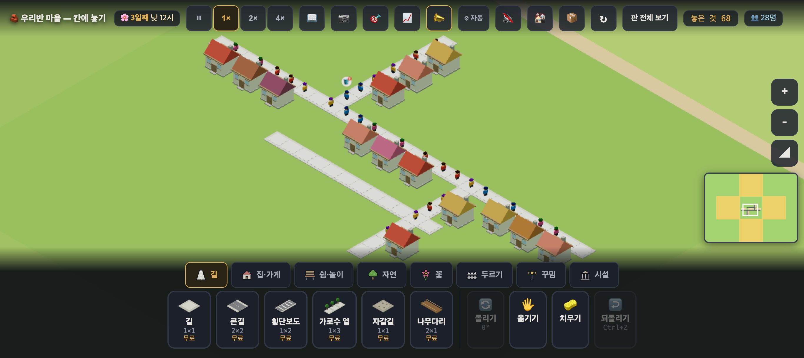
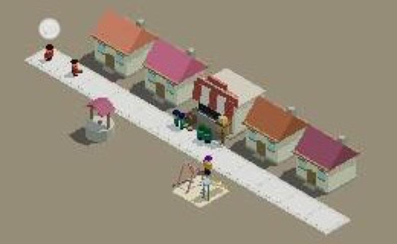
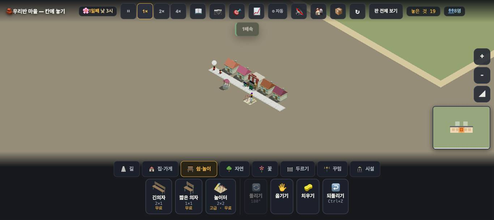
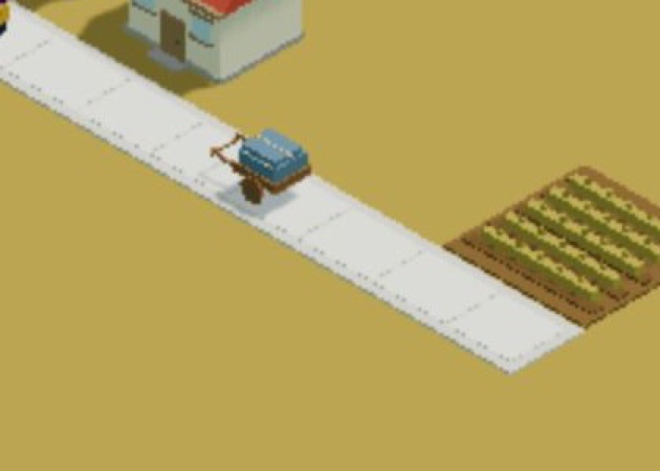

# 창조자의 눈 — 관찰 기록 25회: 어설픔 사냥 (우리 마을 · 첫 사냥)

> 보스 요청: 사용자 말 — *"요즘 게임은 원프롬프트로도 어느 정도 나온다는데 우리 게임은 왜 이러냐. 그런 어설픈 것들을 다 찾아서 고치는 방법을 찾으라."* 마을의 첫 사냥꾼으로 **게임을 처음 켠 아이 눈 + 요즘 게임을 해 본 선생님 눈**으로 '어설프다'를 찾는다. **종류를 이름 붙여 · 몇 개 · 어디 · 사진 · 재는 법**.
> 본 판: 체험판(main `1f80666`) · 제 서버 **8781** · `?sid=guest` 로 **기본 · town3(3학년) · city · farm · sea · mountain** 여섯 · **1366×610**(일부 2배 해상도) · **코드 수정 0**.
> 창 규칙: 판마다 **새 Playwright 컨텍스트**를 열고, 누르기 전에 `location.href` 를 확인하고, 끝나면 about:blank → 닫기. 추가로 컨텍스트에서 **firebase 로 가는 요청을 막았습니다**. 기본 마을은 `__stage().원격 true` 로 나오지만, `sync.js` 에 "sid 가 guest 면 네트워크를 한 번도 쓰지 않는다"고 되어 있고 막힌 요청 수도 **0**이었습니다.
> 움직임은 **움직이는 채로** 쟀습니다: 0.5초마다 사람 상태 표본 24~30개 · 4명 따라가기(0.1초 × 40) · 연속 캡처 3~6장.
> **사실 / 해석 / 가설**을 나누고 고칠 것은 **ⓐ / ⓑ / ⓒ**.

## 한 줄
**손맛(반응 시간)은 이미 요즘 게임 수준입니다 — 놓기·누르기·되돌리기가 전부 0.05~0.11초 안에 화면에 답합니다. 어설픔은 거기가 아니라 셋에 있습니다: ① 말이 서로 부딪칩니다(치우기 한 번에 "집을 치웠어요"와 "여기엔 지울 게 없어요"가 동시에 뜸) ② 기본 거리에서는 그림이 안 읽힙니다(말풍선이 흰 공 · 마을이 우표만 함) ③ 사람들이 '사는' 것이 아니라 '줄 서 있습니다'(한 칸 간격으로 서서 멈춘 줄 · 판에 따라 서로 겹침).**

---

## 1. 종류별 표

| 종류 | 이름(이번에 붙임) | 몇 개 · 어디 | 사진 | 재는 법(→ 탐지기) |
|---|---|---|---|---|
| ⓐ 멈춰 있음 | **줄 세운 인형** — 사람들이 길 위에 한 칸 간격으로 서서 멈춤 | town3: `가장가까운거리` **4.00(정확히 한 칸)** 이 표본 **10/10** · 서 있는 사람 2~8/28 · 따라간 넷 중 둘이 4초 동안 **0 움직임** | `01_town3_line.jpg` | `__folkOverlap().가장가까운거리 === 4.00` 인 표본 비율 + `__folkCheck().상태.idle` 가운데 길 칸 위 수 |
| ⓑ 튐 | (못 찾음) | 4명 × 4초 따라가기(1배속): 0.1초 최대 한 걸음 **0.6** · 튐 **0** | — | `__followFolk(k)` 뒤 `__follow().사람` 을 0.1초마다 · 한 표본 이동 **> 2.0** 이면 튐 |
| ⓑ 미끄러짐 | **혼자 가는 짐** — 곡식이 빨간 공으로 떠 감(23회) | farm·mid36 | 23회 `02_red_balls.jpg` | `__flowLook().그린것.짐 > 0` 인데 `__flowAct().지고감 === 0` 인 프레임 |
| ⓒ 겹침 | **포개진 사람** — 두 사람이 한 자리에 | 겹친쌍 > 0 인 표본: city **8/30** · mountain **6/30** · farm **5/30** · sea **3/24** · town3 0/30 · 기본 0/24 | (정지 사진으로는 안 보임) | `__folkOverlap().겹친쌍 > 0` (거리 < 2.0) 인 프레임 수 |
| ⓒ 뚫림 | **벽 통과** — 걷는 사람이 길 아닌 칸(집 칸) 위 | mountain: "6번이 걷는 중인데 길이 아닌 칸(146,143)" **2/30** 표본 · 같은 배치로 다시 해 봤더니 **0/584** 프레임(재현 안 됨) | — | `__folkCheck().길밖을밟음 > 0` + 그 칸의 `__house(x,y)` |
| ⓓ 크기 위계 | **흰 공 말풍선** — 기본 거리에서 풍선 속 그림이 안 보임 | 판 여섯 모두(기본 줌 · 1366×610). 2배 해상도 + `+` 세 번에서야 🪣 가 보임 | `03_bubble_blank.jpg` ↔ `01`(🪣 보임) | 풍선의 화면 지름(px) — `__state().한칸px` × 풍선 비율 · **24px 미만이면 그림이 안 읽힘**(제안 기준) |
| ⓓ 크기 위계 | **우표 마을** — 새 판을 열면 카메라가 멀어 지은 것이 작음 | 빈 판 넷(city·farm·sea·mountain) · 집 넷+시설을 지어도 화면 폭의 약 **1/5**(약 260px / 1366) | `02_mtn_far.jpg` | 놓인 물건 bbox 의 화면 폭 ÷ 창 폭(`__cellScreen` 으로 모서리 두 칸) · **0.4 미만이면 멂** |
| ⓓ 정렬 | **등 돌린 집** — 문이 길 반대쪽(풀밭)을 봄 | town3 시작 저장본의 여러 집(눈으로 봄 · 수는 안 셈) | `01_town3_line.jpg` | 집마다 문 앞 칸이 길인가 — `__doors` 쪽 훅으로 셀 수 있어 보임(**이번엔 안 씀**) |
| ⓔ 손맛 | (거의 없음 ✅) | 놓기 **101~111ms** · 누르기 **57~61ms** · 되돌리기 **52~56ms** · 치우기 **56~61ms** · 🖐 클릭 **58~61ms** | — | 입력 → `놓은 것` 수 또는 새 토스트까지 ms · **150ms 넘으면 표시** |
| ⓕ 빈 기다림 | **빈 땅 첫 화면** — 새 판은 길 12칸뿐 · 30초 동안 새 말 0 | city·farm·sea·mountain(22회) · 기본 마을도 길 12칸 · 0명 | 22회 사진 | 판을 열고 **아무것도 안 누른 30초** 동안 토스트·사람 수 변화 = 0 |
| ⓖ 말 충돌 | **"치웠어요" + "없어요"** — 한 번 눌렀는데 반대되는 두 말 | 빈 집 치우기: 기본·sea·mountain **3판에서 재현** · 두 말이 **같은 84ms** 에 뜸 | — | 한 클릭 뒤 1초 안에 뜬 토스트 둘이 서로 반대인가(`치웠어요` ∧ `없어요`) |
| ⓖ 규칙 어긋남 | **확인 규칙이 들쭉날쭉** — 빈 놀이터는 "한 번 더 누르면 치워요"라고 묻고, 빈 집은 바로 치움 | mountain·farm·city(놀이터) vs 기본·sea·mountain(빈 집) | — | 물건 종류 × (사는 사람 있음/없음)으로 첫 누름의 결과를 표로 |
| ⓖ 말↔그림 | **이름만 바닷가** — 바다 없는 바닷가 · 산 없는 산지(22회) · 곡식이 혼자 감(23회) | sea · mountain · farm | 22·23회 | (판 검사) 판 이름의 핵심 지형이 판에 한 칸 이상 있는가 |
| ⓗ 튀는 등장 | **배속 토스트** — 속도 단추를 누를 때마다 "1배속" 같은 말이 가운데 위에 뜸 | 모든 판 | `02_mtn_far.jpg` 위쪽 | 누른 단추가 이미 화면에 상태를 보여 주는데 토스트가 또 뜨는가 |
| ⓙ 안 눌림 | **물건을 눌렀는데 "놓을 물건을 고르세요"** — 등대·부두·산장·전나무·바위를 누르면 설명 카드 대신 이 말 | sea·mountain(22회) · 빈 땅도 같은 말 | — | 물건 칸을 누른 뒤 `놓을 물건을 먼저 고르세요` 가 뜬 비율(물건 종류별) |
| 🆕 되돌리기 말 | **말 없는 되돌리기** — 기본 마을에선 Ctrl+Z 가 말 없이 하나를 지움, 다른 판에선 "○○를 도로 치웠어요" | 기본 1 · 다른 판 4 | — | Ctrl+Z 뒤 토스트 유무를 판마다 |

(ⓔ 에서 "집을 눌러도 무반응"이 기본·city·mountain 에서 한 번씩 잡혔습니다. mountain 에서 다시 재 보니 첫 누름에는 카드가 떴고, 두 번째 누름은 **같은 카드가 아직 떠 있어서** 새 줄로 안 잡혔습니다. 처음 잡힌 무반응도 같은 까닭일 수 있어 — 제 재는 법의 한계로 보고 — 표에서 뺐습니다.)

---

## 2. 사실 / 해석 / 가설 — 큰 것 셋만

### ① 말이 서로 부딪친다 (ⓖ)
**사실** — 빈 집을 치우기로 **한 번** 누르면 **같은 순간(84ms)** 에 "집을 치웠어요"와 "**여기엔 지울 게 없어요**"가 둘 다 뜹니다(기본·sea·mountain 셋 다).
**해석** — 한 번 누름이 **두 번 처리**되는 것으로 보입니다(누를 때 지우고, 뗄 때 빈 칸을 또 지우려는 것). 요즘 게임을 해 본 사람에게는 가장 먼저 "대충 만들었다"로 읽히는 종류입니다 — **틀린 말은 아니지만 서로 맞지 않는 말**.
**가설** — 아이는 "지워진 거야, 안 지워진 거야?" 하며 한 번 더 누를 것입니다. 20회 ⓒ32(두 번 누름 규칙)와 겹쳐 더 헷갈립니다.

### ② 기본 거리에서 그림이 안 읽힌다 (ⓓ)
**사실** — 1366×610 기본 줌에서 말풍선은 **그림 없는 흰 공**입니다. 2배 해상도로 `+` 를 세 번 눌러야 🪣 가 보입니다.
**사실** — 빈 판 넷은 카메라가 멀어서, 집 넷과 시설 넷을 지어도 마을이 화면 폭의 약 1/5입니다.
**해석** — 이 엔진의 고리가 **"집이 무엇을 원하는지 → 놓기"** 인데, 원하는 것을 보여 주는 풍선이 기본 거리에서 **안 읽힙니다.** 아이는 집을 **눌러야만** 압니다(19회 ⓒ27 "집을 누르는 아이가 몇이나").
**가설** — "처음 지은 것에 카메라가 다가가 준다"와 "풍선을 최소 크기로 그린다" 둘이면 첫 인상이 크게 달라질 것입니다.

### ③ 사람이 '사는' 게 아니라 '줄 서 있다' (ⓐ · ⓒ)
**사실** — town3 에서 가장 가까운 두 사람의 거리가 표본 **10번 모두 정확히 4.00(한 칸)** 이었습니다. 서 있는 사람은 **길 위에** 서 있고, 따라간 넷 중 둘은 4초 동안 한 걸음도 안 움직였습니다("잠깐 쉬어요"). 사진에서는 길을 따라 **구슬 꿰듯** 한 줄로 보입니다.
**사실** — 사람이 많은 판(city 13명)에서는 거꾸로 **두 사람이 포개지는** 프레임이 30개 중 8개였습니다.
**해석** — 칸을 하나씩 잡는 규칙(`잡은칸`) 덕분에 겹침은 줄었지만, 그 대가로 **간격이 너무 고르게** 보입니다. 요즘 게임의 사람들은 **무리 지어 서고, 서로 보고, 길가에 비켜 섭니다.**
**가설** — 서 있는 사람을 **길 가장자리로 반 칸 비켜 세우고**, 두셋이 **마주 보게** 하는 것만으로도 "사는 마을"로 읽힐 것입니다. **확인은 실제 아이에게** — 다만 간격이 정확히 한 칸이라는 것은 지금 확인된 사실입니다.

---

# ⓐ 하던 일을 멈추고 고칠 것
- **ⓐ4.** **치우기 한 번에 반대되는 두 말**("집을 치웠어요" + "여기엔 지울 게 없어요"). 핵심 조작의 결과와 설명이 **명백히** 부딪칩니다(엔진 정본의 ⓐ 기준).

# ⓑ 이번 묶음 안에서 고칠 것
- **ⓑ48.** **흰 공 말풍선** — 기본 줌에서 풍선 그림이 안 읽힙니다. 최소 화면 크기를 정해 주십시오(탐지기: 풍선 지름 px).
- **ⓑ49.** **우표 마을** — 빈 판을 열면 카메라가 멉니다. 첫 물건을 놓으면(또는 판을 열면) 지을 곳으로 다가가기.
- **ⓑ50.** **물건을 눌렀는데 "놓을 물건을 먼저 고르세요"** — 등대·부두·산장·전나무·바위 같은 물건에 한 줄 카드(무엇인지 · 무엇에 쓰는지)가 없습니다. 빈 땅과 같은 말이라 "안 눌렸다"로 읽힙니다.
- **ⓑ51.** **포개진 사람**(city 8/30 · mountain 6/30 · farm 5/30 · sea 3/24).
- **ⓑ52.** **확인 규칙 들쭉날쭉** — 빈 놀이터는 묻고 빈 집은 안 묻습니다. 하나로 맞추면 ⓐ4 와 함께 치우기 손맛이 정리됩니다.
- **ⓑ53.** **줄 세운 인형** — 한 칸 간격 · 길 위에 서서 멈춤. (위 ③ 가설)

# ⓒ 적어 두고 실제 사용에서 확인할 것
- **ⓒ52.** **벽 통과**(mountain 2/30 · 재현 0/584) — 탐지기를 켜 두고 여러 판에서 더 모아야 합니다.
- **ⓒ53.** **등 돌린 집**(town3) — 수를 세지 않았습니다. 아이가 알아채는지.
- **ⓒ54.** 배속 토스트 · 말 없는 되돌리기(기본 마을) — 작은 것이지만 "대충"으로 읽히는지.
- **ⓒ55.** 놀이터 모형 안에 선 사람 — **노는 모습으로 읽히는지, 박힌 것으로 읽히는지.**

---

## 3. 탐지기로 옮길 줄 (한 곳에 모아)

사냥을 되풀이하려면 위 '재는 법'을 **판 여섯 × 60초** 로 돌리는 스크립트 하나면 됩니다. 이미 있는 훅만으로 됩니다(읽기 전용).

| 탐지기 | 한 줄 | 이번 값(판 여섯) |
|---|---|---|
| 포갬 | 0.5초마다 `__folkOverlap().겹친쌍 > 0` 인 표본 비율 | 0 ~ 27% |
| 줄 세움 | `__folkOverlap().가장가까운거리 === 4.00` 인 표본 비율 | town3 100% |
| 벽 통과 | `__folkCheck().길밖을밟음 > 0` 인 표본 · 그 칸이 집인지 | mountain 2/30 |
| 튐 | `__followFolk(k)` + `__follow().사람` 0.1초 간격 이동 > 2.0 | 0 |
| 갇힘 | `__stuck().갇힌사람 > 0` | 0 (여섯 판 모두) |
| 말 충돌 | 한 입력 뒤 1초 안의 토스트 둘이 반대말인가 | 치우기에서 3/3 |
| 반응 | 입력 → 첫 화면 변화 ms(150 넘으면 표시) | 최대 111ms |
| 우표 마을 | 물건 bbox 화면 폭 ÷ 창 폭 < 0.4 | 빈 판 넷 ≈ 0.2 |
| 흰 공 | 풍선 화면 지름 < 24px | 기본 줌 전부 |
| 빈 30초 | 판을 연 뒤 아무것도 안 누른 30초 동안 새 토스트 수 = 0 | 빈 판 넷 |
| 오류 | `__errors()` 의 `삼킨오류`·`저장멈춤` + 페이지 오류 | 0 (여섯 판 모두) |
| 프레임 | `__gfx().프레임평균ms` · `놓친비율` | 16.0~16.2ms · 0~0.01 |

## 미검증 · 한계
- **움직임 표본은 판마다 24~30개(12~15초)** 입니다. 드물게 일어나는 것(벽 통과)은 더 길게 돌려야 셀 수 있습니다.
- '튐'은 **4명만** 따라갔습니다(town3). 사람이 집에 들어가고 나올 때 **사라지고 나타나는 모습**은 이번에 재지 않았습니다.
- 🖐 옮기기는 **클릭만** 봤습니다(끌기는 21회에 봄). 클릭에는 이제 "제자리에 도로 놓았어요 — 옮기려면 누른 채 끌어 주세요"라고 답합니다(21회 ⓑ25 닫힘 ✅).
- 문 방향·사람 그림의 발 닿음(뜬 발)은 **눈으로만** 봤고, 수로 세지 않았습니다.
- 제가 본 것은 **조작과 표시 경로 · 훅 값 · 제 눈**까지입니다. "어설프다"는 느낌이 아이에게 어떻게 오는지는 **실제 학생에게 확인할 일**입니다.

---

## 덧붙임 — 수레(#827)가 '누가 옮기나'로 읽히는가 (보스 요청 · 머지 뒤 추가)

> 25회 판에도 수레(#827)는 들어 있었지만, 제 farm 에는 밭이 없어 못 봤습니다. 그래서 따로 봤습니다: main `5199ac3` · 제 서버 8782 · `?sid=guest&stage=farm` · 2배 해상도 · 가게 (139,142) · 집 둘 (141,142)(143,142) · 밭 (148,142) · 끝나면 about:blank.

**사실** — 밭이 거둘 때(판 속 오후 3시쯤) 수레 한 대가 밭에서 가게 쪽으로 **길 위를 따라** 갑니다. `__flowCart()`: 길칸 9 · 간것 0.02 → 0.27 → 0.52 → 0.77(판 속 약 30분 간격). 수레가 닿은 뒤 가게는 "곡식 1/8 · 물건이 있어요"입니다.
**사실** — 수레는 **파란 천을 덮은 짐 + 나무 손잡이**입니다. 손잡이 앞에 **끄는 사람이 없습니다**(2배 해상도로 당겨 봤습니다).

**해석** — 23회의 '빨간 공이 풀밭 위를 떠 감'과 견주면 크게 나아졌습니다. **"무엇이 · 어느 길로"** 는 이제 읽힙니다(수레 · 길 위). 그런데 **"누가"** 는 여전히 없습니다 — 손잡이가 빈 수레가 혼자 굴러갑니다. 요즘 게임을 해 본 눈에는 **유령 수레**(표의 ⓐ '살아야 할 게 멈춰 있음'의 짝 — **살아야 할 사람이 빠져 있음**)로 읽힙니다.
**가설** — 아이는 "수레가 곡식을 가져와요"까지는 말할 것입니다. 4-1 '생산 → 운송 → 소비'의 **운송하는 사람(일)** 으로 가려면 손잡이에 사람 하나가 서 있어야 할 것 같습니다. 다만 사람을 붙이면 23회처럼 **사람이 막힐 때 그림이 거짓말을 할 수 있어서**, 보스 결정대로 짐과 같은 시계로 가는 '연기하는 사람'이어야 할 것입니다. **확인은 실제 아이에게.**

- **ⓑ54.** **유령 수레** — 수레 손잡이에 끄는 사람이 없습니다.
  - ① 아이가 즐길 것: 수레를 끄는 이웃을 **따라가 볼 수 있다**.
  - ② 설명할 관계: 물건은 **누군가 옮겨야** 온다(운송도 일이다).
- 탐지기 한 줄: `__flowCart().짐.length > 0` 인 프레임에 수레 둘레 한 칸 안에 걷는 사람이 있는가(지금은 위치 훅이 수레 쪽에만 있음).
