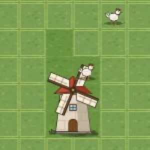
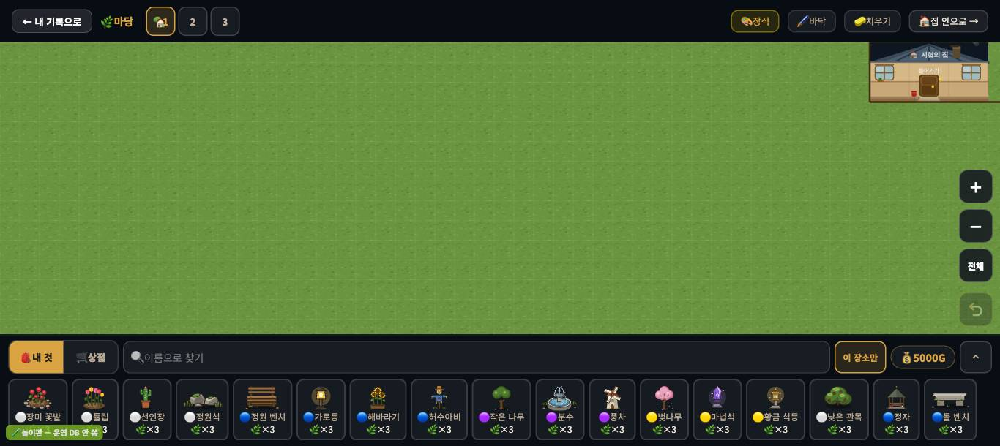
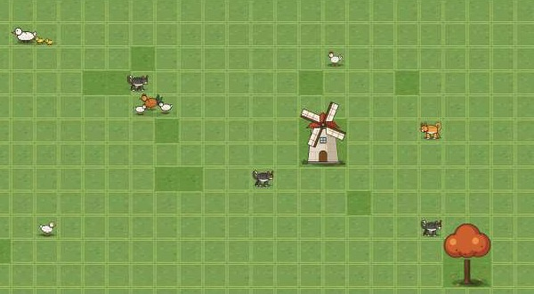

# 창조자의 눈 — 관찰 기록 27회: 마당 꾸미기 어설픔 사냥 (동물 · 고치기 전 기준선)

> 보스 요청: 사용자가 콕 집은 **가축**. 꾸미기 두 세션이 동물을 고치기 시작했으니 **고치기 전 모습을 수로 남긴다** — 고친 뒤 같은 잣대로 전·후를 견준다. 그리고 아이 눈으로 마당을 처음 열어 꾸며 보며 **동물 말고도** 어설픈 것을 찾는다(디자인 담당 표 D1~D11 과 겹치면 '겹침'이라고만).
> 본 판: **꾸미기 놀이판** `node scripts/unit/deco-save-count/play.mjs 8784`(가짜 프로젝트 `play-deco-none` · `goOffline` · 운영 DB 0 · 자동 입장 '시험' 학생) · main `ceb7f0a` · **1366×610** · **코드 수정 0**.
> 창 규칙: 제 컨텍스트를 따로 열고, 누르기 전에 `location.href`(`http://127.0.0.1:8784/student.html`)를 확인했습니다. 추가로 `firebaseio.com` · `firebasedatabase.app` · 운영 프로젝트 이름으로 가는 요청을 막았습니다(**막힌 수 0**). 끝나면 about:blank 로 비우고 닫았고, 서버도 껐습니다.
> 동물 잣대는 꾸미기 계획(#842)에 '게임 느낌' 칸이 아직 없어서, 보스가 준 다섯 줄(ⓐ~ⓔ)을 그대로 이름으로 썼습니다.
> **사실 / 해석 / 가설**을 나누고 고칠 것은 **ⓐ / ⓑ / ⓒ**.

## 한 줄
**누르면 반응은 아주 빠릅니다(13~24ms · 말풍선 + 폴짝). 그런데 '살아 있음'이 2px 들썩임 하나뿐이고, 여덟 마리 중 셋(오리 가족 · 닭 3마리 · 양)은 걸음 그림이 없어서 움직이는 동안 100% 미끄러집니다. 동물은 늘 모든 장식 위에 그려져서 풍차 바로 뒷줄의 닭은 풍차 지붕 위에 섭니다(D6 겹침). 그리고 꾸미다가 동물을 쓰다듬으려 누르면 — 고른 카드가 남아 있어 — 그 자리에 장식이 하나 더 놓입니다.**

---

## 1. 동물 기준선 표 (고치기 전 · 60초 · 0.1초 표본 600)

마당 배치(행,열): 오리 가족 (3,9) · 닭 3마리 (7,12) · 양 (8,37) · 강아지 (3,22) · 닭 1마리 (3,18) · 오리 1마리 (10,5) · 양 1마리 (4,40) · 고양이 (8,20). 둘레에 풍차 (5,18) · 정자 (5,29) · 큰 나무 B (10,24) · 울타리 둘 (10,32)(10,35). 칸 = 27px.

| 동물 | 걸음 그림(`_b`) | ⓐ 멈춘 동안 화면이 바뀐 비율 · 그중 그림이 바뀐 수 | ⓑ 미끄러짐(움직인 표본 중 걸음 그림이 아닌 비율) | ⓒ 장식·동물과 겹친 표본 | ⓓ 눌렀을 때 첫 반응 | ⓔ 걸음 간격(초) 평균 · 최소~최대 · 60초 걸음 수 |
|---|---|---|---|---|---|---|
| 오리 가족 `d_y32` | **없음** | 100% · 0 | **100%** (111/111) | 0 | 20ms 꽥!+폴짝 | 5.9 · 4.3~7.8 · 10 |
| 닭 3마리 `d_y39` | **없음** | 100% · 0 | **100%** (142/142) | 0 | 14ms 꼬꼬댁+폴짝 | 5.3 · 3.6~7.0 · 11 |
| 양 `d_y40` | **없음** | 100% · 0 | **100%** (74/74) | 0 | 14ms 메~+폴짝 | 8.3 · 6.7~10.1 · 7 |
| 강아지 `d_y53` | 있음 | 100% · 6 | 8% (14/167) | 0 | 13ms 왈!+폴짝 | 3.9 · 2.5~4.9 · 15 |
| 닭 1마리 `d_y55` | 있음 | 100% · 7 | 11% (15/131) | 0 → **풍차 뒷줄에 놓으면 20%**(아래) | 24ms 꼬꼬댁+폴짝 | 4.8 · 3.6~6.4 · 12 |
| 오리 1마리 `d_y56` | 있음 | 100% · 3 | 14% (15/108) | 0 | 14ms 꽥!+폴짝 | 6.6 · 5.1~7.9 · 9 |
| 양 1마리 `d_y57` | 있음 | 100% · 6 | 13% (11/84) | 0 | 14ms 메~+폴짝 | 8.1 · 6.6~9.5 · 8 |
| 고양이 `d_y54` | 있음 | 100% · 7 | 12% (16/138) | 0 | 14ms 야옹+폴짝 | 5.0 · 3.0~6.2 · 12 |

**함께 보는 값** — 들썩임(`decoBob`)은 **여덟 마리 모두 같은 1.6초 · 2px**(CSS 한 줄) · 한 칸 걷기는 **0.9~1.6초 일정 속도**(linear) · 폴짝은 **누를 때만**(60초 동안 스스로 0번).

**사실 — ⓐ '멈춘 동안 바뀜 100%'의 뜻**: 멈춰 있는 표본마다 화면은 바뀝니다. 그런데 바뀌는 것은 **2px 들썩임 하나**입니다. 그림이 바뀐 것은 600표본 중 0~7번뿐입니다(걸음 그림이 끝나며 돌아오는 순간 · 먹는 그림).
**사실 — ⓑ**: 걸음 그림이 없는 셋은 **걷는 내내 한 장 그림이 미끄러집니다.** 걸음 그림이 있는 다섯도 8~14%는 미끄러집니다 — 걸음 그림은 걷는 시간 동안만 바뀌는데, 그 앞뒤로 몇 표본씩 한 장 그림으로 움직입니다.
**사실 — ⓒ**: 이 배치 그대로는 60초 동안 겹침이 **0**이었습니다. 그런데 **풍차 바로 뒷줄 (4,18)에 닭 1마리를 놓으면**, 30초 동안 **297표본 중 60(20%)** 에서 닭이 풍차 그림과 겹칩니다(보이는 부분 넓이의 15% 넘게). 놓은 직후 사진에서는 **닭이 풍차 지붕 위에 서 있습니다.** 동물 층(`.deco-anim-layer`)이 캔버스 **위에** 있어서, 동물은 언제나 모든 장식 **앞에** 그려집니다.

**해석** — 반응(ⓓ)은 요즘 게임 수준입니다. 어설픔은 **'가만히 있을 때'** 와 **'걸을 때'** 에 있습니다. 가만히 있을 때는 여덟 마리가 **같은 박자로 2px** 들썩이기만 합니다. 고개 돌리기, 쪼기, 꼬리 흔들기, 앉기 같은 **자기만의 동작이 없습니다.** 걸을 때는 셋이 스케이트를 탑니다.
**가설** — 사용자가 "어설프다"고 한 것은 이 두 가지일 가능성이 큽니다. 가장 싸게 크게 바뀌는 것은 ① **걸음 그림 없는 셋에 `_b` 한 장씩**(미끄러짐 100% → 한 자리 수) ② **들썩임 박자를 동물마다 다르게**(같은 1.6초 → 흩어진 박자 · 같이 숨 쉬는 인형처럼 안 보이게) ③ 가만히 있을 때 **가끔 한 번 딴짓**(쪼기·두리번)입니다. **확인은 실제 아이에게.**

---

## 2. 동물 말고도 — 마당을 처음 열어 꾸며 보며

| 종류 | 이름 | 사실 | 디자인 표와 |
|---|---|---|---|
| ⓙ 손맛 함정 | **쓰다듬으려다 또 놓임** | 고양이를 놓은 뒤 Escape 를 눌렀지만 **고른 카드가 그대로**였습니다(`SEL_DECO = 'd_y54'`). 그 뒤 동물을 누르자 말풍선 대신 **그 자리에 고양이가 하나 더 놓였습니다**(1마리 → 3마리 · 가진 수 3을 다 씀). 고른 카드를 푸는 길은 **같은 카드를 한 번 더 누르기**뿐인데, **×0 이 된 카드는 눌러도 풀리지 않고** '놓인 곳 보여 주기'만 합니다(`selectDeco` 첫 줄). 저는 **다른 카드를 골랐다가 다시 눌러서** 풀었습니다. | 새것 |
| ⓖ 말 어긋남 | **"먼저 고르세요"인데 방금 골랐음** | 울타리를 놓고 같은 카드를 **다시 누른 뒤**(아이는 '또 놓으려고' 누름) 판을 누르자 "**먼저 아래 장식품을 선택해주세요!**"가 떴습니다. 두 번째 누름이 **고름을 풀었기** 때문입니다. 카드가 켜졌는지 꺼졌는지가 눈에 잘 안 띕니다. | 새것 |
| ⓘ 얼룩 | **동물 자리 어두운 네모** | 동물을 놓은 **집 칸이 어둡게 칠해진 채** 남습니다. 동물은 반경 2~4칸을 돌아다니니, 마당 곳곳에 **빈 어두운 네모**가 흩어져 보입니다(아래 사진 · 여덟 곳 모두). | 새것 |
| ⓓ 크기·잘림 | **첫 화면에서 내 집이 오른쪽 위에서 잘림** | 마당을 처음 열면 '시험의 집'이 **오른쪽 위 모서리에 반쯤** 걸려 보입니다. | **겹침**(D1 · D7) |
| ⓗ 알림 겹침 | **골랐어요 + 배치! 두 줄이 포개짐** | 놓는 순간 "🐑 골랐어요 — 놓을…"과 "✅ 🐑 양 1마리 배치!"가 **같은 자리에 겹쳐** 글자가 뭉개집니다. | 꾸미기 계획 8번(알림 겹침) — **겹침** |
| ⓒ 겹침 | **지붕 위의 닭** | 위 1절 ⓒ · 풍차 (5,18) 바로 뒷줄 (4,18) · 놓은 직후 사진 | **겹침**(D6) |
| ⓓ 줄어드는 판 | **'최근' 줄이 생기면 판이 줄어듦** | 몇 개 놓고 나면 서랍에 🕘 최근 줄이 생겨 **마당 보이는 높이가 약 400px → 324px** 로 줄어듭니다. 제가 판 아래쪽(y 390~400)을 누른 네 번은 **서랍을 눌러서 아무 반응이 없었습니다**(아이도 같은 자리를 누를 것). | 새것(작음) |

---

# ⓐ 하던 일을 멈추고 고칠 것
- **ⓐ5.** **쓰다듬으려다 또 놓임** — 아이 조작의 결과가 **뜻과 반대**(동물을 눌렀는데 장식이 늘고 골드·가진 수가 줄 수 있음 — 이번엔 가진 것에서 놓여 골드는 그대로였습니다). 그리고 ×0 카드는 눌러도 고름이 **풀리지 않습니다.** 판을 누르는 순간 고름을 한 번에 하나로 끝내거나, 동물 위를 누르면 놓지 않고 동물이 반응하게 하는 쪽이 보입니다. (판단은 꾸미기 담당께.)

# ⓑ 이번 묶음 안에서 고칠 것 (동물 · 전·후를 이 표로 견줌)
- **ⓑ55.** **걸음 그림 없는 셋**(오리 가족 · 닭 3마리 · 양) — 미끄러짐 **100%**.
- **ⓑ56.** **같은 박자 들썩임** — 여덟 마리 모두 1.6초 · 2px. 가만히 있을 때 그림이 바뀌는 비율 **0~1%**.
- **ⓑ57.** **동물이 늘 장식 앞에** — 풍차 뒷줄 닭 **20%** 겹침(D6 겹침).
- **ⓑ58.** **동물 자리 어두운 네모**(여덟 곳 모두).
- **ⓑ59.** **"먼저 고르세요"인데 방금 골랐음** — 카드 켜짐/꺼짐이 잘 안 보입니다.

# ⓒ 적어 두고 실제 사용에서 확인할 것
- **ⓒ56.** 아이가 미끄러지는 셋을 **'어설프다'로 느끼는지**, 그냥 귀엽게 보는지.
- **ⓒ57.** 걸음 간격(강아지 3.9초 ~ 양 8.3초)이 **성격 차이로 읽히는지.**
- **ⓒ58.** 폴짝이 **누를 때만** 있는 것 — 스스로 가끔 폴짝이면 더 살아 보이는지.

---

## 3. 전·후 비교용 재는 법 (고친 뒤 그대로 되밟기)

1. 놀이판을 제 포트로 띄우고 → 🌸 꾸미기 → 🌿 나의 마당 꾸미기.
2. 위 1절 배치 그대로 놓기(검색창에 이름 → `.deco-card[data-deco-id]:visible` → 판 좌표 `(열×27+13, 58.6+행×27+13)`).
3. **고른 카드를 푼 뒤**(ⓐ5 때문에 꼭) 60초 동안 0.1초마다 `.deco-anim` 마다 `img` 사각형 · `img.src` · `.bob` 의 계산된 transform · `.bob.hop` 을 기록.
4. 셈:
   - ⓐ 멈춤 = 사각형 x 변화 ≤ 0.5px · y 변화 ≤ 3px 인 표본. 그중 transform/src 가 바뀐 비율, 그리고 src 만 바뀐 수.
   - ⓑ 미끄러짐 = 움직인 표본 가운데 src 가 `_b`·`_swim` 이 아니고 폴짝도 아닌 비율.
   - ⓒ 겹침 = 동물의 보이는 상자(`bbox.json` 으로 줄임)와 장식의 보이는 상자(`bbox.json` · 발 칸 바닥에 맞춤)가 동물 넓이의 15% 넘게 겹친 표본. 겹침 없는 배치와 **풍차 뒷줄 (4,18) 배치** 둘 다.
   - ⓓ 누름 = 멈춘 동물 가운데를 누른 뒤 `.deco-anim-say` 또는 `.bob.hop` 이 생길 때까지 ms. **150ms 넘으면 표시.**
   - ⓔ 반복 = `transform` 목표 칸이 바뀐 시각 사이 간격.

## 미검증 · 한계
- **표본은 동물마다 60초 한 번**입니다. 걸음 간격은 무작위라 다시 재면 조금 달라집니다.
- 헤엄(오리를 물 위에) · 먹이통 옆 먹기 · 우리 안은 **이번에 안 봤습니다**(마당 첫 꾸미기 흐름만).
- 겹침 잣대(15%)는 제가 정한 것입니다. 들썩임 **박자의 어긋남(위상)** 은 재지 않았습니다 — 여덟 마리가 같은 순간에 오르내리는지는 눈으로도 확인하지 않았습니다.
- '쓰다듬으려다 또 놓임'은 **고양이로 한 번** 겪은 것입니다(두 마리가 더 놓임). 다른 카드로 되풀이하지는 않았습니다.
- 제가 본 것은 **조작과 표시 경로 · 페이지 안 값 · 제 눈**까지입니다. 아이가 어떻게 느끼는지는 **실제 학생에게 확인할 일**입니다.
