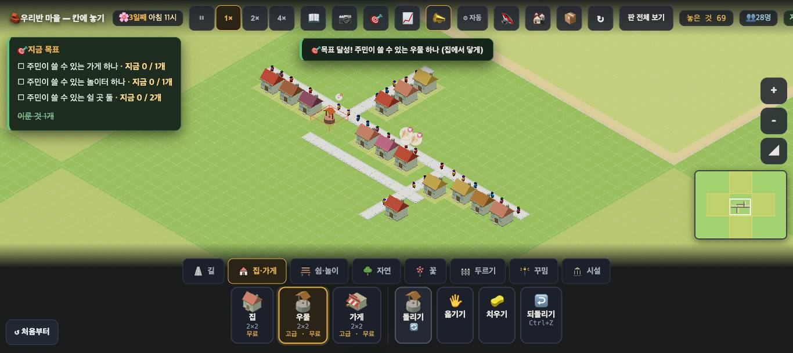
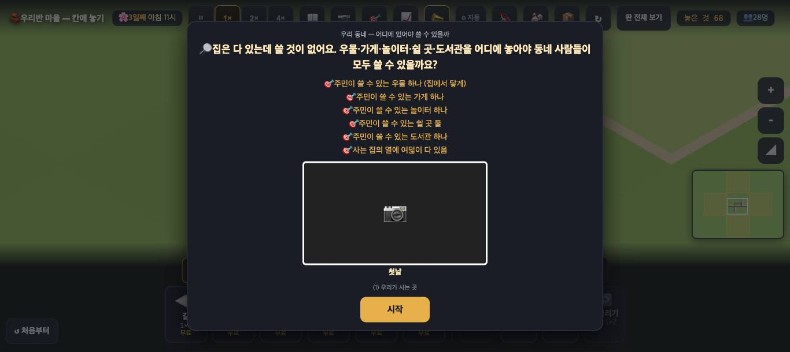

# 창조자의 눈 — 관찰 기록 28회: 오늘 바뀐 마을 되밟기 (아이 눈)

> 보스 요청: 오늘 머지된 #843 풀린 집 말 · #846 곧 일자리 · #847 바뀐 집 수 한 줄 + ✨ · #848 외 N곳 · #855 ↺ 처음부터 · #862 가게에 물건이 없어요 를 아이 눈으로 되밟는다. 볼 것은 넷입니다.
> ① 한 수에 **말이 몇 줄** 뜨는가 ② #848 🎉 가 한 수와 **떨어져 보이는가** ③ farm 에서 밭 없이 → 밭 놓기까지 **집 카드 말이 사실대로** 바뀌는가 ④ ↺ 처음부터가 수업 흐름(#841)의 **초기화 비교**를 받쳐 주는가.
> 말은 **`#toast` · `#why`** 를 갈라서 셌습니다(25회 ⓐ4 교훈). 두 요소를 60ms 마다 읽어, 새로 보인 글자와 시각을 적었습니다.
> 본 판: main `91f4a04` · 제 서버 8781 · `?sid=guest&stage=town3|farm` · 1366×610 · **코드 수정 0**.
> ⚠ 창 사정: 이번에는 공용 Playwright 창에서 **새로 연 페이지가 약 2초 만에 닫혔습니다**(다른 세션의 정리로 보입니다). 그래서 기본 페이지 하나만 쓰고, **누를 때마다 `location.href` 가 제 주소인지** 확인했습니다. 마지막 확인 창 뒤에는 그 페이지도 비워져서 거기서 멈췄습니다. 제 전용 헤드리스 크롬(CDP)도 한 번 시도했는데, 판 시계가 안 흘러 쓰지 않았습니다(아래 '미검증'). 4배속은 한 번에 25~40초만 썼습니다.
> **사실 / 해석 / 가설**을 나누고 고칠 것은 **ⓐ / ⓑ / ⓒ**.

## 한 줄
**어수선하지는 않습니다 — 한 수에 토스트는 한 번에 하나씩 뜹니다. 오히려 반대가 걸립니다: 첫 우물처럼 목표를 함께 이루는 수에서는 "💧 물 뜰 곳이 생긴 집 11채"가 목표 달성 토스트에 가려 한 번도 보이지 않고, 3.4초 뒤 "🎉 ○○네가 기뻐해요" 한 집만 보입니다. farm 은 #862 로 말이 사실과 맞게 바뀌었습니다(밭 없음 → 네 집 모두 "🛒 가게에 물건이 없어요" · 밭 하나 → 한 집만 풀림 = 받음 1). ↺ 처음부터는 두 판 모두 한 번 묻고 약 5초 만에 처음으로 돌아갑니다.**

---

## ① 한 수에 말이 몇 줄 — town3 우물 (`#toast` · `#why` 따로)

| 수 | 0초~ 보인 말 (요소 · 시각) | `__placeCount` | 🎉 (`__joyOthers`) |
|---|---|---|---|
| **첫 우물 (137,141)** — 길가 · 목표 "쓸 수 있는 우물 하나"도 이룸 | `#toast` "🎯 목표 달성! 주민이 쓸 수 있는 우물 하나 (집에서 닿게)" **0.33초** · 목표판이 다시 그려짐 · ✨ 11채 · `#toast` "🎉 ○○네가 기뻐해요 — 물 뜰 곳이 생겼어요" **3.39초** | 마지막 "💧 물 뜰 곳이 생긴 집 11채" · 말함 1 · 반짝 11 | 말함 1 · 외 0 · 모은집 1 |
| 둘째 우물 (146,138) — 길가 · 목표 없음 | `#toast` "**💧 물 뜰 곳이 생긴 집 3채**" **0.56초** (그 뒤 7초 동안 다른 말 없음) | 말함 2 · 반짝 14 | 그대로 |
| 셋째 우물 (155,143) — 길에서 멂 | `#toast` "우물은 길 옆에 있어야 주민이 와서 물을 떠요 — 길에 붙여 보세요" **0.05초** | 그대로(0채는 말하지 않음) | 그대로 |

`#why`(커서 옆 풍선)는 세 번 다 **아무것도 뜨지 않았습니다**(놓은 뒤 커서를 판 밖으로 옮겼습니다).

**사실** — 첫 우물에서 `__placeCount()` 는 "💧 물 뜰 곳이 생긴 집 11채"를 **말했다고(말함 1)** 하는데, 60ms 마다 읽은 `#toast` 에는 그 글이 **한 번도 없었습니다.** 같은 0.3초 무렵 뜬 "🎯 목표 달성!" 토스트가 그 자리를 차지했습니다.
**사실** — 목표가 걸리지 않은 둘째 우물에서는 "💧 … 3채"가 **0.56초에 혼자** 떴습니다.
**해석** — **어수선함은 없습니다.** 한 수에 토스트는 1~2줄이고, 서로 겹치지 않습니다. 걸리는 것은 **아이가 가장 먼저 만나는 수**(첫 우물은 거의 늘 목표도 이룹니다)에서 **"몇 채가 풀렸나"라는 한 수의 대답(L3)이 사라지는 것**입니다. 수업 흐름의 '결과 확인' 단계가 딱 이 줄에 기대고 있습니다.
**가설** — 목표 달성 토스트 **뒤에** L3 줄을 이어서 보여 주거나, 목표 달성 말 안에 "(11채)"를 붙이면 둘 다 살 것입니다.

## ② #848 🎉 가 한 수와 떨어져 보이는가

**사실** — 첫 우물 뒤 🎉 는 **3.39초**에 떴고, **한 집 이름만** 말했습니다(`외 0` · `모은집 1`). 같은 수로 물을 얻은 집은 **11채**입니다(✨ 11). 🎉 는 "웃게 된 집"만 세는 것으로 보입니다 — 11채 중 😊 로 바뀐 것이 한 집이었습니다.
**사실** — 둘째 우물(3채)에서는 🎉 가 뜨지 않았습니다(웃게 된 집이 없었음).
**해석** — 첫 우물에서 아이가 보는 순서는 **"🎯 목표 달성!" → (3초) → "🎉 ○○네가 기뻐해요"** 입니다. L3 줄(11채)이 빠져 있으니, **이 수의 결과가 "한 집이 기뻐했다"로 읽힙니다.** 3초 간격 자체는 "우물 → 누가 기뻐함"으로 이어 읽을 만한 거리로 보이지만, **숫자가 11 → 1 로 줄어 보이는 것**이 문제입니다.
**가설** — L3 줄이 살아나면 "11채에 물 · 그중 한 집은 이제 다 있어서 웃음"으로 두 말이 **서로 다른 것**을 말한다는 게 보일 것입니다. **확인은 실제 아이에게.**
(보스가 말한 '5초 안 같은 필요 🎉 쉼'은 아직 안 들어온 **전(前)** 값입니다.)

## ③ farm — 밭 없이 → 밭 하나 (집 카드 말이 사실대로인가)

놓은 것: 가게 (143,142) · 집 넷 (139,142)(141,142)(145,142)(147,142) · 우물 (141,145) · 놀이터 (145,145) · 긴의자 (143,145) → 4배속 25초(1일째 밤 8시 · 인구 8).

| 때 | 흐름 `세대` · 가게 | 집 카드 넷 |
|---|---|---|
| **밭 없음** | 받음 0 · **못받음 4** · 0/empty | 넷 모두 "😐 **🛒 가게에 물건이 없어요**" (둘은 "· 우리 집 앞은 괜찮아요 · 옆 길은 붐벼요"가 붙음) |
| 밭 (149,142) 놓음 · 1일째 밤 11시 | 받음 0 · 못받음 4 · 0/empty | 넷 모두 그대로 |
| 2일째 아침 8시 | 받음 0 · 못받음 4 · **1/stocked** | 넷 모두 그대로 |
| 2일째 낮 12시 | **받음 1 · 못받음 3** · 0/empty | **(145,142) 한 집만 "😐 다 있어요"** · 셋은 "물건이 없어요" |
| 2일째 낮 4시 | 받음 1 · 못받음 3 · 1/stocked | 그대로 |

**사실** — 수업 흐름 초안(#841 · L5)을 쓸 때 "가게가 비어도 집은 '다 있어요'"라던 자리가, 이제 **네 집 모두 "🛒 가게에 물건이 없어요"** 입니다(#862 ✅).
**사실** — 밭 하나로 들어온 곡식이 **한 세대 몫**이라, 집 카드도 **한 집만** 바뀝니다. **말이 수와 맞습니다.**
**사실** — 밭을 놓는 순간에는 **대답이 없습니다**(우물의 "💧 …채" 같은 줄이 밭에는 없음). 첫 변화는 판 속 약 9시간 뒤(곡식이 가게에 닿을 때)입니다. 제가 들은 말은 Escape 로 고름을 풀 때의 "취소했어요" 하나였습니다.
**해석** — 2판(가까워도 물건이 없으면 못 쓴다)의 **두 번째 문장이 이제 집 쪽에서도 들립니다.** 그리고 "밭 하나 = 한 집"이라는 **양**까지 보입니다 — 아이가 "밭을 더 놓아야겠다"로 갈 길이 섰습니다.
**가설** — 밭을 놓은 순간 "🌾 곡식이 자라요 — 가게까지 반나절" 같은 한 줄이 있으면, 9시간의 빈 기다림이 '고장'으로 안 읽힐 것입니다. **확인은 실제 아이에게.**

## ④ ↺ 처음부터 — 수업 흐름의 '초기화 비교'를 받쳐 주는가

| | town3 | farm |
|---|---|---|
| 단추 | 왼쪽 아래 "↺ 처음부터" (10,552 · 90×44) | 같음 |
| 묻는 말 | "이 판을 처음 상태로 되돌릴까요? 지금까지 바꾼 것은 사라져요." | "이 판을 처음(**빈 땅**)으로 되돌릴까요? 지금까지 놓은 것은 사라져요." |
| 되돌린 뒤 | 약 5초 뒤 다시 열림 · **첫 카드 다시** · 물건 71 → 68(우물 3 → 0) · 이룬 목표 1 → 0 · 시계 3일째 밤 10시 → **3일째 아침 11시**(시작값) | 확인 창까지 확인. 그 뒤 창이 비워져 결과는 못 봄(헤드리스 시도에서는 첫 카드 다시 뜸 · 물건 12) |

**해석** — **"초기화해서 다른 선택과 비교"의 앞쪽 절반은 섰습니다.** 두 번 묻지 않고 한 번, 판마다 맞는 말(farm 은 '빈 땅')로 묻고, 5초 안에 처음으로 돌아갑니다.
**해석** — 뒤쪽 절반 **'비교'는 아직 화면에 없습니다.** 되돌리면 첫 시도의 결과(예: "11채")가 **어디에도 남지 않습니다.** 지금은 활동지와 아이 기억이 그 일을 합니다 — 수업 흐름 L8(두 선택 나란히)과 같은 자리입니다.
**가설** — 되돌리기 직전의 "💧 …채"(L3 마지막 값)를 첫 카드 아래에 "지난번: 11채"로 한 줄 남기면, 두 번째 시도 뒤 바로 견줄 수 있을 것입니다.

## ⑤ 25회 ⓐ4 — `__onePress()`
#860 은 아직 **열려 있어서** main(`91f4a04`)에는 `__onePress` 가 없습니다. 앞서 #860 가지(`f7728a1`)를 읽기 전용으로 받아 같은 방법으로 쟀을 때 `{"막음":0,"부른곳":[]}` 이었고, 둘째 말은 `#why` 였습니다(정정 #865 머지됨).

---

# ⓐ 하던 일을 멈추고 고칠 것
없음.

# ⓑ 이번 묶음 안에서 고칠 것
- **ⓑ60.** **목표를 함께 이루는 수에서 L3 줄이 사라집니다** — 첫 우물의 "💧 물 뜰 곳이 생긴 집 11채"가 "🎯 목표 달성!"에 가려 한 번도 안 보입니다(훅은 '말함 1'). 아이가 가장 먼저 두는 수가 대개 이 경우입니다.
- **ⓑ61.** 그 결과 첫 수의 대답이 **"🎉 ○○네 한 집"** 으로만 읽힙니다(11채 → 1 로 줄어 보임). ⓑ60 이 고쳐지면 함께 풀릴 가능성이 큽니다.

# ⓒ 적어 두고 실제 사용에서 확인할 것
- **ⓒ59.** 밭을 놓은 순간 대답이 없고, 첫 변화는 판 속 약 9시간 뒤 — 아이가 기다리는지, 밭을 더 놓는지, 고장으로 읽는지.
- **ⓒ60.** ↺ 의 확인 창이 **브라우저 기본 창**(게임 그림과 다른 모양) — 아이가 놀라는지.
- **ⓒ61.** 되돌린 뒤 첫 시도 결과가 안 남는 것 — 활동지로 충분한지(L8).
- **ⓒ62.** 집 카드의 새 말 "우리 집 앞은 괜찮아요 · 옆 길은 붐벼요" — 아이가 '앞'과 '옆'을 가르는지.

## 미검증
- town3 우물 셋은 **한 번씩**만 뒀습니다. '목표 토스트가 L3 를 가린다'는 첫 우물 한 번에서 본 것입니다(60ms 간격 · 목표 달성 토스트가 뜬 뒤 7초 동안 L3 글자가 `#toast` 에 없었음).
- farm ↺ 은 **확인 창까지**만 공용 창에서 봤습니다. 되돌린 뒤 모습은 헤드리스 시도의 값(첫 카드 다시 · 물건 12)입니다 — 그 헤드리스 크롬에서는 **판 시계가 흐르지 않고 트레이 클릭이 안 먹어서**, 다른 값은 쓰지 않았습니다.
- #843(풀린 집 말) · #846(곧 일자리)은 이번 순서에서 따로 보이지 않았습니다(일자리 판정을 끈 town3 · 작은 farm).
- 제가 본 것은 **조작과 표시 경로 · 훅 값**까지입니다. 아이가 어떻게 읽는지는 **실제 학생에게 확인할 일**입니다.
