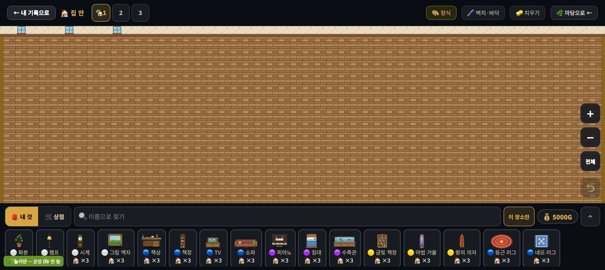
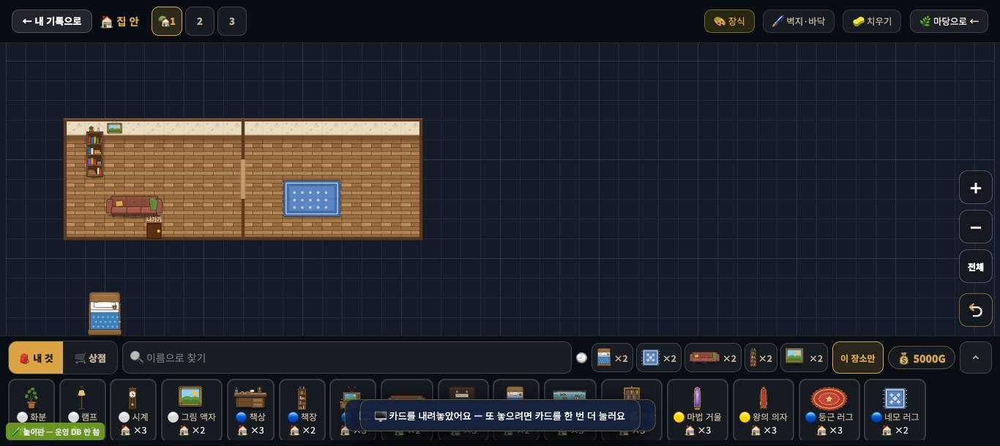
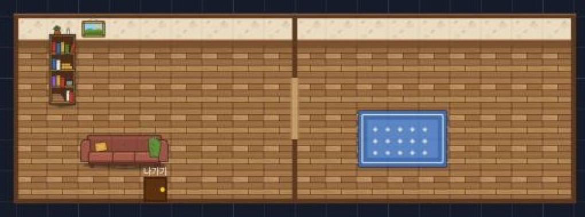
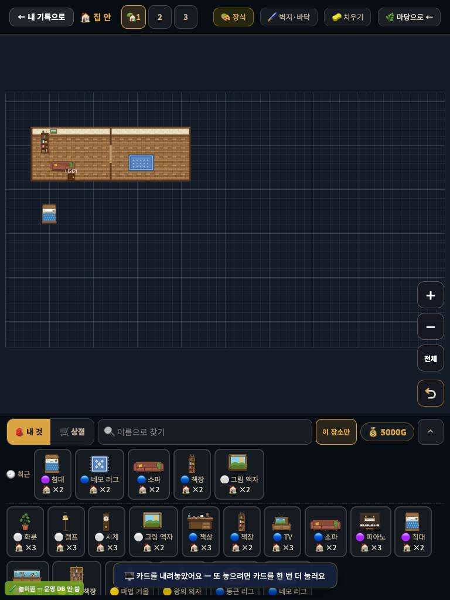

# 창조자의 눈 — 관찰 기록 29회: 꾸미기 '집 안' 기준선 (고치기 전)

> 보스 요청: 사용자가 집 안을 **두꺼운 벽 톱다운 사무실 느낌**(벽 윗면+앞면 띠로 방이 또렷 · 벽이 끊긴 문 자리 · 뒷벽에 창문 줄·액자·책장 · 가운데 러그+긴 탁자 · 방마다 역할이 보이는 가구 묶음)으로 바꾸고 싶어 합니다. 두 꾸미기 세션이 벽 작업을 시작하니 **지금 모습을 수·사진으로** 먼저 남깁니다. 방 경계가 한눈에 보이나 · 문이 어디인지 보이나 · 벽걸이가 벽에 붙어 보이나 · 가구가 벽을 파고드나 · 빈 도면 비율 · 1366×610 과 768×1024. 그리고 동물 셋(강아지·고양이·닭 — 그림만 바뀜)이 27회 기준선에서 달라졌는지.
> 본 판: 꾸미기 놀이판 `play.mjs 8784`(가짜 프로젝트 · goOffline · 운영 DB 0) · main `98da30d` · **코드 수정 0**.
> **화면에 창을 띄우지 않았습니다.** 제 전용 headless 크롬을 Node 스크립트(CDP)로 하나만 띄웠고, 끝나면 try/finally 로 껐습니다. 운영 쪽(`firebaseio` · `firebasedatabase.app` · 운영 프로젝트 이름) 요청은 막았고, 막힌 수는 0 이었습니다.
> 누르기는 CDP 진짜 마우스(`Input.dispatchMouseEvent`)입니다. 카드 고르기만 카드의 `onclick` 과 같은 함수 `selectDeco(id)` 를 불렀습니다(서랍에서 카드를 찾아 누르는 대신).
> **사실 / 해석 / 가설**을 나누고 고칠 것은 **ⓐ / ⓑ / ⓒ**.

## 한 줄
**지금 집 안의 방은 '두꺼운 벽이 두른 방'이 아니라 '어두운 도면 위에 놓인 얇은 테두리의 바닥 판'입니다. 벽은 뒤쪽 한 줄 띠(벽지)뿐이고, 옆·아래·방 사이는 가는 선 한 줄입니다. 문은 옆으로 맞붙은 두 방 사이에만 저절로 생기는데, 끊긴 벽이 아니라 선 위의 옅은 막대로 보입니다. 방을 만들면 화면의 79%(1366)~87%(768)가 빈 도면이 됩니다. 액자는 벽 띠에 잘 붙고, 가구가 방 벽을 가로지르는 것은 막혀 있습니다(#851 ✅).**

---

## 1. 방을 만들기 전 — 큰 방 하나

**사실** — 집 안에 처음 들어가면 판(50×28 · 한 칸 27px)이 **통째로 한 방**입니다. 화면 가득 벽돌 무늬 바닥이고, 맨 위에 **얇은 벽지 띠**(창문 셋)가 있습니다. **방 경계 · 문 · 벽 두께는 없습니다.** 빈 도면은 **0%** 입니다.
**해석** — 사용자가 말한 "방이 또렷한 사무실"과는 반대 끝입니다. **한 장의 바닥**입니다.

## 2. 방을 만든 뒤 (1366×610)

**만든 순서(진짜 클릭)** — 🖌️ 벽지·바닥 → ⬛ 방 → 보통 방 → (4,3) · (4,12) 두 번 → "🧱 9 × 5 방이 생겼어요 — 방 밖은 빈 터예요(가구는 어디나 놓여요)". 셋째로 작은 방을 (12,3)에 누른 것은 **방이 생기지 않았고, 말도 없었습니다**(아래 '미검증').
**방** `a (4,3) 9×5` · `b (4,12) 9×5` — 옆으로 맞붙음 · **문** `{col 12, r 5~7}` 하나(맞붙은 벽).

**가구 놓기(🎨 장식 모드로 돌아와서)**

| 놓은 것 | 자리 | 결과 · 말 |
|---|---|---|
| 그림 액자 `d_i4` | 방 A 벽 띠 줄 (3,5) 누름 | **놓임**(4,5 로 붙음) · "✅ 🖼️ 그림 액자 배치!" |
| 그림 액자 | 방 A 바닥 한가운데 (6,7) | **안 놓임** · "🖼️ 벽에 거는 거예요 — 위쪽 벽(맨 윗줄이나 방의 윗벽)을 눌러 걸어 주세요" ✅ |
| 책장 `d_i6` | 방 A 뒷벽 앞 (4,4) | 놓임 |
| 소파 `d_i8`(3칸) | 방 A·B 경계 걸침 (6,10) | **안 놓임** · "🧱 벽에 걸려요 — 방 안이나 밖에 다 들어가게 놓아 주세요" ✅(#851) |
| 소파 | 방 A 안 (7,5) | 놓임 |
| 네모 러그 `d_i16` | 방 B (6,14) | 놓임 |
| 침대 `d_i10` | (12,4) — 방 밖 빈 터 | 놓임(빈 터에도 놓임) |

### 보스가 물은 다섯

| 물음 | 사실 | 해석 |
|---|---|---|
| **방 경계가 한눈에 보이나** | 바닥(벽돌)과 바깥(어두운 도면 격자)의 **색 차이**로 보입니다. 경계선은 **가는 갈색 선 한 줄**입니다(눈대중 3~4px · 한 칸의 약 1/8). **벽의 윗면·앞면(두께)은 없습니다.** 뒤쪽만 벽지 띠(한 칸이 채 안 되는 높이)가 있습니다. | 방은 보입니다. 그런데 **'벽'이 아니라 '테두리'** 입니다. 두 방이 맞붙은 곳은 **선 하나**라 두 방이 한 방처럼 읽히기도 합니다. |
| **문이 어디인지 보이나** | 문은 **옆으로 맞붙은 두 방 사이에만** 생깁니다(`_inRoomDoors` — 위아래로 붙은 방, 방과 바깥 사이에는 없음). 그림은 **가는 벽선 위의 옅은 나무색 막대**(3칸 높이)입니다. '나가기' 문은 방 A **바닥 위**에 따로 서 있습니다. | 문이 '벽이 끊긴 자리'로 안 보이고 **선 위의 무늬**로 보입니다. '나가기'는 벽이 아니라 바닥에 선 상자입니다(디자인 D5 와 **겹침**). |
| **벽걸이가 벽에 붙어 보이나** | 액자는 **벽 띠에 정확히 걸립니다.** 바닥에 걸려고 하면 까닭과 함께 막힙니다. 벽걸이 종류는 **액자 하나뿐**입니다(`DECO_WALL = { d_i4 }`). | 붙는 것은 좋습니다. 다만 뒷벽에 걸 **것이 액자 하나**라, 사용자가 말한 "뒷벽에 창문 줄·액자·책장"을 채울 재료가 부족합니다. 책장은 바닥 가구로 뒷벽 앞에 섭니다. |
| **가구가 벽을 파고드나** | 두 방 경계를 걸치는 소파는 **막힙니다**(#851). 책장(1×2)은 윗부분이 벽지 띠 **앞으로 겹쳐** 그려집니다(벽에 기대 선 모습). | 파고듦은 없습니다 ✅. |
| **빈 도면 비율** | 캔버스 픽셀을 셌습니다(아주 어두운 파랑 = 빈 도면): 방 없을 때 **0%** · 방 둘 뒤 1366×610 **79%** · 768×1024 **87%** | 방을 만드는 순간 화면의 **4/5 가 빈 도면**이 됩니다. 방을 만든 뒤에도 카메라는 **그대로**(판 왼쪽 위)라, 방이 화면 왼쪽 위 구석(약 490×165px)에 작게 남습니다. |

### 768×1024

**사실** — 폭 768 에서 한 칸이 **15px** 로 줄고(1366 은 27px), 방 둘이 화면 왼쪽 위 **약 270×90px** 에 들어갑니다. 빈 도면 **87%**. 가구는 손가락보다 작게 보입니다.
**해석** — 태블릿 세로에서 집 안은 **거의 빈 도면**입니다. 방 둘레로 맞추기(`_inFitRooms`)는 **들어올 때만** 돕니다 — 방을 만든 직후에는 불리지 않습니다.

---

## 3. 동물 셋 — 27회 기준선과 비교 (그림만 바뀐 뒤)

마당에 강아지 (5,10) · 고양이 (5,20) · 닭 1마리 (8,15) · 60초 · 0.1초 표본 600. 새 그림은 #875(강아지) · #879(고양이) · #882(닭)입니다.

| 동물 | 쓰는 그림 | 크기(보이는 상자) | 미끄러짐 27회 → **29회** | 멈춘 동안 그림 바뀜(600 중) 27회 → **29회** | 60초 걸음 수 |
|---|---|---|---|---|---|
| 강아지 `d_y53` | `d_y53` · `d_y53_b` | 27×54px (1칸) | 8% → **11%** | 6 → **9** | 15 → **16** |
| 고양이 `d_y54` | `d_y54` · `d_y54_b` | 27×54px | 12% → **15%** | 7 → **7** | 12 → **11** |
| 닭 1마리 `d_y55` | `d_y55` · `d_y55_b` | 27×54px | 11% → **17%** | 7 → **4** | 12 → **11** |

**사실** — 새로 들어온 상태 그림(`_idle` · `_peck` · `_sleep` · `_walk`)은 **아직 안 쓰입니다.** 엔진이 부르는 것은 예전처럼 기본 한 장과 `_b` 한 장입니다. 들썩임도 그대로(1.6초 · 2px).
**해석** — 수는 **27회와 같은 범위**입니다(무작위 걸음이라 몇 %씩 흔들립니다). **그림이 바뀐 것만으로는 '게임 느낌' 잣대가 움직이지 않았습니다** — 동물 엔진이 들어온 뒤 27회 3절 방법으로 다시 재면 됩니다.

**ⓐ5 다시 확인 ✅** — 카드(강아지)를 **든 채** 강아지를 누르면 22ms 에 "왈!+폴짝"이 뜨고, **아무것도 안 놓입니다**(놓인 수 변화 0). Escape 를 누르면 고름이 풀립니다(`SEL_DECO = null`). #876 로 닫혔습니다.

---

# ⓐ 하던 일을 멈추고 고칠 것
없음.

# ⓑ 이번 묶음 안에서 고칠 것 (벽 작업의 전·후 기준으로 씀)
- **ⓑ62.** **벽에 두께가 없습니다** — 뒷벽 띠 하나 + 옆·아래·방 사이는 가는 선. "벽 윗면+앞면 띠"가 들어오면 이 사진(05)과 견줍니다.
- **ⓑ63.** **문이 '끊긴 벽'으로 안 보입니다** — 선 위 옅은 막대. 그리고 문은 **옆으로 맞붙은 방 사이에만** 생깁니다(위아래로 붙은 방·바깥으로 난 문 없음).
- **ⓑ64.** **방을 만들면 빈 도면 79~87%** · 카메라가 방으로 다가가지 않습니다(들어올 때만 맞춤). 디자인 D10('빈 도면 절반')과 **겹침**.
- **ⓑ65.** **벽걸이가 액자 하나뿐** — 뒷벽을 채울 재료(창문·시계·선반·게시판)가 없습니다.

# ⓒ 적어 두고 실제 사용에서 확인할 것
- **ⓒ63.** 맞붙은 두 방이 아이 눈에 **두 방으로 읽히는지**(선 하나).
- **ⓒ64.** '나가기' 문이 바닥 위에 선 것을 아이가 **문으로 읽는지**(D5 겹침).
- **ⓒ65.** 빈 터(방 밖)에도 가구가 놓이는 것 — 아이가 **방 밖에 가구를 흩어 놓는지**.

## 전·후 되밟는 법 (벽 작업 뒤 그대로)
1. 놀이판 → 🌸 꾸미기 → 🏠 집 안 꾸미기 → 사진(방 없음).
2. 🖌️ 벽지·바닥 → ⬛ 방 → 보통 방 → (4,3) · (4,12) → 🎨 장식.
3. 액자 (3,5)·(6,7) · 책장 (4,4) · 소파 (6,10)·(7,5) · 네모 러그 (6,14) · 침대 (12,4).
4. 사진 1366×610 · 768×1024 · 빈 도면 비율(캔버스 픽셀 중 아주 어두운 파랑) · 문 목록 `_inRoomDoors(_inRooms(CUR))`.
판 칸 → 화면: `rect.left + (c*_dC + _dCv._offX + _dC/2 − _dPanX) × rect.width/_dW` (y 도 같은 꼴).

## 미검증
- 셋째 방(작은 방 (12,3))이 안 생긴 까닭은 **확인하지 못했습니다** — 제 스크립트가 칩을 잘못 눌렀을 수 있습니다. 그래서 '말 없이 안 생긴다'를 결함으로 올리지 않았습니다.
- 벽선 두께(3~4px)는 **사진 눈대중**입니다. 빈 도면 비율은 픽셀 색을 8단계로 묶어 센 값입니다(격자선은 도면에 들어감).
- 동물은 **한 번씩 60초**입니다. 새 상태 그림을 엔진이 쓰기 전 값입니다.
- 제가 본 것은 **조작과 표시 경로 · 페이지 안 값 · 사진**까지입니다. 아이가 어떻게 읽는지는 **실제 학생에게 확인할 일**입니다.
