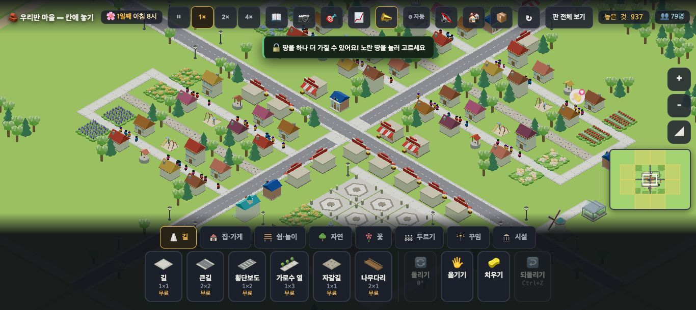
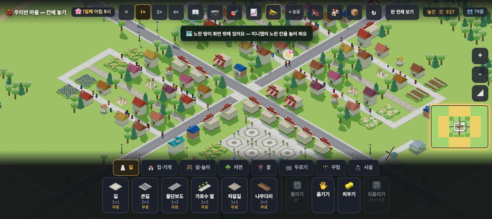
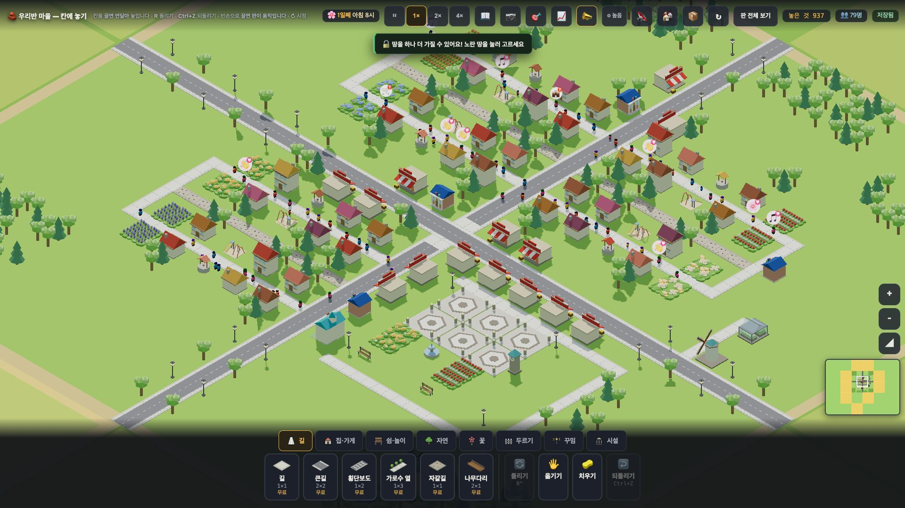
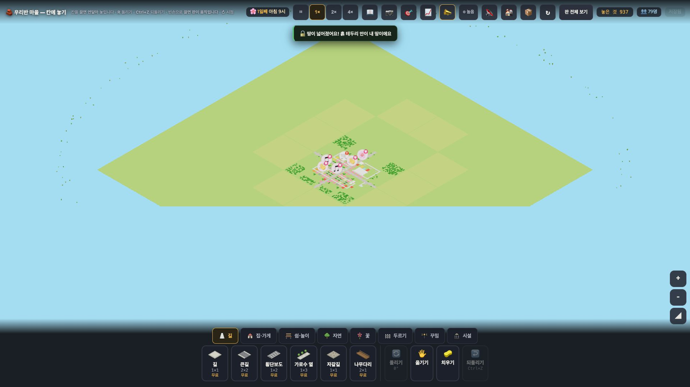

# 창조자의 눈 — 관찰 기록 30회: 원본 마을 A '우와' 판정 (아이 + 선생님 눈)

> 보스 요청: 사용자 조건은 **"아이들이 보자마자 우와, 선생님도 감탄"** 입니다. 지금 main 의 `village/stages/starts/origin.json`(A 장터 거리 · 디자인 담당이 다듬는 중 · 개울 #885 는 아직 원본에 없음)을 봅니다.
> ① 첫 화면 10초에 **눈이 먼저 가는 곳** 셋 — 예쁜가, 어수선한가 ② 요즘 아이들이 아는 게임(스타듀밸리 · 동물의 숲 · 타운스케이퍼)과 견줘 **가장 모자란 한 가지 · 이미 좋은 한 가지** ③ 선생님 눈 — 교실 뒤에서 읽히나 ④ `--first30` 밖의 것: 색 조화 · 덩어리 · 빈 곳 · 가장자리.
> 본 판: main `4ebf5b3` · 제 서버 8781 · `?sid=guest` 새 프로필에 `origin.json` 을 `__importText` 로 가져와 다시 열기 · **코드 수정 0**.
> **화면에 창을 띄우지 않았습니다.** headless 크롬 스크립트(CDP) 하나로 찍고 껐습니다. 운영 요청은 막았습니다(0).
> ⚠ **그래픽 한계**: headless 크롬은 느려서 자동 그래픽이 곧 '낮음'으로 내려갑니다(그림자 없음 · 해상도 0.65). 그래서 **보기 설정 훅 `__gfxMode('high')`**(⚙ 단추와 같은 일 · 저장·판정과 무관)로 '높음'에 고정한 사진을 따로 찍었습니다. 그래도 그림자는 거의 보이지 않았습니다 — **실제 크롬북·교실 TV 의 그림과 다를 수 있습니다.**
> 이번 회는 판정이 **제 눈**입니다. **사실**(숫자·위치)과 **해석**(예쁜가)을 특히 나눠 적었습니다.

## 한 줄
**"잘 정돈된 예쁜 마을"까지는 왔습니다 — 파스텔 지붕 · 줄무늬 차양 가게 거리 · 라벤더·튤립 꽃밭 줄이 한눈에 좋습니다. 그런데 '우와'가 되기엔 가장 크고 가장 눈에 띄는 것이 **회색 큰길 X자와 회색 광장**입니다. 마을의 심장이 콘크리트이고, 땅이 평평하며, 네 구역이 거의 같은 모양이라 "어디가 우리 마을의 자랑인가"가 안 보입니다. 첫 10초에 읽는 글도 마을이 아니라 "땅을 하나 더 가질 수 있어요"입니다.**

---

## 1. 첫 화면 10초 — 눈이 먼저 가는 곳 셋

**사실** — 판: 물건 **937** · 주민 **79** · 집 36 · 가게 14 · 나무 490(작은 321 · 큰 169) · 가로등 21 · 꽃밭 60 · 큰길 62칸 · 길 177 · 자갈길 48 · 광장 6 · 분수·시계탑·풍차 각 1. 1366 에서 한 칸 **32.9px**.

| 차례 | 눈이 가는 곳 | 까닭(사실) | 예쁜가 / 어수선한가(해석) |
|---|---|---|---|
| 1 | **회색 큰길 X자** | 화면을 네 조각으로 가르는 가장 긴 선 · 가장 넓은 한 색(회색) · 가장자리까지 뻗음 | 질서는 주지만 **가장 큰 것이 길**이라 마을보다 교통이 주인공처럼 보입니다 |
| 2 | **빨강·흰 줄무늬 차양 가게 줄** | 큰길 가를 따라 같은 모양 여러 채 · 화면에서 가장 센 빨강 | **가장 예쁜 곳**입니다. "가게 거리"가 말 없이 읽힙니다 |
| 3 | **육각 무늬 광장**(아래 가운데) | 화면 아래쪽의 큰 옅은 회색 면 · 둘레에 가로등 | 모양은 좋은데 **회색이 너무 넓어** 텅 빈 주차장처럼도 보입니다. 분수·시계탑이 작아 중심이 안 섭니다 |

**사실 — 첫 10초에 읽는 글**: 가운데 위 토스트가 "🔓 땅을 하나 더 가질 수 있어요! 노란 땅을 눌러 고르세요"(첫 판), "🗺️ 노란 땅이 화면 밖에 있어요 — 미니맵의 노란 칸을 눌러 봐요"(둘째 판) · 미니맵 둘레가 노랗게 빛납니다. 조금 뒤 "🔓 땅이 넓어졌어요!"도 뜹니다.
**해석** — '우와' 첫 장면에 **할 일(땅)** 이 먼저 말을 겁니다. 원본 마을의 첫 화면이라면 **말 없이 3~5초 구경**하게 두는 편이 맞아 보입니다.
**사실 — 움직임**: 10초 동안 사람 79명이 길을 걷고 말풍선(🎵 · 👋 등)이 몇 개 뜹니다. 1366 에서 사람은 **점**(몇 px)입니다.

## 2. 요즘 게임과 견주어 — 정직하게

**가장 모자란 한 가지 — "여기가 우리 마을의 자랑"인 곳(중심·높이)이 없습니다.**
- **사실** — 땅이 **평평한 한 초록**입니다. 물(개울)이 없고, 집보다 크게 솟은 것은 없습니다(시계탑·풍차도 집 높이 정도). 네 구역이 모두 "고리 길 + 집 줄 + 안쪽 자갈길" 같은 모양입니다.
- **해석** — 동물의 숲은 **강과 절벽**, 스타듀밸리는 **광장의 큰 나무와 계절 장식**, 타운스케이퍼는 **물가에 모인 높낮이 있는 집 덩어리**가 첫 장면의 '우와'를 만듭니다. 여기는 **골고루 예쁜데 한 곳이 특별하지 않습니다.** 가장 크고 센 것이 회색(큰길·광장)이라, 눈이 마을 '가운데'에 머물 곳이 없습니다.
- **가설** — 개울 한 줄(#885)이 광장 옆을 지나고, 광장 한가운데에 **집 두 배 높이의 랜드마크 하나**(큰 나무·시계탑·분수 중 하나를 크게)가 서면, 첫 눈이 그리로 갈 것입니다.

**이미 좋은 한 가지 — 색과 가게 거리.**
- **사실** — 지붕 색이 여섯 가지 넘게 섞였는데(빨강·주황·보라·분홍·갈색·파랑) 모두 **같은 채도의 파스텔**이고, 가게는 한 가지 모양(크림 벽 + 빨강·흰 차양)으로 **줄지어** 있습니다. 꽃밭은 라벤더·튤립·흰 꽃이 **줄**로 심겨 무늬가 됩니다.
- **해석** — "귀엽고 깔끔하다"는 첫 느낌은 이미 섭니다. 요즘 게임의 **로우폴리 파스텔 결**과 같은 방향입니다. 이것은 지키면 됩니다.

## 3. 선생님 눈 — 교실 TV(1920×1080)에서

| 무엇 | 1920×1080 에서 크기(사실) | 교실 뒤(약 7~8m)에서(해석) |
|---|---|---|
| 한 칸 | **44px**(1366 은 32.9px) | 집(2칸 폭 ≈ 90px)은 보입니다 |
| 사람 | 몇 px ~ 10px 안팎의 점 | **안 보입니다** — 마을이 '빈 거리'처럼 보일 수 있습니다 |
| 윗줄 글씨(단추·시계·인구) | **13~13.5px** | **못 읽습니다**(화면 높이의 약 1.2%) |
| 토스트 | **13.5px** 굵게 · 밝은 글씨/어두운 바탕 | 대비는 좋지만 **크기가 작아** 못 읽습니다 |
| 윗줄 도움말("칸을 끌면 연달아 놓입니다 · R 돌리기 …") | 약 11px · 회색 | 앞줄에서도 어렵습니다 |
| 아래 물건 상자 | 글씨 16px · 상자 높이 약 180px(화면의 17%) | 수업 화면에서 **마을을 가리는 넓은 검은 띠**입니다 |

**해석** — 교실 TV 에서 **마을 그림은 읽히고 글과 사람은 안 읽힙니다.** 선생님이 "저 가게 거리를 보세요"까지는 되지만 "토스트를 읽어 볼까요"는 안 됩니다.
**가설** — 교실용으로 '보여 주기 모드'(물건 상자 접기 · 글씨 두 배 · 사람 조금 크게)가 있으면 선생님의 감탄 쪽이 크게 달라질 것입니다. **확인은 실제 교실 TV 에서.**

## 4. `--first30` 밖의 것

- **색 조화** — 🟢 지붕·꽃·가게는 같은 파스텔 결로 잘 어울립니다. 🟡 **회색**(큰길·광장·길)이 화면에서 가장 넓은 **무채색 덩어리**라 전체가 조금 차갑습니다. 🟡 **파랑 지붕 건물**(도서관으로 보임 · 판에 도서관 4)과 **청록 건물**(학교로 보임)이 튀는 색이라 눈이 흩어집니다(뜻한 '표지'라면 좋음 — 판단은 디자인 담당께).
- **덩어리** — 🟡 네 구역이 **같은 틀**의 되풀이입니다. 나무 490그루가 **고르게 흩어져** 숲 덩어리가 적습니다(오른쪽 위 침엽수 무리만 '숲'으로 읽힘). 🟢 가게 줄·꽃밭 줄은 좋은 덩어리입니다.
- **빈 곳** — 🟡 큰길과 구역 사이 · 구역 모서리에 **비어 있는 초록**이 넓습니다. 오른쪽 아래 풍차·온실은 **따로 떨어진 섬**처럼 보입니다.
- **가장자리** — 🟡 1920 화면의 네 귀퉁이에 **내 땅 밖(베이지 띠)** 이 보입니다. 큰길은 판 끝까지 뻗어 **마을이 끝나는 곳이 없습니다**(숲·언덕·물로 닫히지 않음).
- **판 전체 보기** — 🔴 넓은 초록 판 한가운데 **마을이 작은 점**이고, 그 위의 **말풍선이 구역만큼 크게** 보입니다(25회 흰 공과 반대 방향 — 멀리서는 풍선이 너무 큼).

---

# ⓐ 하던 일을 멈추고 고칠 것
없음.

# ⓑ 이번 묶음 안에서 고칠 것 (디자인 다듬기용)
- **ⓑ66.** **중심이 없음** — 가장 크고 센 것이 회색 큰길 X자와 회색 광장. 광장 한가운데 **높은 랜드마크 하나** + 광장의 회색 면적 줄이기(꽃·나무·물).
- **ⓑ67.** **첫 10초의 말이 '땅'** — 원본 마을 첫 화면에서는 땅 풀림 토스트·미니맵 깜빡임을 몇 초 늦추기.
- **ⓑ68.** **네 구역이 같은 틀** — 구역마다 한 가지씩 다른 성격(꽃 마을 · 숲 마을 · 물가 · 가게 골목).
- **ⓑ69.** **가장자리가 열려 있음** — 판 끝을 숲·언덕·물로 닫기.
- **ⓑ70.** **판 전체 보기에서 말풍선이 마을만큼 큼**.

# ⓒ 적어 두고 실제 사용에서 확인할 것
- **ⓒ66.** 아이가 첫 10초에 **정말 큰길부터 보는지**(제 눈의 순서는 1 큰길 · 2 가게 차양 · 3 광장).
- **ⓒ67.** 교실 TV 에서 **선생님이 무엇을 가리키며 말하는지** — 글과 사람이 안 읽히는 것이 실제로 불편한지.
- **ⓒ68.** 파랑 지붕 건물·청록 건물이 **'특별한 건물 표시'로 읽히는지, 튀는 색으로 읽히는지.**
- **ⓒ69.** 실제 크롬북(그림자 켜짐)에서의 첫인상 — headless 사진과 다를 수 있습니다.

## 미검증 · 한계
- **headless 소프트웨어 그림**입니다(그림자 거의 없음). 실제 기기에서는 그림자 때문에 덩어리·높이가 더 살아 보일 수 있습니다.
- '눈이 먼저 가는 곳'은 **제 눈 하나**입니다(시선 추적 아님). 크기·색 대비로 까닭을 붙였습니다.
- 개울(#885)은 원본에 아직 없어 **개울이 들어온 모습은 못 봤습니다.**
- 저녁·밤 장면은 headless 가 너무 느려(판 속 시간이 거의 안 흐름) 찍지 못했습니다.
