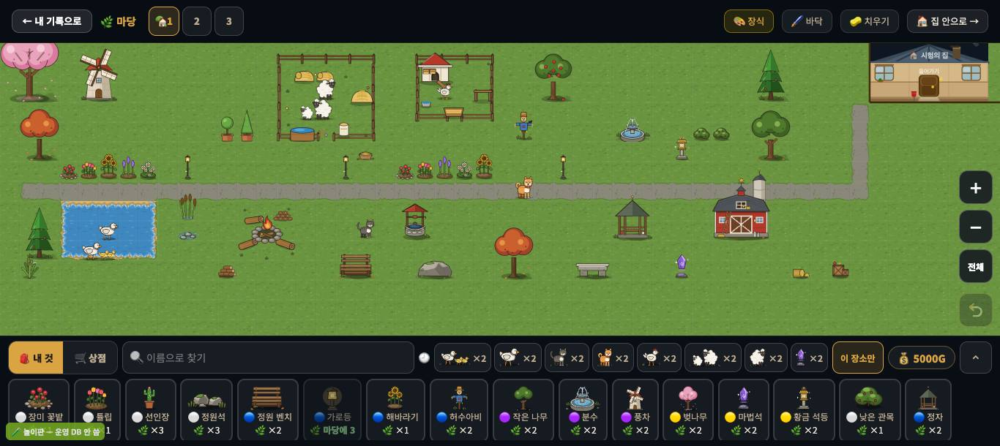
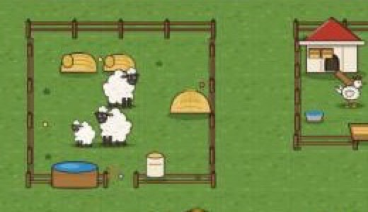
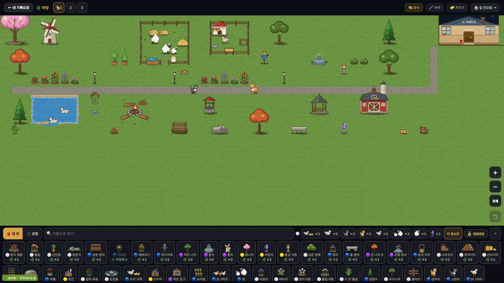
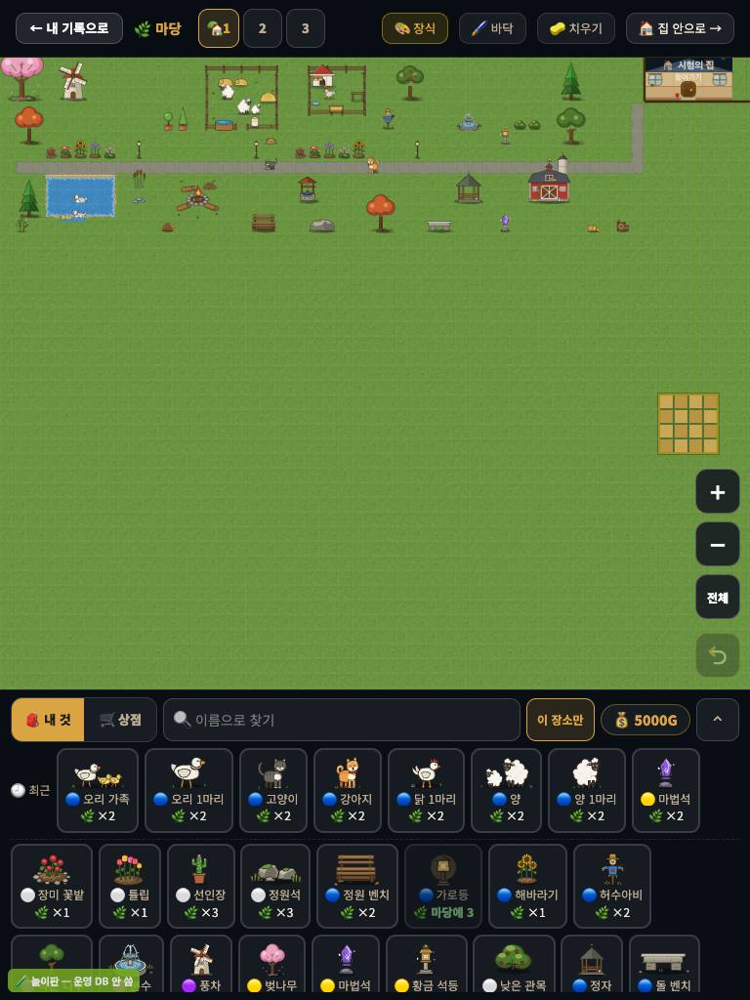

# 창조자의 눈 — 관찰 기록 31회: 꾸미기 마당 '우와' 판정 (30회와 같은 틀)

> 보스 요청: 오늘 동물 여덟 그림 · 울타리 · 러그 · 피아노가 새로 들어왔습니다(움직임 엔진은 아직). **꾸미기를 오래 한 아이의 마당**을 만들어 — 첫 10초 눈이 가는 곳 셋 · 스타듀밸리/동물의 숲과 견줘 가장 모자란 하나 · 이미 좋은 하나 · 그림 결이 따로 노는 것(새 ↔ 옛) · 크기 위계.
> 본 판: 꾸미기 놀이판 `play.mjs 8784`(가짜 프로젝트 · 오프라인) · main `1c25f18` · **코드 수정 0**.
> **화면에 창을 띄우지 않았습니다.** headless 크롬 스크립트(CDP) 하나로 짓고·찍고 껐습니다. 운영 요청은 막았습니다(0). 놀이판은 장식을 3개씩만 주어서, **울타리로 두른 우리 대신 '양 목장'·'닭장' 우리 장식**을 썼습니다.
> **지은 마당**(진짜 누르기 · 카드 고르기만 `selectDeco`): 바닥 🖌️ 기본 → 물 15칸(연못) · 자갈 47칸(길) · 장식 **52개**(우리 둘 · 큰 건물 6 · 나무 9 · 꽃 10 · 가로등·석등·벤치·소품 · 동물 **일곱** — 양 둘(목장 안) · 닭(닭장 안) · 강아지 · 고양이 · 오리 둘(연못)). 다 지은 뒤 **나갔다가 다시 들어와** 첫 10초를 봤습니다.
> **사실 / 해석 / 가설**을 나누고 고칠 것은 **ⓐ / ⓑ / ⓒ**. 판정은 **제 눈**입니다.

## 한 줄
**그림 하나하나는 이미 '예쁜 게임' 수준입니다 — 복슬복슬한 양이 건초와 물통이 있는 목장 안에 있고, 빨간 헛간·풍차·벚나무가 또렷합니다. '우와'를 막는 것은 땅입니다: 한 가지 초록에 모눈선이 온 마당에 그어져 있어 **스티커를 모눈종이에 붙인 모습**이고, 넓은 마당이라 52개를 놓아도 1920 화면의 절반이 빈 풀밭입니다. 크기 위계도 흔들립니다 — 닭·오리·고양이·강아지·양이 거의 같은 크기이고, '작은 나무'와 '큰 나무 B'가 같은 크기입니다.**

---

## 1. 첫 10초 — 눈이 먼저 가는 곳 셋 (1366×610)

| 차례 | 눈이 가는 곳 | 까닭(사실) | 해석 |
|---|---|---|---|
| 1 | **분홍 벚나무 · 주황 단풍 나무**(왼쪽 위 모서리) | 화면에서 가장 센 분홍·주황 · 큰 둥근 덩어리 | 예쁩니다. 다만 **모서리**에 있어 눈이 가장자리로 먼저 끌려갑니다 |
| 2 | **빨간 헛간**(오른쪽 가운데) | 가장 크고 채도 높은 빨강 덩어리(80×97px) | 가장 '게임 같은' 물건입니다 |
| 3 | **양 목장**(위 가운데) | 울타리 네모 안의 흰 양 셋 · 건초 · 물통 | **가장 이야기가 있는 곳**입니다(아래 사진) |

**사실** — 다시 들어온 뒤 10초 동안 **토스트 0**. 동물은 들썩이며 몇 칸 걷습니다(움직임 엔진은 27회 그대로).
**사실** — 오른쪽 위 **내 집이 머리줄에 잘려** 반쯤 보입니다(디자인 D1·D7 과 **겹침**).
**해석** — 10초 동안 **조용히 구경**하게 둡니다(마을 30회와 달리 '할 일' 말이 없음 ✅). 눈은 **모서리 → 오른쪽 → 위 가운데** 순서로 흩어집니다 — 한가운데 '볼 곳'은 없습니다(자갈길이 가로질러 지나갈 뿐).

## 2. 요즘 게임과 견주어 — 정직하게

**가장 모자란 한 가지 — 땅이 '모눈종이'입니다.**
- **사실** — 마당 전체가 **한 가지 초록 잔디 무늬**이고, **칸마다 모눈선**이 보입니다(꾸미기 화면 · 1366·1920·768 모두). 물건은 칸에 맞춰 **줄지어** 서고, 땅과 이어지는 그림(풀이 물건 발밑을 덮기 · 흙길 가장자리 번짐 · 그림자)이 거의 없습니다. 연못은 모래 테두리로 잘 이어지는 드문 예외입니다.
- **해석** — 스타듀밸리의 농장은 **흙·풀·돌길이 섞인 땅** 위에 물건이 **겹쳐** 서고, 동물의 숲은 **풀 무늬·꽃·길 닳음**이 땅을 살아 있게 합니다. 여기는 물건 하나하나는 예쁜데 **땅이 도화지**라, 다 모아 놓아도 "스티커 판"으로 보입니다. 동물이 늘 모든 물건 **앞**에 그려지는 것(27회)도 같은 느낌을 키웁니다.
- **가설** — 모눈선을 **고를 때만**(물건을 든 동안만) 보이게 하고, 잔디에 **두세 가지 풀빛 얼룩**을 섞기만 해도 첫인상이 크게 바뀔 것입니다.

**이미 좋은 한 가지 — 그림 한 장 한 장의 완성도.**
- **사실** — 새 동물(양 · 강아지 · 고양이 · 닭)은 굵은 외곽선 · 부드러운 명암의 같은 만화 결이고, 헛간 · 풍차 · 벚나무 · 과수나무 · 캠프파이어도 같은 결입니다. 양 목장은 **건초 · 물통 · 사료통**까지 들어 있어 **한 장면**으로 읽힙니다.
- **해석** — "귀엽다"는 첫말은 이미 나올 그림입니다. 이 결은 지키면 됩니다.

## 3. 그림 결이 따로 노는 곳 (새 ↔ 옛)

| 물건 | 무엇이 다른가(사실 · 사진 눈대중) | 해석 |
|---|---|---|
| **가로등**(`d_y6`) | 가는 검은 막대에 작은 등 — 다른 물건보다 **선이 얇고 어두움** · 19×35px | 굵은 외곽선 만화 결 사이에서 **연필 선**처럼 보입니다 |
| **징검돌 · 갈대 묶음** | 회색 점 몇 개 · 가는 풀줄기 | 너무 작고 흐려 **떨어진 부스러기**처럼 보입니다 |
| **마법석**(보라 수정) | 반짝이는 보석 명암 — 다른 것은 평평한 색면 | 혼자 **다른 게임의 아이템**처럼 보입니다 |
| **분수**(`d_y10`) | 48×33px로 낮고 작음 · 옅은 회청색 | 광장 분수가 **작은 물그릇**처럼 보입니다 |
| **오리 가족** | 새 오리 1마리와 나란히 두면 **선 굵기·흰색 톤**이 다름 | 연못 안에서 두 결이 섞입니다 |
| 내 집(`yard_house`) | 판자벽·창틀까지 세밀 · 이름 푯말 | 세밀함은 좋은데 **다른 물건보다 한 단계 촘촘**합니다(잘려 보이는 것은 D1·D7) |

(새 그림 목록을 PR 단위로 대조하지는 않았습니다 — 위는 **한 화면 안에서 결이 튀어 보이는 것**을 눈으로 고른 것입니다.)

## 4. 크기 위계 — 보이는 상자(`bbox.json` · 한 칸 27px)

| 물건 | 칸 | 보이는 크기 |
|---|---|---|
| 닭 1마리 | 1×1 | 24×25px |
| 오리 1마리 | 1×1 | 27×25px |
| 고양이 | 1×1 | 26×27px |
| 양 1마리 | 1×1 | 27×31px |
| 강아지 | 1×1 | 26×32px |
| 울타리 한 칸 | 1×1 | 27×25px |
| 가로등 | 1×1 | 19×35px |
| 분수 | 2×2 | 48×33px |
| **작은 나무** | 2×2 | **54×70px** |
| **큰 나무 B** | 2×2 | **54×72px** |
| 풍차 | 2×2 | 53×74px |
| 정자 | 2×2 | 54×62px |
| 헛간 | 3×2 | 80×97px |
| 벚나무 | 3×3 | 81×105px |

**사실** — 동물 다섯이 **24~32px 로 거의 같은 크기**입니다(닭 ≈ 오리 ≈ 고양이 ≈ 양 ≈ 강아지). 울타리 한 칸도 같은 높이(25px)입니다.
**사실** — **'작은 나무'(54×70)와 '큰 나무 B'(54×72)가 같은 크기**입니다. **풍차(74)가 나무와 같은 높이**이고 헛간(97)보다 낮습니다. **가로등(35)이 강아지(32)보다 조금 클 뿐**입니다.
**해석** — 이름이 말하는 크기(작은/큰)와 그림 크기가 어긋나고, 동물들 사이에 **몸집 차이가 안 보입니다**(양이 닭만 합니다). 디자인 담당의 'B 크게'(닭 0.95칸 등)가 들어오면 이 표로 전·후를 견줄 수 있습니다.

## 5. 화면 크기별

**사실** — 마당 판은 **80×44칸**이고, 들어오면 카메라가 **왼쪽 위(판의 0,0)** 에서 시작합니다. 제가 지은 52개는 판의 위쪽 12줄에 있어서, 1920 에서는 **화면 아래 절반**, 768 에서는 **화면의 2/3** 가 빈 풀밭입니다. 768 에서는 아래 물건 상자가 화면의 약 30%입니다.
**사실** — 768 사진 오른쪽 가운데에 **제가 놓지 않은 밭 모양 한 덩어리**가 보입니다(까닭은 확인하지 못함 — 농장 칸일 수 있음).
**해석** — 이것은 **제 배치 탓이 반**입니다(위쪽에 모아 지음). 그래도 "오래 꾸민 아이의 마당"도 판의 일부만 채우고, **들어올 때 카메라가 물건이 있는 곳으로 맞춰 주지 않는** 것은 사실입니다(집 안 29회 ⓑ64 와 같은 종류).

---

# ⓐ 하던 일을 멈추고 고칠 것
없음.

# ⓑ 이번 묶음 안에서 고칠 것 (디자인·꾸미기 다듬기용)
- **ⓑ71.** **땅이 모눈종이** — 한 가지 잔디 + 늘 보이는 모눈선. 모눈은 '고르는 동안만' · 잔디에 풀빛 얼룩 두세 가지.
- **ⓑ72.** **동물 몸집이 다 같음**(24~32px) · **작은 나무 = 큰 나무 B** · 풍차가 나무 높이 · 가로등이 강아지 높이 — 크기 위계를 이름과 맞추기.
- **ⓑ73.** **결이 튀는 것** — 가로등(얇고 어두운 선) · 징검돌·갈대(부스러기처럼) · 마법석(보석 명암) · 분수(작은 물그릇).
- **ⓑ74.** **들어올 때 카메라가 물건 쪽으로 안 감** — 넓은 판의 왼쪽 위에서 시작(집 안 ⓑ64 와 같은 종류).

# ⓒ 적어 두고 실제 사용에서 확인할 것
- **ⓒ70.** 아이가 첫 10초에 **모서리의 벚나무부터 보는지**(제 눈 순서: 벚나무·단풍 → 헛간 → 양 목장).
- **ⓒ71.** 모눈선을 아이가 **'꾸미는 판'으로 편하게 여기는지, 방해로 여기는지.**
- **ⓒ72.** 양과 닭이 같은 크기인 것을 아이가 **알아채는지.**
- **ⓒ73.** 768 에서 보인 **안 놓은 밭 덩어리**가 무엇인지(농장 칸인지).

## 미검증 · 한계
- 우리는 **목장·닭장 장식**으로 대신했습니다(울타리가 3개뿐). 울타리로 두른 우리의 모습은 못 봤습니다.
- 러그 · 피아노(집 안 새 그림)는 이번 마당 판정에 넣지 않았습니다.
- '결이 튀는 것'은 **제 눈**이고, 어느 그림이 오늘 새로 들어온 것인지 PR 별로 대조하지 않았습니다.
- 크기는 `bbox.json`(그린 부분 상자)로 잰 것이고, 화면 속 들썩임·원근은 넣지 않았습니다.
