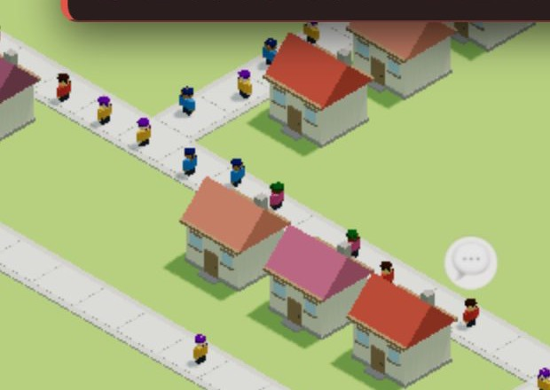
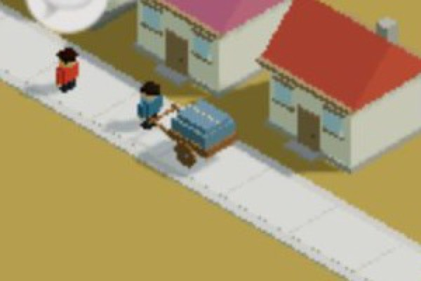

# 창조자의 눈 — 관찰 기록 33회: 머지된 것 되밟기 (#881 · #884 · #829/#840 · #816)

> 보스 요청: 32회 목록(`docs/clumsy_list.md`)에서 제안한 되밟기 순서 그대로 — **#881 사람 간격 · #884 수레 끄는 이웃 · #829/#840 흰 점(누른 집 문 앞) · #816 생업**. 되밟은 줄은 목록에서 ✔.
> 본 판: main `b38bada` · 제 서버 8781 · `?sid=guest` · **코드 수정 0**. **화면 창 0** — headless 크롬 스크립트(CDP)로만 · 판마다 새 프로필 · 끝나면 크롬·서버를 껐습니다. 그래픽은 `__gfxMode('high')`(보기 설정) · 사진은 2배 해상도.
> ⚠ **#881·#884 는 '그림만' 바꾼 고침**입니다(셈 속 위치는 그대로). 그래서 25회 탐지기(`__folkOverlap` — 셈 속 위치)로는 안 잡히고, **사진 + `__folkSpace()`·`__flowCart()`** 로 되밟았습니다.

## 한 줄
**넷 다 풀렸습니다. 흰 점은 이제 붐비는 집마다 제 문 앞을 짚고 그 칸 25/25 가 큰길로 넓힐 수 있는 칸입니다. 수레 앞에는 끄는 이웃이 섰고, 바닷가 부두는 생선을 만듭니다. 사람 간격은 '반만' 풀렸습니다 — 길 한가운데 한 줄은 풀렸는데 길 따라 한 칸에 한 명인 박자는 그대로이고, 마주 선 둘은 못 봤습니다.**

---

## 1. #881 사람 간격 — town3 (25-ⓑ53 · ⓑ51)

**사실** — `__folkSpace().지금` 을 0.5초마다 20번: **비켜섬 18~21명**(서 있는 사람 대부분) · **밀어냄 0** · **마주봄 0**.
**사실** — 셈 속 위치 훅은 그대로입니다: `__folkOverlap().가장가까운거리` **20/20 이 4.00** · 겹친쌍 0(25회와 같음 — 이 훅은 그린 자리를 안 봅니다).
**사실(사진)** — 25회엔 사람이 **길 한가운데 한 줄**로 구슬 꿰듯 섰는데, 지금은 **길 양쪽 가장자리로 번갈아** 비켜 서 있습니다. 그러나 **길을 따라 한 칸에 한 명씩**인 간격은 그대로 보입니다.
**해석** — '줄 세운 인형'의 **가운데 한 줄은 풀렸습니다.** '한 칸 한 명' 박자는 셈이 칸 단위라 남은 것으로 보이고, **무리 지어 서거나 마주 보는 모습**(가설로 적었던 것)은 이 판에서 한 번도 안 나왔습니다(마주봄 0).
**ⓑ51(포개짐)** — 그린 자리를 읽는 훅이 없어 **이번엔 되밟지 못했습니다**(town3 은 원래 포갬 0).

## 2. #884 수레 끄는 이웃 — farm (25-ⓑ54)

**사실** — 가게 (139,142) · 집 둘 · 밭 (148,142) → 2배속. 수레가 나올 때마다 `__flowCart().짐[0].끄는사람 = true` (세 번 모두) · 길칸 9 · 간것 0.06~0.23.
**사실(사진)** — 수레 **앞 손잡이에 파란 옷 이웃**이 서서 함께 갑니다(가게 쪽을 봄).
**해석** — 25회 '유령 수레'는 **닫혔습니다** ✔. 이제 "누가 옮기나"에 "이웃이 수레로"라고 답할 수 있습니다.

## 3. #829 / #840 흰 점 — mid36 (23-ⓑ38 · ⓑ40)

`?stage=farm` 새 프로필에 `mid36.json` 을 가져와 다시 연 뒤 8초.

| | 23회(#821 때) | **33회** |
|---|---|---|
| "길이 붐벼요" 집 | 26채 | **25채** |
| 짚는 칸 | 26채 모두 **같은 한 칸 (137,143)** | 25채가 **각자 제 문 앞 칸**(25/25) · 서로 다른 칸 **15곳** |
| 그 칸에 큰길(`__try('avenue')`) | 짚은 칸 두 곳 모두 **"곁에 물러날 자리가 없어요"** | **25/25 "🏠 이 집이 한 칸 물러나요 — 두 번 눌러 큰길을 깔아요"**(놓을 수 있음) |
| 🛣️ 권유 말 | 18채 | 15채 |
| 진짜 누르기 | 흰 점 1 | 멀리 떨어진 집 둘을 누름 → `__where().짚음` 1 → 2 |

**해석** — 23회 ⓑ38(점이 안 되는 칸을 짚음)과 ⓑ40 의 앞쪽(판 끝 집도 한 칸)은 **닫혔습니다** ✔. 이제 "우리 집 문 앞을 넓히면 우리 집이 풀린다"로 한 수가 **제자리**에 있습니다.
**가설** — 그 한 수가 **"집이 한 칸 물러난다"(두 번 누름)** 라, 아이가 자기 집이 움직이는 것을 **놀라거나 싫어할 수** 있습니다. 확인은 실제 아이에게.
**남은 것** — 붐빔 칩은 여전히 없습니다(23-ⓑ40 뒤쪽).

## 4. #816 생업 — 바닷가 (22-ⓑ30)

**사실** — `?stage=sea` 판 목표: "주민이 쓸 수 있는 **부두 2곳** · 주민이 쓸 수 있는 가게 하나 · 주민 20명". 흐름 물건이 **생선**입니다(`__flow().물건 = '생선'`).
**사실** — 가게 (140,142) · 집 둘 · 부두 (147,142) → 2배속: 만듦 1 → 짐 1 → 닿음 1. 가게 카드: "**가게 · 생선 1/8 · 물건이 있어요** · 장 볼 곳 · 파란 길까지 닿아요 · 노란 집 2채 · 일자리 1/4".
**해석** — 22회 ⓑ30(생업 없음)은 **닫혔습니다** ✔ — 바닷가 사람은 부두에서 생선을 얻어 가게로 보냅니다. 목표도 '쓸 수 있는' 부두로 바뀌었습니다(22-ⓑ32 일부).
**남은 것** — 부두는 여전히 **모래 위**에 놓입니다(바다 칸 없음 — 22-ⓑ28 · 지형 설계 #898 대기).

---

## 목록(`docs/clumsy_list.md`)에서 고친 줄

| 줄 | 전 | 후 |
|---|---|---|
| 22-ⓑ30 생업 | 닫힘(되밟기 전) | 닫힘 ✔33회 |
| 22-ⓑ32 목표 '놓으면 끝' | 맡음 | 바닷가는 '쓸 수 있는 부두'로 바뀜(일부) · 산지·농촌은 되밟기 전 |
| 23-ⓑ38 흰 점 | 닫힘(되밟기 전) | 닫힘 ✔33회 |
| 23-ⓑ40 토막 하나 · 칩 | 짚는 칸 닫힘 · 칩 열림 | 짚는 칸 ✔33회 · **칩은 열림** |
| 25-ⓑ53 줄 세운 인형 | 닫힘(되밟기 전) | **일부** ✔33회 — 가운데 한 줄은 풀림 · 한 칸 한 명 박자 · 마주봄 0 |
| 25-ⓑ54 유령 수레 | 닫힘(되밟기 전) | 닫힘 ✔33회 |
| 25-ⓑ51 포개진 사람 | 닫힘(되밟기 전) | 그대로(그린 자리 훅이 없어 되밟지 못함) |

# ⓐ 없음
# ⓑ
- **ⓑ75.** 사람 간격 — **한 칸 한 명 박자**가 남음 · 마주봄 0(25-ⓑ53 의 나머지).
- **ⓑ76.** 그린 자리를 읽는 훅이 없어 **포갬(ⓑ51)을 되밟을 수 없음** — `__folkSpace()` 에 '그린 자리 기준 가장 가까운 거리 · 겹친 쌍'을 더하면 25회 탐지기를 그대로 쓸 수 있습니다.
# ⓒ
- **ⓒ74.** 흰 점의 한 수가 '집이 한 칸 물러남'이라 — 아이가 자기 집이 움직이는 것을 받아들이는지.

## 미검증
- headless 소프트웨어 그림입니다. 사람 간격은 **한 판(town3) · 10초**만 봤습니다.
- 흰 점은 mid36 한 판 · 가져온 직후 8초 값입니다(자리 잡은 뒤 토막 합쳐짐은 안 봄).
