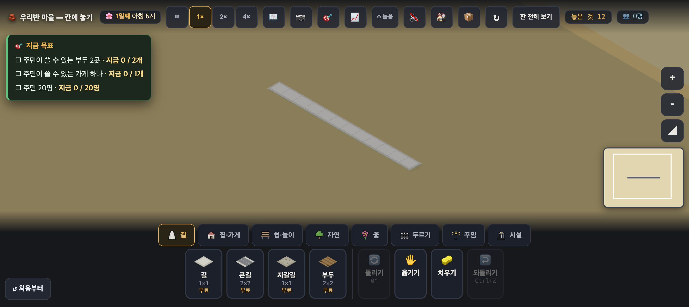
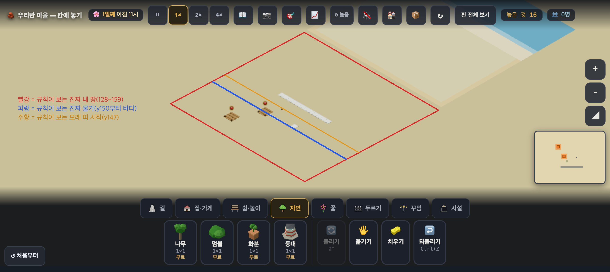

# 창조자의 눈 — 관찰 기록 34회: 바닷가 지형(#907) 되밟기

> 보스 요청: 바다·모래 칠하기와 놓기 규칙(물엔 부두만 · 물가에 걸쳐야 · 모래엔 밭 ✕) · 22-ⓑ28(부두가 모래 위)이 닫혔나 · **땅 전체가 모래라 사막처럼 읽히나** · 아이가 "여기엔 왜 못 놔?"를 알 수 있는 말이 나오나. headless 로만.
> 본 판: main `3a13b26` · 제 서버 8781(견줄 옛 판 09-15 `4fbd3a9` 은 8782) · `?sid=guest&stage=sea` · **코드 수정 0 · 화면 창 0** — headless 크롬 스크립트(CDP)로만 보고, 판마다 새 프로필을 썼습니다. 끝나면 크롬과 서버를 껐습니다. 사진은 2배 해상도입니다.
> 놓기는 **진짜 누르기**로 했습니다. 커서를 올려 `__whyup()`(커서 옆 풍선 `#why`)을 읽고, 누른 뒤 `#toast` 를 읽었습니다. `__try(종류, x, y)`(읽기 전용)도 함께 적었습니다.

## 한 줄
**규칙은 들어왔습니다. 그런데 바다는 규칙이 보는 곳에 그려지지 않았습니다.** 바다·모래·'내 땅' 네모가 판 위에 **남북으로 뒤집혀 한 구역(32칸) 북쪽**에 그려집니다. 그래서 아이가 노는 첫 화면에는 바다가 한 칸도 없고, 모래색 땅 전체가 '잠긴 땅' 색입니다. 거기를 누르면 "🌊 바다에는 지을 수 없어요"가 나옵니다. **사막처럼 읽히는 까닭의 첫째는 이것**입니다. 이 어긋남은 #907 이 만든 것이 아닙니다. 마을 첫 파일(#210)부터 있었고, 모든 판에서 '내 땅' 네모가 어긋나 있습니다. 바다를 칠하면서 비로소 눈에 띄었습니다.

---

## 1. 첫 화면 — 사막처럼 읽히나

**사실**
- 첫 화면(1366, 기본 카메라)에서 규칙이 '풀'·'모래'·'물'이라 하는 칸 7곳을 짚었습니다. 셋 다 **화면 색이 똑같습니다**: 아침 6시 `(143,128,91)`, 15초 뒤 `(190,180,142)`. 칸은 (143,140 풀) · (143,147~149 모래) · (143,150~153 물) · (135,150 물) · (130,158 물)입니다.
- 그래픽을 자동·높음·중간·낮음으로 바꿔도 다섯 곳이 한 색이었습니다(밝기만 다름). 그래서 그래픽 설정 탓이 아닙니다.
- `__terrain()` = `{켜짐: true, 칸: 27904, 칠함: 416}` — 칠은 했습니다. 416 칸은 첫 구역(128~159)의 모래 96칸과 물 320칸을 더한 수와 같습니다.

**해석** — 칠한 곳이 화면의 다른 자리에 있습니다(아래 2). 아이가 보는 자리에는 칠이 없습니다. 그래서 그 자리는 판의 '잠긴 땅' 색(`바닥 #c8b98c`)이고, 온 화면이 모래·흙색입니다. → **사막으로 읽힙니다.** 보스의 눈이 맞습니다.

## 2. 그려진 곳 ≠ 규칙이 보는 곳 (34-ⓐ6)

(선은 제가 스크린샷 위에 그렸습니다. 칸 → 화면 자리는 `__cellScreen` 세 점으로 잰 1차 변환입니다. 선 없는 원본: `img/round34/03a_wide_raw.jpg`)

**사실**
- 멀리 본 화면(`__view` 로 확대 배율만 0.4배)에서, 밝은 '내 땅' 네모·흙 테두리·모래 띠·파란 바다가 **오른쪽 위에 따로** 있습니다. 첫 길과 제가 놓은 부두·나무는 그 밖의 **어두운 땅** 위에 있습니다.
- 규칙으로 재 봤습니다. 밝은 네모 안의 칸 (150,118)·(150,100)·(143,127)에 `__try('road')`를 하면 셋 다 **"아직 내 땅이 아니에요 · 인구 10명이면 옆 땅이 열려요"**입니다. (143,128)부터는 `true` 입니다. `__snapshot().구역 = ["4,4"]`(x·y 128~159)입니다.
- 사진 속 밝은 네모의 아래 꼭짓점은 칸 **(159,127)**에 해당합니다. 진짜 구역의 같은 꼭짓점은 (159,159)입니다. 파란 바다는 그 네모의 **먼 쪽(y 작은 쪽)**에 그려져 있습니다. → **y 가 255−y 로 뒤집혀** 그려진 것과 맞습니다(한 칸씩 밀린 것이면 바다가 가까운 쪽에 있어야 합니다).
- **판 여럿 · 옛 판에서 같습니다**: 기본 판과 farm 도 밝은 네모가 첫 길과 떨어져 오른쪽 위에 있습니다. **09-15 판(`4fbd3a9`)도 같습니다.** #907 앞에서부터 있었습니다.

**해석** — 아이가 보는 '내 땅'은 사실 잠긴 땅이고, 진짜 내 땅은 잠긴 땅 색으로 보입니다. 초록 판에서는 풀색과 잠긴 땅 색이 비슷해 눈에 덜 띄었습니다. 바닷가는 파란색이 들어오면서 드러났습니다.
- 바닷가에서 아이가 겪는 일: 모래색 땅을 눌렀는데 "🌊 바다에는 지을 수 없어요"가 나옵니다.
- 바다처럼 보이는 파란 곳에는 가지도 못합니다("아직 내 땅이 아니에요").

**가설(코드를 읽은 것 · 고치지 않음)** — `paintBoard` 가 구역을 캔버스 `(H − y0 − PLOT)` 줄에, 지형 칠이 `(H − 1 − y)` 줄에 그립니다. 그런데 판(`PlaneGeometry` 를 x축으로 −90° 눕힘 · 텍스처 flipY 기본)에서는 **캔버스 위쪽이 −z = y 가 작은 쪽**입니다(주석도 "캔버스 위가 판의 −z 쪽"). 그래서 줄 번호를 뒤집을 까닭이 없어 보입니다. 미니맵(`drawMap`)과 같은 규칙이라 적혀 있으니 미니맵도 함께 봐야 합니다. **고치는 쪽의 판단이 필요합니다.**

## 3. 놓기 규칙과 "왜 못 놔?" 말

(사진 `02_after_tries.jpg` — 부두 둘 다 **모래색 땅 위**에 🚫(길이 없어 못 씀)을 달고 있고, 먼 바다 부두와 물가 부두가 똑같아 보입니다.)

| # | 한 것 | 바닥(규칙) | 놓였나 | 커서 풍선(`#why`) | 누른 뒤(`#toast`) |
|---|---|---|---|---|---|
| A | 바다에 길 (140,152) | 물 | ✕ | **🌊 바다에는 지을 수 없어요 — 부두는 물가에 놓아요** | 없음 |
| B | 바다에 집, 곁에 길 없음 (143,152) | 물 | ✕ | 집은 길에 붙어야 해요. 먼저 ⬜ 길을 놓아 주세요 | 💡 노란 자리에 놓을 수 있어요 — 길 바로 옆이에요 |
| C1 | 모래 띠에 길 (146,149) | 모래 | ○ | — | — |
| C2 | 그 길 바로 옆 바다에 집 (146,150) | 물 | ✕ | **🌊 바다에는 지을 수 없어요** … | **집은 길에 붙여 놓아요 — 사람이 드나들거든요** |
| D | 물가에 걸친 부두 (139,149) | 모래+물 | ○ | — | — |
| E | 뭍 한가운데 부두 (146,140) | 풀 | ✕ | **🪵 부두는 물가에 — 바다에 걸치게 놓아요** | 없음 |
| F | **먼 바다 부두 (136,154) — 네 칸 모두 물** | 물 | **○** | — | — |
| G | 모래에 나무 (141,147) | 모래 | ○ | — | — |

- 밭: 바닷가 판에는 밭이 없습니다. `__try('field', 모래/풀/물)` 은 셋 다 "이 판에서는 쓰지 않아요"입니다. **"모래엔 밭 ✕"는 지금 어느 판에서도 아이가 만날 수 없습니다**(지형이 있는 판이 바닷가 하나뿐).

**해석**
- **22-ⓑ28 은 규칙 쪽만 닫혔습니다.** 뭍 한가운데 부두는 막히고, 막을 때 말이 좋습니다(E).
- 그러나 ① 부두가 놓이는 곳이 **화면에선 여전히 모래 위**입니다(ⓐ6). ② **먼 바다 한가운데 부두도 놓입니다**(F). 규칙이 "모두 물·모래 + 한 칸 이상 물"이라, 네 칸이 다 물이어도 통과합니다. 보스가 적은 "물가에 걸쳐야"와 다릅니다.
- "왜 못 놔?" 말은 **길·부두에는 있습니다**(A·E, 커서 풍선).
- 집은 **이유가 둘로 갈립니다**. C2 에서 커서 풍선은 "바다"라 하는데, 누르면 토스트가 "길에 붙여 놓아요"라 합니다. 길 바로 옆이라 아이는 헷갈립니다. B 처럼 곁에 길이 없으면 바다라는 말이 아예 안 나옵니다.

---

## ⓐ
- **ⓐ6.** 판 칠(내 땅 네모·흙 테두리·바다·모래)이 **남북으로 뒤집혀 한 구역 북쪽**에 그려짐 — 규칙·물건과 어긋남. 모든 판 · #210 부터. 바닷가에서는 첫 화면에 바다가 없고, 모래색 땅을 누르면 "바다"라는 말이 나옵니다. (가설: `paintBoard` · 지형 칠의 캔버스 줄 뒤집기 · 미니맵도 함께 볼 것)

## ⓑ
- **ⓑ77.** 먼 바다 한가운데 부두가 놓임(네 칸 모두 물) — "물가에 걸쳐야"가 아님. 재는 법: `__try('pier', 136, 154)` 가 true 인가.
- **ⓑ78.** 바다 위 집의 이유가 둘로 갈림 — 커서 풍선 "🌊 바다" · 누른 뒤 토스트 "길에 붙여 놓아요"(길 바로 옆인데). 곁에 길이 없으면 "바다" 말이 아예 안 나옴.
- **ⓑ79.** "모래엔 밭 ✕"를 아이가 만날 판이 없음(바닷가엔 밭이 없고, 다른 판엔 지형이 없음) — 규칙은 있으나 보이지 않음.
- **ⓑ80.** '판 전체 보기'(지도)에도 바다가 없음(미니맵과 같음 — #907 이 적은 '미니맵 다음'과 함께).
- **ⓑ81.** 뭍 색(`풀 #ddd0a4`)이 모래 띠(`#efe0b6`)와 가까움 — ⓐ6 을 고친 뒤에도 "해안 띠만 모래"로 읽히는지 **되밟아야** 함(지금은 ⓐ6 때문에 잴 수 없음). PR #907 첫 칠 사진에선 뭍·모래 띠·물가·바다가 구분되지만, 뭍과 모래의 차이가 작습니다.

## ⓒ
- **ⓒ75.** 바다가 제자리에 그려진 뒤, 아이가 "🌊 바다에는 지을 수 없어요"를 **파란 곳과 이어** 받아들이나 — 그리고 부두를 "물에 걸쳐" 놓는 것을 스스로 찾나.

## 목록(`docs/clumsy_list.md`)에서 고친 줄

| 줄 | 전 | 후 |
|---|---|---|
| 22-ⓑ28 부두가 모래 위 | 보류(설계 #898) | **일부(#907)** — 규칙 ✔34회(뭍 부두 막힘·말 있음) · 그림은 제자리 아님(34-ⓐ6) · 먼 바다 부두(34-ⓑ77) |
| 새 줄 | — | 34-ⓐ6 · ⓑ77~81 · ⓒ75 |

## 미검증
- headless 소프트웨어 그림입니다. 색은 스크린샷 픽셀로 쟀습니다(조명·시간 따라 밝기가 바뀝니다 — 아침 6시와 15초 뒤를 둘 다 쟀습니다).
- '뒤집힘'은 **사진 한 장의 꼭짓점 · 바다가 놓인 쪽 · 규칙 훅**으로 맞춘 것입니다. 캔버스 픽셀을 직접 읽지는 않았습니다(boardCv 는 모듈 안이라 못 읽습니다).
- 옛 판(09-15)은 **기본 판 한 번**만 열어 봤습니다.
- 통과(놓임·말)는 **조작·표시 길만** 뜻합니다. 아이가 말을 읽고 이해하는지는 ⓒ 입니다.
