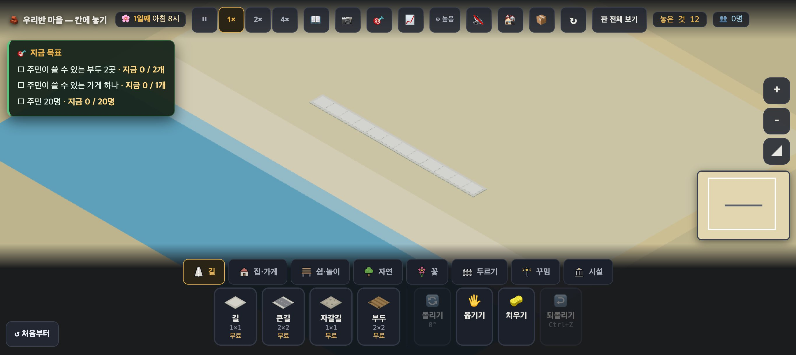
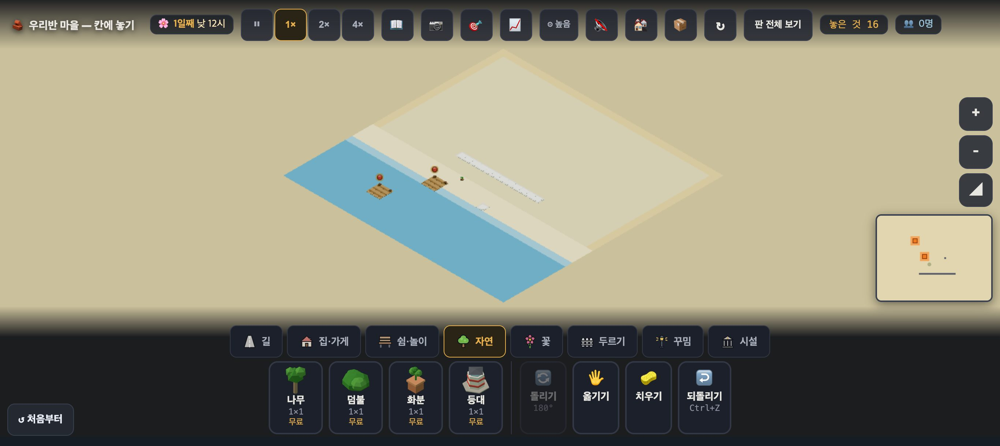
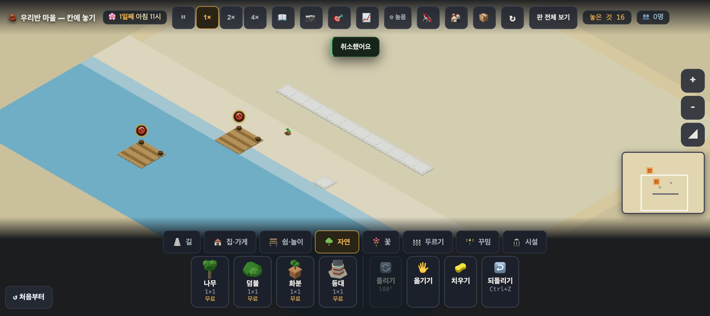
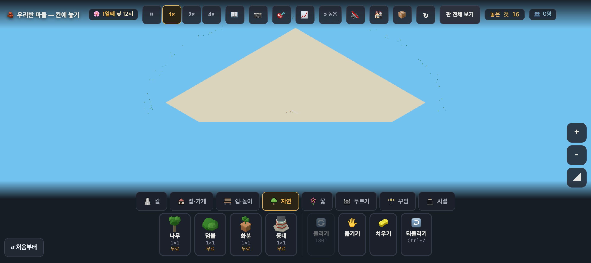
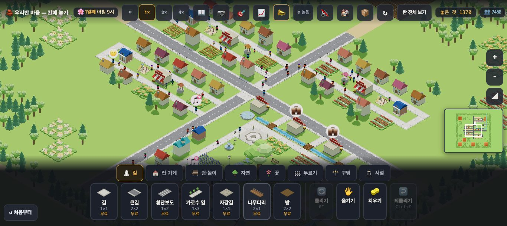
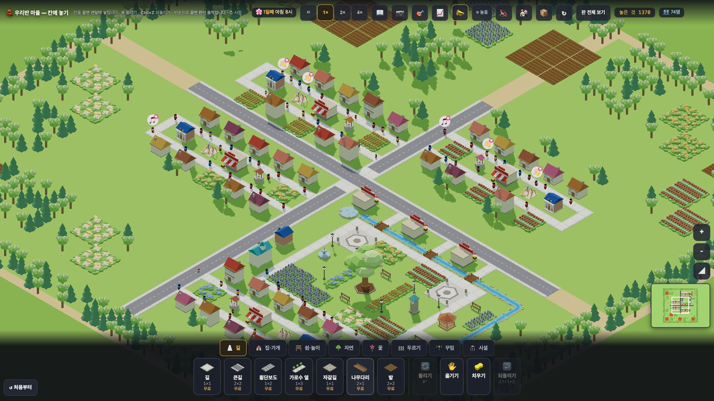
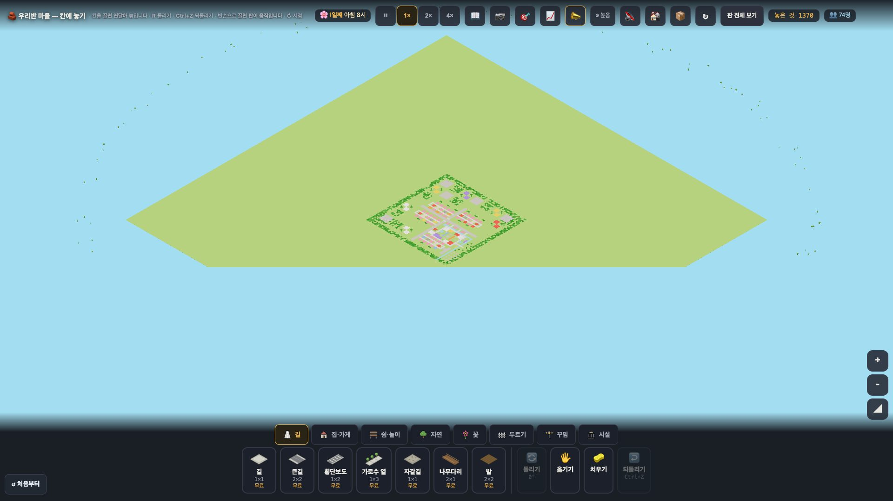

# 창조자의 눈 — 관찰 기록 35회: 바닷가 되밟기(#922 뒤) · 원본 마을 '우와' 다시 (30회 틀)

> 보스 요청: ① **바닷가 되밟기** — 바다가 규칙 자리에 그려지나 · 34-ⓑ81(뭍 색이 모래빛이라 사막처럼 읽힘 — 산 판 PR 에 sea 풀빛이 같이 옴, 그 전·후) · 34-ⓑ77 먼 바다 부두 · 34-ⓑ78 바다 위 집 이유 둘. 닫힌 것은 목록에서 ✔. ② **원본 마을**(`?stage=origin` · #878 머지됨)을 30회 틀로 한 번 더 — '우와'에 얼마나 다가갔나.
> 본 판: main `8a93e99`(#922 판 칠 뒤집힘 고침 들어감) · 제 서버 8781 · `?sid=guest` · **코드 수정 0 · 화면 창 0** — headless 크롬 스크립트(CDP)만 썼고, 판마다 새 프로필을 썼습니다. 끝나면 크롬과 서버를 껐습니다. 운영 요청은 막았습니다(0).
> 산 판 PR 은 아직 열리지 않았습니다. 그래서 34-ⓑ81 은 **'전'만** 쟀습니다. '후'는 그 PR 이 머지된 뒤 같은 자리에서 다시 잽니다.

## 한 줄
**바닷가: 바다가 이제 규칙 자리에 그려집니다 ✔.** 파란 곳을 누르면 "🌊 바다", 모래 띠에는 길·나무가 놓입니다. 다만 ① 뭍과 모래 띠의 색이 거의 같아 **해안 띠만 모래로 읽히지는 않습니다**(34-ⓑ81 그대로). ② 바다가 열린 구역 안에만 칠해져 **네모난 연못**처럼 보입니다. ③ 먼 바다 부두와 집 이유 둘도 그대로입니다.
**원본 마을: 교실 TV(1920)에서는 '우와'에 많이 다가갔습니다.** 큰 나무 공원·개울과 다리·숲 테두리가 생겼습니다. 그런데 **크롬북 화면(1366)에서는 그 공원이 물건 상자 뒤에 숨습니다.** 시작 카메라가 여전히 회색 큰길 교차로에 맞춰져 있기 때문입니다.

---

# 1부 · 바닷가

## 1. 바다가 규칙 자리에 그려지나 — ✔

**사실** — 첫 화면(1366, 기본 카메라)에서 규칙이 말하는 바닥과 화면 픽셀 색을 견줬습니다(연 직후 6시와 15초 뒤 8시, 두 번):

| 칸 | 규칙(`__terrain`) | 6시 픽셀 | 8시 픽셀 |
|---|---|---|---|
| (143,140) · (143,146) | 풀(뭍) | (157,146,113) | (202,195,165) |
| (143,148) | 모래 | (169,158,129) | (210,204,180) |
| (143,150) | 물(물가 줄) | (91,134,153) | (147,186,199) |
| (143,152) · (140,153) | 물 | (44,105,136) | (93,160,186) |

34회에는 이 칸들이 **모두 한 색**이었습니다.
멀리 본 화면(`__view` 배율만 0.4배)에서도 밝은 '내 땅' 네모가 첫 길과 물건을 **둘러쌉니다**. 파란 바다는 그 네모의 y 큰 쪽, 곧 규칙 자리에 있습니다.

**해석** — 34-ⓐ6(판 칠 뒤집힘)은 **닫혔습니다** ✔(#922). 22-ⓑ28 도 이제 규칙과 그림이 같은 자리입니다 ✔ — 부두는 파란 물가에 걸쳐 놓이고, 뭍에는 안 놓입니다.

## 2. 사막처럼 읽히나 — 34-ⓑ81 '전'

**사실** — 8시에 뭍 (202,195,165)와 모래 띠 (210,204,180)는 **세 값 모두 15 안쪽**으로 차이가 납니다. 물가 (147,186,199)와 바다 (93,160,186)는 뭍과 뚜렷이 다릅니다. 사진에서 모래 띠는 뭍보다 **조금 더 흰 줄**로만 보입니다.
**해석** — 바다가 보이니 34회처럼 '온통 사막'은 아닙니다. **"바닷가"로는 읽힙니다.** 그러나 뭍 전체가 모래빛이라 **"모래섬 위의 마을"**에 가깝습니다. 보스 말씀대로 **해안 띠만 모래**로 읽히려면 뭍에 풀빛이 들어와야 합니다. → **산 판 PR(sea 풀빛)이 머지된 뒤 같은 칸·같은 시각(연 직후 · 15초 뒤)으로 '후'를 잽니다.**

## 3. 바다가 네모 연못처럼 보임 (새 35-ⓑ82)

**사실** — 멀리 본 사진에서 파란 칠은 **열린 구역(128~159) 안에서만** 보입니다. 구역 끝에서 반듯한 직선으로 끊기고, 그 밖(잠긴 땅)은 모래빛입니다. #907 설명과 같습니다("열린 구역 안의 지형 칸만 칠한다").
**해석** — 판을 멀리서 보면 바다가 아니라 **모래밭 안의 네모난 수영장**처럼 읽힙니다. 첫 화면 가까이에서는 구역 끝이 화면 밖이라 덜 보입니다. 지금 원본 마을처럼 줌을 빼거나 판 전체 보기를 쓰면 보입니다.
**가설** — 잠긴 땅의 물 칸도 (잠긴 땅처럼 조금 어둡게) 파랗게 칠하면, 바다가 판 끝까지 이어져 보일 것입니다.

## 4. 놓기 규칙 — 34회와 같은 여덟 가지를 다시

| # | 한 것 | 바닥 | 놓였나 | 커서 풍선(`#why`) | 누른 뒤(`#toast`) | 34회와 |
|---|---|---|---|---|---|---|
| A | 바다에 길 | 물 | ✕ | 🌊 바다에는 지을 수 없어요 — 부두는 물가에 놓아요 | — | 같음 |
| B | 바다에 집(곁에 길 없음) | 물 | ✕ | 집은 길에 붙어야 해요… | 💡 노란 자리에… | 같음 |
| C1 | 모래 띠에 길 | 모래 | ○ | — | — | 같음 |
| C2 | 그 길 옆 바다에 집 | 물 | ✕ | **🌊 바다에는 지을 수 없어요** | **집은 길에 붙여 놓아요 — 사람이 드나들거든요** | **같음(34-ⓑ78 남음)** |
| D | 물가에 걸친 부두 | 모래+물 | ○ | — | — | 같음 · 이제 **파란 물가에 걸쳐 보임** ✔ |
| E | 뭍 한가운데 부두 | 풀 | ✕ | 🪵 부두는 물가에 — 바다에 걸치게 놓아요 | — | 같음 |
| F | **먼 바다 부두 (136,154)** | 물 | **○** | — | — | **같음(34-ⓑ77 남음)** · 이제 **물 한가운데 떠 있는 뗏목**으로 보임 |
| G | 모래에 나무 | 모래 | ○ | — | — | 같음 |

**해석** — "왜 못 놔?"의 말은 파란 곳과 이제 **맞습니다**(A·E). 먼 바다 부두(F)는 그림이 제자리가 되니 **더 눈에 띕니다**. 해안에서 다섯 칸 떨어진 물 위에 🚫 을 단 부두 하나가 떠 있습니다.

## 5. 판 전체 보기 — 34-ⓑ80 그대로

**사실** — 판 전체 보기(지도)에는 여전히 **파란 칸이 없습니다**. 판 전체가 한 가지 모래빛입니다(#922 는 지도의 **자리**만 고쳤고, 지도에 지형을 그리는 일은 아직입니다).

---

# 2부 · 원본 마을 '우와' (30회 틀)

**판** — `?stage=origin` 을 새 프로필로 열었습니다.
- 물건 **1370**(30회 937), 주민 74, 구역 4.
- 새로 보이는 것: 개울 44칸 · 나무다리 · 연못 1 · **마을 나무(villtree) 1** · 정자 1 · 과일나무 15 · 밭 49 · 긴의자 4.
- 가게 7(30회 14) · 가로등 6(30회 21).

## 1. 첫 10초 — 눈이 먼저 가는 곳

**사실(1366 · 크롬북 크기)**
- 연 뒤 10초 동안 `#toast` 는 **0번** 떴습니다(30회에는 "🔓 땅을 하나 더…" · "🗺️ 노란 땅이 화면 밖에…").
- 화면 가운데는 여전히 **회색 큰길 X자의 교차점**입니다.
- 마을의 심장(공원 쪽)이 화면 어디에 있는지 쟀습니다(`__cellScreen`). 이 훅은 물건 상자 윗선까지만 찾습니다 — 1366 에서 물건 상자 윗선은 y 419 입니다.
  - 시계탑 (145,138) · 정자 (148,137): 화면 안에서 **못 찾음**(물건 상자 뒤)
  - 마을 나무 (139,138): y **455**(물건 상자 윗선 419 아래)
  - 분수 y 390 · 연못 y 305: 보임
- 사진에서 큰 나무는 **윗부분만** 상자 위로 보입니다.

| 차례(제 눈) | 1366 | 1920 |
|---|---|---|
| 1 | 회색 큰길 X자(여전히) | **큰 나무 공원**(아래 가운데 · 팔각 받침 위 큰 나무 · 라벤더 밭) |
| 2 | 빨강·흰 차양 가게와 빨강 밭 줄 | 파란 **개울과 나무다리 셋**(공원을 감아 오른쪽 아래로) |
| 3 | 파란 개울 한 토막(아래 가장자리) | 회색 큰길 X자 |

**해석** — 같은 마을인데 **화면 크기에 따라 첫 장면이 다릅니다.** 1920 에서는 공원이 화면 아래쪽 1/3 에 온전히 들어와 **눈이 머물 곳**이 생겼습니다. 1366 에서는 카메라가 교차로에 맞춰져 있어 **심장이 상자 뒤로** 갑니다. 아이들이 쓰는 크롬북에서는 30회와 첫인상이 크게 다르지 않습니다.
**가설** — 시작 카메라를 교차로에서 **공원 쪽(마을 나무)으로 몇 칸** 옮기면, 1366 에서도 첫 눈이 큰 나무로 갈 것입니다(35-ⓑ83).

## 2. 요즘 게임과 견주어

- **다가간 것** — 30회에 '가장 모자란 한 가지'로 적은 **"자랑할 곳(중심·물)"이 생겼습니다.** 큰 나무 + 광장 둘 + 분수 + 시계탑 + 정자 + 개울 + 다리가 한 구역에 모였습니다. 동물의 숲의 '광장 큰 나무 + 강' 장면과 같은 방향입니다. 바깥은 과수원·들꽃·숲·갈아 둔 밭이 감싸서 **마을이 끝나는 곳**이 생겼습니다.
- **아직 모자란 것** — ① 1366 에서 그 장면이 **안 보입니다**(위 1). ② 큰 나무는 제 눈 어림으로 집 높이의 **1.5배쯤**이라, 타운스케이퍼·동물의 숲처럼 **멀리서도 솟아 보이지는** 않습니다(1920 사진에서 둘레 집들과 비슷한 무게). ③ 공원 말고 세 구역은 여전히 "고리 길 + 집 줄 + 밭 줄" **같은 틀**입니다.
- **이미 좋은 것(그대로)** — 파스텔 지붕 · 줄무늬 차양 · 꽃·밭 줄무늬. 밭(빨강·주황 작물 줄)이 늘어 색이 더 따뜻해졌습니다.

## 3. 선생님 눈 — 교실 TV(1920×1080)

| 무엇 | 30회 | 35회(사실) |
|---|---|---|
| 한 칸 | 44px | **44px**(같음) |
| 윗줄 글씨 · 토스트 | 13px · 13.5px | **13px · 13.5px**(같음) |
| 물건 상자 | 높이 약 180px(17%) | 높이 **191px**(18%) |
| 사람 | 점 | 몸 색이 보이는 작은 인형(약 10px) — 여전히 교실 뒤에선 점 |

**해석** — 선생님이 "저 큰 나무 공원을 보세요 · 개울이 어디로 흐르나요"라고 **가리킬 곳**이 생겼습니다. 글씨는 여전히 교실 뒤에서 못 읽습니다(30-표 그대로).

## 4. `--first30` 밖의 것

- **색 조화** — 🟢 개울의 파랑이 초록·파스텔과 잘 어울리고, 차가운 회색 덩어리를 조금 덜어 줍니다. 🟡 회색 큰길 X자는 그대로 가장 넓은 무채색입니다.
- **덩어리** — 🟢 공원·라벤더 밭·과수원이 **덩어리**로 읽힙니다. 🟡 나무 725그루(작은 416 · 큰 309) 중 안쪽 것은 여전히 흩어져 있습니다.
- **빈 곳** — 🟢 구역 사이 초록이 밭·꽃으로 많이 찼습니다.
- **가장자리** — 🟢 숲·과수원·들꽃·갈아 둔 밭이 마을을 감쌉니다. 🟡 1920 네 귀퉁이에 **베이지 줄**(구역 테두리)이 숲을 가로질러 보입니다. 큰길 끝도 그 줄에서 끝납니다.
- **판 전체 보기** — 🟢 30회의 **큰 말풍선이 사라졌습니다**(#916). 마을은 숲 테두리를 두른 작은 네모로 보입니다.

---

## 목록(`docs/clumsy_list.md`)에서 고친 줄

| 줄 | 전 | 후 |
|---|---|---|
| 22-ⓑ28 부두가 모래 위 | 일부(#907) | **닫힘(#907 · #922) ✔35회** — 부두가 파란 물가에 걸침 · 뭍엔 안 놓임(먼 바다는 34-ⓑ77 로) |
| 34-ⓐ6 판 칠 뒤집힘 | 열림 | **닫힘(#922) ✔35회** |
| 34-ⓑ77 · ⓑ78 · ⓑ79 · ⓑ80 | 열림 | 열림(35회 다시 봄 — 그대로) |
| 34-ⓑ81 뭍 색 | 열림(ⓐ6 뒤) | 열림 — '전' 쟀음(뭍·모래 차 15 안쪽) · **산 판 PR 뒤 '후'** |
| 30-ⓑ66 중심 없음 | 맡음 | **일부** — 공원·큰 나무·개울 생김(1920 ✔) · 1366 에선 상자 뒤(35-ⓑ83) |
| 30-ⓑ67 첫 10초의 말 | 맡음 | **닫힘(#878) ✔35회** — 10초 토스트 0(미니맵 깜빡임은 안 잼) |
| 30-ⓑ68 네 구역 같은 틀 | 맡음 | **일부** — 남쪽 공원 구역만 다름 |
| 30-ⓑ69 가장자리 열림 | 맡음 | **일부** — 숲·과수원·들꽃으로 감쌈 · 구역 테두리 베이지 줄 남음 |
| 30-ⓑ70 멀리서 풍선 큼 | 맡음 | **닫힘(#916) ✔35회** |
| 30-표 글씨 13px | 열림 | 열림(13px · 13.5px 그대로) |
| 새 줄 | — | 35-ⓑ82 · ⓑ83 · ⓒ76 |

# ⓐ 없음

# ⓑ
- **ⓑ82.** 바다가 **열린 구역 안에만** 칠해져 구역 끝에서 직선으로 끊김 — 멀리서는 '모래밭 안 네모 연못'. (재는 법: 멀리 본 사진에서 구역 밖 y≥150 칸이 파란가)
- **ⓑ83.** 원본 마을 **1366 첫 화면에서 심장(마을 나무·시계탑·정자)이 물건 상자 뒤** — 시작 카메라가 큰길 교차로에 맞춰짐. (재는 법: 1366 에서 `__cellScreen(139,138)` 의 y < 물건 상자 윗선인가)

# ⓒ
- **ⓒ76.** 교실 TV(1920)에서 아이 눈이 **큰 나무 공원·개울로 먼저 가는지**, 여전히 큰길로 가는지.

## 미검증 · 한계
- headless 소프트웨어 그림입니다(그림자 거의 없음). 색은 스크린샷 픽셀이고, 조명·시각 따라 밝기가 바뀌어 **두 번**(연 직후 · 15초 뒤) 쟀습니다.
- 바닷가 관찰 판은 `8a93e99` 입니다. 그 뒤 main 에 들어온 마을 PR(사냥 하네스 · 되묻기 카드 · 수레 다리 · 판정 난수)은 바닷가 지형·원본 판 파일을 건드리지 않습니다(`village/stages/` 는 rules.json 의 분류 두 줄(askCard · cartStep)만 바뀜 · index.html 의 지형·판 칠·카메라 줄 변경 0 으로 확인).
- '눈이 먼저 가는 곳'은 제 눈 하나입니다(시선 추적 아님).
- 처음 찍은 1920 사진은 제가 '가까이 보기'를 잘못 눌러 둔 채 찍혀(한 칸 75px) 버렸습니다. **새 프로필로 다시 찍었습니다**(한 칸 44px — 30회와 같은 조건).
- 통과는 조작·표시 길만 뜻합니다. 아이가 실제로 무엇을 보는지는 ⓒ 입니다.
