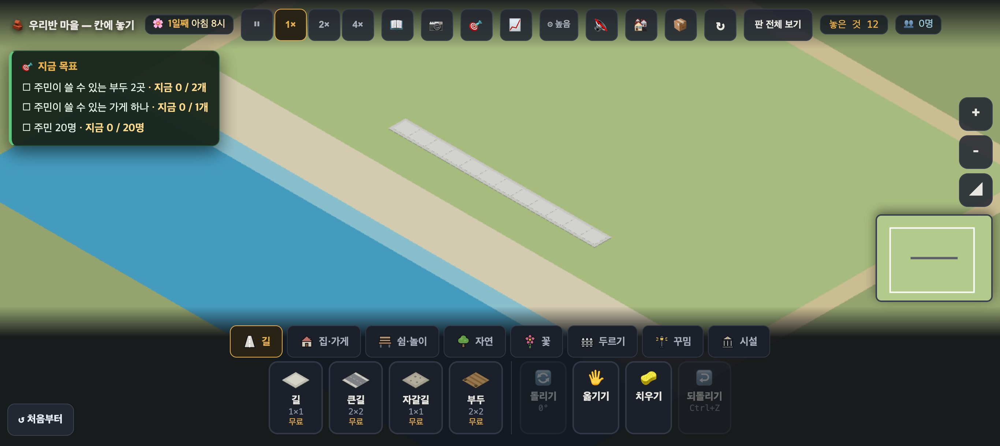
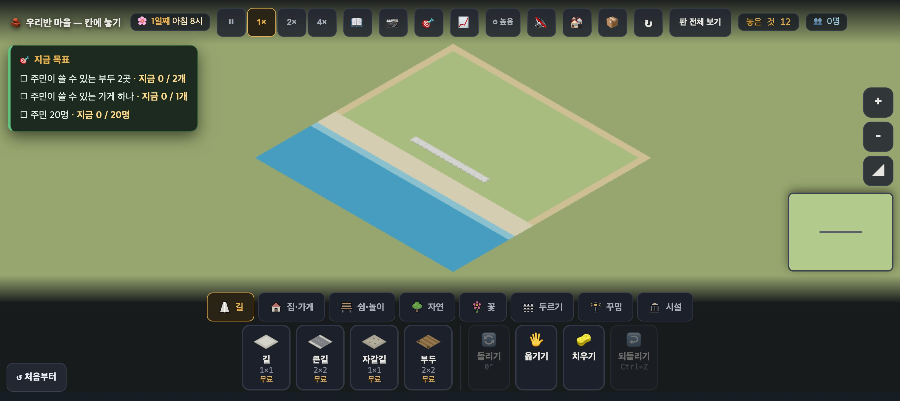
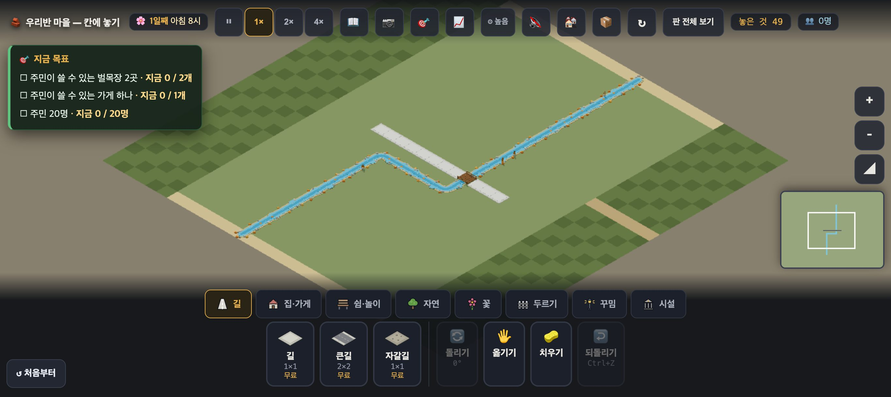
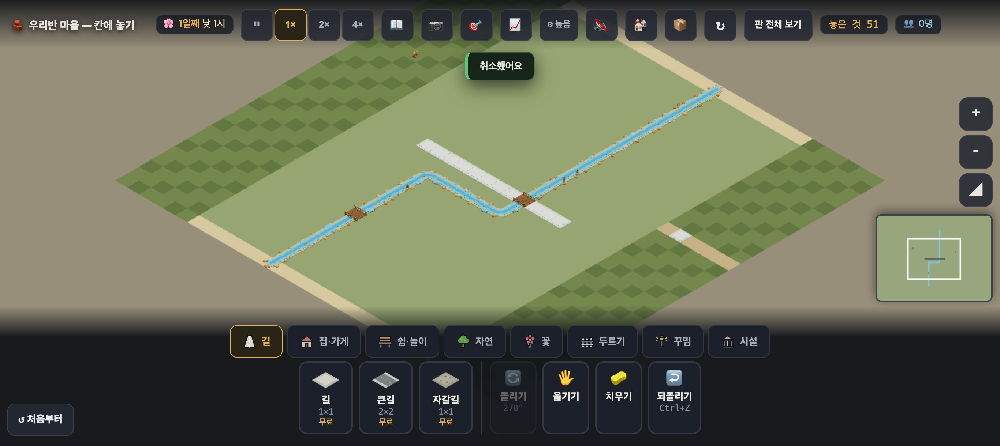
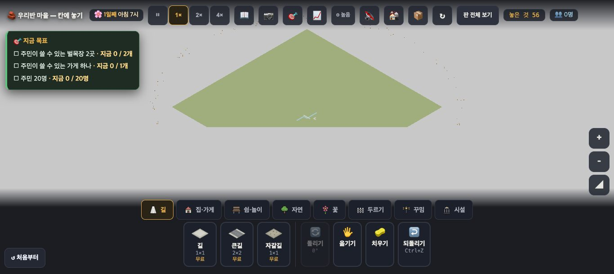
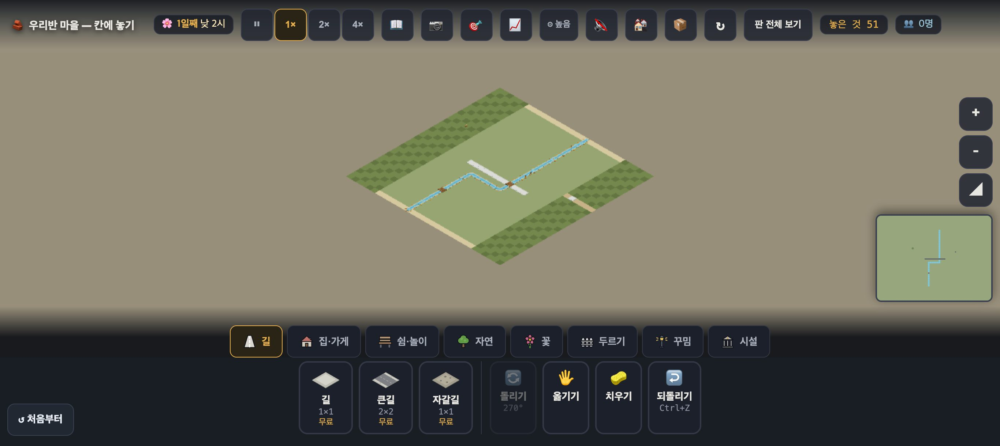

# 창조자의 눈 — 관찰 기록 36회: 바닷가 풀빛 '후' · 산 판 첫 되밟기 (#933)

> 보스 요청: 산 판 PR(#933 · sea 풀빛 포함)이 머지됐습니다.
> ① 34-ⓑ81 '후' — 35회와 **같은 칸 · 같은 시각**으로 잽니다.
> ② 산 판 첫 되밟기 — 골짜기 · 비탈 · 고갯길 · 판 개울. 아이가 "여긴 왜 안 돼?"를 알 수 있나, 고갯길이 하나뿐인 게 보이나.
> headless 로만.
>
> 본 판: main `805ff9c` · 제 서버 8781 · `?sid=guest` · **코드 수정 0 · 화면 창 0**.
> - headless 크롬 스크립트(CDP)만 썼고, 판마다 새 프로필을 썼습니다. 끝나면 크롬과 서버를 껐습니다. 운영 요청은 막았습니다(0).
> - 그래픽은 `__gfxMode('high')`(보기 설정)로 두었습니다. 사진은 2배 해상도입니다.
> - 놓기는 **진짜 누르기**로 했습니다. 커서를 올려 `__whyup()`(커서 옆 풍선)을 읽고, 누른 뒤 `#toast` 를 읽었습니다. `__try`(읽기 전용)도 함께 적었습니다.

## 한 줄
**바닷가는 이제 "풀밭 → 모래 띠 → 바다" 해안으로 읽힙니다 ✔(34-ⓑ81 닫힘).**
**산 판의 규칙과 말은 대부분 제자리에 있습니다.**
- 비탈에 길 ✕ · 고갯길엔 길만 · 굽은 개울엔 다리 ✕ · 판 개울은 못 치움, 모두 까닭 말이 나옵니다.

그런데 세 곳에서 **말이나 그림이 아이를 헷갈리게** 합니다.
- ① 비탈에 **길**을 놓으면 "**큰 건물**을 지을 수 없어요"라 합니다.
- ② 비탈 깊은 곳의 산장은 "먼저 길을 놓아 주세요"라 합니다. 그런데 비탈엔 길을 못 냅니다.
- ③ 고갯길이 **골짜기 가장자리 흙 테두리와 같은 흙빛 곧은 줄**이라, '산을 넘는 하나뿐인 길'로 눈에 띄지 않습니다.

---

# 1부 · 바닷가 '후' (34-ⓑ81)

**사실** — 35회와 같은 칸, 같은 두 때(연 직후 6시 · 15초 뒤 8시), 같은 창(1366 · 기본 카메라):

| 칸 | 규칙 | 35회 8시(전) | **36회 8시(후)** | 36회 6시 |
|---|---|---|---|---|
| (143,140) · (143,146) | 풀(뭍) | (202,195,165) | **(166,186,125)** | (112,133,76) |
| (143,148) | 모래 | (210,204,180) | **(210,203,175)** | (168,156,123) |
| (143,150) | 물가 줄 | (147,186,199) | (136,191,204) | (76,139,161) |
| (143,152) · (140,153) | 물 | (93,160,186) | (68,155,190) | (13,100,141) |

- 뭍과 모래 띠의 차이(8시): 35회에는 세 값 모두 **15 안쪽**이었습니다. 36회에는 **44 · 17 · 50** 입니다.
- 사진에서 모래 띠는 초록 뭍과 파란 바다 사이의 **밝은 띠**로 뚜렷합니다.

**해석** — 보스가 원한 **"해안 띠만 모래"**로 읽힙니다. 34-ⓑ81 은 **닫혔습니다** ✔(#933).

**남은 것(35-ⓑ82)** — 멀리서 보면 바다가 여전히 구역 끝에서 직선으로 끊깁니다. 그 밖이 이제 모래가 아니라 **풀빛**이라, '풀밭 안 네모 연못'으로 보입니다(고장 프로토 지형 2차에 맡김).

---

# 2부 · 산 판 첫 되밟기

**판** — `?stage=mountain` 새 프로필. 연 직후:
- 물건 49: 길 11 · **판 개울 37칸 + 다리 1**(첫 길이 지나는 (146,144)).
- `__terrain()` = `{개울: 38, 개울깖: 38, 개울지킴: 0}`.
- 지형: 비탈 x ≤ 133 · ≥ 154 · 고갯길 y 140(x ≥ 154) · 골짜기 x 134~153.

## 1. 첫 화면 — 골짜기·비탈·개울이 보이나

**사실(8시 픽셀)**

| 칸 | 규칙 | 색 |
|---|---|---|
| (133,140) · (157,137) | 비탈 | (84,104,56) — 마름모 결의 어두운 칸 · 밝은 칸은 (100,120,66) |
| (140,140) · (150,140) | 골짜기 | (134,150,99) |
| (156,140) · (157,140) | 고갯길 | **(184,164,120)** |
| (145,159) | 골짜기 가장자리 흙 테두리 | **(203,189,146)** |

- 비탈 칸 위에는 흙 테두리가 **안 보입니다**(비탈 색이 덮음).
- 판 개울은 골짜기를 **두 번 굽어** 흐르고, 첫 길과 만나는 곳에 나무다리가 있습니다.

**해석**
- 🟢 골짜기(밝음)와 비탈(어둡고 무늬)은 **뚜렷이 갈립니다.** 개울은 굽이가 부드러워 예쁩니다.
- 🟡 비탈은 **높이 없이** 어두운 초록 마름모 무늬입니다. 아이 눈엔 '산비탈'보다 **'어두운 풀밭·체크무늬 밭'**으로 읽힐 수 있습니다(가설 → ⓒ77). 높이·계단밭은 PR 이 적은 대로 아직입니다(backlog 20).
- 🟡 **고갯길**은 오른쪽 아래 비탈을 가로지르는 **흙빛 곧은 줄**입니다(구역 안 6칸). 그런데 같은 화면 왼쪽 위·왼쪽 아래의 **흙 테두리도 흙빛 곧은 줄**입니다(색 차 약 20). 그래서 "산을 넘는 **하나뿐인** 길"이라기보다 **테두리가 하나 더 있는** 것처럼 보입니다. 또 구역 끝에서 끊겨 **어디로 넘어가는지** 보이지 않습니다(36-ⓑ86).

## 2. 놓기 — "여긴 왜 안 돼?"

| # | 한 것 | 바닥 | 놓였나 | 커서 풍선(`#why`) | 누른 뒤(`#toast`) |
|---|---|---|---|---|---|
| A | 서쪽 비탈에 **길** (131,140) | 비탈 | ✕ | ⛰️ 비탈에는 **큰 건물을** 지을 수 없어요 — 평평한 곳을 찾아요 | — |
| C | 비탈에 나무 | 비탈 | ○ | — | — |
| E | 고갯길에 길 (155,140) | 고개 | ○ | — | — |
| F | 고갯길에 나무 (157,140) | 고개 | ✕ | 🛤️ 고갯길에는 길만 낼 수 있어요 | — |
| G | 고갯길 옆 동쪽 비탈에 길 (155,138) | 비탈 | ✕ | ⛰️ 비탈에는 **큰 건물을**… | — |
| I | 판 개울 위에 집 (140,150) | 개울 | ✕ | 여기엔 이미 개울이 있어요 | **집은 길에 붙여 놓아요 — 사람이 드나들거든요** |
| J | 곧은 개울에 길 (140,152) | 개울 | **다리가 됨** | — | — |
| K · L | 굽은 칸 (140,146) · (146,146)에 길 | 개울 | ✕ | **다리는 곧게 흐르는 곳에만 놓을 수 있어요** | — |
| 🧽 | 판 개울 치우기 (140,155) | 개울 | 그대로 | — | 💧 이 개울은 산에서 흘러와요 — 치우거나 옮길 수 없어요 · 곧은 곳에 길을 놓으면 다리가 돼요 |
| 🖐 | 판 개울 옮기기 (146,138) | 개울 | 그대로 | — | (같은 말) |

화면 밖이던 칸은 `__try` 로만 쟀습니다. 골짜기 가장자리 (153,137~140)와 고갯길 (154~156,140)에 길을 낸 뒤입니다.

| 물건 · 칸 | 곁에 길 | `__try` |
|---|---|---|
| 벌목장 (131,130) · 집 (154,137) · 벌목장 (154,137) | — / 있음 | ⛰️ 비탈에는 큰 건물을 지을 수 없어요 |
| 산장 (154,137) · (154,138) · (156,138) | 있음 | **true**(비탈에 놓임) |
| 산장 (150,134) · (156,134) · (157,141) | **없음**(비탈 안쪽) | **산장은 길에 붙어야 해요. 먼저 ⬜ 길을 놓아 주세요** |
| 집 (157,141) | 없음 | 집은 길에 붙어야 해요… (**비탈 말은 안 나옴**) |
| 긴의자 (154,138) · 나무 (156,136) | — | true |

**해석**
- 🟢 **좋은 말**: 고갯길(F) · 굽은 개울(K·L) · 판 개울 치우기·옮기기의 말은 **까닭과 할 일**을 함께 줍니다. "곧은 곳을 찾아요"가 아이 손을 **다음 수로** 이끕니다. 곧은 개울에 길을 놓으니 바로 다리가 되는 것도 좋습니다(J).
- 🟡 **A·G "큰 건물을"**: 길은 건물이 아닙니다. 아이는 "길인데?" 하고 헷갈립니다. 여기서 "고갯길(흙빛 줄)로 넘어요"라고 알려 주면, **고갯길이 하나뿐**이라는 것을 이 순간에 배웁니다(36-ⓑ84).
- 🟡 **비탈 안쪽 산장 "먼저 길을 놓아 주세요"**: 그 말대로 비탈에 길을 놓으면 "비탈에는…"으로 막힙니다. **따를 수 없는 말**입니다. 산장이 설 수 있는 곳은 사실 **골짜기 가장자리·고갯길 곁**뿐입니다(36-ⓑ85).
- 🟡 **I · 비탈 집**: 34-ⓑ78 과 같은 뿌리입니다. 지형 까닭은 '길에 붙어야'를 통과한 **뒤에만** 봅니다. 그래서 곁에 길이 없으면 비탈·개울 까닭이 안 나오고, 누른 뒤 토스트는 늘 "길에 붙여 놓아요"입니다.

## 3. 판 전체 보기 · 미니맵

**사실**
- 판 전체 보기(지도)에는 **비탈과 고갯길이 없습니다.** 판이 한 초록이고, 개울만 가는 파란 줄로 보입니다.
- 미니맵도 골짜기 네모와 개울만 보이고 비탈 띠는 없습니다.

34-ⓑ80(지도에 지형 없음)이 산 판에도 그대로입니다.

---

## 목록(`docs/clumsy_list.md`)에서 고친 줄

| 줄 | 전 | 후 |
|---|---|---|
| 34-ⓑ81 뭍 색 | 열림('전' 35회) | **닫힘(#933) ✔36회** — 8시 뭍 (166,186,125) · 모래 (210,203,175) |
| 34-ⓑ77 · ⓑ78 · ⓑ80 · 35-ⓑ82 | 열림 | **맡음(고장 프로토 · 지형 2차 · 보스 배정)** — ⓑ78 · ⓑ80 은 **산 판도 같음**(개울 위·비탈 안쪽 집 · 지도에 비탈·고갯길 없음) · ⓑ82 는 밖이 풀빛이 되어 '풀밭 안 네모 연못' |
| 35-ⓑ83 1366 심장이 상자 뒤 | 열림 | **맡음(디자인 · 원본 다듬기 3차)** |
| 새 줄 | — | 36-ⓑ84 · ⓑ85 · ⓑ86 · ⓒ77 · ⓒ78 |

# ⓐ 없음

# ⓑ
- **ⓑ84.** 비탈에 **길**을 놓으면 "⛰️ 비탈에는 **큰 건물을** 지을 수 없어요" — 길은 건물이 아님. 여기서 고갯길을 알려 주지 않음. (재는 법: `__try('road', 131, 140)` 의 말)
- **ⓑ85.** 비탈 안쪽 산장 → "먼저 ⬜ 길을 놓아 주세요" — 비탈엔 길을 못 내니 **따를 수 없는 말**. (재는 법: `__try('cabin', 156, 134)` 의 말)
- **ⓑ86.** 고갯길이 골짜기 가장자리 **흙 테두리와 같은 흙빛 곧은 줄**(8시 (184,164,120) 대 (203,189,146))이고 구역 안 6칸에서 끊김 — '하나뿐인 넘어가는 길'로 안 읽힘. (재는 법: 첫 화면 사진에서 고갯길과 테두리를 가려낼 수 있나)

# ⓒ
- **ⓒ77.** 높이 없는 어두운 마름모 무늬를 아이가 **'비탈(산)'로 읽나**, '어두운 풀밭'으로 읽나.
- **ⓒ78.** 굽은 곳에서 "다리는 곧게 흐르는 곳에만"을 보고 **곧은 곳을 스스로 찾나**.

## 미검증 · 한계
- headless 소프트웨어 그림입니다(그림자 거의 없음). 색은 스크린샷 픽셀이고, 연 직후와 15초 뒤 두 번 쟀습니다.
- 칸 → 화면 자리는 `__cellScreen` 두 점으로 만든 1차 변환입니다(검산: 두 점 모두 1px 안).
- 산장 줄은 `__try`(읽기 전용)입니다. 산장 크기는 코드에서 읽지 않았습니다. 그래서 (157,141)이 길 곁이 아닌 까닭(대각선)은 제 짐작입니다.
- E 뒤의 토스트 "취소했어요"는 바로 앞 제 Esc 에서 나온 것이라 표에서 뺐습니다.
- 통과는 조작·표시 길만 뜻합니다.
