# 창조자의 눈 — 관찰 기록 37회: 지형 2차(#946) · 첫 카드(#937) · 원본 다리 걷기(#945) 되밟기 — GPU 로 처음

> 무한 진행 첫 회. 고른 것: 막 머지된 것 되밟기 — **#946 지형 2차**(잠긴 구역까지 칠하기 · 지도에 지형 · 먼 바다 부두 ✕ · 지형 까닭이 먼저) · **#937 첫 카드 지도** · **#945 원본 다리 위로 걷기**.
> 본 판: main `f44b9b3` · 제 서버 8781 · `?sid=guest` · **코드 수정 0 · 화면 창 0**.
> **그리기: headless 크롬을 GPU(Metal)로 처음 씀** — 렌더러 "ANGLE Metal Renderer: Apple M5". 그래픽은 '높음'(그림자 pcf)이고, 판마다 새 프로필을 썼습니다. 끝나면 크롬과 서버를 껐습니다.
> **두터운 틀(보스 09-24)**: 바닷가·산·원본 × 시각 셋(7.5·10·17시) × 맑음·비 × 1366·1920.
> - 시각은 `__setHour` 로 맞추고 3.5초 뒤 찍었습니다. 그래서 찍힌 시각은 **+0.5시간**(8시 · 10시 반 · 17시 반)입니다.
> - 비는 비 오는 날(6일째)로 `__setTime` 해 옮겨 찍었습니다. 그날 비는 그치지 않았습니다.
> **그림자: 보입니다.** 집·나무·마을 큰 나무 아래에 그림자가 떨어집니다(36회까지의 소프트웨어 그리기에선 거의 없던 것).

## 한 줄
**34·35회 바닷가 줄 넷이 닫혔습니다 ✔.**
- 먼 바다 부두 ✕.
- 바다 위 집의 풍선 = 토스트 = '🌊 바다'.
- 지도에 바다.
- 잠긴 구역까지 바다가 이어짐.

**첫 카드도 빈 사진틀 대신 그 판의 첫 장면을 보여 줍니다 ✔.**

**산 판 말 둘(36-ⓑ84 '큰 건물' · ⓑ85 따를 수 없는 산장 말)은 그대로입니다.**

**GPU 그림자로 원본 마을은 한층 입체로 보입니다.**

새로 찾은 것 둘:
- 해금 알림 조사가 **"나무이 열렸어요"**로 나옵니다.
- **판 전체 보기에서 판 아래쪽이 곧은 줄로 잘립니다.**

---

## 1. 바닷가 — #946

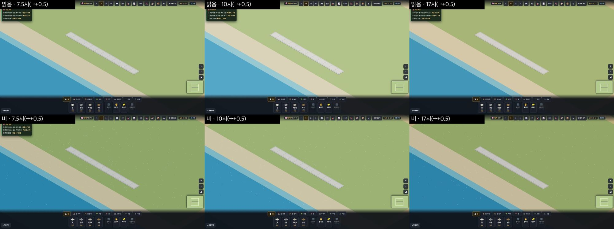

**놓기(진짜 누르기 · 누르기 전에 토스트를 비움)**

| # | 한 것 | 커서 풍선 | 누른 뒤 토스트 | 놓였나 | 34~35회 |
|---|---|---|---|---|---|
| B | 길 없는 바다에 집 (143,153) | 🌊 바다에는 지을 수 없어요 — 부두는 물가에 놓아요 | **같은 말** | ✕ | 풍선 '길에 붙어야' |
| C2 | 모래 길 옆 바다에 집 (146,150) | 🌊 바다에는… | **같은 말** | ✕ | 토스트 '길에 붙여 놓아요' |
| F | 먼 바다 부두 (136,154) | 🪵 부두는 뭍에 닿아야 해요 — 모래 가장자리에 붙여 놓아요 | **같은 말** | **✕** | 놓였음 |
| D | 물가에 걸친 부두 (139,149) | — | — | ○ | ○ |
| D2 | 뭍에 닿은 바다 부두 (132,150) | — | — | ○ | — |

**해석** — 34-ⓑ77 · 34-ⓑ78 **닫힘** ✔. 이제 아이가 무엇을 누르든 풍선과 토스트가 **같은 까닭**을 말합니다. 먼 바다 부두 말("모래 가장자리에 붙여")은 **어디에 놓을지**까지 알려 줍니다.

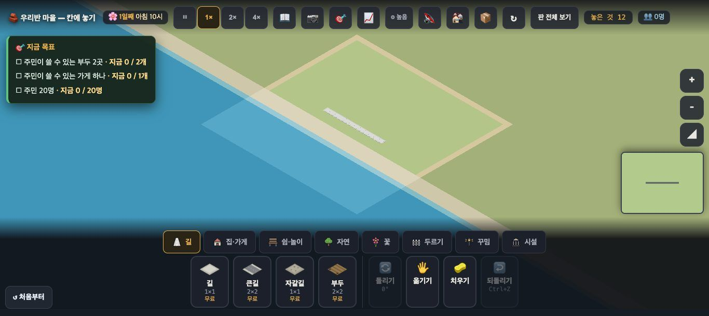
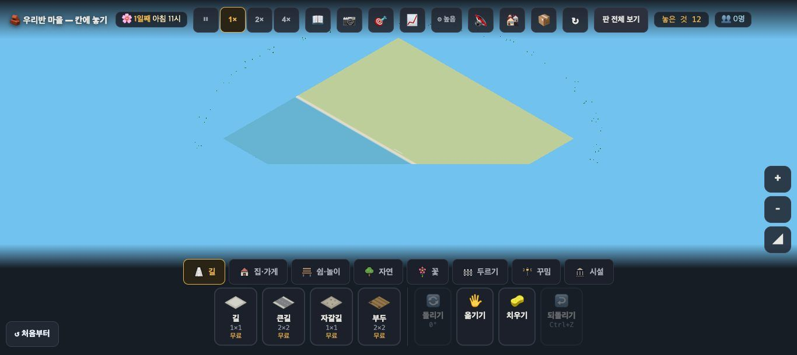

**사실**
- 멀리 보면 바다가 **판 끝까지** 이어집니다(잠긴 곳은 한 톤 어두움).
- 판 전체 보기에 **바다와 모래 띠**가 있습니다.
- 미니맵에는 아직 바다가 없습니다(#946 이 '디자인 몫'이라 적음).

**해석** — 35-ⓑ82(네모 연못) **닫힘** ✔. 34-ⓑ80 은 **지도 판은 닫힘**, 미니맵은 남음(일부). 열린 구역이 뭍·바다 모두 **한 톤 밝은 네모**로 보이는 것은 PR 이 알려 둔 대로입니다(기본 판의 잠긴 땅과 같은 식).

**날씨·시각(1920)**
- 17시 반은 따뜻한 빛이고, 비 오는 날은 **옅은 흰 점**(빗방울)이 흩어집니다.
- 화면 밝기는 맑은 날과 거의 같습니다.
- 바닷가 판엔 물건이 길뿐이라 **그림자를 판단할 것이 없습니다**.

## 2. 산 판 — #946 의 '지형 까닭이 먼저' · 36회 줄

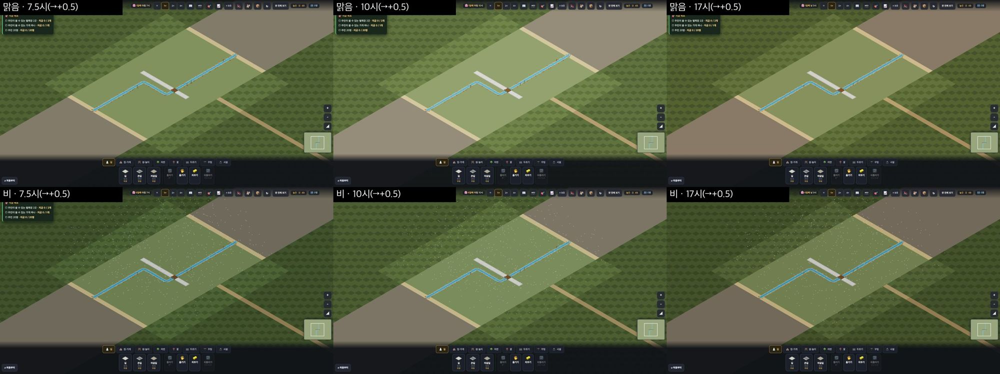

| # | 한 것 | 커서 풍선 = 누른 뒤 토스트 | 놓였나 | 36회 |
|---|---|---|---|---|
| A | 비탈에 **길** (131,140) | ⛰️ 비탈에는 **큰 건물을** 지을 수 없어요 — 평평한 곳을 찾아요 | ✕ | **같음(36-ⓑ84 그대로)** · 이제 토스트로도 나옴 |
| G | 고갯길 옆 비탈에 길 (155,138) | (같은 말) | ✕ | 같음 |
| F | 고갯길에 나무 (157,140) | 🛤️ 고갯길에는 길만 낼 수 있어요 | ✕ | 같음 |
| B0 | 골짜기 집(길 없음) (150,135) | 집은 길에 붙어야 해요… / 토스트 💡 노란 자리에… | ✕ | (평지라 맞는 말) |

`__try`(화면 밖 칸):
- 집 (130,136) · (157,141)은 **"⛰️ 비탈에는…"** 입니다(36회에는 "길에 붙어야" — 34-ⓑ78 뿌리 **닫힘**).
- 산장 (156,134) · (131,133)은 **"산장은 길에 붙어야 해요. 먼저 ⬜ 길을 놓아 주세요"** 입니다(**36-ⓑ85 그대로**).

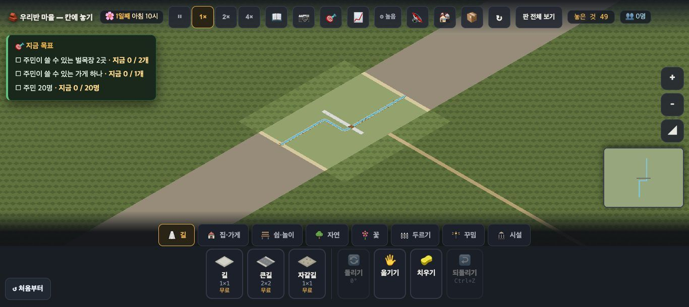
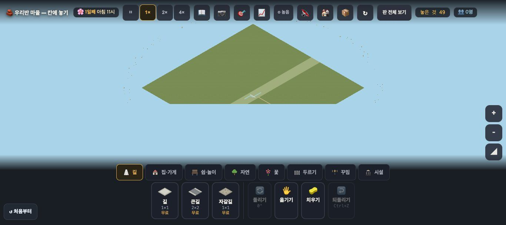

**사실**
- 멀리 보면 **고갯길이 판 끝까지 한 줄로** 뻗습니다.
- 판 전체 보기에도 비탈(어두운 초록)·골짜기·고갯길이 보입니다.
- 잠긴 골짜기(지형 없음)는 회갈색입니다.

**해석**
- 36-ⓑ86 은 **절반 풀렸습니다**. 멀리서는 '산을 넘어 어디론가 가는 하나뿐인 길'이 읽힙니다.
- 첫 화면(가까이)에서는 여전히 구역 안 6칸이고, 골짜기 흙 테두리와 같은 흙빛입니다.
- (가설) 잠긴 골짜기의 넓은 **회갈색 띠**가 멀리서 '큰 흙길'처럼 보여, 고갯길과 다툴 수 있습니다.

## 3. 첫 카드 — #937 (22-ⓑ33)

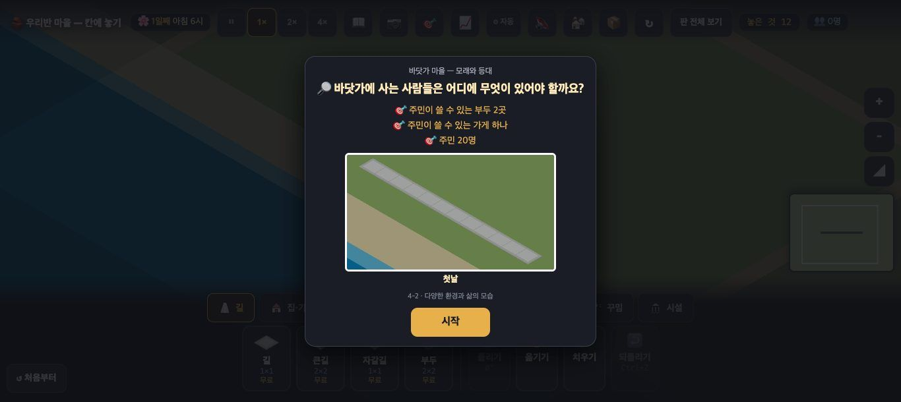 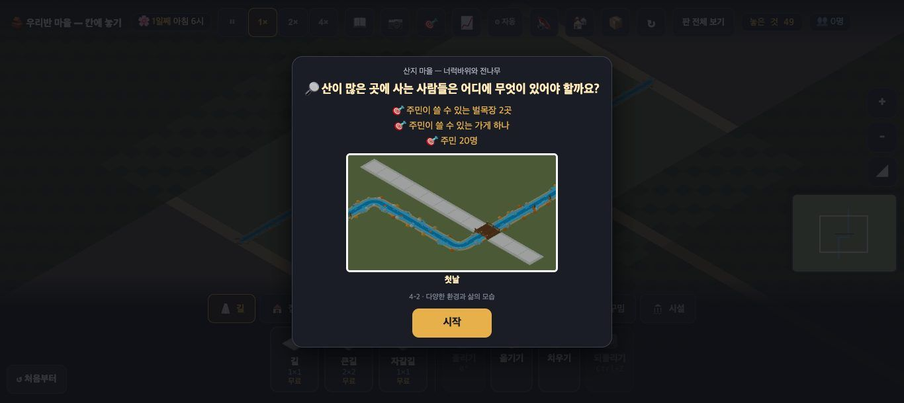

**사실** — 카드 가운데에 320×180 그림(IMG)이 있습니다. 그 판의 **첫 장면**(첫 길 · 산은 개울과 다리)이 들어 있습니다. 빈 📷 틀은 없습니다.

**해석** — 22-ⓑ33 **닫힘** ✔. 산 카드는 개울·다리가 보여 "여긴 물을 건너야 하는구나"가 읽힙니다.
- (가설) 바닷가 카드는 그림 대부분이 풀밭과 길이고, **바다는 왼쪽 아래 귀퉁이 조금**입니다. '바닷가'를 카드에서 먼저 보여 주려면 카메라를 바다 쪽으로 조금.

## 4. 원본 마을 — #945 · GPU 그림자로 본 '우와'

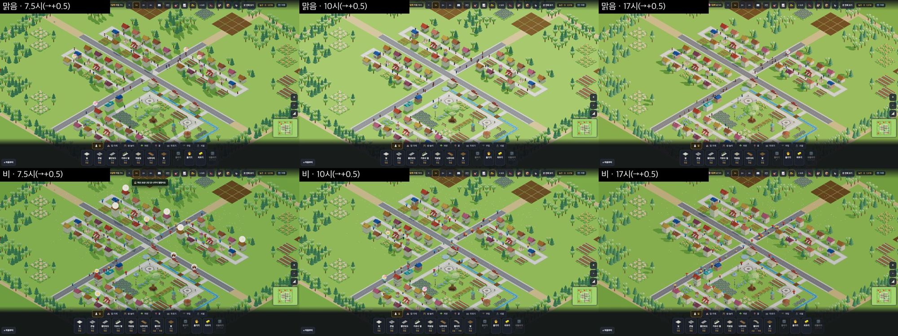
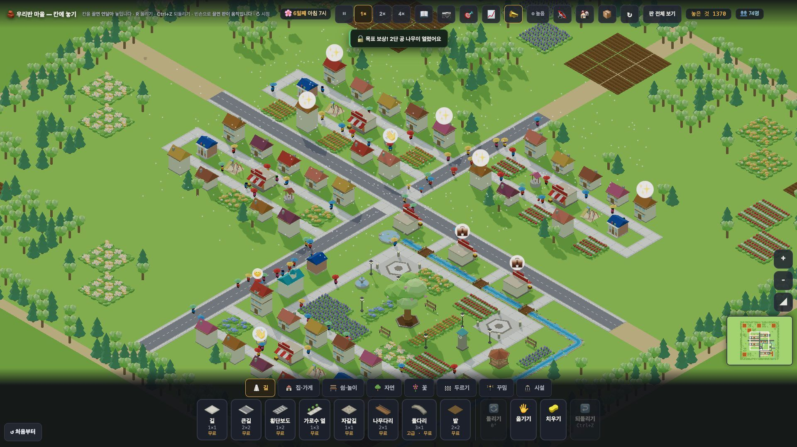

**사실**
- **그림자가 보입니다.** 집마다 오른쪽 아래로, 나무마다 둥근 그림자가, 공원 큰 나무 아래 큰 그림자가 떨어집니다.
- 비 오는 날엔 주민이 **색색 우산**을 씁니다.
- 장면마다 한 번 잰 사람 수(`__folkPos` · 그린 자리):

| 창 | 시각 | 마을 나무 둘레 7칸 안 | 다리 칸 위 | `__bridgeWalk().지금올린사람` |
|---|---|---|---|---|
| 1366 | 맑음 8 · 10.5 · 17.5 | 4 · 3 · 3 | 0 · 0 · 0 | 0 · 0 · 0 |
| 1366 | 비 8 · 10.5 · 17.5 | 1 · 2 · 2 | 0 · 0 · 0 | 1 · 1 · 0 |
| 1920 | 맑음 8 · 10.5 · 17.5 | 6 · 5 · 4 | 0 · 0 · 0 | 0 · 0 · 0 |
| 1920 | 비 8 · 10.5 · 17.5 | 3 · 3 · 2 | 0 · 0 · 0 | 0 · 1 · 0 |

- 둘레 7칸 안의 사람은 대부분 **공원 둘레 길을 지나는 사람**입니다. 사진에서 공원 한가운데(나무·긴의자)는 비어 있습니다. #945 가 적은 "나무 둘레 0명"과 같은 모습입니다.
- 다리 위 사람은 이 **한 장면 표본**에서는 잡히지 않았습니다. 다리 위 발이 판 위로 올라온 모습은 **이번엔 확인 못 했습니다**.

**해석 — '우와'가 달라졌나**
- **1920(TV)** — 그림자가 생기니 집이 **서 있고**, 공원 큰 나무가 **땅 위에 솟아** 보입니다. 30회에 "평평하다"고 적은 첫인상이 크게 줄었습니다. 35회 판정("1920 에선 '우와'에 많이 다가감")이 **한 단계 더** 올라갑니다.
- **1366(크롬북)** — 그림자는 같지만 심장(공원)은 여전히 물건 상자 뒤입니다(35-ⓑ83 · 디자인 3차 진행 중).
- 공원이 **비어 있는 것**은 그림자로 더 눈에 띕니다. 큰 나무 그림자 아래가 텅 비었습니다(#945 ② · 보스 결정 대기).

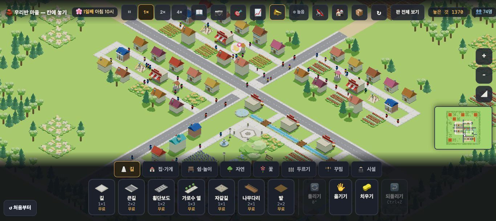

## 5. 새로 찾은 것

**ⓑ87 — 해금 알림 조사가 '이'로 고정**
- (사실) 비 오는 날로 건너뛰자 토스트 **"🔓 목표 보상! 2단 공 나무이 열렸어요"**가 떴습니다.
- (사실) 코드에는 받침을 보고 조사를 고르는 `josa()` 가 있습니다. 그런데 이 알림(`sayOnce('🔓 목표 보상! ' + … + '이 열렸어요')`)과 인구 해금 알림(`… + ' 이 열렸어요! (인구 …'`)은 **'이'를 고정**으로 붙입니다.
- (해석) 받침 없는 이름(나무·그네·가게…)마다 틀린 문장이 아이 눈앞에 뜹니다.

**ⓑ88 — 판 전체 보기에서 판 아래쪽이 곧은 줄로 잘림**
- (사실) 1366 판 전체 보기에서 판 마름모의 위 꼭짓점은 y 65, 양옆 꼭짓점은 y 238 입니다. 그러니 아래 꼭짓점은 y 411 쯤이어야 하는데, 판은 y **282** 에서 곧은 줄로 끝납니다.
- (사실) 바닷가·산·원본 모두 같고, 30회 사진에도 같습니다.
- (해석) '판 **전체**'가 아니라 **위쪽 2/3** 쯤만 보입니다. 마을(판 가운데)이 **잘린 줄 바로 위**에 놓여, 판 끝에 붙은 것처럼 보입니다.
- (가설) 카메라 앞쪽 깊이(near) 밖으로 판 앞 귀퉁이가 빠지는 것일 수 있습니다(코드 주석 "지도 보기 때 판 끝까지 깊이가 닿아야 한다"). 확인은 고치는 쪽에서.

---

## 목록(`docs/clumsy_list.md`)에서 고친 줄

| 줄 | 전 | 후 |
|---|---|---|
| 22-ⓑ33 첫 카드 빈 사진틀 | 열림 | **닫힘(#937) ✔37회** |
| 34-ⓑ77 먼 바다 부두 | 맡음 | **닫힘(#946) ✔37회** |
| 34-ⓑ78 지형 까닭이 길 규칙에 가려짐 | 맡음 | **닫힘(#946) ✔37회** — 바다·비탈 집 모두 지형 말 · 풍선 = 토스트 |
| 34-ⓑ80 지도에 지형 없음 | 맡음 | **일부(#946)** — 지도 판 ✔(바다·비탈·고갯길) · 미니맵은 남음(디자인 몫) |
| 35-ⓑ82 네모 연못 | 맡음 | **닫힘(#946) ✔37회** — 잠긴 구역까지 이어짐 · 열린 구역이 한 톤 밝은 네모는 설계대로 |
| 36-ⓑ84 · ⓑ85 | 열림 | 열림(37회 다시 봄 — 그대로) |
| 36-ⓑ86 고갯길 | 열림 | 열림 — **멀리선 판 끝까지 이어짐(절반)** · 가까이선 그대로 |
| 새 줄 | — | 37-ⓑ87 · ⓑ88 · ⓒ79 |

# ⓐ 없음
# ⓑ
- **ⓑ87.** 해금 알림 조사 '이' 고정 — "2단 공 나무이 열렸어요" (`josa()` 가 있는데 안 씀 · 두 곳).
- **ⓑ88.** 판 전체 보기에서 판 아래쪽이 곧은 줄로 잘림 — 마을이 잘린 줄 바로 위.
# ⓒ
- **ⓒ79.** 비 오는 날을 아이가 알아보나 — 빗방울은 옅은 점이고 화면 밝기는 거의 같음 · 우산은 잘 보임.

## 미검증 · 한계
- **GPU 그림으로 찍은 첫 회**라, 36회까지의 사진(소프트웨어 그림)과 **색·그림자를 바로 견주면 안 됩니다.**
- 바닷가·산 **1366 비 사진은 버렸습니다**. 제가 '판 전체 보기'를 누르고 되돌리는 사이 카메라가 '가까이 보기'로 남아 다른 자리를 찍었습니다. 날씨·시각은 1920 판으로 봤습니다.
- 사람 수는 장면마다 **한 번**(0.5초 표본 아님)이라, 다리 위 사람은 놓치기 쉽습니다. 다리 걷기(#945 ①)는 사진으로 확인하지 못했습니다.
- 해금 토스트는 제가 날짜를 5일 건너뛰어 목표가 한꺼번에 이뤄진 뒤 떴습니다. 조사 틀림은 코드 두 곳에서 확인했습니다.
- 통과는 조작·표시 길만 뜻합니다.
