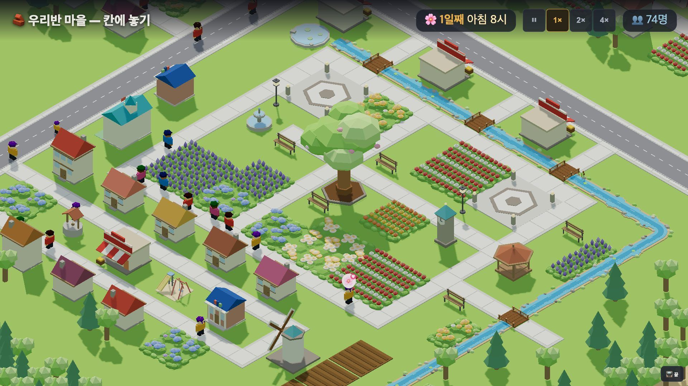
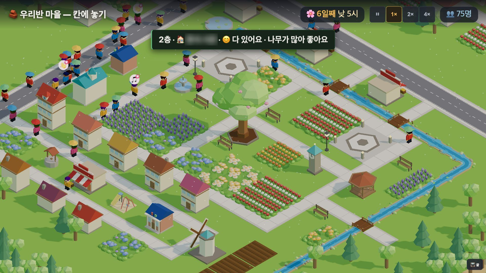
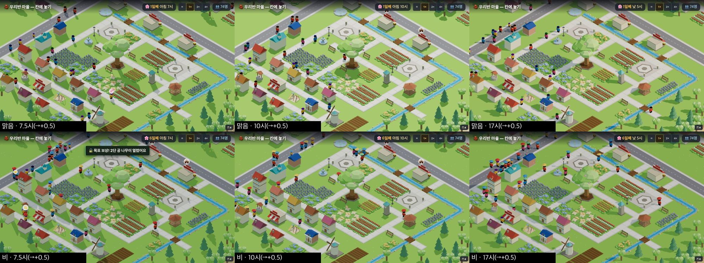
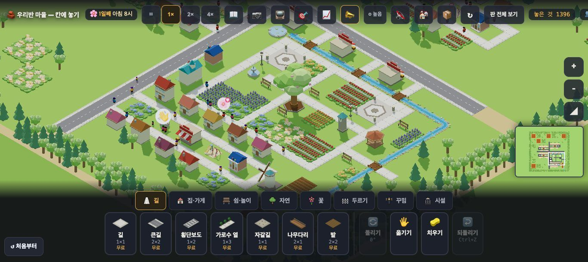
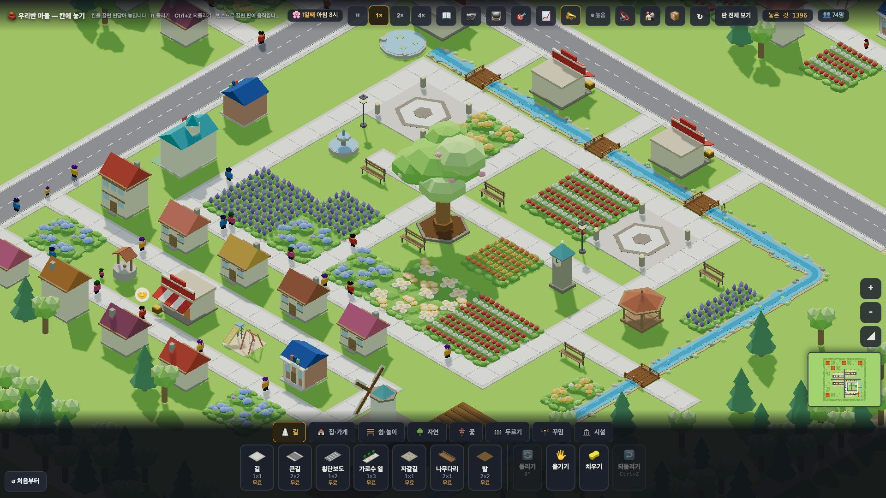
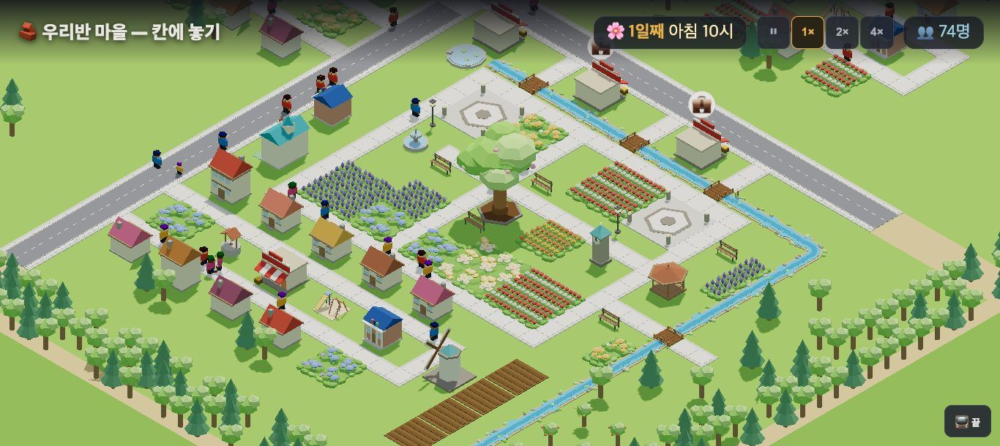

# 창조자의 눈 — 관찰 기록 38회: 교실 TV '보여 주기 모드'(#956 · #957) · 원본 다듬기 3차(#940) 되밟기

> 무한 진행. 고른 것: 막 머지된 것 — **#956 보여 주기 모드 ①**(숨김 + 글씨 ×2.4) · **#957 ② 사람 ×1.6** · **#940 원본 다듬기 3차**(첫 화면 가운데를 마을 나무·광장으로). 30회 "교실 TV 에서 글씨 13px"(30-표)와 35-ⓑ83(1366 에서 심장이 상자 뒤)을 되밟습니다.
> 본 판: main `edb6b3c` · 제 서버 8781 · `?sid=guest&stage=origin`(보여 주기는 `&show=1`) · **코드 수정 0 · 화면 창 0**.
> **그리기: GPU(Metal · Apple M5) · '높음' · 그림자 보임.** 판마다 새 프로필을 썼고, 끝나면 크롬과 서버를 껐습니다.
> 두터운 틀: 보여 주기 모드로 1920·1366 × 7.5·10·17시 × 맑음·비(찍힌 시각은 +0.5시간).
> 집을 누른 사진의 **주민 이름은 흐리게 가렸습니다.**

## 한 줄
**원본 마을의 첫 화면이 이제 크롬북에서도 공원입니다 ✔(35-ⓑ83 닫힘).** 큰 나무·개울과 다리·라벤더·정자가 화면 한가운데, 물건 상자 위에 온전히 들어옵니다. 30회 "중심 없음"(30-ⓑ66)도 닫습니다.
**보여 주기 모드는 교실 TV 에서 '우와'를 만듭니다 ✔(30-표 닫힘).** 글씨 32~36px, 물건 상자·미니맵·목표 숨김, 사람 ×1.6. 켜고 끄기(📺 · Esc · 📺 끝)도 잘 됩니다.
**남은 것은 하나 — 가장 예쁜 공원 한가운데에 사람이 없습니다.** 그림자까지 생겨 더 눈에 띕니다.

---

## 1. 보여 주기 모드 — 교실 TV(1920×1080)

**사실(연 직후 · `?show=1`)**

| | 30회(보통) | **38회 보여 주기** |
|---|---|---|
| 마을 이름 | 15px | **36px** |
| 시계 · 인구 | 13.5px | **32.4px** |
| 토스트 | 13.5px | **32.4px** — 예: "🏠 집이 3층이 됐어요!" 가 339×78 상자 |
| 물건 상자 · 미니맵 · 목표 | 보임(상자 191px) | **숨김** |
| 윗줄 | 단추 스무 개 남짓 | 이름 · 시계 · 배속(⏸ 1× 2× 4×) · 인구만 · 높이 114px |
| 한 칸 | 44px(30회) → 86.2px(38회 보통) | **94.6px** |
| 끄기 | — | 오른쪽 아래 `📺 끝`(64×44) · Esc → 꺼짐 · 📺 단추 → 다시 켜짐 |

- 집을 누르면 그 집의 말이 **큰 토스트**로 뜹니다: "2층 · 🏠 ○○·○○ · 😊 다 있어요 · 나무가 많아 좋아요".
- 누른 뒤 모드는 '보기' 그대로입니다(놓기로 안 바뀜).
- 오류 0.

**해석(선생님 눈)**
- 🟢 **가리킬 곳이 화면 가득**입니다. "큰 나무 아래 누가 있나요?", "개울은 어디로 흐르나요?", "다리가 몇 개인가요?"를 TV 앞에서 바로 물을 수 있습니다. 17시 반의 따뜻한 빛과 비 오는 날의 **색색 우산**은 장면을 바꿔 보여 주기 좋습니다.
- 🟢 집을 누르면 그 집 사람들의 말이 크게 떠, **"이 집은 왜 좋대요?"** 수업이 됩니다.
- 🟡 **(가설 · 어림)** 32px 글씨는 1080 화면 높이의 3% 입니다. 65인치 TV(화면 높이 약 81cm)라면 글자 높이 약 2.4cm 입니다. '10피트에 1인치' 어림으로 약 3m 까지 편히 읽힙니다. 교실 뒤(7~8m)는 아직 어려울 수 있습니다. **실제 교실 TV 에서 확인**(30-ⓒ67 그대로).

## 2. 원본 다듬기 3차 — 보통 모드 첫 화면 (35-ⓑ83)

**사실**
- 보통 모드 연 직후 배율은 16 입니다(35회 14).
- 마을 나무 (139,138)의 화면 자리:
  - **1366: (670,235)** — 35회엔 y 455 로 물건 상자(윗선 419) 뒤였습니다.
  - 1920: (925,470).
- 한 칸 크기: 1366 37.6px · 1920 86.2px.
- 1366 첫 화면에 **시계탑·정자·분수·광장 둘·개울 다리 넷**이 모두 상자 위에 보입니다. 회색 큰길 X자는 화면 **왼쪽 위·오른쪽 위 가장자리**로 물러났습니다.

**해석**
- 35-ⓑ83 **닫힘** ✔. 30-ⓑ66(중심 없음)도 첫 눈이 **큰 나무 공원**으로 가니 닫습니다 ✔. 30회 판정의 '가장 모자란 한 가지'가 풀렸습니다.
- 1920 보통 모드는 한 칸 86px 로 공원 가까이 붙습니다. 마을 전체(네 구역)는 한 화면에 안 들어옵니다. 판 전체를 보여 주려면 줌을 빼야 합니다(설계대로로 보임).

## 3. 가장 예쁜 곳이 비어 있음 (새 38-ⓑ89)

**사실**
- 보통·보여 주기, 맑음·비, 세 시각 **모든 사진에서** 공원 한가운데(큰 나무 아래 팔각 받침 · 긴의자 넷 · 정자)에 **앉거나 서 있는 사람이 없습니다.**
- 사람은 공원 **둘레 길**과 큰길을 지나갈 뿐입니다.
- 37회에 장면마다 한 번 잰 '나무 둘레 7칸 안' 1~6명도 대부분 둘레 길이었습니다.
- #945 ② 가 같은 것을 적었습니다: 공원 안에 길이 없고, 마을 나무는 필요를 안 채움 → **보스 결정 대기**.

**해석** — 그림자가 생겨 큰 나무 아래 **빈 그늘**이 더 또렷합니다. 보여 주기 모드로 TV 에 크게 띄우면, 아이들 첫 물음이 **"왜 아무도 없어요?"**가 될 수 있습니다.
- (가설) 긴의자에 한두 명만 앉아도 장면이 '사는 마을'로 바뀝니다.

---

## 목록(`docs/clumsy_list.md`)에서 고친 줄

| 줄 | 전 | 후 |
|---|---|---|
| 35-ⓑ83 1366 심장이 상자 뒤 | 맡음(디자인 3차) | **닫힘(#940) ✔38회** — 마을 나무 (670,235) · 공원 전체가 상자 위 |
| 30-ⓑ66 중심 없음 | 일부 | **닫힘(#878 · #940) ✔38회** — 첫 눈이 큰 나무 공원 · 큰길 X자는 가장자리 |
| 30-표 교실 TV 글씨 13px · 사람 점 · 상자 17% | 열림 | **닫힘(#956 · #957) ✔38회** — 보여 주기 모드 글씨 32~36px · 상자 숨김 · 사람 ×1.6 · 뒷자리 읽힘은 30-ⓒ67 |
| 새 줄 | — | 38-ⓑ89 |

# ⓐ 없음
# ⓑ
- **ⓑ89.** 원본 공원 한가운데(큰 나무·긴의자·정자)에 사람이 없음 — 가장 예쁜 곳이 빈 그늘 · #945 ② 보스 결정 대기.
# ⓒ (새 줄 없음 — 30-ⓒ67 '실제 교실 TV 뒷자리'가 그대로 남음)

## 미검증 · 한계
- GPU 그림 · headless 입니다. TV 크기·거리 어림은 **가정**(65인치 · 10피트에 1인치)입니다.
- 원본은 `?stage=origin` 새 프로필로 연 직후와, `__setHour`·`__setTime` 으로 옮긴 장면만 봤습니다(아이가 놓은 뒤의 마을은 아님).
- 사람 ×1.6(#957)은 사진 눈으로만 봤습니다(크기를 재지 않음).
- 통과는 조작·표시 길만 뜻합니다.
