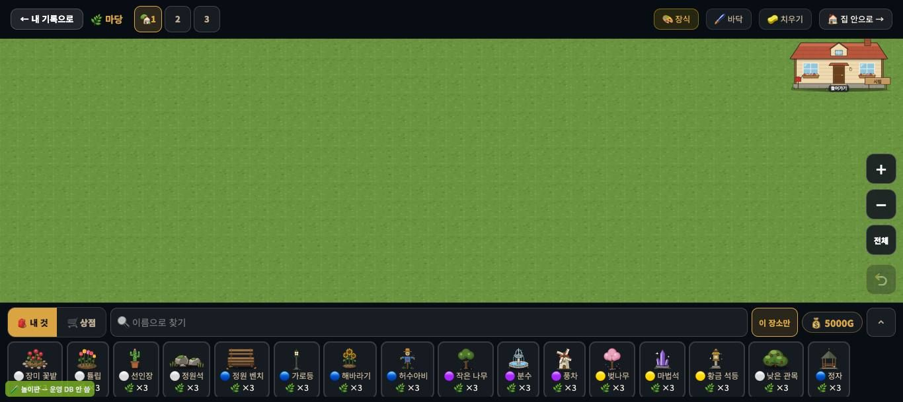
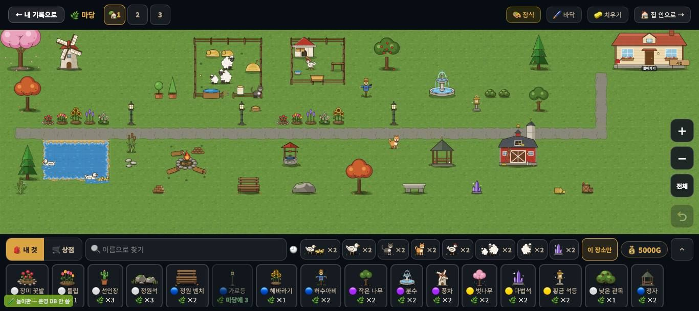
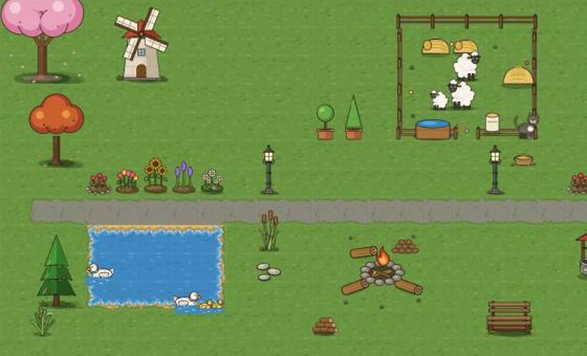
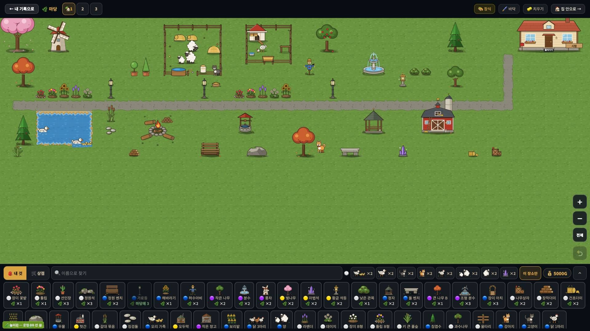
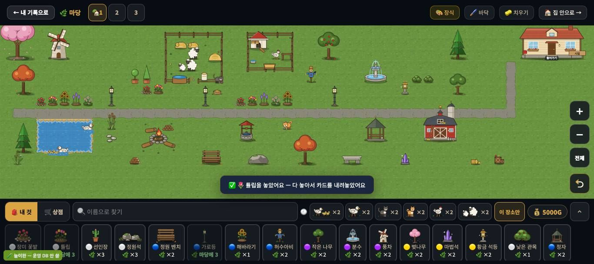
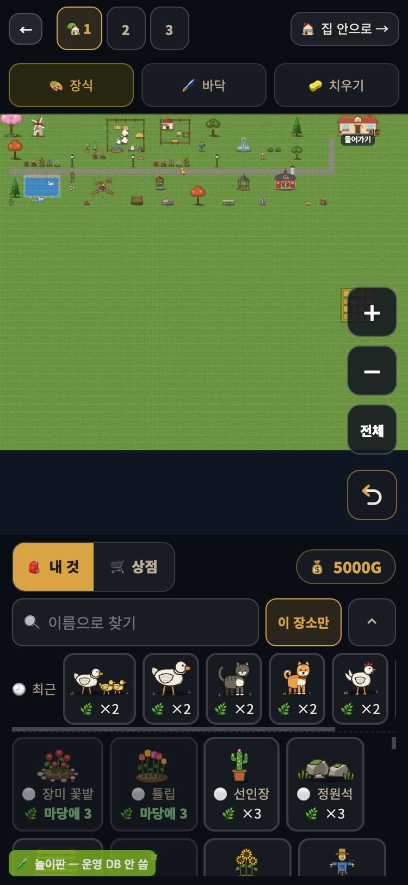
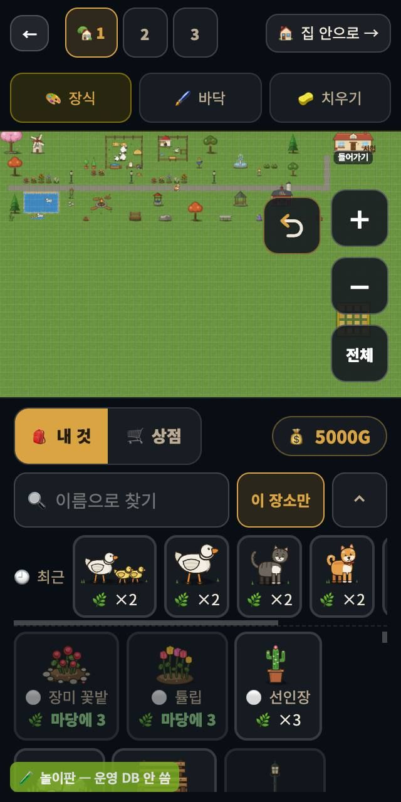

# 창조자의 눈 — 관찰 기록 39회: 꾸미기 마당 되밟기 (#910 · #912 · #913 · #924 · #927 · #955)

> 무한 진행. 고른 것: 막 머지된 꾸미기 쪽 — **#927 알림은 한 번에 하나 · 서랍 위** · **#924 폰 윗줄 두 줄** · **#955 나무 그림자 타원** · 그리고 31회 마당 줄을 풀려던 **#910 결·크기 위계 · #912 마당 땅 · #913 화면 맞춤**.
> 본 판: main `6c3b228`(제 worktree = main + 문서) · 저장소의 꾸미기 놀이판 `scripts/unit/deco-save-count/play.mjs`(포트 8784 · **운영 DB 안 씀** · '시험' 학생 자동 입장 · 골드 5000).
> **코드 수정 0 · 화면 창 0.** 제 headless 크롬을 **GPU(Metal)**로 썼고, firebase 요청은 막았습니다. 끝나면 크롬과 놀이판을 껐습니다.
> 31회와 **같은 배치 53개**(양 목장·닭장·풍차·벚나무·연못·자갈길·동물 일곱 …)를 다시 놓았습니다 — 52개가 놓였고, 둥근 나무 2 하나는 "가진 개수가 모자라요".

## 한 줄
**31회의 '모눈종이 땅'은 풀밭이 됐고(31-ⓑ71 ✔), 알림 포갬(27-2절 ✔)·폰 윗줄(✔)·내 집 잘림(D1·D7 ✔)도 풀렸습니다.**
- 가로등·분수·작은 나무의 크기도 제자리를 찾았습니다(31-ⓑ73 ✔).
- 남은 것은 **동물 다섯이 여전히 한 크기(23~31px)**, **풍차 = 큰 나무 높이**입니다(31-ⓑ72 일부).

---

## 1. 땅과 첫 화면 — 31-ⓑ71 · D1·D7

**사실**
- 빈 마당에 **모눈선이 보이지 않습니다.** 땅은 잔 얼룩이 있는 풀밭입니다.
- 내 집은 오른쪽 위에 **지붕·창·'들어가기'·이름판까지 온전히** 보입니다. 굴뚝 끝만 머리줄에 닿습니다(잘리지 않음).
- 1920 에서도 마당 전체가 보이고 집이 온전합니다.

**해석** — 31-ⓑ71(모눈종이 땅) **닫힘** ✔(#912). D1·D7(내 집 잘림) **닫힘** ✔.

## 2. 가득 채운 마당 — 결 · 크기 위계 · 그림자 (31-ⓑ72 · ⓑ73 · #955)

**사실 — 보이는 크기(`bbox.json` · 한 칸 27px)**

| 물건 | 31회 | **39회** |
|---|---|---|
| 가로등 | 19×35 | **19×49** |
| 분수 | 48×33 | **54×56** |
| 작은 나무 | 54×70 | **39×52** |
| 큰 나무 B | 54×72 | 54×72 |
| 풍차 | 53×74 | 53×74 |
| 강아지 · 고양이 · 닭 · 양 · 오리 | 26×32 · 26×27 · 24×25 · 27×31 · 27×25 | **23×29** · 26×27 · 24×25 · 27×31 · 27×25 |

- 사진에서 나무마다 발밑에 **둥근 그림자**가 있습니다(#955 '쐐기 → 부드러운 타원').
- 가로등은 **등머리가 있는 굵은 선**이고, 분수는 3단 물줄기입니다.
- 동물을 놓은 칸 (고양이 9,18)의 화면 색은 옆 잔디와 **같습니다**(106,148,64 = 106,148,64). 27회의 '어두운 네모'가 없습니다.

**해석**
- 31-ⓑ73(결이 튀는 것) **닫힘** ✔(#910): 가로등이 이제 강아지보다 확실히 크고, 분수가 '물그릇'이 아닙니다.
- 31-ⓑ72 는 **일부**입니다. 작은 나무 < 큰 나무 B ✔ · 가로등 > 강아지 ✔. 그러나 **동물 다섯은 23~31px 로 여전히 한 크기**이고, **풍차는 큰 나무 B 와 같은 높이**입니다.
- 27-ⓑ58(동물 칸 어두운 네모)은 **화면에서 안 보입니다**. 고친 PR 은 커밋 기록에서 찾지 못했습니다.

## 3. 알림 — #927 (27-2절)

**사실(1366 · 카드 고르기 → 칸 누르기 · 두 번)**

| 때 | 보이는 알림 수 | 글 | 자리(윗선~아랫선) |
|---|---|---|---|
| 고른 뒤 | **1** | 🌹 골랐어요 — 놓을 칸을 누르세요 · 화면 옮기기는 두 손가락 또는 … | 405 ~ 449 |
| 놓은 직후 | **1** | ✅ 🌹 장미 꽃밭을 놓았어요 — 다 놓아서 카드를 내려놓았어요 | 405 ~ 449 |
| 0.7초 뒤 | 1 | (같은 글) | 같음 |

서랍 윗선은 459 입니다.

**해석** — 27-2절(두 줄 포갬) **닫힘** ✔. 알림이 서랍 **10px 위**에 한 줄로만 뜨고, 카드를 가리지 않습니다.

## 4. 폰 윗줄 — #924

 

**사실** — 375 · 320 폭(모바일 흉내) 모두 윗줄이 **두 줄**입니다(← · 1 2 3 · 🏠 집 안으로 / 🎨 장식 · 🖌️ 바닥 · 🧽 치우기). '🧽 치우기'(375 에서 252~367)와 '🏠 집 안으로 →'가 **화면 안**에 있습니다.

**해석** — 폰에서 치우기·집 안으로가 화면 밖이던 것은 풀렸습니다 ✔.
- (사실) 폰은 마당 **높이를 채워** 열려(#913), 한 칸이 약 7px 입니다. 물건이 아주 작아 아이가 손가락 두 개로 키워야 합니다.
- (사실) 오른쪽 아래 확대 단추 뒤에 **안 놓은 밭 덩어리**가 반쯤 가려져 있습니다(31-ⓒ73 과 같은 것).

---

## 목록(`docs/clumsy_list.md`)에서 고칠 줄 — #962 머지 뒤 이 PR 에 반영

| 줄 | 전 | 후 |
|---|---|---|
| 31-ⓑ71 땅이 모눈종이 | 맡음 | **닫힘(#912) ✔39회** |
| 31-ⓑ73 결이 튀는 것 | 맡음 | **닫힘(#910) ✔39회** — 가로등 19×49 · 분수 54×56 |
| 31-ⓑ72 크기 위계 | 맡음 | **일부** — 작은 나무·가로등 ✔ · 동물 다섯 한 크기 · 풍차 = 큰 나무 |
| 27-2절 알림 포갬 | 맡음 | **닫힘(#927) ✔39회** — 알림 1개 · 서랍 10px 위 |
| 27-ⓑ58 동물 칸 어두운 네모 | 열림 | **닫힘(PR 못 찾음) ✔39회** — 칸 색 = 옆 잔디 |
| D1·D7 내 집 잘림 | 맡음 | **닫힘(#913 · #858) ✔39회** — 굴뚝 끝만 머리줄에 닿음 |
| 31-ⓑ74 들어올 때 카메라 | 맡음 | 그대로 — **되밟지 못함**(31회 배치가 원래 왼쪽 위라 가를 수 없음) |

# ⓐ 없음 · ⓑ 새 줄 없음 · ⓒ 새 줄 없음

## 미검증 · 한계
- 꾸미기 마당은 캔버스 2D 라 GPU 여부와 그림이 거의 같습니다(그림자는 그림 속에 그려진 것).
- 크기는 `bbox.json` 의 '보이는 상자'입니다(실제 화면 픽셀 아님 · 31회와 같은 잣대).
- 폰은 `mobile: true` 흉내입니다(실제 폰 아님).
- 집 안(29회 줄)은 이번에 보지 않았습니다.
- 통과는 조작·표시 길만 뜻합니다.
