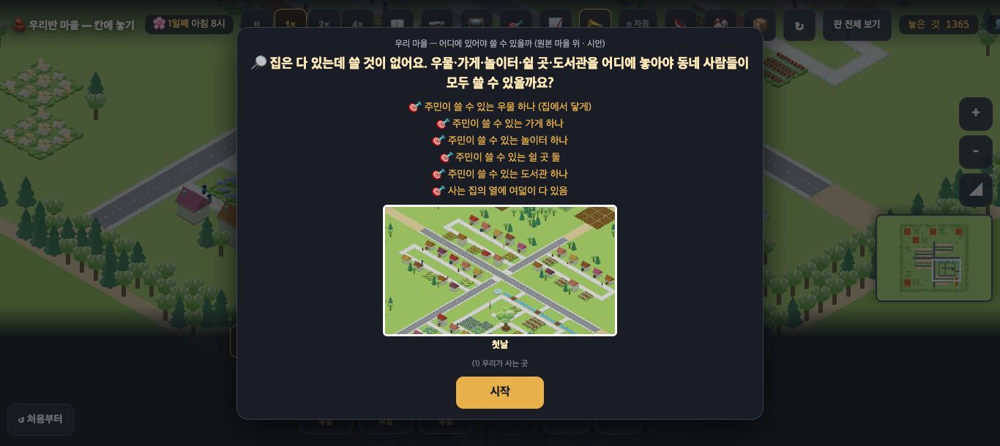
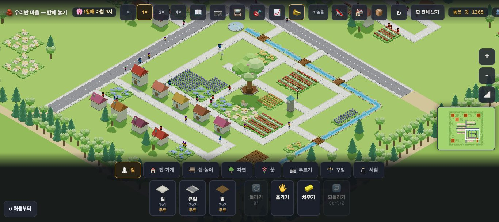
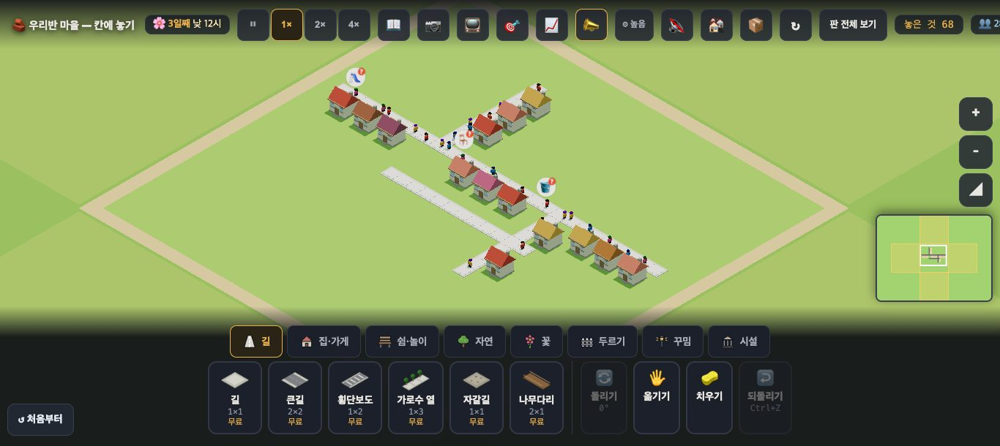
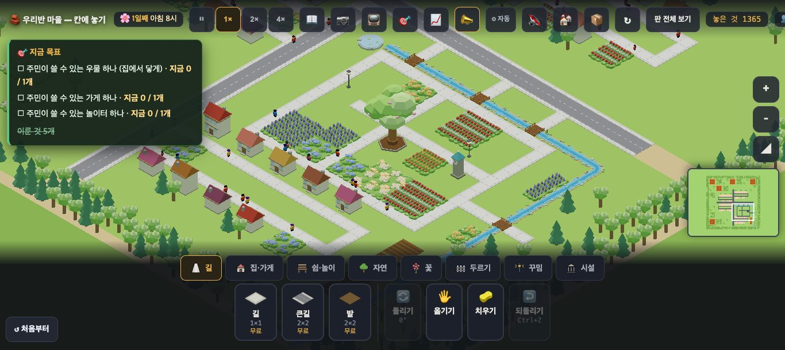
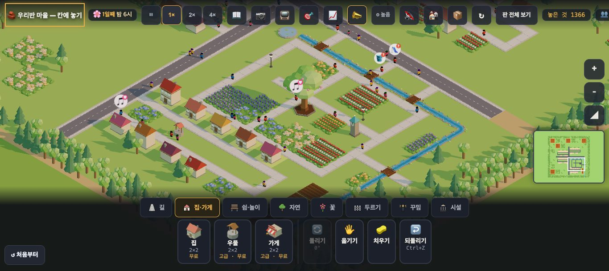

# 창조자의 눈 — 관찰 기록 40회: 수업 판 시안 town3-origin(#952) — 아이가 할 일을 찾나

> 무한 진행. 고른 것: 막 머지된 **#952 수업 판 시안**(`?stage=town3-origin` — 원본 마을에서 우물·가게·놀이터·긴의자·도서관 등을 뺀 판 · 교과 "(1) 우리가 사는 곳"). 옛 **town3** 와 견줍니다.
> 본 판: main `6c3b228` · 제 서버 8781 · `?sid=guest` · **코드 수정 0 · 화면 창 0** · GPU(Metal) · 그림자 보임 · 1366×610.
> 이번 회는 **수업 흐름**(카드 → 첫 10초 → 한 수 → 30초 뒤)에 집중했습니다. 그래서 두터운 틀(시각 셋·비·1920)은 **건너뛰었습니다.**

## 한 줄
**한 수의 대답은 또렷합니다.** 우물 하나를 놓으면 곧 "🎯 목표 달성!"이 뜨고, 30초 뒤 곁의 집 8채가 😟 → 😐 로 바뀝니다. 집마다 "장 볼 곳·놀 곳이 멀어요"라는 **다음 할 일**도 나옵니다.
그런데 **카드를 닫은 뒤 첫 10초에는 할 일이 화면에 없습니다.**
- 목표판이 닫혀 있습니다.
- 바람 풍선이 0개입니다.
- 마을은 이미 **완성된 예쁜 원본**처럼 보입니다.

---

## 1. 첫 카드

**사실** — 카드 글: "우리 마을 — 어디에 있어야 쓸 수 있을까 (원본 마을 위 · 시안) · 🔎 집은 다 있는데 쓸 것이 없어요. 우물·가게·놀이터·쉴 곳·도서관을 어디에 놓아야 동네 사람들이 모두 쓸 수 있을까요?" + 🎯 여섯 줄.
**해석** — 질문과 목표가 분명합니다 🟢. 옛 town3 카드와 글이 거의 같습니다.

## 2. 카드를 닫은 뒤 첫 10초

| | **town3-origin** | 옛 town3 |
|---|---|---|
| 집 · 기분(`__houseText` 첫 이모지) | 34채 · 😟 33 · 😐 1 | 14채 · 😟 14 |
| 목표판(`#goals`) | **닫힘**(display none) | **닫힘** |
| 10초 안 토스트 | 0 | "🔓 땅을 하나 더 가질 수 있어요! 노란 땅을 눌러 고르세요"(0초) |
| 10초 안 바람 풍선(`__wishes`) | **0** | 사진에 🪣 등 셋 |
| 떠 있는 얼굴(`__faces`) | 😟 1 | 0 |
| 첫 화면 | 원본의 큰 나무 공원 · 꽃밭·라벤더·개울·다리(1일째 아침 9시) | 빈 풀밭에 집 두 줄(3일째 낮 12시) |

- 비교로, 바닷가 판은 같은 때 목표판이 **열려** 있습니다.
- 🎯 단추를 누르면 목표판이 열립니다.

**해석**
- 🟡 **문제가 보이지 않는 첫 장면** — town3-origin 은 원본의 꽃밭·공원·개울이 그대로라 **이미 다 된 마을**로 보입니다. 34채 중 33채가 😟 이지만, 첫 10초엔 그 얼굴도 바람 풍선도 거의 안 뜹니다. 옛 town3 는 빈 풀밭 + 바람 풍선으로 "뭐가 없구나"가 먼저 보였습니다.
- 🟡 **목표판이 닫혀 있음** — 카드를 닫으면 여섯 목표를 다시 볼 곳이 🎯 단추뿐입니다(옛 town3 도 같음 · 바닷가는 열림).

## 3. 한 수 — 우물 하나

**사실**
- 화면 안에서 `__try('well')` 이 되고 **6칸 안 집이 가장 많은 칸** (134,148)을 골랐습니다(집 8채). 진짜 누르기로 놓았습니다(카드는 '집·가게' 탭).
- 누르자마자 토스트 "**🎯 목표 달성! 주민이 쓸 수 있는 우물 하나 (집에서 닿게)**".
- 2배속 30초 뒤(판 속 약 8시간):
  - 😟 33 → **25**, 😐 1 → **9**.
  - 곁 집 8채가 모두 "😐 **장 볼 곳·놀 곳이 멀어요** · 나무가 많아 좋아요".
- 목표판(열어 보면): 남은 셋 = 가게 · 놀이터 · 쉴 곳 둘 · "**이룬 것 6개**".

**해석**
- 🟢 **원인 → 결과 → 다음 할 일**이 한 번에 읽힙니다. "우물을 놓으니 이 집들이 조금 나아졌고, 이제 가게와 놀 곳이 필요하대" — 이 판이 노리는 수업 그대로입니다.
- 🟡 **"이룬 것 6개"** — 아이는 우물 하나만 놓았습니다. 나머지 다섯은 시작 저장본이 이미 채운 **기본 목표**(길 6칸 · 집 3채 · 주민 1명 · 주민 10명 · 꾸밈 5 · `__goals().이룬것`)입니다. 수업 목표와 섞여 "내가 뭘 여섯 개나 했지?"가 될 수 있습니다. `__goals().남은수` 도 28 입니다(수업 목표 6 + 기본 목표).

---

## 목록(`docs/clumsy_list.md`)에 더할 줄 — #962 · #970 머지 뒤 반영

# ⓐ 없음
# ⓑ
- **ⓑ90.** 수업 판(town3 · town3-origin)에서 **목표판이 처음에 닫혀 있음** — 카드를 닫으면 할 일이 화면에 없음(바닷가는 열림). (재는 법: 카드 닫고 1.5초 뒤 `#goals` display)
- **ⓑ91.** town3-origin 은 시작부터 **"이룬 것 5개"**(수업과 무관한 기본 목표) — 우물 하나 놓으면 "이룬 것 6개". (재는 법: `__goals().이룬것`)
# ⓒ
- **ⓒ80.** town3-origin 첫 10초 — 완성된 원본처럼 보이는 마을에서 아이가 **"쓸 것이 없다"는 문제를 스스로 찾나**(바람 풍선 0 · 😟 얼굴 1).

## 미검증 · 한계
- 1366 한 크기 · 맑은 1일째만 봤습니다(두터운 틀 건너뜀).
- 우물 자리는 제가 셈으로 고른 **좋은 자리**입니다. 아이가 고를 자리가 아닙니다.
- 바람 풍선은 10초까지만 셌습니다. 사진(30초 뒤)에는 🪣 등 풍선이 떴습니다.
- 통과는 조작·표시 길만 뜻합니다.
