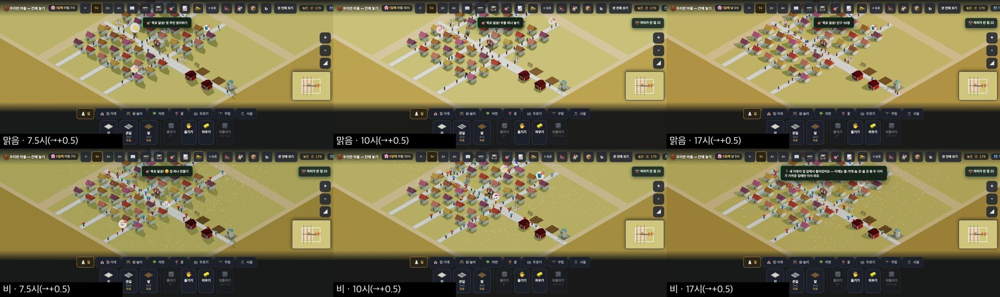
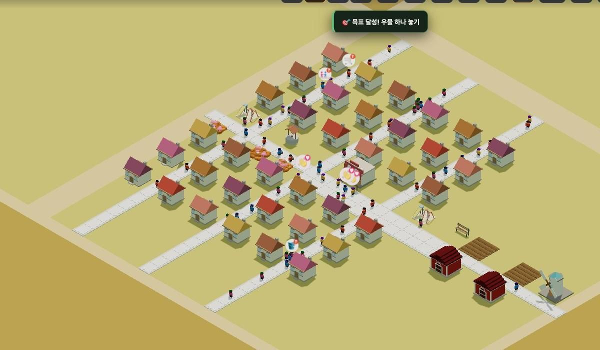
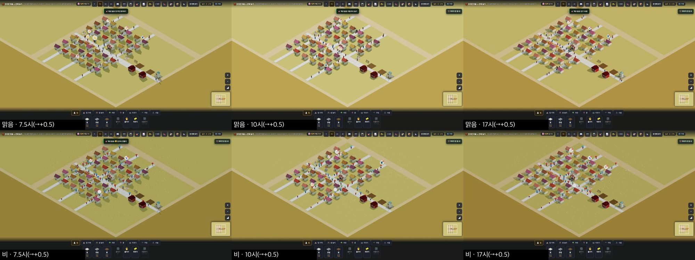
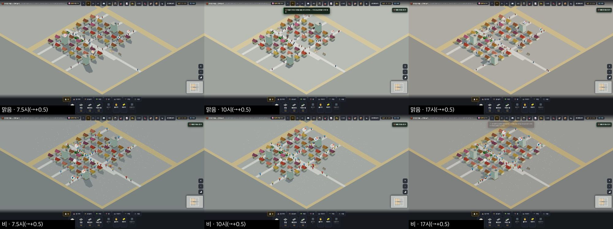
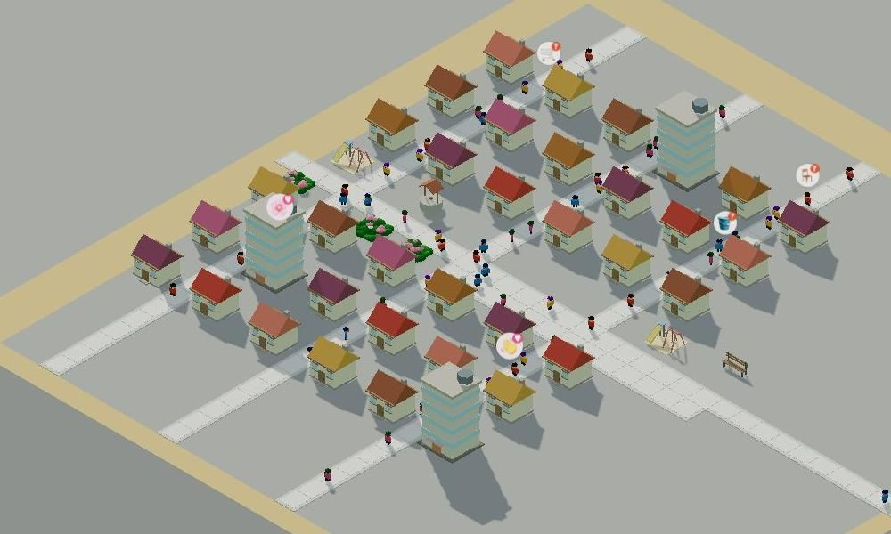
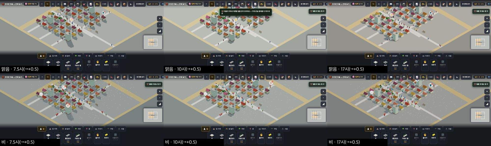

# 창조자의 눈 — 관찰 기록 41회: farm · city '우와' 판정 — GPU 로 처음 (mid36)

> 무한 진행. 고른 것: 판을 돌아가며 — GPU 로 아직 안 본 **farm(농촌)** 과 **city(도시)**.
> 본 판: main `339ed29` · 제 서버 8781 · `?sid=guest&stage=farm|city` 새 프로필에 **표준 시험 저장본 mid36** 을 `__importText` 로 가져와 다시 열었습니다(33회와 같은 방법).
> **코드 수정 0 · 화면 창 0** · GPU(Metal) · '높음' · **그림자 보임**.
> 두터운 틀: 1366 · 1920 × 7.5 · 10 · 17시(찍힌 시각 +0.5) × 맑음 · 비(6일째).
> ⚠ mid36 은 **농촌·도시를 위해 지은 마을이 아닙니다**(집 덩어리 + 가게·우물·놀이터 몇). 그래서 '농촌다움·도시다움'은 **땅빛·높이·빈 곳**만 판정합니다.
> ⚠ 가져온 직후엔 이미 이룬 목표의 토스트("🎯 목표 달성! 첫 주민 맞이하기" · "우물 하나 놓기" · "인구 10명" …)가 **한 장면에 하나씩 이어서** 떴습니다. 가져오기 탓이고, 아이가 짓는 판에선 이렇게 몰리지 않습니다.

## 한 줄
**city 는 GPU 그림자로 '높은 건물'이 드디어 높아 보입니다** — 아파트 셋이 아침에 긴 그림자를 드리웁니다.
**두 판 모두 땅 전체가 한 빛입니다.** farm 은 겨자빛, city 는 회색입니다. 바닷가가 고치기 전(34~35회 '사막')과 같은 꼴입니다. 1920 에서는 마을이 넓은 한 빛 판 가운데 작은 덩어리로 보입니다.

---

## 1. farm — 겨자빛 땅

**사실**
- 판 모습 `계절 가을 · 풀 #c9bd6a · 바닥 #b59a4f` 입니다. 사진에서 열린 구역·잠긴 땅이 **모두 겨자빛**입니다.
- 밭은 헛간 곁 **갈색 이랑 두 칸**뿐입니다(mid36 의 밭 수).
- 오른쪽 위 칩은 "자리가 찬 집 22" 입니다.

**해석**
- 🟡 겨자빛 땅은 '가을 들판'으로도, **'마른 땅·모래'**로도 읽힐 수 있습니다. 밭(갈색)이 적은 mid36 에서는 후자에 가깝습니다. 바닷가처럼 **"땅 전체가 모래빛"**이라는 첫인상입니다.
- (가설) 아이가 밭을 여럿 일군 농촌에선 갈색 이랑이 땅을 덮어 '들판'으로 읽힐 것입니다. **아이가 지은 농촌 판으로 다시 봐야** 합니다(ⓒ81).

## 2. city — 회색 땅 · 긴 그림자

**사실**
- 판 모습 `여름 · 풀 #b3b5b2 · 바닥 #969a99` 로 **땅 전체가 회색**입니다.
- 아침 8시 사진에서 아파트 셋이 **집 여러 채를 덮는 긴 그림자**를 드리웁니다. 한낮엔 짧아지고, 17시 반엔 반대쪽으로 깁니다.
- 칩은 "일할 곳 없는 집 31" 이고, 토스트는 "마을이 커져서 어른들 일할 곳이 모자라요 — 가게·온실·풍차를 더 지어 봐요" 입니다.
- 1920 에서 마을 덩어리는 화면 폭의 약 1/3 입니다. 둘레는 빈 회색입니다.

**해석**
- 🟢 **그림자가 높이를 말해 줍니다.** 소프트웨어 그림(36회까지)에선 아파트가 '높은 상자'였는데, 이제 **하루 동안 도는 그림자**가 "높은 건물은 그늘도 크다"를 보여 줍니다. 도시 판의 이름("높은 건물과 큰길")이 화면에서 읽힙니다.
- 🟡 **나무·풀 한 점 없는 회색 판**은 '도시'보다 **'넓은 주차장'**으로 읽힐 수 있습니다. 17시 반의 따뜻한 빛에서도 차갑습니다.
- 🟡 비 오는 날: 우산은 보이지만 회색 위 옅은 흰 점(빗방울)은 거의 안 보입니다(37-ⓒ79 와 같음).

---

## 목록(`docs/clumsy_list.md`)에 더할 줄 — 앞 회 PR 들이 머지된 뒤 반영

# ⓐ 없음
# ⓑ
- **ⓑ92.** farm · city 는 **땅 전체가 한 빛**(겨자빛 #c9bd6a · 회색 #b3b5b2) — 바닷가가 고치기 전과 같은 꼴 · 1920 에선 넓은 한 빛 판 가운데 작은 마을. (재는 법: 첫 화면 사진에서 열린 구역 땅 픽셀 · 나무·풀 없는 곳의 비율)
# ⓒ
- **ⓒ81.** 아이가 **밭을 여럿 일군 농촌 판**에서 겨자빛 땅이 '가을 들판'으로 읽히나(mid36 은 밭 둘뿐이라 판정 못 함).
- **ⓒ82.** 도시 판의 회색 땅을 아이가 '도시'로 읽나, '주차장'으로 읽나 — 긴 그림자는 알아채나.

## 미검증 · 한계
- mid36(표준 시험 저장본)이라 판마다 맞춘 마을이 아닙니다.
- GPU 그림 · headless 입니다.
- 가져온 직후의 목표 토스트 몰림은 가져오기 탓이라 줄로 세지 않았습니다.
- 통과는 조작·표시 길만 뜻합니다.
