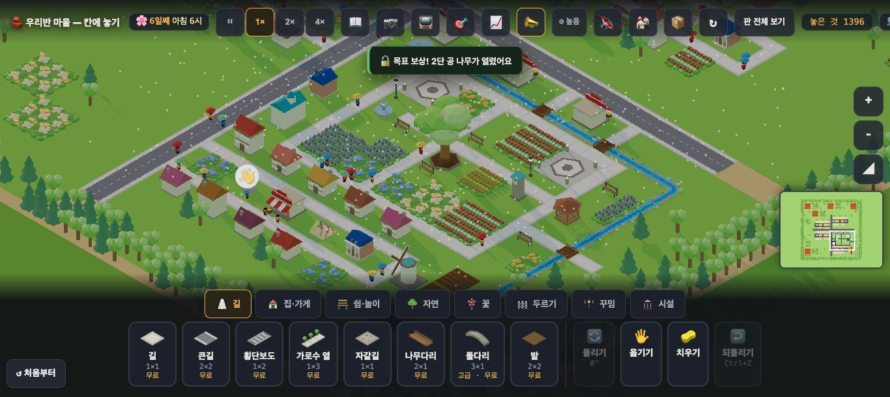

# 창조자의 눈 — 관찰 기록 42회: 지형 말 셋 · 해금 조사(#976) 되밟기

> 무한 진행. 고른 것: 막 머지된 **#976**(36-ⓑ84 · 36-ⓑ85 · 37-ⓑ87 을 고쳤다고 적음).
> 본 판: main `639f9f5` · 제 서버 8781 · `?sid=guest` · **코드 수정 0 · 화면 창 0** · GPU(Metal) · 1366.
> 진짜 누르기로 봤습니다. 커서를 올려 `__whyup()` 을 읽고, 토스트를 비운 뒤 누르고 `#toast` 를 읽었습니다. 화면 밖 칸은 `__try` 로 봤습니다.

## 한 줄
**셋 다 닫혔습니다 ✔.** 비탈에 길을 놓으면 이제 **고갯길로 가라**고 알려 주고, 비탈 안쪽 산장은 **따를 수 있는 자리**를 말하며, 해금 알림은 "나무**가**"입니다.

## 1. 산 판 말

| # | 한 것 | 커서 풍선 | 누른 뒤 토스트 | 36~37회 |
|---|---|---|---|---|
| A | 비탈에 길 (131,140) | ⛰️ 비탈엔 **길을 낼 수 없어요 — 산은 고갯길(흙빛 줄)로 넘어요** | 같은 말 | "큰 건물을 지을 수 없어요" |
| A2 | 비탈에 자갈길 (132,139) | (같은 말) | 같은 말 | — |
| G | 고갯길 옆 비탈에 길 (155,138) | (같은 말) | 같은 말 | "큰 건물을…" |
| H | 고갯길에 **큰길** (155,140) | 🛤️ 고갯길은 **좁아서 한 칸 길(길·자갈길)만** 낼 수 있어요 | 같은 말 | "고갯길에는 길만" |
| I | 비탈 안쪽 산장, 길 없음 (131,137) | 산장은 길에 붙어야 해요 — 비탈엔 길을 못 내니, **골짜기 길이나 고갯길 바로 옆 비탈에** 놓아요 | 💡 노란 자리에 놓을 수 있어요 — 길 바로 옆이에요 | "먼저 ⬜ 길을 놓아 주세요" |
| J | 비탈에 집 (130,135) · `__try` | ⛰️ 비탈에는 큰 건물을 지을 수 없어요 — 평평한 곳을 찾아요 | — | 같음(집은 큰 건물이 맞음) |

`__try('cabin', 156,134)` · `(131,133)` 도 I 와 같은 새 말입니다.

**해석**
- 36-ⓑ84 · 36-ⓑ85 **닫힘** ✔. 특히 A 의 말이 "고갯길(흙빛 줄)"을 **이름과 색으로** 가리켜, 36-ⓑ86(고갯길이 테두리처럼 보임)의 일부를 **말로** 메웁니다. 아이가 비탈에 길을 놓으려는 순간 "산은 하나뿐인 고갯길로 넘는다"를 배웁니다.
- I 는 풍선과 토스트가 **다른 말**입니다(PR 이 '노란 자리 밝히기'를 뜻하고 남겼다고 적음). 아이가 풍선을 못 보고 토스트만 보면 "노란 자리"로 갑니다. 그 노란 자리가 **골짜기 가장자리 비탈**을 가리키는지는 이번에 사진으로 확인하지 못했습니다.

## 2. 해금 알림 조사 (37-ⓑ87)

**사실**
- 원본 판에서 6일째로 건너뛰자 5.8초에 **"🔓 목표 보상! 2단 공 나무가 열렸어요"**가 떴습니다(37회엔 "나무이").
- 코드 두 곳(목표 보상 · 인구 해금)이 모두 `josa(…, '이', '가')` 를 씁니다.

**해석** — 37-ⓑ87 **닫힘** ✔. 인구 해금 알림은 이번 회에 화면으로 보지 못했습니다(코드만 확인).

## 목록(`docs/clumsy_list.md`)에서 고칠 줄 — 앞 회 PR 들이 머지된 뒤 반영

| 줄 | 전 | 후 |
|---|---|---|
| 36-ⓑ84 비탈 길 '큰 건물' | 열림 | **닫힘(#976) ✔42회** |
| 36-ⓑ85 따를 수 없는 산장 말 | 열림 | **닫힘(#976) ✔42회** — 풍선은 새 말 · 토스트는 '노란 자리' |
| 37-ⓑ87 해금 조사 | 열림 | **닫힘(#976) ✔42회** — "2단 공 나무가" |
| 36-ⓑ86 고갯길이 테두리처럼 | 열림 | 열림 — 그림은 그대로 · 말(A)이 "고갯길(흙빛 줄)"을 가리킴 |

# ⓐ 없음 · ⓑ 새 줄 없음 · ⓒ 새 줄 없음

## 미검증 · 한계
- 산장 노란 자리가 어디를 밝히는지(골짜기 가장자리 비탈인지)는 사진으로 확인하지 못했습니다.
- 인구 해금 알림은 코드로만 확인했습니다.
- 통과는 조작·표시 길만 뜻합니다.
