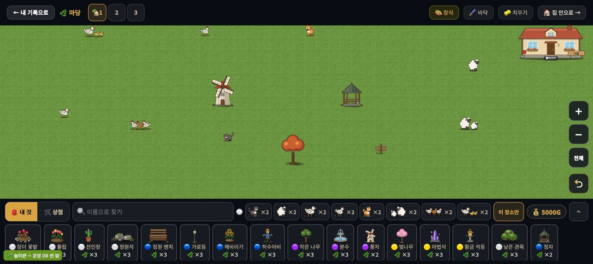
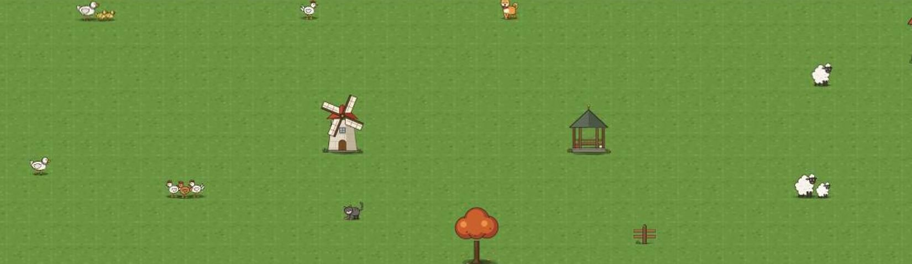

# 창조자의 눈 — 관찰 기록 43회: 살아 있는 동물(#944) — 27회 기준선과 같은 잣대로 전·후

> 무한 진행. 보스 추천: **#944 살아 있는 동물**(상태 그림 · 칸 길찾기 · 걸음 · 먹이통 · 쓰다듬기). 27회 '고치기 전 기준선'과 **같은 배치 · 같은 잣대**로 다시 쟀습니다.
> 본 판: main `894f55c`(#944 들어감) · 저장소 꾸미기 놀이판 `play.mjs` 8784(**운영 DB 안 씀** · '시험' 학생) · 1366×610.
> **코드 수정 0 · 화면 창 0** · 제 headless 크롬(GPU Metal) · firebase 요청 막음 · 끝나면 크롬과 놀이판을 껐습니다.
> 잣대(27회 3절 그대로):
> - 고른 카드를 푼 뒤 **60초 동안 0.1초마다** 동물마다 `img` 사각형 · `img.src`(상태 그림) · `.bob` transform · 폴짝을 기록했습니다(표본 605).
> - 멈춤 = x 변화 ≤ 0.5px · y 변화 ≤ 3px.
> - 미끄러짐 = 움직인 표본 중 걸음 그림(`_walk` · `_b` · `_swim`)도 폴짝도 아닌 것.

## 한 줄
**27회의 어설픔 둘이 수로 풀렸습니다 ✔.**
- 미끄러짐: 셋이 100% → **모두 0~1.7%**.
- 같은 박자 2px 들썩임: **꺼짐**. 가만히 있는 그림 안에서 숨쉬기·눈 깜빡임·귀·꼬리가 움직이고, 쪼기 그림이 섞입니다.
- 걸음 간격은 강아지 3.6초 ~ 고양이 13.5초로 **성격마다** 다릅니다. 동물끼리 겹침은 0 입니다.

남은 작은 것 하나: **강아지 몸 한가운데를 누르면 두 번 다 반응이 없었습니다**(조금 위·아래는 반응함).

---

## 1. 전·후 표 (같은 배치 · 60초 · 0.1초 표본)

배치(행,열)는 27회와 같습니다: 오리 가족 (3,9) · 닭 3마리 (7,12) · 양 (8,37) · 강아지 (3,22) · 닭 1마리 (3,18) · 오리 1마리 (10,5) · 양 1마리 (4,40) · 고양이 (8,20). 둘레에 풍차 (5,18) · 정자 (5,29) · 큰 나무 B (10,24) · 울타리 (10,32). 울타리 (10,35)는 가진 수가 모자라 못 놓았습니다.

| 동물 | ⓑ 미끄러짐 27회 → **43회** | ⓐ 멈춘 동안 그림이 바뀐 수 27회 → **43회** | 상태 그림 표본(가만히·걷기·쪼기) | ⓔ 걸음 간격(초) 평균·최소~최대 · 60초 걸음 수 27회 → **43회** |
|---|---|---|---|---|
| 오리 가족 | 100% → **0%** (0/108) | 0 → **20** | 408 · 132 · 65 | 5.9 · 10번 → **8.0 · 2.2~12.8 · 8번** |
| 닭 3마리 | 100% → **1.7%** (1/60) | 0 → **23** | 360 · 76 · 169 | 5.3 · 11 → **5.2 · 2.2~11.3 · 6** |
| 양 | 100% → **0%** (0/19) | 0 → **6** | 557 · 22 · 26 | 8.3 · 7 → **걸음 1번**(간격 못 셈) |
| 강아지 | 8% → **1.7%** (4/235) | 6 → **33** | 271 · 269 · 65 | 3.9 · 15 → **3.6 · 1.7~6.6 · 17** |
| 닭 1마리 | 11% → **0%** (0/76) | 7 → **20** | 396 · 104 · 105 | 4.8 · 12 → **6.1 · 2.0~9.7 · 6** |
| 오리 1마리 | 14% → **0.8%** (1/126) | 3 → **29** | 304 · 158 · 143 | 6.6 · 9 → **5.5 · 2.2~15.8 · 11** |
| 양 1마리 | 13% → **0%** (0/42) | 6 → **11** | 499 · 53 · 53 | 8.1 · 8 → **9.5 · 8.7~10.3 · 3** |
| 고양이 | 12% → **0%** (0/37) | 7 → **10** | 514 · 52 · 39 | 5.0 · 12 → **13.5 · 6.2~25.8 · 4** |

**함께 본 값**
- `.bob` transform 은 모두 `none` 입니다. 27회의 **같은 1.6초 · 2px 들썩임이 꺼졌습니다.**
- 가만히 그림(`_idle.svg`) 안에 CSS 애니메이션이 들어 있습니다. 강아지 `br · bl · er · tilt · wag`, 고양이 `br · bl · er · tf · lk`, 양 `br · ch · bl · ef` 등 — 숨·눈 깜빡임·귀·꼬리로 보입니다(이름은 파일의 `@keyframes`).
- 동물 둘의 상자가 15% 넘게 겹친 표본은 **0** 입니다.
- 사진(60초 뒤)에서 동물 자리에 **어두운 네모가 없습니다**(27-ⓑ58 · 39회와 같음).

**해석**
- 27-ⓑ55(미끄러짐) **닫힘** ✔ · 27-ⓑ56(같은 박자 들썩임) **닫힘** ✔. 멈춘 동안 그림이 바뀐 수는 **표본 바깥**(SVG 안 애니메이션)까지 치면 훨씬 많습니다. 이 잣대(`src` 바뀜)는 쪼기·가만히 바뀜만 셉니다.
- 걸음 간격이 강아지(자주 · 17번)와 고양이·양(드물게 · 1~4번)으로 **벌어졌습니다**. #944 의 성격 표(닭 부산 · 양 느긋 · 강아지 들뜸)가 화면 수로 보입니다. 27-ⓒ57("간격이 성격으로 읽히나")은 이제 아이에게 물을 만한 차이가 됐습니다.

## 2. 누름 반응 (ⓓ)

| 동물 · 누른 곳(그림 높이 비율) | 반응 | 첫 반응(ms) |
|---|---|---|
| 고양이 · 가운데 / 아래 / 위 | 야옹 + 기쁨 그림 | 33 / 18 / 19 (첫 채집 때 가운데 22) |
| 닭 1마리 · 가운데 | 꼬꼬댁 + 기쁨 | 19 |
| 양 · 가운데 | 메~ + 기쁨 | 21 |
| 오리 가족 · 가운데 / 아래 / 위 | 꽥! + 기쁨 | 34 / 17 / 22 (첫 채집 때 가운데 **없음**) |
| **강아지 · 가운데** | **없음**(1.5초 기다림 · 두 번 다) | — |
| 강아지 · 아래 / 위 | 왈! + 기쁨 | 32 / 33 |

- 누른 곳의 맨 위 요소는 모두 캔버스였습니다(동물 그림은 누름을 받지 않음 · 판이 칸으로 가림).
- 누르는 동안 장식 수 12 그대로 · 고른 카드 없음 — 27-ⓐ5('쓰다듬으려다 또 놓임')는 다시 안 일어났습니다.

**해석** — 반응 속도는 27회와 같이 빠릅니다(17~34ms). 그런데 **강아지 몸 한가운데**는 두 번 다 반응이 없었습니다.
- (가설) 누름을 '누른 칸'으로 가리는데, 강아지 그림 가운데가 칸 경계에 걸리거나 옆 칸으로 잡히는 것일 수 있습니다. 아이는 대개 몸 한가운데를 누르니 확인할 만합니다(ⓑ93).

---

## 목록(`docs/clumsy_list.md`)에서 고칠 줄 — 앞 회 PR 들이 머지된 뒤 반영

| 줄 | 전 | 후 |
|---|---|---|
| 27-ⓑ55 걸음 그림 없는 셋 · 미끄러짐 100% | 맡음 | **닫힘(#944) ✔43회** — 0~1.7% |
| 27-ⓑ56 같은 박자 2px 들썩임 | 맡음 | **닫힘(#944) ✔43회** — 들썩임 꺼짐 · 그림 안 숨·깜빡임 · 쪼기 |
| 새 줄 | — | 43-ⓑ93 |

# ⓐ 없음
# ⓑ
- **ⓑ93.** 강아지 **몸 한가운데**를 누르면 반응이 없음(2/2) — 위·아래는 반응(17~34ms). (재는 법: 멈춘 강아지 `img` 사각형 가운데를 눌러 `.deco-anim-say` 가 1.5초 안에 뜨나)
# ⓒ 새 줄 없음(27-ⓒ56~58 은 그대로 — 이제 물을 만한 차이가 생김)

## 미검증 · 한계
- 동물마다 60초 한 번입니다. 걸음은 무작위라 다시 재면 조금 달라집니다.
- 먹이통 둘레 모이기 · 헤엄 · 우리 안 · 밤은 이번 배치에 없어 보지 않았습니다.
- SVG 안 애니메이션은 파일의 `@keyframes` 이름으로만 확인했습니다(화면 픽셀로 재지 않음).
- 강아지 가운데 누름은 **두 번**입니다.
- 통과는 조작·표시 길만 뜻합니다.
