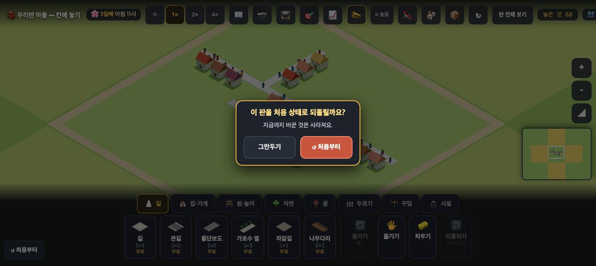
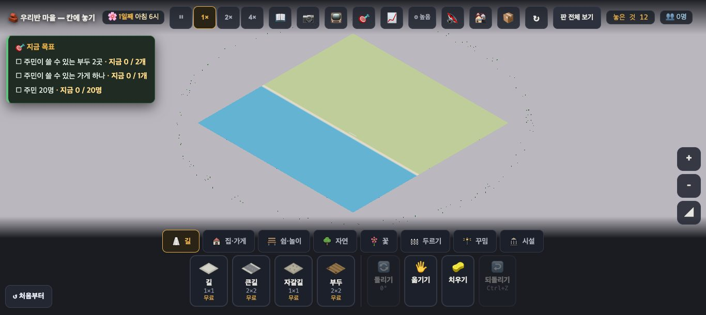
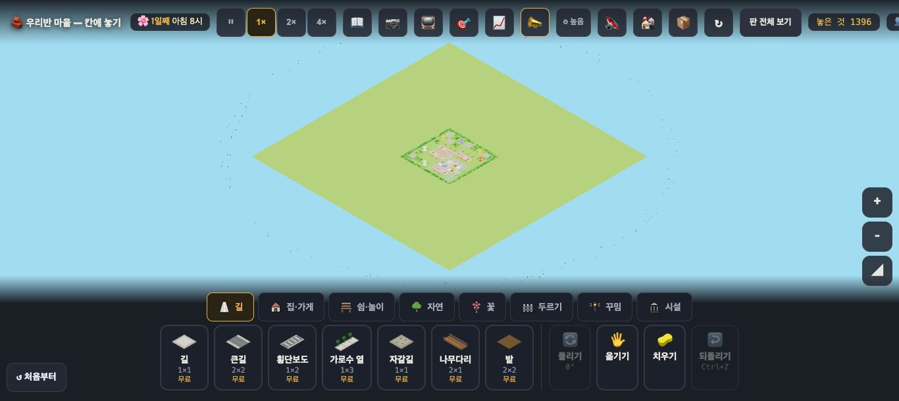

# 창조자의 눈 — 관찰 기록 44회: 목록 정리 — 이미 머지된 줄 되밟기 · 38~44회 목록 모음

> 보스 요청: 주민 연기 담당이 모은 **'열림'으로 남았지만 이미 머지된 줄**을 되밟아 ✔/일부로 고치기 — 25-ⓒ54 → #920 · 28-ⓒ60 → #925 · 30 교실 TV → #956·#957·#960 · 33-ⓑ75·ⓑ76 → #928 · 37-ⓑ87 → #976+#978 · 36-ⓑ84·ⓑ85 → #976 · 37-ⓑ88 → #972. 남은 열림(34-ⓑ79 · 36-ⓑ86 · 27-ⓑ58)은 그대로.
> 본 판: main `46e23c1` · 제 서버 8781 · `?sid=guest` · **코드 수정 0 · 화면 창 0** · GPU(Metal) · 1366.
> 브라우저 기본 창(confirm)이 뜨면 **세고 '아니요'로 닫게** 해 두었습니다(뜬 수 0).
> **목록 모음**: 38~43회 PR(#962 · #970 · #975 · #980 · #983 · #986)은 문서만 두었습니다(38회의 목록 커밋도 되돌렸음). 그 회들의 목록 줄과 이번 줄을 **이 PR 하나**에 모았습니다(같은 줄을 여러 PR 이 고쳐 부딪히지 않게).

## 되밟기 표

| 줄 | 고친 PR | 이번에 본 것(사실) | 판정 |
|---|---|---|---|
| **25-ⓒ54** 배속 토스트 · 말 없는 되돌리기 | #920 | origin·town3: ⏸ 1× 2× 4× 를 누르면 배속은 바뀌고(2 · 4 · 멈춤 · 1) **토스트는 0**입니다. 길 한 칸을 놓고 Ctrl+Z 하면 "**길을 도로 치웠어요**"가 뜹니다. | ✔ 닫힘 |
| **28-ⓒ60** ↺ 처음부터가 브라우저 기본 창 | #925 | town3 ↺ 처음부터 → **게임 안 카드** "이 판을 처음 상태로 되돌릴까요? · 지금까지 바꾼 것은 사라져요 · [그만두기] [↺ 처음부터]" · 브라우저 창 **0** · 그만두기 → 카드 닫힘 | ✔ 닫힘 |
| **30-표** 교실 TV | #956 · #957 · #960 | 38회에 글씨 32~36px · 숨김 · 사람 ×1.6 확인. 이번엔 #960: 보여 주기를 켜면 배율 **16 → 20**, 끄면 **16** | ✔ 닫힘 |
| **33-ⓑ75** 한 칸 한 명 박자 | #928 | town3 10시 · 0.5초 × 20: `__folkSpace().그린자리.한칸박자` **평균 0.05**(0~0.21) — #928 이 적은 전 값 0.40 · 겹친쌍 0 · 가장 가까운 거리 0.77 | ✔ 닫힘 |
| **33-ⓑ76** 그린 자리 훅 없음 | #928 | `__folkSpace().그린자리` 가 있음(위 값을 이것으로 잼) | ✔ 닫힘 |
| **25-ⓑ53** 줄 세운 인형(일부) | #881 · #928 | 33회 가운데 한 줄 풀림 + 이번 한 칸 박자 0.05 | ✔ 닫힘 |
| **36-ⓑ84 · ⓑ85** | #976 | 42회에 진짜 누르기로 확인 | ✔ 닫힘 |
| **37-ⓑ87** 해금 조사 | #976 · #978 | 42회 "2단 공 나무가 열렸어요" · #978 의 "나무 N그루가 밤새 자랐어요"도 `josa` (코드) | ✔ 닫힘 |
| **37-ⓑ88** 판 전체 보기 아래 잘림 | #972 | origin·sea 판 전체 보기에 **판 마름모 전체**가 보임(아래 꼭짓점 y 약 410) · `__wholeCam()` 거리 1309 | ✔ 닫힘 |

**덤(사실)** — 주소에 판 이름이 **없는** 기본 판(`?sid=guest` 만)은 연 뒤 `__sim().멈춤 = true` 였고, 배속 단추를 눌러도 배속 1 · 멈춤 그대로였습니다. 판 이름이 있는 origin·town3 에선 잘 됩니다. 뜻한 것인지(판 고르기 전 상태 등) 모르니 줄로 세지 않았습니다.

## 목록에 모은 것(38~44회)

| 회 | 고친 줄 |
|---|---|
| 38 | 35-ⓑ83 · 30-ⓑ66 · 30-표 ✔ · 새 38-ⓑ89(보류) |
| 39 | 31-ⓑ73 · 27-2절(알림) · D1·D7 ✔ · 31-ⓑ71 · 31-ⓑ72 **일부** · 27-ⓑ58 은 **열림 유지**(보스) — 화면에선 안 보임을 적어 둠 |
| 40 | 새 40-ⓑ90 · ⓑ91 · ⓒ80 |
| 41 | 새 41-ⓑ92 · ⓒ81 · ⓒ82 |
| 42 | 36-ⓑ84 · ⓑ85 · 37-ⓑ87 ✔ · 36-ⓑ86 은 열림(메모 더함) |
| 43 | 27-ⓑ55 · 27-ⓑ56 ✔ · 새 43-ⓑ93 |
| 44 | 25-ⓒ54 · 28-ⓒ60 · 33-ⓑ75 · 33-ⓑ76 · 25-ⓑ53 · 37-ⓑ88 ✔ |

합계 111 → **119** · 닫힘 **51**(✔ 32) · 맡음 17 · 열림 **7** · 보류 4 · 확인 40.
(세는 스크립트로 셌습니다. 23-ⓑ40 은 지금까지처럼 '닫힘'으로 셉니다.)

## 미검증 · 한계
- 33-ⓑ75 는 **town3 한 판 · 20표본**입니다(#928 은 두 번씩 40표본).
- 36-ⓑ84·85 · 37-ⓑ87 은 42회 관찰을 그대로 옮겼습니다(이번에 다시 누르지 않음).
- 통과는 조작·표시 길만 뜻합니다.
