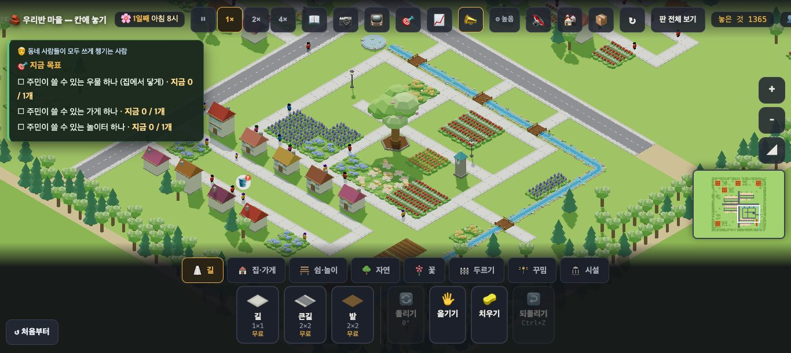
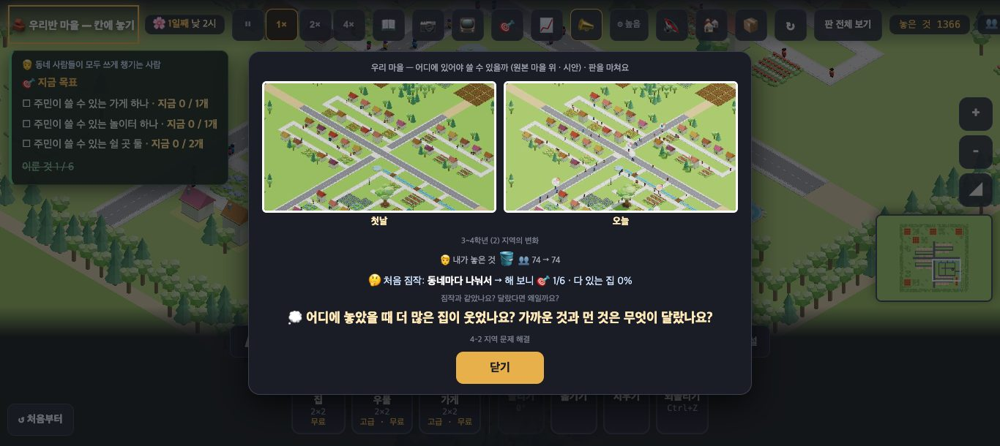
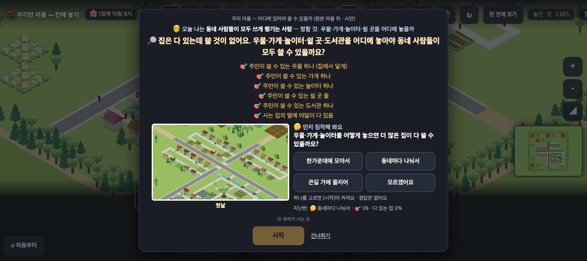
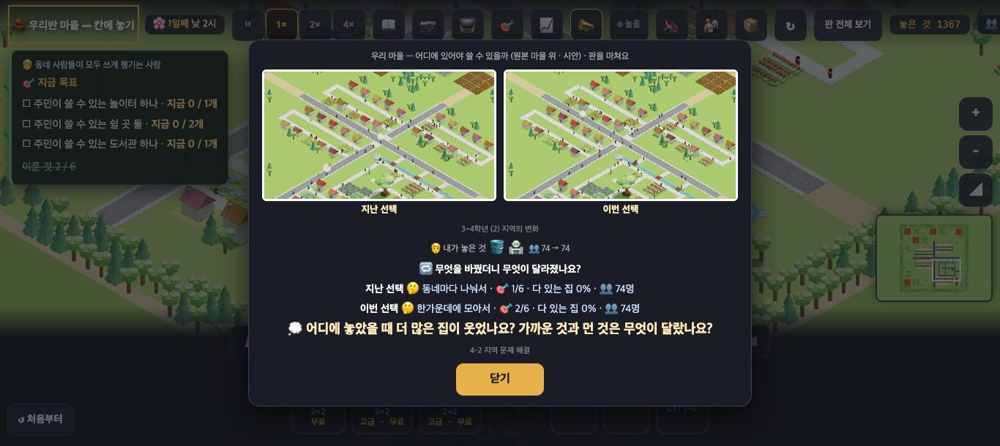

# 창조자의 눈 — 관찰 기록 45회: 수업 흐름 끝까지 — 역할 · 짐작 · 목표판 · 끝 카드 · 두 번째 시도 (town3-origin)

> 무한 진행. 고른 것: 막 머지된 수업 흐름 넷 — **#995** 목표판 펴 두기·판 목표만 셈(40-ⓑ90·91) · **#987** 역할 · **#993** 예상 남기기(L2) · **#994** 두 선택 나란히(L8).
> 본 판: main `a3fcc85` · 제 서버 8781 · `?sid=guest&stage=town3-origin` 새 프로필 · **코드 수정 0 · 화면 창 0** · GPU(Metal) · 1366×610.
> 아이처럼 처음부터 끝까지 눌렀습니다: 카드에서 짐작 고르기 → 시작 → 우물 → 2배속 15초 → 끝 카드(`__stageEnd()` · 교사가 끝내는 것과 같음) → ↺ 처음부터(예) → 다시 짐작 → 우물·가게 → 끝 카드. 브라우저 확인 창은 0번이었습니다.

## 한 줄
**수업의 앞과 뒤가 생겼습니다 ✔.**
- 카드에서 "오늘 나는 …"과 짐작을 고르고 시작합니다.
- 목표판이 펴져 있고, "이룬 것 1 / 6"처럼 판 목표만 셉니다(40-ⓑ90 · 91 닫힘).
- 끝 카드에서 짐작과 결과를 나란히 보고, 다시 해 보면 '지난 선택 ↔ 이번 선택'을 견줍니다.

그런데 **끝 카드의 두 사진이 거의 똑같아**, 무엇을 바꿨는지 사진으로는 안 보입니다. 끝 카드의 **단원 이름 두 줄**은 판의 단원과 다릅니다.

---

## 1. 시작 카드 — 역할 · 짐작

![시작 카드 — 역할 · 목표 여섯 · 첫날 사진 옆 짐작 넷 · [시작] 흐림](img/round45/1_card.jpg)

**사실**
- 카드 높이 563px(화면 610 · 위 24)입니다.
- 줄 순서: 판 이름 → "🧑 오늘 나는 **동네 사람들이 모두 쓰게 챙기는 사람** — 정할 것: 우물·가게·놀이터·쉴 곳을 어디에 놓을까" → 🔎 질문 → 🎯 여섯 → 첫날 사진 + "🤔 먼저 짐작해 봐요" 물음과 단추 넷.
- 단추 넷: 한가운데에 모아서 · 동네마다 나눠서 · 큰길 가에 줄지어 · 모르겠어요 — 모두 높이 44px.
- [시작]은 고르기 전 **흐림**(opacity 0.45 · disabled)이고, 알림은 "하나를 고르면 [시작]이 켜져요 · 정답은 없어요" 입니다.
- '동네마다 나눠서'를 누르면 알림이 "고른 것: 동네마다 나눠서 — 바꿔도 돼요"로 바뀌고 [시작]이 켜집니다.

**해석** 🟢 아이가 **맡은 일과 짐작**을 들고 판에 들어갑니다. "정답은 없어요"가 고르기 부담을 덜어 줍니다. 카드에 글이 많지만(질문 + 목표 여섯 + 짐작) 1366 한 화면에 들어갑니다.

## 2. 시작 뒤 — 목표판 (40-ⓑ90 · 91)

| 때 | 목표판 | 글 |
|---|---|---|
| 카드 닫은 직후 | **펴짐** | 🧑 동네 사람들이 모두 쓰게 챙기는 사람 · 🎯 우물 · 가게 · 놀이터 (이룬 것 줄 **없음**) |
| 우물 하나 뒤 | 펴짐 | 가게 · 놀이터 · 쉴 곳 둘 · **이룬 것 1 / 6** |
| 7초 더 | **펴짐**(접히지 않음) | 같음 |

`__goalsKeep()` = `{펴둠: true, 까닭: '카드 닫힘', 판목표: 6, 판이룸: 1}`.

**해석** — 40-ⓑ90 · 40-ⓑ91 **닫힘** ✔. 역할 이름표가 목표판 맨 위에 남아 "내 일"이 수업 내내 보입니다.
- (사실) 1366 에서 목표판(약 340×185)이 **왼쪽 동네 집 몇 채를 가립니다.** 🎯 로 접을 수 있습니다.

## 3. 끝 카드 — 처음 짐작 → 해 보니

**사실**
- "🧑 내가 놓은 것 🪣 👥 74 → 74 · 🤔 처음 짐작: **동네마다 나눠서** → 해 보니 🎯 1/6 · 다 있는 집 0% · 짐작과 같았나요? 달랐다면 왜일까요? · 💭 어디에 놓았을 때 더 많은 집이 웃었나요? …"
- 맞다·틀리다는 없습니다.

## 4. 두 번째 시도 — 지난 선택 ↔ 이번 선택

**사실**
- ↺ 처음부터 → 게임 안 카드 [↺ 처음부터] → 판이 다시 열리고 시작 카드가 다시 뜹니다(높이 567px).
- 짐작 밑에 "**지난번: 🤔 동네마다 나눠서 · 🎯 1/6 · 다 있는 집 0%**" 가 붙습니다.
- 두 번째 끝 카드:
  - 사진 두 장 '**지난 선택 ↔ 이번 선택**'
  - "🔁 무엇을 바꿨더니 무엇이 달라졌나요? · 지난 선택 🤔 동네마다 나눠서 · 🎯 1/6 · 다 있는 집 0% · 👥 74명 · 이번 선택 🤔 한가운데에 모아서 · 🎯 2/6 · 다 있는 집 0% · 👥 74명"
- 두 시도 모두 **'다 있는 집 0%'** 였습니다(우물·가게만으로는 '다 있음'이 안 됨 · 2배속 15초).

**해석**
- 🟢 '지난번' 한 줄 덕에 아이가 **다른 짐작을 해 볼 까닭**이 생깁니다. 두 줄이 같은 꼴(🤔 · 🎯 · 결과 · 👥)이라 견주기 쉽습니다.
- 🟡 **두 사진이 거의 같습니다.** 판 전체를 같은 틀로 찍어, 우물 하나·가게 하나는 320×180 사진에서 **보이지 않습니다.** 첫날 ↔ 오늘도 같습니다. 아이가 "뭐가 달라졌지?"를 사진으로 찾을 수 없습니다(ⓑ94).
- 🟡 **끝 카드의 단원 이름**: 시작 카드는 "(1) 우리가 사는 곳"인데, 끝 카드는 "**3~4학년 (2) 지역의 변화**"(사진 밑)와 "**4-2 지역 문제 해결**"(되돌아보기 밑)입니다. 코드에 박힌 두 줄이라 판의 단원과 상관없이 나옵니다. 이제 사진이 '지난 선택 ↔ 이번 선택'이 되면, '지역의 변화'라는 이름은 사진 뜻과도 어긋납니다(ⓑ95).
- (가설) 결과 줄이 두 번 다 '다 있는 집 0%'이면 "무엇이 달라졌나요?"의 대답이 **"아무것도"**가 됩니다. 결과 값이 움직일 만큼 놀게 하거나(수업 시간), 더 먼저 움직이는 값을 보여 주는 것이 좋을 수 있습니다 — 실제 수업에서 확인(ⓒ83).

---

## 목록에 반영할 것 — 다음 '목록 모음' PR 에서

| 줄 | 후 |
|---|---|
| 40-ⓑ90 수업 판 목표판 처음 닫힘 | **닫힘(#995) ✔45회** — 카드 닫은 직후 펴짐 · 7초 뒤에도 펴짐 |
| 40-ⓑ91 '이룬 것 5개' | **닫힘(#995) ✔45회** — 처음 줄 없음 · 우물 뒤 '이룬 것 1 / 6' |
| 새 45-ⓑ94 | 끝 카드 두 사진(첫날↔오늘 · 지난↔이번)이 거의 같음 — 놓은 것이 320×180 사진에서 안 보임 |
| 새 45-ⓑ95 | 끝 카드 단원 이름 두 줄이 코드에 박힘('3~4학년 (2) 지역의 변화' · '4-2 지역 문제 해결') — 판 단원 '(1) 우리가 사는 곳'과 다름 |
| 새 45-ⓒ83 | 결과 줄이 두 시도 모두 '다 있는 집 0%'면 "무엇이 달라졌나요?"가 빈 대답이 되나 |

## 미검증 · 한계
- 두 번째 시도의 우물은 첫 번째와 **같은 칸**이었습니다(제 스크립트가 '집이 가장 많은 칸'을 골라서). 그래서 두 번째 짐작('한가운데에 모아서')을 실제로 따른 배치는 아닙니다.
- 2배속 15초(판 속 약 4시간)만 기다렸습니다. 더 놀면 '다 있는 집'이 움직일 수 있습니다.
- 끝 카드는 `__stageEnd()` 로 열었습니다(목표를 다 이뤄 저절로 뜨는 길은 안 봄).
- 통과는 조작·표시 길만 뜻합니다.
