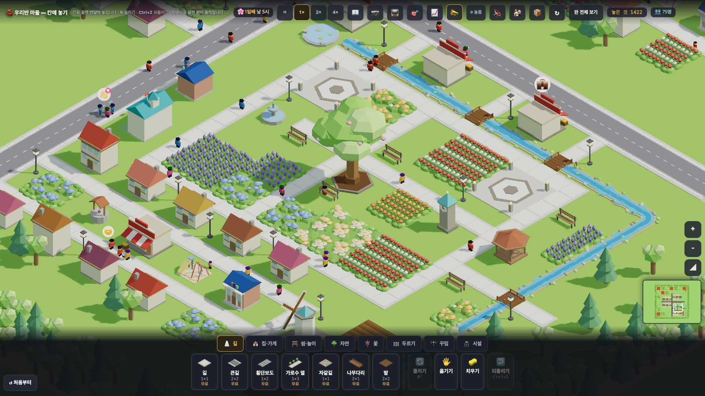
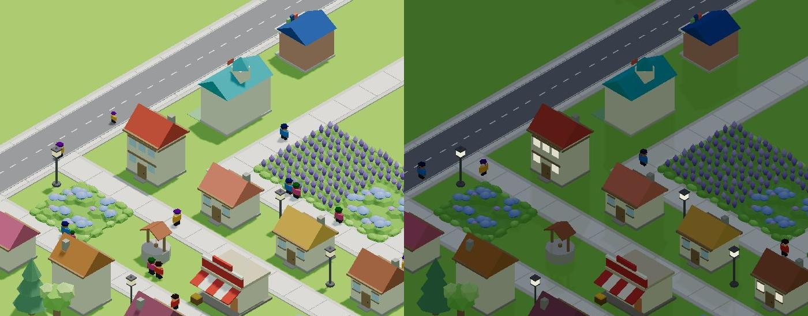
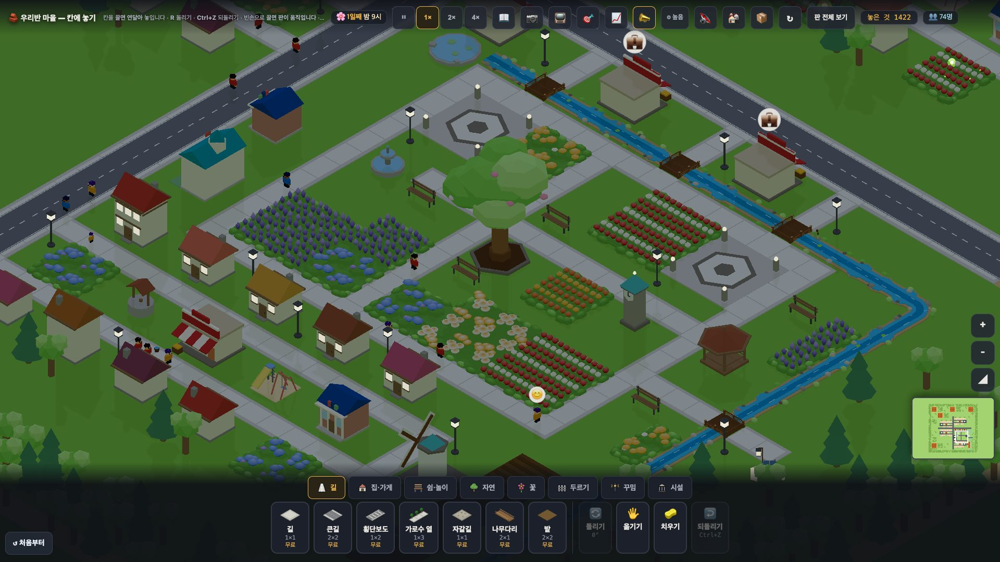

# 창조자의 눈 — 관찰 기록 46회: 원본의 오후와 밤 — 오후 산책(#992) · 저녁 가로등(#979)

> 무한 진행. 고른 것: 막 머지된 **#992 오후 산책**(가까운 쉼터로 걸어가 모여 쉰다)과 **#979 원본 4차**(저녁 가로등). 38회에 적은 **38-ⓑ89 '가장 예쁜 공원 한가운데가 빔'**이 채워지는지 봅니다.
> 본 판: main `a3fcc85` · 제 서버 8781 · `?sid=guest&stage=origin` 새 프로필 · **코드 수정 0 · 화면 창 0** · GPU(Metal) · 그림자 보임.
> 잰 법:
> - `__setHour(14)` 뒤 **1배속으로 60초**(판 속 14시 → 22시쯤)를 1초마다 셌습니다(1366 · 1920 각 한 번).
> - 센 것: 마을 나무 (139,138) **6칸 안**에 보이는 사람(그린 자리 `__folkPos`) · 그중 길 칸이 아닌 사람 · 곁 자리(앉음·섬)에 든 사람.
> - 밤은 `__setHour` 로 12 · 19 · 21 · 23 · 2시를 찍어 화면 평균 밝기를 쟀습니다.

## 한 줄
**공원에 드디어 사람이 앉습니다.** 오후 긴의자에 한 명씩 앉고, 많을 때 둘입니다. 하지만 원본은 집이 공원에서 멀어, 산책 대부분이 **'멀어서 안 감'**입니다(53~57번). 공원 한가운데는 여전히 거의 비어 있습니다(38-ⓑ89 **일부**).
**밤엔 가로등 머리와 창문이 켜집니다.** 땅에 빛 웅덩이는 없고, 밤빛은 푸른 밤보다 **어두운 초록**입니다.

---

## 1. 오후 공원

**사실(1초마다 64표본)**

| 창 | 시간 | 공원 6칸 안 평균 | 길 아닌 곳 평균(최대) | 곁 자리(앉음·섬) 평균 |
|---|---|---|---|---|
| 1366 | 14~18시 | 2.6명 | 0.6(1) | 0.7 |
| 1366 | 18~22시 | 1.8 | 0.6(1) | 0.6 |
| 1920 | 14~18시 | 3.2 | 0.9(**2**) | 1.8 |
| 1920 | 18~22시 | 2.5 | 0.3(1) | 0.7 |

- 곁 자리 상태는 대부분 `inside:sit`(긴의자에 앉음) 하나입니다. 1920 의 17.4시엔 둘이 앉았습니다.
- `__stroll()`(끝): 나섬 5 · 들어감 3~5 · **멀어서안감 53~57** · 모인쉼터 0 · 쉼터 8.
- 38회(#992 전)에는 모든 사진에서 공원 안에 앉은 사람이 **0**이었습니다.

**해석**
- 🟢 "큰 나무 옆 긴의자에 누가 앉아 있네"가 이제 보입니다. 공원이 '사는 곳'이 되기 시작했습니다.
- 🟡 그러나 한 번에 **한둘**이고, 나무 아래 팔각 받침·정자는 여전히 비어 있습니다. #992 가 적은 대로 원본은 집 34채 중 30채가 쉼터에서 13칸 넘게 떨어져 **'멀어서 안 감'**이 대부분입니다. 38-ⓑ89 는 **일부**입니다.
- (가설) 원본은 '보여 주는 판'이니, 공원 가까운 집 몇 채의 산책 거리를 늘리거나 정자·나무 아래를 쉼터 목적지로 두면 오후 장면이 '모이는 곳'으로 바뀔 것입니다.

## 2. 밤 — 가로등

**사실**
- 화면 평균 밝기(1920 · 윗줄·트레이 뺌): 12시 **171.5** · 19시 103.2 · 21시 89.4 · 23시 89.4 · 2시 89.2 — 밤은 한낮의 **약 52%**입니다.
- 밤 사진에서 가로등 머리가 하얗게 밝고, 집 **창문이 켜져** 있습니다.
- 가로등 둘레 **땅에 밝은 원(빛 웅덩이)은 보이지 않습니다.** 밤빛은 파랑이 아니라 **어두운 초록**입니다.

**해석**
- 🟢 창문 불빛은 "사람이 집에 있다"를 말해 줍니다. 저녁 가로등이 골목마다 서서 밤길이 읽힙니다(#979 '어두운 집 34 → 0').
- 🟡 (가설) 가로등 밑에 **따뜻한 빛 웅덩이**가 있고 밤빛이 조금 푸르면, 밤이 '우와' 장면이 될 것입니다. 지금은 **어두워진 낮**에 가깝습니다(ⓑ96).

---

## 목록에 반영할 것 — 다음 '목록 모음' PR 에서

| 줄 | 후 |
|---|---|
| 38-ⓑ89 공원 한가운데가 빔 | **일부(#992)** 46회 — 오후 긴의자에 1~2명 앉음 · 나무 아래·정자는 거의 빔 · '멀어서 안 감' 53~57 |
| 새 46-ⓑ96 | 밤에 가로등 머리·창만 밝고 땅에 빛 웅덩이가 없음 · 밤빛이 어두운 초록 — 밤 장면이 '어두워진 낮' |

## 미검증 · 한계
- 1배속 60초 한 번씩(두 창)입니다. 산책은 정해진 차례로 고르니 다른 날엔 달라질 수 있습니다.
- '공원 6칸 안'은 제가 정한 잣대입니다(둘레 길을 지나는 사람도 듭니다).
- 밤 밝기는 화면 평균입니다(빛 웅덩이는 사진 눈으로만 봄).
- 통과는 조작·표시 길만 뜻합니다.
