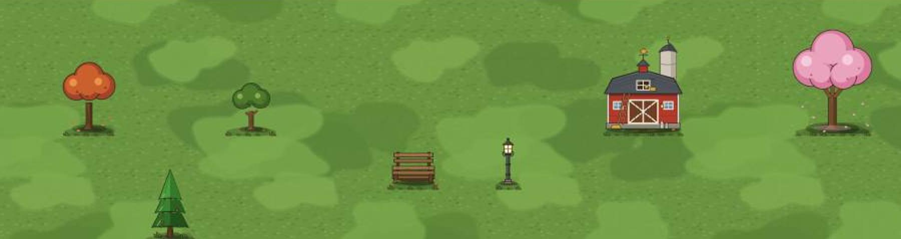
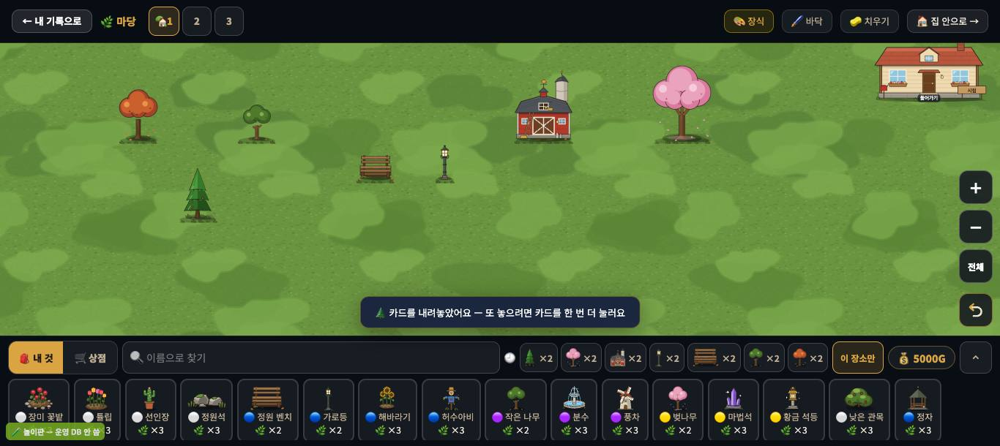

# 창조자의 눈 — 관찰 기록 47회: 꾸미기 마당 땅(#982) — 모눈은 고를 때만

> 무한 진행. 고른 것: 막 머지된 **#982 마당 땅**(풀빛 얼룩 두 겹 · 밑동 그림자와 풀 덮임 · 모눈은 고를 때만 · 31-ⓑ71).
> 본 판: main(`b0d1a3f` 뒤 · 제 worktree = main + 문서) · 저장소 꾸미기 놀이판 `play.mjs` 8784(운영 DB 안 씀) · 1366×610.
> **코드 수정 0 · 화면 창 0** · 제 headless 크롬(GPU Metal) · firebase 요청 막음 · 끝나면 크롬과 놀이판을 껐습니다.
> ⚠ **바로잡음 잇기**: 39회 사진·43회에 잰 '칸 경계 밝기 +4'는 **#982 전 판**이었습니다(43회 판 `894f55c` 에는 #982 가 없음 · `git merge-base` 로 확인). 이번이 #982 뒤 첫 되밟기입니다.

## 한 줄
**31-ⓑ71 '모눈종이 땅' 닫힘 ✔.** 빈 마당에선 모눈선이 **사라졌고**(칸 경계 − 칸 안 밝기 −0.8), 카드를 든 동안만 옅게 보입니다(+3.0). 땅은 한 가지 초록에서 **볕·그늘 얼룩이 있는 풀밭**이 됐습니다(밝기 폭 7 → 27). 물건 발밑엔 그림자 타원과 풀 덮임이 생겼습니다.

---

## 1. 모눈 — 빈 마당 ↔ 카드를 든 때

**사실** — 같은 자리(x 700 · 900, y 160~240)에서 **칸 경계 줄 밝기 − 칸 안 밝기**를 쟀습니다:

| 판 · 때 | x 700 | x 900 |
|---|---|---|
| 39회 사진(#982 전) · 빈 마당 | +3.3 | +4.1 |
| **47회 · 빈 마당** | **−0.9** | **−0.7** |
| 47회 · 카드(장미 꽃밭)를 든 때 | +3.4 | +2.6 |

**해석** — 모눈은 **고를 때만** 나옵니다 ✔. 아이가 구경할 땐 풀밭이고, 놓으려 할 때만 칸이 보입니다.

## 2. 땅과 밑동

**사실**
- 빈 마당 가운데(300~1100 × 120~440)의 밝기(흑백) 분포:
  - 39회(#982 전): 10% 123 · 가운데 126 · 90% 130 → **폭 7**
  - 47회: 10% 114 · 가운데 126 · 90% 141 → **폭 27**
- 큰 나무 B · 작은 나무 · 벤치 · 가로등 · 헛간 · 벚나무 · 침엽수 모두 발밑에 **짙은 타원 + 풀 몇 가닥**이 있습니다.
- 얼룩은 모서리가 부드러운 큰 덩어리(몇 칸 크기)이고, 밝은 것과 짙은 것 두 가지가 겹칩니다.

**해석**
- 🟢 31회의 '스티커를 모눈종이에 붙인 모습'이 풀렸습니다. 물건이 **땅에 서** 보입니다(밑동 그림자·풀).
- 🟡 (가설) 얼룩이 크고 대비가 또렷해, 아이 눈엔 '볕과 그늘'로도 **'군복 무늬'**로도 읽힐 수 있습니다. 물건을 많이 놓으면 덜 보일 것입니다 — 실제 아이에게(ⓒ84).

---

## 목록에 반영할 것 — 다음 '목록 모음' PR 에서

| 줄 | 후 |
|---|---|
| 31-ⓑ71 땅이 모눈종이 | **닫힘(#982) ✔47회** — 빈 마당 모눈 없음(−0.8) · 카드 든 때만(+3.0) · 얼룩 풀밭(밝기 폭 7→27) |
| 새 47-ⓒ84 | 큰 볕·그늘 얼룩을 아이가 '풀밭'으로 읽나 '군복 무늬'로 읽나 |

## 미검증 · 한계
- 1366 한 크기 · 물건 일곱의 마당입니다.
- 밝기는 JPEG 사진 픽셀입니다(압축 잡음 ±1 안팎).
- #982 가 적은 무게(끌기 한 틀 5ms 언저리)는 재지 않았습니다.
- 통과는 조작·표시 길만 뜻합니다.
