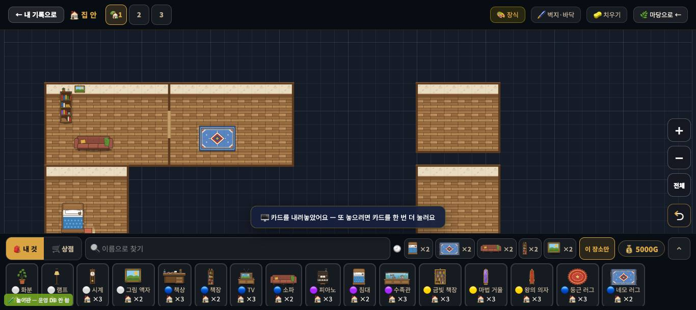
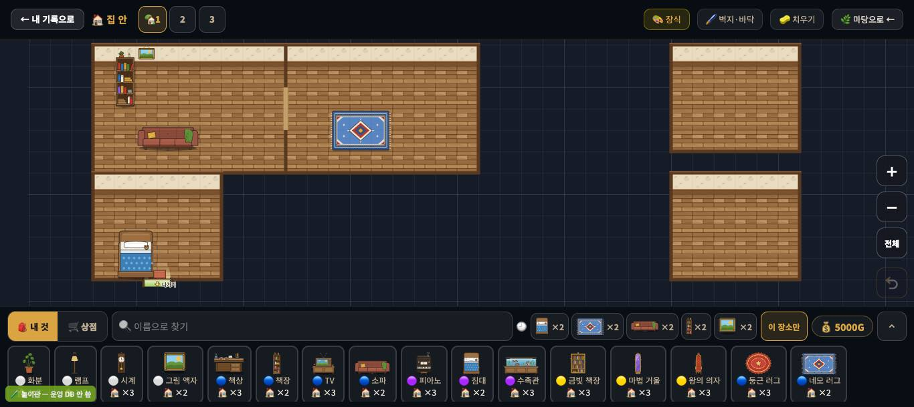
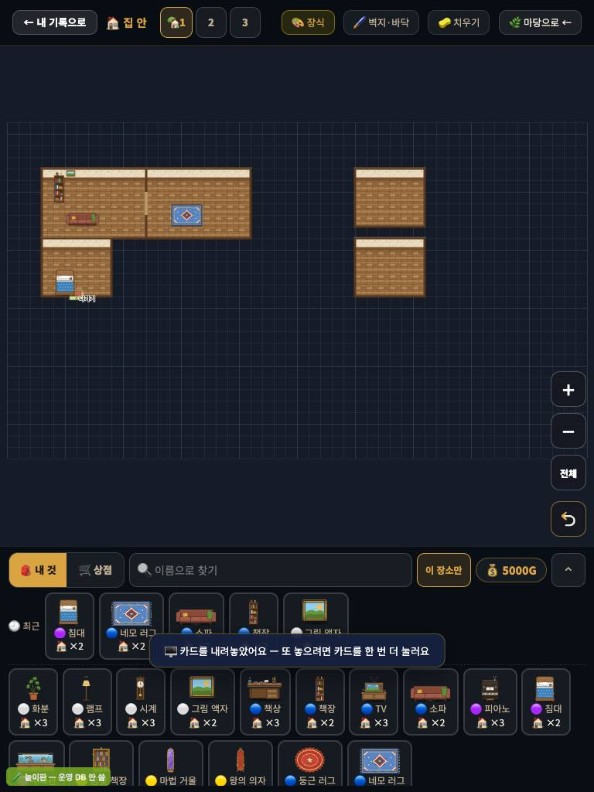

# 창조자의 눈 — 관찰 기록 48회: 집 안 되밟기 (29회 줄 · #913 화면 맞춤 · 나가기 문 그림 · #953 벽걸이)

> 무한 진행. 고른 것: 판 돌아가며 — 29회 뒤 한 번도 안 본 **집 안**. 그사이 머지된 것은 #913(화면 맞춤 — 판 끝에 붙은 집 안 방도 가운데) · 나가기 문 그림(`in_exit_door.svg` · 62cd195) · #953(새 벽걸이 여섯 그림 상자) · #921(괘종시계·거울)입니다.
> 본 판: main `4c5d16f`(제 worktree = main + 문서) · 저장소 꾸미기 놀이판 `play.mjs` 8784(운영 DB 안 씀) · **코드 수정 0 · 화면 창 0** · GPU(Metal).
> 29회 스크립트를 그대로 다시 돌렸습니다(보통 방 둘 · 가구 여섯). 셋째 방이 안 생기는 까닭을 가리려고 두 번 더 돌렸습니다(마지막 판은 방 다섯).
> ⚠ 같은 이름의 사진을 세 번 찍어, **기록에 넣은 사진은 마지막 판(방 다섯)**입니다. 수는 판마다 적었습니다.

## 한 줄
**다시 들어오면 카메라가 방으로 갑니다 ✔(빈 도면 79% → 39% · 한 칸 27 → 54px).** 나가기 문도 이제 방 아랫벽에 뚫린 현관 그림입니다.
그러나 **방을 막 만든 직후엔 여전히 빈 도면이 79%**입니다. 벽 두께(29-ⓑ62), 위아래로 붙은 방 사이 문(29-ⓑ63), 벽걸이 표(29-ⓑ65)는 그대로입니다.
29회에 '확인 못 함'으로 남긴 **셋째 방 안 생김은 제 누름 탓**이었습니다. 그 점이 벽지·바닥 고르개의 옆 칸(`.fpk-side`)에 닿았습니다. 판이 보이는 곳에선 셋째·넷째·다섯째 방이 모두 생깁니다.

---

## 1. 방을 만든 직후 · 다시 들어온 뒤 (29-ⓑ64)

**사실(아주 어두운 픽셀 = 빈 도면 비율 · `_dC` = 한 칸 px)**

| 판 | 방을 만든 직후 1366 | 768×1024 | **다시 들어온 뒤 1366** |
|---|---|---|---|
| 29회(방 둘) | 79% | 87% | (안 봄) |
| 48회 · 방 둘 | 79% · 한 칸 27 | 87% | **39% · 한 칸 54** · pan (−8, 199) |
| 48회 · 방 다섯 | 68% · 한 칸 27 | 83% | **58% · 한 칸 32** · pan (−43, 116) |

**해석**
- 🟢 29-ⓑ64 **일부** — 다시 들어오면 #913 의 맞춤이 방 둘레로 카메라를 옮기고 키웁니다. 두 방이면 화면이 방으로 찹니다.
- 🟡 **방을 막 만든 순간**(아이가 가장 신나는 때)엔 카메라가 그대로여서, 1366 에서 화면의 약 4/5 가 빈 도면입니다. 768 은 더합니다.

## 2. 벽 · 문 (29-ⓑ62 · ⓑ63)

**사실**
- 벽은 29회와 같습니다. 뒤쪽 **벽지 띠** 하나와 옆·아래 **가는 갈색 선**뿐이고, 두께(윗면·앞면)가 없습니다.
- 문 목록(`_inRoomDoors`)은 **옆으로 맞붙은 A|B 사이 하나**(열 12 · 5~7행)입니다.
- 방 다섯 판에서:
  - A 밑에 붙인 C, 오른쪽 E 밑에 붙인 D(**위아래로 맞붙음**) 사이에는 문이 없습니다.
  - 오른쪽 D·E 는 **문이 하나도 없는 방**입니다.
- 나가기 문은 **방 아랫벽에 뚫린 현관 그림**("↓ 나가기")입니다. 29회엔 바닥 위 상자였습니다. 방이 여럿이면 가장 아래 방(C) 밑으로 옮겨 갑니다.

**해석**
- 🟢 나가기 문은 이제 '벽에 뚫린 문'으로 읽힙니다(29-ⓒ64 의 걱정이 줄었습니다).
- 🟡 29-ⓑ63 그대로입니다. 아이가 방을 위아래로 붙이거나 따로 두면 **들어갈 문이 없는 방**이 생깁니다("이 방엔 어떻게 들어가요?").

## 3. 벽걸이 (29-ⓑ65)

**사실**
- 벽걸이 표 `DECO_WALL` = `{"d_i4": 1}` 입니다(그림 액자 하나).
- 액자를 바닥 한가운데 놓으면 "🖼️ 벽에 거는 거예요 — 위쪽 벽(맨 윗줄이나 방의 윗벽)을 눌러 걸어 주세요"가 나옵니다(좋은 말).
- #953 은 새 벽걸이 여섯의 **그림 상자만** 넣었고, 카드·표 등록은 아직입니다.

**해석** — 29-ⓑ65 그대로('표 등록 전').

## 4. 셋째 방 — 29회 미검증 풀림

| 누른 곳 | 누른 점의 맨 위 요소 | 방 수 | 알림 |
|---|---|---|---|
| 작은 방 (12,3) · y 420 | **`DIV.fpk-side`**(고르개 옆 칸) | 2 → 2 | 없음 |
| 작은 방 (10,3) · y 366 | 캔버스 | 2 → 3 | 🧱 6 × 4 방이 생겼어요 |
| 작은 방 (10,30) | 캔버스 | 3 → 4 | 같음 |
| 작은 방 (4,30) | 캔버스 | 4 → 5 | 같음 |

**해석** — 방 만들기는 정상입니다. 고르개가 1366 에서 판 **왼쪽 아래를 덮고** 있어, 그 자리를 누르면 판이 아니라 고르개가 눌립니다. 아이 눈에도 고르개가 보이니 '말 없는 실패'로 세지 않습니다.

---

## 목록에 반영할 것 — 다음 '목록 모음' PR 에서

| 줄 | 후 |
|---|---|
| 29-ⓑ64 빈 도면 · 카메라 | **일부(#913)** 48회 — 다시 들어오면 방에 맞춤(79→39% · 한 칸 27→54) · 막 만든 직후는 그대로 79% |
| 29-ⓑ62 벽 두께 | 그대로(맡음) — 48회 다시 봄 |
| 29-ⓑ63 문 | 그대로(맡음) — 48회: 위아래로 붙은 방·따로 둔 방엔 문 없음(방 다섯 중 셋) |
| 29-ⓑ65 벽걸이 | 그대로(맡음) — `DECO_WALL` 액자 하나 · #953 은 그림 상자만 |

# ⓐ 없음 · ⓑ 새 줄 없음(모두 29회 줄 안) · ⓒ 새 줄 없음

## 미검증 · 한계
- 방 크기 칩(작은·보통)과 칸 누르기로만 만들었습니다(네모로 끌어 만들기는 안 봄).
- 빈 도면 비율은 29회와 같은 잣대(아주 어두운 픽셀)입니다.
- 통과는 조작·표시 길만 뜻합니다.
