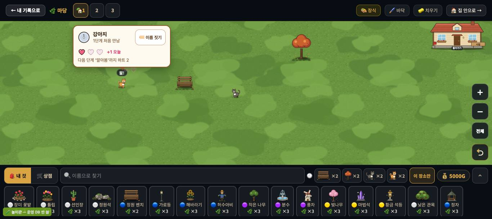
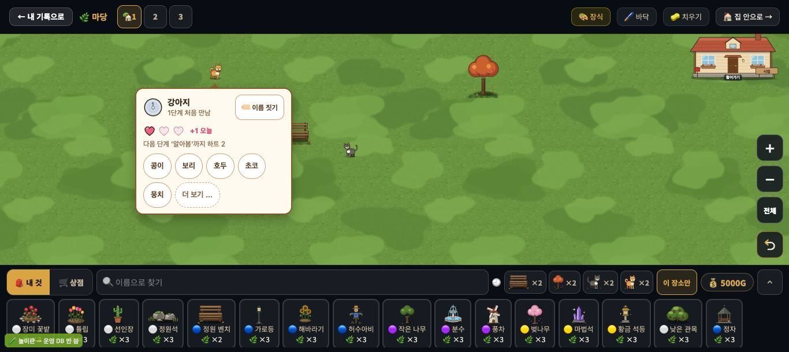
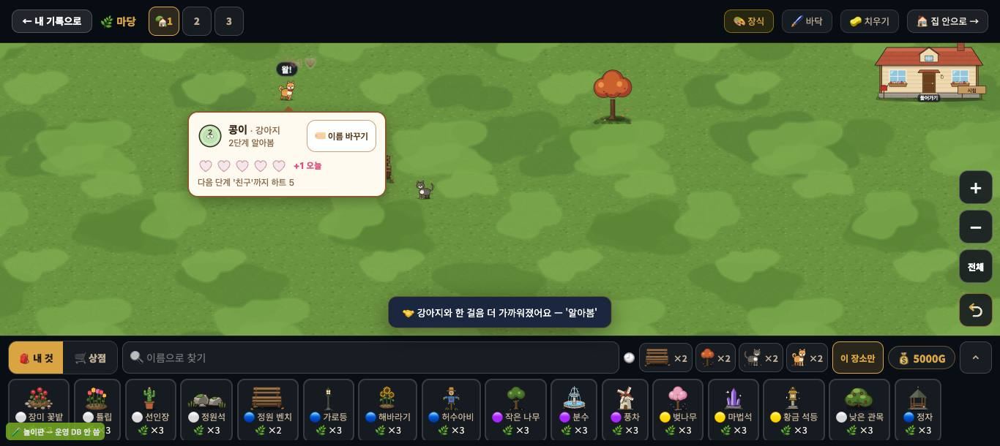

# 창조자의 눈 — 관찰 기록 49회: 친해지기(#1001 · #1003) — '내일 또 와서 쓰다듬고 싶은가'

> 보스 요청: 꾸미기의 새 놀이 첫 조각 — **#1001 친해지기**(쓰다듬기 → 하트 → 단계 알림) · **#1003 하트 칸·사진 틀 그림**(붙은 것만). 잣대는 **"내일 또 와서 쓰다듬고 싶은가"**.
> 본 판: main `c2214e4`(제 worktree = main + 문서) · 저장소 꾸미기 놀이판 `play.mjs` 8784.
> - 가짜 프로젝트 · 오프라인 · '시험' 학생 자동 입장 — **운영 DB · 학생 실데이터 0**.
> - 하트 쓰기(`students/<id>` 잎 쓰기)도 이 놀이판에선 어디에도 닿지 않습니다.
>
> **코드 수정 0 · 화면 창 0** · 제 headless 크롬(GPU Metal) · firebase 요청 막음 · 끝나면 크롬과 놀이판을 껐습니다.
>
> **날 바꾸기(밝혀 둠)**: 하루 한 번 하트라 다음 날을 보려면 날이 바뀌어야 합니다. **제 headless 페이지 안에서만** `Date.now` 를 하루씩 앞당겼습니다(앱 파일은 그대로). 친해지기의 날은 `_lifeDay(Date.now())` 로 셉니다.
> 한 일: 마당에 강아지·고양이·큰 나무·벤치를 놓고 → 강아지 쓰다듬기(1일째) → 같은 날 또 → 이름 짓기 → 2·3·4일째 쓰다듬기.

## 한 줄
**쓰다듬는 맛은 좋습니다 ✔.** 누르면 23~34ms 에 "+1 💗", "왈!", 그리고 **동물 카드**(단계 배지 · 이름 · 분홍 하트 칸 · '+1 오늘' · "다음 단계 '알아봄'까지 하트 2")가 뜹니다. 이름은 큼직한 칩에서 고르고, 3일째엔 "🤝 한 걸음 더 가까워졌어요 — '알아봄'"이 뜹니다.
그런데 '내일 또'를 부르는 말이 모자랍니다.
- 같은 날 다시 쓰다듬으면 **왜 하트가 안 느는지** 말이 없습니다.
- 단계가 오른 순간 하트 칸이 **다 비어** 방금 받은 하트가 사라진 것처럼 보입니다.
- 이름을 지어 줬는데 알림은 **"강아지와"**라고 부릅니다.

---

## 1. 날마다 한 일 · 본 것

| 날 · 한 것 | +1 💗(첫 반응) | 말풍선 | 카드 | 하트 칸 | 알림 |
|---|---|---|---|---|---|
| 1일째 첫 쓰다듬기 | **23ms** | 왈! | 강아지 · 1단계 처음 만남 · 🏷️ 이름 짓기 · **+1 오늘** · "다음 단계 '알아봄'까지 하트 2" | ●○○ | — |
| 1일째 또 | **없음** | 왈! | (같음) | ●○○ | — |
| 이름 짓기 | — | — | 칩: 콩이 · 보리 · 호두 · 초코 · 뭉치 · 더 보기 … | — | "🏷️ 이제 '콩이'예요" |
| 2일째 | 23ms | 왈! | **콩이 · 강아지** · 1단계 · +1 오늘 · 하트 1 남음 | ●●○ | — |
| 3일째 | 32ms | 왈! | 콩이 · **2단계 알아봄** · +1 오늘 · "다음 단계 '친구'까지 하트 5" | **○○○○○** | "🤝 **강아지와** 한 걸음 더 가까워졌어요 — '알아봄'" |
| 4일째 | 29ms | 왈! | 콩이 · 2단계 · 하트 4 남음 | ●○○○○ | — |

- 스티커(`decoLife.g.sticker`)는 3일째에 **1** 이 됐습니다. 화면에 스티커 말은 없었습니다.
- 누르는 동안 장식 수 · 고른 카드는 그대로였습니다(또 놓임 없음).

## 2. '내일 또 와서 쓰다듬고 싶은가' — 아이 눈

🟢 **오고 싶게 하는 것**
- 반응이 빠르고 셋이 한꺼번에 옵니다: "+1 💗" · 소리 · 카드. 카드의 **"다음 단계까지 하트 2"**는 목표가 눈에 보이는 좋은 문장입니다.
- **이름 짓기**가 가장 큰 끌림으로 보입니다. 칩이 크고, 고르면 카드 맨 위에 "콩이 · 강아지"로 남습니다. "내 강아지"가 생깁니다.
- 단계 배지 그림(`friend_stage*.svg`)과 분홍 하트 칸(`heart_full/empty.svg` · #1003 '하트 칸')이 카드 안에 붙어 있어 귀엽습니다.

🟡 **막는 것**
- **ⓑ97. 같은 날 또 쓰다듬으면 하트가 왜 안 느는지 말이 없습니다.** 반응은 "왈!"뿐이고, 카드의 '+1 오늘'이 그 뜻을 품고 있지만 아이는 '고장인가?'로 읽을 수 있습니다. 이 순간이 **"내일 또 와요 — 하트는 하루에 한 번"**을 말해 줄 가장 좋은 자리입니다(가설).
- **ⓑ98. 단계가 오른 날 하트 칸이 모두 빕니다.** 3일째 카드는 "2단계 알아봄"인데 하트 칸이 ○○○○○이고 옆에 '+1 오늘'이 붙어 있습니다. 방금 얻은 하트가 없어진 것처럼 보입니다. 단계 배지가 바뀐 것만으로는 이것을 풀지 못합니다.
- **ⓑ99. 단계 알림이 지어 준 이름을 안 부릅니다.** 이름이 '콩이'인데 "🤝 **강아지와** 한 걸음 더…"입니다. 카드는 '콩이'라 부르는데 알림만 종류 이름입니다.
- (사실) 스티커가 1 생겼지만 말이 없습니다. 스티커 첩이 다음 조각이면 괜찮습니다 — 그때 되밟겠습니다(ⓒ85).
- (가설) 단계 문턱이 3 · 8 · 15 · 25일이라 '가족'까지 약 25번 들어와야 합니다. 주 몇 번 쓰는 교실에선 한 학기 가까이 걸립니다. 길고 느린 약속은 좋지만, 중간에 **작은 선물**(다음 조각)이 자주 끼어야 버틸 것입니다(ⓒ86).

## 3. 덤(사실)
- 강아지가 맨 윗줄까지 걸어가면 몸이 **머리줄 밑으로 반쯤** 들어갑니다. 그 가려진 쪽을 누르면 머리줄 단추('공간 2')가 눌려 마당 공간이 바뀝니다(제 첫 시도). 보이는 부분(판 위)을 누르면 잘 됩니다. 아이도 보이는 곳을 누를 테니 줄로 세지 않았습니다.

---

## 목록에 반영할 것 — 다음 '목록 모음' PR 에서
- 새 **49-ⓑ97** · **ⓑ98** · **ⓑ99** · **49-ⓒ85**(스티커를 아이가 알아채나 — 스티커 첩 조각 뒤) · **49-ⓒ86**(3·8·15·25일 문턱이 교실 리듬에서 '가족'까지 가나).

## 미검증 · 한계
- **날은 제 페이지에서 `Date.now` 를 당겨 바꿨습니다.** 실제 자정 넘김·다시 로그인은 안 봤습니다.
- 강아지 한 마리(+ 고양이 한 번)만 봤습니다. 친구 마당 구경(쓰기 0)은 안 봤습니다.
- #1003 의 선물·사진 틀 그림은 아직 **붙기 전**이라, 붙은 하트 칸·단계 배지만 봤습니다.
- 통과는 조작·표시 길만 뜻합니다.
