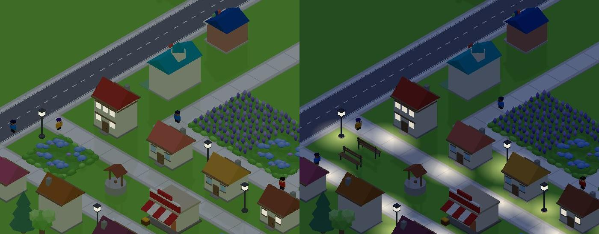
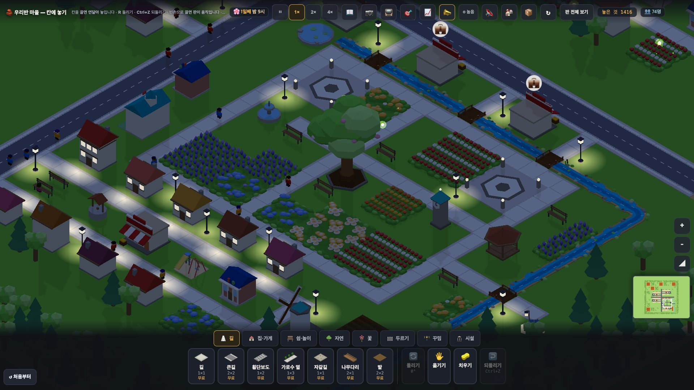
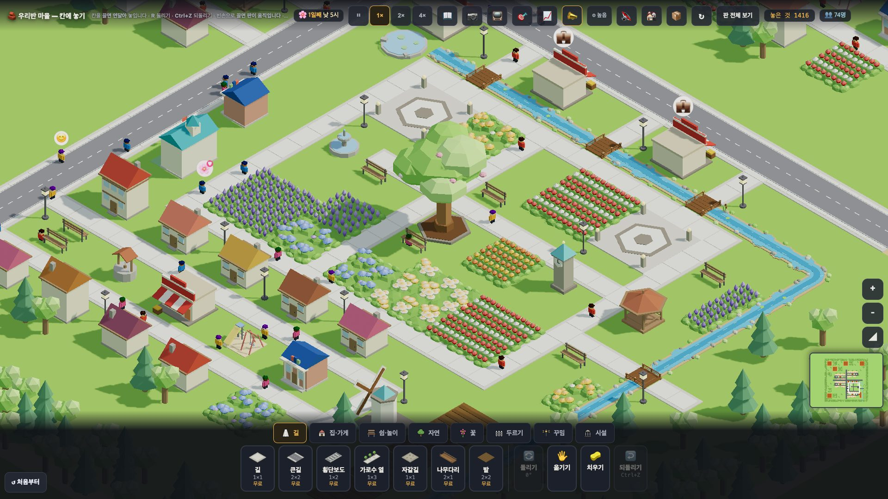

# 창조자의 눈 — 관찰 기록 50회: 원본 5차(#1019) · 밤빛(#1014) — 오후 쉼터와 밤

> 보스 후보 2번: **#1019 원본 5차**(집 거리 작은 쉼터 — 동네 입구 정자·긴의자·길가 큰나무 · 38-ⓑ89) + **#1014 밤빛**(푸른 밤 · 가로등·불 켜진 창 밑 빛 웅덩이 · 46-ⓑ96). 잣대는 두 가지입니다.
> - 오후 3~5시 동네 쉼터에 이웃이 앉아 있는 그림이 '우와'인가
> - 21시 밤이 '어두워진 낮'에서 벗어났나
>
> 본 판: main `df72c7e` · 제 서버 8781 · `?sid=guest&stage=origin` 새 프로필 · **코드 수정 0 · 화면 창 0** · GPU(Metal) · 그림자 보임.
> 잰 법은 **46회와 같습니다**(`__setHour(14)` 뒤 1배속 60초를 1초마다 · 1366·1920 · 밤은 12·19·21·23·2시 사진). 이번엔 **마을 전체에서 앉은 사람**(`__folkPos` 의 `inside` + 곁 자리 `sit`)도 셌습니다.

## 한 줄
**밤이 '우와'가 됐습니다 ✔(46-ⓑ96 닫힘).** 푸른 어둠 속에 가로등 밑과 집 문 앞마다 따뜻한 빛 웅덩이가 줄지어 있고, 창에 불이 켜졌고, 반딧불이가 떠 있습니다.
**오후 산책은 크게 살았습니다.** 나선 사람 5 → 37~45 · '멀어서 안 감' 53~57 → 1~5 · 쉼터 8 → 14. 그러나 앉은 이웃이 **동네마다 한둘씩 흩어져**, 한 화면에서 '모여 앉은 장면'으로는 아직 안 보입니다. 큰 나무 아래도 여전히 빕니다(38-ⓑ89 **일부** 그대로).

---

## 1. 밤 (46-ⓑ96)

**사실(1920 · 화면 평균 · 윗줄·트레이 뺌)**

| | 12시 밝기 | 21시 밝기 | 21시 색(R · G · B) |
|---|---|---|---|
| 46회(#1014 전) | 171.5 | 89.4 | 75 · 101 · 65 |
| **50회** | 159.7 | **62.7** | **52 · 75 · 61** |

- 밤은 한낮의 **약 39%**입니다(46회엔 52%). 파랑이 초록 쪽으로 다가왔습니다(G−B 36 → 14). 풀이 많은 판이라 초록이 아직 조금 셉니다.
- 가로등 칸과 사람 사는 집 문 앞에 **둥근 따뜻한 빛**이 깔렸습니다. 창에 불이 켜졌고, 공원 둘레에 **반딧불이** 빛이 보입니다.

**해석** 🟢 — 46-ⓑ96 **닫힘** ✔. 교실 TV 에 21시 장면을 띄우면 "밤에도 가로등이 골목을 비추네", "불 켜진 집에 사람이 있네"를 말할 수 있습니다. 46회의 '어두워진 낮'은 벗어났습니다.

## 2. 오후 쉼터 (38-ⓑ89)

**사실(1초마다 64표본)**

| 창 | 시간 | 공원 6칸 안 | 공원 곁 자리 | **마을 전체 앉음** 평균(최대) | 마을 전체 곁 자리 평균 |
|---|---|---|---|---|---|
| 1366 | 14~18시 | 3.7 | 1.9 | **3.4 (6)** | 21.7 |
| 1366 | 18~22시 | 3.6 | 1.8 | 0.6 (3) | 11.5 |
| 1920 | 14~18시 | 3.4 | 2.0 | **5.2 (9)** | 22.7 |
| 1920 | 18~22시 | 0.7 | 0.4 | 2.1 (5) | 14.8 |

`__stroll()`(끝):

| | 나섬 | 들어감 | 멀어서안감 | 쉼터 |
|---|---|---|---|---|
| 46회 | 5 | 3~5 | 53~57 | 8 |
| **50회** | **37~45** | **16~25** | **1~5** | **14** |

**해석**
- 🟢 원본 5차의 동네 쉼터가 '가까운 쉼터'가 되어, 산책이 **실제로 일어납니다**(나섬 약 8배). 오후 마을 어딘가에 늘 3~9명이 앉아 있습니다.
- 🟡 **'우와' 장면으로는 아직**입니다. 앉은 이웃이 쉼터 14곳에 한둘씩 흩어져 있고(`모인쉼터` 0), 1920 첫 화면(공원 가운데)에는 한 번에 한두 명만 보입니다. 사람이 작아(교실 TV 에서 점) 앉은 모습이 눈에 잘 안 띕니다. 큰 나무 아래 팔각 받침은 여전히 빕니다.
- (가설) 쉼터 한두 곳에 **셋 이상 모이는 때**(예: 17시 동네 입구 정자)가 있거나, 보여 주기 모드(사람 ×1.6)로 그 쉼터를 비추면 '이웃이 모여 쉰다'가 읽힐 것입니다.

---

## 목록에 반영할 것 — 다음 '목록 모음' PR 에서

| 줄 | 후 |
|---|---|
| 46-ⓑ96 밤 빛 웅덩이 · 밤빛 | **닫힘(#1014) ✔50회** — 21시 밝기 89→63 · G−B 36→14 · 빛 웅덩이·불 켜진 창·반딧불이 |
| 38-ⓑ89 공원·쉼터 | **일부** 그대로 — 50회: 산책 나섬 5→37~45 · 마을 전체 앉음 오후 3~9명 · 모인쉼터 0 · 나무 아래 빔 |

# ⓐ 없음 · ⓑ 새 줄 없음 · ⓒ 새 줄 없음

## 미검증 · 한계
- 1배속 60초 한 번씩입니다(산책은 정해진 차례라 날마다 다를 수 있음).
- '앉음'은 `__folkPos` 의 상태로 셌습니다(사진 눈으로는 한두 명만 확인).
- 밤 색은 화면 평균이라 빛 웅덩이 자체의 밝기는 따로 재지 않았습니다.
- 통과는 조작·표시 길만 뜻합니다.
