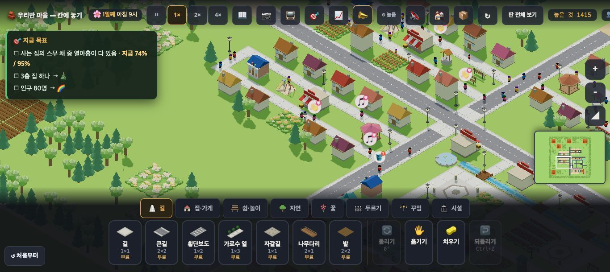
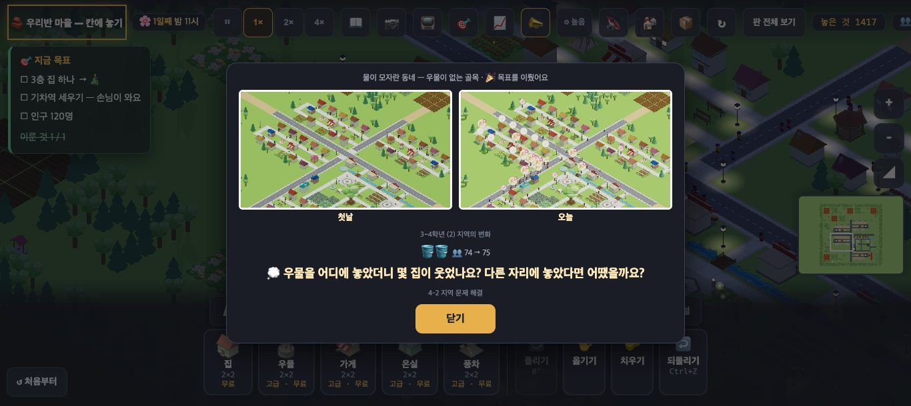
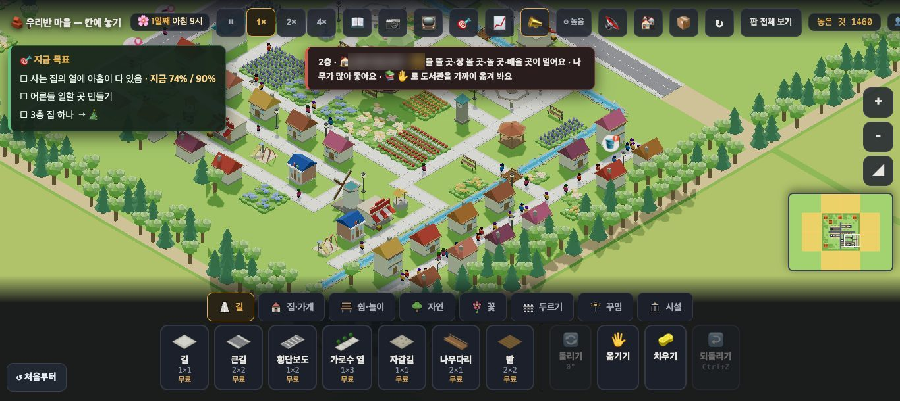
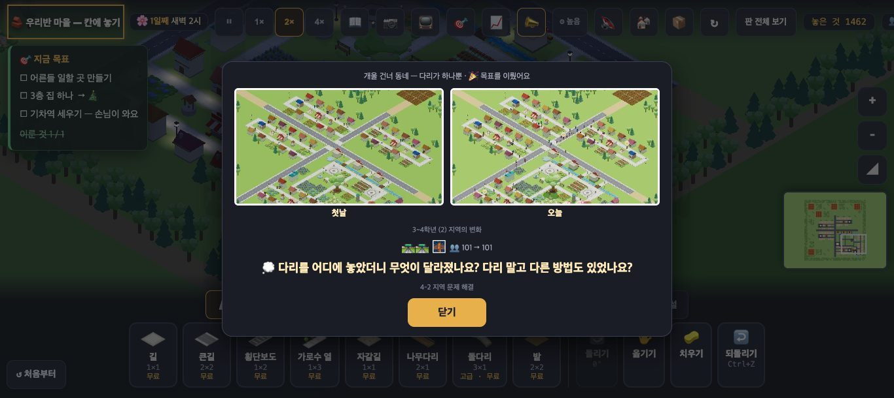

# 창조자의 눈 — 관찰 기록 51회: 수업 흐름 셋 — town3 → nowater → onebridge (아이처럼 처음부터 끝까지)

> 보스 후보 1번: **nowater**(#1020 · 물이 모자란 동네)를 아이처럼 처음부터 끝까지 보고, **town3 → nowater → onebridge** 를 이어서 따라가 한 차시(40분)에 무리가 없는지 봅니다.
> 잣대:
> - '물이 없어요'를 보고 우물을 떠올리는가
> - 동네 밖 먼 곳에 놓았을 때 '왜 안 되지?'가 화면에서 풀리는가
>
> 본 판: main `561151e` · 제 서버 8781 · `?sid=guest&stage=…` 판마다 새 프로필 · **코드 수정 0 · 화면 창 0** · GPU(Metal) · 1366.
> 한 일(진짜 누르기): 카드(짐작이 있으면 '동네마다 나눠서') → 시작 → 😐/😟 집 하나 누르기 → 판마다 한 수 → 2배속으로 끝 카드까지(최대 60초).
> 집 카드·토스트의 **주민 이름은 ○○로** 적고, 사진에선 흐리게 가렸습니다.

## 한 줄
**nowater 는 잘 흐릅니다 ✔.** 😐 집이 "물 뜰 곳이 멀어요"라고 말하고, 그 동네에 우물 하나를 놓으면 2배속 약 1분에 🎉 입니다.
**onebridge 는 아이가 막힐 곳이 하나 있습니다 🟡.** 개울 위에 **다리 한 칸만 놓으면 건너편 골목과 안 이어져** 아무 일도 없고, 그렇다는 말도 없습니다. 게다가 😟 집은 "📚 ✋로 **도서관을** 가까이 옮겨 봐요"라고 해서 다리가 아닌 쪽으로 이끕니다. 다리 옆 두 칸을 길로 이어야 풀렸습니다.
**town3** 는 물건 여섯을 놓고도 1분 뒤 목표 4/6 이었습니다. 한 차시에서 가장 오래 걸릴 판입니다.

---

## 1. nowater — 물이 모자란 동네



| 때 | 본 것(사실) |
|---|---|
| 카드 | 높이 395px · 🔎 "북서쪽 동네 사람들이 왜 웃지 못할까요? …" · 🎯 "사는 집의 스무 채 중 열아홉이 다 있음" · **역할·짐작 없음**(town3 · town3-origin 엔 있음) · [시작] 하나 |
| 첫 화면 | 1일째 9시 · 😊 25 · **😐 9** · 목표판 "지금 74% / 95%" **+ '3층 집 하나 → 🎄' · '인구 80명 → 🌈'** · 사진에 🪣 풍선 하나 |
| 😐 집 누르기 | "1층 · 🏠 ○○·○○ · **😐 물 뜰 곳이 멀어요** · 나무가 많아 좋아요" |
| 먼 곳에 우물 (108,155) · 가장 가까운 😐 집에서 19칸 | 놓임 · 토스트 "우물은 **길 옆에** 있어야 주민이 와서 물을 떠요 — 길에 붙여 보세요" · 2배속 22초 뒤 😐 9 · 74% 그대로 · 북서 집은 여전히 "물 뜰 곳이 멀어요" |
| 북서 동네에 우물 (120,133) · 😐 집 7채가 6칸 안 | 토스트 "✨ ○○의 바람을 들어줬어요 — 물 뜰 곳이 생겼어요" · 2배속 **62초**(판 속 약 8.7시간) 뒤 **😊 34 · 목표 이룸** |
| 끝 카드 | "🎉 목표를 이뤘어요" · 첫날 ↔ 오늘(오늘 사진엔 집마다 웃음 풍선) · "🪣🪣 👥 74 → 75" · 💭 되돌아보기 |



**해석**
- 🟢 **'물 뜰 곳이 멀어요' → 우물**은 곧게 이어집니다. 🪣 풍선과 집 말이 같은 것을 가리킵니다.
- 🟢 먼 곳에 놓았을 때 북서 집이 여전히 "**멀어요**"라고 말해, "여기는 멀어서 안 되는구나"가 화면에서 풀립니다. 다만 제가 고른 먼 자리는 **길에 안 붙은 자리**라 "길 옆에 있어야"가 먼저 나왔습니다. '길에는 붙었지만 먼 자리'는 따로 보지 못했습니다.
- 🟡 목표판의 **남는 두 줄을 기본 목표**('3층 집 하나 → 🎄' · '인구 80명 → 🌈')가 채웁니다. 한 목표 판이라 수업과 무관한 목표가 목표의 2/3 를 차지합니다(ⓑ101).

## 2. onebridge — 다리가 하나뿐



**사실**
- 카드엔 역할·짐작이 없고, 단원은 "4-2 · 지역 문제를 해결하고 지역을 알리는 노력"입니다.
- 첫 화면: 😊 34 · **😟 12**(개울 건너 x 152·155 의 집 모두). 목표판은 "74% / 90%" + '어른들 일할 곳 만들기' · '3층 집 하나 → 🎄'.
- 😟 집 누르기: "2층 · 🏠 ○○·○○·○○ · 😟 물 뜰 곳·장 볼 곳·놀 곳·배울 곳이 멀어요 · 나무가 많아 좋아요 · **📚 ✋ 로 도서관을 가까이 옮겨 봐요**".
- 둘레 칸 지도(x 146~158 · y 140~152 · R 길 · ~ 개울 · B 다리 · H 집 · . 빈 칸):
  ```
  140: .RRRRBRRR.fbt      ← 원래 다리(B) — 서쪽 길과 동쪽 길(x 152~154)이 이어짐
  145: .RRRR~H.RH.bt
  147: l...R~..R..b.      ← x150 길 · x151 개울 · x152·153 빈 칸 · x154 동쪽 골목
  148: w.s.R~H.RH.bt
  ```
- **개울 칸에 길 한 칸(다리)만** 놓아 봄(각각 새 프로필 · 2배속 62초):

| 다리 자리 | 다리 섬 | 뒤 😟 |
|---|---|---|
| (151,133) · (151,136) · (151,142) | ✔(`sbr`) | 12 · 12 · 12 |
| (151,145) · (151,148) | ✔ | 11 · 11 |
| (151,147)(#965 가 적은 자리) | ✔ | **12** |
| **(151,147) + 길 (152,147) · (153,147)** | ✔ | **2** · 😊 42 · **🎉 끝 카드** |

- 다리만 놓았을 때 화면엔 **아무 말도 없었습니다**(토스트 없음 · 😟 그대로).



**해석**
- 🟡 **ⓑ100. 다리 한 칸은 건너편 골목(x 154)과 안 이어집니다.** 개울과 동쪽 골목 사이 두 칸(x 152·153)이 풀밭이라, 길을 이어야 다리가 '쓰는 다리'가 됩니다. 아이는 "다리를 놓았는데 왜 그대로지?"에 부딪히고, 화면은 그 까닭을 말하지 않습니다(예: "🌉 다리 끝이 길과 안 닿아요"). #965 본문의 "개울 칸에 길 하나를 놓으면 다리 — 가까운 곳에 하나 더 놓으면 목표가 풀린다"와 **제 실행이 다릅니다**(확인 부탁).
- 🟡 (ⓑ100 에 함께) — 😟 집의 권유 말이 "**도서관을 옮겨 봐요**"라, 이 판이 가르치려는 '다리 자리'와 다른 쪽으로 이끕니다.
- 🟢 이어 준 뒤의 변화는 큽니다(😟 12 → 2 · 🎉). 되돌아보기("다리를 어디에 놓았더니 …")와 잘 맞습니다.

## 3. town3 — 빈 동네

**사실**
- 카드 563px(역할 + 짐작 넷 + 목표 여섯) · 시작은 3일째 낮 · 😟 14.
- 😟 집: "😟 물 뜰 곳·장 볼 곳·놀 곳·쉴 곳이 멀어요 · 거리가 좀 삭막해요".
- 우물 · 가게 · 놀이터 · 긴의자 둘 · 도서관을 **'😟 집이 가장 많이 닿는 칸'**에 차례로 놓았습니다(모두 놓임).
- 2배속 1분 뒤: 😊 7 · 😐 6 · 😟 1 · 목표 **4/6**(쉴 곳 1/2 · 다 있는 집 50%/80%) · 끝 카드 없음.

**해석** — town3 는 놓을 것이 여섯이고 목표도 여섯이라 **가장 오래** 걸립니다. 제 '욕심 많은 자리 고르기'로도 1분에 못 끝냈으니, 아이는 몇 번 옮겨 봐야 합니다.

## 4. 한 차시(40분)에 셋 — 어림

| 판 | 카드 읽기 | 한 수 → 끝 카드(제 실행 · 2배속) | 막힐 곳 |
|---|---|---|---|
| town3 | 길다(글 가장 많음 · 짐작) | 물건 여섯 · 1분 뒤 4/6 — **5~10분 이상**(가설) | 쉴 곳 둘 · 80% |
| nowater | 짧다 | 우물 하나 · **약 1분** | 거의 없음 |
| onebridge | 짧다 | 다리 + 길 두 칸 · 약 1분 — 다리만 놓으면 **안 풀림** | ⓑ100 · 도서관 권유 |

**해석(가설)** — '하는' 시간은 셋 합쳐 10~15분이라 40분 안에 들어갑니다. 남는 시간은 카드 읽기·짐작·되돌아보기에 씁니다. **위험은 onebridge** 입니다. 선생님이 "다리 끝이 길과 이어졌나요?"를 짚어 주지 않으면 한 반 여럿이 여기서 멈출 것입니다. 또 세 판 가운데 **town3 만 짐작·역할이 있어** 수업의 틀이 판마다 달라 보입니다(시안이라 괜찮을 수 있음).

---

## 목록에 반영할 것 — 다음 '목록 모음' PR 에서
- 새 **51-ⓑ100** onebridge — 다리 한 칸은 건너편 골목과 안 이어져 아무 일 없음 · 말 없음(#965 본문과 다름) · 😟 집 권유가 '도서관 옮기기'.
- 새 **51-ⓑ101** 한 목표 판(nowater · onebridge)의 목표판 남는 두 줄을 기본 목표('3층 집 하나 → 🎄' · '인구 80명' · '어른들 일할 곳')가 채움.
- 새 **51-ⓒ87** 수업 흐름 셋 중 town3 에만 역할·짐작 — 아이가 판마다 다른 틀을 헷갈려하나 · 한 차시에 셋이 들어가나(실제 수업).

## 미검증 · 한계
- 판마다 한 번씩(2배속 · 최대 60초)입니다.
- nowater 의 '먼 자리'는 길에 안 붙은 자리였습니다('길에 붙었지만 먼 자리'는 안 봄).
- onebridge 의 다리 자리는 제가 고른 여섯 곳입니다. (151,147)이 #965 에서 어떻게 풀렸는지(시뮬의 `__put` 등)는 확인하지 못했습니다.
- 40분 어림은 **가설**입니다(카드 읽기·토론 시간은 재지 않음).
- 통과는 조작·표시 길만 뜻합니다.
