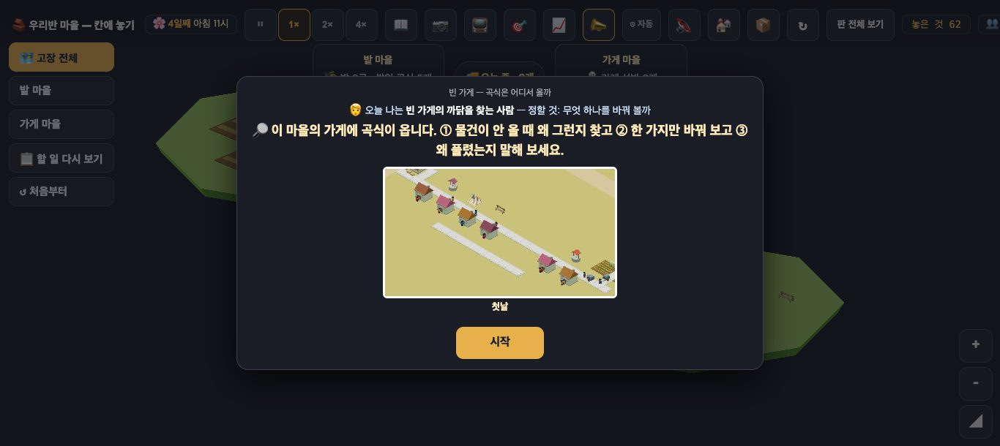
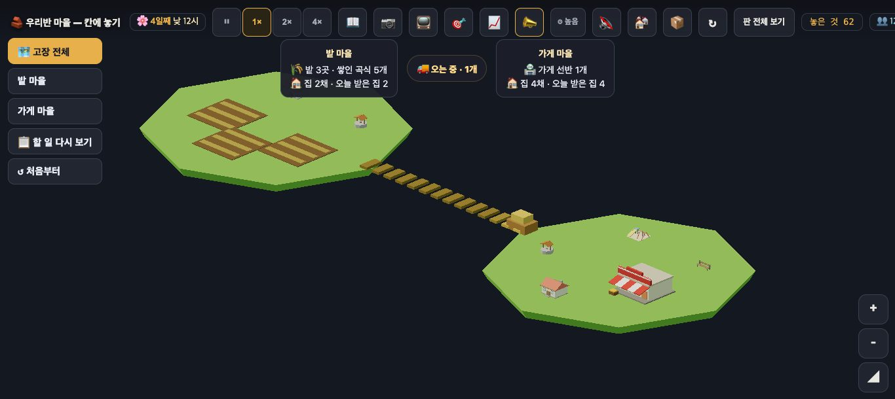
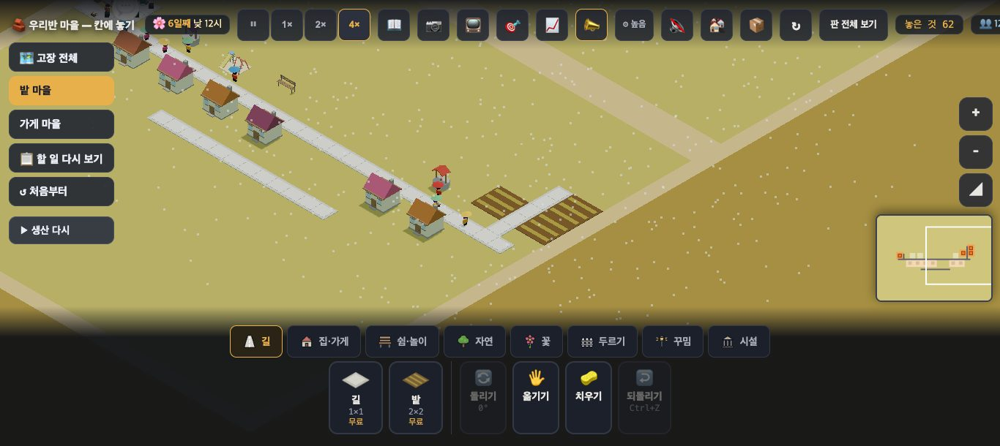
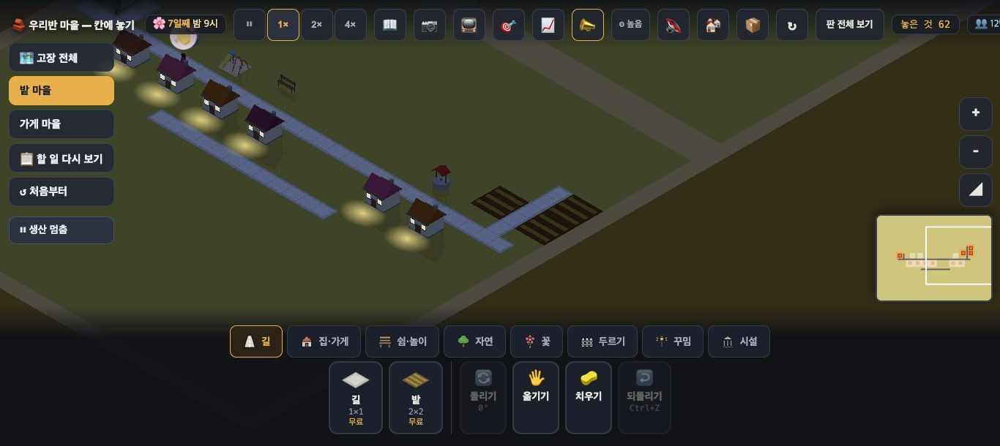
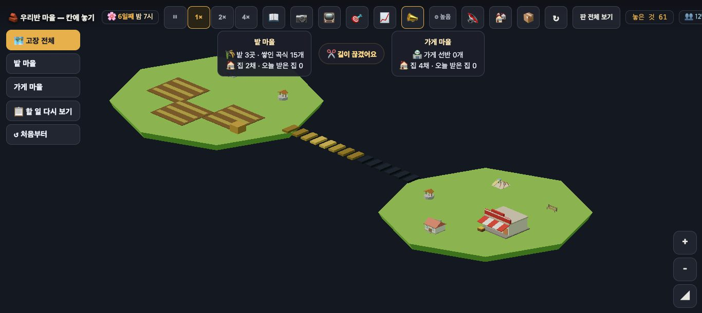
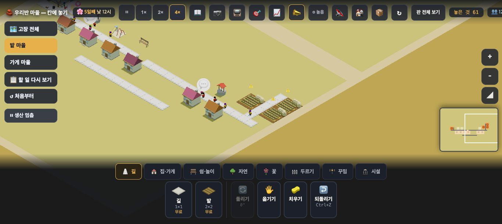
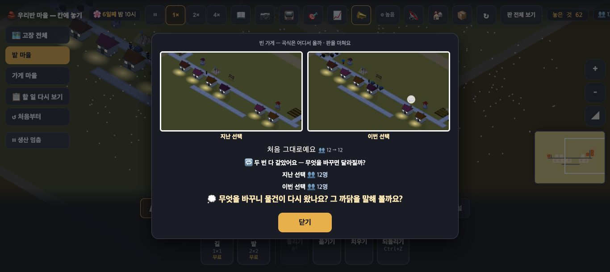

# 창조자의 눈 — 관찰 기록 53회: 빈 가게 판(proto-flow)을 아이처럼 끝까지 — 멈추고 · 끊고 · 다시 · 두 번 견주기

> 고른 까닭: 보스 "다음 회차는 자유롭게". 🚱 우물 폐기 때문에 우물 판(nowater · town3)과 proto-vote('우물을 어디에 놓을까')는 🏥 건강 엔진 뒤로 미뤘습니다. 대신 우물과 상관없는 **수업 흐름 3판 '빈 가게'**를 골랐습니다.
> 되밟은 것은 셋입니다: 수업 흐름 초안(#841 · `docs/village_lesson_flow.md`)의 L5·L7·L8, 그리고 막 머지된 **#1023 끝 카드 셋**(동그라미 · 단원 줄 · '두 번 다 같았어요').
> 본 판: main `b147626`(#1023 들어 있음 · merge-base 로 확인) · 제 서버 8781 · `?sid=guest&stage=proto-flow` 새 프로필 · **코드 수정 0 · 화면 창 0** · GPU(Metal) · 그림자 보임(낮 사진 · 집 왼쪽 아래) · firebase 요청 막음 · 1366×610.
> **시간**: 판 속 하루 = 1배속 3분(판 속 1시간 = 7.5초 · 75틱). 기다림은 4배속으로 돌리고, 수는 판 속 시간과 1배속 값으로 적었습니다.
> 한 일:
> ① 그대로 두고 지켜보기
> ② ⏸ 생산 멈춤 → 빈 선반까지 → ▶ 생산 다시
> ③ [치우기]로 두 마을 사이 길 한 칸(142,140) 끊기 → 빈 선반까지 → 다시 잇기
> ④ ②를 한 뒤 ↺ 처음부터 → ③ → 끝 카드(교사 #끝 과 같은 `__stageEnd()`)
> ②의 멈춤과 ③은 두 번씩 했습니다(값이 같았습니다). '▶ 생산 다시'는 세 번 봤습니다(이틀 멈춘 뒤 · 11시간 멈춘 뒤 · 멈추자마자).

## 한 줄
**⏸ 생산 멈춤 뒤 '▶ 생산 다시'를 눌러도 밭이 곡식을 다시 만들지 않습니다(ⓐ7).** 판 속 하루 반을 지켜봐도 밭 셋이 모두 비어 있고, 가게는 끝내 빈 채이며, 말도 없습니다.
**길 끊기 → 다시 잇기는 끝까지 됩니다 ✔.** 두 원인도 화면에서 다르게 보입니다 ✔: 멈춤은 빈 밭, 끊김은 곡식이 쌓인 밭 · ⚠ · 검어진 길 · 😟 집입니다.
그런데 **끝 카드는 아이가 한 실험을 담지 못합니다(ⓑ102).** "처음 그대로예요"가 뜨고, 원인이 달랐는데도 "🔁 두 번 다 같았어요"가 뜨고, 두 사진은 같은 밤 거리입니다.
L7(문제가 난 상태로 시작하지 않음)은 그대로입니다. 아이가 스스로 문제를 만들면 빈 선반까지 1배속으로 3~6분 기다립니다.

---

## 1. 그대로 두면 (L7)

**사실**
- 판은 4일째 11~12시에 열립니다. 판 속 15시간(2배속 1분)을 지켜봤습니다: 선반 1~8 · 12시에 6세대 모두 받음(받음 6 · 못받음 0) · 끊김 0 · 알림 0.
- 가게는 **12시에 한꺼번에 6개**를 씁니다(판 파일 `쓰는시각 12` · 선반 7 → 1).
- 시작 카드의 글:
  - "🧑 오늘 나는 빈 가게의 까닭을 찾는 사람 — 정할 것: 무엇 하나를 바꿔 볼까"
  - "🔎 … ① 물건이 안 올 때 왜 그런지 찾고 ② 한 가지만 바꿔 보고 ③ 왜 풀렸는지 말해 보세요"
  - 문제를 만드는 손잡이(생산 멈춤 · 길 끊기)는 카드에 나오지 않습니다.
- 카드의 '첫날' 사진은 3D 거리(밭 마을 쪽)입니다. [시작] 뒤 첫 화면은 떠 있는 섬 둘(고장 전체)입니다.

**해석**
- 🟡 L7 그대로입니다. 카드는 "물건이 안 올 때"를 묻는데, 열면 물건이 잘 옵니다. 문제는 교사나 아이가 만들어야 합니다.
- 카드 사진(거리)과 첫 화면(섬 둘)이 다른 것은 13·14회 ⓒ10("두 마을 묶음 그림이 '멀리서 본 우리 마을'로 읽히나")과 같은 물음이라 새 줄로 세지 않았습니다.

## 2. ⏸ 생산 멈춤 → ▶ 생산 다시 (ⓐ7)

**사실(멈춤은 두 번 잼 · 같은 값)**

| 때(판 속) | 한 일 · 본 것 | 선반 | 받음/못받음 |
|---|---|---|---|
| 4일 12.4시 | ⏸ 생산 멈춤 → 단추가 '▶ 생산 다시'로 | 1 | 6/0 |
| 4일 오후 ~ 5일 새벽 | 이미 딴 곡식·수레가 들어옴 · 밭은 하나씩 빔 | 2 → 8 | 6/0 |
| 5일 12시 | 6개 씀 | 8 → 2 | 6/0 |
| **6일 12.5시** | **빈 가게** — 멈춘 뒤 판 속 **이틀**(1배속 약 6분) | 0 | **4/2** |
| 6일 12.5시 | ▶ 생산 다시 → 단추가 '⏸ 생산 멈춤'으로 | 0 | 4/2 |
| 6일 13시 ~ 7일 20.5시 (판 속 32시간 · 4배속 60초) | 밭 셋 모두 `0:growing` 그대로 · 짐 0 | **0** | 7일 12시 **0/6** |

- 알림은 비 소식뿐이었습니다. 가게가 빈 때에도, 다시 눌렀는데 곡식이 안 오는 동안에도 말이 없습니다.
- 고장 전체 칩은 수레가 움직이는 동안 '🚚 오는 중 n개'입니다(코드: 움직임을 먼저 봄). 수레가 다 들어온 뒤에야 '⏸ 생산을 멈췄어요'가 됩니다. 빈 가게 때(6일)엔 '⏸'였습니다.
- 밭이 곡식을 만드는 간격은 판 속 약 8시간입니다(`간격틱 600`). 길을 끊은 판에서는 밭이 8~10시간마다 하나씩 쌓였습니다. 그런데 다시 누른 뒤 32시간 동안은 **하나도** 안 만들었습니다.
- 다시 확인(새 프로필 · 만든 수 `__flow().만듦`):

  | | 멈춘 동안(판 속) | 다시 누른 뒤 하루 동안 만든 수 | 밭 |
  |---|---|---|---|
  | ㉮ 멈추자마자 다시 | 0.3시간 | **6** (0 → 6) | 쌓임 1·2·2 |
  | ㉯ 반나절 멈췄다 다시 | 11시간 | **0** (9 → 9) | 셋 모두 `0:growing` |

  - 두 번 다 단추 글은 '▶ 생산 다시' → '⏸ 생산 멈춤'으로 바로 바뀌었습니다.
- **코드 읽기(고치지 않음)**:
  - 멈추면 `pmapPause(true)` 가 만드는 곳의 간격을 `1e9` 로 바꿉니다.
  - 멈춘 사이 밭 차례가 돌아오면, 그 밭의 다음 때가 `f.다음 = 지금 + 1e9` 로 적힙니다(`index.html` 흐름 ② '만들기').
  - '생산 다시'는 간격만 600 으로 되돌립니다. 이미 적힌 `f.다음` 은 그대로 둡니다. 다음 때를 새로 적는 곳은 차례가 돌아왔을 때 한 곳뿐입니다.
  - 저장에는 밭의 `양`만 남습니다. 그래서 **↺ 처음부터**를 누르면 풀립니다(봤음 — 둘째 시도에서 밭이 다시 쌓임). 페이지를 다시 열어도 풀릴 것입니다(코드 읽기 · 안 해 봄).

**해석**
- 🔴 **ⓐ7.** 수업 흐름 3판의 '밭이 멈춘 날'이 막힙니다. 아이가 원인을 맞게 찾아 **맞는 손잡이(▶ 생산 다시)**를 눌러도, 가게는 영영 비어 있고 말도 없습니다. 아이는 "내가 틀렸나?"나 "고장 났다"로 읽을 것입니다.
- 이 판은 '버릴 셈의 시험'(교과 없음)이지만, 수업 흐름 초안(#841)이 3판으로 씁니다. 두 원인 가운데 하나가 통째로 막힙니다.
- 짧게 멈추면(㉮) 괜찮고, 반나절 넘게 멈추면(㉯ · 이틀) 걸립니다. (가설) 경계는 한 밭의 차례(판 속 8시간 · 1배속 1분)입니다. 수업 흐름대로 빈 선반이 될 때까지 기다리면(이틀) 밭 셋이 모두 걸립니다.

## 3. [치우기]로 길 한 칸 끊기 → 다시 잇기 ✔

**사실(두 번 잼 · 같은 꼴)**
- 물건 상자 [치우기] → (142,140) 누름 → "길을 치웠어요".
- 곧바로(수로 봄): 밭 셋이 `cut` 이 됩니다. 수레 하나가 되돌아갑니다(되돌림 1). 끊김 셈이 늘어납니다.
- 고장 전체 칩 "✂️ 길이 끊겼어요"는 흐름이 `cut` 이면 뜹니다(코드 읽기). 그래서 끊자마자 고장 전체를 열면 보일 것입니다. 제 사진은 끊고 판 속 이틀 뒤에 찍은 것입니다.
- 그 뒤(사진으로 봄):
  - 하루 뒤: 밭 위에 ⚠ · 쌓인 곡식이 밭마다 5(가득)가 되어 모두 15.
  - 이틀 뒤: 모형의 길에서 가게 쪽 여러 칸이 검게 바뀌어 있음.
  - 하루 뒤 집 카드: 끊긴 칸 앞 집(142,141)과 밭 마을 두 집이 모두 😟 "장 볼 곳·놀 곳·쉴 곳이 멀어요"(끊기 전엔 😐 둘 · 😟 하나).
- 빈 가게는 **다음 12시**에 드러났습니다. 두 번 다 끊을 때 선반이 1이었고, 다음 날 12시에 0(받음 1/못받음 5)이 됐습니다. 끊은 뒤 판 속 약 하루(1배속 약 3분)입니다.
- 다시 잇기([길] 카드 → 같은 칸):
  - 판 속 1~2시간 안에 밭이 `moving` 이 됩니다.
  - 약 6시간 뒤 선반 2(1배속 약 45초) · 13~14시간 뒤 선반 8.
  - **다음 12시 받음 6/0** ✔.
- 다시 이었을 때 알림:
  - "✨ ○○의 바람을 들어줬어요 — 이제 **장 볼 곳까지** 갈 수 있어요"(첫 번)
  - "🎉 ○○네가 기뻐해요 — 이제 **놀 곳까지** 갈 수 있어요"(둘째 번)
  - 곡식이 다시 온다는 알림은 없습니다. 고장 전체의 '🚚 오는 중 n개'가 그 몫을 합니다.

**해석**
- 🟢 끊기 → 잇기는 끝까지 됩니다. 원인 표시(✂️ 칩)는 **곧바로**, ⚠ 와 쌓인 곡식은 판 속 하루 안에 보입니다. 결과(빈 선반)는 다음 12시에 옵니다.
- 🟢 **두 원인이 화면에서 다르게 보입니다.**
  - 멈춤 = 빈 밭 + "⏸ 생산을 멈췄어요" + 쌓인 곡식 0.
  - 끊김 = 곡식이 가득 쌓인 밭 + ⚠ + "✂️ 길이 끊겼어요" + 검은 길 + 😟 집.
  - 그래서 수업 흐름의 비교("같은 빈 선반인데 원인이 달랐다")와 흐름 능력의 완료 시험("밭이 모자란지 길이 끊겼는지 구분")을 화면이 받칩니다 — ⓐ7 만 풀리면.
- 🟡 다시 이었을 때 처음 오는 말이 곡식이 아니라 **사람의 길**(장 볼 곳 · 놀 곳)입니다. 아이가 ③ '왜 풀렸나'에 무엇을 말할지 모릅니다 → ⓒ88.
- (사실 · 줄 아님) 생산을 멈춘 날 먼저 못 받은 두 집은 **밭 마을**(곡식을 만드는 마을) 집이었습니다. 고장 전체에 밭 마을 '오늘 받은 집 0', 가게 마을 '4'로 나옵니다. 그 두 집 카드는 늘 "장 볼 곳이 멀어요"입니다.
  - (가설) "곡식을 만드는 마을이 가장 먼저 곡식을 못 산다"는 좋은 이야깃거리가 됩니다.

## 4. ↺ 처음부터 → 다른 원인 → 끝 카드 (L8 · #1023 되밟기 · ⓑ102)

**사실**
- 첫 시도는 생산 멈춤 → 다시였습니다(가게는 빈 채 — ⓐ7). 그 뒤 밭 마을 화면에서 [↺ 처음부터]를 눌렀습니다.
  - 게임 안 되묻기 카드가 뜹니다: "이 판을 처음 상태로 되돌릴까요? 지금까지 바꾼 것은 사라져요." [그만두기] [↺ 처음부터].
  - 누르면 다시 열리고 시작 카드가 다시 뜹니다.
  - 지난 시도가 적힙니다(`__twoTry().지난`: 셈 · 인구 12 · 사진 ✔ · 예상·목표·값은 없음).
- 둘째 시도는 길 끊기 → 잇기였습니다(받음 6/0 으로 풀림). 그 뒤 `__stageEnd()` 로 끝 카드를 열었습니다:
  - "빈 가게 — 곡식은 어디서 올까 · 판을 마쳐요 | 지난 선택 | 이번 선택 | **처음 그대로예요** 👥 12 → 12 | 🔁 **두 번 다 같았어요 — 무엇을 바꾸면 달라질까?** | 지난 선택 👥 12명 | 이번 선택 👥 12명 | 💭 무엇을 바꾸니 물건이 다시 왔나요? 그 까닭을 말해 볼까요? | 닫기"
  - #1023: 단원 이름 줄은 없습니다(교과 없는 판 ✔). 동그라미는 0 입니다(`__endCard2().지금놓은곳` 빔 — 새로 놓은 것이 없음).
  - 두 사진은 모두 **밤의 밭 마을 거리**이고 거의 같습니다. 가게(빨강·하양 차양)도, 끊었던 칸의 차이도 사진에 안 보입니다.
- 한 번만 한 판(끊기 → 잇기)의 끝 카드도 "처음 그대로예요 👥 12 → 12"였습니다.
- **코드 읽기**:
  - '두 번 다 같았어요'는 지난↔이번의 결과 값이 같을 때 뜹니다. 값이 없으면 **목표 수와 인구**가 같을 때 뜹니다. 빈 가게 판엔 목표도 결과 값도 없어서 인구(12 = 12)만 견줍니다.
  - '처음 그대로예요'는 **새로 놓은 물건**만 셉니다.

**해석**
- 🟢 L8 은 반쯤 풀렸습니다. 교과 없는 이 판도 교사 #끝 으로 끝 카드가 뜨고, ↺ 뒤엔 **지난 선택 ↔ 이번 선택** 두 장이 나란히 섭니다. 되묻기도 게임 안 카드입니다.
- 🟡 **ⓑ102.** 이 판에서 아이가 하는 일은 '놓기'가 아닙니다. **끊고 · 잇고 · 멈추고 · 다시** 하는 것입니다. 그래서 끝 카드의 세 곳이 모두 빗나갑니다.
  - "처음 그대로예요" — 아이는 무언가를 바꿨습니다.
  - "두 번 다 같았어요 — 무엇을 바꾸면 달라질까?" — 두 시도는 원인도 결과도 달랐습니다(빈 채 ↔ 받음 6).
  - 두 사진 — 같은 밤 거리이고, 가게와 선반은 보이지 않습니다.
  - 되돌아보기 물음 "무엇을 바꾸니 물건이 다시 왔나요?"는 좋습니다. 그런데 카드가 그 답의 받침(선반 0 → 8 · 끊은 칸)을 보여 주지 않습니다.
- (가설) 끝 카드 한 줄에 **이 판의 흐름 값**이 있으면 ③이 섭니다. 예: "🏪 선반 0 → 8 · 받은 집 0 → 6 · ✂️ 끊음 1 · 🔗 이음 1" 또는 "⏸ 멈춤 1 · ▶ 다시 1". 두 시도 견줌도 그 값으로 하면 됩니다.

---

## 되밟기 — 수업 흐름 초안(#841)의 L 줄

| L | 초안 때 | 53회 |
|---|---|---|
| L5 집 쪽이 공급을 말하지 않음 | 가게가 비어도 "😊 다 있어요" | 🟢 **이 판에선 풀림** — 못 받은 가게 마을 집 카드에 "🛒 가게에 물건이 없어요" (farm 판은 안 봄) |
| L7 문제가 난 상태로 시작하지 않음 | 열면 물건이 옴 | 🟡 그대로 — 스스로 문제를 만들면 빈 선반까지 판 속 하루(끊기)~이틀(멈춤) · 1배속 3~6분 |
| L8 전·후를 견줄 카드 | 끝 카드가 안 뜸 | 🟢 뜸(교사 #끝) · 지난↔이번 나란히 · 🟡 담는 것은 ⓑ102 |

---

## 목록에 반영할 것 — 다음 '목록 모음' PR 에서

| 줄 | 한 줄 | 종류 | 상태 |
|---|---|---|---|
| **새 53-ⓐ7** | '▶ 생산 다시'를 눌러도 밭이 다시 안 만듦 — 멈춘 동안 밭의 다음 때가 1e9 틱 뒤로 적히고, 다시 눌러도 안 고침 · 가게가 영영 빔 · 말 0 · ↺ 로만 풀림 | 멈춤 | 열림(고장 프로토 추천) |
| **새 53-ⓑ102** | 빈 가게 판 끝 카드가 실험을 못 담음 — '처음 그대로예요' · 값 없는 판이라 늘 '두 번 다 같았어요' · 두 사진이 같은 밤 거리(가게·선반 안 보임) | 수업 | 열림(고장 프로토 추천 · #1023 이어서) |
| **새 53-ⓒ88** | 다시 이은 뒤 첫 알림이 사람의 길(장 볼 곳 · 놀 곳) — 아이가 ③에 곡식(공급) 대신 사람의 이동을 말하나 | 수업 | 확인 |
| 45-ⓑ94 · ⓑ95 · ⓒ83 | #1023 머지 | — | 53회(교과 없는 판): 단원 줄 없음 ✔ · 동그라미는 놓은 것이 없어 0 · '같았어요'는 → 53-ⓑ102 · 수업 판 되밟기는 🏥 엔진 뒤 |

# ⓐ 1(ⓐ7) · ⓑ 1(ⓑ102) · ⓒ 1(ⓒ88)

## 미검증 · 한계
- 1366×610 한 크기입니다. 4배속으로 기다리고 판 속 시간으로 적었습니다(1배속 값은 판 속 하루 = 3분으로 셈).
- ⓐ7 은 이틀 멈춤 한 번 · 11시간 멈춤 한 번에서 봤고, 0.3시간 멈춤에선 안 걸렸습니다. 그 사이 경계(8시간)는 재 보지 않았습니다(가설).
- '페이지를 다시 열면 풀린다'는 코드 읽기입니다(저장엔 양만). 다시 열어 보지는 않았습니다. ↺ 뒤 풀림은 봤습니다.
- 끝 카드는 교사 #끝 과 같은 `__stageEnd()` 로 열었습니다. 주소 #끝 으로 다시 열지는 않았습니다.
- 선반이 가득(8)일 때 끊으면 빈 선반까지 이틀일 것이라는 것은 규칙(12시에 6개 · 담을수 8)으로 셈한 가설입니다.
- farm 판의 L5, 🏥 뒤 수업 판에서 #1023 동그라미는 보지 않았습니다.
- 통과는 조작·표시 길만 뜻합니다.
