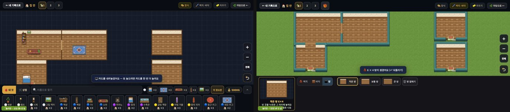
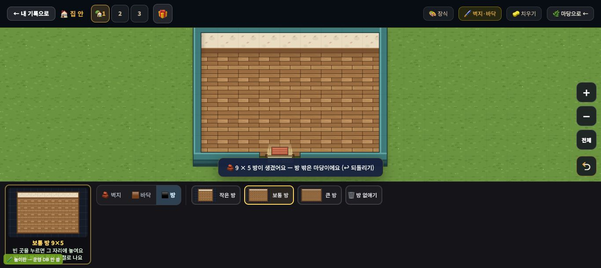
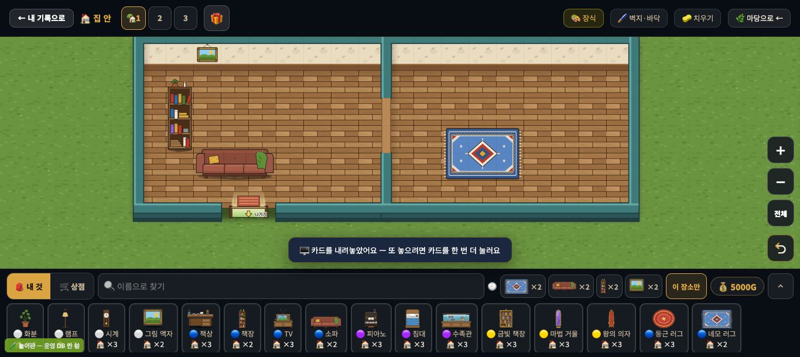
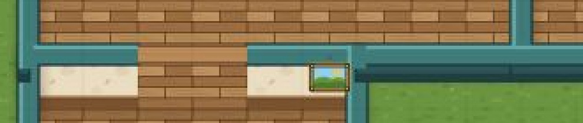
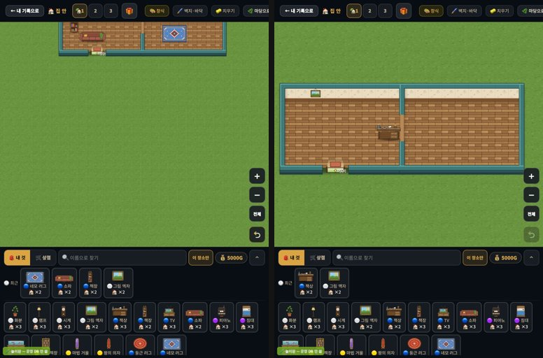

# 창조자의 눈 — 관찰 기록 54회: 집 안 되밟기 — 두꺼운 벽(#1036) · 집 안 규칙(#1038)

> 막 머지된 것부터 되밟았습니다. 대상은 **#1036 집 안 두꺼운 벽**(윗면·앞면 벽 · 벽이 끊긴 문 자리 · 아래벽 현관 · 방 밖은 마당 잔디 · 방을 만들면 방 둘레로 카메라 · 나가기 문은 묶음마다)과 **#1038 집 안 규칙**(방 밖엔 가구 안 놓임 · 나가기 발판 두 칸 비움 · 위아래 문 통로엔 벽걸이 안 걸림)입니다.
> 제 목록의 29-ⓑ62(벽 두께) · ⓑ63(문) · ⓑ64(빈 도면·카메라) · ⓑ65(벽걸이) · ⓒ63~65 를 48회와 같은 방으로 다시 쟀습니다.
> 본 판: main `aae40fe` · 저장소 꾸미기 놀이판 `play.mjs` 8784(가짜 프로젝트 · 오프라인 · '시험' 학생 자동 입장 — **운영 DB · 학생 실데이터 0**) · **코드 수정 0 · 화면 창 0** · 제 headless 크롬(GPU Metal) · firebase 요청 막음 · 끝나고 크롬과 놀이판을 껐습니다.
> 한 일(1366×610): 방 둘(보통 방 (4,3)·(4,12)) → 방 다섯(작은 방 A 밑 (10,3) · 오른쪽 (10,30) · (4,30)) → 가구·액자로 규칙 시험 → 768×1024 → 나갔다 다시 들어오기.
> 방 다섯은 세 번 돌렸습니다. 처음 두 번은 셋째 방부터 누를 칸이 화면에 없었고, 셋째 번에 [－](작게)를 써서 만들었습니다(2절).

## 한 줄
**집 안이 '톱다운 사무실'이 됐습니다 ✔.** 청록 두꺼운 벽이 방을 두르고, 방 사이 문은 벽이 끊긴 틈과 문턱으로, 현관은 아래벽에 뚫린 "↓ 나가기"로 보입니다. 방 밖은 어두운 빈 도면이 아니라 마당 잔디입니다.
**29-ⓑ62 · ⓑ63 · ⓑ64 닫힘 ✔.** 위아래로 붙인 방 사이에도 문이 나고, 떨어진 방마다 나가기 문이 생깁니다(방 다섯 → 문 둘 · 나가기 셋). 방을 만들면 카메라가 곧바로 방으로 갑니다(한 칸 27 → 47px).
새 규칙 말도 제자리에서 나옵니다 ✔ — "🌿 방 밖은 마당이에요" · "🚪 나가는 길이에요" · "🧱 벽에 걸려요".
남은 것은 둘입니다.
- 액자를 바닥에 놓으면 "**맨 윗줄이나** 방의 윗벽을 눌러"라고 하는데, 방이 있을 때 맨 윗줄은 "방 밖은 마당이에요"로 거절됩니다(ⓑ103).
- 방을 만들 때마다 카메라가 방에 딱 맞춰져, 다음 방을 붙일 빈 땅이 고르개 밑·화면 밖으로 밀립니다. [전체]도 방 둘레라 넓어지지 않습니다(ⓒ89).

---

## 1. 48회 ↔ 54회

**사실(1366 · '방 몫' = 보이는 판에서 방이 차지하는 넓이 · 48회는 어두운 빈 도면 비율)**

| | 48회 | 54회 |
|---|---|---|
| 방 없는 집 안 | 한 칸 27 | 한 칸 27 |
| 방 둘 · 만든 직후 | 빈 도면 79% · 한 칸 27 | **방 42% · 한 칸 47** · 둘레는 마당 잔디(어두운 빈 도면 0) |
| 방 둘 · 다시 들어온 뒤 | 빈 도면 39% · 한 칸 54 | 방 49% · 한 칸 54 |
| 방 다섯 · 만든 직후 | 빈 도면 68% · 한 칸 27 | 방 27% · 한 칸 28 |
| 방 다섯 · 다시 들어온 뒤 · [전체] | 빈 도면 58% · 한 칸 32 | 방 29% · 한 칸 31 |

- 첫 방을 누르면 곧바로 카메라가 방으로 갑니다(한 칸 27 → 47). 첫 방 알림 끝에 "— 방 밖은 마당이에요"가 붙습니다.
- 벽은 청록 윗면 + 앞면(두께)이 있고, 모퉁이에 속선이 없습니다.

**해석** 🟢 — 29-ⓑ62(벽 두께) · 29-ⓑ64(빈 도면·카메라) **닫힘 ✔**. 48회에 '아이가 가장 신나는 때(방을 막 만든 순간)'에 화면의 4/5 가 빈 도면이던 것이 풀렸습니다. 방 밖이 마당이라 "집 밖은 마당"으로 바로 읽힙니다.

## 2. 문 · 나가기 (29-ⓑ63) · 방을 더 붙이기 (ⓒ89)

![방 다섯 · [전체] — A|B 옆문 · A/C 위아래 문 · 나가기 문 셋(C 아래 · 오른쪽 두 방 각각)](img/round54/04_five_rooms_whole.jpg)

**사실**
- `_inRoomDoors`: 옆문 A|B(열 12 · 5~7행) + **위아래 문 A/C(9행 · 5~7열)** — 48회엔 옆문 하나뿐이었습니다.
- `_inExitSpots`: 나가기 문 **셋**(문으로 이어진 A·B·C 묶음 → C 아래 · 오른쪽 아래 방 · 오른쪽 위 방). 48회엔 문이 하나도 없는 방이 셋이었습니다.
- 오른쪽 두 방은 한 줄 떨어져 있어 붙은 방으로 안 셉니다(문 없음 · 나가기 문 따로). 위 방의 "↓ 나가기"가 가는 풀 띠를 사이에 두고 아래 방 윗벽을 마주봅니다(사실 · 줄 아님).
- 방을 더 붙일 때(1366):
  - 방 둘을 만들면 카메라가 방에 맞춰져 한 칸 47 이 됩니다.
  - 그러면 A 밑 (10,3)은 방 고르개 단추(`BUTTON.pk-seg-b`) 밑이고, 오른쪽 (10,30) · (4,30)은 화면 밖입니다.
  - 오른쪽 [전체](전체 보기)를 눌러도 한 칸 47 그대로입니다. 코드: 집 안의 '전체' = **방들 둘레**(`[INDOOR-ROOMS-1]`).
  - [－](작게) **한 번**(한 칸 38)이면 A 밑이 보여 방이 생깁니다. 셋째 방이 생기면 카메라가 세 방 둘레로 다시 맞춰지는데(한 칸 28), 이때는 오른쪽 두 자리도 닿았습니다.

**해석**
- 🟢 29-ⓑ63 **닫힘 ✔**. 위아래로 붙인 방에도 문이 나고, 떨어진 방마다 나가기 문이 생겨 "이 방엔 어떻게 들어가요?"가 사라졌습니다. 문은 벽이 끊긴 틈 + 문턱이라 '끊긴 벽'으로 읽힙니다(29-ⓒ63 의 걱정이 줄었습니다).
- 🟡 **ⓒ89.** 방을 만들 때마다 카메라가 방에 딱 맞춰집니다. 그래서 방을 더 붙일 빈 땅이 아래는 고르개 밑, 옆은 화면 밖으로 밀립니다. [전체]를 눌러도 넓어지지 않고, [－]를 눌러야 합니다. 아이가 [－]를 스스로 찾는지는 교실에서만 압니다.
- (사실 · 줄 아님) A/C 이음새 왼쪽에 벽 밖으로 작은 어두운 네모(한 칸 31 에서 약 8px)가 튀어나와 있습니다. T자 이음의 앞면 끝으로 보입니다.

## 3. 집 안 규칙 (#1038)

| 한 일 | 결과 | 말 |
|---|---|---|
| 첫 방 | 생김 | "🧱 9 × 5 방이 생겼어요 — 방 밖은 마당이에요 (↩ 되돌리기)" |
| 책상 · 방 밖 마당 (20,20) | 안 놓임 ✔ | "🌿 방 밖은 마당이에요 — 방 안에 놓아 주세요" |
| 책상 · 나가기 발판 셋 | 안 놓임 ✔ ×3 | "🚪 나가는 길이에요 — 문 앞 두 칸은 비워 두어요" |
| 소파 · 방 A·B 경계에 걸침 (6,10) | 안 놓임 ✔ | "🧱 벽에 걸려요 — 방 안에 다 들어가게 놓아 주세요" |
| 책장 · 소파 · 러그 · 침대 · 책상(방 안) | 놓임 ✔ | — |
| 액자 · 방 A 윗벽 (4,5) · 방 C 윗벽 문 옆 (10,8) | 놓임 ✔ | — |
| 액자 · 방 C 윗벽의 위아래 문 칸 (10,5) | 안 놓임 ✔ | "🖼️ 벽에 거는 거예요 — 위쪽 벽(맨 윗줄이나 방의 윗벽)을 눌러 걸어 주세요" — 화면에선 그 칸이 나무 통로라 맞음 |
| 액자 · 방 A 바닥 가운데 (7,7) | 안 놓임 | "🖼️ 벽에 거는 거예요 — 위쪽 벽(**맨 윗줄이나** 방의 윗벽)을 눌러 걸어 주세요" |
| 액자 · 판 맨 윗줄 (0,20) — 앞 말대로 | 안 놓임 | "🖼️ 방의 윗벽에 걸어 주세요 — **방 밖은 마당이에요**" |

- 벽걸이 표 `DECO_WALL` 은 여전히 `{"d_i4": 1}`(그림 액자 하나)입니다.
- 코드 읽기: 바닥을 누르면 먼저 `!_inIsWallRow` 검사가 옛 말("맨 윗줄이나 방의 윗벽")을 냅니다. `_inIsWallRow` 는 판 맨 윗줄을 여전히 벽 줄로 칩니다(#1038 — 옛 액자를 지키려고). 그 뒤 방이 있으면 맨 윗줄을 새 말로 거절합니다(`student.js` 벽걸이 검사 두 줄).

**해석**
- 🟢 새 규칙 셋이 모두 맞게 막고, 말도 까닭을 말합니다.
- 🟡 **ⓑ103.** 방이 있는 집에서 액자를 바닥에 놓으면, 첫 말이 "맨 윗줄이나 방의 윗벽"을 권합니다. 아이가 그 말대로 맨 윗줄(이제 마당)을 누르면 "방 밖은 마당이에요"로 다시 거절됩니다. 두 말이 서로 어긋납니다. 방이 있을 땐 첫 말이 "방의 윗벽"만 말하면 풀릴 것입니다(가설).
- 29-ⓑ65(벽걸이가 액자 하나) 그대로입니다.

## 4. 768×1024

**사실**
- 1366 에서 창 크기만 768×1024 로 바꾸면: 방 8~11% · 한 칸 26~30 · 방 윗부분(벽 띠)이 머리줄 밑으로 갑니다.
- 768 에서 나갔다 다시 들어오면: 방 26% · 한 칸 38 · 방이 가운데 섭니다.

**해석** — 768 에서 여는 아이는 괜찮습니다(다시 들어오기와 같은 길). 태블릿을 도중에 돌리면 다시 맞추지 않습니다(사실 · 줄 아님 · 48회 768 도 같은 길).

---

## 목록에 반영할 것 — 다음 '목록 모음' PR 에서

| 줄 | 후 |
|---|---|
| 29-ⓑ62 벽 두께 | **닫힘(#1036) ✔54회** — 청록 윗면·앞면 벽 · 모퉁이 속선 없음 |
| 29-ⓑ63 문 | **닫힘(#1036) ✔54회** — 위아래 문 A/C · 나가기 문 묶음마다(방 다섯 → 셋) |
| 29-ⓑ64 빈 도면 · 카메라 | **닫힘(#1036) ✔54회** — 만든 직후 방 42%(한 칸 47) · 둘레는 마당 잔디 |
| 29-ⓑ65 벽걸이 | 그대로(맡음) — `DECO_WALL` 액자 하나 |
| 29-ⓒ63~65 | 확인 — 54회: 벽·문·현관·방 밖 규칙으로 화면 쪽 받침은 섬 |
| **새 54-ⓑ103** | 방이 있는 집에서 액자를 바닥에 놓으면 "맨 윗줄이나 방의 윗벽"을 권하는데, 맨 윗줄은 "방 밖은 마당이에요"로 거절 — 두 말이 어긋남 · 말 · 열림(꾸미기 · #1038 추천) |
| **새 54-ⓒ89** | 방을 만들 때마다 카메라가 방에 맞춰져 다음 방 자리가 고르개 밑·화면 밖 · [전체]는 방 둘레 — 아이가 [－]를 찾나 · 구도 · 확인 |

# ⓐ 없음 · ⓑ 1(ⓑ103) · ⓒ 1(ⓒ89)

## 미검증 · 한계
- 1366×610 · 768×1024 두 크기, 마우스 누름만 봤습니다(두 손가락 · ✋ 옮기기는 안 봄).
- 방은 크기 칩 + 칸 누르기로만 만들었습니다(네모로 끌어 만들기 · 큰 방 · 방 없애기는 안 봄).
- '방 몫'은 방 목록과 칸→화면 셈으로 잰 넓이입니다. 48회 '빈 도면'(어두운 픽셀)과 잣대가 달라, 표의 두 칸은 뜻이 다릅니다.
- 집 안 사진은 놀이판의 '시험' 학생 것입니다.
- 통과는 조작·표시 길만 뜻합니다.
