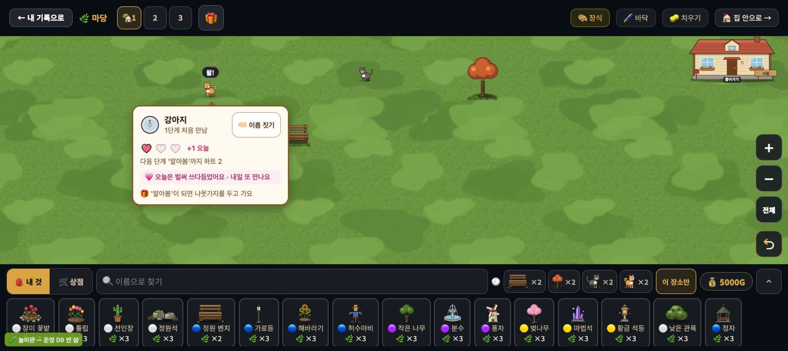
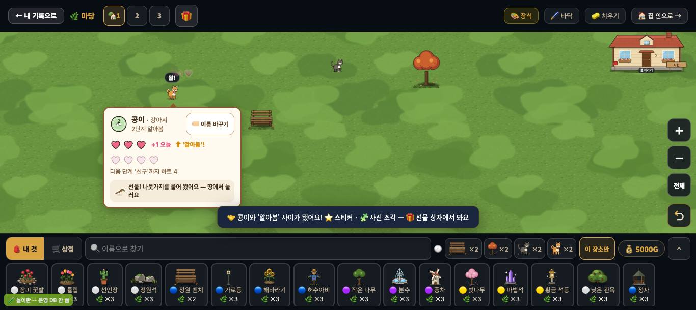
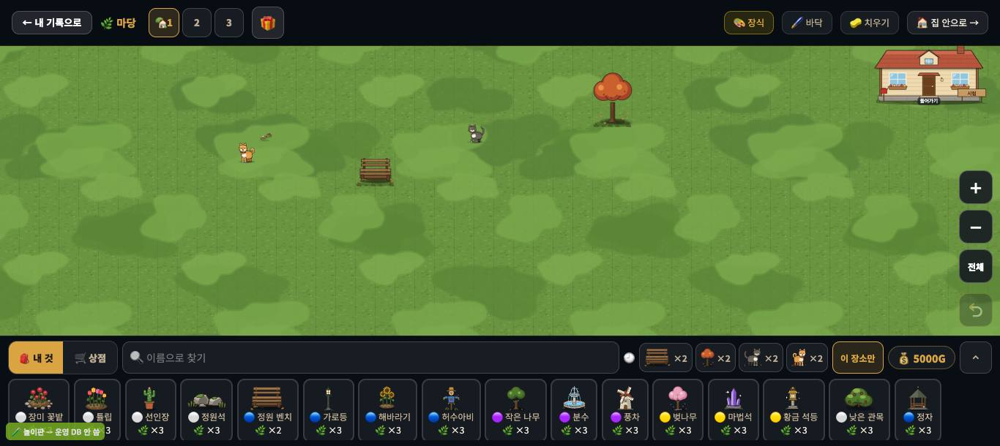
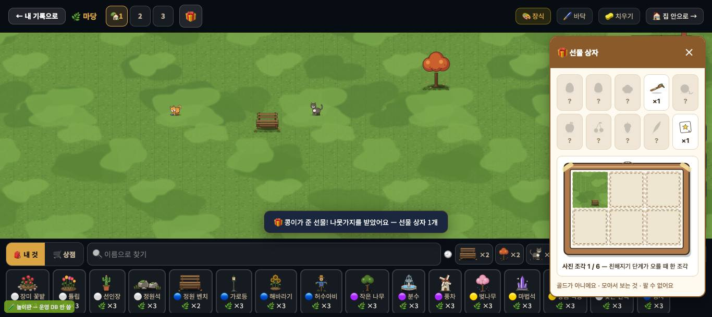

# 창조자의 눈 — 관찰 기록 55회: 고친 것 되밟기 — #1043 '▶ 생산 다시'(53-ⓐ7) · #1028 친해지기 다듬기(49-ⓑ97·98·99) · #1025 작은 선물

> 막 머지된 것 가운데 제 목록 줄을 고친 둘을 되밟았습니다.
> - **#1043**: '▶ 생산 다시'가 밭을 되살리게(53-ⓐ7).
> - **#1028**: 친해지기 다듬기(49-ⓑ97·98·99 · ⓒ85).
> - 그 사이 들어온 **#1025 작은 선물**도 같은 길에서 봤습니다.
>
> 본 판:
> - 마을: main `ec20925` 을 `git archive` 한 제 서버 8781 · `?sid=guest&stage=proto-flow` 새 프로필 · GPU(Metal) · firebase 요청 막음.
> - 꾸미기: 저장소 꾸미기 놀이판 `play.mjs` 8784(main `aae40fe` + 54회 문서 · #1025·#1028 들어 있음). 가짜 프로젝트 · 오프라인 · '시험' 학생 — **운영 DB · 학생 실데이터 0**.
> - **코드 수정 0 · 화면 창 0.** 끝나고 크롬 · 서버 · 놀이판을 모두 껐습니다.
>
> 잰 법은 53회 · 49회 스크립트 그대로입니다.
> - 마을: 4배속 · 판 속 시간으로 적음 · 판 속 하루 = 1배속 3분.
> - 친해지기: 날은 **제 headless 페이지 안에서만** `Date.now` 를 하루씩 당겼습니다(앱 파일 그대로 · 49회와 같음).

## 한 줄
**53-ⓐ7 닫힘 ✔.** 이틀 멈춘 뒤 '▶ 생산 다시'를 누르면, 판 속 약 11시간 뒤 수레가 곡식을 싣고 나갑니다(1배속 약 1분 20초). 다음 12시엔 여섯 집 모두 받습니다.
**49-ⓑ97·98·99 닫힘 ✔.** 같은 날 또 쓰다듬으면 "💗 오늘은 벌써 쓰다듬었어요 · 내일 또 만나요"가 뜹니다. 단계가 오른 날엔 다 찬 하트 줄이 남고, 알림은 "🤝 **콩이와** '알아봄' 사이가 됐어요!"입니다.
새로 본 **#1025 작은 선물**은 좋습니다(선물 상자 · "골드가 아니에요"). 그런데 단계가 오른 바로 그 쓰다듬기에서는, 카드가 "선물! 나뭇가지를 물어 왔어요 — **땅에서 눌러요**"라고 하는데 땅에 선물이 없습니다. 화면을 다시 그려야(나갔다 오기 등) 생깁니다(ⓑ104).

---

## 1. #1043 '▶ 생산 다시' (53-ⓐ7)

**사실(`__flow().만듦` = 밭이 만든 수)**

| | 멈춘 동안(판 속) | 53회(고치기 전) · 다시 뒤 하루 | **55회** · 다시 뒤 하루 |
|---|---|---|---|
| ㉮ 멈추자마자 다시 | 0.3시간 | 6 | 6 |
| ㉯ 반나절 멈췄다 다시 | 11시간 | **0** | **6**(9 → 15) |
| ㉰ 빈 가게까지 멈췄다 다시 | 이틀 | **0** · 7일 12시 받음 0/6 | 11시간 뒤 첫 수레 · **7일 12시 받음 6/0** |

- ㉰ 자세히:
  - 6일 12.6시 빈 가게(받음 4/2) → ▶ 생산 다시.
  - 6일 23.6시 밭 셋이 `moving`(짐 3) · 그날 밤~새벽 선반 2~3.
  - 7일 12시 받음 6/0.
  - `__protoMap().다시잡음` = 3(밭 셋의 '다음 때'를 지금 기준으로 다시 잡음).
- 다시 뒤 선반은 저녁까지 3 정도로 천천히 찹니다. 밭 셋이 8시간마다 하나씩 만들고, 가게는 12시에 6개를 씁니다(사실 · 줄 아님).
- 알림은 비 소식뿐입니다(53회와 같음).

**해석** 🟢 — 53-ⓐ7 **닫힘 ✔**. 수업 흐름 3판 '밭이 멈춘 날'에서 아이가 맞는 손잡이를 누르면, 다음 날 가게가 다시 찹니다. 다만 곡식이 다시 오기까지 1배속으로 1분 넘게 기다려야 하고, 그동안 말이 없습니다. 이것은 53회에 적은 '기다림'(L7 쪽)과 같은 결입니다.

## 2. #1028 친해지기 다듬기 (49-ⓑ97·98·99 · ⓒ85 · ⓒ86)

**사실(49회와 같은 강아지 · 같은 날 순서)**

| | 49회 | **55회** |
|---|---|---|
| 1일째 첫 쓰다듬기 | +1 💗 23ms | +1 💗 28ms |
| 1일째 또 | "왈!"만 · 카드 그대로 | "왈!" · 카드에 **"💗 오늘은 벌써 쓰다듬었어요 · 내일 또 만나요"** |
| 3일째(단계 오름) 하트 칸 | ○○○○○(모두 빔) | **♥♥♥ '+1 오늘' '⬆ 알아봄!'** 아래 새 줄 ♡♡♡♡ |
| 단계 알림 | "🤝 **강아지와** 한 걸음 더 가까워졌어요 — '알아봄'" | "🤝 **콩이와** '알아봄' 사이가 됐어요! ⭐ 스티커 · 🧩 사진 조각 — 🎁 선물 상자에서 봐요" |
| 다음 단계까지 | '친구'까지 하트 5(문턱 3·8·15·25) | '친구'까지 하트 4(문턱 **3·7·12·20** — #1028 · 보스 결정) |

**해석**
- 🟢 49-ⓑ97 · ⓑ98 · ⓑ99 **닫힘 ✔**.
  - "하루에 한 번 · 내일 또"가 벌이 아니라 약속으로 읽힙니다.
  - 단계가 오른 날 받은 하트가 남아 보입니다.
  - 지어 준 이름으로 부릅니다.
- 🟢 49-ⓒ85(스티커를 알아채나): 이제 단계 알림이 "🎁 선물 상자에서 봐요"라고 볼 곳을 말합니다. 화면 쪽 받침은 섰고, 아이가 실제로 여는지는 교실에서 봅니다.
- 49-ⓒ86(문턱이 교실 리듬에서 '가족'까지 가나): 문턱이 3·7·12·20 으로 낮아졌습니다(주 2회면 약 10주 — #1028 본문). 선물도 2단계부터 3일에 한 번 옵니다. 여전히 교실에서만 답이 납니다.

## 3. #1025 작은 선물 (새로 봄 · ⓑ104)

**사실**
- 1일째 카드: "🎁 '알아봄'이 되면 나뭇가지를 두고 가요" — 다음 선물 예고입니다.
- 3일째 단계가 오른 순간:
  - 카드에 "선물! 나뭇가지를 물어 왔어요 — 땅에서 눌러요"가 뜹니다.
  - 그런데 **땅에 선물 단추(`.deco-gift`)가 없습니다.** 카드가 닫힌 6.8초 뒤에도 없습니다(두 번 봄).
- 마당을 나갔다 다시 들어오면, 강아지 제자리 오른쪽에 나뭇가지(18×18px · 한 칸 27)가 생깁니다.
  - 누르면: "🎁 콩이가 준 선물! 나뭇가지를 받았어요 — 선물 상자 1개".
  - 머리줄 🎁 → 선물 상자: 열 칸(모르는 것은 '?') · 나뭇가지 ×1 · 스티커 ×1 · "사진 조각 1 / 6 — 친해지기 단계가 오를 때 한 조각" · "골드가 아니에요 · 모아서 보는 것 · 팔 수 없어요".
- **코드 읽기**(고치지 않음):
  - 땅의 선물은 마당 캔버스를 다시 그릴 때만 놓입니다(`drawDeco` → `_animSyncLayer` → `_lifeGiftSync`).
  - 쓰다듬기 처리는 카드만 열고 캔버스를 다시 그리지 않습니다.
  - 그래서 화면을 옮기거나 · 키우거나 · 무엇을 놓거나 · 다시 들어오기 전까지는 땅이 비어 있을 것입니다.
- 선물은 그날 안 받으면 없어집니다(쌓이지 않음 · 벌 아님 — 코드 주석).

**해석**
- 🟢 선물 상자는 좋습니다. '?' 칸이 "무엇이 더 있을까"를 부르고, "골드가 아니에요"가 경제와 선을 긋습니다. 사진 조각 6칸은 '다음에 또 올 까닭'이 됩니다.
- 🟡 **ⓑ104.** 단계가 오른 쓰다듬기는 아이가 가장 신나는 순간입니다. 그때 카드는 "땅에서 눌러요"라고 하는데, 땅을 봐도 선물이 없습니다. 이 강아지는 단계가 오른 날이 마침 선물 날이었습니다(선물 날은 친구마다 날이 어긋남). 다른 친구도 선물 날에 카드가 뜨면 같은 일이 날 수 있습니다(가설).
- (가설) 선물이 18px 라 터치 크롬북에선 찾기·누르기가 작을 수 있습니다 → ⓒ90.

---

## 목록에 반영할 것 — 다음 '목록 모음' PR 에서

| 줄 | 후 |
|---|---|
| 53-ⓐ7 '▶ 생산 다시' | **닫힘(#1043) ✔55회** — 11시간 멈춤 뒤 하루 6번(전 0) · 이틀 멈춤 뒤 11시간에 첫 수레 · 다음 12시 받음 6/0 |
| 49-ⓑ97 같은 날 또 | **닫힘(#1028) ✔55회** — "💗 오늘은 벌써 쓰다듬었어요 · 내일 또 만나요" |
| 49-ⓑ98 단계 오른 날 하트 칸 | **닫힘(#1028) ✔55회** — 다 찬 옛 줄 + '+1 오늘' + '⬆ 알아봄!' + 새 줄 |
| 49-ⓑ99 이름으로 | **닫힘(#1028) ✔55회** — "🤝 콩이와 '알아봄' 사이가 됐어요!" · 선물 알림도 "콩이가 준 선물" |
| 49-ⓒ85 스티커 | 확인 — #1028 단계 알림에 "🎁 선물 상자에서 봐요" · 상자에 스티커 ×1(화면 쪽 받침 ✔) |
| 49-ⓒ86 문턱 | 확인 — 문턱 3·7·12·20(#1028 · 보스 결정) · 선물 2단계부터 3일마다(#1025) |
| **새 55-ⓑ104** | 단계가 오른 쓰다듬기에서 카드는 "선물! … 땅에서 눌러요"인데 땅에 선물이 안 그려짐(캔버스를 다시 그릴 때까지) · 말 · 열림(꾸미기 · #1025 추천) |
| **새 55-ⓒ90** | 18px 선물을 아이가 땅에서 찾아 누르나(터치) · 그날 안 받으면 사라지는 것을 아쉬워하나 · 손맛 · 확인 |

# ⓐ 없음 · ⓑ 1(ⓑ104) · ⓒ 1(ⓒ90)

## 미검증 · 한계
- 친해지기의 날은 제 페이지에서 `Date.now` 를 당겨 바꿨습니다. 그래서 '선물이 안 그려짐'은 **단계가 오른 그 쓰다듬기**에서만 확인한 것입니다. 선물 날 아침에 처음 들어오는 아이는 들어올 때 다시 그리므로 선물이 보일 것입니다(코드 읽기).
- 강아지 한 마리 · 1366 한 크기 · 마우스만 봤습니다. 고양이 털실 공 · 닭 달걀 선물은 안 봤습니다.
- 마을 쪽은 proto-flow 한 판 · 4배속입니다.
- 통과는 조작·표시 길만 뜻합니다.
