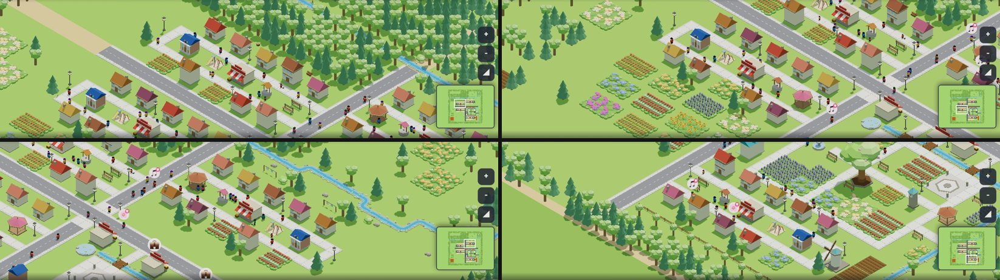
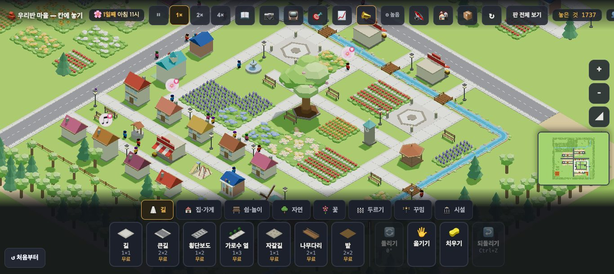
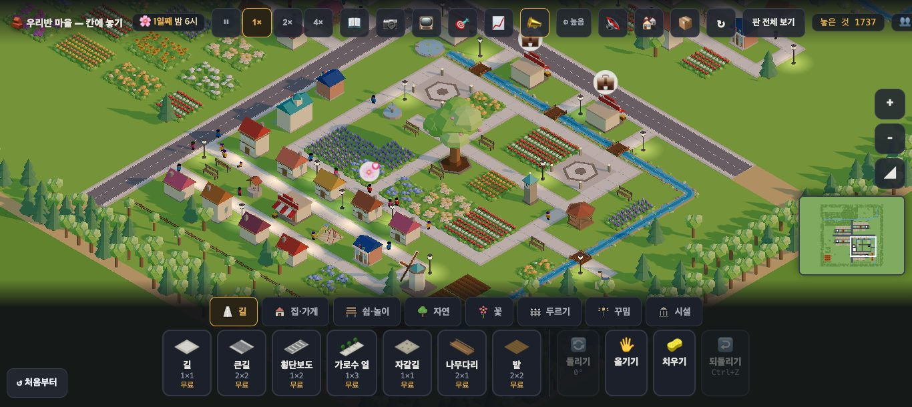
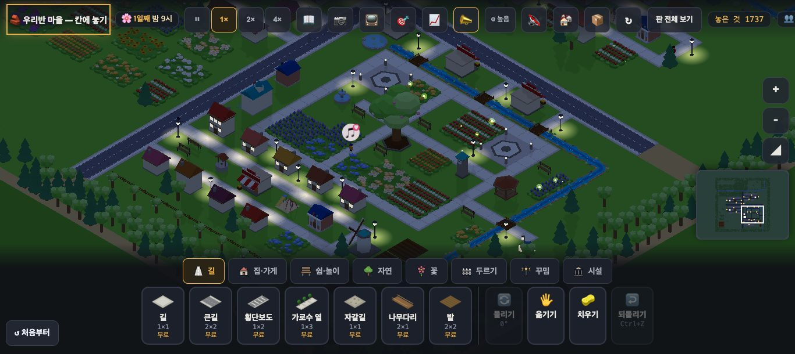
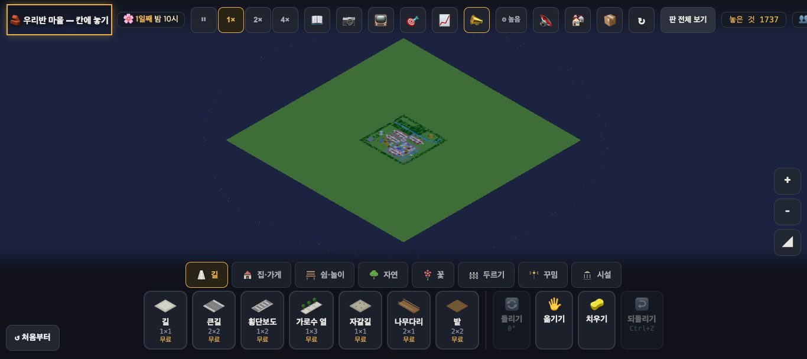

# 창조자의 눈 — 관찰 기록 56회: 원본 6차(#1046 네 동네 성격) · 밤 창 불(#1034) · 귀가(#1050) · 밤 미니맵(#1040)

> 막 머지된 원본 마을 네 가지를 '우와' 잣대로 되밟았습니다.
> - **#1046 원본 6차**: 네 동네가 제 성격(꽃 · 숲 · 물가 · 과수원) · 집 뒤만 바꿈 — 30-ⓑ68 '네 구역이 같은 틀'.
> - **#1034**: 창 불은 사람이 돌아와야 환하게.
> - **#1050**: 집까지 걸리는 만큼 먼저 나선다(도착 목표 아이 18.5시 · 어른 20시).
> - **#1040**: 밤의 미니맵 · 판 전체 보기.
> - 덤으로 38-ⓑ89(공원 쉼터)를 50회와 같은 방법으로 다시 셌습니다(#1026 쉼터 그늘 · 상한 뒤).
>
> 본 판: main `178ba27` 을 `git archive` 한 제 서버 8781 · `?sid=guest&stage=origin` 새 프로필 · **코드 수정 0 · 화면 창 0** · GPU(Metal) · 그림자 보임(낮 사진) · firebase 요청 막음 · 1366×610.
> 잰 법:
> - 동네: 30-ⓑ68 의 '재는 법'대로 **구역마다 물건 구성**을 셌습니다(집 네 묶음 둘레 · 길·집·가로등 뺌). 카메라는 `__miniClick`(미니맵 누름과 같음)으로 옮겼습니다.
> - 밤: `__setHour(17)` 뒤 **1배속**으로 22.3시까지 1초마다 `__homeLight()` · `__folkPos()` 를 셌습니다.
> - 오후: 50회와 같이 `__setHour(14)` 뒤 1배속 64초.

## 한 줄
**네 동네가 이제 서로 다릅니다 ✔(30-ⓑ68 닫힘).** 한 동네는 집 뒤가 숲, 한 동네는 꽃밭, 한 동네는 개울, 한 동네는 울타리입니다. 집·골목·시설 띠는 같은 틀입니다(뜻한 것).
**밤이 '사람이 돌아와서' 밝아집니다 ✔.** 17시엔 34채가 모두 은은하고, 돌아온 만큼 하나씩 환해집니다(18.8시 12채 → 20.4시 32채 → 22시 34채). 21시에 밖에 있는 사람은 10명입니다(#1050 전 조사: 48명). 미니맵도 밤빛입니다.
남은 것:
- 공원 한가운데는 여전히 한두 명뿐입니다(38-ⓑ89 일부 그대로).
- 판 전체 보기에서는 마을이 넓은 땅 가운데 화면의 약 1% 조각입니다(ⓒ91).

---

## 1. 네 동네 (30-ⓑ68)

**사실(집 네 묶음 둘레의 물건 · 많은 것부터)**

| 동네(집 수) | 물건 구성 |
|---|---|
| 숲(8) | 큰나무 15 · 나무 13 · 꽃 8 · 통나무 2 · 그루터기 1 |
| 꽃(9) | **꽃 네 가지 16** · 큰나무 2 · 나무 2 |
| 물가(8) | 꽃 8 · 큰나무 5 · 나무 5 · 덤불 3 · **빨래줄 2 · 바위 2** · 개울(묶음 둘레 밖으로 굽이침) |
| 울타리(9) | 꽃 26 · **울타리 8** · 큰나무 2 · 나무 2 |

- 필요 시설(도서관 · 놀이터 · 가게 등)은 네 동네가 같은 틀입니다(#1046 '집·골목·마당 띠는 한 칸도 안 옮김').
- 첫 화면(시작 칸 · 공원)에는 두 동네가 보이고, 나머지 둘은 옮겨 가야 보입니다.
- 원본에 우물이 아직 있습니다(🚱 우물 폐기는 🏥 엔진 때 — 사실 · 줄 아님).

**해석** 🟢 — 30-ⓑ68 **닫힘 ✔**. 네 동네의 집 뒤가 각각 숲·꽃·물·울타리라서, 아이가 "숲 동네에 살래", "개울 동네 집이 좋아"처럼 **어느 동네인지 이름을 붙일 수 있습니다**. 집·길의 틀이 같은 것은 '같은 규칙의 마을'로 읽혀 오히려 좋습니다.

## 2. 밤 — 창 불 · 귀가 · 미니맵 (#1034 · #1050 · #1040)

**사실(1배속 · 1초마다 · 34채 · 75명)**

| 시 | 환한 집(나머지는 은은) | 밖에 있는 사람 |
|---|---|---|
| 17.2 | 0 | 63 |
| 18.4 | 5 | 44 |
| 18.8 | 12 | 37 |
| 20.0 | 23 | 23 |
| 20.4 | 32 | 12 |
| 21.3 | 33 | 10 |
| 22.1 | **34** | 7 |

- 창이 켜진 집은 17시부터 34채 모두인데, 사람이 없으면 은은(현관등)하고 한 명이라도 들어오면 환해집니다(`__homeLight`).
- #1050 본문의 전 조사: 21시 48명이 귀갓길 · 23시에도 19명. 지금은 21시 10명 · 22시 7명입니다.
- `__nightMap()`: 켜짐 · 밤 1 · 지도판색 `#818ebf`. 21시 미니맵이 어둡고 가로등이 점으로 보입니다.

**해석** 🟢 — 밤 마을이 '해가 져서 켜진 창'이 아니라 **'사람이 돌아와서 켜진 창'**이 됐습니다. 18~20시에 창이 하나씩 켜지는 모습 자체가 "우리 집에도 사람이 왔다"를 말해 줍니다. 교실 TV 로 해질녘을 1배속으로 보여 주면, 약 15초(판 속 18.4 → 20.4시) 사이에 거리가 차례로 밝아집니다.

## 3. 오후 쉼터 (38-ⓑ89 · #1026)

**사실(50회와 같은 잣대 · 1366)**

| | 50회(#1019 뒤) | **56회**(#1026 뒤) |
|---|---|---|
| 14~18시 공원 6칸 안 평균(최대) | 3.7 | 2.1(3) |
| 14~18시 공원 곁 자리 | 1.9 | 0.6(1) |
| 14~18시 마을 전체 앉음 평균(최대) | 3.4(6) | 3.6(6) |
| 18시 뒤 마을 전체 앉음 | 0.6(3) | 0 |
| 산책 나섬 · 들어감(끝) | 37~45 · 16~25 | 22 · 10 |
| 쉼터 수 · 모인쉼터 | 14 · 0 | **20** · 0 |

- `__stroll().상한` 57 — 마을 전체 상한(한꺼번에 산책하는 사람 수 · #1026)에 걸려 산책을 미룬 횟수입니다(코드).

**해석** 🟡 — 쉼터는 20곳으로 늘었지만, 상한으로 한꺼번에 나서는 사람이 줄어 공원 한가운데는 한두 명입니다. 여럿이 모여 앉은 쉼터는 아직 없습니다. 38-ⓑ89 는 **일부** 그대로입니다. 18시 뒤엔 모두 집으로 갑니다(#1050 — 뜻한 것).

## 4. 판 전체 보기 (ⓒ91)

**사실**
- 판 전체 보기에서 원본 마을은 가로 약 145px · 세로 약 80px 마름모입니다. 1366 화면에서 약 1% 입니다.
- 44회 사진(37-ⓑ88 되밟기)도 같았습니다(새로 생긴 것 아님). 밤엔 땅이 어두운 초록입니다.

**해석** — '판 전체 보기'는 이름 그대로 **판 전체**(잠긴 땅까지)를 보여 줍니다. 아이가 이 단추를 "우리 마을 전체 보기"로 누르면 들판 가운데 작은 점을 보게 됩니다. 이것이 "땅이 이렇게 넓구나"로 읽힐지, "마을이 안 보여요"로 읽힐지는 교실에서만 압니다 → **ⓒ91**.
(가설) 한 번 더 누르면 '마을 둘레'에 맞추는 식이면 두 뜻을 다 받칠 것입니다.

---

## 목록에 반영할 것 — 다음 '목록 모음' PR 에서

| 줄 | 후 |
|---|---|
| 30-ⓑ68 네 구역이 같은 틀 | **닫힘(#1046) ✔56회** — 숲(나무 28·통나무) · 꽃(꽃 네 가지 16) · 물가(빨래줄·바위·개울) · 울타리(울타리 8) · 시설 띠는 같음(뜻한 것) |
| 38-ⓑ89 공원 쉼터 | **일부** 그대로 — 56회: 쉼터 14→20 · 공원 안 2.1 · 모인쉼터 0 · 상한 57 |
| **새 56-ⓒ91** | 판 전체 보기에서 원본 마을이 화면의 약 1%(넓은 잠긴 땅 가운데) — 아이가 '우리 마을 전체'로 읽나 '빈 들판'으로 읽나 · 구도 · 확인 |

# ⓐ 없음 · ⓑ 없음 · ⓒ 1(ⓒ91)

## 미검증 · 한계
- 1366 한 크기입니다(1920 교실 TV 는 안 봄).
- 밤·오후는 1배속 한 번씩입니다(산책 차례는 날마다 다를 수 있음).
- 동네 구성은 제가 정한 네 묶음 둘레(집 둘레 ±2~3칸)로 셌습니다. 과일나무 줄은 묶음 둘레 밖(동쪽 과수원 쪽)이라 안 잡혔을 수 있습니다.
- '밖에 있는 사람'은 `__folkPos` 의 상태가 'inside' 가 아닌 사람입니다(일하는 중·걷는 중 모두).
- 통과는 조작·표시 길만 뜻합니다.
