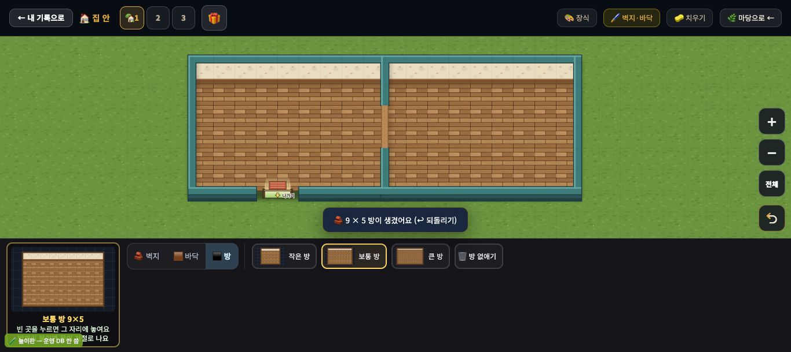
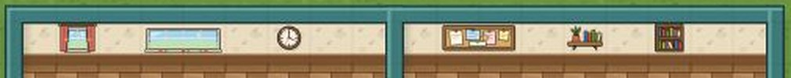
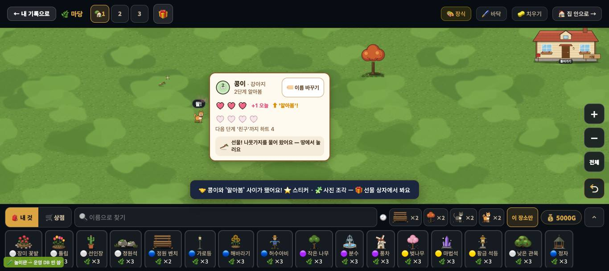
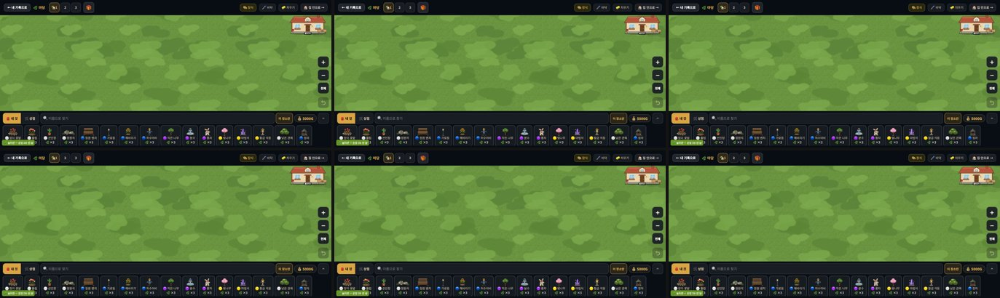

# 창조자의 눈 — 관찰 기록 57회: 꾸미기 집 안 되밟기 — #1042 새 9종 · #1054 작은 넷 · #1049 그림 묶음

> 보스 제안대로 꾸미기 집 안을 아이처럼 되밟았습니다.
> - **#1042 새 9종**: 벽걸이 여섯 · 긴 탁자 · 의자 둘.
> - **#1054 작은 넷**: 벽걸이 안내 '방의 윗벽' 하나 · 방 둘레 여백 · 쓰다듬어 생긴 선물이 곧바로 땅에 · 선물 누르는 자리 44px.
> - **#1049 그림 묶음**(DECO-BUNDLE-1): 첫 그림이 빨라졌는지.
> - 대상 줄: 54-ⓑ103 · 54-ⓒ89 · 55-ⓑ104 · 55-ⓒ90 · 29-ⓑ65.
>
> 본 판: main `ed24e9d` · 저장소 꾸미기 놀이판 `play.mjs` 8784(가짜 프로젝트 · 오프라인 · '시험' 학생 — **운영 DB · 학생 실데이터 0**). 묶음 전 판(`3c03463` · #1048)은 같은 놀이판을 8785 에 띄워 견줬습니다.
> **코드 수정 0 · 화면 창 0** · 제 headless 크롬(GPU Metal) · firebase 요청 막음 · 1366×610 · 끝나고 크롬 · 놀이판 둘을 모두 껐습니다.
> 잰 법은 54·55회 스크립트 그대로입니다(방 둘 → 방 다섯 · 액자 · 친해지기 3일째 단계 오름 — 날은 제 페이지에서만 `Date.now` 를 당김).

## 한 줄
**넷 다 닫힙니다 ✔.**
- 액자를 바닥에 놓으면 "방의 윗벽을 눌러 걸어 주세요" 하나만 나옵니다(ⓑ103).
- 방을 만든 뒤에도 옆·아래 빈 땅이 보여, 방 다섯을 **[－] 없이** 만들었습니다(ⓒ89 · 54회엔 [－] 한 번).
- 단계가 오른 그 쓰다듬기에서 선물이 **곧바로** 땅에 통통 · 반짝 나타납니다(ⓑ104).
- 선물을 누르는 자리는 44×44px 입니다(그림은 18px 그대로 · ⓒ90).

**새 벽걸이 여섯이 벽 띠에 걸립니다 ✔(29-ⓑ65 닫힘).** 커튼 창 · 긴 창 · 벽시계 · 게시판 · 벽 선반 · 걸이 책장. 긴 탁자에 의자 둘을 앉히면 '사무실·교실' 느낌이 납니다.
**그림 묶음 ✔** — 꾸미기를 열 때 서버 요청이 73 → 7 입니다. 다만 제 놀이판(같은 컴퓨터 안 서버)에선 전·후 모두 250ms 안에 다 그려져 체감 차이는 없습니다. 차이는 먼 서버(교실 와이파이)에서 날 자리입니다.

---

## 1. 방 둘레 여백 (54-ⓒ89)

**사실(1366 · 보통 방 9×5 둘 → 작은 방 셋)**

| | 54회(#1036) | **57회**(#1054) |
|---|---|---|
| 첫 방 만든 직후 한 칸 · 방 몫 | 47px · 21% | 37px · 13% (양옆 여백 13.5 / 14.5칸) |
| 방 둘 만든 직후 | 47px · 42% | 37px · 26% (양옆 9 / 10칸 · 방 아래 한 칸 = 판) |
| 셋째 방(A 밑 10,3) 자리 | 고르개 단추 밑 → [－] 1번 | **바로 보임 · [－] 0번** |
| 넷째·다섯째(오른쪽 10,30 · 4,30) | 셋째 뒤 닿음 | [－] 0번(셋째 뒤 한 칸 24px) |

- 방 둘 뒤 (10,30) 한 곳만 오른쪽 ↩ 되돌리기 단추 밑이었습니다(오른쪽 끝). 셋째 방 뒤엔 닿았습니다.
- 문 · 나가기 문은 54회와 같습니다(옆문 A|B · 위아래 문 A/C · 나가기 셋).

**해석** 🟢 — 54-ⓒ89 의 화면 쪽은 풀렸습니다. 방을 만든 순간 방이 조금 작아졌지만(한 칸 47 → 37), 둘레 마당이 보여 "여기에 방 하나 더"를 바로 누를 수 있습니다. 아이가 [－]를 찾을 일이 줄었습니다.

## 2. 벽걸이 · 새 가구 (54-ⓑ103 · 29-ⓑ65)

![방 다섯 · 벽걸이 여섯 · 긴 탁자와 의자 둘 · [전체]](img/round57/02_five_rooms_furnished.jpg)

| 한 일 | 결과 | 말 |
|---|---|---|
| 액자 · 방 A 바닥 | 안 놓임 | "🖼️ 벽에 거는 거예요 — **방의 윗벽**을 눌러 걸어 주세요" |
| 벽시계 · 방 B 바닥 | 안 놓임 | 같음 |
| 액자 · 판 맨 윗줄(방 밖) | 안 놓임 | "🖼️ 방의 윗벽에 걸어 주세요 — 방 밖은 마당이에요" |
| 커튼 창 · 긴 창 · 벽시계(A 윗벽) | 놓임 ✔ ×3 | "✅ 🪟 커튼 창을 놓았어요" 등 |
| 게시판 · 벽 선반 · 걸이 책장(B 윗벽) | 놓임 ✔ ×3 | — |
| 긴 탁자(4×2) · 의자(뒤) · 의자(앞) | 놓임 ✔ ×3 | — |

- 벽걸이 표 `DECO_WALL` = 7(액자 + 새 여섯).

**해석** 🟢
- 54-ⓑ103 **닫힘 ✔**. 두 말이 이제 같은 곳('방의 윗벽')을 가리킵니다.
- 29-ⓑ65 **닫힘 ✔**. 벽에 걸 것이 일곱 가지가 되어, 벽 띠가 '방마다 다른 벽'이 됩니다(창 달린 방 · 게시판 방).
- 긴 탁자 + 앞뒤 의자는 모둠 책상처럼 읽힙니다. 교실 아이들이 "우리 반 교실"을 꾸밀 것 같습니다(가설 · 교실에서 봄).

## 3. 선물 (55-ⓑ104 · ⓒ90)

**사실(55회와 같은 강아지 · 같은 순서)**
- 3일째 쓰다듬기 직후, 나가지 않아도 `.deco-gift` 가 있습니다(class `deco-gift pop` — 처음 나타날 때 통통 · 반짝).
- 누르는 자리 **44×44px** · 그림 18×18px · 카드와 겹치지 않음.
- 누르면 "🎁 콩이가 준 선물! 나뭇가지를 받았어요 — 선물 상자 1개" · 선물 상자 나뭇가지 ×1 · 스티커 ×1 · 사진 조각 1/6.
- 첫 반응 +1 💗 19ms · 단계 알림은 55회와 같습니다.

**해석** 🟢
- 55-ⓑ104 **닫힘 ✔**. "땅에서 눌러요"라는 말과 땅의 선물이 같은 순간에 있습니다.
- 55-ⓒ90 은 화면 쪽이 섰습니다(44px). 아이가 찾아 누르는지는 교실에서 봅니다.

## 4. 그림 묶음 (#1049)

**사실(🌸 꾸미기를 누른 때부터 약 5초 · 두 번씩 같은 값)**

| | 묶음 전(`3c03463`) | 묶음 뒤(`ed24e9d`) |
|---|---|---|
| 서버에 간 요청 | **73**(꾸미기 그림 61 · 글꼴 6 · 바닥 등) | **7**(묶음 `bundle/art.json` 1 · 글꼴 6) |
| 브라우저 안에서 푼 그림(blob) | 0 | 67 |
| 꾸미기 그림이 다 온 때 | 마당을 누른 뒤 약 18ms | 마당을 누르기 **전**(🌸 꾸미기를 열 때 받아 둠) |
| 마당 첫 화면(250ms) | 다 그려짐 | 다 그려짐 |

**해석** — 🟢 요청 73 → 7 은 PR 본문과 같습니다. 제 놀이판은 같은 컴퓨터 안의 서버라 기다림이 거의 없어 **체감 차이는 없습니다**(두 판 모두 250ms 에 끝). 요청 한 번마다 시간이 드는 교실 와이파이 · 먼 서버에서 줄어든 66번이 드러날 것입니다(가설 · 교실 크롬북에서만 잴 수 있음).

## 덧 — 해 질 녘 거리(보스 요청 · 56회 수로)
56회(#1055)에 잰 수로 답합니다(원본 · 1배속 · 75명).
- 밖에 있는 사람: 17.2시 63 → 18.4시 44 → 20시 23 → 21.3시 10 → 22.1시 7.
- 18.5시 사진에선 거리에 집으로 가는 사람들이 있고, 돌아온 집 앞부터 불빛 웅덩이가 하나씩 생깁니다.
- 🟢 **자연스럽습니다.** 해 질 녘(18~20시)엔 거리가 붐비다가 21시쯤 대부분 집에 듭니다. #1050 전에는 21시 48명 · 23시 19명이 길에 있어 '밤늦게까지 헤매는 마을'이었습니다.
- (가설) 21시 뒤 남은 7~10명은 멀리서 오는 사람이거나 일하는 사람일 것입니다(누군지는 안 가려 봄).

---

## 목록에 반영할 것 — 다음 '목록 모음' PR 에서

| 줄 | 후 |
|---|---|
| 54-ⓑ103 벽걸이 말 | **닫힘(#1054) ✔57회** — 바닥엔 "방의 윗벽을 눌러" 하나 · 맨 윗줄은 "방 밖은 마당이에요" |
| 54-ⓒ89 방 더 붙일 자리 | 확인 — #1054 둘레 여백(양옆 9~14칸 · 아래 한 줄) · 방 다섯 [－] 0번(화면 쪽 ✔57회) |
| 55-ⓑ104 선물이 땅에 없음 | **닫힘(#1054) ✔57회** — 단계 오른 즉시 `.deco-gift pop` |
| 55-ⓒ90 18px 선물 | 확인 — #1054 누르는 자리 44×44 · 통통·반짝(화면 쪽 ✔57회) |
| 29-ⓑ65 벽걸이 하나 | **닫힘(#1042) ✔57회** — 벽걸이 일곱(`DECO_WALL` 7) · 여섯 모두 방 윗벽에 놓임 |

# ⓐ 없음 · ⓑ 없음 · ⓒ 없음

## 미검증 · 한계
- 1366 한 크기 · 마우스만 봤습니다(768 · 폰 · 터치는 안 봄).
- 그림 묶음은 같은 컴퓨터 안 서버에서 쟀습니다. 교실 와이파이의 시간 차는 재지 못했습니다.
- 친해지기 날은 제 페이지에서 `Date.now` 를 당겨 바꿨습니다(55회와 같음).
- 통과는 조작·표시 길만 뜻합니다.
